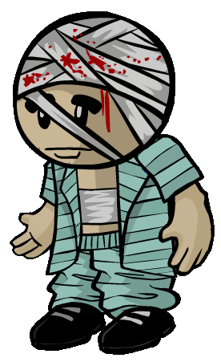

# Amnesiac

- **Facción:** Neutral  · *fase posterior (referencia)*
- **Página de la wiki:** Amnesiac (ToS)

## Ficha

**Clase (alineamiento):**

> Neutral Benign

**Resumen:**

> You are a trauma patient that does not remember who they were.

**Objetivo:**

> Remember who you were and complete that role's goal.

**Si hay Godfather/otro objetivo:**

> Select a dead player in the graveyard. You will remember their exact role. You may not select Stoned or Cleaned players.

**Gana con:**

> Team and allies of chosen target.

**Debe matar para ganar:**

> Enemies of chosen target.

**Resultado Investigator:**

> Classic Results
> Your target could be a .
> Coven Expansion Results
> Your target could be a .

**Resultado Consigliere:**

> Your target does not remember their role. They must be an Amnesiac.

## Texto completo de la wiki

| 

Amnesiac 

(Amne)

Alignment

 Neutral Benign

Avatar

Immunities

None

Actions

Target other

Select a dead player in the graveyard. You will remember their exact role. You may not select Stoned or Cleaned players.

Investigation Results

 Sheriff

You cannot find evidence of wrongdoing. Your target is innocent or great at hiding secrets!

 Investigator

Classic Results

Your target could be a Survivor, Vampire Hunter, or Amnesiac.

 Coven Expansion Results

Your target could be a Survivor, Vampire Hunter, Amnesiac, Medusa, or Psychic.

 Consigliere

Your target does not remember their role. They must be an Amnesiac.

Game Information

Summary

You are a trauma patient that does not remember who they were.

Abilities

None.

Attributes

None.

Goal

Remember who you were and complete that role's goal.

 Victory Conditions

 | Wins with

 | Must kill

 | Town

 Survivor

 | Enemies of chosen target.

 | 

 | DISCLAIMER: These stories are fanmade, and are not created or endorsed in any way by BlankMediaGames or Digital Bandidos.

At the graveyard past the meadows of Salem, amidst the broken gravestones and drooping willow trees, a man strolls along a path every day. Nobody knows him or whatever he came here for, and he knows nobody— not even himself. Past the narrow path, he looks down to each crumbling slab of rock, at the worn names and chiselled last words from people whose faces he’s never known. His clothes are ragged as his memories are shattered, and sometimes he imagines himself lying in the graveyard, under a different face, under a different name that wasn’t written on him.

And one night, under the round moon, he stumbles over one fresh gravestone that wasn’t there the night before. Sifting aside the dirt, he reads a name and smiles at a jolt across his mind.
He knows where he left off, and it’s time for him to get back down to business.

Mechanics[]

At night, you may select a dead player's role from the graveyard to remember yourself as. You will always become the true role of your target, despite any Forger changes.

When choosing a player to remember, the players will appear alphabetically, not in the order in which they died. 
An example of remembering a role ( Consigliere).

This ability is assumed to be Astral since Tracker cannot see the Amnesiacs visit the dead player, and they will not die to a dead Pestilence, unlike the Necromancer.

However, you can still die to a Werewolf's Rampage if a Coven Leader/ Witch controls you to a Werewolf's target.

The role you remembered will be announced for everyone to see at the start of the following day.

If multiple Amnesiacs choose to remember any Unique Role, the Amnesiac who joined the lobby first will succeed, while the others will fail.

You are unable to select roles of players who have been cleaned by a Janitor or stoned by a Medusa.

If you are killed the same night you attempt to remember a role with a defense value, you will still die as an Amnesiac due to your low priority.

If you remember yourself as the Godfather when all Mafia members are dead, you will instead remember yourself as a Mafioso and the Town will see this. If there's at least one Mafia member alive, then you will become the Godfather, as long as that only Mafia member isn't another Godfather.

Even after you successfully become Godfather, you can still get "promoted" to Mafioso after the current Mafioso dies. Due to a bug, the game does not see the Amnesiac-turned- Godfather as a kill capable Mafia role.

If you remember yourself as the Coven Leader when there's one or more Coven members alive, you are guaranteed to inherit the Necronomicon once the member who currently possesses it dies.

If you remember yourself as Pestilence, you will instead remember yourself as a Plaguebearer and the Town will see this. However, you will become Pestilence the following night.

 Pestilence will not attack you if you attempt to remember their role, since you remembering a role isn't considered a visit.

Although Amnesiacs are seen as innocent to the Sheriff, if you remember yourself as a member of the Mafia (not the Godfather), Coven (without the Necronomicon), a Serial Killer, or a Werewolf (on a Full Moon), you will be seen as suspicious by them.

If you are role blocked or controlled into someone who did not die, you will be unable to remember a role.

Being controlled into yourself announces to the Town that an Amnesiac has remembered being an Amnesiac.

If you are controlled into someone who died the same Night, you will will be forced to become that players role.

Strategy[]

Revealing as an Amnesiac early in the game is risky. It might prevent you from becoming a target if you join the winning team, but it eliminates your anonymity (and most of the fun) if you choose an evil role. Note: If you reveal and announce you will claim to be a Survivor or Guardian Angel the next night, you are almost guaranteed a win, if you indeed become a Survivor or Guardian Angel.

The only threats that would visit you are the Vampires, since they usually want to convert you to join their faction, thus preventing you from being an extra vote to another faction, as well as allowing you to win while dead. Of course, Vampires can be blocked through your vest.

Try not to talk too much or make yourself a target before you pick a role. You do not want Investigators finding out who you are if you are picking an evil role; nor do you want to be killed by the Mafia or Serial Killer at the night before or, worse, the night you choose a role to remember that you were like.

If you reveal that you are an Amnesiac to one team, it would be in your best interest to earn their trust and protection by remembering that you were like a role that places you on their side. If you do reveal and remember an opposing role, like the Mafia or a Neutral Killing, you place yourself at a great risk of getting killed.

If you survive long enough, you can remember that you were like an Arsonist the last night of the game and win in the following stalemate, since the Arsonist wins in a stalemate versus most roles, namely: the Godfather, the Serial Killer and the Jailor (if he has no executions left). This is especially successful if you play the rest of the game with a benign attitude, remaining neutral, appearing to be A.F.K (Away From Keyboard), being discovered and keeping it neutral, making the Town believe you are a Survivor, etc.

If your role is known and there is a living Town Protective, you could choose to become one too and let the other protect you. Be careful, though! If somebody says they are a Town Protective role but are lying, they can easily kill you or gain free protection away from the Town.

In games with Plaguebearer/ Pestilence, you can claim Survivor and team up with another evil such as a Serial Killer. When the game is nearing its end, and after the Plaguebearer/ Pestilence has died, and you're certain that everyone else besides you two are going to die, remember Plaguebearer/ Pestilence and steal the win. Note that this strategy can be switched up, for instance; remembering a Juggernaut, Arsonist (as previously stated), or a Werewolf, depending on the people left in the game and who has died.

 Survivor: Outside forces such as Jailor and Investigator may threaten you to join their side if they find out you're Amnesiac. Try to claim to be a Survivor, if possible, but if there's only one Neutral Benign role and then, if you pick your role, it will be obvious that you are Amnesiac. Even worse, the Town might Hang you because they thought there was already another Neutral Benign. Note that most Jailors might execute Survivor claims especially if the claim is not convincing, or if the Jailor is aggressive.

Not all Amnesiac strategies involve claiming another role to stay hidden. Simply claiming Amnesiac day 1 and promising to remember Neutral Benign can ensure that evils ignore you.

If you want to try this, don't say you will remember Town. This can lure Mafia and Coven onto you and can get you killed. This also applies to promising to remember other alignments other than Neutral Benign, since the Town can simply Hang you.

If the game seems like it will end soon, but there is no clear winning team, don't try and wait another night. If the game ends and you haven't picked a side yet, you don't win despite staying alive. Even if everyone but the Amnesiacs die, you will still lose.

If there are multiple Amnesiacs in the game and one of the others gets outed, you can take advantage of this by remembering that you were like an evil role yourself, which will likely get them Hanged (and increase your chance of winning as a member of the Mafia.) Be careful though, the person that was getting called out could be a member of the Mafia or your future ally.

You have the ability to near-perfectly confirm yourself as any role by announcing what you intend to recall the day before you remember that you were like a role. This works best if you're about to recall an uncontroversial role like Survivor, but you can also use it to confirm yourself as a Witch to an entirely evil Town. There is one risk when doing this; another Amnesiac may remember a different role and get you Hanged or killed at night.

This strategy may also be used by other roles (typically evils) to buy them a day and saying they were roleblocked when Town does not see the message for remembering as an Amnesiac.

One particular strategy is to claim to be a Survivor day 1. Then, hope a Jester dies early on so that you can remember that you were like it. The Town will remember that you had claimed to be a Survivor, and hopefully Hang you, giving you the win.

An aggressive Jailor can disrupt this strategy however, since they can decide to execute you since you are an outsider of the Town.

Any attributes of your new role will take effect starting the following day; e.g. you will not see the Mafia, Coven, or Vampire windows until the night's deaths are called out, and you will not have Defense, will not see Mafia visits as a Spy and will not clean any Arsonist's gas until the next night. Fortunately, you will still be able to get achievements for remembering that you were like certain roles, e.g. I Am Who I Am (see achievement).

If you win, it will only count as an Amnesiac win for your achievements, but you are able to gain achievements for your new role.

When possible, you should choose your role based on whichever side you think will win the game based on its current situation. That said, sometimes you're forced to pick a side without much to go on, or to choose whether you want to join the one available in the graveyard; in that case, it can be useful to take the role list for your current game mode into consideration.

In All Any, the Mafia has a higher chance to appear, but it's important to pay attention and try to figure out how many there are - if you see one in the graveyard, they could have as many as 3 left, or as few as 1 (or even 0, if the one dead Mafia is their killer.) Neutral Killing roles also have a higher chance in All Any, especially if there are multiples of the same type, and the immunity is worth more due to the higher number of kills per night.

In Coven All Any, you're often better off waiting a bit longer than in other modes, since a large number of factions and killers makes it hard to predict who will have the advantage after the first few nights. Neutral Killing roles are worth even more than in normal All Any, since a large number of different factions of killers makes their immunity so valuable; but make certain no faction has an overwhelming advantage first.

Selecting Your Role[]

If a faction knows you're an Amnesiac and you join an opposing faction, expect to be Hanged or killed quite quickly. It's best to get a plan at the beginning at what you want to become before you take action and claim.

You cannot select roles that were Cleaned by a Janitor or Stoned by a Medusa.

You can choose to remember that you were like a dead Amnesiac. The first time you do this, you will earn an achievement. This can be used as a means of confirming your role as an Amnesiac without permanently turning into another role, as it will be announced the following day.

If you choose to become an Executioner, your target will be one of the currently living Townies, except for the Mayor or Jailor. If there are no Townies alive, or if only a Mayor and/or Jailor exists, you will automatically become a Jester. The town will see you have become an Executioner.

If you choose to become a Guardian Angel, your target will be anyone who is still alive. If your target dies the same night, you will automatically become a Survivor instead. In this case, the other players will be notified that you turned into a Guardian Angel, not a Survivor.

If you remember yourself as a Vampire Hunter when all Vampires have been killed, you will remain that way until the rest of the game unless another Amnesiac remembers themselves as a Vampire, and dies before converting.

If you choose to remember that you were a Juggernaut, you will start at the level that the previous Juggernaut was at.

It may be tempting to simply wait for a role you want and recall that. While this option is one of the most fun parts of playing Amnesiac, remember that your desired role may not be in the game or may not die.

One strategy for Amnesiacs is to wait until later in the game, then become a role with the team that seems to be winning. This will add another vote for the team you choose (i.e: Mafia, Town, etc.), which will boost your chances of winning, and allow you to appeal to that side if they try to Hang you. The downside to this is that you risk being killed before then. (since, unlike Town and Mafia, you can't win while dead.)

If you are being threatened into remembering that you were like a Mafia role by the Mafia that has identified you using a Consigliere, you can remember that you were like a Town role with the ability to protect itself, such as a Doctor, Bodyguard, or Transporter, and call them out. Doing this has the added advantage that exposing a member of the Mafia will increase your chances of winning as Town; however, make sure the Town can still win before joining them.

When you've been exposed as an Amnesiac to the Town, your options are more limited; remembering that you were like an evil role in this situation is likely to get you Hanged. Remembering that you were like a role capable of protecting itself (especially Transporter, which can protect itself indefinitely) is still a good idea.

Remembering that you were a role like an Executioner is effective when you're certain the Town no longer has a majority; you can simply reveal and try to get the evils to Hang your new target with you. However, there are some warnings. If the game has devolved into two competing evil factions, they may not be eager to Hang a Townie (since they need to defeat each other.) Additionally, if the Town has been entirely eliminated (by Vampires, for instance), you might become a Jester instead.

Remembering that you were like a Witch is also a good choice if you think the Town no longer has a majority; simply remember that you were like a Witch and announce your choice.

Similarly, remembering that you were like a Survivor (often announcing you will do so the day before you do, so there's no risk of confusion) will usually guarantee a victory. Some Townies might choose to Hang you out of fear that you'll side against them, and there is a slim risk of being bitten by a Vampire, but for the most part, nobody will have a reason to bother you and you'll coast to victory. Remembering that you were like a Survivor may also be your only hope of winning when (as is often the case) the rest of the graveyard is entirely filled with the losing side.

Remembering that you were like a Jester is very risky (since the Town will be alerted to the existence of a Jester), but it may be a good idea if, for whatever reason, it seems like you're about to get Hanged. Additionally, while it's a risky choice, it's sometimes your only option for victory when facing a victorious majority who has no non-unique roles in the graveyard. If facing a Mafia team who hasn't lost anyone, for instance, you could remember that you were like a Jester and try to appear to be a Veteran so they Hang you rather than killing you at night. One advantage to this is that anyone else on the losing side who catches on is likely to help you get voted up, since they'll want the Mafia to Hang you as well; for instance, if you start acting like a Veteran, a real Veteran will likely realize you're the Jester and could start acting like a Jester to support you.

However, if you let the Mafia know about your plan, you can tell them that you'll haunt a Town member. This has a high chance of working.

If you have a Guardian Angel, you’re even more at risk due to the fact that they are working against your goal - remember, they win when you survive, not when you win. Not only are they likely to work to defend you, they can also block you from being hung with their protections. Only remember Jester when you have a Guardian Angel if you’re sure you can get hung the day you remember Jester.

You could try and be a confirmed Townie; demand that you get protection and will remember that you were like a Town role, remember that you were like that role, then direct everyone. Unlike a Mayor, you can get healed by a Doctor and can get whispered to. However, the Town might be reluctant to listen to you.

If it is nearing the end of the game with you not remembering that you were like a role yet and it looks like one faction might get a perfect Victory (meaning their faction gets no deaths at the end of the game), you could reveal yourself as an Amnesiac and ask that to Hang one of their own faction members so you could join in on their victory. However, don't rely on this strategy as the team might want to keep their perfect victory. If there is a Neutral role that can win the game with the faction, remember that you were like that role instead of asking that someone of the winning faction to be Hanged (For example, Survivor or Witch if Mafia is going to have a perfect victory).

In some custom cases, remembering to be a vampire after all vampires are dead can advance you gain two advantages; The fact that the maximum Vampire cap has been increased, or that every Vampire Hunter has been converted to a Vigilante and is uncertain of who to shoot. (This works even better in cases where there is only one killing team or a Neutral Killing).

Roles to Remember[]

 | Amnesiac's Unique Ability

 | 

 | Roles have attributes that would help the Amnesiac out; they can win in nearly every game, as they get to choose their role. The trick to Amnesiac is to remember the right role at the right time.

 | However, waiting too long could get you figured out or killed, and unlike factional members, you need to get a role ALIVE. If you die an Amnesiac, you will lose no matter who wins. Waiting for longer periods means less chance to win. You must always weigh the consequences of choosing said role versus the fact you might die or get found out about if you wait too long. Since you have a priority of six, you need to remember the night BEFORE you get attacked, at the very least.

 | Role name

 | Reasons to remember

 | Ambusher

 | This can be used in games where the Mafia is going to win, as you can become part of their team and help the Mafia quickly gain a majority, but their unique role attribute means that if a different Amnesiac becomes one, you cannot.

 | Amnesiac

 | This is normally not useful in most games. Its only use is to get the achievement "I am who I am", or to confirm your existence.

 | Arsonist

 | Especially useful in late-game situations. The Arsonist will automatically win against any lone factional evils, granting you a quick victory. However, if you see other Amnesiacs remembering Arsonist, you could join them and become a powerhouse.

 | Blackmailer

 | Good if Mafia is winning, or is pushing you to remember a role that can win with them, but not good for many other reasons. Although it will make Spy claims a lot more unbelievable, so if there is a couple of Spies that haven't revealed, the Town might Hang them.

 | Bodyguard

 | The ability to protect themselves; good if you want to protect yourself or need to join Town if outed, especially if there is another certified Town Protective, as well as completely proving yourself; especially useful if there is only one killing role left.

 | Consigliere

 | Best role to remember for Mafia except for the Mafia Killing, as it a very influential role in the middle of the game, however it is not a good role to remember near the endgame.

 | Consort

 | This role is fine to remember at any point within the game. While a Consort can help the Mafia considerably if they roleblock the correct people (especially dangerous killing roles), they cannot make the Mafia win.

 | Coven Leader

 | Helpful when Coven seems to be winning, or if they almost have majority. Keep in mind that the Town can sometimes shoot through the end with a proud Vigilante or Jailor, however, you can stop these erratic motions by charging them into themselves. While helping Coven which more than likely need an extra hand.

 | Crusader

 | Becoming a Crusader is useful when the Town retains a majority and adding a Town Protective to the mix allows important Town roles to wipe up any remaining evils. Make sure not to interfere with other Town Protectives or you could risk killing other Townies.

 | Disguiser

 | Becoming a Disguiser is useful if the Mafia have or will gain a majority soon, or there's still dangerous Town Investigative roles around. Focus on who can be confirmed easily and disguise your Mafia members as them. You can help the Mafia out by getting them Hanged. However, this is almost never a good strategy, due to Disguiser being announced to the town.

 | Doctor

 | Good role to remember when Town is winning, but there is a nightly killer active, like the Serial Killer. If you have an idea who they might go after, you can delay the killings long enough for the Town to find and Hang them.

 | Escort

 | Similar to Consort, you should remember this role to help Town win, but you cannot make Town win. Therefore, you should not become Escort if you think Town might lose.

 | Executioner

 | Executioner is a good role to pick in many occasions. First, if there is a single non- Town faction reaching majority, you can come in and Hang your target, giving them majority. Most likely, they'll listen to you, in which case, help them. Especially great when there is only a few others left.

 | Framer

 | Becoming a Framer is usually not a good choice and is only useful if you think the Mafia are definitely going to win, or if the Town consists of Sheriffs or Investigators that are known. To throw them off, it's best to choose it early game while the Mafia still retain at least two members. However, since the Town now knows a Framer exists, results of said targets will be less pin-point as they can be framed.

 | Forger

 | Forger is good if there are unconfirmed Townies such as a Spy, although people will be cautious about Last Wills and roles in the graveyard of the people killed by the Mafia. But if you think they will be killed by another source, they are prime targets. Especially if they commit suicide. in which case, figure out one that you use for Mafia targets and others that you use for suicides.

 | Godfather

 | If all Mafia members are dead, you will become a Mafioso. Otherwise, it's a very good choice as you can lead the current Mafioso, if no Godfather exists and can the Mafia the support of an immune role, especially if dangerous role blockers like an Escort or Jailor are still alive. You will also allow the current Mafioso to become the Godfather if you die.

 | Guardian Angel

 | While not being able to protect themselves, they can protect their target. This role is a good choice for a middle-game player, since you can easily protect any target easily for a few days. As such, you will be able to win much more easily than if you were a regular Guardian Angel. Otherwise, you will become a proven Survivor that people will recognize.

 | Hex Master

 | Good idea to use if Coven is winning, but also a good idea if a Hex Master just died in the game. Not only will you become part of the Coven, and also, the other groups have become smaller, but the Coven has been saving these targets since the beginning of the game. A Necromancer could then control the old Hex Master to Hex someone, giving two hexes in a single night. However, the old Hex Master could have hexed you, and you will die, but you will normally still win or at least draw.

 | Hypnotist

 | Only useful to make later Transporter, Doctor or Escort claims seem suspicious, or if the Mafia are gaining a majority.

 | Investigator

 | Good choice early game or if you need to become a Townie, as your results can pinpoint possible roles of evils.

 | Jailor

 | Good choice at any point in time, especially late-game. Can be utilized to put heavy pressure on evil roles at any point.

 | Janitor

 | Good role to remember early or mid-game, as you can clear out the names of roles. May still be a good choice near the endgame for denying a Retributionist/ Necromancer corpses to use or other Amnesiacs from remembering opposing roles. However, the 4 Mafia limit does not apply for Amnesiacs, so they can all remember Janitor together and win.

 | Jester

 | Only useful if you feel you can be quickly Hanged, although since the town knows a new Jester is in play, it may be harder for you to be Hanged.

 | Juggernaut

 | The strategy for Juggernaut depends on how many kills he had:

0 - Only useful to gain Basic Defense, or if you can level up the following Night.

1 - Replacement for Serial Killer, however better as you can level up.

2 - Replacement for Werewolf, however better as you can level up.

3 - An advanced version of Werewolf. Great endgame or mid-game. This role should be remembered as soon as you can, as you can bring immediate destruction to the Town.

 | Lookout

 | Good role to remember if you want to join Town and they are winning, or if you feel like watching over important Town roles can yield you with the names of evils and can net a quick victory. Not useful late-game as most roles are already known, but you CAN use it to pinpoint a select evil role if only one remains.

 | Mafioso

 | If Mafia are known to still be alive, this makes it useless to remember as you will automatically fail. This isn't useful at all unless you want to ride out as a solo Mafia member and feel like you can win in that instance, or you think the Mafia has a Godfather.

 | Mayor

 | Works especially well late-game and can turn the tide into the Town's favor with your added voting majority.

 | Medium

 | Medium is a decent role to remember for Town later in game as there are much more dead people in - game than mid game and early game, but don't try it to late because Town might already be losing. However, the dead Medium can usually just seance.

 | Medusa

 | Good idea to use if Coven is winning, and/or you have been drawing suspicion to yourself since the very beginning, best if you made a Survivor claim with only one Neutral Benign, as it will draw people in for maximum kills. However, most likely it will kill some people before they realize you as Medusa and Hang you.

 | Necromancer

 | This is a specifically good role as, similar to Coven Leader, you can help Coven with an already winning Coven. Otherwise, near the endgame, you can become a Necromancer and use corpses to kill and harm others enough for you to win.

 | Pestilence

 | Good in the endgame, especially if there is bound to be only you and someone else, or you, a Neutral Killing and a Survivor, as you can put the blame on him to buy yourself time.

 | Pirate

 | Useful in early game or if you feel your skills as a Pirate are good. Not useful end-game as you may run out of time before you finish your goal.

 | Plaguebearer

 | Good for end-game situations if you can become Pestilence relatively quickly.

 | Poisoner

 | Good in cases where Coven is winning, but normally there are better roles, like Coven Leader or Necromancer or even Potion Master. Normally not good during Endgame.

 | Potion Master

 | You will become a part of Coven and can guide them through the endgame to victory, especially if most of the factions have gone through some deaths. Potion Master is good for when you need to become a part of Coven but not going through with your own strategy.

 | Psychic

 | Good to remember if the Town has a clean majority or only a few evil roles are left to find. Not useful end-game as the Town may have already lost and there may be a lot of evils.

 | Retributionist

 | Good early or late-game depending on what roles have died.

 | Serial Killer

 | Good to use at any time, especially end-game unless other Neutral Killings are present, or if another faction has a clear majority.

 | Sheriff

 | Sheriff is a good role to remember if the Town is winning and their main rivals are Serial Killers/ Mafia/ Coven/ Werewolf, as you can find out that they are members of said factions by investigating them. If you are unsure if Town will win, do not remember this.

 | Spy

 | If the Town is winning, and the main rivals now are the Mafia/ Coven, Spy is a helpful role that can limit down who the Mafia/ Coven can be even more and distinguish facts from lies.

 | Survivor

 | Extremely useful as it usually solidifies your confirmability as a Survivor and you will more likely be left alone, granting an easy win. In addition, you can usually vest every Night after you remember.

 | Transporter

 | Really good role if a separate faction is pushing you to choose a role to support them, as you can make them kill themselves and out them, increasing your chances of winning with Town even more. Late in - game, it can be used to contract Mafia/ Coven/ Vampires if you find Mafia/ Coven/ Vampires gaining majority, but you could just let Vampires bite you if they are gaining majority. Watch for Ambushers and Medusas, as they can kill you if you attempt to make them target themselves.

 | Trapper

 | Good role to remember early-game after there is a few dead on the other side if you think Town will win. However, if there is less time in game or you do not know of you have

 | Vampire

 | Vampire may be a good role to remember after it's certain that all Vampires are dead because there will be no Vampire Hunters to stake you and you will increase the Vampire limit by one. However, while previous Vampires faced only the Vampire Hunters, everybody will know that there are Vampires this time around. Useful if you are sure you are not in Suspicion, but you could act like a Jester if you are too late to realize. Next night you will be able to convert another person.

 | Vampire Hunter

 | Only useful if the Town has a slight majority, and the only factions left over are confirmed to be Vampires and a few others. Do not remember if no Vampires are alive or you suspect it to be, as you will be stuck as a Vampire Hunter for the rest of the game.

 | Veteran

 | Good to remember at any point in time; it generally confirms you as Town, gives you a way to protect yourself and kill any evils who visit you, and is extremely viable late-game.

 | Vigilante

 | Good in cases you think Town is winning and you know a few people that have no defense that are evil, as you may pretend to be a Survivor. However, this role is the only good Town Killing role to remember, Witches could control you and much more. Be cautious about remembering this role.

 | Werewolf

 | Good in the endgame, as Werewolf will win in most cases similar to Arsonist but you shouldn't remember it on Night 2, as you wouldn't be able to Rampage the nex Night. Great in cases where you expect only a few living people at the end of the Night.

 | Witch

 | Similar to Survivor, remembering Witch in a game of mostly evils will normally give you the win, as long as relationships keep up and nobody tries to turn on you. Otherwise, on games where you think Mafia or a Neutral Killing/ Neutral Chaos is winning, you can side with them. Especially good in role lists with no Town.

Achievements[]

 | Name

 | Description

 | Merit Points

 | Oblivious

 | Win your first game as an Amnesiac

 | 20

 | Forgetful

 | Win 5 games as an Amnesiac

 | 20

 | Clouded Mind

 | Win 10 games as an Amnesiac

 | 40

 | Blackout

 | Win 25 games as an Amnesiac

 | 100

 | Still Neutral

 | Remember that you were a Survivor

 | 20

 | I am who I am

 | Remember that you were an Amnesiac

 | 20

 | Taking Sides

 | Remember that you were a member of the Mafia

 | 20

Messages[]

 | 

 | You have attempted to remember who you were!

 | Displays at the end of the night when the Amnesiac selects a role to remember from the graveyard.

 | You failed to remember your role!

 | Displays at the end of the night when the Amnesiac selects a Unique role to remember from the graveyard, while another alive Amnesiac remembered that role before them.

 | An Amnesiac has remembered that they were like the (Role).

 | Displays for everyone at the start of the Discussion phase when an Amnesiac successfully remembered a role that night.

Trivia[]

Prior to Version 1.1.0, Amnesiacs were able to win without remembering a role if they survived to the end.

 Amnesiacs had their own Victory screen before this update. 
 Amnesiac's old Victory screen

Prior to Version 1.5.10, Amnesiacs could remember cleaned roles as long as they weren't unique.

Prior to Version 2.0.0, Amnesiacs were not able to remember any Unique roles, such as a Werewolf.

Prior to Version 3.2.4, Amnesiacs were not able to remember any Unique Town roles, such as Mayor or Jailor. This was because previous to this, the Retributionist was able to permanently revive these roles; resulting in the two unique roles existing in the same game.

You can surpass the limit of 4 members of the Mafia, Coven, and Vampires if multiple Amnesiacs remember as them.

There was a bug where you were unable to remember a Vampire Hunter due to the game registering them as a unique role.

The Amnesiac is the one of two roles whose ability won't take effect the night they are killed the other being the Plaguebearer on the same night they infect everyone.

The Amnesiac suffers from retrograde amnesia, based on their lore.

History[]

3.2.4

 Amnesiac can now remember Unique Town roles.

3.2.3

 Amnesiac remembering dead Coven can now receive the Necronomicon.

2.0.0.6501

 Amnesiac can now remember Unique non- Town roles.

1.5.10.4747

 Amnesiac can no longer remember Cleaned players.

1.1.0

 Amnesiac now needs to remember a role to qualify for winning. Before that, if an Amnesiac was the last player alive, the victory screen would be .

Town of Salem Release

Introduced.

 | 

 | 
Roles

 | 

 | 

 | 
 Town

 | 

 | Town Investigative | | Investigator • Lookout • Psychic • Sheriff • Spy • Tracker | | 

 | 

 | Town Killing | | Jailor • Vampire Hunter • Veteran • Vigilante

 | 

 | Town Protective | | Bodyguard • Crusader • Doctor • Trapper

 | 

 | Town Support | | Mayor • Medium • Retributionist • Tavern Keeper • Transporter

 | 
 Mafia

 | 

 | Mafia Deception | | Disguiser • Forger • Framer • Hypnotist • Janitor | | 

 | 

 | Mafia Killing | | Ambusher • Godfather • Mafioso

 | 

 | Mafia Support | | Blackmailer • Bootlegger • Consigliere

 | 
 Coven

 | 

 | Coven Evil | | Coven Leader • Hex Master • Medusa • Necromancer • Poisoner • Potion Master | | 

 | 
 Neutral

 | 

 | Neutral Benign | | Amnesiac • Guardian Angel • Survivor | | 

 | 

 | Neutral Evil | | Executioner • Jester • Witch

 | 

 | Neutral Killing | | Arsonist • Juggernaut • Serial Killer • Werewolf

 | 

 | Neutral Chaos | | Pirate • Plaguebearer/ Pestilence • Vampire

## Implementación

- [ ] Definido en `packages/engine` con su prioridad y facción
- [ ] Acción nocturna (si aplica) validada con objetivos legales
- [ ] Resultado de investigación correcto (Sheriff / Investigator / Consigliere)
- [ ] Condición de victoria y de derrota comprobada en tests
- [ ] Tests unitarios del rol en verde
- [ ] Tarjeta y texto de ayuda en la app
- [ ] Icono e ilustración propia (no el arte de la wiki)
- [ ] Plantillas de narración para sus eventos
