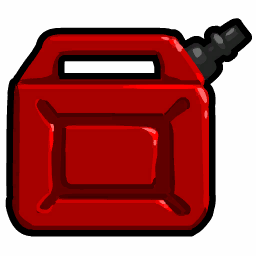
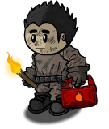

# Arsonist

- **Facción:** Neutral  · *fase posterior (referencia)*
- **Página de la wiki:** Arsonist (ToS)

## Ficha

**Clase (alineamiento):**

> Neutral Killing

**Tipo:**

> Killing
> Manipulation
> Non-Unique

**Prioridad de acción:**

> 3 (Dousing)
> 5 (Ignition)
> 6 (Passive Dousing)

**Resumen:**

> You are a pyromaniac that wants to burn everyone.

**Objetivo:**

> Live to see everyone burn.

**Habilidades:**

> You may Douse someone in gasoline or Ignite Doused targets.

**Atributos (texto):**

> Select yourself to Ignite Doused people dealing an Unstoppable attack.
> You will Douse anybody that visits you.
> If you take no action, you will attempt to clean gasoline off yourself.

**Si hay Godfather/otro objetivo:**

> Douse the target in gasoline

**Si no hay orden:**

> Clean Doused gas from self

**Gana con:**

> Arsonist
> Survivor
> Witch

**Debe matar para ganar:**

> Town
> Mafia
> Coven
> Vampires
> Serial Killer
> Werewolf
> Plaguebearer
> Pestilence
> Juggernaut

**Resultado Investigator:**

> Classic Results
> Your target could be a .
> Coven Expansion Results
> Your target could be a .

**Resultado Consigliere:**

> Your target likes to watch things burn. They must be an Arsonist.

## Texto completo de la wiki

| 

Arsonist 

(Arso)

Alignment

 Neutral Killing

Avatar

Immunities

None

 Ability Stats

 | Type

 | Priority

 | Killing

Manipulation

Non-Unique

 | 3 (Dousing)

5 (Ignition)

6 (Passive Dousing)

Actions

Target self

Ignite all Doused targets

Target other

Douse the target in gasoline

No action

Clean Doused gas from self

Investigation Results

 Sheriff

You cannot find evidence of wrongdoing. Your target is innocent or great at hiding secrets!

 Investigator

Classic Results

Your target could be a Bodyguard, Godfather, or Arsonist.

 Coven Expansion Results

Your target could be a Bodyguard, Godfather, Arsonist, or Crusader.

 Consigliere

Your target likes to watch things burn. They must be an Arsonist.

Game Information

Summary

You are a pyromaniac that wants to burn everyone.

Abilities

You may Douse someone in gasoline or Ignite Doused targets.

Attributes

Select yourself to Ignite Doused people dealing an Unstoppable attack.

You will Douse anybody that visits you.

If you take no action, you will attempt to clean gasoline off yourself.

Goal

Live to see everyone burn.

 Victory Conditions

 | Wins with

 | Must kill

 | Arsonist

 Survivor

 Witch

 | Town

 Mafia

 Coven

 Vampires

 Serial Killer

 Werewolf

 Plaguebearer

 Pestilence

 Juggernaut

 | 

 | DISCLAIMER: These stories are fanmade, and are not created or endorsed in any way by BlankMediaGames or Digital Bandidos.

"Good luck"

A subtle saying typically used in a way to instill a false sense of innocence in someone. Seeming to be a kind gesture towards the other people in the town. But to him, it was nothing more than a veiled threat, thrown out loudly and with a devilish smile. He only said it, because he knew they would need it…

Once the night came, his fun began. Walking slowly, proudly, a puff in his chest and a spring in his step. Visiting other's houses, brandishing a gas can, emptying it on their houses, whistling and smiling. Letting loose a single, satisfied word once his can was empty. "Doused"

3 nights later, 2 people had been hung to death, the town sheriff and a Jester, who was likely to take another's soul this coming night, the town was in paranoia, people claiming others were evil, angrily calling those who did not agree "Idiots" or saying the rather popular phrase "Stupid town". But to him, it was just fading into the noise of birds chirping, water rushing, and far, within his mind, the screams of people burning. The night forced everyone into their homes, but he only had one word on his mind, and let it loose from his ash stained lips. "Ignite"

The screams in his mind, were suddenly very, very, real.

The icon that appears next to Doused players in the player list

 Arsonist Ignite Icon

Mechanics[]

You can select a target each Night to Douse them in gasoline. Selecting yourself will Ignite all Doused players, dealing an Unstoppable attack to each of them.

You will automatically Douse any players who visit you during the Night. This happens even if you are roleblocked or dueled by a Pirate. If you are jailed you will passively Douse the Jailor. Using this, you can identify who visited you, by looking at who got Doused.

Players will not know if they are Doused unless they are another Arsonist.

All Doused players will show up as " Bodyguard, Godfather or Arsonist (plus Crusader in the Coven Expansion)" to Investigators, while Consiglieres see all Doused players as an Arsonist, similar to a Hex Master's hex.

 Witches/ Coven Leaders and Potion Masters are not affected by your Douse. They will still receive the true role of their target.

Since Sheriffs cannot find you anyway due to your Detection Immunity, they are not affected by your Douse either. They will still receive the normal result of their target.

If you choose no action at Night you will clean gasoline off of yourself. This happens even if you're not Doused. If you select this option, you will not be able to be Ignited and you will not be Doused anymore. This is useful if there are other Arsonists in the game or you were transported/controlled into dousing yourself.

Side Notes[]

A Guardian Angel can purge the gasoline from a Doused target.

If a player is purged the same Night you Ignite, they will survive. This is due to the Guardian Angel having a Priority of 2, higher than the Ignition's 5.

If a Guardian Angel purges one of your Doused targets, the Doused icon next to their number will immediately disappear when the night ends.

The Doused icon will also immediately disappear if your target is a fellow Arsonist who cleaned the gasoline off themself.

 Jailors can prevent you from Dousing their targets, although they cannot prevent their targets from being Ignited.

Due to a visual bug, you will still see a Doused icon on jailed players even though they weren't actually Doused.

 Spies can catch you getting Doused or cleaning yourself of gasoline with their bugging ability.

A Veteran will be Doused even if on alert, although you yourself will be killed.

If another Arsonist is in the game, Igniting your targets will Ignite all of their targets as well.

No Town Protective roles have an effect on your Douse, and cannot affect you when Igniting either.

A Crusader will still attack you, but you will not die due to your Basic Defense.

An Arsonist can and will Ignite themselves if they are Doused through the means of Transporters, Witches/ Coven Leader, or other Arsonists, unless they take the time to clean themselves off.

Due to the passive Douse mechanic, most roles that have Priority 3 or higher can get instantly Ignited when they visit an Arsonist who chooses to incinerate their targets, despite these roles never having been Doused on a previous night. Some of these roles include Transporter, Bodyguard (but not Doctor), Crusader, Tavern Keeper or Jailor (in multiple Arsonist games), Disguiser, Framer and other Arsonists.

Strategies[]

As an Arsonist, you are a massive threat to all opposing factions, as you break through all common forms of Defense, can not be detected, and can not be killed by any forms of protection, such as a Bodyguard. You also permanently change the investigative results of all targets you have Doused, making you a headache for an Investigator or Consigliere. Therefore, most factions will try to kill you as they have no way of knowing who is and who isn't Doused.

Who to Douse[]

Your ideal situation is to reach the end of the game with as many people as possible Doused. Therefore, your goal is to figure out who is likely to live until the end of the game and Douse said people, avoiding the ones who are likely to die by other means. Somebody just revealed themselves as the Sheriff, Doctor or another important Town role? Chances are this player will be dead the following day without you intervening.

Dousing people who are quiet has a lot of advantages. They're often evil roles, (who tend to live longer) and they're less likely to attract the attention of other killers.

If you find a good lead that somebody is a member of the Mafia, Coven, or Vampires it's best to Douse them because members of their respective faction cannot hurt each other (Apart from the use of a Transporter or (mostly in the Mafia's case) Witch/ Coven Leader); this means they generally tend to live longer and tend to be people you need to kill yourself.

You don't need to Douse absolutely everyone; Arsonists will automatically win in a 1v1 against any members of the Mafia, Serial Killers, Vampires, Transporters, Tavern Keepers, and a Jailor with no executions. However, multiple other roles are required to be killed by you in order to win:

A Werewolf can maul you and win if you haven't Doused them yet and a Full Moon Night is coming next. They could also cause a draw by killing you when a Full Moon Night is coming even though you Doused them. Your only chance is to have them Doused beforehand, and Ignite them on a non- Full Moon Night. 
The Arsonist Character Promo

If you do not find the Werewolf by Night 4, you will most likely lose, since every Night after that is a Full Moon Night.

A Mayor can easily Hang you with their voting power when the day comes around.

A Veteran with alerts left is a risk for you, and a mind duel between the two of you will determine the winner.

A Jailor with executions won't even give you a chance to Douse him, let alone Ignite him.

A Hex Master's final attack can prove your demise if you do not have them Doused. If you end up in a 1v1 situation, you will most likely lose, since the Hex Master only needs one Night to Hex and kill you, while you need two Nights to Douse and Ignite them.

A Medusa with Stone Gazes left or a Necronomicon can easily break through your defense. You'd rarely end up in a 1v1 situation before Night three, which means she'll have the Necronomicon and guarantee you not winning.

A Necromancer could prevent you from winning if the right roles are in the graveyard and haven't been used yet, such as a Werewolf on a Full Moon Night or Pestilence.

A Plaguebearer can infect you and become Pestilence before you can kill them, dooming you for death. If they're already Pestilence, you lose. Your only hope is to leave one person alive to Hang them and choose their fate.

 Juggernauts pose major threats to you. As their abilities increase, their threat to you also increases. Their attacks will always kill you, meaning you must find a way to incinerate or Hang them early on.

In particular, while you need the Mayor dead to win, you may want to avoid dousing them yourself in the hope that someone else will kill him for you as he's likely to be protected by Lookouts or Transporters.

The Survivor and the Witch can win together with you, so avoid dousing them unless you think an evil role is claiming them. Likewise, dousing a Jester is pointless because they're trying to die anyway; dousing an Executioner is also pointless because their goal doesn't conflict with yours either. If you're certain you've identified any of these roles, don't bother dousing them. Avoid dousing Witches in particular as it's important because they can prevent you from Igniting if they identify you.

However, remember that evil roles often claim to be a Survivor or pretend to be a Jester or Executioner. The last thing you want is to Ignite your Doused targets, only to find that you're alone with a Werewolf who kills you the next Night, or that the Jester and Survivor you spared are actually members of the Mafia who proceed to Hang you. Additionally, remember that Survivors, Jesters, Executioners, and Witches might vote unpredictably; if you Ignite with one member of the Mafia or Townie left and a Survivor or Neutral Evil, you run the risk of the swing vote turning against you and Hanging you.

The Arsonist can be a big threat to Survivors, Amnesiacs, Witches and Executioners, so these roles might Hang you even if the fact of you being known as an Arsonist is revealed. This is because a Survivor and Executioner know that your attack goes through Basic and Powerful Defense, and may Hang you if they believe you Doused them. An Amnesiac may Hang you so they are able to remember your role, and a Witch may want to side with another rival faction or evil role, also note that it is near impossible for Witches to win with you since they are Doused upon visiting you. If they are showing any of these plans, your best bet to survive is to Douse (if you haven't already) them and Ignite. You may lose a possible ally, but it's better than dying right off the bat. Remember that you should only kill these roles as the last resort as they can't do as much harm to you as other ones.

However, if an Amnesiac remembers your role and wins, you also win.

Trying to bait people into visiting you can be a good way to get a lot of players Doused. Asking for Town Protective roles on you can work well.

You may also use this to get an idea of what roles certain people are, for instance, If you are roleblocked, anyone who is Doused who you didn't directly visit is either a Tavern Keeper or Bootlegger. If you are attacked, whoever is Doused that Night who you didn't visit is almost guaranteed to be a killing role, such as a Mafioso. You can use this information to give yourself a viable Sheriff or Investigator claim.

Once you are falsely confirmed as an important Town Investigative role, you can ask for a Town Protective role to protect you, which will Douse them.

While not foolproof, it is possible to not Douse anyone until very late game. This prevents you from being killed or exposed by Veterans, Jailors, and Lookouts (but it also leaves you open to Spies). If you are certain all Town Investigative roles are dead, then you can claim a role before dousing. You must find a happy medium between remaining completely silent and talking too much.

When to Ignite[]

Ideally, you only want to Ignite when it would win you the game; this means leaving you with only one other person alive, at most. Igniting too early has several disadvantages:

It wastes a chance to Douse, slowing down your ultimate victory.

It reduces the number of people who could be the Arsonist, making you easier to find. Depending on who's left, they might even identify you instantly, especially if an Investigator has previously investigated you.

Another disadvantage to Igniting too early is that it exposes Last Wills. Since Townies' Last Wills provide confirmed evidence, it's to your advantage to avoid making them appear. On the other hand, remember that very few Last Wills are likely to outright expose you; you are immune to Sheriffs and only an Investigator can see you directly, but you are functionally indistinguishable from a Bodyguard.

An early Ignition also incontrovertibly confirms the presence of an Arsonist, which is generally very bad for you - if you were investigated prior your result becomes more suspicious, and the town will become more aggressive about Hanging anyone who potentially has Night immunity, both of which are common ways for Arsonists to lose.

If you are Doused by another Arsonist, wait a Night and stay idle. Doing so will clean the gasoline off of you, making you unable to be Ignited and also revealing yourself to the other Arsonist. However, this could backfire if a Spy bugs you. This will confirm you as Arsonist as no other role gets this message.

It can occasionally be worth Igniting early if you have a number of dangerous threats Doused (such as the entire Mafia, the Serial Killer, Vampires, the Werewolf, and so on). Try to figure out who will be left after your Ignition, and determine if they'll be able to catch you before you can Douse and Ignite the remaining targets; weigh the risk of being killed by the threats you've already Doused vs. the risk of being caught by the people you haven't Doused yet.

In Ranked games, it is sometimes to your advantage to Ignite the Jailor if you can be sure of avoiding the Lookout (in particular, note if ​​​​​​people whisper to the Jailor, and if multiple Town Investigative roles have claimed).

When there are multiple Arsonists, it is generally a bad idea to Ignite early. Resist your impatience and go slowly - multiple Arsonists have a huge advantage and Igniting early on generally throws it away in one manner or another.

The only reason an Arsonist would want to Ignite early is to eliminate someone who they absolutely have to kill off before they are caught. However, when you know for a fact that there are multiple Arsonists, the risk of being caught decreases sharply - the remaining one can just Ignite to wrap up the game.

Early Ignites risk burning your fellow Arsonist (or yourself, if you're Doused) before you've identified each other. The longer you wait, the more likely you'll find each other.

Every Ignite wastes a Night. Even with the risk of dousing the same people, it generally isn't worth it to Ignite until you think it will win you the game.

 Arsonists are fairly difficult to find. Igniting early narrows down your identities.

The number of people who die in an early Ignition with multiple Arsonists will let the town know what they're up against, which generally makes you more vulnerable, especially because there are only going to be a few candidates left.

Only a few roles pose a direct threat to Arsonists; only Ignite if you're sure you're targeting them. If you fail to Douse Investigators, you're increasing the chance that they'll find you. Blind Ignites don't help you, even with multiple Arsonists.

That said, with multiple Arsonists, it's often tricky to figure out whether your Ignition will win you the game or not. Don't wait too long, and don't be shy about Igniting if you're confident it will give you a plurality.

Also, if another Arsonist is hanged, it can be a good idea to Ignite that Night, as you don't know how many people are doused, and you may waste time by re- dousing someone the other Arsonist doused.

In modes where multiple Arsonists are possible, some people Ignite on the first Night in order to see if another Arsonist is present. This is generally a terrible idea for several reasons:

You're informing the Town that there are multiple Arsonists, too; this knowledge is generally far more useful to them than to you. They might also find one of your teammates outright due to the ignition's kills and Hang them, turning this from terrible move into a throw.

You risk burning yourself if another Arsonist Doused you that Night.

If there are no other Arsonists, you waste a precious Night and accomplish nothing.

If the are other Arsonists, it can give you people to ally with later in the game, but Igniting on the first Night can waste a Night of dousing someone who may turn out important for other factions later in the game.

Threats[]

Even though you have Basic Defense, Night killers like the Serial Killer and Mafia are still the greatest threat to you. Most of the time, all it takes is one hit from one and a Death Note outing you to put you on trial. If you are hit, you need to have a strategy to deal with the accusation; note that there is no strategy that works reliably.

You can claim you were Transported, but most of the time the Town will expect a Transporter to come forward to confirm this, which means it is not a reliable strategy.

You can claim Survivor (or imply that you're an Executioner), but this is unlikely to save you after you've been accused; it's better used as an early claim to avoid being attacked in the first place.

You can claim you were healed by a Doctor ( Doctors are less likely to reveal than Transporters, and the Town won't expect it). But be warned that a Doctor not revealing to healing might be suspicious, also note that since Version 3.2.4, the messages for healing and having Defense have been generalized, thus meaning that players might be more suspicious of people who a Doctor healed if no one backs them up.

You can claim that you're a Bodyguard, but since they only have one bulletproof vest (and therefore the chance of it being hit is low, especially if you haven't been publicly revealed as a Bodyguard earlier), this rarely works. A Death Note can leave you hanging in the case you claimed this, however.

You can simply say that your accuser is lying, especially if it's a Death Note from an evil role. However, the Town usually accepts accusations of people having any form of Defense, and based on the circumstances hanging you would prove better in the long run.

You can deny that you are immune and that a Consigliere must have revealed you to be an important Town role, and that the Mafia is attempting to kill you off. Note that you will probably have to claim an actually important Town role while making this argument (especially since, with your role already known to the Mafia, you would have no reason to keep hiding it.)

If there is someone else that the Town regards as suspicious, it is good to focus attention on them and off of yourself. Most of the time the Town will not pay attention to Death Note, but when they do it is important to shift focus away, and putting it on someone who is already considered possibly evil is a great way to make people forget about you. Try not to make it too obvious though. Remember to use commenting to drown out the smart Townies who've brought up your immunity.

Certain roles like Tavern Keepers, Bootleggers, Witches/ Coven Leaders and Jailors can prevent you from dousing people and Igniting, even if they only find you very late in the game. It can sometimes be worth an early Ignition to kill them.

The Jailor can also, of course, execute you. It's important to have a claim ready for if you're jailed; Bodyguard is a logical claim since it's the Town entry in your investigative result, but since you share it with the Godfather and since it's such a convenient claim, it may make the Jailor suspicious of you, especially if the Town already knows an Arsonist is present. Other roles with easy-to-fake Last Wills, such as the Sheriff, Tavern Keeper, Vigilante, Medium, and Doctor, are all decent claims as well provided you're not worried about Investigators. You can claim Doused if an Investigator comes to falsify your out-of-result claims.

A Witch/ Coven Leader is essentially forced to control you every Night if they find you to prevent their death from incineration. If they know a Veteran or Medusa, they will very likely force you to visit them to keep themselves alive. It is imperative to find and Hang them before they find you.

The Hex Master is a dangerous threat since they are characteristically you but with a team. If they have the Necronomicon, they can Hex you without risk of being Doused from visiting you. Make sure to find and Hang them, because if they've Hexed too many people or you end up in a 1v1 with them not Doused, they can auto-win for the Coven.

 Consiglieres can be a threat since they can identify you if not many people have been Doused. They could also alert the Town in a Death Note, and instruct any Bootleggers to role block you. However, they can be thrown off if they investigate someone who has been Doused themselves because they will apprehend the Arsonist result and might go for them. However they may ask the Mafia to attack their targets to check for immunity instead.

 Investigators are no longer that dangerous to you, because all Doused targets show up as Bodyguard, Godfather, or Arsonist to them, preventing suspicion to you. Still, though, your investigative result is still suspicious, especially if it's the beginning of the game or you have just Ignited (since not many people have been Doused). If you are accused by one, you could claim to be Doused yourself. This makes it especially important to Ignite only when it would win you the game; claiming to be Doused and still being alive after your Ignition makes it obvious that you were lying.

The Werewolf can ignore your Basic Defense and can catch you by targeting people who haven't yet been Doused. Of course, if you know who the Werewolf is, you can often have them Hanged or Douse them on a non- Full Moon Night.

The Vampires are a threat because they can both identify you by failing to convert you, and can identify you by process of elimination if they take over much of the Town. They're one of the reasons it's a bad idea to Ignite early since even if you thought the non- Doused targets were harmless Doctors and Sheriffs, you might find yourself surrounded by Vampires who will immediately deduce your identity.

 Transporters are dangerous because they can prevent you from Dousing your intended target, and they can even make you Douse yourself. Unlike the Hex Master, you can at least figure out that your target was swapped because the Doused effect icon will correctly appear on the player you ended up targeting. Keep in mind that a Transporter can't keep you from Igniting.

The revealed Mayor can kill you one-on-one, and can force you to claim a role; but since they're also a major target for the Mafia (and will often prioritize them over you, especially if they haven't personally been Doused), they're often not your first concern. Additionally, one advantage of having a confirmed Mayor is that you can easily Douse them as only the Jailor and Transporter can stop you.

The Veteran is an obvious threat in which they can kill you if you try to Douse them; worse, your usual strategy of waiting for the Mafia or the Serial Killer to kill them for you might not work here, since the Mafia and Serial Killer want to save the confirmed Veteran for last as well (and that means they're probably going to hit you first). And worst of all, you don't automatically win a 1 v 1 against a Veteran, so you need to eliminate them somehow. Your best options are to wait and hope someone else takes a potshot at them despite the risk or to eventually Douse them near the end and hope they wasted their alerts.

The Town Protective roles, Spy, Sheriff, Vigilante, Vampire Hunter , and Medium are usually not threats to you. The Spy can bug and see your Douse/cleaning messages, the Medium can bring back logic and information from the dead, and a Vigilante can discover your Basic Defense with a potshot, but these are not normally major threats compared to the above. If you're reasonably certain that everyone you haven't Doused is one of these roles (plus unaffiliated Neutrals), then it might be worth Igniting early, since unless you screw up, a Town composed only of these roles will have a lot of trouble catching you.

 Pestilence is a major problem for you since you will need help from others to Hang them. Your best bet is usually to hold off on visiting or Igniting once the Horseman has been revealed - visiting risks dying to Pestilence's rampage or by visiting them directly, while Ignition risks leaving you alone with the Horseman since they are immune to ALL attacks, including your Ignition. Given how quickly they kill, and how difficult they can be to find, you will usually need all the time you can have and can't afford to cut things faster by Igniting. Even if you believe your Ignition would leave three people alive, and even if you trust the last person to side with you, there's a risk Pestilence could kill the last person that Night - plus, by Igniting down to three people, you confirm yourself as non- Town, whereas otherwise, you can potentially have them to Hang Pestilence without them realizing it will lead to your victory.

What to Claim[]

The Arsonist is a powerful role, but dousing many people could be a waste if you're just going to be Hanged (or executed) anyway. There are ways your role could be revealed like investigation, but you need to have a backup story if you are investigated, a role, of course, is the most believable, there are claims that could potentially fool other players if used correctly.

One option is to claim to be a Survivor, which explains your Basic Defense; this is more likely to have you Hanged if people are being killed by a Neutral Killing, because Survivor is a common claim for Neutral Killing, whom all factions want dead. If you do claim to be a Survivor, it's important to do it early, before you are attacked; claiming it after you're accused of having a higher Defense value than the attacker's Attack value will almost certainly have you Hanged since the Town has no real reason to keep a Survivor alive.

Another option is to imply that you're an Executioner; accuse someone at random, and (assuming they're Town) thank the Town after they're Hanged. You can even just thank the Town after a random Hang of any innocent Townie. This will both divert attention and explain your Basic Defense. You can also explain your investigative results by claiming you were Transported. This is believable as Transporters often Transport themselves with roles with a Defense value to ward off suspicion or claim you might be Doused. However, it carries several risks; you may be executed by a Jailor or Hanged by a vengeful Town, and Investigators and Consiglieres can still identify you. You may also claim Doused, however, if you decide to Ignite after claiming Doused, then it proves you weren’t Doused. Also, if you delay on dousing to reinforce your disguise, you may find the Town turning their suspicion back to you, with no real way of ending things quickly.

If you're going to claim a Town role, Bodyguard is the logical choice. Aside from that, you can almost always fake a Last Will to improve your chances of people believing you. However, claiming to be a Bodyguard after a revealed Mayor or confirmed Townie died can be extremely suspicious, since the Town will wonder why you weren't protecting them. You can even claim to have to use your vest if attacked, but this forces you to stay with the fact you have already used your vest. If you are attacked again, there's nothing you can conclude overall other than hope you aren't outed.

However, Bodyguards and Arsonists share investigation results, and Bodyguard is a common Arsonist (and Godfather) claim. Claiming Bodyguard may raise suspicion and may cause you to be Hanged.

You don't have to claim Bodyguard, as you can claim that you were Doused as cover.

Claiming to be an Investigator with a Last Will that shows everyone you Doused as Bodyguard, Godfather, or Arsonist can work well, as you can also claim you were Doused yourself. However, you can be busted by a Lookout who notices the shift between everyone that has been Doused. This works in situations where you need to claim a role and fast, otherwise you would be Hanged.

However, this has a downside of revealing who was Doused, which can create many other problems for you, like people panicking and making you the top threat. To counter this, change some names to quiet people to create more confusion and less panicking.

Claiming to be a Witch with only Mafia or Neutral roles alive can help your chance of survival. However, if no one has been controlled, the Neutral Evil slot is taken by Executioner or Jester, or you have Ignited, then this will not work. If you claim to be a Witch in a 1 v 1 v 1 scenario, you can cause the Mafia, or any other Neutral role to Hang the last remaining opponent, thus winning all other match-ups. However, experienced killers will ask who you have controlled and their exact roles, so be wary. This works best if you haven't Doused.

If an Investigator lets out your investigation result and attracts suspicion to you or if you're directly accused by one, you can claim any believable Town role and then claim you must've been Doused and thus, framed. Although this tactic does not always work and the Town wouldn't usually believe you, it's more effective in the start of the game or mid-game when there's a good number of people that could possibly be Doused and the Town doesn't have their suspicions confirmed or fully locked on to you.

Careful, though, if another Arsonist Ignites and people remember you claimed Doused, you will be cast under extreme suspicion from the Town causing you to likely be Hanged.

Claiming Investigator dramatically decreases suspicion—listing down Doused targets will convince players that you're really an investigator, and other Investigators can no longer be a threat to you, for you can claim that you are Doused as well. Additionally, Investigator is hardly ever a role claimed by evil roles.

If you feel more comfortable in a Coven match claiming within your investigation results, Crusader is also viable. People expect this as an Arsonist claim less, as they are usually more accustomed to Classic.

However, you have to pick players that haven't been visited on the Night you claim to have protected them, or else players can call you out on your fake Last Will. This makes it as suspicious as a Lookout claim with "no visits" every Night.

Claiming a powerful Town role such as Mayor can give you an extra Night to Ignite. This is a high risk, high reward - if you do this, be sure you are ready to Ignite the next day.

You can also claim you were Doused to the Town anytime; they'll assume you're just a bad Jester, and they'll leave you alone. Note this can go awry as they'll either try to kill you at Night or end up Hanging you instead.

Playing against Arsonists[]

If multiple people are showing up as an Arsonist's result, then they might be Doused themselves. To use this tactic, you will need to refer to the role list and your gut to find out who is Doused and who isn't, since you will have no way of knowing otherwise.

Anyone who contains the investigative result of the Arsonist and is still alive after an Ignition can be an Arsonist themselves.

If you are an Investigator and a Lookout has died with the name of a visitor that visited one of your previous targets, it may be worth checking the same target again. If they show up as a Bodyguard, Godfather, or Arsonist instead of the result you had previously, they have been Doused and the person in the Lookout will is more likely the Arsonist.

If you are a Jailor, take your claims very seriously. Someone that is Doused has a completely different investigation result, and talks with their claim. If they were shown to be Doused, think about their claim and the role list. The Arsonist might have Doused a Bootlegger who claims Tavern Keeper in Jail, and you not executing that Bootlegger gives the Mafia another chance. Depending on the role list, sometimes you might have to go with your gut feeling and execute that person.

As a Consigliere, if you find a possible Arsonist it's best to out them in the Death Note of any Mafia Killing roles to put suspicion on them. If they turned out to be a Doused target, their credibility decreases and you can kill them if they turn out to be an important role to kill.

As a Coven Leader, if you have a Medusa with Stone Gazes left, you can control the Arsonist into her gaze to eliminate the problem entirely. Doing this with a Veteran can have a similar effect.

Achievements[]

 | Name

 | Description

 | Merit Points

 | Pyromaniac

 | Win your first game as an Arsonist

 | 20

 | Firebug

 | Win 5 games as an Arsonist

 | 20

 | Incendiary

 | Win 10 games as an Arsonist

 | 40

 | Ifrit

 | Win 25 games as an Arsonist

 | 100

 | It's gettin' hot in here

 | Ignite yourself

 | 40

 | There can be only one

 | Ignite a Serial Killer and Godfather in the same night

 | 100

 | Disco Inferno

 | Ignite 5 or more people in one night

 | 100

 Only achievable if another Arsonist doused you or you were controlled or Transported. However, Arsonists will know if they are doused, so the only ways to unintentionally obtain this achievement are to get ignited the same night you are doused or be a doused Amnesiac that later becomes an Arsonist and get ignited.

Messages[]

 | 

 | You were doused in gas!

 | Displays at the end of the night when you get Doused. Only Arsonists receive this message.

 | Someone tried to douse you in gas but you were in jail last night!

 | Displays to a jailed player when an Arsonist tries to Douse a jailed Arsonist.

 | You were set on fire by an Arsonist!

 | Displays at the end of the Night to all doused players (except Pestilence) when an Arsonist chooses to ignite.

 | You have cleaned the gasoline off of yourself.

 | Displays at the end of the night when an Arsonist does not choose to douse or ignite. Useful if Doused by another Arsonist.

 | [They were] incinerated by an Arsonist. or [They were] also incinerated by an Arsonist.

 | Cause of death for a player who was ignited by an Arsonist.

Trivia[]

Prior to Version 1.5.11.5389, Doused targets would be notified that they were Doused. Doused targets would also keep their investigative results and would not be changed into the current Bodyguard, Godfather, Arsonist, or Crusader result.

Prior to Version 2.3.2.9706 Arsonists would be killed by Bodyguards and Trappers protecting their target.

Prior to Version 3.2.6, Arsonists would not Douse visitors.

According to a poll made by LevinSnakesRise, the Arsonist is the third most hated role in Town of Salem with 171 votes, saying the role was too slow and was boring for taking too long to kill anyone (Similar to Framer). Also note that this poll is outdated, as the Arsonist role has received multiple buffs after this poll.

The Arsonist is the only Neutral Killing outside the Coven Expansion to have permanent Detection Immunity.

The Arsonist is one of two roles to have 2 skins, the other being the Vigilante.

Paradoxically, it is often good for other Neutral Killings for the Town to suspect an Arsonist. Simply not killing as a Serial Killer or Werewolf is a good way for Investigators to not suspect your results.

Some players mistakenly believe that a Arsonist's Douse will make you appear to be an Arsonist to a Sheriff (and therefore appear Innocent). However this is not the case so don't fall for this.

Gallery[]

Alternate Avatar

History[]

3.3.1

Fixed issue with Arsonist passive Douses not working on Investigator and Juggernaut in some scenarios.

3.2.5

 Arsonist now passively Douses anyone that visits them.

2.5.5.12200

Added a label to visually indicate Doused players for the Arsonist ().

The Arsonist's role icon has been changed. Old one was .

Added Arsonist's circled role icon ().

2.3.2.9706

 Arsonists can no longer die to a Bodyguard or Trapper.

2.0.0.6501

 Arsonist now has passive Ignition.

1.5.11.5389

Non- Arsonist players no longer receive the message "You were Doused in gas!" when Doused.

The Arsonist now fools an Investigator.

The Arsonist now fools a Consigliere.

Town of Salem Release

Introduced.

 | 

 | 
Roles

 | 

 | 

 | 
 Town

 | 

 | Town Investigative | | Investigator • Lookout • Psychic • Sheriff • Spy • Tracker | | 

 | 

 | Town Killing | | Jailor • Vampire Hunter • Veteran • Vigilante

 | 

 | Town Protective | | Bodyguard • Crusader • Doctor • Trapper

 | 

 | Town Support | | Mayor • Medium • Retributionist • Tavern Keeper • Transporter

 | 
 Mafia

 | 

 | Mafia Deception | | Disguiser • Forger • Framer • Hypnotist • Janitor | | 

 | 

 | Mafia Killing | | Ambusher • Godfather • Mafioso

 | 

 | Mafia Support | | Blackmailer • Bootlegger • Consigliere

 | 
 Coven

 | 

 | Coven Evil | | Coven Leader • Hex Master • Medusa • Necromancer • Poisoner • Potion Master | | 

 | 
 Neutral

 | 

 | Neutral Benign | | Amnesiac • Guardian Angel • Survivor | | 

 | 

 | Neutral Evil | | Executioner • Jester • Witch

 | 

 | Neutral Killing | | Arsonist • Juggernaut • Serial Killer • Werewolf

 | 

 | Neutral Chaos | | Pirate • Plaguebearer/ Pestilence • Vampire

## Implementación

- [ ] Definido en `packages/engine` con su prioridad y facción
- [ ] Acción nocturna (si aplica) validada con objetivos legales
- [ ] Resultado de investigación correcto (Sheriff / Investigator / Consigliere)
- [ ] Condición de victoria y de derrota comprobada en tests
- [ ] Tests unitarios del rol en verde
- [ ] Tarjeta y texto de ayuda en la app
- [ ] Icono e ilustración propia (no el arte de la wiki)
- [ ] Plantillas de narración para sus eventos
