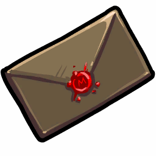

# Blackmailer

- **Facción:** Mafia  · *en alcance MVP*
- **Página de la wiki:** Blackmailer

## Ficha

**Clase (alineamiento):**

> Mafia Support

**Tipo:**

> Disruption
> Non-unique

**Prioridad de acción:**

> 3

**Resumen:**

> You are an eavesdropper who uses information to keep people quiet.

**Objetivo:**

> Kill anyone that will not submit to the Mafia.

**Habilidades:**

> Choose one person each Night to Blackmail.

**Atributos:**

> Attack: None
> Defense: None

**Atributos (texto):**

> Blackmailed targets cannot talk during the Day.
> You can hear private messages.
> If there are no kill capable Mafia roles left you will become a Mafioso.
> You can talk with the other Mafia at Night.

**Especial:**

> Mafia Chat
> becomes Mafioso when Mafia Killing are dead.
> Can hear whispers.

**Gana con:**

> Mafia
> Survivor
> Witch

**Debe matar para ganar:**

> Town
> Vampires
> Coven
> Plaguebearer
> Pestilence
> Arsonist
> Serial Killer
> Werewolf
> Juggernaut

**Resultado Sheriff:**

> Your target is suspicious or framed!

**Resultado Investigator:**

> Classic Results
> Your target could be a .
> Coven Expansion Results
> Your target could be a .

**Resultado Consigliere:**

> Your target uses information to silence people. They must be a Blackmailer.

## Texto completo de la wiki

| 

 Blackmailer

(BM/BMer)

Alignment

 Mafia Support

Immunities

Attack: None

Defense: None

Special

 Mafia Chat
becomes Mafioso when Mafia Killing are dead.

Can hear whispers.

 Ability Stats

 | Type

 | Priority

 | Disruption

Non-unique

 | 3

Investigation Results

 Sheriff

Your target is suspicious or framed!

 Investigator

Classic Results

Your target could be a Spy, Blackmailer, or Jailor.

 Coven Expansion Results

Your target could be a Spy, Blackmailer, Jailor, or Guardian Angel.

 Consigliere

Your target uses information to silence people. They must be a Blackmailer.

Game Information

Summary

You are an eavesdropper who uses information to keep people quiet.

Abilities

Choose one person each Night to Blackmail.

Attributes

 Blackmailed targets cannot talk during the Day.

You can hear private messages.

If there are no kill capable Mafia roles left you will become a Mafioso.

You can talk with the other Mafia at Night.

Goal

Kill anyone that will not submit to the Mafia.

 Victory Conditions

 | Wins with

 | Must kill

 | Mafia

 Survivor

 Witch

 | Town

 Vampires

 Coven

 Plaguebearer

 Pestilence

 Arsonist

 Serial Killer

 Werewolf

 Juggernaut

 | 

 | DISCLAIMER: These stories are fanmade, and are not created or endorsed in any way by BlankMediaGames or Digital Bandidos.

A child that was never meant to talk throughout his whole life. A child that sits in a corner waiting and listening for any sleight noise in his vicinity. He crouches to hear voices near by. He then hears the voices needed to make his plan go into action. He was born in a family of five with the least talent, looks, and athletic ability. The only ability he had was the ability to find "things." The ability to share things throughout his life was unnecessary. He was outcast, unwanted among the towns people, but he had one thing going for him. You could call this talent, but in all honesty, it was more of a will to find things. The one ability that made him well known in these parts of the area. The ability to find, control, and conquer that the naked eye can not see; the very ability that made him progress through the ranks instead of a dirt poor life. This is the ability to find the information needed to know their most precious thing that they can not share among each other. It could be either past history, scandals, or hidden secrets. Then the ability to control what is needed to help him win; no matter the risk. This allows his true ability to show his conspiring intentions of bestowing upon the hush-hush tactic against his foes. To use whatever dirt needed to make his foes fall upon their knees in silence. This can be continuous for days or as short as he needs it to be. This is the true ability of conquering the foe. The foes that thought that his ability was pointless and useless throughout the town. This one pointless ability will bring upon the destruction needed to change this town with his fellow brethren and sisters in the secret society of the Mafia.

Mechanics[]

You may choose to Blackmail someone each Night, preventing them from speaking that Day.

You can also read private whispers.

When a Blackmailed target tries to speak, they will simply receive a message saying: "You are Blackmailed." and no one will be able to see their original message or their attempt of speaking.

When a Blackmailed target tries to whisper, they will simply receive a message saying: "You cannot chat or whisper while Blackmailed." and no one will be able to see their original message or their attempt of whispering.

If the Blackmailed target is voted to go on trial during the Defense phase, the Blackmailed target's message will be changed to "I am blackmailed.". They will then be unable to say that message again whilst still on trial.

Your target is also unable to whisper, but they can still be whispered to.

If you visit a Veteran on alert and you are killed, they will still be Blackmailed the next Day.

A Blackmailed Mayor can still reveal that Day.

You cannot Blackmail a target that was jailed that Night. You will be notified that your visit failed and the jailed person will know that someone tried to Blackmail them.

You can't affect your target's ability to write in their Last Will and Death Note.

You can't affect your target's ability to vote and unvote someone.

You are still able to read whispers when dead.

Strategy[]

As a Blackmailer, your role in the Mafia is to silence a confirmed Townie or a person who is accusing a member of the Mafia to make them stop accusing them.

However, despite having the ability to Blackmail, your alternative role is to also serve as an eavesdropper, gaining important information from whispers during the Day to provide leads for the Mafia's activities at Night.

You may also play as a Spy entirely, passing on at Day who gets killed, forged, framed, cleaned or investigated to gain the Town's trust. If you see someone get visited but not killed, use that against them by calling them out as immune and get them Hanged to easily gain majority while still killing off the remaining Town or threatening Neutrals. Usually. when you use this strategy, you should not Blackmail people. You will be immediately called out as suspicious if you Blackmail anyone.

You can also use this against other Spy claims. Blackmail someone and accuse any Spy claims of being the Blackmailer. Be careful with this strategy as it may get you immediately killed if town realizes you were lying.

As the Spy can now bug people's houses and know what notifications their target had received, you can exploit your knowledge of what the other members of the Mafia are. Don't do this every Day, but every once in a while, you can claim you bugged the house of someone who was transported, attacked or roleblocked by the Bootlegger. Often times, players will announce that they were Transported, controlled, roleblocked, etc. You could claim you bugged them and claim you saw this happen. Have a look at the bugging messages and think of ways you could deceive the other players into thinking you're really the Spy, but don't overdo it. They could get on to you after a while. You could also ask for protection and distract the Lookout by watching you.

Feel free to take the opportunity to give false information to the Town. You can be very manipulative with this role. This can confuse the Town, and even cause them to not suspect actual members of the Mafia. However, don't make it blatantly obvious that you are indeed giving false information. You will have to be careful when manipulating the Town in order not to get caught. Also, any other Spies in the game may call your out for lying about who the Mafia visited at Night.

(Note: As of Version 2.0.0.6537, this strategy is less effective as you can no longer easily "confirm" yourself as a Spy since Spies can no longer read whispers).

This strategy is also much less effective in the Coven Expansion, since you do not know who the Coven visit, unless someone claims Poisoned or controlled.

In the Coven Expansion, you can alternatively claim Guardian Angel and state who's your target since the Town normally leaves Guardian Angels alone. If your "target" dies, the Town will assume you've become a Survivor if you've made the correct claims to explain why you did not protect them (e.g role blocked). Note that if you choose a Mafia member as your "target", you risk outing your Mafia friend if you die and your role is revealed.

Your second ability allows you to collect valuable information for the Mafia via whispers, this can help by finding someone's role or to discover what actions some Townies are planning, use this to help the Mafia find and take down a potentially dangerous target like a Lookout or strengthen your claims if someone asks you for your role and Last Will.

If anyone attempts to collect roles via whispers, you can tell this to the Mafia so they can plan their operations more accurately now that the roles of the Townies have been revealed. You can also harvest info from whispers by Town Investigative roles, the Jailor or Mediums and use them to your advantage.

If someone reveals their Last Will and role via whispers, you can tell the Forger their will so they can write down exactly the correct order their Last Will follows to help a Mafia member escape suspicion or even frame someone.

If there are Vampires or Coven in the game, you find them by their whispers if they decide to try and coordinate via whispers. Of course the Coven can simply use the Coven Chat to go around this problem, but the Vampires can't utilize their Vampire chat as effectively due to the potential existence of a Vampire Hunter. You can do this to find other Neutrals as well if they attempt to coordinate via whispers.

Use whispers to your advantage! If you find out who the Jailor is jailing through whispers or by convincing them to jail a Mafia-known Townie, you can then ask a Witch who has teamed up with you to control the Jailor into the person they're jailing to force an execution, making the Jailor lose their executions.

You can claim Investigator if a lot of people are whispering their roles to an important Townie, such as the Jailor. "Investigate" anyone whispering to someone else their roles and post the investigative results of their claim. Additionally, your Mafia visits do not match up to your fake visits so a Spy cannot bust you.

This can backfire if one of your targets dies and happens to be another role, or if a Tracker tracks you and sees you visit no one/the person you Blackmailed INSTEAD of the target you "investigated". You can claim that your target was transported or forged in some of these cases.

If you or the Consigliere finds a Town Investigative or Town Support role, it can be useful to Blackmail them rather than killing them instantly, as they can reveal crucial information in their Last Will. Spies should especially be Blackmailed as soon as possible.

This strategy can backfire if the person you Blackmail either dies to something like a Veteran or a Neutral Killing role or they are jailed and can speak the next Day.

Continue to Blackmail the same person for a few Nights, then casually ask why they have been so quiet, and it will put suspicion on them. This only works when the person hasn't been giving signals about being Blackmailed; additionally, be warned that this will tend to call attention to you - if it later becomes clear they were Blackmailed, smart players will immediately be suspicious of anyone who pointed out that they were silent. For this reason, it might be best to wait and hope that a Townie notices their silence on their own.

 Blackmailing the same person repeatedly has a few risks; if they're a Veteran, they'll easily kill you, while if they signal that they were Blackmailed, a Lookout (or, worse, the Werewolf) may catch you Blackmailing them the next Night. On the other hand, like any member of the Mafia who visits the same person repeatedly, it has the advantage that you avoid revealing multiple people as non- Mafia to a Spy, although smart Spies will easily notice that the person has been role blocked or Blackmailed for a few Nights straight, therefore exposing a Blackmailer's existence.

 Blackmailing the Mayor or Town Investigative can be good at making them less effective. Be careful of Blackmailing a revealed Mayor as there could be a Lookout watching him, and without a Disguise, you will be called out by the Lookout due to the Mayor's signal of being Blackmailed.

 Neutrals such as the Serial Killer, Werewolf and the Arsonist will have no defense for their actions if they are Blackmailed, so if you want to get rid of them, Blackmail them as soon as possible and accuse them.

If you are role blocked or your target dies in the same Night, you or another member of the Mafia may act as if they have been Blackmailed (you may also simply choose not to Blackmail anyone for a Night). However, this carries the danger of a Spy calling you out, thus getting you Hanged. Only use this if there is no Spy in game or there's a Disguiser.

Try to Blackmail people who are accusing a member of the Mafia or are chatty. The Town may forget what they said and go on to other things if you Blackmail them for a few Nights or if they die.

However, if you Blackmail someone accusing a Mafia member, it will confirm their suspicions. Alternatively, you can use this strategy to frame someone outside of the Mafia.

If you think you may be put on trial the next Day, a good strategy is to not Blackmail anyone that Night and instead pretend you are Blackmailed yourself. Again, this carries a risk of a Spy calling you out. However, if you have a Bootlegger on your side, getting your Bootlegger to role block the Spy (providing you know who the Spy is) to prevent the Spy from checking whether you were actually visited by the Mafia. You can also have a Disguiser visit you to make it appear that a member of the Mafia visited you to a Spy. Be careful with this strategy as it can make you look very suspicious.

If you have a Bootlegger, try targeting the same target as them. It is usually effective and can create a misHang against someone (e.g a Sheriff that is role blocked cannot do their Night action and if they are Blackmailed, they cannot state that they were role blocked).

 Blackmailing people every Night isn't necessarily a good plan; when the Town realizes that people are being Blackmailed, it becomes much harder for you to claim Spy, and they're likely to be more cautious with whispers.

Another possible strategy, especially with four members of the Mafia in a Ranked or Ranked Practice game, is to simply not Blackmail at all. Considering the Blackmailer's main ability is not as useful as that of other Mafia members early game, this is not just a viable strategy but a powerful one. The main reason is that your ability to read whispers is generally more powerful and it may allow you to collect more information from someone than a Consigliere would (especially if there's an Arsonist or Hex Master in the game). The other reason being that if you're called up to the stand, this makes a Spy claim much more plausible. If it becomes clear there is an active Blackmailer, many Townies will Hang Spy claims right on the spot. This requires the cooperation of the other members of the Mafia, especially in Ranked Practice, by not having them reveal the existence of a Blackmailer to a real Spy.

A strategy is to pretend to be Blackmailed yourself. If the Mafia is struggling mid-game, provided that there is no Spy (or you had a Disguiser disguise you), you can remain completely silent and signal to other players that you are ' Blackmailed' by voting and canceling two times. This will mess up their suspicions, but be careful not to overdo it. Discuss with the Mafia to let different members act Blackmailed on different Days. Do be warned that if a faking Mafia member is Hanged or killed it will immediately draw suspicion on the others. This strategy works better if you haven't Blackmailed the previous Night. This strategy is not as effective as it once was, since most players in Ranked Practice and Ranked are used to immediately suspecting anyone that claims to be Blackmailed, as it is a popular defense for Blackmailers on trial.

Be careful when Blackmailing people over and over again in the Coven Expansion as a Crusader can protect your target and can kill you.

One particularly interesting, if not outright chaotic, strategy is to claim you are the Jailor in an All Any match. Since Jailor won't be a guaranteed role and it is a Unique Role, the chances of your position being questioned is not likely. Even if a Jailor does exist, chances are they will jail you and, in turn, out the fact that there is a known Jailor that most evils will want to keep a watch on and find. If a Jailor does not exist, don't Blackmail anyone so no one questions your legitimacy; thus you can read whispers without people being suspicious of a Blackmailer, and you will likely end up having a legitimate protection on your side in terms of the Doctor or Bodyguard. Even better, should you die at Night (most likely due to a Witch controlling a Vigilante or Serial Killer), chances are that the Town will go after someone who claimed to be protecting you at Night. This is useful if a Doctor or Bodyguard gets roleblocked or converted into a Vampire or a Serial Killer or Arsonist claimed to protect you to prove their role.

In the event a Jailor does exist and they jailed you, claim you wanted to guide them into you as something useful to a Jailor (i.e. Doctor, Bodyguard, or Vampire Hunter). This could give you a few more Days to keep you alive, even if your cover gets blown.

You continue to hear whispers after death. While this is rarely useful, it can be used to out mutual enemies to the Medium or to trick them by lying about a whisper's content.

At times, a Jailor will whisper a Town Protective claim to protect them. They will often put in their will afterward that if they die, to kill the Town Protective claim for lying. If you have a Bootlegger, you can stop the Town Protective from doing their job and also getting a Hang off, saying that they didn't protect the Jailor. This can be done with many important Town roles other than the Jailor as well.

Dealing with Blackmailers[]

If you are a Townie and suspect someone of being Blackmailed, use this simple test to determine whether or not the target was Blackmailed: ask the suspected person to vote and cancel the vote of someone twice if they are Blackmailed. Most people will appreciate you for checking.

Even if nobody asks you and you are Blackmailed, voting and un-voting the same person anyway will get the attention of the Town and they will know that there is a Blackmailer in game. The earlier the Town knows about the Blackmailer's presence, the earlier they can stop whispering important information.

If it's proven that someone was Blackmailed, ask the Jailor to jail them. The Jailor will collect information from this person and will prevent the Blackmailer doing their work. It may even save the game since Blackmailers usually Blackmail people with important things to say.

If a Townie whispers you their role claim and an Investigator whispers you that Townie's investigation results, they may be a Blackmailer who is pretending to be an Investigator. You should call them out if said Townie dies and they pretended to be another role.

If it turns out that someone was Blackmailed, be suspicious of anyone who accused them or who pointed out how silent they were; inexperienced Blackmailers will often accuse the person they Blackmailed. In particular, if someone claims to be Blackmailed on the stand, anyone who tries to dispute that or suggests that they are faking should be seen as extremely suspicious; it is extraordinarily rare for non- Mafia roles to fake being Blackmailed (due to the high risk of being outed by a Spy). You should almost always vote innocent on people who say they were Blackmailed on the stand, and investigate, role block, or even vote up the person who accused them to demand their role.

 Blackmailers will often invent new "rules" about how Blackmailing and the Blackmailed message works to try and cast suspicion on the person they've been Blackmailing (for instance, complaining that they said they were Blackmailed too many or too few times, or too quickly/too slow). Turn it around and look at it from the other direction; falsely claiming to be Blackmailed is an extremely rare and risky strategy, one that has few benefits and which can be easily discounted by a Spy, while Blackmailers trying to get their targets Hanged is extremely common. Therefore, any claim that someone who is acting Blackmailed is "faking it" should be seen as extremely suspicious, especially if it comes from their main accuser.

Note however, that a Disguiser can mess the Mafia visits for the Spy and legitimize the Blackmailer's claim that someone is "faking it" by disguising the Blackmailer. They may also be able to have a Mafia member falsely claim Blackmailed to halt whispers and put any Spy claims under suspicion.

You can possibly throw a Blackmailer off guard by whispering to a a Spy test. A foolish, gullible, or inexperienced Blackmailer may tell the town the correct code. It's a dead giveaway since Spies can no longer read whispers, and with proof, you can promptly Hang the Blackmailer.

Achievements[]

 | Name

 | Description

 | Merit Points

 | Extortion

 | Win your first game as a Blackmailer

 | 20

 | Hush Money

 | Win 5 games as a Blackmailer

 | 20

 | Deceitful

 | Win 10 games as a Blackmailer

 | 40

 | Treachery

 | Win 25 games as a Blackmailer

 | 100

 | Gag Order

 | Blackmail the same person 3 times

 | 40

 | Self-Conscious

 | Blackmail yourself

 | 40

 | Oops

 | Blackmail a member of the mafia

 | 40

 Only achievable with a Transporter or Witch/ Coven Leader. "Self-Conscious" and "Oops" can be earned at the same time.

Messages[]

 | 

 | You hear (Player) whispering to (Player) (Message)

 | Displays exclusively to a Blackmailer when a player is whispering to another during the Day.

 | Someone threatened to reveal your secrets. You are blackmailed!

 | Displays at the end of the night when you are visited by a Blackmailer.

 | You are blackmailed.

 | Displays for yourself when you attempt to send a message during the Day while Blackmailed.

 | You cannot chat or whisper while blackmailed.

 | Displays for yourself when you attempt to whisper someone during the Day while Blackmailed.

 | I am blackmailed.

 | Displays for all players during the Defense phase when a Blackmailed player is put on trial.

 | Someone tried to blackmail you but you were in jail last night.

 | Displays at the end of the night when you are visited by a Blackmailer while jailed.

Trivia[]

Prior to Version 1.5.0.3431, Blackmailers could not hear private messages.

Since the release of Version 2.0.0.0.6537, it's more difficult for Blackmailers to claim to be a Spy, as Spies can't hear whispers anymore.

As of Version 2.5.1, people who are Blackmailed can only say "I am blackmailed." once while on trial.

If someone was Blackmailed the Day the game ends, they will no longer be Blackmailed.

When whispering as a Blackmailer, your own whisper will be shown twice, as when you whisper, your Ability to read whispers will activate, causing you to see the whisper you sent from your own perspective (seen as "To [Name]") and once from a Blackmailer's perspective (seen as "From [Your name] to [Target's name]"). This might be a bug.

History[]

2.5.5.12200

The Blackmailer's role icon has been changed. Old one was .

Added Blackmailer's circled role icon ().

2.5.1.10655

 Blackmailed players can now only say "I am blackmailed." once on trial.

1.5.0.3431

 Blackmailer can now see whispers.

Town of Salem Release

Introduced.

 | 

 | 
Roles

 | 

 | 

 | 
 Town

 | 

 | Town Investigative | | Investigator • Lookout • Psychic • Sheriff • Spy • Tracker | | 

 | 

 | Town Killing | | Jailor • Vampire Hunter • Veteran • Vigilante

 | 

 | Town Protective | | Bodyguard • Crusader • Doctor • Trapper

 | 

 | Town Support | | Mayor • Medium • Retributionist • Tavern Keeper • Transporter

 | 
 Mafia

 | 

 | Mafia Deception | | Disguiser • Forger • Framer • Hypnotist • Janitor | | 

 | 

 | Mafia Killing | | Ambusher • Godfather • Mafioso

 | 

 | Mafia Support | | Blackmailer • Bootlegger • Consigliere

 | 
 Coven

 | 

 | Coven Evil | | Coven Leader • Hex Master • Medusa • Necromancer • Poisoner • Potion Master | | 

 | 
 Neutral

 | 

 | Neutral Benign | | Amnesiac • Guardian Angel • Survivor | | 

 | 

 | Neutral Evil | | Executioner • Jester • Witch

 | 

 | Neutral Killing | | Arsonist • Juggernaut • Serial Killer • Werewolf

 | 

 | Neutral Chaos | | Pirate • Plaguebearer/ Pestilence • Vampire

## Implementación

- [ ] Definido en `packages/engine` con su prioridad y facción
- [ ] Acción nocturna (si aplica) validada con objetivos legales
- [ ] Resultado de investigación correcto (Sheriff / Investigator / Consigliere)
- [ ] Condición de victoria y de derrota comprobada en tests
- [ ] Tests unitarios del rol en verde
- [ ] Tarjeta y texto de ayuda en la app
- [ ] Icono e ilustración propia (no el arte de la wiki)
- [ ] Plantillas de narración para sus eventos
