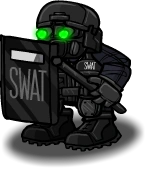

# Bodyguard

- **Facción:** Town  · *en alcance MVP*
- **Página de la wiki:** Bodyguard (ToS)

## Ficha

**Clase (alineamiento):**

> Town Protective

**Tipo:**

> Protection
> Killing
> Non-unique

**Prioridad de acción:**

> 3

**Resumen:**

> You are an ex-soldier who secretly makes a living by selling protection.

**Objetivo:**

> Hang every criminal and evildoer.

**Habilidades:**

> Protect a player from direct attacks at night.

**Atributos:**

> Attack: Powerful
> Defense: None (Basic when using a bulletproof vest)

**Atributos (texto):**

> If your target is directly attacked or is the victim of a harmful visit, you and the visitor will fight.
> If you successfully protect someone you can still be Healed.

**Si hay Godfather/otro objetivo:**

> Protect target and counterattack attacker

**Gana con:**

> Town
> Survivor

**Debe matar para ganar:**

> Mafia
> Vampires
> Arsonist
> Serial Killer
> Werewolf
> Witches/Coven
> Plaguebearer
> Pestilence
> Juggernaut

**Usos:**

> 1 (self)

**Resultado Investigator:**

> Classic Results
> Your target could be a Bodyguard, Godfather, or Arsonist.
> Coven Expansion Results
> Your target could be a Bodyguard, Godfather, Arsonist, or Crusader.

**Resultado Consigliere:**

> Your target is a trained protector. They must be a Bodyguard.

## Texto completo de la wiki

| 

 | Looking for the Town of Salem 2 role?

This role appears in Town of Salem 1 and 2. For the ToS 2 counterpart, see Bodyguard.

Bodyguard 

(BG)

Alignment

 Town Protective

Avatar

Immunities

Attack: Powerful

Defense: None (Basic when using a bulletproof vest)

 Ability Stats

 | Type

 | Priority

 | Protection

Killing

Non-unique

 | 3

Actions

Target self

Uses bulletproof vest

Target other

Protect target and counterattack attacker

Investigation Results

 Sheriff

You cannot find evidence of wrongdoing. Your target is innocent or great at hiding secrets!

 Investigator

Classic Results

Your target could be a Bodyguard, Godfather, or Arsonist.

 Coven Expansion Results

Your target could be a Bodyguard, Godfather, Arsonist, or Crusader.

 Consigliere

Your target is a trained protector. They must be a Bodyguard.

Game Information

Summary

You are an ex-soldier who secretly makes a living by selling protection.

Abilities

Protect a player from direct attacks at night.

Attributes

If your target is directly attacked or is the victim of a harmful visit, you and the visitor will fight.
If you successfully protect someone you can still be Healed.

Goal

Hang every criminal and evildoer.

 Victory Conditions

 | Wins with

 | Must kill

 | Town

 Survivor

 | Mafia

 Vampires

 Arsonist

 Serial Killer

 Werewolf

 Witches/ Coven

 Plaguebearer

 Pestilence

 Juggernaut

 | 

 | DISCLAIMER: These stories are fanmade, and are not created or endorsed in any way by BlankMediaGames or Digital Bandidos.

A young man, ex-military, dressed in black, patrols the houses of the town at night. Struggling to make a living, he decided that he could make money protecting others. Knowing that anyone, and anything could be lurking in the night, he could use his skill from battle to protect the town members.

The job paid well, so well that the Mayor offered to pay him personally for protection, and so far, nobody he protected had been attacked. But one fateful night, seemingly so much like every other night he had experienced, would be his last.

It was 1:00 in the morning, and he was standing by the Mayor's house, listening and watching for any strange occurrences. Suddenly, he heard a bang - the door of the Mayor's house had been forced open. The Bodyguard sprinted into action. He turned the corner into the house, loaded his own gun, and yelled, “Freeze!” at the Mafioso bolting into the Mayor's study. The Mafioso had no choice: he turned around and unloaded his machine gun, fatally wounding the Bodyguard. But as the loyal guardsman crumpled in pain, he shot the Mafioso three times, killing him before he hit the floor.

The Bodyguard knew he would die, as there was no Doctor to be seen. But despite his fate, he had saved a fellow Town member from the Mafia. He had finally done his job. He closed his eyes, smiled wistfully, and passed into eternity. (credit)

Mechanics[]

Protection - Counterattack[]

You can protect your target from one attack during the Night and counterattack their attacker. You and the attacker both be dealt an indirect Powerful Attack by you, and will die unless either of you are healed. If multiple killers attack your target, you will die and kill one, but the other will survive and attack your target. At the same time, your target can still be protected by other Town Protective roles.

Your cause of death would be stated as "He/She died guarding someone." The person you kill will have the death message "He/She was killed by a Bodyguard."

You will counter an attack made by a Vigilante, Vampire Hunter (when your protected target is a Vampire), Godfather, Mafioso, Vampire (attacking or converting), Necromancer's Ghoul, Coven Leader (with the Necronomicon), Potion Master, Medusa (visiting), Poisoner (initial visit), Pestilence, a Pirate (who wins their duel), and any Neutral Killing role, excluding the Arsonist.

If your target is attacked by the Necromancer's Ghoul or an attacking zombie, the Necromancer will receive a notification that a Bodyguard countered their ghoul/minion. However, you will be killed protecting your target while the Necromancer will live.

If your target is a Tavern Keeper, Bootlegger, or Pirate who was attacked from visiting a Serial Killer or Werewolf, you will attack the Serial Killer or Werewolf and save your target.

The Coven Leader will only attack with the Necronomicon, so you will not protect your target from being Controlled on the first two nights.

Your protection acts as a one-use Powerful Defense for your target. That means if a fully-powered Juggernaut attacks your target, you and your target will die, as well as anyone who happened to visit your target that night.

The message a player receives if a Bodyguard protects them from the Poisoner's ability.

 Pestilence will not be killed by your counterattack. You will die and they will survive, but your target will still live.

You cannot counter or protect your target from attacks made by the Jailor, the Veteran, Town Protectives, an Ambusher, the Medusa (gazing at home), the Hex Master, Arsonists, and Jesters.

If you guard the Jailor and they jail an incautious Serial Killer or a Werewolf on a Full Moon but they do not execute them, you will attack the Serial Killer or Werewolf and save the Jailor. The Powerful Defense given in jail will not protect them from a Bodyguard's attack.

If there are multiple Bodyguards protecting the same target, the Bodyguard who joined the lobby first will counterattack. If there are multiple attackers, each Bodyguard will take out a separate attacker. 

A Bodyguard cannot save another Bodyguard who is dying to save their target.

You cannot have a Lover or be the VIP due to being a passively suicidal role.

Bulletproof Vest[]

If you target yourself, you will use your bulletproof vest, gaining a temporary Basic Defense.

You may only do this once per game.

Your vest does not act like a guard; you will not counterattack any attackers.

If you use a bulletproof vest and get transported, you will still use your bulletproof vest.

If you are Controlled or transported into yourself, you will not use your bulletproof vest.

You will receive a message stating: "You were attacked but your bulletproof vest saved you!" if you successfully vest on the night that you are attacked.

Why did my target still die?[]

You will not be able to protect your target in the following situations:

Your target was killed by the Veteran while on alert.

Your target was another Bodyguard who died in a counterattack.

You can protect another Bodyguard from being attacked by a killer, but not their counterattack. Only Doctors, Potion Masters, Crusaders, and Guardian Angels can prevent a Bodyguard from dying in a counterattack, since those roles directly give their target Powerful Defense from all attacks.

Your target committed suicide (by leaving the game).

Your target was haunted by a Jester.

Your target was a Vigilante who committed suicide over shooting a Town member the previous Night.

Your target was attacked by an Ambusher or Crusader.

Your target visited the Medusa using a Stone Gaze.

Your target was attacked by another Bodyguard.

Your target was attacked by a Trap.

Your target was killed by an Arsonist's ignition.

Your target was killed as a result of the Hex Master's Final Hex (in which case, you would die as well).

The target was jailed and/or executed by the Jailor.

If a Werewolf attacks a jailed target and you guard them, you will be mauled. The Werewolf will survive.

Your target died to Poison.

Your target was attacked by a Hex Master who wields the Necronomicon.

Your target was directly attacked by a fully powered Juggernaut (contrary to popular belief, you will not kill the Juggernaut).

Your target died from a broken heart in Lovers Mode.

Your target visited the target of a role with rampage (could be Werewolf, Juggernaut, or Pestilence).

Multiple killing roles attacked the target (you counterattack only one of them, so your target died).

If none of the above apply, yet your target still dies, at least one of the following may have occurred:

You were Controlled by a Witch or Coven Leader to visit a different target. You would have received a message.

You were role blocked by a Tavern Keeper or Bootlegger. You would have received a message.

Your target was transported with another target because of a Transporter. You will not know if this happens.

A Doctor, Crusader, Potion Master or a Guardian Angel can prevent you or the attacker from dying.

Being healed while counterattacking does not allow you to counter more than one attack on your target.

If a Werewolf attacks your target directly, you will attack the Werewolf but only save your own target from death.

You will only attack the Werewolf if your target was attacked directly by them or they visited them as a roleblocking role.

 Bodyguards are unable to save a player from being Doused or ignited.

Strategy[]

On the first night, it is very unlikely that you will be able to do anything. Thus, it is a good idea to guard anyone who asks for "TP/LO" since if a Lookout watches said player, they can prove your innocence later.

Be wary when doing this though, as some Veterans use this to bait in evils.

The Bodyguard's counterattack pierces through Basic defense when someone attacks the person you guard at night. With this in mind, a Bodyguard can be critical in taking down a Serial Killer, Godfather, or Werewolf.

If you are attacked but your bulletproof vest saved you, do not publicly announce it because you will most likely be attacked the next night and there might not be a Doctor or a Lookout to be on you. Announce it to confirmed Townies via whispers and try to act like an Executioner or a Neutral Killing role to avoid being targeted again.

This might backfire as Neutral Killing roles have Death Notes and might out you for being immune. This may bring suspicion on you and you might be Hanged.

The Bodyguard is unlike the Crusader in that it will only counterattack attackers, not visitors in general. Therefore, you should guard every night.

The only exception would be a game with at least one Vampire Hunter and one or more Vampires since you will kill attacking Vampire Hunters.

The Mayor is your priority (especially in a non- Coven game, as there are no other Town Protective roles), as only you and the Trapper can save them from an attack. After being revealed, they cannot be healed by Doctors and are extremely dangerous to killing roles, making them a primary target. Keep in mind evil roles may try to kill you first, then target the Mayor.

Some Mafia and Neutral Killings may not attempt attacking a revealed Mayor, so you could guard someone else, increasing the chance you take down an evil. This could be seen as gamethrowing by some people though, so be careful.

If the Mafia seems to be attacking people with certain names, try protecting a player with a similar name.

Likewise, if the Mafia are attacking in a pattern, protect a player who would be next on their hit list.

Other roles that are usually attacked if known are the Jailor and confirmed Town Investigative roles.

The defense you give your target blocks Pestilence's attacks, which can be used to stall someone's death. This does not kill Pestilence, however.

In All Any, you can claim to be a Survivor on Day 1, use your bulletproof vest the same Night, and then secretly Guard others. This allows for you to secretly protect others while not being a target yourself.

However, this can backfire if an Investigator investigates. They may assume that you are the Arsonist or Godfather pretending to be a Survivor.

The Town may also simply hang you because they do not need Survivors to win.

If you have no leads (this applies especially on Day 2), Guard the first person who talks that Day. Since evil roles tend to be quiet, the person you guard will most likely be a Townie.

Take caution doing so, as that person may be a Veteran or a Medusa baiting people.

Some Mafia and Neutral Killing also can talk first in the Day to act like a Townie.

Remember that you will become the priority of most killing roles if you are revealed, since you can kill them. Having a Jailor, Doctor, a Lookout or even another Bodyguard help you is a wise idea.

Since a Werewolf and an Arsonist can go through your bulletproof vest and are at the top of your priority list, try the best you can to get them hanged.

Finding and protecting other Town Protectives while they guard you can prove very useful later on. If any killing roles attack your target, you will take them down. If the person you protect is a Doctor or Crusader, you can repeatedly protect each other no matter what you are attacked by.

Roles that mess with visits (ex. Bootlegger, Witch), Astral Hex Masters, Ambushers, killing roles being healed, Arsonists igniting, (etc.) can disrupt this.

If you protect a player that was killed indirectly by a rampage attack, but they show up as a non-visiting role (such as a Medium), then that player was most likely forged by a Forger, and you should be wary of their Last Will (unless a Witch interferes).

It is better to prioritize trying to kill roles with defense such as a Serial Killer, since a Bodyguard killing a Mafioso is the equivalent to the Mafioso shooting the Bodyguard and the Bodyguard being a Vigilante shooting the Mafioso. Taking advantage that the Bodyguard deals Powerful Attacks is a good idea.

Another useful strategy is getting a Doctor to heal you while you protect them. This way, if you die protecting the Doctor, you will live (as they healed you). This keeps both of you alive for a nearly unbreakable chain. However, a Tavern Keeper, Bootlegger, Pirate or Witch/ Coven Leader can break the chain, and the chain can be broken if two attackers attack the Doctor, as you only can save them from one attack.

Note that this also makes the Doctor very susceptible to an Ambusher who can set up an ambush on you.

Achievements[]

 | Name

 | Description

 | Merit Points

 | Chaperon

 | Win your first game as a Bodyguard

 | 20

 | Safeguard

 | Win 5 games as a Bodyguard

 | 20

 | Protector

 | Win 10 games as a Bodyguard

 | 40

 | Warden

 | Win 25 games as a Bodyguard

 | 100

 | I'll save you!

 | Successfully protect someone from being attacked

 | 20

 | Bulletproof

 | Have your bulletproof vest save you from death

 | 20

 | Tango Down

 | Kill the Godfather while protecting someone

 | 40

 Only achievable if the Godfather attacked instead of commanding their Mafioso.

Messages[]

 | 

 | You have (#) bulletproof vest(s) left.

 | Amount of bulletproof vests left.

 | You were killed protecting your target!

 | Displays at the end of the Night when someone attempts to attack your target.

 | You were killed by a Bodyguard!

 | Displays at the end of the Night when you die from a Bodyguard protecting your target.

 | You were attacked but someone fought off your attacker!

 | Displays at the end of the Night when you are attacked but a Bodyguard successfully protects you. 

 | You were attacked but your bulletproof vest saved you!

 | Displays to a Bodyguard when they use their bulletproof vest the same Night they are attacked by a Basic Attack.

 | [They were] killed by a Bodyguard. or [They were] also killed by a Bodyguard.

 | Cause of death for a player who attempted to attack the Bodyguard's target.

 | [They] died guarding someone. or [They] also died guarding someone.

 | Cause of death of a Bodyguard who died while protecting somebody from an attack.

Trivia[]

Prior to Version 2.3.2, Bodyguards were able to defend from and kill an Arsonist visiting their target.

There used to be a bug where the Werewolf would not be counter-attacked by a Bodyguard while jailed on a Full Moon.

 Bodyguard used to be known as "BodyGuard" in-game, however this was changed.

History[]

3.2.4

Temporary defense given by certain roles through game mechanics now give attackers the message "Your target's defense was too strong to kill.".

2.5.5.12200

The Bodyguard's role icon has been changed. Old one was .

Added Bodyguard's circled role icon ().

2.5.1.10655

 Werewolves can now be killed by a Bodyguard while Jailed when they attack the Jailor.

Fixed Guardian Angel "target was attacked" feedback.

2.3.2.9706

 Arsonists can no longer die to a Bodyguard.

2.0.0.6501

 Bodyguard now only protects from direct attacks.

 Vampires can no longer convert through a used vest.

Town of Salem Release

Introduced.

 | 

 | 
Roles

 | 

 | 

 | 
 Town

 | 

 | Town Investigative | | Investigator • Lookout • Psychic • Sheriff • Spy • Tracker | | 

 | 

 | Town Killing | | Jailor • Vampire Hunter • Veteran • Vigilante

 | 

 | Town Protective | | Bodyguard • Crusader • Doctor • Trapper

 | 

 | Town Support | | Mayor • Medium • Retributionist • Tavern Keeper • Transporter

 | 
 Mafia

 | 

 | Mafia Deception | | Disguiser • Forger • Framer • Hypnotist • Janitor | | 

 | 

 | Mafia Killing | | Ambusher • Godfather • Mafioso

 | 

 | Mafia Support | | Blackmailer • Bootlegger • Consigliere

 | 
 Coven

 | 

 | Coven Evil | | Coven Leader • Hex Master • Medusa • Necromancer • Poisoner • Potion Master | | 

 | 
 Neutral

 | 

 | Neutral Benign | | Amnesiac • Guardian Angel • Survivor | | 

 | 

 | Neutral Evil | | Executioner • Jester • Witch

 | 

 | Neutral Killing | | Arsonist • Juggernaut • Serial Killer • Werewolf

 | 

 | Neutral Chaos | | Pirate • Plaguebearer/ Pestilence • Vampire

## Implementación

- [ ] Definido en `packages/engine` con su prioridad y facción
- [ ] Acción nocturna (si aplica) validada con objetivos legales
- [ ] Resultado de investigación correcto (Sheriff / Investigator / Consigliere)
- [ ] Condición de victoria y de derrota comprobada en tests
- [ ] Tests unitarios del rol en verde
- [ ] Tarjeta y texto de ayuda en la app
- [ ] Icono e ilustración propia (no el arte de la wiki)
- [ ] Plantillas de narración para sus eventos
