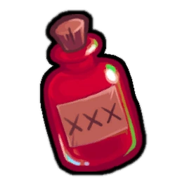

# Bootlegger

- **Facción:** Mafia  · *en alcance MVP*
- **Página de la wiki:** Bootlegger

## Ficha

**Clase (alineamiento):**

> Mafia Support

**Tipo:**

> Roleblocking
> Non-unique

**Prioridad de acción:**

> 2 (Highest)

**Resumen:**

> You are a beautiful dancer working for organized crime.

**Objetivo:**

> Kill anyone that will not submit to the Mafia.

**Habilidades:**

> Distract someone each night.

**Atributos:**

> Role block Immunity
> Attack: None
> Defense: None

**Atributos (texto):**

> Sharing a drink blocks your target from using their role's night ability.
> If there are no kill capable Mafia roles left you will become a Mafioso.
> You can talk with the other Mafia at night.

**Especial:**

> Mafia chat
> Becomes Mafioso when Mafia Killing are dead

**Gana con:**

> Mafia
> Survivor
> Witch

**Debe matar para ganar:**

> Town
> Vampires
> Coven
> Plaguebearer
> Pestilence
> Arsonist
> Serial Killer
> Werewolf
> Juggernaut

**Resultado Sheriff:**

> Your target is suspicious or framed!

**Resultado Investigator:**

> Investigator Results
> Your target could be an Tavern Keeper, Transporter, Bootlegger, or Hypnotist.

**Resultado Consigliere:**

> Your target is a beautiful person working for the Mafia. They must be a Bootlegger.

## Texto completo de la wiki

| 

Bootlegger 

Alignment

 Mafia Support

Avatar

Immunities

Role block Immunity

Attack: None

Defense: None

Special

 Mafia chat

Becomes Mafioso when Mafia Killing are dead

 Ability Stats

 | Type

 | Priority

 | Roleblocking

Non-unique

 | 2 (Highest)

Investigation Results

 Sheriff

Your target is suspicious or framed!

 Investigator

 Investigator Results

Your target could be an Tavern Keeper, Transporter, Bootlegger, or Hypnotist.

 Consigliere

Your target is a beautiful person working for the Mafia. They must be a Bootlegger.

Game Information

Summary

You are a beautiful dancer working for organized crime.

Abilities

Distract someone each night.

Attributes

Sharing a drink blocks your target from using their role's night ability.

If there are no kill capable Mafia roles left you will become a Mafioso.

You can talk with the other Mafia at night.

Goal

Kill anyone that will not submit to the Mafia.

 Victory Conditions

 | Wins with

 | Must kill

 | Mafia

 Survivor

 Witch

 | Town

 Vampires

 Coven

 Plaguebearer

 Pestilence

 Arsonist

 Serial Killer

 Werewolf

 Juggernaut

 | 

 | DISCLAIMER: These stories are fanmade, and are not created or endorsed in any way by BlankMediaGames or Digital Bandidos.

No one should have to manipulate people on the whim of a higher power, but then again, no one would want to, either. A beautiful and unfortunate young woman had lost everything. She had nothing - no job, no home, no family or friends to turn to, not even hope - but eventually found salvation in the world of organized crime. Though reluctant, the Consort felt she was a respected member of the Mafia. Unknown to her, she was just being used as the Mafia's residential Femme Fatale. Much to the Consort's chagrin, her role in the mafia stuck with her, and she was too far into the whole ordeal to back out. As the sands of time flew forth, the Consort began to embrace her position, and, over time, executed her missions with confidence, tact, and prestige. In the end, she had it all: respect, power, and most importantly, the love and trust of the Godfather. All she had left to fear in the world was the pedestal upon which her own execution could commence, and the cold blade of a Serial Killer.

Mechanics[]

You may choose to Roleblock a target each Night, which prevents them from using their Night ability.

You may Roleblock someone who left the game the same Day/ Night. This can be used for tricking Spies.

You cannot be Roleblocked.

If you role block a Serial Killer (that isn't Cautious), or a Werewolf (during a Full Moon), they will attack you.

If said roles are Jailed, your visit will fail and they will not attack you. They will however be notified that someone tried to Roleblock them while in jail.

You will know exactly if you Roleblock a Serial Killer or not. You will not know if you directly Roleblock a Werewolf, you will only know that you were attacked by one. The Werewolf themselves however will know.

A Bodyguard can counter-attack both of these roles if they protected you.

 Serial Killers will still attack their intended target.

There are multiple roles that are immune to your Roleblock (such as the Transporter, Veteran, Tavern Keeper, Witch/ Coven Leader, and Pestilence).

If a Pirate duels you, you will still be able to Roleblock someone because you are Roleblock Immune.

If there are no kill capable Mafia roles left, you will always be the first Mafia member to be promoted to Mafioso.

Strategy[]

As a Bootlegger, your job is to cause as much trouble as possible to the Town, Coven and Neutrals without getting caught. You are also the Mafia's last line of defense if there is an Investigator or Sheriff roaming around. While Doctors and Bodyguards protect an Investigator from harm, they do not protect the Investigator from being Roleblocked, making you a key role to the Mafia.

As you are a member of the Mafia, you should avoid a Tavern Keeper-style list of everyone you've role blocked in your Last Will, as it reveals who the non- Mafia are. However, since you die if you role block a Werewolf, you may want to write down just the last person you role blocked; that way, if you die to a Werewolf, you will likely get them Hanged. As an added bonus, even if the Werewolf is not your target and happens to target you at random, you may get an innocent Townie Hanged anyway! But if you want to hide who is the Werewolf, when you Roleblock someone, don't write the last person you role blocked in your Last Will. This strategy will make the Town unaware of who is the Werewolf, and the members of the Mafia will still know who you had visited last Night. You can do this to the Veteran as well.

It is one of your highest priorities to find and role block Town Investigative roles, as doing this makes their job completely useless. Another high priority is to role block the Town Protective roles so that the Mafia may kill without interruption (You can also do this to the Potion Master and Guardian Angel as well). The next high priority is other killing roles (but avoid the Veteran on alert, the Werewolf on a Full Moon Night, Serial Killers, and Pestilence as you'll die upon visiting them) so that the members of the Mafia may not die at Night (ie. if a member of the Mafia is jailed, you can role block the Jailor so they can't execute said member of the Mafia. Be careful if there is a Spy in-game as they can easily call out the existence of a Bootlegger if you do role block the Jailor). You can also do this to prevent a non-factional Neutral role (like a Jester) from dying at Night, encouraging them to side with the Mafia. Also, role blocking a Spy prevents them from seeing who the Mafia had visited that Night which may sometimes be important. Finding the Arsonist and stopping them from possibly dousing/igniting members of the Mafia can lead you to an easy victory (however, it's might be in the Mafia's interest to let him douse other players thus throwing off an Investigator. This is especially true early game) The same applies to Juggernauts as unlike the Werewolf, they do not rampage at home regardless if they were role blocked or not, allowing you to permanently shut them down at any time.

As a Bootlegger, always try to work with the other Mafia Support roles in the game. The Consigliere or Blackmailer may find an important role in the game for you to role block, such as a Town Investigative/ Town Protective role, a Vigilante, Jailor, youngest Vampire, Juggernaut, Potion Master, or even a Medusa that is not immune to your roleblocks and will be able to be killed safely.

Being a Bootlegger is the easiest role to cover up since you can claim Tavern Keeper, although sometimes this is tricky, since Town Support and Random Town roles could all be claimed and confirmed. Since the effects of your actions are noticeable to the rest of the Town without killing them, it may be possible to claim that you are a Tavern Keeper if someone asks your role, and list the people you've blocked the past few Nights (players can say, "Yes, I was role blocked.") Doing so may help you win over the Town's favor and secure your position in the role-list, especially near the end of the game. You may even prove your role by publicly promising to role block a particular person the next Night. But if you are planning to role block a confirmed Vigilante, don't claim to be a Tavern Keeper, because then questions will arise when the Vigilante says he's been continuously being role blocked when he wants to shoot somebody (unless there's a Hypnotist using the controlled message on him to help your claim).

You can also claim Tavern Keeper and pretend role block one of your Mafia members (especially one accused of being a Mafia Killing) to ‘confirm’ both (more info listed below).

Unlike a Hypnotist, your Tavern Keeper claim cannot be disproven by Roleblock immune roles or roles that produce obvious results at Night.

If you are claiming Tavern Keeper, you should not role block any confirmed Town unless you absolutely need to. Since a Tavern Keeper would be role blocking suspicious people, doing so could make people believe you are a Bootlegger instead.

If you want to claim Tavern Keeper, see if there is a Spy and Disguiser, Spy is your worst enemy when claiming Tavern Keeper because they know your Mafia visits and can report them to the Town. Of course this is negated with a simple Disguise.

You can also scramble your role blocks in your last will so a Spy doesn't suspect you, however a smart townie might notice they were roleblocked on a different Night and you will likely be Hanged. 

While being a Bootlegger may be easy to fake as a Tavern Keeper, remember the fact that you still retain the attributes of a normal Tavern Keeper as well. This means that you will still die if you role block a Serial Killer or a Werewolf on a Full Moon. However, this can be useful to the Mafia, as they now are aware of said person being evil, especially if your Last Will gets bloodied the next day.

Watch out for Lookouts on roles like the Jailor. They can easily call you out as a Bootlegger. Make sure to prioritize these roles to kill first or have a Disguise to divert suspicion onto another Townie.

If the Mafia is planning on killing a Bodyguard or Doctor, then it may be a good idea to role block the Bodyguard or Doctor to prevent them from using their temporary self protections to ensure their death (Doing this to a Survivor can have a similar effect). You cannot prevent a Veteran from using their self protections since Veterans are Role block Immune and will kill both you and the Mafia role attacking the Veteran.

You can also do this to Survivor claims to test for Night immunity. If you suspect the claim is a Werewolf, test them on a non- Full Moon Night.

If you're facing Vampires, you want to identify and continuously role block the youngest Vampire. The easiest way to do this is to identify a likely Townie, someone who is definitely not a Vampire yet and then role block them repeatedly; ideally, the Vampires will eventually bite them, at which point you'll be able to keep them from biting again.

However, if you do not know or cannot find who the youngest Vampire is, you could be wasting your role block on a useless person, especially a Vampire that is not the youngest. Keep this in mind when you could be role blocking a far more dangerous target.

If the Ambusher killed a Vampire and their target survived the Night, there is decent chance that their target has been converted. It would be a good idea to roleblock the Ambusher's original target as they could be the newly converted Vampire if they weren't killed, and you'll be able to keep the Vampires from biting again. If they're an immune role, you can still role block them to prevent a potential Arsonist from igniting.

The Coven is more vulnerable to role blocks in general, since they produce obvious deaths/messages unlike the Vampires. If you find a member of the Coven with the Necronomicon or a Poisoner from role-blocking them, you can then either use public accusation to get them Hanged, or ask the other Mafia to kill them.

Unlike a Veteran, a Medusa is not immune to your role blocks, and will be unable to kill you (or anyone else) if you visit them. Therefore, you can role block them to allow the Mafia to kill them safely (the same applies for a Tavern Keeper).

A Consigliere can safely search for the Medusa with your assistance. This also applies to Survivor claims you suspect to be Medusa.

Keep in mind that the Coven Leader and the Necromancer are both immune to your roleblocks.

A viable strategy is to claim to be a Tavern Keeper, then write in your Last Will that you have role blocked members of the Mafia. Then, those members of the Mafia can "confirm" you to be a true Tavern Keeper by saying that they were role blocked. Additionally, if you die and your Last Will is revealed, the Town might think the people you role blocked were also Town (since you can't role block members of the Mafia). Be wary of this as this strategy is commonly used and people may suspect you as a Bootlegger.

Another way of performing this is if the Mafia does not kill for the Night, and you role block someone, claim they are the Godfather who got Roleblocked. if the Town thinks you are a Tavern Keeper, you might just divert the blame onto a Townie.

If you want to claim Tavern Keeper, it may be a good idea to not randomly role block early.

Claiming Tavern Keeper could be dangerous as if a confirmed townie asks you to role block a fellow Mafia member. You could be easily outed as evil as you cannot role block them. Of course, your other Mafia member can claim role blocked in order to lower suspicion on them and you, but if they die, you will look very suspicious to the Town.

You may also get outed by a Lookout or Tracker when they see you didn't visit your other Mafia member, which is why you take some caution when deciding to claim Tavern Keeper.

Another viable strategy is if you don't want to claim Tavern Keeper is claiming Spy, since you know who the Mafia visits and you can fake an accurate bug result by claiming to have bugged the person you roleblocked. If the Jailor meta is in play, you can role block the Jailor Night 1 and claim to have seen the roleblock in your bug result.

Of course, this can backfire if anything else happened to the Jailor (ie. other roleblocks, controls), as they'll call you out for not seeing the other messages.

Do not try this in Coven All Any, there are Coven visits you will not be able to detect.

You can also claim Transporter since this also fits in your Investigator results. You can strengthen your claim with a Forger or a Hypnotist collaborating with you which may be important to take away a possible Town Support claim space needed to get a Medium or Retributionist Hanged.

In Coven All Any, it is a good idea to claim Tavern Keeper, as the only Town roles who can detect you ( Sheriffs and Spies) are unlikely to spawn. In addition, you can Roleblock non- Mafia members who didn't claim, which will make Town trust you if they end up being the Coven.

Achievements[]

 | Name

 | Description

 | Merit Points

 | Accompany

 | Win your first game as a Bootlegger

 | 20

 | Companion

 | Win 5 games as a Bootlegger

 | 20

 | Divert Your Attention

 | Win 10 games as a Bootlegger

 | 40

 | Entertainer

 | Win 25 games as a Bootlegger

 | 100

 | Dangerous Profession

 | Die to the Serial Killer you visited

 | 20

 | Distracting

 | Role block yourself

 | 40

 | It's a trap!

 | Role block the Godfather

 | 40

 Only achievable with a Transporter or Witch/ Coven Leader.

Messages[]

 | 

 | Someone occupied your night. You were role blocked!

 | Displays at the end of the night when a Bootlegger role blocks someone. 

 | Someone tried to role block you but you are immune!

 | Displays at the end of the Night to a role block immune player.

 | Someone tried to role block you but you were in jail.

 | Displays when you are jailed and a Bootlegger tries to roleblock you.

Trivia[]

 Bootlegger is the only role to have an exact duplicate of its role in another faction.

The Bootlegger's old icon () (when it was still known as Consort) reflected how the Bootlegger is an Escort, with it being extremely similar to the Escort's old icon ().

Prior to Version 2.0.0.6537, a Serial Killer would attack a Consort for role blocking them even if they were Jailed and/or executed.

History[]

3.3.11

Role renamed to Bootlegger

Updated Bootlegger's icon to a placeholder (), previous icon was ().

3.2.4

Reanimated Ambusher will no longer attack roles that attempted to visit but were Roleblocked.

3.1.14

Fixed Tracker incorrectly seeing someone visiting when Roleblocked.

2.5.5.12200

The Consort's role icon has been changed. Old one was .

Added Consort's circled role icon ().

Town of Salem Release

Introduced as Consort.

 | 

 | 
Roles

 | 

 | 

 | 
 Town

 | 

 | Town Investigative | | Investigator • Lookout • Psychic • Sheriff • Spy • Tracker | | 

 | 

 | Town Killing | | Jailor • Vampire Hunter • Veteran • Vigilante

 | 

 | Town Protective | | Bodyguard • Crusader • Doctor • Trapper

 | 

 | Town Support | | Mayor • Medium • Retributionist • Tavern Keeper • Transporter

 | 
 Mafia

 | 

 | Mafia Deception | | Disguiser • Forger • Framer • Hypnotist • Janitor | | 

 | 

 | Mafia Killing | | Ambusher • Godfather • Mafioso

 | 

 | Mafia Support | | Blackmailer • Bootlegger • Consigliere

 | 
 Coven

 | 

 | Coven Evil | | Coven Leader • Hex Master • Medusa • Necromancer • Poisoner • Potion Master | | 

 | 
 Neutral

 | 

 | Neutral Benign | | Amnesiac • Guardian Angel • Survivor | | 

 | 

 | Neutral Evil | | Executioner • Jester • Witch

 | 

 | Neutral Killing | | Arsonist • Juggernaut • Serial Killer • Werewolf

 | 

 | Neutral Chaos | | Pirate • Plaguebearer/ Pestilence • Vampire

## Implementación

- [ ] Definido en `packages/engine` con su prioridad y facción
- [ ] Acción nocturna (si aplica) validada con objetivos legales
- [ ] Resultado de investigación correcto (Sheriff / Investigator / Consigliere)
- [ ] Condición de victoria y de derrota comprobada en tests
- [ ] Tests unitarios del rol en verde
- [ ] Tarjeta y texto de ayuda en la app
- [ ] Icono e ilustración propia (no el arte de la wiki)
- [ ] Plantillas de narración para sus eventos
