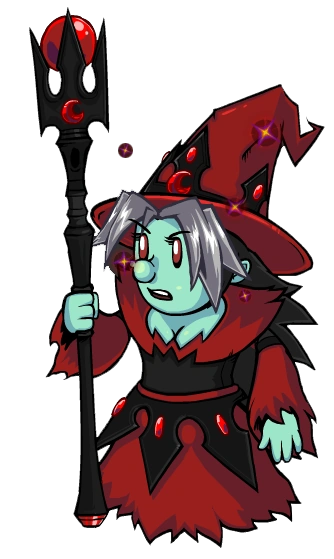

# Coven Leader

- **Facción:** Coven  · *fase posterior (referencia)*
- **Página de la wiki:** Coven Leader

## Ficha

**Clase (alineamiento):**

> Coven Evil

**Tipo:**

> Disruption
> Killing
> Unique

**Prioridad de acción:**

> 2

**Resumen:**

> You are a voodoo master who can control other peoples[sic] actions.

**Objetivo:**

> Kill all who would oppose the Coven.

**Habilidades:**

> You may choose to Control someone each night.

**Atributos:**

> Role block Immunity
> Detection Immunity (with the Necronomicon)
> Attack: None (Basic with the Necronomicon)
> Defense: None (Basic with the Necronomicon)

**Atributos (texto):**

> Your victim will know they are being controlled.
> With the Necronomicon, your victim is dealt a Basic attack and you gain Basic defense.
> You will know the role of the player you control.

**Especial:**

> Coven Chat
> Unique Role
> Will inherit the Necronomicon on Night 3

**Si hay Godfather/otro objetivo:**

> With the Necronomicon:
> Attack and use ability of controlled target on second target

**Resultado Investigator:**

> Coven Expansion Results
> Your target could be a .

**Resultado Consigliere:**

> Your target leads the mystical. They must be the Coven Leader.

## Texto completo de la wiki

(sin texto en el alcance)

## Implementación

- [ ] Definido en `packages/engine` con su prioridad y facción
- [ ] Acción nocturna (si aplica) validada con objetivos legales
- [ ] Resultado de investigación correcto (Sheriff / Investigator / Consigliere)
- [ ] Condición de victoria y de derrota comprobada en tests
- [ ] Tests unitarios del rol en verde
- [ ] Tarjeta y texto de ayuda en la app
- [ ] Icono e ilustración propia (no el arte de la wiki)
- [ ] Plantillas de narración para sus eventos
