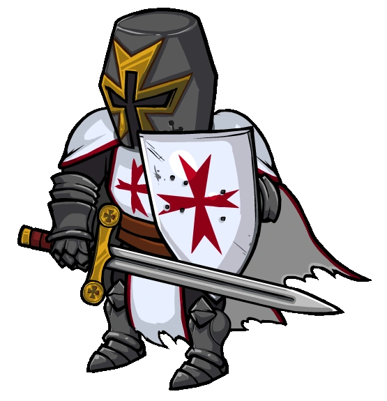

# Crusader

- **Facción:** Town  · *en alcance MVP*
- **Página de la wiki:** Crusader (ToS)

## Ficha

**Clase (alineamiento):**

> Town Protective

**Tipo:**

> Protection
> Killing
> Non-unique

**Prioridad de acción:**

> 3

**Resumen:**

> You are a divine protector whose skills in combat are unmatched.

**Objetivo:**

> Hang every criminal and evildoer.

**Habilidades:**

> Protect one person during the night.

**Atributos:**

> Attack: Basic
> Defense: None

**Atributos (texto):**

> Grant your target Powerful defense
> You will know if your target is attacked.
> You attack one person who visits your target on the same night.
> You do not attack vampires, but you do block their attacks.

**Si hay Godfather/otro objetivo:**

> Protect target and attack one visitor

**Gana con:**

> Town
> Survivor

**Debe matar para ganar:**

> Mafia
> Vampires
> Arsonist
> Serial Killer
> Werewolf
> Coven
> Plaguebearer
> Pestilence
> Juggernaut

**Usos:**

> Unlimited, but can't go on self

**Resultado Investigator:**

> Coven Expansion Results
> Your target could be a Bodyguard, Godfather, Arsonist, or Crusader.

**Resultado Consigliere:**

> Your target is a divine protector. They must be a Crusader.

## Texto completo de la wiki

| 

 | 

 | This page describes content that can only be accessed in the Coven Expansion.

Crusader 

Alignment

 Town Protective

Avatar

Immunities

Attack: Basic
Defense: None

 Ability Stats

 | Type

 | Priority

 | Protection

Killing

Non-unique

 | 3

Actions

Target other

Protect target and attack one visitor

Investigation Results

 Sheriff

You cannot find evidence of wrongdoing. Your target is innocent or great at hiding secrets!

 Investigator

 Coven Expansion Results

Your target could be a Bodyguard, Godfather, Arsonist, or Crusader.

 Consigliere

Your target is a divine protector. They must be a Crusader.

Game Information

Summary

You are a divine protector whose skills in combat are unmatched.

Abilities

Protect one person during the night.

Attributes

Grant your target Powerful defense

You will know if your target is attacked.

You attack one person who visits your target on the same night.

You do not attack vampires, but you do block their attacks.

Goal

Hang every criminal and evildoer.

 Victory Conditions

 | Wins with

 | Must kill

 | Town

 Survivor

 | Mafia

 Vampires

 Arsonist

 Serial Killer

 Werewolf

 Coven

 Plaguebearer

 Pestilence

 Juggernaut

 | 

 | DISCLAIMER: These stories are fanmade, and are not created or endorsed in any way by BlankMediaGames or Digital Bandidos.

Until a few nights ago, the Crusader was always willing to sacrifice his life for that of another townie. It was a noble deed, and it was the Bodyguard's job. But one night, while on guard, it occurred to him that if he just shot the visitor before they attacked, he could protect whomever he was supposed to protect, and live!

So the Crusader stood, daring anyone to try and attack this house. He was on a mission, not just to protect the owner of this house, but to get rid of all evil in this town. He would save the town, and survive to become a celebrated hero at the end. As he began to think this night would be as uneventful as all the other nights, he heard soft footsteps.

Three clean shots stopped the serial killer’s reign of terror. As the Crusader kicked the body over, knives glinted in the moonlight.

Hearing gunshots from the home he planned to visit, the mafioso, lurking not too far away, turned back home. The Godfather would be angry, but a mad Godfather was better than a dead mafioso.

Morning came, and the joyful Crusader practically skipped to the town square where dead would be announced. As the townies woke up, they stared at each other, observing who was absent. The Mayor called for everyone’s attention as the Sheriff dragged a body out in the middle of the square. It was the serial killer, the one the Crusader had killed last night.

“This townie was killed by a Crusader last night,” the Sheriff stated. The townies pointed to a shabby house, identifying it as the dead person's house. The Sheriff and the Investigator entered the house. The Crusader tensed in anticipation. In a few seconds, they would announce that the serial killer was dead.

It was only when the Sheriff raised his head, his grim demeanor becoming visible, that the Crusader realized he had made a grave mistake. The Investigator held up a box of medicines for the town to see. As the Crusader heard the Investigator’s quietly uttered words, he fell to his knees in shock and horror.

“The doctor was killed last night.”

Mechanics[]

You can choose someone other than yourself to protect each night, granting them a temporary Powerful Defense from all attacks. You will deal a Basic Attack to one random visitor to your target, even if your target is not attacked.

If your target is attacked, the message "You were attacked but someone protected you!" will appear to them. You will receive the message "Your target was attacked last night!"

Your divine protection extends to all attacks; including a Bodyguard dying to protect their target, or your target being killed by any role that attacks visitors (such as Veterans and Medusa). This is similar in ability to the Doctor's heal.

Your protection does NOT cure Poison.

You will not attack Vampires or any Astral visitors, including attacking ones (most notably the Hex Master).

You will not get a message saying your target was attacked if you save a Bodyguard who successfully protected someone (this is a bug).

Your ability will fail if your target was Jailed, however, due to a bug, you will still get a message about your target having been attacked if someone tried to attack them in Jail.

Strategy[]

You can protect someone who asks for a Crusader on them, but you shouldn't protect someone who asks for a Town Protective on them, unless all other Town Protective roles are dead. You may accidentally kill another Town Protective role. Be cautious, as Medusas often bait Town Protective and Town Investigative roles this way. If someone asks for Crusader on them, if the role list allows for multiple, you may want to claim so that you don't die that night to another Crusader.

Protecting a confirmed Townie with little or no chance of a Lookout is often a good idea as there is little reason for another player besides an evil one to visit the said Townie. However, if another Town Protective visits the confirmed Townie, you will kill them.

Protecting a player that left the same Day/ Night can kill any Ambushers, Forgers, and Janitors visiting them. Do note that if the player is targeted by an Ambusher, you will die with them if you are attacked or are the only non- Mafia visitor.

More often than not, you should not protect early in the game as there is a high chance of killing a fellow Townie. An exception would be if the majority of players are evil, such as in Coven Custom.

If you are nearing the end of a game or evils have the majority, protect a player every night. You need evils to be dead at this point and they have a high chance of visiting your target. Make sure you're not out in the open, have another Town Protective on you.

Unlike a Doctor, you are able to provide direct protection to a revealed Mayor independently, assuming you are not roleblocked. In a game with no other Town Protectives, you are free to protect them every night without limitations.

This has many other benefits as well, such as the you being able to kill Blackmailers, Hex Masters, and Pirates attempting to visit the Mayor as well as attackers.

Unlike an Ambusher, you do not attack Vampires, but you do prevent their attacks/conversions.

If you do this strategy, either insure you are the only Town Protective left or openly claim. If you don't get the word out, there is a high chance that you will end up killing a Lookout, Bodyguard, or another Crusader that had the same idea as you.

In a VIP mode game, protect the VIP every night. This way, you can prevent the VIP from dying. Players are often conscious that the VIP will be protected by a Crusader and would rather not visit him. Typically, the Crusader will openly claim on Day 1.

If there are multiple Crusader claims, protect the VIP/each other in the order you claimed to prevent multiple Crusader deaths. First claim goes on the VIP, second claim goes on the first claim, etc.

If there is another confirmed Crusader in the game, make sure never to have both of you protecting a target at the same time. Whisper to each other who you are going to protect. You both have the possibility of killing each other if both of you visit the same target.

Watch out for people that might claim Crusader on Day 1 because they may be a Medusa trying to bait Town Protective roles.

As a last resort, you are able to cancel out with an Ambusher if you both visit the same target. This is usually more than a fair trade, however; as the Mafia losing a killer outweighs losing a Townie in most circumstances (unless evils have majority and you're the only killing Town role overall).

As you are able to attack all visitors and not just attackers, if someone is being blackmailed, controlled, or roleblocked repeatedly, you might want to consider protecting that target. You have a high chance of killing a Blackmailer, Consort, or Coven Leader.

Keep in mind, however; after the Coven Leader receives the Necronomicon, they will be able to survive your Basic Attacks; but you will still protect your target from being drained.

You will also not be able to kill roles with defense, such as Arsonists.

You may accidentally kill a Lookout seeking to bust said roles or if your target is actually evil, you might be freeing them up to kill someone.

Be extremely cautious about protecting a Mayor early on, since it's very likely other Town will protect him as well. Make sure to communicate to your fellow Townies to decide who to protect.

A Crusader can pair up with a Doctor, Bodyguard or another Crusader to make both of you nearly invulnerable, in much the same way that a Doctor can pair up with a Bodyguard. You cannot maintain persistent invulnerability with a Bodyguard, since you can be killed by either Astral Attacks or the Ambusher/ Werewolf, but it can still be a useful strategy to ensure that evils lose someone if they attack either of you. The only major threat to these combos are Arsonists, so make sure to rid of them first.

Unlike a Bodyguard or Doctor, you do not have a self-heal or bulletproof vest available to protect yourself from harm. Therefore, if you are relatively sure there are no other Town Protectives, you should be wary of revealing yourself too early.

Achievements[]

 | Name

 | Description

 | Merit Points

 | Divine Protector

 | Win your first game as a Crusader

 | 20

 | Righteous Fury

 | Win 5 games as a Crusader

 | 20

 | Devotion

 | Win 10 games as a Crusader

 | 40

 | Deus Vult

 | Win 25 games as a Crusader

 | 100

 | Blessing of Protection

 | Protect 5 people in a game

 | 20

 | Just a Flesh Wound

 | Attack 5 people in a game

 | 20

 | Unholy Mistake

 | Attack Pestilence

 | 100

 They will live and you will die, unless you have some form of protection.

Messages[]

 | 

 | You were attacked by a Crusader!

 | Displays at the end of the night when you visit the Crusader's target and you are the player that the Crusader attacks.

 | Your target was attacked last night!

 | Displays at the end of the Night when someone attempts to attack your target.

 | You attacked someone visiting your target!

 | Displays at the end of the Night if someone visits your target.

 | You were attacked but someone protected you!

 | Displays to a player attacked but protected by a Crusader. 

 | [They were] killed by a Crusader. or [They were] also killed by a Crusader.

 | Cause of death for a player who was attacked and killed by a Crusader.

Trivia[]

Lots of players have joked that the Crusader is essentially a green Ambusher, with its ability to attack a random visitor to its target being very similar to the latter's.

However, Ambushers cannot attack Mafia members, while you can attack Townies.

The Crusader is the only Town Protective equipped with a Basic Attack.

It is also the only one with the potential to kill non-attacking roles.

History[]

3.3.4

Removed Crusader-specific Hypnotist message option from Classic Town of Salem.

3.2.4

Temporary Defense given by certain roles through game mechanics now give attackers the message "Your target's defense was too strong to kill.".

3.2.3

 Trapper will no longer die to Attack if another Trapper has placed a Trap on them.

Dual Trappers can now save each other if they have placed Traps on each other and both are attacked.

2.5.5.12200

The Crusader's role icon has been changed. Old one was .

Added Crusader's circled role icon ().

2.5.1.10655

Fixed Guardian Angel "target was attacked" feedback.

2.0.0.6582

Introduced.

 | 

 | 
Roles

 | 

 | 

 | 
 Town

 | 

 | Town Investigative | | Investigator • Lookout • Psychic • Sheriff • Spy • Tracker | | 

 | 

 | Town Killing | | Jailor • Vampire Hunter • Veteran • Vigilante

 | 

 | Town Protective | | Bodyguard • Crusader • Doctor • Trapper

 | 

 | Town Support | | Mayor • Medium • Retributionist • Tavern Keeper • Transporter

 | 
 Mafia

 | 

 | Mafia Deception | | Disguiser • Forger • Framer • Hypnotist • Janitor | | 

 | 

 | Mafia Killing | | Ambusher • Godfather • Mafioso

 | 

 | Mafia Support | | Blackmailer • Bootlegger • Consigliere

 | 
 Coven

 | 

 | Coven Evil | | Coven Leader • Hex Master • Medusa • Necromancer • Poisoner • Potion Master | | 

 | 
 Neutral

 | 

 | Neutral Benign | | Amnesiac • Guardian Angel • Survivor | | 

 | 

 | Neutral Evil | | Executioner • Jester • Witch

 | 

 | Neutral Killing | | Arsonist • Juggernaut • Serial Killer • Werewolf

 | 

 | Neutral Chaos | | Pirate • Plaguebearer/ Pestilence • Vampire

## Implementación

- [ ] Definido en `packages/engine` con su prioridad y facción
- [ ] Acción nocturna (si aplica) validada con objetivos legales
- [ ] Resultado de investigación correcto (Sheriff / Investigator / Consigliere)
- [ ] Condición de victoria y de derrota comprobada en tests
- [ ] Tests unitarios del rol en verde
- [ ] Tarjeta y texto de ayuda en la app
- [ ] Icono e ilustración propia (no el arte de la wiki)
- [ ] Plantillas de narración para sus eventos
