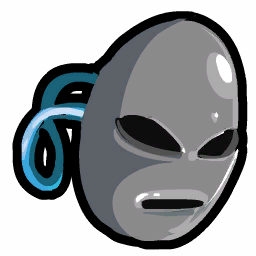
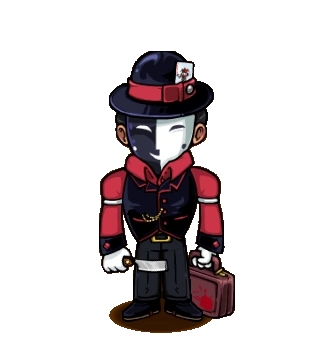

# Disguiser

- **Facción:** Mafia  · *en alcance MVP*
- **Página de la wiki:** Disguiser (ToS)

## Ficha

**Clase (alineamiento):**

> Mafia Deception

**Tipo:**

> Manipulation
> Non-unique

**Prioridad de acción:**

> 3

**Resumen:**

> You are a master of Disguise who can make people appear to be someone they are not.

**Objetivo:**

> Kill anyone that will not submit to the Mafia.

**Habilidades:**

> Disguise a mafia member as a non-mafia member to alter their identity.

**Atributos:**

> Attack: None
> Defense: None

**Atributos (texto):**

> The Disguised Mafia member will appear to have the same role as the non-Mafia member to the Investigator and Sheriff.
> Your Disguised Mafia member will appear to be the other person to a Lookout.
> When Disguised as a Town member, Mafia visits are disregarded by Spy.

**Especial:**

> Mafia chat
> Becomes Mafioso when Mafia Killing are dead

**Gana con:**

> Mafia
> Survivor
> Witch

**Debe matar para ganar:**

> Town
> Vampires
> Coven
> Plaguebearer
> Pestilence
> Arsonist
> Serial Killer
> Werewolf
> Juggernaut

**Resultado Sheriff:**

> Your target is suspicious or framed!

**Resultado Investigator:**

> Classic Results
> Your target could be a .
> Coven Expansion Results
> Your target could be a .

**Resultado Consigliere:**

> Your target makes other people appear to be someone they're not. They must be a Disguiser.

## Texto completo de la wiki

| 

 | Looking for the Traitors in Salem role?

This role appears in Town of Salem and Traitors in Salem. For the TiS counterpart, see Disguiser

Disguiser 

(Disg)

Alignment

 Mafia Deception

Avatar

Immunities

Attack: None

Defense: None

Special

 Mafia chat

Becomes Mafioso when Mafia Killing are dead

 Ability Stats

 | Type

 | Priority

 | Manipulation

Non-unique

 | 3

Investigation Results

 Sheriff

Your target is suspicious or framed!

 Investigator

Classic Results

Your target could be a Doctor, Disguiser, or Serial Killer.

 Coven Expansion Results

Your target could be a Doctor, Disguiser, Serial Killer, or Potion Master.

 Consigliere

Your target makes other people appear to be someone they're not. They must be a Disguiser.

Game Information

Summary

You are a master of Disguise who can make people appear to be someone they are not.

Abilities

Disguise a mafia member as a non-mafia member to alter their identity.

Attributes

The Disguised Mafia member will appear to have the same role as the non- Mafia member to the Investigator and Sheriff.

Your Disguised Mafia member will appear to be the other person to a Lookout.

When Disguised as a Town member, Mafia visits are disregarded by Spy.

Goal

Kill anyone that will not submit to the Mafia.

 Victory Conditions

 | Wins with

 | Must kill

 | Mafia

 Survivor

 Witch

 | Town

 Vampires

 Coven

 Plaguebearer

 Pestilence

 Arsonist

 Serial Killer

 Werewolf

 Juggernaut

 | 

 | DISCLAIMER: These stories are fanmade, and are not created or endorsed in any way by BlankMediaGames or Digital Bandidos.

There once was a girl who liked to play pretend. Everyday she got out her dolls, the fake teacups, and the imaginary friends. No one thinks twice when a little girl plays pretend. It was only a matter of time before the mafia found her. She became the disguiser, anyone who the town trusts is killed, their place taken by her. Now the girl gets out her make up and latex, morphing her face until it is a perfect replica of who the mafia killed the same night. Then, she takes her place among the town taking the victim's name and talking for the benefit of the mafia. With the trust of the town placed on her, it's too easy manipulating the town to do as the mafia pleases now. The citizens were never expecting a disguiser to take their place, and when they find out of the trick that was played, the disguiser has already found a new skin to talk in.

Mechanics[]

You may Disguise any living member of the Mafia, as a living, non- Mafia target. This will cause Sheriffs, Investigators, Lookouts, and Spies to receive incorrect results.

The Sheriff will be fooled by a Disguiser's Disguise; the Sheriff will see the Disguised Mafia member as innocent or suspicious depending on the role of the Mimic target.

An Investigator will see the Disguised Mafia member's investigative result as the investigative result of the specific role they were Disguised as. For instance, disguising someone as a Sheriff will change their investigative results to that of the Sheriff for the night.

A Lookout will see Disguiser's second target visit the player they were watching, instead of the Disguised Mafia member who actually performed the visit. For example, if the Mafioso visits Player A, and a Lookout is watching Player A, but a Disguiser has Disguised the Mafioso as Player B, the Lookout will see Player B visit their target instead of the Mafioso.

When you Disguise yourself as someone and a Lookout is watching you, the Lookout will see your Mimic target visit you instead of seeing you visit yourself. However, a Lookout will still see your name when watching the player you Disguised yourself as. The latter may be a bug.

A Spy will not see the visits of a Mafia member Disguised as a non- Mafia member.

You will hide your own visits from from the Spy when you Disguise yourself.

If a Mafia member is Disguised as a Coven member, the Spy will not see the visit as a Mafia visit nor a Coven visit.

You have an unlimited amount of Disguises.

You will not receive a message confirming your Disguise has succeeded.

You will not receive a message stating which role you have Disguised a Mafia member as.

You can Mimic any non- Mafia role.

You cannot Disguise a Mafia member as a target that has been Jailed.

You can Disguise a Mafia member as a target that has left the game before the Night ends (and vice versa).

The second target does not need to die in order to Disguise as them.

Neither targets will get a notification about being visited by a Disguiser.

If a Consigliere ends up targeting a Disguised player, the Consigliere will not be fooled. The Consigliere will see the Disguised player as their real role.

Someone who is Doused/ Hexed and Disguised as someone will still appear under the Arsonist's/ Hex Master's investigative result to the Investigator.

If you get controlled, the Witch/ Coven Leader will only change your first target. Your second target stays the same.

If you choose no action at night, the controller cannot force you to visit anyone (so it might be wise to stay home on the second Night if you suspect that a Coven Leader might control you into Medusa).

Strategy[]

Deciding who to Disguise[]

In the beginning, if you decide to Disguise, you should consider what Mafia member needs your Disguise the most, as some of your Mafia's abilities are nullified by a Spy, and they could call out your Mafia for having visits that match Mafia visits.

If you are unsure which Mafia member to Disguise, it's almost always best to Disguise yourself when you lack other plans. Not only will this protect you from a prying Sheriff or Investigator, but this will also hide both your visits from the Spy, allowing you to freely use your ability without being called out by a Spy.

Later in the game, as more roles are known, you might be able to Disguise your Mafia to help support their claims to an Investigator.

For example, if you originally Disguise someone as a Sheriff, and later find an Executioner, you can use the Executioner as an alternative should the Sheriff somehow die.

It is recommended to tell the Mafia to not kill certain targets so you can Disguise them to match their claim if an Investigator is roaming around.

Your Disguises are a powerful tool to negate the info of Town Investigatives, use them to throw a suspicious Sheriff or Investigator off the Mafia's scent.

If there's a Sheriff, you may need to Disguise one of your Mafia teammates to make them appear as innocent to the Sheriff. If there's a Spy in-game, you will need to Disguise the Mafioso or Janitor in particular as their target to "spoof" the visits and prevent the Spy from seeing any anomalies in the Mafia visits (ex. Player C died to Mafia, but the Spy did not see the Mafia visit Player C).

A risky play you can make is to ask a Lookout to watch you while you Disguise yourself as someone who claimed a non-visiting role (like a Medium or Retributionist). If a Lookout does watch you, they'll see the Medium "visit" you, which can lead to the Lookout accusing the Medium claim, causing confusion within the Town and potentially getting 3 Townies killed.

More experienced, smarter players, however, will probably not fall for this trick, and will be certain that you're a Disguiser trying to exonerate themselves.

Unlike a Transporter, you can Disguise yourself even if a Crusader is protecting you. This is because you do not swap a targets visitors like the Transporter does, allowing the Crusader to protect you and not someone else. The result is the Crusader attacking the Disguiser they are protecting. You can use this to help "confirm" yourself to the Town, fake the existence of an immune role, or solidify a Town Protective pair.

Your visits are seen by Spies (Unless you Disguised yourself), you can use this to your advantage and Disguise other Mafia members to make it harder for the Spies to find the Mafia by process of elimination.

You can also have the Mafia member you Disguised claim role blocked, blackmailed, or Framed even if the role associated with the ability does not exist in the game since the Spy will see your visit on the Mafia member.

However, this can backfire if the Spy bugged the Mafia member claiming blackmailed or role blocked so consider the risk proceeding with this strategy.

This risk is negated if the Mafia member you visited is jailed, as they can claim attempted blackmailed or role blocked in jail, and the Spy cannot disprove this with their bugs.

Since you visit 2 targets, you can Disguise a Mafia member as the Mafia's kill target to make it appear to a Spy that the target was forged, while at the same time protecting your teammates. You can also Disguise them as someone who asks for TP/LO on Day 1 as well to prevent a Lookout and Spy from confirming any visitors.

If a Mafia member has disconnected (left the game), you can still Disguise them to trick the Spy, making them believe that it's a Forger game and there's actually no dead Mafia.

If your existence has been exposed by Spies, you can ask a Witch who has teamed up with you to control you into disguising a non- Mafia since she can only control your first target and not your second target (similar to a Witch). If played correctly, this will trick the Spy into calling out non- Mafia by seeing the visits, which may be valuable for misHanges. You can do this with a Transporter as well.

Working with Mafia Deception[]

 Spies are the biggest threat to a Forger and Framer, since they can easily discredit their efforts by seeing the Mafia visits. Use your Disguises to hide their visits from the Spy so their work isn't easily discovered by them.

The Hypnotist is a special case where it depends on what they are claiming. It is recommended to not Disguise them if they are claiming Doctor and having the Mafia Killing roles not attack to support their claim to a Spy. Otherwise, feel free to Disguise them as needed.

The Janitor and other Disguisers are generally a lower priority for your Disguises since the other Disguisers can easily protect themselves, and your role's existence may be exposed by a Spy if you Disguise the Janitor as anything other than their Cleaned target.

Working with Mafia Killing[]

If all the Town Protectives and Spies are dead, you can Disguise the Mafioso and tell them to attack certain key roles like the Jailor, Mayor, or a confirmed Townie. If there is a Lookout watching them, they'll likely tell the town to Hang the person you Disguised the Mafioso as, which will often result in the Lookout getting killed at night by Town Killing, which will severely hurt the Town.

If there is a Spy in the game, however, it is a bad idea to Disguise the Mafioso, especially during early game. If the Mafioso kills someone, and the Spy doesn't see that person get visited by the Mafia, this will confirm the existence of a Disguiser and the Spy will know that one of the players visited by Mafia is the Mafioso. This is why in a Spy game, you should generally Disguise the Mafioso only as whoever they are killing (however, this will make the Lookout think that you are the Mafia Killing).

Disguising the Godfather is generally only useful if the Mafioso is Jailed, roleblocked, or simply does not exist. The Godfather does not visit if the Mafioso is available and the Lookout may catch the Mafioso or worse, the Spy might discover the presence of a Disguiser and catch the Godfather if they see an abnormal visit count. Keep this in mind, especially in ranked. If the Mafioso is jailed or dead, refer to the Mafioso section.

The Ambusher only really needs your Disguises if they want to hide their visits from the Spy and to be protected from Sheriffs and Investigators, since their kills may expose the Disguiser's presence to a Spy if they kill someone, provided the victim kept an accurate will. Of course, you can claim the victim was controlled in this case.

Contrary to popular belief, the Disguiser cannot change the Ambusher's name to any visitor, as they will always see the Ambusher prepare an ambush and not the person you Disguised the Ambusher as.

Working with Mafia Support[]

As you cannot tell what role you are disguising someone as, a Consigliere or a Blackmailer can help by finding Town roles that aren't important enough to kill but have investigative results full of Town roles for you to Disguise your Mafia as.

Since your Disguises hide Mafia visits from the Spy, feel free to Disguise any of the Mafia Support roles so their claims aren't exposed by a Spy for having matching Mafia visits.

For example, if the Consigliere decides to claim Investigator, you can Disguise them so they don't have to scramble their wills as much. The same applies for a Bootlegger claiming Tavern Keeper.

If the Bootlegger or Blackmailer has an important role pinned down, you can Disguise them to protect them from a Lookout seeking to find the Bootlegger or Blackmailer.

In addition, disguising the Blackmailer can lead to a Spy calling out that the blackmailed victim is "faking" by looking at the Mafia visits.

Working with Town Investigative[]

 Town Investigative roles might leave behind important information on who to Disguise as. An Investigator can give you a list of possible roles when they show their wills, and a Lookout might reveal Town Protectives being on important Town roles.

Dealing with Disguisers[]

Successfully dealing with Disguisers is tricky, as they can not only fool investigative roles into believing they are a Townie, they can make other Mafia members appear innocent as well.

 Sheriffs and Investigators can be completely thrown off with their results, but this gives them some opportunity. If a player they investigated turns out to actually be a Mafia member upon their death, anyone who supported the claim of that person could possibly be a Mafia member themselves.

 Lookouts are harmed by a Disguiser heavily, as they can completely disregard the result of the name the Lookout receives that night. However, if the person they saw visiting the target was not the person who actually did, it not only confirms the presence of a Disguiser, but the person they saw is more likely not Mafia themselves.

In the Coven Expansion, Trackers are not harmed at all when tracking a Disguiser. If you see someone visit two targets, call them out, especially if they claim Doctor. If they turn out to be a Disguiser, you can bust another Mafia member as well since one of the Disguiser's targets has to be Mafia unless they Disguised themselves or a Coven Leader/ Transporter interferes.

Look for claims! Once Townies begin dying off, the role list will become more filled and slots will be taken up. If someone is claiming to be an investigative role when all possible slots for investigative roles have been taken, regardless of whether they have matching results or seem innocent, they are evil.

Bear in mind the Mafia may keep some Townies alive for Disguise targets and to put suspicion on them.

This strategy is useless if the dead Townies are Cleaned, Stoned, forged or you're playing All Any.

Although Spies can have their results discredited, most people visited by Mafia members will not be Mafia members themselves. Once a Disguiser has been exposed, use the Mafia visits to whittle down the confirmability of players to weed out the Mafia members in the process. Disguisers can only Disguise one other Mafia member at a time; use it to your advantage.

In games with a guaranteed Godfather and Mafioso at the start, like Ranked, if a Spy sees that four people were visited by the Mafia, then it usually means that one of them is the Godfather that the Disguiser targeted (since there is no visit from the Godfather to hide if the Mafioso is alive and not roleblocked).

Seeing four Mafia visits as Spy in Ranked can also suggest that the Disguiser was unable to hide a Mafia visit because one of their targets was Jailed (and thus the Disguise failed), which would still mean that one of the people visited by Mafia is most likely a Disguised Mafia member.

Keep in mind that a Transporter or a Witch can manipulate the Disguiser into visiting two non- Mafia members, which can also result in the Spy seeing four visits if the other Mafia members also visit someone.

Achievements[]

 | Name

 | Description

 | Merit Points

 | Camouflage

 | Win your first game as a Disguiser

 | 20

 | Masquerade

 | Win 5 games as a Disguiser

 | 20

 | Smoke Screen

 | Win 10 games as a Disguiser

 | 40

 | Master of Disguise

 | Win 25 games as a Disguiser

 | 100

 | Slippery Chameleon

 | Successfully disguise the same person 3 times in one game

 | 20

 | Master of Deceit

 | Deceive the Town with a disguise

 | 20

Trivia[]

Prior to Version 1.5.9, a Disguiser would trade bodies, names, and placement on the Village, but not Last Wills. They could only do this 3 times and required the targeted player to die. This caused some great confusion and was very easy to bypass (by writing your name in your will), and some people used this ability to get other people banned.

The Disguiser would also receive a message "You have successfully Disguised yourself!" when they target a player who died the same Night.

Prior to Version 3.3.0, a Disguiser could only Disguise themselves as other living players, affecting only an Investigator. Upon the death of the Disguiser the same night or if they are Hanged the following day, they would instead appear as the role of the person they Disguised as. Now the Forger has the ability to change roles upon death instead.

There used to be a glitch where if a Disguiser had Disguised themselves as a Medium, they would have a nonfunctioning seance button after death.

Several other roles, such as Witch and Necromancer, can select two targets, but only visit one of their targets, usually their first target.

History[]

3.3.0

The Disguiser can no longer fake their role upon death.

The Disguiser can now Disguise any Mafia member rather than only the Disguiser themselves.

The Disguiser can now change Lookout results to show the Mafia visit as being a visit from another player being Disguised as.

The Disguiser can now change Sheriff results to show the Disguised with the results of whatever role the Disguised was Disguised as.

The Disguiser now being able to visit Mafia members also means that the Spy now sees Disguiser visiting their own Mafia members.

2.5.5.12200

The Disguiser's role icon has been changed. Old one was .

Added Disguiser's circled role icon ().

1.5.9.4557

The Disguiser can no longer trade player possession for up to 3 times.

The Disguiser can now Disguise as other players, stealing their Investigator results. If they die the same night or the following day (via Hanging), the role they Disguised as is shown instead of " Disguiser".

Town of Salem Release

Introduced.

 | 

 | 
Roles

 | 

 | 

 | 
 Town

 | 

 | Town Investigative | | Investigator • Lookout • Psychic • Sheriff • Spy • Tracker | | 

 | 

 | Town Killing | | Jailor • Vampire Hunter • Veteran • Vigilante

 | 

 | Town Protective | | Bodyguard • Crusader • Doctor • Trapper

 | 

 | Town Support | | Mayor • Medium • Retributionist • Tavern Keeper • Transporter

 | 
 Mafia

 | 

 | Mafia Deception | | Disguiser • Forger • Framer • Hypnotist • Janitor | | 

 | 

 | Mafia Killing | | Ambusher • Godfather • Mafioso

 | 

 | Mafia Support | | Blackmailer • Bootlegger • Consigliere

 | 
 Coven

 | 

 | Coven Evil | | Coven Leader • Hex Master • Medusa • Necromancer • Poisoner • Potion Master | | 

 | 
 Neutral

 | 

 | Neutral Benign | | Amnesiac • Guardian Angel • Survivor | | 

 | 

 | Neutral Evil | | Executioner • Jester • Witch

 | 

 | Neutral Killing | | Arsonist • Juggernaut • Serial Killer • Werewolf

 | 

 | Neutral Chaos | | Pirate • Plaguebearer/ Pestilence • Vampire

## Implementación

- [ ] Definido en `packages/engine` con su prioridad y facción
- [ ] Acción nocturna (si aplica) validada con objetivos legales
- [ ] Resultado de investigación correcto (Sheriff / Investigator / Consigliere)
- [ ] Condición de victoria y de derrota comprobada en tests
- [ ] Tests unitarios del rol en verde
- [ ] Tarjeta y texto de ayuda en la app
- [ ] Icono e ilustración propia (no el arte de la wiki)
- [ ] Plantillas de narración para sus eventos
