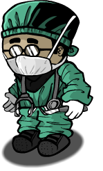

# Doctor

- **Facción:** Town  · *en alcance MVP*
- **Página de la wiki:** Doctor

## Ficha

**Clase (alineamiento):**

> Town Protective

**Tipo:**

> Protection
> Non-unique

**Prioridad de acción:**

> 3

**Resumen:**

> You are a surgeon skilled in trauma care who secretly heals people.

**Objetivo:**

> Hang every criminal and evildoer.

**Habilidades:**

> Heal one person each night, granting them Powerful defense.

**Atributos:**

> Attack: None
> Defense: None (Defense)
> (Powerful (Defense) when using Self Heal)

**Atributos (texto):**

> You may only Heal yourself once.
> You will know if your target is attacked.

**Si hay Godfather/otro objetivo:**

> Heal all attacks on target

**Gana con:**

> Town
> Survivor

**Debe matar para ganar:**

> Mafia
> Vampires
> Arsonist
> Serial Killer
> Werewolf
> Witches/Coven
> Plaguebearer
> Pestilence
> Juggernaut

**Usos:**

> 1 (self)

**Resultado Sheriff:**

> You cannot find evidence of wrongdoing. Your target is innocent or great at hiding secrets!

**Resultado Investigator:**

> Classic Results
> Your target could be a Doctor, Disguiser, or Serial Killer.
> Coven Expansion Results
> Your target could be a Doctor, Disguiser, Serial Killer, or Potion Master.

**Resultado Consigliere:**

> Your target is a professional surgeon. They must be a Doctor.

## Texto completo de la wiki

| 

 | Looking for the Town of Salem 2 role?

This role has mechanics that appear in Town of Salem 2. For the ToS 2 counterpart, see Cleric.

Doctor 

Alignment

 Town Protective

Avatar

Immunities

Attack: None

Defense: None

( Powerful when using Self Heal)

 Ability Stats

 | Type

 | Priority

 | Protection

Non-unique

 | 3

Actions

Target self

Heal all attacks on self

Target other

Heal all attacks on target

Investigation Results

 Sheriff

You cannot find evidence of wrongdoing. Your target is innocent or great at hiding secrets!

 Investigator

Classic Results

Your target could be a Doctor, Disguiser, or Serial Killer.

 Coven Expansion Results

Your target could be a Doctor, Disguiser, Serial Killer, or Potion Master.

 Consigliere

Your target is a professional surgeon. They must be a Doctor.

Game Information

Summary

You are a surgeon skilled in trauma care who secretly heals people.

Abilities

Heal one person each night, granting them Powerful defense.

Attributes

You may only Heal yourself once.

You will know if your target is attacked.

Goal

Hang every criminal and evildoer.

 Victory Conditions

 | Wins with

 | Must kill

 | Town

 Survivor

 | Mafia

 Vampires

 Arsonist

 Serial Killer

 Werewolf

 Witches/ Coven

 Plaguebearer

 Pestilence

 Juggernaut

 | 

 | DISCLAIMER: These stories are fanmade, and are not created or endorsed in any way by BlankMediaGames or Digital Bandidos.

With many years at university spent honing surgical precision and biomedical research, the Doctor is an innovative combat surgeon skilled in recovering the most traumatic of injuries – even in just a single night.

When the Doctor retired into a humble life as Salem's local physician, the Mayor became suspicious of his miraculous abilities to heal people in the most critical conditions. He cut funding to the town hospital and threatened to banish the Doctor, out of fear for association with witchcraft. For his corrupt accusations, the good Doctor then swore to never, ever heal the Mayor.

Years later, far past his prime, the Doctor still secretly checks up on the good people of the Town – even if it gets him exiled. The Mafia's assaults and the Serial Killer's stabbings, even a vampire's bite or a werewolf's rage are nothing to the Doctor's medical skills and refined operating techniques. Despite this, he has one foe he cannot combat: The Arsonist.

So much to the Doctor's regret, targets of the Arsonist are beyond his reach. He can do little for patients who have been charred beyond recognition. (credit)}

The icon that appears on the Doctor's Ability Coin

Mechanics[]

Healing your target[]

You will heal all attacks on your target caused by Town Protectives, a Town Killing role (except the Jailor), any Mafia Killing role, Serial Killers, Vampires, a Werewolf, Pestilence, Medusa, Potion Master, Coven Leader (with the Necronomicon), Necromancer's Ghoul, Hex Master ( Astral attack), Poisoner (without the Necronomicon), a Pirate, and a Juggernaut (before their third kill).

You can heal a Bodyguard who was supposed to die protecting someone. This makes it so only the attacker dies. This also applies if the attacker is healed and the Bodyguard is not.

If you heal someone who is visited by a Werewolf, you will die but your target will remain alive.

You will prevent both a conversion and an attack from a Vampire.

If you successfully heal a target who was attacked that night, you will receive a message stating: "Your target was attacked last night!"

Your target will receive a message stating: "You were attacked but someone nursed you back to health!"

If you Self Heal on the night you are attacked, you will receive the message above.

Healing someone gives them temporary Powerful Defense, so the attacker will receive an immunity message.

You can use your Self Heal to cure yourself of Poison as long as the Poisoner did not possess the Necronomicon at the time you were Poisoned. You will get the message, “You were cured of poison!”

You cannot:

Remove Poison from anyone if the Poisoner has the Necronomicon.

Save anyone that has been attacked by an Unstoppable Attack (a fully-powered up Juggernaut, an Arsonist's ignition, a Hex Master's final hex, a Jester's haunt, or a Jailor's execution).

Prevent someone from dying of a broken heart in Lovers Mode.

Prevent someone from dying by suicide methods ( Vigilante dying from guilt, a Jester haunt, or leaving the game).

Heal the Mayor once they reveal themselves, even if you are forced into targeting them.

Remove a Frame, douse, hex, or the plague from anyone (you can prevent people from dying to the basic attack delivered by the Hex Master with the Necronomicon, but the victim will still be hexed).

Messages[]

You will be notified if your target was attacked in any way, shape, or form.

You will receive only one message, no matter how many times your target was attacked.

Your target will receive a message about being healed (only if they were attacked). They will not receive additional messages if they were healed by multiple Doctors.

If your target is attacked by multiple sources simultaneously, such as a Serial Killer and a Mafioso, they will receive the same number of messages as the number of killers that attacked them.

When the Werewolf and Mafioso attack you, it is possible to receive two "Your target was attacked last night!" messages if you Self Heal. This is a known bug.

You will still receive the message that your target was attacked even if they were protected by a Bodyguard or have Basic Defense or Powerful Defense. Your target will not be notified that they were healed by a Doctor if the Bodyguard saved them unless they were attacked by another attacker ( Bodyguard only prevents one killer's attack).

You can heal a Tavern Keeper, Bootlegger, Jailor and/or the Pirate who role blocked an incautious Serial Killer or Werewolf (on Full Moon nights).

You will not see that your target was attacked if they were attacked by a Bodyguard. This may be a bug.

You will not see that your target was attacked if they are a Vampire who was attacked by a Vampire Hunter. This may be a bug as well.

If you cure someone from poison, you will not receive any message, while the player you cured receives one stating "You were cured of poison!". This may be a bug.

If someone is successfully healed, their attacker will receive the message "Your target's defense was too strong to kill.", which is the same as if they had attacked a role with Defense.

This was not the case before Version 3.2.4.

Strategy[]

Lay low, and avoid revealing your role unless completely necessary. You can use your ability to secretly protect someone from death while staying under the Mafia's radar. Don't say anything if you healed someone the previous night, or if they say something along the lines of, "Thanks Doc!" Even whispering to your target, while it might be tempting, can be dangerous, since the Mafia is usually smart enough to kill whoever whispered to someone who was healed; generally, you should only whisper to your target if you believe they are a Doctor or Bodyguard and are trying to pair up with them.

Keep your Self Heal for later in the game. There is little chance of the Mafia attacking you early in the game, especially if you haven't revealed your role. However, as the game goes on, it gradually becomes more necessary to reveal your role. If you have to reveal your role, it is recommended to use your Self Heal that night, as the Doctor is a nuisance to the Mafia, as well as the Serial Killer.

This should go without saying, but if somebody claims Poisoned while the Poisoner doesn't have the Necronomicon, you should always, always, heal them, unless you and the rest of the town are absolutely certain they are evil. Even if the person claiming hasn't proven themselves to be a Townie yet, the risk just isn't worth it. There is still a big chance they are in fact a Townie, especially early in the game, and if you don't heal them, your Doctor claim will fall under immediate suspicion, as you have no true way to prove yourself.

The most important basic strategy for a Doctor is to identify confirmed Townies so you can heal them, since a Doctor can also accidentally heal an evildoer, potentially saving them. As an added bonus, anyone who can be publicly identified as a Townie is more likely to be targeted by the Mafia. When you lack other ideas, people to heal include:

Anyone who has voted a member of the Mafia up to the stand, or who provided decisive evidence to hang a member of the Mafia (watch for bussing).

Anyone who has been confirmed via their abilities, such as a Vigilante shooting an evil.

Healing a Jailor allows them to jail any target without fear of the target being the Serial Killer or Werewolf (however, if the Werewolf attacks the Jailor, you will be attacked as well. This being said, the Jailor will live, which may be more important than your survival depending on the scenario).

Two Doctors healing each other are very difficult to kill. This combo can only be stopped by a Witch/ Coven Leader (redirecting one Doctor's heal elsewhere), a Bootlegger (stopping one Doctor from healing the other), or attacking one with an Unstoppable Attack.

This works in a similar way with Doctor/ Crusader, as the Crusader can protect you from roles that rampage while also potentially killing an evil role.

If your target was healed, and someone was killed by a Bodyguard the next morning, but no Bodyguard died, then you almost certainly healed the Bodyguard. Most of the time, you should immediately whisper to them, claim to be a Doctor, explain what happened, and ask them to cover you for the rest of the game while you heal them. This creates a nearly unstoppable team.

Healing a Bodyguard allows them to kill anyone who attacks their target without them dying until you are killed. This also allows you to indirectly provide indefinite protection to a Mayor, who you cannot heal directly, as long as you yourself are not attacked.

A Doctor/ Bodyguard pair that are constantly healing/protecting each other is almost impossible to destroy. This is similar to a Doctor/ Doctor pair or a Crusader/ Crusader pair. A killer will have a 50-50 chance of either failing to kill or being killed themselves. As long as the Doctor is healing the Bodyguard, the Bodyguard will recover from every successful defense.

If a Jailor jails either one of the pair, the person not jailed will likely be exposed to attacks. If they use their Self Heal/vest, they can still survive the night.

A Witch/ Coven Leader, Transporter, Tavern Keeper, Bootlegger, or Pirate can break this defense chain by redirecting or role blocking one of the pair.

If multiple killers attack the Doctor, the Bodyguard will kill one but the remaining killer will kill the Doctor.

A Werewolf, Pestilence and an Ambusher are able to break this defense chain by simply targeting the Bodyguard.

The Hex Master, Arsonists and Jesters are able to break this defense chain due to not being affected by Bodyguards.

 Transporters can usually confirm by posting a record of who they Transported, but healing them after they're confirmed doesn't make as much sense as other confirmed Townies since they'll usually be using their ability to protect themselves afterward (unless there's a confirmed Ambusher).

A common misconception of a good strategy is waiting before you heal anyone right away (on the first night). The argument goes that you could accidentally save an evil role or run into an unexpected Veteran. However, this looks very suspicious and you miss the opportunity to get a Lookout to confirm you (if they visited the same person), as well as the fact you are more likely to heal a Townie. Most Town Killing roles will also not be able to kill on the first night, making it even less likely that you're saving an evil role from death.

You will know if your target is attacked. This can indicate their innocence in a number of ways:

If there were no attacks from the Mafia that night, it means your target may have been attacked by the Mafia; aside from rare shenanigans of a Transporter or Witch, that would mean they're not a member of the Mafia, since the Mafia can't directly attack themselves.

If the attack looks like it was from the Werewolf or a Serial Killer, it can indicate that your target wasn't that role (but, of course, they could still be part of the Mafia). It can be hard to figure out if you've saved your target from becoming a Vampire, but that's also another potential cause for the message (and the messages are indistinguishable).

If you seem to have healed your target from a Werewolf's attack, yet survived yourself, this means that they weren't the Werewolf's primary target; in other words, it means they're a visiting role and visited the Werewolf's target. If the Werewolf's target died to the Mafia or a Serial Killer in this situation, and no member of the Mafia or Serial Killer came up dead, then it's extremely likely you've actually saved an evil role!

Of course, if you save the Werewolf's primary target, you will die, but the person you healed will survive. This can backfire if the Werewolf stayed at home, as this will give the Werewolf an alibi if multiple people visit them.

If there aren't any confirmed Townies (most commonly in the early game), it might be useful to heal the most talkative players. These players are typically targeted by the Mafia, as they usually are an important role that is trying to figure out who the Mafia are.

However, if they are an alerted Veteran, and you healed them because they were baiting, you will die. It can also be smart to stay on a Veteran to help them save their alerts, where they can be crucial end-game in a 1v1 or so.

If someone you were healing dies anyway (and the cause is something you could have healed, not suicide or an Arsonist), it means one of two things has happened:

First, your target may have been Transported. This means that your heal was redirected on to someone else, and the attack was redirected onto your target. Note that this means that your target wasn't the one who the attacker intended to kill. You can try to confirm this by asking if anyone was Transported; if anyone speaks up, they were probably the real target of the attack.

And second, if you selected/changed your target just as the night ended, it may not have reached the server in time. This is especially true for low end computers.

You could also have been controlled and redirected onto another target or role-blocked, but it would be fairly obvious as you would have gotten a message. There is a very rare bug that the control message does not show up, though.

If you're being controlled by a Witch every night, take note if your target is healed (and write what night it happened in your Last Will). After the first night, a Witch is probably making you target them, so you may be able to identify them if they're later called out by an attacker as having a defense higher than said killer's attack value.

You can also use this to call out anyone the Witch could be using you to heal, as they would logically heal their allies.

If you are aware of a Witch in-game, be careful when stating you are the Doctor, as doing so gives the Witch Powerful Defense every night. Under no circumstances should you reveal that you are the Doctor unless you ask a Transporter to transport you or a Lookout to watch you in order to bust the Witch.

A similar thing can apply to when there is a Coven Leader or Necromancer.

Achievements[]

 | Name

 | Description

 | Merit Points

 | Practitioner

 | Win your first game as a Doctor

 | 20

 | Healer

 | Win 5 games as a Doctor

 | 20

 | Medic

 | Win 10 games as a Doctor

 | 40

 | Surgeon

 | Win 25 games as a Doctor

 | 100

 | Stitch Yourself

 | Heal yourself after being attacked

 | 20

 | Need Medical Attention?

 | Heal someone who was attacked

 | 20

 | Where does it hurt?

 | Save 3 people in one game

 | 100

 Also achievable by saving the same person multiple times.

Messages[]

 | 

 | You have (#) self heal(s) left.

 | Amount of self heals left.

 | Your target was attacked last night!

 | Displays at the end of the Night when someone attempts to attack your target. 

 | You were attacked but someone nursed you back to health!

 | Displays at the end of the Night when you are attacked but you were healed by a Doctor. 

Trivia[]

Prior to Version 3.2.4, attacking a healed person would not generate an immunity message.

The healed person would still get a message saying they were healed.

The Doctor is the only role in the game to gain Powerful Defense when using their self protection, meaning they can survive a direct Werewolf attack whereas a Serial Killer would die in the same situation.

The Doctor is currently the only Town Protective to harbor no attack whatsoever.

The Doctor is the only role known to have a chance to appear in every gamemode, Classic or Coven.

History[]

3.2.4

Temporary defense given by certain roles through game mechanics now give attackers the message "Your target's defense was too strong to kill.".

2.5.5.12200

The Doctor's role icon has been changed. Old one was .

Added Doctor's circled role icon ().

2.3.2.9706

Revealed Mayors can no longer be healed by a Doctor if Transported.

Fixed an issue where if you were poisoned, healed, then poisoned again the next night, you wouldn't receive a message letting you know you were poisoned.

Fixed an issue where if you were attacked by Medusa, healed, but killed by a role with a higher attack, you would still show up as stoned.

Town of Salem Release

Introduced.

 | 

 | 
Roles

 | 

 | 

 | 
 Town

 | 

 | Town Investigative | | Investigator • Lookout • Psychic • Sheriff • Spy • Tracker | | 

 | 

 | Town Killing | | Jailor • Vampire Hunter • Veteran • Vigilante

 | 

 | Town Protective | | Bodyguard • Crusader • Doctor • Trapper

 | 

 | Town Support | | Mayor • Medium • Retributionist • Tavern Keeper • Transporter

 | 
 Mafia

 | 

 | Mafia Deception | | Disguiser • Forger • Framer • Hypnotist • Janitor | | 

 | 

 | Mafia Killing | | Ambusher • Godfather • Mafioso

 | 

 | Mafia Support | | Blackmailer • Bootlegger • Consigliere

 | 
 Coven

 | 

 | Coven Evil | | Coven Leader • Hex Master • Medusa • Necromancer • Poisoner • Potion Master | | 

 | 
 Neutral

 | 

 | Neutral Benign | | Amnesiac • Guardian Angel • Survivor | | 

 | 

 | Neutral Evil | | Executioner • Jester • Witch

 | 

 | Neutral Killing | | Arsonist • Juggernaut • Serial Killer • Werewolf

 | 

 | Neutral Chaos | | Pirate • Plaguebearer/ Pestilence • Vampire

## Implementación

- [ ] Definido en `packages/engine` con su prioridad y facción
- [ ] Acción nocturna (si aplica) validada con objetivos legales
- [ ] Resultado de investigación correcto (Sheriff / Investigator / Consigliere)
- [ ] Condición de victoria y de derrota comprobada en tests
- [ ] Tests unitarios del rol en verde
- [ ] Tarjeta y texto de ayuda en la app
- [ ] Icono e ilustración propia (no el arte de la wiki)
- [ ] Plantillas de narración para sus eventos
