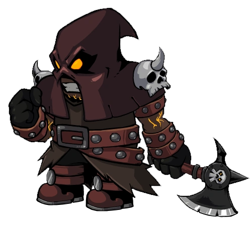

# Executioner

- **Facción:** Neutral  · *fase posterior (referencia)*
- **Página de la wiki:** Executioner (ToS)

## Ficha

**Clase (alineamiento):**

> Neutral Evil

**Tipo:**

> Non-Unique

**Resumen:**

> You are an obsessed Hanger who will stop at nothing to execute your target.

**Objetivo:**

> Get your target Hanged at any cost.

**Habilidades:**

> Trick the Town into Hanging your target.

**Atributos:**

> Detection Immunity
> Attack: None
> Defense: Basic

**Atributos (texto):**

> Your target is XXXXXXX.
> If your target is killed at night you will become a Jester.

**Especial:**

> Turns into a Jester if target dies at night

**Gana con:**

> Town
> Survivors
> Witches
> Coven
> Mafia
> Serial Killers
> Arsonists
> Werewolves
> Vampires
> Plaguebearer
> Pestilence
> Juggernaut

**Debe matar para ganar:**

> Given Target (via Hang)

**Resultado Investigator:**

> Classic Results
> Your target could be a Sheriff, Executioner, or Werewolf.
> Coven Expansion Results
> Your target could be a Sheriff, Executioner, Werewolf, or Poisoner.

**Resultado Consigliere:**

> Your target wants someone to be Hanged at any cost. They must be an Executioner.

## Texto completo de la wiki

| 

 | Looking for the Town of Salem 2 or Traitors in Salem role?

This role appears in Town of Salem 2 and Traitors in Salem. For the ToS 2 counterpart, see Executioner and for the TiS counterpart, see Executioner.

Executioner 

(Exe)

Alignment

 Neutral Evil

Avatar

Immunities

Detection Immunity

Attack: None

Defense: Basic

Special

Turns into a Jester if target dies at night

 Ability Stats

 | Type

 | Non-Unique

Investigation Results

 Sheriff

You cannot find evidence of wrongdoing. Your target is innocent or great at hiding secrets!

 Investigator

Classic Results

Your target could be a Sheriff, Executioner, or Werewolf.

 Coven Expansion Results

Your target could be a Sheriff, Executioner, Werewolf, or Poisoner.

 Consigliere

Your target wants someone to be Hanged at any cost. They must be an Executioner.

Game Information

Summary

You are an obsessed Hanger who will stop at nothing to execute your target.

Abilities

Trick the Town into Hanging your target.

Attributes

Your target is XXXXXXX.

If your target is killed at night you will become a Jester.

Goal

Get your target Hanged at any cost.

 Victory Conditions

 | Wins with

 | Must kill

 | Town

 Survivors

 Witches

 Coven

 Mafia

 Serial Killers

 Arsonists

 Werewolves

 Vampires

 Plaguebearer

 Pestilence

 Juggernaut

 | Given Target (via Hang)

 | 

 | DISCLAIMER: These stories are fanmade, and are not created or endorsed in any way by BlankMediaGames or Digital Bandidos.

The investigator walks into an old ramshackle house, he had received a lead on this person which he didn’t want to ignore. He was glad he didn’t. There were pictures everywhere, and all of them were of the same person, with red painted X’s going through their face. This person clearly had a problem, perhaps it was an enemy, or maybe just a poor soul targeted by this insane lunatic. All of the accusations made sense now. Every time the suspicion was placed on the poor nurse this… executioner made sure the whole town was convinced they were guilty. No wonder the executioner was so upset when the town realized they had been tricked, and voted the target innocent. The investigator sat down and tried to make sense of what could drive someone to target just an innocent nurse. He racked his brain, perhaps it was a long time ago when the nurse accused him… but obviously this obsession was going way further than that.

No one knows why the executioner targets you, but their silver tongues will try their hardest to get you hanged, whatever the cost may be.

Mechanics[]

You will receive a target at the start of the game. Kill your target via Hanging to win.

Your target will always start the game as a Townie.

Your target cannot be the Mayor or Jailor.

You must Hang your target while being alive.

If you die after Hanging your target, you will still win (with the exception of leaving the game).

If your target is converted into a Vampire, you will still remain as an Executioner with the same target.

If you leave the game after you get your target Hanged, you will not win.

Multiple Executioners and/or Guardian Angels may share the same target. 
The icon that displays next to your target in the player list

You have Basic Defense.

If your target dies during the night, you will turn into a Jester.

Strategy[]

Pay close attention to the Last Wills and claims of others in order to determine just what the holes in the Town's knowledge of your target are. If a Sheriff says your target is not suspicious, you can still claim to be an Investigator. Accuse them and say that you investigated your said target and the investigative results that showed up for you were Bodyguard, Godfather, or Arsonist. If an Investigator lists them as having a result that includes a possible evil role, accuse them of that role (e.g. if they claim to be a Doctor, claim to be a Lookout and accuse them of visiting someone who was killed by the Serial Killer, since Doctors and Serial Killers are part of the same investigative result). Occasionally, there will be an error or coincidence in a Last Will that you can use to push an accusation against your target, such as them being visited by the Mafia in a Spy Last Will on a night when the Mafia didn't kill anyone. Note that while being the last person visited by a dead Investigator is not an indication of anything, many inexperienced Townies can still be swayed by it in Classic.

Another strategy is to wait until about day 3. Then claim Investigator and accuse your target. Try to get them on the stand but also try to get them to vote innocent. If you are able to convince them to vote innocent, stall long enough for the day to end, then ask the Jailor to jail and execute your target. If he does, you will turn into a Jester that night and the role of the innocent Town member will appear, giving yourself enough suspicion to be Hanged. The downside is that the Jailor might not jail your target, giving them enough time to prove themselves and Hang you, denying your victory, or if experienced players see that you were a clever Executioner turned Jester and simply call you out.

If people figure out you are the Executioner and put you on trial, say something along the lines of, "Okay, you got me. I'm the Executioner." Hopefully, they will think that you're a Jester and are trying to get yourself Hanged. Most people will then vote innocent. Thus, you will be off the hook and survive. However, this will probably backfire in some cases as many Serial Killers, Arsonists, Godfathers, and other roles with Basic Defense may claim it.

If you are pressured to claim a role, you may just tell the truth, side with the majority and before the majority wins, ask for your target to be Hanged. You may also say you can be an extra vote so they can focus on Hanging the true evil roles while your target gets Hanged near the end of the game. Note that this may not work if you are jailed, depending on the Jailor.

If a Townie finds a member of the Mafia, you may want to quickly side with them and try to counter whatever the accuser might be saying, then whisper to the member of the Mafia about how you saved them, and you want to side with them, and to do so, they must help with Hanging your target.

Wait until later in the game, especially if not many evils are dead. The Town will get desperate and should have a better chance of believing your claim. However, this could backfire as they might know who the other Townies are due to the process of elimination and might Hang you instead even if there are bigger targets.

As it says in the description, use everything you can to get them Hanged, starting with the accusation. After you accuse your target, make them claim their role and use other possible roles they could be and use that to your advantage. Do this by taking what they claim and accuse them of being a similar, evil role. For example, if they claimed Investigator and they posted their Last Will, try to make them look like a Consigliere or Witch. This is extremely effective if they defended an evil role.

You can claim to be a Tavern Keeper that role blocked your target and was attacked and healed, then claim they are the Serial Killer. This strategy is uncommon and even some more experienced players might believe it. It works especially well if your target is a Doctor.

If you're playing a game mode such as Classic Mode where roles are heavily limited, you can claim the same role as your target to throw suspicion on them. The downside, of course, is that you could be Hanged instead. However, the risk might be lower than you think, since if the Mafia or Serial Killer have discovered that you're an Executioner (e.g. By trying to kill you and discovering that you have Basic Defense) they will almost certainly side with you, meaning that you only need to split the Town a bit in order to win. This naturally won't work if they claim a role that can be easily confirmed. It works best if your target happens to be a Sheriff, since any Investigators who examined you will have seen a Sheriff as one of your possible results. Another advantage to doing this is that if your target dies, you will simultaneously be thrown into suspicion and will become a Jester.

Sometimes, remaining silent and voting your target on day 2 can get everybody else to vote for them. This is unlikely to work in ranked, as it is a random vote and may bring suspicion upon you.

If you become a Jester, start following the strategies on the Jester page. However, note that there are some Jester strategies unique to playing an Executioner which start before you actually change roles. In particular, you have the advantage of having Basic Defense (which is generally limited to evil roles, and therefore extremely suspicious should the Town learn about it. Keep in mind, however, that once you turn into a Jester, you will lose your Basic Defense).

If it becomes impossible to get your target Hanged, especially if it's because they confirmed themselves as a Townie in Ranked, it can be advantageous to start planning your Jester strategy even before they die. Your target is, after all, likely to die quickly after being revealed, especially if they are an important Town role.

If it seems like your target is going to get killed at night, then try to lure people into attacking you so they'll see your Basic Defense. If you're lucky, by the time your Basic Defense is revealed, your target will be dead and you'll be a Jester. This carries some risks (you might be Hanged before your target is killed, you could be executed by the Jailor, or attacked by roles with at least a Powerful Attack), but since the Town almost always accepts defense as a reason to Hang someone, it can be extremely effective when it works.

If you do end up accused as a result of your Basic Defense after you've already turned into a Jester, claim to be a Survivor (which is a common claim for evil roles to explain their Defense, although be wary that Survivor cannot appear in classic) or say that you're a Doctor and healed yourself or a Bodyguard who used their self vest (which may make you look like a Serial Killer or Arsonist but you should try to claim this late and unconvincingly, as its possible the town might believe your claim).

Avoid voting up possible members of the Mafia in general. This is unlikely to get you Hanged instantly, but it will keep you under suspicion, which can be valuable if you later turn into a Jester.

If you think it's easier to win as a Jester, or if your target gets confirmed, a good strategy is just to remain silent until your target dies. You have Basic Defense, so it shouldn't be difficult to survive unless you're called out as immune.

If your target has been quiet the whole game, suggest a random Hang and vote him. Others might side with you, since quiet roles tend to be evil, like an Arsonist or Werewolf.

Remember that important Town roles usually remain silent, too. If your target claims an easily confirmable role, such as Veteran on the stand, the Town will likely pardon them and put you up instead.

If it doesn't seem like the Town is going to random Hang, bring up that they were silent. If it's later in the game, people will find this a reason to Hang someone.

If you're lucky enough, sometimes your target will say something suspicious or act suspiciously. Even if it is only a single sentence, dwell on it, and do your best to make their actions look as suspicious or evil as possible.

Sometimes claiming something so bizarre or out of the ordinary is the deciding factor to get your target Hanged. Be creative, but make sure it is possible at the same time. If a Medium is dead, say that the Medium used their seance on you and told you that your target was evil.

The dead appear as more credible sources. Accuse your target of being guilty, on accounts that the dead told you so.

If your target is a Lookout and they accuse someone of killing someone, ask them if anyone else visited them. If they say no, then say they are an Executioner and you also visited the target. Players may believe you and Hang your target.

If someone died the previous night by an Ambusher, you can claim to be a Medium and tell the town that your target is the Ambusher.

Another Medium can ruin your play, though, so make sure you are the only Medium claim before performing this tactic.

If your target is a Transporter who killed a Mafia member, you claim to be a Medium or a Spy who saw a double visit and accuse them of being a Forger.

Sometimes you don't even have to accuse your target, especially in modes with confirmed role lists, like Ranked or Classic Mode. Simply getting your target up on the stand, either through luck, pushing for the Town to vote for roles, claiming they are too quiet or not quiet enough, then counterclaiming their role claim, can get them Hanged.

Claims made early (such as on day 2) are very suspicious to the other players, as this is obvious Executioner behavior. The longer you can go without your target dying or being confirmed Town, the more "helpful" your claim will be.

It's usually a bad idea to accuse someone on the same day the Town already has a lead. If an Investigator comes forward with information, or if the Town is determined to Hang someone for other reasons, they may simply ignore you.

However, there is one advantage to accusing at the same time as someone else: If the genuine Investigator accused a Mafia or Coven member, that person, and their allies, will usually leap at the chance to push the Town's attention on to someone else. Therefore, especially when you think the Mafia or Coven is near a majority, it can be worthwhile to contradict a genuine accusation against them with a false one of your own in hopes of allying with them. This tends to be less effective when the Investigator accused a Serial Killer or other Neutral Killing role, since they're not going to have any allies to help.

A good tactic is to wait (normally about halfway through discussion time) and see if the Town has any leads that day. If they don't, all the attention will be focused on you, giving you more time to prove why your target is guilty. Remember that even if the Town is silent, you shouldn't reveal on day 2 unless you're aiming to get the achievement.

If you start accusing your target too early, many players will quickly assume you are an Executioner. Once this happens, it will become far more difficult to Hang your target. However, the longer you wait, the higher the chance of your target being proven innocent or being killed in the night.

Waiting just until the end of discussion leaves people less time to question your story. However, waiting too late won't give them enough time to vote.

This isn't foolproof, but you can accuse the person of something completely random that doesn't exist or something that does exist but isn't a common term. For example "______ is buddying!"

Whisper to your target to ask his/her role, then tell the Town that he/she is lying by inventing proof.

If your target is not Hanged the day you claim that they are evil, an Investigator will likely investigate you or your target and see that you are lying. It is crucial to get them Hanged the day that you claim they are an evil role, or you have a very low chance of winning as an Executioner, unless the Mafia has majority vote and decides not to risk killing your target at night for the fear of being a Veteran or a Transporter. In that case, your only hope is usually only if your target gets killed at night and you win as a Jester.

If you didn't manage to get your target Hanged that same day, a Vigilante or Jailor who believed you might kill the Townie, causing you to be an obvious Executioner that turned into a Jester.

In the worst case scenario, your target could be a Townie who is proven early in the game. If this is the case, the best you can do is hope that your target dies so that you can become a Jester, or wait until evil roles have majority and you can convince them to give you a free win.

 Achievements are a surprisingly compelling argument. If you claim to do something having to do with an Achievement, especially if you can remember the name of the Achievement, it can convince Townies that you are not lying.

Using Achievements also appeals to the previously mentioned sympathy psychology. For example, claiming to be a Tavern Keeper or Investigator on day 1 and asking to be witched to yourself "for the Achievement", then claiming that you were actually Lookout, was witched to yourself, and that your target visited you is a good claim. Beware that if your target has info or day abilities a Witch would not have ( Lookout with valid information, Transporter), then this can backfire on you.

Another example would be to say "I transported myself with (Player) and got the "Stop Hitting Yourself" achievement!". This would immediately accuse the Player of being a killer with defense.

In Ranked, You can claim Tavern Keeper and say, "I have role blocked (your target) and there isn't any Mafia kills!" or, "I am a Transporter, I have transported myself with (your target), and got the "Stop Hittin' Yourself!" Achievement for making (your target) attack themselves!"

Another idea is to wait until your target has claimed a role, then counterclaim by saying you are that role. For example, if your target is a Bodyguard, and they claim it, you should counter-claim with a will, hoping to get them Hanged.

Your overall way of winning is having a propelling argument, so you need a good enough number of people to believe you. An Executioner's best hope for winning is the Town.

Be detailed in your accusations. One of the telltale signs of a bad Executioner is when they make an accusation without the details that a normal Townie making the same accusation would give - a Sheriff or Investigator claim who says the target is "bad" but fails to reveal exactly what result they got, for instance, just saying "(Player) is suspicious!". Always keep a fake will to back up your claims.

In Rainbow Mode, your target will always be the Veteran, as you occupy the Any slot and the Jailor cannot be your target. Usually, you can just come out as an Executioner and tell other players who the Veteran is, and they will be happy to Hang them.

In the unlikely event a Tavern Keeper is killed by role blocking a Serial Killer, you can ask the Tavern Keeper to taunt the person they blocked, and then taunt your target.

Of course, if your target has already been taunted, the ability to taunt won't be available until the next day, and by then the Town might have already forgotten.

This strategy generally useless in higher levels of play, as smart Townies will point out that that a dead player's taunt cannot be seen by living players.

On the other hand, if a Bootlegger was the one to visit the Serial Killer, you can ask the Mafia to taunt the Serial Killer instead and then semi-swiftly taunt your target before the Mafia outs the real Serial Killer (but not so fast that it must be fake). Since at least a Mafioso should still be alive (provided they didn't die the same Night), this will hold more weight in the argument. Even if they beat you to the punch, it still might prove beneficial to let them have the taunt, as the Serial Killer will likely be eliminated and you will remain safe to try another strategy.

If your target claims to be a Sheriff, and found you suspicious (meaning you were Framed or Hexed), you could argue that your role is something evil that would not normally be found suspicious like Godfather or Plaguebearer; then proceed to accuse your target of being a Werewolf or some other role faking Sheriff. As long as the role you claim is not more dangerous than the one you accuse your target of being, players may decide to let you live long enough to have your target executed before you die.

Siding with the Mafia[]

In expansion to finding two potential suspects. You may confirm the identity of a member of the Mafia by asking them in a whisper (However, exposing you to the risk that you are incorrect) and tell them that you will contribute to their votes. During the day, you may figure out that particular member in addition to your target, stating that they claimed a specific role on a specific day (stating a particular day will be more credible) and state it late during the Discussion phase, leaving little time for others to question your story. If you are lucky, that member of the Mafia will have falsely claimed the role you specified, making it seem like you have found two of the Mafia rather than only one. It will be more difficult for the Town to Hang the true member of the Mafia and it will be easier for you to Hang your target with additional votes.

If you have found an inconsistency with two people stating the same role, and you are sure that one of them is a member of the Mafia. you may whisper one of them stating that you are the Serial Killer, Witch or Arsonist and to tell them that you will give them an extra vote. If you have picked the incorrect player, you may whisper the other player and tell them to kill your target, saying that they are a member of the Town, and that you will actually give them more votes. With luck, the player that you incorrectly whispered will call you out the next day, but by then you will have reverted to a Jester.

If the Town finds a member of the Mafia, you may want to quickly side with them and try to counter whatever the accuser might be saying, then whisper to the member about how you saved them, and you want to side with them, and to do so, they must help with Hanging your target.

Although risky, if you spot a player who seems to be blackmailed, you could try whispering to them and send a message to the Blackmailer that you’re the Executioner and want to join them, this is very risky though and if the Blackmailer dies, the person you’re whispering to puts it in their will, or a lookout is still alive, you will almost certainly be outed.

Alternatively you could try faking Executioner and doing this, as being “revealed” would divert a lot of attention from you, this is also risky however and generally not recommended.

Remember, if the game ever reaches a point where your vote and the Mafia's vote combined outnumbers the Town's, you can immediately declare your role and ask the Mafia to vote for your target. Unless there's a hidden Mayor, the Town won't be able to do anything about it, and both you and the Mafia will win.

This also applies for Vampires and the Coven, however the Vampires may not be as eager to help if one of their teammates is your target.

If your target is a confirmed Veteran, siding with the Mafia is your most likely way to win. The Town is unlikely to Hang a confirmed Veteran, but the Mafia is probably going to want to Hang them rather than risk hitting an alert, so all you have to is survive until the Mafia reaches a majority.

Revealing your role[]

If you believe evil roles have the majority of votes (or will have one, counting your vote), you can simply declare your role as an Executioner and ask them to Hang your target. They will normally listen to you and give you the win, unless they see you as a possible threat.

Remember, you are still a Neutral, even if it is Neutral Evil. If you risk trying to side with the Town, and try to help them, and then later in the game ask to Hang your target, there is a chance the Town will listen to you. However, this depends on the Town and how they react; whether they kindly listen and since they have the clear win Hang one of their own willingly, or refuse and Hang you instead. However, you may also be left in the dust helping the Town but your target not being Hanged. Do not count on this working- they may not believe you and Hang you instead.

Note: This isn't a good strategy to use in Ranked games, since experienced players may Hang an Executioner regardless.

Claiming a role[]

Voting for your target "randomly" sometimes works. However, your accusation is more effective with a suitable cover story. Therefore, coming up with the best role to claim in a specific scenario, and making the ideal type of accusation increases your chances that the Town Hanges your target.

 Town Investigative[]

Simply claiming on the second day that "I'm the Lookout/ Sheriff/ Investigator and [target] visited someone who died/is suspicious/not suspicious, could be Godfather" can work surprisingly well, especially in All Any modes.

Pay attention to the details of what exactly your role learns. If you're claiming to be an Investigator, you should list a set of possible roles; if you claim to be a Sheriff, you need to accuse your target of being suspicious, and so on. Details that match what an actual member of your claimed role would see will make people more likely to believe you, while vague accusations that someone is evil or accusations that are more specific than your claimed role can determine are more likely to get you spotted as an Executioner.

 Lookout[]

If someone is being controlled by a Witch, role blocked or blackmailed for several turns and publicly complains about it, claim that you "looked" at them and "saw" your target visiting them, therefore accusing your target of being a Witch, Bootlegger or Blackmailer. The damaged person will jump on any lead to end their suffering, so you will have at least one supporter.

When attempting to get your target Hanged, it is more credible to figure out two potential suspects, especially if one is a confirmed role. For example, you may pose as a Lookout and claim that two particular people (one being your target) visited someone who had died on a particular night and also state that the player who is not your target is some confirmed role other then Jailor (especially if their role was not explicitly stated and they did, in fact, visit the dead player), making it easier for you to Hang your target. It is also a good idea to write a false Last Will, in case you are questioned about your role, giving players less time to think about whether to Hang your target.

The danger in claiming a Lookout, of course, is that anyone who actually visited the person you say you watched that night will immediately know you're lying. Likewise, if you name more than one possibility, any Townie you name who didn't visit them that night will know you're lying. On the other hand, claiming Lookout and naming someone as a visitor is one of the few ways to accuse someone with total certainty on day 2, since a Sheriff's target may have been framed and Investigators usually show more than one possibility.

You could bluff and threaten to "reveal" the numbers of the players who visited a victim unless they state the reason for their visit. Chances are very likely a Mafia member will give a false reason, but at least one person should speak to make the statement more convincing. Then, if your target has not spoken up, accuse your target of having visited and not claiming a role. If your target did visit the victim, just push them in a one-for-one situation.

If your target was cleaned as well, claim that 2 people visited, one being your target, and one being a random person. Do not be eager to Hang your target, since it will make you an obvious Executioner, but let someone else do the voting first. You can also say, "It doesn't matter who we Hang first." to make people vote for your target or the other person. This is a 50% chance that your target will be Hanged, if any Hangings happen for your accused. If the other person turns to be a Mafia Killing or Janitor, however, your target will be hanged for sure! (But in this scenario, it is nearly certain your target will be a target of Town Killing)

On the first day, if you plan on claiming Lookout, claim Investigator or Tavern Keeper and ask to be witched into yourself for the achievement. On the second day, "reveal" that you are actually a Lookout and you saw your target visit you. People will assume they are the Witch.

Remembering the achievement names makes your case more compelling. If you claim Tavern Keeper, ask for 'I Look Good!', and if you claim Investigator, ask for 'Who am I?'.

 Investigator[]

Claiming that your target is a Framer, Vampire or Jester is a bit dicey (since they can claim to have been framed). On the other hand, it's less likely to get you hanged in retribution, since you have a legitimate excuse for an error even in the eyes of your victim. It also means that if your target happens to have been framed before, your results will match those of any previous Investigators who looked at them that night; and if the Mafia is smart, they'll continue to frame them going forward. Also claiming " Jester support" is an easy way to fool the Town into thinking that they're helping a Jester.

If your target has claimed a role, claiming any investigative result that doesn't match that one can get them hanged, though you risk being contradicted by actual Investigators.

 Investigator is a difficult role to write fake Last Wills for, since you have to identify one person per day and could be found out if you get anyone wrong. On the other hand, this also means that a fake Investigator will tends to be more convincing.

Claim to be an Investigator and pretend to "investigate" people by asking them for their roles the next day, claiming Investigator. If they seem like a member of the Mafia or a Neutral Killing role, side with them, telling them that you are the Executioner. Tell them who your target is, and make sure that they won't kill your target. If they're Town, write what the investigative result for their role would be in your will (do the same for members of the Mafia and Neutral Killing roles too). A little later in the game, ask your target for their role. When they tell you their role, announce to the Town, "Hang [your target]." When they ask you why, say, "I'm Investigator and they came up as [investigative result-anything except Framer/ Vampire/ Jester because they could claim to have been framed] but they claimed [something different that's not in the result]." Post your Last Will as "proof" if they ask you for it. However, be wary that if you do this too early, people may suspect you of being an Executioner. Also, you won't have enough results to use as "proof" that you are an Investigator.

Claiming that your target came up as a Doctor, Disguiser, or Serial Killer and there's a high possibility that they are a Disguiser may persuade most players to Hang them, especially if there's no Neutral Killing (which means Town has to kill all Mafia by themselves to win). This method will not work in modes which don't have a spot for a Disguiser role (such as Classic) and has a low chance of working in modes where Disguiser rarely appears (Rainbow Mode, most Custom Mode/Coven Custom setups). The best place for it is All Any and Coven All Any.

Claiming that you investigated your target one night, and that you investigated them the next night and a different result came up may work. The Town may think that your target is a Disguiser. However, this may not work, as most Disguisers will keep disguising as one target until they die. Also, an actual Investigator may prove you wrong.

 Investigator accusations should be tailored towards the evils that the town is currently searching for. For instance, if they're trying to find the Werewolf or Poisoner, accusing someone of being Sheriff / Executioner / Werewolf / Poisoner is more effective and it's particularly effective if both are present; if there's an active Janitor or Necromancer, you could accuse someone of being a Medium / Janitor / Retributionist / Necromancer / Trapper. Often, Investigator accusations are more effective if you wait until it's clear who the evils are and then accuse someone of something that matches them, especially if it's at the point in the game where the Town is starting to get desperate.

A useful move as fake Investigator would be to claim your target came up as Tavern Keeper/ Bootlegger/ Transporter/ Hypnotist, and they claimed something else. Mafia should immediately know you're lying (as the only non- Town roles available are Mafia roles), and the Town might believe your argument as Hypnotist can also fake Tavern Keeper, Transporter, Doctor, Bodyguard, or Witch (along with Crusader, Trapper, Poisoner, and Guardian Angel in Coven Expansion). There is one significant risk though: if your target ends up completely cleared of suspicion (either a Sheriff or a real Investigator can out the truth), people will know you're lying. To evade this possibility, wait until later in the game so you have enough time to build your Last Will and hope evils have majority or the Town is desperate.

 Sheriff[]

Claiming to be a Sheriff can work if there are still Town Investigative roles in play who have not yet in some way been revealed to the Town. The Sheriff can accurately pinpoint any non- Godfather Mafia as well as the Serial Killer. Claim your target is either and that you have investigated them. This is especially easy in All Any, where the Mafia may be numerous and the Town is not aware of what roles are in play and is thus more likely to follow your presumed authority. If you fail to get them hanged on the day of your 'reveal', your Defense will protect you from any killing roles now targeting you. During the next day, you may try to fake another interrogation by claiming another Town member came up as innocent, then stress to hang your target.

Avoid accusing someone on day 2 as many people will see you as an Executioner and ignore you. Instead, bring up your lead on day 3 in order to make your claim more believable.

One benefit to claiming Sheriff is that if an Investigator investigates you after you accuse your target, you will come up as a Sheriff, Executioner, or Werewolf, which will help sell your story and gain an additional vote. This may not work if a Framer decides to frame you or if the Investigator realizes that you still may be Executioner or even a Werewolf.

The Sheriff is easy to write a fake Last Will for. You can declare anyone you like to be non-suspicious and you're unlikely to be immediately contradicted (since any Townies who knew they were Mafia probably would have come forward already.) Posting detailed fake Last Wills may help convince skeptical Investigators. It does carry some risk of being caught in a lie by a Lookout, but few Lookouts are alert and clever enough to immediately notice the contradiction.

When claiming Sheriff, remember to stay calm and not use caps when accusing someone. This way, the Town is more likely to believe you as Sheriff instead of an eager Executioner looking to Hang their target.

The biggest disadvantage to claiming Sheriff is that it's, by far, the most common strategy Executioners use; this tends to mean it gets more scrutiny than other accusations.

 Spy[]

Claiming Spy is generally not a bad idea, especially in the Coven Expansion. This is because when you accuse your target and post fake visits, the Mafia and Coven will most likely see you as an Executioner and may help you get your target Hanged, so you'll only have to convince a couple Town that your target is evil. It's even better if both are present in modes such as Coven Custom or Coven All Any, as if both factions push your target, you may not have to convince any Town at all.

Note that they may also see you as a Neutral Killing or Plaguebearer attempting to pose as an Executioner and may simply out you in a Death Note, or, in the case of the Coven, kill you outright.

As the Spy, you know who Mafia and Coven visits. If they were no Mafia deaths, you can claim Spy and say that Mafia/ Coven visited your target and didn't die, accusing your target of having Defense (i.e. Serial Killer) This is a good strategy since Spy always gets results. You can be counterclaimed by an actual Spy saying that Mafia/ Coven didn't visit your target or a Town Protective saying that they protected your target and they weren't attacked. You also may be asked to provide a will of who the Mafia/ Coven visited and who you bugged and what happened to them.

Another potential option, particularly if no one can contradict it, is to claim that your target is frequently being visited by the Mafia. This can give the appearance that there might be a Disguiser and that your target is constantly being visited by them. This has two added benefits, as not only do you appear more legitimate and helpful for finding specific roles for the Town, but the chance of you being argued as the Executioner can still be explained as a Framer could also be visiting your target.

You can also claim that you saw your target clean the gas off of themselves or gotten doused. Since Arsonist is the only role that cleans the gas off of themselves or gets a notification of being doused, you're accusing your target of being an Arsonist. A Tracker/ Lookout can counterclaim you saying that you didn't visit your target, or a Investigator saying that your target isn't anything but Bodyguard/ Godfather/ Arsonist/ Crusader. You can also be counterclaimed by a Spy who bugged your target, but that is rare.

It is also possible to claim your target was attacked but was immune, which accuses your target of being a Godfather, Serial Killer, Werewolf, Arsonist, Coven Leader with the Necronomicon, Plaguebearer, Juggernaut, Pestilence, or another Executioner. Evils might recognize you as an Executioner and might even write in their Death Notes that your target was immune, helping your target get Hanged, although most evils will believe you to be a Spy and might attack you instead, exposing your Basic Defense.

As a Spy, you know what notifications your target gets. For example, if you bugged a Doctor who healed an attacked target, you will know. Using this knowledge, you can use this to counter-claim your target. For example, if your target is a Bodyguard who used their vest to protect against an attack, you can claim to bug him and say that he is immune, and didn't use a vest to survive. This can be counter-claimed by a Tracker/ Lookout saying that you didn't visit your target, or a Spy who bugged your target saying that you're lying.

You can claim that you bugged your target and they were controlled by a Witch and did not say anything up to that point (since they obviously can't claim witched) and trick the Town into hanging them (although do note that you'll have to include a full Spy will. If you see another Spy will, copy it, or if you're the only claim, fake it enough to convince the Town. Additionally, the Mafia will obviously know you're lying, and could potentially help you hang your target).

 Psychic[]

Claiming Psychic can be much more effective than it seems at first. As a phony Psychic, you can only reveal that your target is one of three possible evils, and only after odd nights, but there are a number of ways to turn this to your advantage.

Naming a Town member who died that night as one of the three potential evils immediately narrows it down to two (and isn't particularly uncommon, so few people will grow suspicious).

If you're desperate, and two Town members died on an odd-numbered night, you can even name both of them alongside your target, but this is implausible enough that most Townies will grow suspicious.

You can use your even-numbered nights to do the reverse and imply other people you named are good, especially by using the same trick mentioned above - name two people, one an evil who died that night, and the other one of the three people who you named previously.

Claiming to be a Psychic gives you the ability to avoid directly stating the conclusion that your target is evil. Even when you've falsified results that leave no other option, it's often best to let other people realize that themselves if possible. Pretending you didn't realize that your visions collectively imply your target is evil both makes you look less like an Executioner and will let any other Town members who spot it feel clever, which can lead to them being more committed to getting your target Hanged than if you just dropped the solution on them.

People have a tendency to grow suspicious of anyone who appears in two "evil" Psychic results, even if there's still other options in each night. This can get your target Hanged even if you don't actively try to narrow the possibilities down to one person.

Claiming Psychic has a number of other advantages:

A Psychic, like an Executioner, is non-visiting; therefore, you can't be caught by Lookouts, Trappers, Trackers, and Jailors who notice you didn't visit your target when you claimed to, or by Transporters who might 'helpfully' reveal your target was transported.

It's more common for genuine Psychics to reveal their results on day 2 (and every day thereafter). Therefore, people are less likely to get suspicious when you do so when compared to Sheriffs, Investigators and the like.

A Psychic always receives results. People tend to be suspicious of a Sheriff or Lookout who claims to have gotten lucky on the first night, but there's no reason to be suspicious of a Psychic - and while your phony results will form an unlikely coincidence that rapidly implies someone is evil, this is harder for people to recognize.

Frequently, random events can end up helping you - if one of the other people you named dies or gets confirmed, your target will look extremely suspicious.

When you only have two people who could be evil (having named a third person who died the night before), those two are often going to be compelled to try and vote against each other, making it more likely that your target will be Hanged. Additionally, while your target can't be a Mayor or Jailor, the other person potentially could be.

Any evils who are in the results you named will be motivated to push the guilt on to someone else, like your target, and if they're part of an evil team, everyone else on their team is likely to help.

When you screw up, it's often easier to explain - it's extremely unlikely for none of your targets to be evil. Even when your efforts to get your target Hanged fail on a particular night, you'll often be free to keep going with more visions on later nights, whereas other claims will tend to make you look like an obvious Executioner.

If your target dies at night, it will often end up making you look suspicious by contradicting your visions, and since Psychic is a more indirect way of accusing them, people may not realize you're an Executioner who has now become a Jester. Even if you don't look suspicious immediately, your phony Psychic results will usually get contradicted eventually, making the backup plan of getting Hanged as a Jester much easier.

 Psychic is also a role that is usually trusted by the Town, even though it is a fairly easy role to fake and often claimed by evils, which makes your job all the much easier.

However, there are a few disadvantages to consider, too:

 Psychic is not in your investigative results, so being investigated will most likely have you called out, and possibly Hanged.

If one of the other people you name coincidentally does happen to be evil, and gets exposed as such, you'll be sent back to square one. This does carry some advantage (it makes you look like a genuine Psychic), but can delay your goal of getting your target Hanged.

 Psychic is generally slightly slower than other methods of accusing. Unless you make an extremely implausible claim or get very lucky in terms of how the Town reacts to your vision, it's not likely that you'll get your target Hanged on day 2.

If there is a confirmed Medusa in the game and you have already claimed, or are about to claim, you will immediately be put under massive suspicion by the other Townies, as Psychic is a common Medusa claim. Use this strategy with caution.

To use a Psychic claim effectively, you usually have to reveal on day 2, then continuously state results and take center stage every day thereafter until your target is Hanged. This can make you a target for killing roles, and while your immunity protects you from some of them, it won't protect you from a Werewolf, Pirate, or other attacker with strength greater than Basic.

This can sometimes work to your advantage. If your immunity is hit after you publicly claimed to be a Psychic, your attacker may conclude that you're an Executioner and work to help you. On the other hand, they might conclude you're a rival killer and expose you to the Town.

It can also result in you getting role blocked, which puts you in a bind. If you were role blocked by a Bootlegger, you can freely keep revealing results without saying anything about it (although a Spy who kept an eye on you might realize something is up). If you were role blocked by a Tavern Keeper, however, stating that you got results that night will out you as a fake. Someone role blocking a Psychic claim is probably a Bootlegger, but it's hard to be certain.

 Tracker[]

Claiming that you are a Tracker that followed your target to the house of a player who died the night before can work if there are still Town Investigative roles in play that have not yet been revealed. Another thing that could be problematic is if someone points out that there was more than one visitor at the said murdered person's house.

You should customize your accusation to what evils are in play. For instance, if someone claims to have been dueled by a Pirate, state that you tracked your target last night and that they visited the dueled player.

Similarly, if someone has made it clear that they have been repeatedly controlled, role blocked or blackmailed, you can state that you tracked your target and you saw them visit the controlled/role blocked/blackmailed person over the course of one or more nights, thereby accusing your target of being the Witch/ Bootlegger/ Blackmailer. The damaged person will usually jump on any lead to end their suffering, so you'll have at least one supporter.

If there are no deaths one day, and in the morning someone goes "Thanks Doc!", say that you followed your target and that they visited the healed person, thereby accusing them of being the killing role. The actual killing role that attacked the healed person will help place suspicion onto your target do divert attention off of them and onto the unsuspecting Townie.

If an Investigator announces to the Town that a player showed up as a Framer, Vampire, Jester or Hex Master, use this to your advantage and accuse your target of visiting the person the Investigator is posting results about. Accuse them of being the Framer attempting to frame an innocent Townie. If the person the Investigator investigated is actually a Framer, Vampire, Plaguebearer or a Jester, they will happily side with you and accuse your target of being a Framer, as for the Mafia and Vampires, it helps to push a Hang on a Townie, whereas if it is a Jester, it helps draw suspicion onto them, and if it is a Plaguebearer they will want to divert suspicion onto your target to gain another night to infect people.

If your target has publicly claimed any non-visiting Town role, you can announce that they are lying as you tracked them last night and that they in fact visited someone. This works amazingly if your target claims to be a Medium but you claim that you tracked them to a cleaned player, accusing them of being the Janitor. Since Medium is a common claim for Janitors avoiding suspicion, your target will be under immense suspicion.

If someone was turned to stone by the Medusa before night 3, you can say that you tracked the player to your target, thereby accusing your target of being the Medusa. This plan will backfire if someone actually visited your target the night you claimed you tracked and wasn't turned to stone. This plan might also not work if it is known that the Medusa is the last Coven member alive and that they possess the Necronomicon, as the Town might think that the Medusa visited the person specifically to turn them to stone.

Be careful when saying that you tracked a player. If a Lookout was watching the person you claim your target visited and didn't see them visit, they will out you as an Executioner. This also works if they watched your target and did not see you visit them. They will know that you are an Executioner fake-claiming Tracker.

If a Necromancer seems to be present, you can claim that you saw your target visit a dead person; the only roles to do so are Necromancers and Retributionist, and Retributionists are generally obvious when they act. Therefore, this allows you to accuse your target of being the Necromancer.

If the Necromancer clearly acted last night, claim your target visited someone who would have produced that result - such as the dead Serial Killer if there was a Serial Killer attack that night. Otherwise, claim they visited a dead person whose role wouldn't produce any obvious result (such as a Tavern Keeper, Bootlegger, or Town Protective).

This accusation has the advantage of reducing the risk of being caught in a lie by a Lookout, since naturally they can't have watched the dead person.

 Transporter[]

You can use a Transporter claim to misdirect other accusations at your target. For instance, if a Sheriff accuses someone of being Mafia or Coven, you can claim Transporter and say that you transported the accused Mafia member with your target.

You can also use this to redirect an accusation of immunity in Death Notes.

The original target of the accusation will usually be happy to support your claim that they were transported, since it lets them avoid suspicion, but there is still some risk (if they were actually Town, they may speak up and say they weren't transported despite the cost to themselves).

Your target will obviously know they weren't transported, but their protests normally won't mean much (since naturally that's what a guilty person would say).

One advantage to this strategy is that it works on days when someone else made an accusation, when you'd usually want to avoid making your play.

Another advantage is that the spontaneous nature of your reveal and the large amount that will be going on (between the accuser, the original target, yourself, and your target) means that the Town will rarely think to ask for the detailed Transporter will that you would normally be expected to provide when claiming Transporter.

Most of the time, this trick guarantees at least one supporter for your accusation (the person who was originally accused); and if they're actually Mafia or Coven, it will tend to get you the support of the rest of their faction as well, who will be eager to push for a misHang in order to protect their buddy.

 Medium[]

If all Town Investigatives are dead, you can claim to be a Medium. Say that a dead Town Investigative role has told you that your target is a Mafia member or a Neutral Killing. This could just about work as two Mediums cannot see each other in the dead chat. Alternatively, if a Tavern Keeper or Jailor was killed by the Serial Killer, you can claim they told you they were visiting/jailing your target when they died; or you can claim that the Jailor told you the target claimed a role that now clearly causes a contradiction. Of course, if there actually is another Medium, they may accuse you of not being correct on what the dead said.

Also remember that for all Medium-based accusations, you're operating by filling in a blank in the Last Will of a dead player. This is easy if they left a blank or incomplete Last Will, and your claims will be vastly stronger if their entry indicates that they were investigating, distracting, or jailing your target the night they died; but it can be tricky if they left a detailed will and never examined your target.

Generally speaking, a Medium claim is strongest when exactly one night has passed since an Town Investigative died (especially if their will says they were going to investigate your target). After all, an Investigative with valuable information would usually pass it on as soon as they could, and a Medium would usually reveal it at the first opportunity.

You can also relay false accusations from dead evils accusing your target of being a rival killer - especially from a dead Consigliere, but an accusation of immunity from a dead killer can also be effective, especially if they failed to kill on their final night. This carries some risk that the Town will refuse to believe the words of a dead non- Town, but generally speaking such accusations are taken seriously.

You can also fake forgeries, cleanings or stonings to accuse your target based on what the dead "say".

 Retributionist[]

If multiple Town Investigative roles have died, you can claim to have resurrected one and saw that your target was found doing something that would solidify them as an evil role, see other strategies for Town Investigative roles such as saying you used a Sheriff and they came up as suspicious, or that they visited a player the night they died.

You don't always need to wait for Investigative roles to die, you can claim to have role blocked them with a Tavern Keeper on a night where there was no mafia kill that night, or that you shot them with a Vigilante and they had defense.

This has the benefit of seeming a little less suspicious and making you sound less like an Executioner as an Executioner would have to wait for specific roles to die before making a play, which would not only rely on specific circumstances, it would leave their target open to attacks, turning them into Jester before they would be able to make an accusation against their target.

Do note that this is still a flaw in this plan as it requires you to wait, which leaves killing roles ample time to kill your target. It is also dependent on certain roles dying, so you should only attempt this claim if you think the corpses available are useful for your accusation.

This is also a Unique Role, meaning a real Retributionist will almost certainly counter-claim you, making you sound far less credible and making it far less likely for your target to be Hanged

If your target is a Retributionist, you can counter-claim them, similarly to the prior situation. The town will likely be torn on who to Hang, however you actively counter-claiming them can give you some more credibility.

 Vigilante[]

If multiple Town Killing roles are alive, you can claim to be a Vigilante and say that you shot your target only to discover that they had Defense, which is common among the enemies of the Town.

Remember, a Vigilante cannot shoot night 1, so you absolutely cannot make this accusation until day 3 at the earliest. Even then, a Vigilante who shot at the first opportunity is going to seem a bit suspicious.

This strategy generally requires that you come up with a justification for why you shot them (they were too silent, for instance); if you can't come up with an explanation for why you shot them, the Town may grow suspicious. However, it could be possible to claim a mis-click that you did not notice, which could convince the Town to Hang the target anyway, or at least relieve some suspicion.

Another risk to this is that the Town may assume you're actually an evil killing role yourself, since such roles often claim Vigilante to make immediate accusations. You should particularly avoid this strategy if an evil killer missed their kill last night, since it will look like you're them.

 Vampires also frequently use this strategy to make accusations against people they failed to turn, so it's not a good idea in a game with Vampires.

 Jailor[]

An EXTREMELY risky strategy is to claim that you are the Jailor. If one day there were no Mafia kills, claim that you jailed your target, but that you want to conserve your executions for other evil roles. Alternatively, you could claim that your target claimed an impossible role in jail but that you cannot execute them because you keep being role blocked or witched, implying that your target is a member of the Mafia but a Bootlegger or a Witch is preventing you from executing them, then ask the Town to Hang them.

This strategy should only ever be used as either a last resort if no other claim will work, or if you have a grand master plan to use this strategy from the beginning of the game; otherwise, the real Jailor will easily counter-claim you if it seems your Hang is likely to work, and execute you at night if it doesn't.

However, you could claim Jailor at the very start of the game before the first Day is up, and set up your strategy accordingly:

If you are jailed, tell the real Jailor that you only lied to inform them you are some significant role that is safe to not act on the first Night, such as Vampire Hunter or Retributionist, and adjust your plan accordingly.

If you are not jailed, this will almost certainly mean there is no Jailor in the game and you can utilize any strategy you need.

Usually, this is only a viable strategy when the game mode means that the presence of the Jailor is uncertain, such as in All Any or in specific Custom Setups.

You could also use it if you believe the Jailor has been cleaned by a Janitor or stoned by a Medusa, but be careful, since if you've concluded this, other people may have as well.

There are many ways this could backfire. If there is actually a Jailor, they will jail and execute you immediately. They might also call you out during the day. Also, many Townies will doubt your Jailor claim if no one has claimed to have been jailed recently, or if you produce a fake Jailor will that is called out on during the day.

To avoid this, claim Jailor on the first day to see if there is a Jailor (who should jail you anyways) or not. Make sure to deceive according to if there is a Jailor (in which case, lie about being a necessary role that needs to wait a Night to act) or not (in which case, use whatever strategy you think best).

Never ever claim to be the Jailor and that you have jailed your target, and then proceed to accuse them of being a Serial Killer, Werewolf or Pestilence, as the Townies will immediately call your bluff, as all three of the aforementioned evil roles kill the Jailor if jailed and not executed.

Though, if you think you can get away with it, you could lie about being healed after the Serial Killer attacked you, but it won't work with Werewolf or Pestilence.

The only advantage that claiming Jailor as an Executioner brings is that this claim will be so unexpected, that many Townies might believe it on the basis of how extremely rare an evil role claims to be the Jailor, and so will believe your claim and Hang your target.

 Veteran[]

If your target claims to be the Veteran, counter-claim them. Use anything you can to your advantage to "prove" how your target's claim is false and that they are an evil masquerading as the Veteran. Calling out even the tiniest of things that hinder your target's argument could be enough to convince the Town to Hang them.

If they don't have a Last Will and they respond with, "Why would I keep a will as Veteran?", call them out on this by saying that this, "proves" that they are evil.

You could still claim to be the Veteran, even if your target does not claim Veteran. If there is a Town Killing dead in the graveyard, and multiple Town Killing roles are unlikely, and your target is claiming to be the Random Town, say that they cannot be the Random Town because you are the Veteran and so you fill the Random Town slot.

 Tavern Keeper[]

If the Mafia fails to kill anyone on a particular night, you can claim to be a Tavern Keeper and say that you distracted your target that night. This will generally only work if there is no Mafioso, though you could try and claim that both the Mafioso and the Godfather were blocked or that the Mafioso failed to vote.

Note that if the number of available roles are limited to the point where there's only one possible Tavern Keeper and no Bootlegger (which can happen fairly easily in Classic Mode, if the Random Town is known), then anyone who was actually distracted by a Tavern Keeper will know you're lying; however, they will hopefully be Mafia members, who will keep quiet.

If there's a second Tavern Keeper, they may pipe up with whoever they distracted (since even if they believe you're a second Tavern Keeper, anyone who was role blocked that night is a possible suspect.) Similarly, the Jailor might think whoever they jailed was responsible. However, if you make the accusation first, you can generally push at least a fairly large amount of suspicion onto your target without coming under scrutiny yourself; using Tavern Keeper to implicate someone has the advantage of being relatively rare and obscure, so few people are likely to immediately suspect you of being an Executioner.

If there is a Serial Killer in the game, you could claim to have role blocked your target and was attacked and healed by a Doctor. You need to convince the Town that the Serial Killer was not using their Cautious ability. If a previous Tavern Keeper or Bootlegger has died this way, and their will was covered in blood, this may work even more.

 Crusader[]

If your target claims to be a visiting role, claim that your target's Last Will is false because you visited the same person as they did on a certain night and so you would of killed them had they really visited your target, as the Crusader kills a visitor to their target at random. Claim that therefore, your target is lying as they couldn't have visited the same target as you on the same night and survived. This works even better if your target also claims to be a Town Protective as it will appear that you are the Town Protective and that they are lying.

This plan will backfire however if multiple people visited the person you said you guarded and no one died to a Crusader. Also, the real Crusader might call you out.

 Trapper[]

If your target claims to be a visiting role, claim that your target's Last Will is false because you constructed a trap at the same person's house on the same night they claimed to have visited. Claim that since a Trapper's traps trigger regardless of the alignment of the visitor, but that your traps weren't triggered, your target is lying about visiting them on that night. This works even better if your target also claims to be a Town Protective role, as you can claim to be the true Town Protective and expose their "false will".

This plan will backfire however if multiple people visited the person you said you constructed a trap at and none of them triggered a trap. Also, the real Trapper might call you out.

 Consigliere[]

A risky strategy is to claim to be a Consigliere and have found a Neutral Killing role. This will work better if multiple Neutral Killings exist.

However, you might be Hanged first, and you may attract suspicion, since few actual Consiglieres would publicly claim the role when alternatives exist. Experienced Townies may also see through your act as an Executioner, and a Jailor may choose to jail and execute you.

 Godfather[]

This strategy mainly revolves around you being called out for being immune at night. If the Serial Killer attacks you at night and outs your immunity in a Death Note the following day, you could theoretically claim to be the Godfather, but that your Mafia teammates have discovered that your target is the Serial Killer (other immune roles work fine). Emphasize how Hanging the Serial Killer first is preferable to Hanging you first, and it may just work. However, this is ultimately a 50/50 on who gets voted first, and you will almost certainly die the following night by the Jailor's hand for claiming to be the Godfather.

The effectiveness of this strategy is increased if a Consigliere is confirmed to be in the game, either through deduction or because it is on the role list. You can claim that your Consigliere found them as the Serial Killer. This strategy could also work if there are multiple evildoers present. For instance, if multiple Neutral Killing roles are in the game, you could accuse your target of being any of them if you get called out for being immune.

 Witch[]

Another risky strategy is to claim Witch and say you have found a killer (your target). Since Hanging you is less important than Hanging a killer, you may be successful.

As is the case with Consigliere, you may be Hanged first or attacked by the Jailor or Vigilante.

This strategy works best when you've been identified as evil and are facing a potential Hang; it's implausible that a Witch would suddenly out themselves for no reason, but it's reasonable that they'd throw another evil under the bus late in the game in hopes of surviving long enough to win with another evil.

The best lie to give in this situation is to claim you found your target to be an Arsonist, as the Witch will find exact roles regardless if your target is Framed/ Disguised/ Doused, and will result in your target being far more likely to be executed since Arsonist is a dangerous role and the Witch would be Doused anyways, so there is a legitimate reason for the Witch to out themselves.

 Pirate[]

Another risky strategy is to claim that you are a Pirate. Say that you dueled your target and won the duel, but that they didn't die, thus accusing your target of being a role with Defense.

Note that this will only work on inexperienced Townies, as any experienced player will immediately call you out with the fact that the Pirate attack is Powerful, and so would kill even a role with Defense.

 Vampire[]

If you feel like Vampires are starting to take over the game, you can say out loud that you are a Vampire and you found (insert your target's name) immune to bite. Be careful though, since if your target happens to be a Town member converted to a Vampire, Vampires may try to get rid of you as a potential threat.

Another threat would be if there was a Vampire Hunter who decides to check to see if you are a Vampire. The next day, the Vampire Hunter will say that you are not a Vampire. This could be a threat if a Mayor reveals themselves or there are enough non- Vampires to vote you up.

 Vampire Hunter[]

The reverse is that you can claim Vampire Hunter, and that Vampires said in chat to bite someone, (who you visited the next night,) and that person did not die, meaning that the person the Vampires "visited" was immune.

As with the above, this only works when Vampires are confirmed to exist.

An actual Vampire Hunter might call you out because they didn't hear the Vampires say they would bite your target, and some players might point out that some Vampires try to trick Vampire Hunters into thinking they bit someone who wasn't bit.

A real Vampire may even call you out, but this would be very rare, as a Vampire would not want to reveal their own identity.

This is most likely the rarest and least used tactic, as Vampires are impossible in all game modes except for Custom Mode, Rapid Mode, and All Any. Only use this tactic in those three areas, and only in Custom or Rapid if Vampires are confirmed to exist.

After winning[]

 Executioner has the ability to win before the game ends and live to see one faction take victory, similarly to a Pirate. This means you are a confirmed Executioner, but because you already have your victory, you most likely will be left alone. You can even keep your Basic Defense, so while you no longer need to try and win, there is still much you can do.

Perhaps the most useful thing you can do is outright side with another faction based on how well they play or other motives. They may remember you in other games and you can use this time you were an Executioner and sided with them to get them to side with you in the future.

Some people tend to Hang or execute confirmed Executioners on the off-chance that they're an evil role (e.g. Werewolf) claiming Executioner in the hopes of being ignored. If this happens, it doesn't hurt you, since you've already Hanged your target and don't need to live to win.

While you have already won the game, don't upset or annoy other players to the point of it being reportable. Stay calm and organized, and choose the side you want to win later on if the situation comes up.

If you manage to get your target Hanged and want to make the game a little more interesting, don't claim Executioner success after you win. You might still be attacked by the Mafia or even have accusations thrown at you to divert attention from others onto yourself and keep the game spicy. Don't worry about dying, though--as aforementioned, you win after you successfully Hang your target, regardless of if you live to the end of the game.

Achievements[]

 | Name

 | Description

 | Merit Points

 | Firing Squad

 | Win your first game as an Executioner

 | 20

 | Guillotine

 | Win 5 games as an Executioner

 | 20

 | Hang 'Em

 | Win 10 games as an Executioner

 | 40

 | Iron Maiden

 | Win 25 games as an Executioner

 | 100

 | Quick Execution

 | Get your target hanged on day 2

 | 40

 | Popular Target

 | Be attacked 5 or more times in a game. Attacks against the player while they are in jail still count toward this achievment.

 | 100

 | Patience, Jackass, Patience

 | Get your target hanged on day 10 or later

 | 100

Messages[]

 | 

 | You have successfully gotten your target hanged!

 | Displays at the end of the Day when an Executioner successfully got their target hanged.

 | Your target died. You have become a Jester!

 | Displays to an Executioner at the beginning of the discussion phase, if their target had died the previous Night.

Trivia[]

Prior to Version 0.8.1, a Mayor could be an Executioner's target.

Prior to Version 1.3.0, a Spy could be an Executioner's target.

 Spies could once again become an Executioner's target in Version 1.5.0, due to Blackmailers receiving the ability to read whispers.

Prior to Version 1.5.8, a Jailor could be an Executioner's target.

History[]

2.5.5.12200

Added a label to visually indicate the Executioner's target for the Executioner ().

The Executioner's role icon has been changed. Old one was .

Added Executioner's circled role icon ().

1.5.8.4235

 Executioner can no longer have Jailor as a target.

 Executioner can now have Spy as a target.

1.3.0

 Executioner can no longer have Spy as a target.

Beta 0.8.1

 Executioner can no longer have Mayor as a target.

Town of Salem Release

Introduced.

 | 

 | 
Roles

 | 

 | 

 | 
 Town

 | 

 | Town Investigative | | Investigator • Lookout • Psychic • Sheriff • Spy • Tracker | | 

 | 

 | Town Killing | | Jailor • Vampire Hunter • Veteran • Vigilante

 | 

 | Town Protective | | Bodyguard • Crusader • Doctor • Trapper

 | 

 | Town Support | | Mayor • Medium • Retributionist • Tavern Keeper • Transporter

 | 
 Mafia

 | 

 | Mafia Deception | | Disguiser • Forger • Framer • Hypnotist • Janitor | | 

 | 

 | Mafia Killing | | Ambusher • Godfather • Mafioso

 | 

 | Mafia Support | | Blackmailer • Bootlegger • Consigliere

 | 
 Coven

 | 

 | Coven Evil | | Coven Leader • Hex Master • Medusa • Necromancer • Poisoner • Potion Master | | 

 | 
 Neutral

 | 

 | Neutral Benign | | Amnesiac • Guardian Angel • Survivor | | 

 | 

 | Neutral Evil | | Executioner • Jester • Witch

 | 

 | Neutral Killing | | Arsonist • Juggernaut • Serial Killer • Werewolf

 | 

 | Neutral Chaos | | Pirate • Plaguebearer/ Pestilence • Vampire

## Implementación

- [ ] Definido en `packages/engine` con su prioridad y facción
- [ ] Acción nocturna (si aplica) validada con objetivos legales
- [ ] Resultado de investigación correcto (Sheriff / Investigator / Consigliere)
- [ ] Condición de victoria y de derrota comprobada en tests
- [ ] Tests unitarios del rol en verde
- [ ] Tarjeta y texto de ayuda en la app
- [ ] Icono e ilustración propia (no el arte de la wiki)
- [ ] Plantillas de narración para sus eventos
