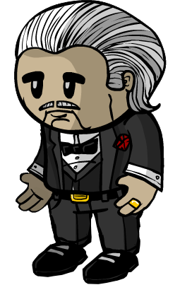

# Godfather

- **Facción:** Mafia  · *en alcance MVP*
- **Página de la wiki:** Godfather

## Ficha

**Clase (alineamiento):**

> Mafia Killing

**Tipo:**

> Killing
> Disruption
> Unique

**Prioridad de acción:**

> 5

**Resumen:**

> You are the leader of organized crime.

**Objetivo:**

> Kill anyone that will not submit to the Mafia.

**Habilidades:**

> You may choose to attack a player each night.

**Atributos:**

> Detection Immunity
> Attack: Basic
> Defense: Basic

**Atributos (texto):**

> If there is a Mafioso he will attack the target instead of you.
> You will appear to be innocent to the Sheriff.
> You can talk with the other Mafia at night.

**Especial:**

> Unique Role
> Mafia chat

**Si hay Godfather/otro objetivo:**

> Order a Mafioso to attack your target. If there is no Mafioso, you will attack the target.

**Si no hay orden:**

> Let Mafioso attack their own target.

**Gana con:**

> Mafia
> Survivor
> Witch

**Debe matar para ganar:**

> Town
> Arsonist
> Serial Killer
> Werewolf
> Vampires
> Coven
> Plaguebearer
> Pestilence
> Juggernaut

**Resultado Investigator:**

> Classic Results
> Your target could be a Bodyguard, Godfather, or Arsonist.
> Coven Expansion Results
> Your target could be a Bodyguard, Godfather, Arsonist, or Crusader.

**Resultado Consigliere:**

> Your target is the leader of the Mafia. They must be the Godfather.

## Texto completo de la wiki

Godfather 

(GF)

Alignment

 Mafia Killing

Avatar

Immunities

Detection Immunity

Attack: Basic

Defense: Basic

Special

Unique Role

 Mafia chat

 Ability Stats

 | Type

 | Priority

 | Killing

Disruption

Unique

 | 5

Actions

Target other

Order a Mafioso to attack your target. If there is no Mafioso, you will attack the target.

No action

Let Mafioso attack their own target.

Investigation Results

 Sheriff

You cannot find evidence of wrongdoing. Your target is innocent or great at hiding secrets!

 Investigator

Classic Results

Your target could be a Bodyguard, Godfather, or Arsonist.

 Coven Expansion Results

Your target could be a Bodyguard, Godfather, Arsonist, or Crusader.

 Consigliere

Your target is the leader of the Mafia. They must be the Godfather.

Game Information

Summary

You are the leader of organized crime.

Abilities

You may choose to attack a player each night.

Attributes

If there is a Mafioso he will attack the target instead of you.

You will appear to be innocent to the Sheriff.

You can talk with the other Mafia at night.

Goal

Kill anyone that will not submit to the Mafia.

 Victory Conditions

 | Wins with

 | Must kill

 | Mafia

 Survivor

 Witch

 | Town

 Arsonist

 Serial Killer

 Werewolf

 Vampires

 Coven

 Plaguebearer

 Pestilence

 Juggernaut

 | 

 | DISCLAIMER: These stories are fanmade, and are not created or endorsed in any way by BlankMediaGames or Digital Bandidos.

The Godfather leans back in his chair, a cigar puffing out amongst his accomplices. "So? Any idea who should fall tonight?" The consigliere speaks up. "The man on 5th Avenue, the one with the limp. He's our Investigator. He's the one we should take out." The Godfather nods his head slowly, and then glances towards the two men sitting on his right. One's hands are scarred, burned by the acid he uses. The other has a revolver strapped to his waste. Both men glance at each other, and then look back towards the Godfather. "Then it's done," the Godfather says, removing the cigar from his mouth and pressing its end into the small portrait of the Investigator. He spends the rest of the night staring over the table of the remaining portraits, when suddenly a knock is heard at his door. He stands up, and covers the portraits and paperwork. He opens the door, and there stands the Sheriff. Known as a well established businessman, he shakes the sheriff's hand and sends him on his way. He goes back to his chair. Gunshots ring out at 5th Avenue, and a smile spreads across the Godfather's face.

Mechanics[]

You can choose a target to attack each night. Your decision overrides whatever choice is made by the Mafioso (if one is alive).

If you are Roleblocked, then the Mafioso will attack his own target. If the Mafioso did not pick or was Roleblocked also, no one will be attacked.

If your Mafioso is role blocked, dead, or does not exist, you will attack the target.

If there is a Mafioso (and they are not Roleblocked that night), then they will kill the target for you. Only the person who does the actual killing will:

Be visible by to any Lookouts, Trackers, Spies, or Trappers visiting the target.

Be attacked by any Town Protectives, rampages, alerts, and/or Stone Gazes at that location.

Receive a message if the target has defense or was Jailed. Note that if the Mafioso does the attacking, the Godfather will not receive said message for ordering an attack on the target in question.

Be able to leave a Death Note behind for the Town to see in the morning.

Both you and the Mafioso's kill/death message appear as "a member of the Mafia", meaning Role Blockers (most notably the Jailor) cannot determine if they Roleblocked either of you.

If a Mafioso is alive when you die, the Mafioso will be promoted to the Godfather.

If there is no Mafioso when you die, whichever member of the Mafia joins the lobby first will be promoted to a Mafioso. They will not be able to become a Godfather unless an Amnesiac becomes the Godfather and dies.

If your Mafioso is controlled , they will still kill your target and not that of the Witch/ Coven Leader.

You have Basic Defense and Detection Immunity.

You can talk with the other members of the Mafia at night.

Strategy[]

As the leader of the Mafia, it is important for you to give orders to the Mafia and to make the most use out of all of their abilities. It is also important to listen to the other members of the Mafia and make use of any information that they give you.

If you are pressed to claim a Town role, the most obvious choice is Bodyguard if, of course, you don't own Coven Expansion, since that's the only Town role in your investigative result. However, a lot of people find that claim suspicious for many reasons, so don't be surprised if they do not believe you. You can also claim as the Executioner and state a false target. You can choose your target as an active Sheriff or one of your members of the Mafia as a target. If you can't choose anyone as your target and the Investigator found you are lying, just say that you were doused by an Arsonist and claim to be the Sheriff and prepare your Last Will because Sheriff is easy to pretend. You can try to also claim doused, and state a different false claim.

Be cautious about claiming Bodyguard unnecessarily; the Town also knows it's your most obvious choice (and it's also the obvious choice for Arsonists). During late or even early game, a desperate or aggressive Town might hang you for claiming it if they have no other leads.

Claiming to be a Bodyguard is also difficult if an important confirmed Town role like the Mayor or Jailor has died at night, since the Town would wonder why you weren't protecting them. In this situation, you can try to claim that you were role-blocked by a Bootlegger.

If another Town Protective is killed, especially if they are a Bodyguard themselves, you may be hanged or killed due to the much lower chance of there being another Bodyguard.

You can also claim to be a Bodyguard and have another member of the Mafia (which can be a Disguiser) claim Doctor. Then every day you can say that you will protect the Doctor tonight and they will heal you tonight. You can also use messages during the day such as "Thanks, Doc!" or "Thanks BG!" to further mislead the Town. This strategy is very hard to disprove because the Investigator will also see you as a Bodyguard and the Disguiser as a Doctor, even if he does not disguise himself or you as anyone (or if he disguises as a Doctor or you as a Bodyguard). You will also have an alibi to why you did not protect the Mayor or Jailor if they died that night. You can even have the Spy confirm you by the Mafia visits made by the Disguiser.

When claiming to be Doused, be aware that if an Arsonist ignites, you will likely be hanged under suspicion of being an Arsonist (unless a Guardian Angel interferes).

Sometimes, it can be advantageous to claim Arsonist since some Townies prefer to keep Neutral Killing roles alive if the Mafia is nearing majority. It can also be used to deter roles like Pirates or Witches from targeting you or to sway a Survivor or Executioner to your side.

A potential strategy with the Mafia is to have one of them claim to be a Sheriff saying another member of the Mafia (usually one that's not important, like a Framer) came up as suspicious. This has some benefits: First, the accusing member of the Mafia usually becomes a "confirmed" Townie, so the member of the Mafia that claimed to be a Sheriff has a viable defense. However, this can cause more harm than benefit as someone can call them out through information. It can also lead to the member of the Mafia's death from a Neutral Killing role if it's a Serial Killer or Werewolf. This is called bussing, and is a very effective strategy if pulled off.

Always select a target, since your Mafioso might get Roleblocked or controlled that night.

Try having Townies hanged by putting roles you want to dispose of as having some form of Defense, even if they don't. The Town almost always listens to Death Notes claiming someone has immunity, especially if they don't have any leads during the day. This is a great way to eliminate Townies and other opposing forces. You can also try to frame Townies this way. Claiming to attack them and saying their defense is too high. Watch out for Spies when doing this, as they can easily disprove the Death Note unless one of your Mafia members visited them.

If the Mafia found a Neutral Killing role and you want to keep them alive for just a moment, you can place their name in your Death Note so that you can reveal them when your Mafioso is killed or Roleblocked. If the Mafioso is also using Death Notes, copy it's information and add your important info alongside it.

Try claiming to be an Executioner and tell the Town you will side them if they help you hang your target. That might explain your Basic Defense and keep people off your case for a while. Of course, this could backfire if there is a Jailor who chooses to execute you, or if you unknowingly claim that your target is the Jailor or someone who is confirmed to not be a Townie.

Deception is your greatest power. Use it to throw a Town Investigative off your scent.

You do not visit when commanding a Mafioso. This can be used as a Psychic, Medium or Executioner claim.

However, if your Mafioso dies or is Roleblocked, you could be caught by a Tracker or Lookout.

If a member of the Mafia is not following your orders or acting dangerously (voting against fellow members of the Mafia when not necessary, refusing to hang non- Mafia members when their vote is key), claim to be a Sheriff the next day and accuse that person of being suspicious. This might sound like gamethrowing, but it confirms you as a Townie, and the threat can be neutralized. This is called bussing.

Occasionally, when facing a Vigilante, Vampire, or Serial Killer, it can be useful for you to bait them into attacking you in order to protect other members of the Mafia. This is generally only a viable strategy when you just need one more night or when you already have at least a plurality, since you'll out yourself as a role with Defense in the process. Also, if you're going to bait by making yourself appear to be evil (generally necessary to bait a Vigilante), ensure that the Jailor is dead.

Remember, while you are generally considered the leader, do not try to be too bossy. The other members of the Mafia may not listen to you if you act rude. Also, remember that other members of the Mafia may know more than you, such as a Consigliere or Blackmailer finding an important Town role.

If you are attacked, act natural. Most Godfathers will not say anything during the day if they were attacked. A few carefully worded lies can keep you from the gallows.

If you where shot by a Vigilante, you can claim that you're a Bodyguard and used your bulletproof vest. Claiming to have been healed by a Doctor can sometimes work too, though if a Doctor dies and kept track of who he healed, this could backfire without a Forger. A Doctor's heal still produces a message of Defense, but there must be an explanation for why a Doctor had any reason to heal you. Claiming to be a Survivor rarely works, since the Town has little reason not to hang a Survivor who has fallen under suspicion, and may even assume them to be a Werewolf or Arsonist (if there is a possibility of a Neutral Killing role). Survivor is also impossible to claim in Ranked, so reserve it for All Any.

Conversely, you can claim to be a Veteran who alerted and claim that the Vigilante is faking. However this carries several risks, as not only can a real Veteran counter-claim you, you may get called out by anyone else who visited you. Therefore, you should only use this if the Mafia has hit a plurality.

If the Vigilante is not confirmed and you know who they are, you can quickly counterclaim Vigilante and accuse the real one of having Defense before they even start accusing you. Getting the Vigilante hanged or, ideally, executed will buy the Mafia more time to get majority.

You could try and claim to be a Vigilante on Day 2 and that you attacked one of the members in your Mafia but they were immune. Keep telling the Town to hang them. The Town will realize that a Vigilante can't shoot on Night 1 and assume you are an Executioner or Jester and that the person you called out is your target. This strategy helps you in several ways:

An Executioner has Basic Defense, giving credit to your claim since you have Basic Defense as the Godfather.

The member of the Mafia you called out will be considered a Townie (Note: if you are outed as Godfather somehow, and people find out your role, then experienced Townies might think your that "target" is also a member of the Mafia since this is a common strategy called "bussing".)

You've also now removed suspicion from yourself and another member of the Mafia since most people will ignore an Executioner or a Jester once they've been revealed. Of course, this requires the cooperation of the other member of the Mafia. In some cases, however, they'll think you're ratting them out and tell the Town you're the Godfather or that you're a member of the Mafia. You obviously don't want this to happen, since it crumbles the alibi you're trying to build.

NOTE: do not try this in Ranked, you will quickly be hanged or executed if you pretend to be a non- Town role in a competitive game mode.

Try to have a non-member of the Mafia hanged as early as possible. If it works and they are Town, you can claim to be an Executioner and you will work with the Town. If it doesn't work, try to hang them all game; the Town will say you are a bad Executioner. If the Townie you tried to have hanged dies, the Town will not hang you out of fear that you have turned into a Jester.

Although claiming Executioner often works well, it can work out badly as Jailors often execute people who they believe to be an Executioner or who claim/act like one in case they are a role with Defense faking. They could also hang you, although this is less likely as they may suspect you of being a Jester.

One of the quickest ways to lead to downfall for the Mafia are Death Notes - if the Mafioso is Roleblocked and you kill someone, leaving a entirely different Death Note, then the Town will know that either the Death Note has been changed or, more likely, the person writing it wasn't the same person as the one writing the other Death Note. The easiest way to avoid this is for the Godfather to copy the Death Note of their Mafioso, so that the Town has no idea when one of them has been Roleblocked.

If your Mafioso is Jailed, it can be somewhat risky when choosing a target to kill since attacking an alerting Veteran or a target guarded by a Bodyguard will kill you and put pressure on the Jailed Mafioso the next day.

Dealing with Townies/ Neutrals/ Coven[]

Dealing with an Investigator: If you are concerned that you may be visited by an Investigator, claim Bodyguard when pressed to claim a result, since that is the only Town role in your investigative results, and it is very hard to disprove. You can even claim to have used your bulletproof vest if someone calls you out as having a higher defense value than their attack value. Of course, Bodyguard isn't always the most plausible claim. but if you were investigated, it is the only thing you can do. If there is an Arsonist or you are playing All Any, claim you might be doused.

Dealing with a Sheriff: A Sheriff cannot find you, but they can find and call out the other Mafia members to the Town. You can claim any Town role or any role with Detection Immunity ( Neutral Benigns are the best choice if you can't claim a Town role). After that, make up a fake yet well-written Last Will if needed. However, if there is evidence mounting against you, there is little you can do.

Dealing with a Jailor: Like all evil roles, you should have a claim ready for, if and when you are Jailed.

The most obvious and sometimes only claim is Bodyguard (unless you are playing the Coven Expansion), especially if the Jailor has Jailed an Investigator before.

Alternatively, you can simply claim some other role, such as Sheriff or some other role which will be drawn up for easily, and hope that the Jailor hasn't yet cross-referenced your role with the Investigator. You may be in trouble if their Last Will is exposed to the Investigator, but it's preferable to delay the issue and hope you can win before then than to be executed immediately by a suspicious Jailor.

If all hope is lost, and the Jailor has decided to execute you, remember that the Jailor can still be role blocked by a Bootlegger or controlled by a Witch that has teamed up with you.

Dealing with the Mayor: Once a Mayor has been revealed, it's a war between you and him in terms of commanding your faction, as both of you are the leader of your respective alignments. Being the Godfather , you know the identity of all the fellow members of the Mafia and can easily communicate with them at night. However, the Mayor faces many difficulties related to these two aspects due to his inability to send or receive whispers and the lack of privacy from belligerent roles during the day. These are the Mayor's biggest pitfalls, which you can use to your advantage.

Trying to kill the Mayor immediately after they've revealed is risky, as a Bodyguard could be protecting them. However, Blackmailers are completely unaffected by Bodyguards. A blackmailed Mayor is unable to reason with Neutral roles, instruct other Townies, or reply to them. Thus, the blackmailed Mayor is effectively stripped of all his powers except for the triple vote he has. This tactic has its flaws, too; However, as the Mayor could be protected by a Jailor or Transporter. A Lookout will be able to call out your Blackmailer if they are present, but this gives you some opportunity. If you have a Disguiser, you can tell them to Disguise the Blackmailer to deceive the Lookout into hanging a Townie.

In the Coven Expansion, a Crusader can protect the Mayor and kill your Blackmailer or Mafioso, and prevent your attack, so target them first.

Dealing with a Survivor: You can whisper and try to convince them that the Mafia has a better chance of winning than the Town. In return, you can promise that you will not attack them. In the best case, the Survivor will help you hang the Town or Neutral Killing roles in late game; in the worst scenario, they will simply rat you out to the next Townie they see.

Dealing with a Witch: The Mafia can win with Witches and it is very common for them to work together, but an ill-informed Witch can cause serious problems for you. If you or a member of the Mafia are repeatedly being controlled by the Witch, it may be a good time to identify the Witch as quickly as possible as they could make you kill your members of the Mafia.

Dealing with a Coven Leader: The Coven Leader is a big danger to the Mafia as they can make you kill members of the Mafia or make you or your Mafioso visit the Medusa. Before night 3, you can kill the Coven Leader before they gain their defense, so find and target them early.

Dealing with a Medusa: You can kill her at the right time when she doesn't use her Stone Gaze. Your Bootlegger can also role-block her, allowing you to kill her safely; unlike the Veteran, the Medusa is not immune to being role-blocked.

Dealing with a Necromancer: The threat the Necromancer presents depends on what is in the graveyard. To mitigate the threat, use the Janitor and the Forger to thwart their kill potential. You can also have the Forger forge a killing role as a Town Protective role to trick them into killing members of the Coven.

Dealing with a Hex Master: Like the Arsonist, they are a silent killer that can thwart your Consigliere's results and can kill all the Mafia if left unchecked. However, unlike the Arsonist, they do not have defense. Try attacking players that show up as Hex Master to the Consigliere as you'll likely hit the Hex Master doing this.

Dealing with a Potion Master: Unlike the other Coven, the Potion Master is less of a threat and more of a nuisance, as like a Doctor, they can prevent your attacks from killing members of the Coven, and like the Consigliere, they can directly find the mafia even if Doused. If you suspect that a Potion Master healed the target you attacked, attack them again. Since the Potion Master usually has a 3-day cooldown between potions, you can kill your original target without much interruption.

Dealing with a Poisoner: Generally speaking, if there's a Doctor in the game, the Poisoner is virtually a non-threat to the Mafia as the Poisoner serves as a mere distraction for the Doctor as you kill higher priority targets. If someone claims Poisoned on the same night the Poisoner died, tell the Ambusher to target them.

Dealing with a Serial Killer: A major obstacle in the way of Mafia's victory is the Serial Killer. The Serial Killer is a wildcard that can make or break the Mafia. Using Mafia role strategies listed below can stop a Serial Killer. However, as Godfather, there is little you can do to get rid of the Serial Killer due to their Basic Defense. One small strategy that can assist your victory against Serial Killers is to pretend that you are Town and to bait the Serial Killer to attack you. When the day comes, say that you were attacked but you were healed by a Doctor ( Serial Killers usually can't accuse you of being the Godfather without revealing themselves in the same round as their attack, but they may do so in their next Death Note, so make sure to dispose of them as soon as possible after being attacked). Because of the Serial Killer's Basic Defense and the fact that Serial Killers win over any member of the Mafia vs Serial Killer situation, hanging a Serial Killer when there is a small group is vital for a win. A more risky strategy can be done once you find out the Serial Killer due to their Basic Defense. Claim to be a Witch and you have been controlling the Serial Killer. Proceed to convince the Town on how hanging you would not benefit over hanging the Serial Killer. You could also try saying you will side with the Mafia. It is also possible to claim to be a Sheriff after finding the Serial Killer, then accuse the Serial Killer of being the Serial Killer. If you succeed, the added perk of the Town's trust is gained.

Dealing with a Rogue Neutral: Sometimes Serial Killers, Arsonists, the Werewolf and the Juggernaut will admit that they are a Neutral Killing role, recognizing they're going to lose, and instead side with the Town, meaning they will only attack players the Town tells them to. Essentially, it is considered gamethrowing to help the Town win, and they will target you and members of the Mafia first. Although this is challenging to counter, since it deals with fighting someone suicidal, there are several ways to keep your team intact. If you have a Blackmailer, you should obviously continue to blackmail that killer and convince the Town to hang them. If you have a Bootlegger, you can role block an Arsonist or Juggernaut constantly. It is also possible to simply remind the Town that they are gamethrowing by not hanging an enemy.

In Conjunction with Mafia Roles[]

While it may be tempting to micromanage the Mafia and give orders to everyone, it is generally smart to listen to your members for advice and info before giving orders to the members in your faction:

 Mafioso: Make sure your Mafioso is choosing a target every night in case you are Roleblocked, and listen for feedback on whether they received a message notifying them of said target having a form of Defense if their attack was unsuccessful. Also, make sure they leave any important information you want to reveal to the Town in their Death Note.

If there's an active Forger or Janitor, make sure your Mafioso is choosing the same target as you to utilize the most efficient usage of their abilities and to ensure they don't waste a forgery or cleaning if you are Roleblocked.

If the role-list does not show a guaranteed Mafioso + Godfather combo or a Forger forged someone as a Mafioso/ Godfather, you can ask a Tavern Keeper or the Jailor to jail/roleblock you. Since the Town does not know what Mafia role someone died to (except Ambusher), you can generally clear yourself from suspicion of being the Godfather if played well.

Since your Mafioso cannot be controlled when you command them, consider having your Mafioso claim Vigilante or Investigator. Doing this can help bait a Witch into targeting your Mafioso, which can be a major help for the Witch trying to find the Mafia to team up without disrupting the rest of the Mafia.

 Consigliere: If the Consigliere tells you their results each night, use that to determine who to kill. If they tell you to kill a certain target, listen to them, cause they'll usually tell you that they're an important role (like a Mayor). If they discover a Neutral Killing role, you can out them in a Death Note, though sometimes it can be more beneficial for the Consigliere to accuse them publicly while claiming to be an Investigator, gaining the Town's trust.

A competent Consigliere usually tells you what role their results showed the next day (via whispers) or night. Remember, though, that you can't deduce anything about someone they visited the night they were killed (since they wouldn't have had a chance to say anything).

As a general rule, you should keep track of who the Consigliere visits, and avoid killing people the Consigliere has visited and and didn't tell you to kill. In addition, this has the added advantage of rapidly reaching a point where the Mafia knows every role.

For the same reason, when the Consigliere reveals a weak role like a Survivor, consider passing over them for now and killing targets with unknown roles instead. This will increase your chance of finding more important roles like the Jailor, Mayor or Vigilante early on.

Conversely, if the Consigliere has investigated most of the other roles and told you only Town roles, any Neutral Killing role you're searching for is probably among the people they haven't visited.

 Blackmailer: Coordinate with a Blackmailer to silence dangerous Townies without revealing their Last Wills. If you suspect someone is a Town Investigative, blackmail them every night instead of killing them. While you can also try to have blackmailed targets hanged, be warned that this is a fairly obvious gambit and will often attract suspicion to you, especially once it becomes clear that the person you accused was blackmailed. Remember, ask the Blackmailer for information on whispers but any competent Blackmailer would tell you if there was important information without being prompted.

 Bootlegger: Similar to the Tavern Keeper, use your Bootlegger's distraction abilities to stop pesky Town Investigative roles from revealing your Mafia's identities and to suppress dangerous killing roles. If there is a single Town Protective role protecting someone, (like a Jailor or Mayor) you can tell the Bootlegger to distract them as you kill the Town Protective's target. This has the added bonus of drawing suspicion on the protective role the Bootlegger Roleblocked. As a last resort, tell your Bootlegger to role block the Werewolf if need be, and put the Werewolf's name in their Last Will.

 Disguiser: Communication with your Disguiser is key to pull off successful plays. If other members of your Mafia fall under suspicion, and other Townies have claimed certain roles, you may need to tell your Disguiser to disguise them in order to keep the other Mafia members alive, and instead put suspicion on other Townies.

 Forger: Communicate with the Forger to rewrite dangerous info of Town Investigatives. If someone claims a unique role like a Veteran, you can have the Forger forge a silent Townie to draw suspicion on the claim. You can alternatively have the Forger forge someone as Jester, Witch or even a role with defense (provided they left the game) to further deceive the town. You can even have the Forger forge a Mafia-known Vigilante as a Town Protective role to trick the Retributionist or Necromancer into killing their teammates.

 Janitor: You should team up with the Janitor for the most efficient usage of their abilities. A cleaned Townie can make it easier to lie about roles and can thwart an Investigator's Last Will logs. Since the Janitor's cleaning is obvious, you can order them around somewhat more directly than most roles; but you might want to be a bit circumspect out of courtesy to them if it's not clear they'll want to clean and they haven't yet outed their presence by cleaning previously.

 Ambusher: Similar to the Crusader, command the Ambusher to kill pesky Town Protective roles protecting higher-priority Town roles. You can also command the Ambusher to target the same person as another member of the Mafia (like a Bootlegger) to kill potentially dangerous Town roles like a Lookout or a Spy. Beware of Mediums or multiple non- Mafia visitors as they can reveal the Ambusher.

 Hypnotist: The Hypnotist is a wildcard to the Mafia, which means you can utilize their abilities in some ways. You can have the Hypnotist claim Doctor and send a fake Heal message in case you are Jailed without a Mafioso. You can also have them use the Crusader protect message to pass off your Crusader claim.

 Framer: Generally speaking, let the Framer do their thing unless you need someone specifically to be Framed to give you a slight advantage.

 | Godfather and Mafioso nightly kill interactions 

 | 

 | Godfather picks a target

 | Godfather does not pick target

 | Godfather is controlled

 | Godfather was roleblocked / No Godfather

 | Mafioso picks a target

 | Mafioso attacks Godfather's target

 | Mafioso attacks their own target

 | Mafioso attacks Godfather's controller's target

 | Mafioso attacks their own target

 | Mafioso does not pick target

 | Mafioso attacks Godfather's target

 | No attack

 | Mafioso attacks Godfather's controller's target

 | No attack

 | Mafioso is controlled

 | Mafioso attacks Godfather's target

 | Mafioso attacks controller's target

 | Mafioso attacks Godfather's controller's target

 | Mafioso attacks controller's target

 | Mafioso was roleblocked / No Mafioso

 | Godfather attacks their own target

 | No attack

 | Godfather attacks controller's target

 | No attack

Achievements[]

 | Name

 | Description

 | Merit Points

 | Leader of the Mafia

 | Win your first game as a Godfather

 | 20

 | Cosa Nostra

 | Win 5 games as a Godfather

 | 20

 | Organized Crime

 | Win 10 games as a Godfather

 | 40

 | Evil Syndicate

 | Win 25 games as a Godfather

 | 100

 | Mastermind

 | Win the game without dying

 | 20

Messages[]

 | 

 | You were attacked by a member of the Mafia!

 | Displays at the end of the night when you are attacked by a Mafia Killing role. 

 | (S)He was killed by a member of the Mafia or (S)He was also killed by a member of the Mafia

 | Cause of death for a player who was attacked by the Godfather.

History[]

3.2.4

Temporary Defense given by certain roles through game mechanics now give attackers the message "Your target's defense was too strong to kill.".

3.2.3

 Trapper will no longer die to Attack if another Trapper has placed a Trap on them.

Dual Trappers can now save each other if they have placed Traps on each other and both are attacked.

3.1.14

Fixed Tracker tracking Godfather bug.

Fixed Tracker detecting Godfather visiting victim when Godfather orders Mafioso to kill the victim.

Fixed incorrect Tracker results when Mafioso picks one victim but Godfather chooses another.

2.5.5.12200

The Godfather's role icon has been changed. Old one was .

Added Godfather's circled role icon ().

2.5.1.10655

Fixed Guardian Angel "target was attacked" feedback.

Beta 0.8.1

Attackers will now get "Your target is immune" message when attacking Werewolf on Full Moon nights.

Town of Salem Release

Introduced.

 | 

 | 
Roles

 | 

 | 

 | 
 Town

 | 

 | Town Investigative | | Investigator • Lookout • Psychic • Sheriff • Spy • Tracker | | 

 | 

 | Town Killing | | Jailor • Vampire Hunter • Veteran • Vigilante

 | 

 | Town Protective | | Bodyguard • Crusader • Doctor • Trapper

 | 

 | Town Support | | Mayor • Medium • Retributionist • Tavern Keeper • Transporter

 | 
 Mafia

 | 

 | Mafia Deception | | Disguiser • Forger • Framer • Hypnotist • Janitor | | 

 | 

 | Mafia Killing | | Ambusher • Godfather • Mafioso

 | 

 | Mafia Support | | Blackmailer • Bootlegger • Consigliere

 | 
 Coven

 | 

 | Coven Evil | | Coven Leader • Hex Master • Medusa • Necromancer • Poisoner • Potion Master | | 

 | 
 Neutral

 | 

 | Neutral Benign | | Amnesiac • Guardian Angel • Survivor | | 

 | 

 | Neutral Evil | | Executioner • Jester • Witch

 | 

 | Neutral Killing | | Arsonist • Juggernaut • Serial Killer • Werewolf

 | 

 | Neutral Chaos | | Pirate • Plaguebearer/ Pestilence • Vampire

## Implementación

- [ ] Definido en `packages/engine` con su prioridad y facción
- [ ] Acción nocturna (si aplica) validada con objetivos legales
- [ ] Resultado de investigación correcto (Sheriff / Investigator / Consigliere)
- [ ] Condición de victoria y de derrota comprobada en tests
- [ ] Tests unitarios del rol en verde
- [ ] Tarjeta y texto de ayuda en la app
- [ ] Icono e ilustración propia (no el arte de la wiki)
- [ ] Plantillas de narración para sus eventos
