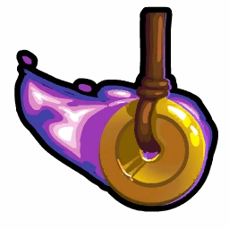
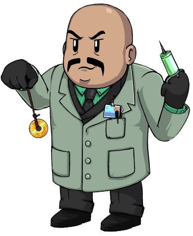

# Hypnotist

- **Facción:** Mafia  · *en alcance MVP*
- **Página de la wiki:** Hypnotist

## Ficha

**Clase (alineamiento):**

> Mafia Deception

**Tipo:**

> Manipulation
> Non-unique

**Prioridad de acción:**

> 3

**Resumen:**

> You are a skilled hypnotist who can alter the perception of others.

**Habilidades:**

> You may sneak into a players house at night and plant a memory.

**Atributos:**

> Attack: None
> Defense: None

**Atributos (texto):**

> A planted memory will confuse the player.
> If there are no kill capable Mafia roles left you will become a Mafioso.

**Especial:**

> Mafia chat
> Becomes Mafioso when Mafia Killing are dead

**Gana con:**

> Mafia
> Survivor
> Witch

**Debe matar para ganar:**

> Town
> Arsonist
> Serial Killer
> Werewolf
> Vampires
> Coven
> Plaguebearer
> Pestilence
> Juggernaut

**Resultado Sheriff:**

> Your target is suspicious or framed!

**Resultado Investigator:**

> Investigator Results
> Your target could be an Tavern Keeper, Transporter, Bootlegger, or Hypnotist.

**Resultado Consigliere:**

> Your target is skilled at disrupting others. They must be a Hypnotist.

## Texto completo de la wiki

Hypnotist 

(Hypno)

Alignment

 Mafia Deception

Avatar

Immunities

Attack: None

Defense: None

Special

 Mafia chat

Becomes Mafioso when Mafia Killing are dead

 Ability Stats

 | Type

 | Priority

 | Manipulation

Non-unique

 | 3

Investigation Results

 Sheriff

Your target is suspicious or framed!

 Investigator

 Investigator Results

Your target could be an Tavern Keeper, Transporter, Bootlegger, or Hypnotist.

 Consigliere

Your target is skilled at disrupting others. They must be a Hypnotist.

Game Information

Summary

You are a skilled hypnotist who can alter the perception of others.

Abilities

You may sneak into a players house at night and plant a memory.

Attributes

A planted memory will confuse the player.

If there are no kill capable Mafia roles left you will become a Mafioso.

Goal

Hang every criminal and evildoer.

 Victory Conditions

 | Wins with

 | Must kill

 | Mafia

 Survivor

 Witch

 | Town

 Arsonist

 Serial Killer

 Werewolf

 Vampires

 Coven

 Plaguebearer

 Pestilence

 Juggernaut

 Hypnotist messages in the Coven Expansion

 | 

 | DISCLAIMER: These stories are fanmade, and are not created or endorsed in any way by BlankMediaGames or Digital Bandidos.

“The human mind is very… complicated, is it not?” a voice asked from the shadows of the room “What do you want from me?” the man in the chair yelled, soaked in sweat with blood running down his cheek. The shadowy figure emerged and wiped the blood off, diluted with sweat. It’s always important to make sure the client is relaxed before commencing with the process. The figured shushed the man in the chair.

“Everything will be okay” the figure proclaimed.

“Everything will be okay” the man replied before being sent off to the dream world.

The hypnotist snapped out of this side of himself. Turns out that if you know the right people, a degree in psychology can pay extremely well.

He went to the nearby Consigliere.

“Ya sure it was the blonde guy on the corner that killed Tommy?”

“Sure as I’ll ever be” she replied, wiping the Sheriff’s blood off the rusted hammer.

The hypnotist returned to the Sheriff in the chair and gave him a firm slap across the jaw. He fell back into his medical side. This was so much more fun than working with those crazies in the asylum.

“Do you know that blonde man who lives three houses away from you?”

“Yes I do”

“He is a very bad man. He tried to hurt you tonight”

The hypnotist knew that this was working. He was just thinking about how fun this would be to do on the Mayor. All that power manipulated with a few simple words.

He took out his pocket watch and let it swing in front of the man’s face.

“But we protected you. He tried to hurt you but we saved you”

“You protected me and he tried to hurt me. I will tell the town and stop the man from hurting anyone else”

“Good”

The man silently took the Sheriff back to his house to sleep. The man knew who would hang tomorrow. The Godfather would be very pleased.

Mechanics[]

You may hypnotize one player each night, giving them a false message once the Night ends.

If you don't choose a message, you cannot be controlled into visiting anyone.

A Spy who bugs your target will receive the message you planted.

 | Hypnotist Message Options 

 | 

You were Transported to another location.

Someone occupied your night. You were Roleblocked!

Someone tried to Roleblock you but you are immune!

You were attacked but someone fought off your attacker!

You were attacked but someone nursed you back to health!

You feel a mystical power dominating you. You were controlled by a Witch!

You were Poisoned. You will die tomorrow unless you are cured!

You were Poisoned. You will die tomorrow!

You were attacked but someone protected you!

You were Poisoned but someone nursed you back to health!

Someone tried to Poison you but someone fought off your attacker!

You triggered a trap!

You were attacked but a trap saved you!

A trap attacked you but someone nursed you back to health!

 | identifies results exclusive to the Coven Expansion.

 | The role block immune message appears if the target is role block immune, otherwise the standard role block message appears.

 | The curable message appears on Nights 1 and 2, while the uncurable message appears when the Coven has the Necronomicon, regardless of who currently wields it.

Strategy[]

You are a wildcard to your team, with the ability to manipulate messages people receive. This can help with claiming specific roles, though that isn't to say if you select the wrong message, your presence is revealed.

Claiming to be a Doctor may not be a bad idea - if you hypnotize someone to think that they were attacked but healed, they will most likely say something along the lines of, "Thanks, Doctor," the next morning. Whispering them saying, "You're welcome," will make them feel indebted to you and more likely to support your claim if you are accused. Another way to gain the trust of who you "heal" is by whispering them a message a close friend would say. Some examples are: "I don't think so!", or "Not today!". This will make them see you as more friendly, and more like they have some connection with you.

Even if they don't make any mention of being healed, whispering that you know they were healed will likely make them view you as a confirmed Townie.

If your only Mafia Killing is Jailed or being Roleblocked, you can use the attack & protected messages to fake Mafia attacks and reduce suspicion against them. This is particularly useful in the situation where the Godfather is Jailed without a Mafioso, as your "protection" messages can cover for the lack of killing, and the Spy can cover for you by seeing the Mafia visits (and the message if they happened to bug your target). This will prevent the Mafia from being paralyzed in a pinch, and perhaps save the game if the Town believes the message.

While claiming to be a Tavern Keeper may seem like a stupid idea because you cannot directly Roleblock someone, your hypnosis can cover that for you. This is reinforced by the fact that most people claim they were Roleblocked.

Be wary of Serial Killers, however, as anyone who Roleblocks them will die (unless they choose to be Cautious). Although they can hardly call you out on it, a smart Serial Killer will know you are a Hypnotist and attack you.

Additionally, remember that if you send a fake Roleblocking message to someone whose ability produces obvious results (such as most investigative roles), they'll immediately know there's a Hypnotist.

Finally, a Spy can easily call you out, and (although they will accuse you of being a Bootlegger) you will likely be hanged.

 Investigators limit your claim-space down to a Tavern Keeper or Transporter. If you choose random people to hypnotize into believing they were Roleblocked], and can disprove your claim, you may be hanged easily. In this case, Transporter is a decent claim if there are no Spies around.

Claiming Transporter can be a good idea if you claim that you Transported someone that was killed or claim to have been Transported yourself. Usually, the Town will have no idea this was the work of a Hypnotist. It works even better if your target freely shares they were Transported.

Keep in mind that much like role-blocks, you cannot produce a "Someone tried to Transport you but you were in Jail." message, as your ability will fail when targeting a Jailed player. This means that a Transporter producing this message is ultimately confirmed as not Hypnotist.

You can also use this to your advantage, by telling a Jailed Mafia member to claim they received this message, will help prove your claim as legitimate. Smart Townies might realize that both of you are lying, but by the time that happens it will probably be too late for the Town.

If your Last Will consists of only Transporting one person with yourself, or dead people, you may be suspected as a Hypnotist. You can have another Mafia member claim Transported to justify your claims a bit.

Your Transporter claim can be strengthened if you have a Forger or another Hypnotist, as the Forger can fake Mafia attacking themselves by forging targets as Mafia, and the Hypnotist can add that extra Transport message needed to "confirm" yourself as a Transporter.

However, a Spy can discredit you fairly easily if they realize many of your targets match Mafia visits without a Disguiser. They will immediately call out the other Mafia members that supported you once you are killed.

You can use your hypnotism to eliminate claim-space that a Town member needs in order to get them hanged - for instance, making it appear that there's a Transporter or Tavern Keeper occupying Town Support so people won't believe a Medium or Retributionist (especially if a Janitor or Necromancer is in game) claim. When using your ability in this way, try to target someone talkative and trusted so they'll volunteer the falsified information on their own, or Town members whose votes you particularly need to hang the victim (like a Mayor).

Making roles think they were controlled by a Witch/ Coven Leader can be useful as it can disrupt the Town's focus or reveal roles that are hiding under the radar, such as a Vigilante or Mayor.

With a Disguise, using the controlled message on a Jailor who claims Day 1 can place all visitors under suspicion even with Spies around.

Unfortunately, using this on roles that are given information at night will ultimately reveal your presence. You can circumvent this with a Bootlegger.

In the Coven Expansion, doing this after night 3 or with the Coven Leader dead will also reveal your presence unless you can convince the Town the dead Coven Leader was forged (before Night 3).

Posing as a Witch, you can also use your hypnotism to try to trick a Neutral Killing role you found into confessing their role to you. If they do, you can either immediately out them to the Town, or work with them and tell them to attack certain targets for the Mafia's benefit, then hang them once they've served their purpose.

In the Coven Expansion, you can manipulate Guardian Angels using your Necronomicon poison message; most Guardian Angels will immediately protect their target when they claim to be poisoned. This can be used to waste a Guardian Angel's protections to get their target killed sooner. Make sure that there's a Guardian Angel present first, or it will be obvious there's a Hypnotist when the target fails to die to poison.

If it's Night 3 or later and there is a confirmed Coven Leader in-game, smart Townies will realize the presence of a Hypnotist if a Spy bugged the hypnotized target or by simply asking if the message contained "unless you are cured!", since the Poisoner cannot possibly have the Necronomicon. Don't use the message from Night 3 onwards if the Coven Leader is not dead yet, or the target will realize they have been hypnotized.

If you still want to make it appear that there's a Poisoner in game, use the "poisoned but healed" message. This can also work to fake the existence of a Necromancer as well if there's a dead Poisoner (real or forged).

Sending a poison message and no follow-up (and other bizarre messages) can sometimes be useful for discrediting people; while the Town might realize there's a Hypnotist, they may also assume that someone making nonsensical claims is a Jester.

Your Bodyguard message might seem useless at first (because the Town will immediately be suspicious at the lack of a corpse for both the Bodyguard and the attacker), but if there's an potential Necromancer to make an attack that leaves no attacker's corpse, the Bodyguard message can sometimes be utilized by claiming to be a Bodyguard who was saved by a Doctor. Better yet, you can have another Mafia member pretend to be the Doctor who healed you (whispering you as soon as the next day begins), which will discourage other evils from attacking either of you. The catch is that you risk outing two Mafia members if either of you gets caught. If you think it's too risky to use a Bodyguard message, you can use a Trapper message instead.

You can also use this to have another Mafia claim Doctor and accuse someone of being the attacker, but only do this if you know for certain that your team will gain majority by doing this.

You can also claim to be a Retributionist using a dead Bodyguard. In this case, you can tell the main Mafia Killing roles to not attack to help support your claim, and the Spy can cover for you by seeing the Mafia visits or even seeing the message with their bug. If the Doctor happens to save someone that night, they might think they saved the Mafia Killing.

Under the right circumstances, you can also make your target believe that you used the dead Bodyguard to save them from Necromancer's Ghoul.

Keep in mind that the Retributionist is an unique role and they will likely call you out if one exists.

Remember, you can manufacture false claims for anyone in the Mafia, not merely yourself; you can also prepare them, share them in the Mafia chat, and have whoever needs them use them when pressed. It's a good idea to prepare an excuse or two for other Mafia members in advance, using messages to prepare things that anyone can claim if pressed.

When manufacturing fake claims for the entire mafia, roles that only produce occasional messages (such as Doctor or Bodyguard) are more useful than ones that would be expected to produce them every night (like Tavern Keeper or Transporter). You can still fake 'noisy' roles by making most of your visits be to dead people, but it's more risky, and other Mafia members are unlikely to prepare the detailed fake Last Will this requires - whereas "if you get in trouble, claim Doctor and say you healed this player" is much easier to remember and fall back on.

You can also do this if the Godfather (and any member of the Mafia) decides to claim Crusader and they can claim that they attacked an immune role. If there's a Spy, you should have your Godfather or Mafioso not attack to help support said Crusader claim, as any Spy bugging your target will see your Crusader protect message and see the Mafia visited said person and failed to kill, thus legitimizing said Crusader claim.

If you suspect that a Tracker is tracking the Disguiser, you can ask them to Disguise you as your target while you hypnotize your target into believing that they were transported. Since a Transporter is the only other role aside from a Disguiser that can be seen by a Tracker visiting two targets, you can help "confirm" the Disguiser by claiming transported if a Tracker tracks the Disguiser.

You can ask a Vigilante to shoot the Godfather while you use a heal/protect message on the Vigilante. This will allow the Godfather to claim Veteran who shot someone, and the Vigilante can confirm their claim by your message. Of course, this will backfire if the Vigilante was role-blocked, visited by an actual Doctor/ Crusader, or simply chose not to shoot. This can also backfire if the Godfather has multiple visitors or was jailed on the night the Vigilante shoots them, so consider the benefits and risks before attempting this strategy.

When using messages to set up fake claims, it's useful to send them to people who are unlikely to die (and who the Mafia isn't going to want to kill for a while), such as Survivors - after all, if the person who received your message dies, it's going to be wasted. Be cautious about relying on Jesters, since they may lie about your messages in order to get killed themselves.

The wide variety of messages available to the Hypnotist means that Town members rarely suspect any one of them. Convoluted or unlikely claims (such as a Bodyguard who was healed or a Doctor who happened to heal someone) are actually more likely to be accepted, since a Hypnotist making those claims is even more rare. Fantastic claims are also more likely to make an impact on the Town, whereas common ones might simply be ignored.

If you can identify the Jailor, sending him a message that he was attacked and nursed back to health can make him suspect whoever he Jailed that night of being a Serial Killer. Sending that message to a Tavern Keeper can have a similar effect.

Achievements[]

 | Name

 | Description

 | Merit Points

 | On the Count of Three

 | Win 1 game as a Hypnotist

 | 20

 | Now go to Sleep

 | Win 5 games as a Hypnotist

 | 20

 | Entranced

 | Win 10 games as a Hypnotist

 | 40

 | Mesmerized

 | Win 25 games as a Hypnotist

 | 100

 | Cluck Like a Chicken

 | Hypnotize 5 players in a game

 | 20

 | Look Away

 | Hypnotize a fellow Mafia member

 | 40

 | You Were Confused

 | Hypnotize yourself

 | 100

 Only achievable with a Transporter or Witch/ Coven Leader.

Trivia[]

Prior to Version 3.3.0, the Hypnotist was exclusive to the Coven Expansion.

The Hypnotist (initially named Drug Dealer) was made by Kirize12 and added into the game as a result of the Testing Grounds.

History[]

3.3.12

If a Hypnotist "poisons" someone it will now send the correct message depending on the Coven having the Necronomicon. On Night 1 and Night 2 it will say "will die tomorrow unless cured", after that it will just say "you will die tomorrow!".

If a Hypnotist "roleblocks" someone the message will change accordingly if the target is roleblock immune or not. If the target is Roleblock Immune, they will get the "Someone tried to role block you but you are immune". instead.

3.3.4

Removed Crusader-specific Hypnotist message option from Classic Town of Salem.

3.3.1

Removed Coven Expansion-specific Hypnotist message options from Classic Town of Salem.

3.3.0

 Hypnotist is now available in Classic Town of Salem.

For non-mobile platforms, fixed the size of the Hypnotist's menu.

2.5.5.12200

The Hypnotist's role icon has been changed. Old one was .

Added Hypnotist's circled role icon ().

2.0.0.6582

Introduced.

 | 

 | 
Roles

 | 

 | 

 | 
 Town

 | 

 | Town Investigative | | Investigator • Lookout • Psychic • Sheriff • Spy • Tracker | | 

 | 

 | Town Killing | | Jailor • Vampire Hunter • Veteran • Vigilante

 | 

 | Town Protective | | Bodyguard • Crusader • Doctor • Trapper

 | 

 | Town Support | | Mayor • Medium • Retributionist • Tavern Keeper • Transporter

 | 
 Mafia

 | 

 | Mafia Deception | | Disguiser • Forger • Framer • Hypnotist • Janitor | | 

 | 

 | Mafia Killing | | Ambusher • Godfather • Mafioso

 | 

 | Mafia Support | | Blackmailer • Bootlegger • Consigliere

 | 
 Coven

 | 

 | Coven Evil | | Coven Leader • Hex Master • Medusa • Necromancer • Poisoner • Potion Master | | 

 | 
 Neutral

 | 

 | Neutral Benign | | Amnesiac • Guardian Angel • Survivor | | 

 | 

 | Neutral Evil | | Executioner • Jester • Witch

 | 

 | Neutral Killing | | Arsonist • Juggernaut • Serial Killer • Werewolf

 | 

 | Neutral Chaos | | Pirate • Plaguebearer/ Pestilence • Vampire

## Implementación

- [ ] Definido en `packages/engine` con su prioridad y facción
- [ ] Acción nocturna (si aplica) validada con objetivos legales
- [ ] Resultado de investigación correcto (Sheriff / Investigator / Consigliere)
- [ ] Condición de victoria y de derrota comprobada en tests
- [ ] Tests unitarios del rol en verde
- [ ] Tarjeta y texto de ayuda en la app
- [ ] Icono e ilustración propia (no el arte de la wiki)
- [ ] Plantillas de narración para sus eventos
