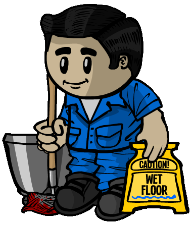

# Janitor

- **Facción:** Mafia  · *en alcance MVP*
- **Página de la wiki:** Janitor

## Ficha

**Clase (alineamiento):**

> Mafia Deception

**Tipo:**

> Manipulate
> Investigate
> Non-unique

**Prioridad de acción:**

> 3

**Resumen:**

> You are a sanitation expert working for organized crime.

**Objetivo:**

> Kill anyone that will not submit to the Mafia.

**Habilidades:**

> Choose a person to clean at night.

**Atributos:**

> Attack: None
> Defense: None

**Atributos (texto):**

> If your target dies their role and last will won't be revealed to the Town.
> Only you will see the cleaned targets[sic] role and last will.
> You may only perform 3 cleanings.

**Especial:**

> Mafia chat
> Becomes Mafioso when Mafia Killing are dead

**Gana con:**

> Mafia
> Survivor
> Witch

**Debe matar para ganar:**

> Town
> Vampires
> Coven
> Plaguebearer
> Pestilence
> Arsonist
> Serial Killer
> Werewolf
> Juggernaut

**Usos:**

> 3

**Resultado Sheriff:**

> Your target is suspicious or framed!

**Resultado Investigator:**

> Classic Results
> Your target could be a .
> Coven Expansion Results
> Your target could be a .

**Resultado Consigliere:**

> Your target cleans up dead bodies. They must be a Janitor.

## Texto completo de la wiki

Janitor 

(Jan/Jani)

Alignment

 Mafia Deception

Avatar

Immunities

Attack: None

Defense: None

Special

 Mafia chat

Becomes Mafioso when Mafia Killing are dead

 Ability Stats

 | Type

 | Priority

 | Manipulate

Investigate

Non-unique

 | 3

Investigation Results

 Sheriff

Your target is suspicious or framed!

 Investigator

Classic Results

Your target could be a Medium, Janitor, or Retributionist.

 Coven Expansion Results

Your target could be a Medium, Janitor, Retributionist, Necromancer, or Trapper.

 Consigliere

Your target cleans up dead bodies. They must be a Janitor.

Game Information

Summary

You are a sanitation expert working for organized crime.

Abilities

Choose a person to clean at night.

Attributes

If your target dies their role and last will won't be revealed to the Town.

Only you will see the cleaned targets role and last will.

You may only perform 3 cleanings.

Goal

Kill anyone that will not submit to the Mafia.

 Victory Conditions

 | Wins with

 | Must kill

 | Mafia

 Survivor

 Witch

 | Town

 Vampires

 Coven

 Plaguebearer

 Pestilence

 Arsonist

 Serial Killer

 Werewolf

 Juggernaut

 | 

 | DISCLAIMER: These stories are fanmade, and are not created or endorsed in any way by BlankMediaGames or Digital Bandidos.

The Janitor is just a lowly schoolhouse custodian. He takes the abuse of the townspeople’s children, the taunts and the bullying. The Janitor is used to it. Any scrap of food left on the cafeteria table is slipped into his pocket, for his pay is meager, and food is a necessity of life, is it not? This has been his life for as long as he can remember. But, as he lay in bed one night, contemplating what he shall do, his door is broken in half. In walks a large and rather intimidating man. He soon realizes he is The Godfather. Fearing for his life, he begs for mercy. The Godfather only laughs, until he realizes who he is going to kill. A plan forms in his head. The Janitor has the skillset to clean anything…even a dead body, wiping away any trace of a will or clues to what a lowly townsperson’s role is. The Janitor is offered a choice. Use his skills for the good of the Mafia, or die. Anyone in their right mind would choose correctly. He grabs his mop, and his bucket, and follows The Godfather outside. Revenge is sweet, but not dirty.

Mechanics[]

You can choose a target to Clean each Night. Your Cleaning attempt will be successful if your target dies for any reason, including leaving the game. However, it is most common that the player dies by a member of the Mafia, as you can see who can potentially die that night. 

The cause of death will still be revealed to the Town, even if it is a Bodyguard dying by guarding someone, or a Vigilante dying of guilt.

Your target's role will appear as Cleaned in the Graveyard.

After you have successfully Cleaned a victim, you will receive a message about their exact role at the beginning of the next day. The following will appear as a plain message:

'You secretly know that your target's role was [Role].'

This happens even while you are dead and used by a Necromancer (may be a bug).

If you are promoted to Mafioso the same night, you will still see your target's role.

If they had a Last Will written, you will receive the following messages afterwards:

'You secretly know your targets last will.'

'Click your targets name in the Graveyard to view their will.'

You will be able to read your victim's original Last Will by clicking on their name in the Graveyard. Everybody else, including the other members of the Mafia, will see a blank Last Will instead.

You can read a Last Will that was covered in blood by a role-blocker attacked by a Serial Killer if you Cleaned the role-blocker.

This can be helpful in finding a Serial Killer, as the roleblocker will have written the last person they visited/jailed.

 Amnesiacs cannot attempt to remember a cleaned person's role.

 Retributionists and Necromancers cannot reanimate Cleaned targets.

If a Forger attempts to Forge your target's Last Will, their attempt will have no effect; your Clean takes priority.

If your target is also killed by Medusa, your Cleaning will take priority over their Stoning, they'll appear as Cleaned instead of Stoned.

You will also be able to read their Last Will, and you will also know their role.

This may help you find the Medusa if your target kept an up to date Last Will.

However this won't work if your target was controlled by the Coven Leader, your target's target was Transported or if the Medusa has the Necronomicon.

You have three Cleanings.

If you visit a Jailed target, you will not lose a Cleaning.

However, if you visit a target that did not die during the Night, you will lose a Cleaning.

Your cleans do not have any effect on an Arsonist's Douse.

Strategy[]

Selecting Someone to Clean[]

It is very important and common to Clean Town Investigative roles because they are almost guaranteed to write something in their Last Will that is important to aid the Townies in hanging the right people. You should Clean them, especially if the Mafioso or Godfather decides to kill a known Town Investigative. Be aware that if you cleaned a Town Investigative role by chance on the first night, there will not be information.

You can later pretend to be one of the known Town Investigative roles as well. Additionally, Consiglieres can benefit from the information obtained, and it will often help them prioritize their investigations.

Be wary of Cleaning the Mafia's first target. Since Night one is when Investigators and Sheriffs will only be getting their first bit of information, if you kill one of them, their Last Will will not contain useful information for the Town. If any roles that aren't Town Investigatives are killed, then it doesn't matter either, as for example, the Medium is almost never confirmed after the first night. As the information from these Last Wills will not surface until much later, your cleanings may be more useful to use later on.

If a fellow member is being accused by a non-confirmed Town Investigative (especially from Day 3 and onward), and you are definite that they are that role, Cleaning them can also be beneficial; however, some players might think your fellow Mafia member is the Janitor, or at the very least, a member of the Mafia, due to hiding that player's information from the others.

On the other hand, in games with tighter role lists, like Ranked, cleaning anyone will conceal their role and make it much harder for the Town to determine people's roles by process of elimination; therefore, it might be a worthwhile strategy to use all your cleans as quickly as possible to be sure you free up as much claim space as you can before you die.

If the Mafia has two Janitors or a Janitor and a Forger, it's usually worth Cleaning or Forging every person who dies, since you're unlikely to run out before the end of the game.

 Retributionists are also unable to reanimate your Cleaned targets. This can come in handy when dealing with Vigilantes, Bodyguards, or other important roles who can allow the Retributionist to swing the game in Town's favor . Bonus points if the Retributionist tries to prove themselves to a Lookout by reanimating the Cleaned role - and getting hanged when they fail!

However, this may lead the Retributionist to reanimate a Town Investigative role, like a Sheriff - making the Mafia's job all that much harder. Generally, it is still a good idea, though.

Even when you are Cleaning roles that seem to have no importance for the Mafia in their Last Will (such as Doctors, Jesters, Bodyguards, or Survivors), it still can be helpful to confuse the Townies in a situation where the role list is tight. This situation is more likely to be useful when you're likely to be hanged next day or the game would be likely to end because there are only a few players left, and you would like to use all of your three Cleanings. Also, if you clean a Jester, then you can use it to your advantage. Simply acting like a bad Jester will probably result in you being ignored.

If you're in doubt about when to use your cleanings, you may consider Cleaning a person who is leaving the game or getting disconnected ("apparently committed suicide"). Those who left the game are incapable of telling a Medium their true role and are usually not investigated and not watched by Lookouts (especially on Night 1). They are also guaranteed not to retaliate! (eg. Veteran and Werewolf). This always sheds doubt especially on semi-random role lists, as Townies will be unsure of the existence of that role.

You can attempt to Clean someone who you think might die that Night while the Mafia kills someone else. This can cause some confusion in the Town and can help you Clean immune roles or discover dangerous roles like a Serial Killer or the Medusa by looking at who the Cleaned player last visited.

Avoid Cleaning if you want to expose a role to the Town—i.e. a Consigliere has found a Vampire and you want the Town to know that Vampires are in the game.

Taking advantage of your Cleanings[]

You know your target's role, so saying you are a Medium the next night and revealing their role, claiming they told it to you can support you. With this way, you can trick the Town by saying in the name of the dead people, for example, "The (name/role) says X is suspicious/ Mafia/ Neutral Killing." when X is not a part of the Mafia. Moreover, you can do other things to make you naturally believed as a Medium by becoming a messenger (i.e. if Jailor has executed a Townie, you can say "The Jailed Townie is getting mad at the Jailor").

However, keep in mind that sometimes it's normal to have two or more Mediums, which would result to the real Medium calling you out as the dead people will alert the real Medium(s) during the night.

This strategy may have a backlash when you're standing out as a Medium for too long without the Mafia trying to kill you, especially when you have revealed a lot of "important" information publicly. The Townies might think you are a Janitor instead. Many Townies will rapidly hang any Medium claims when it becomes clear there's an active Janitor, helped along with the fact that Medium is not deemed useful to most players and Medium is a common claim for a Janitor.

Another option you can do is to pretend or role-play to be the role that you cleaned, especially because only you can read your target's Last Will. Many Unique Roles are rarely claimed due to the ease with which they can be counterclaimed; cleaning can open these up to the entire Mafia. In all cases, be aware that this risks getting you exposed by a Medium and that these claims trust the Town to not dig any further and demand confirmation going forwards; usually the Town won't ask for more confirmation once you're "confirmed", but it may happen if the game drags on or if something else calls attention to you. Regardless, when a cleaning allows them, some of the most powerful claims are ones that the Mafia is rarely able to make (and which therefore are less likely to face the backlash from the Town):

Another strategy is if you are aware of a Retributionist in the game, and no one else knows about it, you can kill and clean the real Retributionist, you can then claim that you are the Retributionist. And since only you can see the Retributionist's will, you can copy their will over, and use their results and actions to confirm yourself a little further. 

This also fits in with your investigation result, so the only thing that can really call you out is the Sheriff, but they most likely won't waste any time checking you after you have been "confirmed".

While it's dangerous, claiming to be the Jailor is sometimes plausible after cleaning the real Jailor, as the Town will frequently not bother to ask for additional confirmation, trusting the real Jailor to sort you out if you lied (and are unaware that the real Jailor is dead); you can also use previous records of who the Jailor jailed from their Last Will in order to get them to "confirm" you as the Jailor. However, if there is a Medium, they will call you out as "not Jailor". The only probable hope then is to pretend to be a Jester or try and mishang the Medium.

After cleaning a Jailor, you can use other strategies that rely on the Town's assumption that the Jailor is still alive, too.

Help your fellow members of the Mafia out! If a member of the Mafia is in trouble, tell the role of a person you cleaned so they can have claim-space. Of course, you won't be able to claim this role anymore, but you could save the life of another member of the Mafia.

Similarly, the Veteran is normally a dangerous role to claim because it's unique; but after you've cleaned one, it becomes incredibly easy and will discourage Investigators or any Town roles from investigating you in the future.

 Transporter is usually a hard role to claim due to the need to produce a Last Will that the people who have been transported can confirm. However, it sometimes becomes available if you steal the Last Will of a Transporter; however, you need to claim said role quickly, as the Town may notice if "your" Last Will ends early. Alternatively, you can tack on entries at the end that transport you with members of the Mafia or with people who died; one or two Townies confirming the Last Will's transports will often be sufficient to let you pass as a Transporter.

In Ranked and other modes where roles are defined by general category, successfully cleaning a role opens up that entire category as a safe claim. For example, in Ranked, if the Doctor dies, it is usually safe to claim to be a Doctor or Bodyguard.

You can find Neutral Killing roles based on what they claim, as you will know what is and isn't possible.

If you manage to clean a Tavern Keeper or Jailor who visited/jailed the Serial Killer, you can use their Last Will to your advantage. You can tell the Mafia to out them in a Death Note or publicly accuse them while claiming a Town Investigative role like a Sheriff.

You can also use this strategy to find the Medusa since your cleans take priority over her stoning and you will receive the victim's Last Will and role.

After you're Out of Cleanings[]

When out of cleanings, don't give up! You still contribute to the Mafia via voting, sharing out strategies in the Mafia night chat, taking advantage of the cleaned roles, or perhaps becoming a Mafioso later on.

If you've already pretended to be as Medium (and you're safe that there are no actual Mediums left), you can continue the disguising strategy or simply saying nothing "as no Townies are talking". However, this is not recommended and you should always be prepared with some information. It is suspicious if you are silent and have no information, even if you were a real Townie.

If you have no cleanings left, it can be a good idea to try and take a hit for a more important member of the Mafia ( Godfather, another Janitor with cleanings left, a Mafioso or a Forger with forges, etc.) Try pulling attention to yourself to draw it away from others. Only do this if it is clear that another member of the Mafia is in danger of getting enough suspicion on them, they are hanged or killed, or if they have a more important role in the Mafia than you do. Keep in mind you do not need to be alive to win when the Mafia kills everyone.

As a role with no more night abilities, you can try and create chaos, akin to a Jester.

You could also let the Godfather, Mafioso, Consigliere, or any other Mafia member call you out as a Janitor, and then "confirm" themselves as Sheriff or Investigator or another Town role. This is a form of bussing, and if pulled off, can be very helpful. However, be sure that all cleaned roles have been shared with the Mafia, otherwise the sacrifice will be for nothing and you won't gain anything out of it.

Dealing with Janitors[]

A tactic to use if a Janitor is in game is to ask all Town Investigative claims to post their wills to make the Janitor less useful.

Even if they are outted/killed by the Mafia:

You still have information from their N1 Last Will.

You can start marking down Random Town slots.

You can still determine who is a member of the Mafia by which claim lasts the longest, especially if they aren't an easily confirmable role.

Achievements[]

 | Name

 | Description

 | Merit Points

 | Custodian

 | Win your first game as a Janitor

 | 20

 | Clean as a Whistle

 | Win 5 games as a Janitor

 | 20

 | Neat as a Button

 | Win 10 games as a Janitor

 | 40

 | Sanitary Duty

 | Win 25 games as a Janitor

 | 100

 | On Strike

 | Win the game without cleaning any bodies

 | 20

 | Impossible!

 | Manage to clean your own dead body

 | 100

 Only achievable with a Transporter or Witch/ Coven Leader.

Messages[]

 | 

 | You have (#) cleaning(s) left.

 | Amount of cleanings left.

 | You secretly know that your targets role was (Role).

 | You secretly know your targets last will.

 | Click your targets name in the Graveyard to view their will.

 | All three messages appear at the beginning of the day when your target's death is announced to the Town. This message (and Last Will) will only appear to the Janitor, meaning it is on the Janitor to tell the Mafia what the roles are.

 | Their last will was covered in blood but you cleaned it and can read it.

 | Displays for a Janitor when their Cleaned target's death is announced when the target they Cleaned had a bloody Last Will.

History[]

3.3.0

 Janitors can now read Bloody Last Wills from their Cleaned victims.

2.5.5.12200

The Janitor's role icon has been changed. Old one was .

Added Janitor's circled role icon ().

1.5.10.4747

 Amnesiac can no longer remember Cleaned players.

Town of Salem Release

Introduced.

 | 

 | 
Roles

 | 

 | 

 | 
 Town

 | 

 | Town Investigative | | Investigator • Lookout • Psychic • Sheriff • Spy • Tracker | | 

 | 

 | Town Killing | | Jailor • Vampire Hunter • Veteran • Vigilante

 | 

 | Town Protective | | Bodyguard • Crusader • Doctor • Trapper

 | 

 | Town Support | | Mayor • Medium • Retributionist • Tavern Keeper • Transporter

 | 
 Mafia

 | 

 | Mafia Deception | | Disguiser • Forger • Framer • Hypnotist • Janitor | | 

 | 

 | Mafia Killing | | Ambusher • Godfather • Mafioso

 | 

 | Mafia Support | | Blackmailer • Bootlegger • Consigliere

 | 
 Coven

 | 

 | Coven Evil | | Coven Leader • Hex Master • Medusa • Necromancer • Poisoner • Potion Master | | 

 | 
 Neutral

 | 

 | Neutral Benign | | Amnesiac • Guardian Angel • Survivor | | 

 | 

 | Neutral Evil | | Executioner • Jester • Witch

 | 

 | Neutral Killing | | Arsonist • Juggernaut • Serial Killer • Werewolf

 | 

 | Neutral Chaos | | Pirate • Plaguebearer/ Pestilence • Vampire

## Implementación

- [ ] Definido en `packages/engine` con su prioridad y facción
- [ ] Acción nocturna (si aplica) validada con objetivos legales
- [ ] Resultado de investigación correcto (Sheriff / Investigator / Consigliere)
- [ ] Condición de victoria y de derrota comprobada en tests
- [ ] Tests unitarios del rol en verde
- [ ] Tarjeta y texto de ayuda en la app
- [ ] Icono e ilustración propia (no el arte de la wiki)
- [ ] Plantillas de narración para sus eventos
