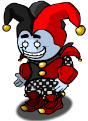

# Jester

- **Facción:** Neutral  · *fase posterior (referencia)*
- **Página de la wiki:** Jester (ToS)

## Ficha

**Clase (alineamiento):**

> Neutral Evil

**Tipo:**

> Non-Unique

**Prioridad de acción:**

> 1 (Highest)

**Resumen:**

> You are a crazed lunatic whose life goal is to be publicly executed.

**Objetivo:**

> Get yourself hanged by any means necessary.

**Habilidades:**

> Trick the Town into voting against you.

**Atributos:**

> |attack: None (Unstoppable after hanging)
> |defense: None

**Atributos (texto):**

> If you are hanged you will attack one of your guilty or abstaining voters the following Night with an Unstoppable attack.

**Si hay Godfather/otro objetivo:**

> Haunt target (if hanged)

**Si no hay orden:**

> Randomizes who is haunted (if hanged)

**Gana con:**

> Town
> Mafia
> Arsonist
> Serial Killer
> Survivor
> Vampire
> Werewolf
> Witch
> Coven
> Plaguebearer
> Pestilence
> Juggernaut

**Debe matar para ganar:**

> Yourself (via hanging|hanging)

**Restricciones:**

> Must be hanged; 1 use

**Resultado Investigator:**

> Classic Results
> Your target could be a Framer, Vampire, or Jester.
> Coven Expansion Results
> Your target could be a Framer, Vampire, Jester, or Hex Master.

**Resultado Consigliere:**

> Your target wants to be hanged. They must be a Jester.

## Texto completo de la wiki

| 

Jester 

(Jest)

Alignment

 Neutral Evil

Avatar

Immunities

None

 Ability Stats

 | Type

 | Priority

 | Restrictions

 | Non-Unique

 | 1 (Highest)

 | Must be hanged; 1 use

Actions

Target other

Haunt target (if hanged)

No action

Randomizes who is haunted (if hanged)

Investigation Results

 Sheriff

You cannot find evidence of wrongdoing. Your target is innocent or great at hiding secrets!

 Investigator

Classic Results

Your target could be a Framer, Vampire, or Jester.

 Coven Expansion Results

Your target could be a Framer, Vampire, Jester, or Hex Master.

 Consigliere

Your target wants to be hanged. They must be a Jester.

Game Information

Summary

You are a crazed lunatic whose life goal is to be publicly executed.

Abilities

Trick the Town into voting against you.

Attributes

If you are hanged you will attack one of your guilty or abstaining voters the following Night with an Unstoppable attack.

Goal

Get yourself hanged by any means necessary.

 Victory Conditions

 | Wins with

 | Must kill

 | Town

 Mafia

 Arsonist

 Serial Killer

 Survivor

 Vampire

 Werewolf

 Witch

 Coven

 Plaguebearer

 Pestilence

 Juggernaut

 | Yourself (via hanging|hanging)

 | 

 | DISCLAIMER: These stories are fanmade, and are not created or endorsed in any way by BlankMediaGames or Digital Bandidos.

A scarring past is how the jester became to be, born in the town of Salem. Once the jester became an adult, the jester was sent away from being conscripted as a soldier to fight in a bloody war. After years in the battlefield, the sight of his fellow soldiers dying, and along with the war experience had left him paranoid. The jester’s paranoia never went away and remained with him for years after when he was sent back to his hometown, Salem. Everyday, the jester experienced his traumatic memories of the battlefield, and twisted envisions that everyone in town is out to kill him. The memories of the traumatic experience and the fear that comes with it, makes it hard for the jester to bear to live, and would rather accept to be killed and be liberated from himself, than to live with his paranoia, making him become a target wanting to be hanged.

Mechanics[]

You win if you are hanging|hanged during the Day, and you can only win by doing so. Upon being hanging|hanged, all players in the game (including the Jester) will see the message "The jester will get his revenge from the grave!".

This means if you are killed during the Night (any way other than by hanging (ToS)|hanging), you automatically lose the game.

If you survive until the end of the game, you lose.

If you leave, you will always lose, even if you completed your win condition.

You can choose to haunt one of your guilty or abstaining voters the Night after being hanging|hanged.

If you do not choose anyone or deselect your target, the game will randomly choose among the guilty and/or abstaining voters. You cannot haunt someone else the next Night.

Your haunt ignores all forms of Defense except Invincible Defense, meaning all Town Protective roles, Jailors, Guardian Angels, and the Potion Master cannot prevent your haunt.

The only role in the game being able to survive your haunt is Pestilence. You will not receive a message stating that Pestilence survived your haunt.

Your haunt is not affected by Transporters. You will always attack your target (if you choose one).

If you leave the game before choosing a target or before the Night ends, no one will be haunted.

The stalemate detector will not end the game on the Day you are hanging|hanged, since you can break any stalemate by your haunt.

Strategy[]

The Jester can be a fun role to play as, trying to deceive the Town to hang you and being able to hurt them in revenge. However, it is still a violation of the rules to abuse the chat by spamming or acting unsportsmanlike to be hanged, and this can result in punishment, such as a ban.

Making various people angry is a common strategy. However, it has to be done carefully in order to make people hang you, whether or not they believe you are a Jester.

Contrary to popular belief, being rude or obnoxious in chat does not help your chances of being hanged. Most of the time, you'll end up either being killed at Night, reported, and/or ignored. What's more, it's possible people will determine you are a Jester based on these actions, and you'll lose.

As a Jester, the greatest threats to you are usually the Jailor and Vigilantes. You want to try to look suspicious such that you'll be voted for and hanged, but if those roles determine you're not a Townie, they can attack and kill you at Night, denying your Victory. The easiest way to minimize this risk is to try and be hanged the same Day you make yourself look suspicious. However, if you can't do that, you'll have to strike a balancing act between setting up later suspicions that will have you hanged, but not looking so suspicious that the Vigilante or Jailor kill you the next Night.

When pursuing strategies that take longer than a single Day, you should have a plan ready in case you are Jailed - an explanation you can give to the Jailor for the way you've been behaving that way will make you look like a Townie, ideally coupled with a fake Last Will. A decent claim is Veteran, as they can also act loud or annoying if they are baiting. It is theoretically possible to confess to being a Jester and try to side with them, but most Jailors will execute Jester claims without hesitation.

Another possibility is to start this strategy on a Day where the Jailor or Vigilante thinks another player is a Jester, or is choosing to kill another player at Night for any reason. This way, you'll probably be safe for that Night, since those killing roles will be occupied.

Stay normal, do not be too contributive or you will end up killed by the Mafia. Do not be too suspicious or you will be shot by a Vigilante or executed by the Jailor.

Especially in Ranked and Ranked Practice, just stay silent like a normal evil and do what you would do and pretend to be a Townie. The Town will at some point eliminate people who are not Townies, including you, which not many players can defend against. Just play along and let them figure out that you are not a Townie, and they will most likely hang you.

In contrast, one of the best things that can happen to you is being Jailed on Night 1 or when the Jailor has no executions left. Pretending to be AFK (away from keyboard), and then claiming in chat that you didn't think you were going to be Jailed on Night 1 will cast a lot of suspicion on yourself.

Timing is tricky for the Jester:

The longer you wait before you begin raising suspicion against you, the more likely you are to be hanged. The Town is generally more desperate near the end and may be more likely to hang people without concrete evidence, especially if the Investigator is dead. There are also fewer people to trick, making it easier to have the necessary votes to be put on trial. If you wait quite a bit, people can also become desperate to all vote guilty so that you can kill one, like if there's 3 immune roles all on a different side.

On the other hand, the longer you wait, the more likely you are to be killed at Night or to have information about you revealed by a Witch, Sheriff, Investigator, or Consigliere/ Potion Master, limiting your options.

Remember that if the game ends while you're still alive, you lose. Therefore, while you want to be hanged as quickly as possible, you also want to avoid doing anything that could bring the game to an end. You should generally avoid voting people up unless you think it will help you be hanged. Additionally, voting up (or voting guilty on) a member of the Mafia will make the Town less likely to suspect you of being a member of the Mafia, making it harder for you to be hanged; even worse, it makes the Mafia more likely to kill you at Night.

If a Witch or Coven Leader find you, they may leave you alone, or try to help you:

If a Witch has also found the Mafia and has communication with them, they may control you to visit a target that the Mafia killed to make you look suspicious if a Lookout spots you.

A Coven Leader can also do the same, but it is easier for them since they have a faction. They can control you into the target of a Potion Master or Poisoner. This applies with Trackers too in the Coven Expansion.

Contrary to the aim of being a Jester, pretending to defend yourself can make you appear as a member of the Mafia or a Serial Killer. If you claim to be a Lookout and the real Lookout calls you out, continue to try and defend your claim, which can make people hang you anyway, under the logic of "If you are really the Lookout, hang the other player tomorrow". It is normally your best bet to defend your claim, but never actually give any evidence and instead just say the Town is dumb for hanging you. This can make the Town angry by defending your claim without providing any actual evidence.

The inverse also works, by claiming a role that a Townie has claimed while on trial. When they are revealed to actually be that role via hanging, the Town will very likely hang you the next Day, out of bitterness. This will almost always work, unless an Investigator identifies you as a Jester during the Night and survives to report it the next Day. However, you also run the risk of being shot by a Vigilante or executed by the Jailor.

If you mess up as a Jester, it can be very difficult to gain your win, as Investigators will likely try to investigate you, and a Jailor or Vigilante may kill you. When you do think you've been investigated, your options vary based on who investigated you; if it was a Sheriff, you need to seem to be a role with Detection Immunity (such as an Arsonist, Witch, Vampire, Godfather, or perhaps a Werewolf if the Sheriff interrogated you on a non- Full Moon Night). If it was an Investigator, you'll need to try and pass as a Framer, Hex Master, or Vampire, unless you can convince the Investigator that you were framed/ hexed and are a Neutral role that will pose a threat to Town.

If you end up on the stand, but aren't sure you'll be hanged, try acting angry or frustrated. A good way to accomplish this is by swearing in chat.

A good claim for jester would be mayor as people would likely want you to reveal yourself to prove it. You can use this strategy during early game and people will suspect you as you can’t prove your claim. As stated above, keep trying to back up your claim without ‘revealing’ yourself. You can have yourself hanged very early for this, but it is good to remember that Town Killings may kill you during the Night instead and hang someone else that is suspicious during the Day.

If you are Framed/ Hexed, use it to your advantage. The Sheriff will see you as suspicious. It doesn't help you if an Investigator investigates you, since you are in the Framer and Hex Master's investigation result anyway.

If you think you are doused, use it to your advantage. The Investigator will see you as a Bodyguard, Godfather, Arsonist, or Crusader, and the Consigliere will see you as an Arsonist. If there is a known Arsonist in your game, claiming Bodyguard could put a good amount of suspicion on you during the Day.

If you are lucky enough to be at the gallows, try to play dumb, but not making it obvious that you're aiming for suicide. Try claiming a role from a dead Townie and give false information. This could help, but could also ruin your chance if you fail.

If you are an Executioner and know that there is a high chance of your target being killed at Night (such as if all the Town Protective roles are dead), try to have somebody to attack you. Hopefully, you will turn into a Jester and the attacker's Death Note will reveal your Basic defense. This could be your key to victory.

Claiming to be an Executioner is a terrible strategy. Executioners get ignored by the town, shot by Vigilantes or executed in Jail. Worst of all, you may get "lucky" and find a real evil, turning you into a "confirmed Townie" - cursed to never get hanged.

Remember that as a Jester, you want to appear to be an evil role trying to appear to be a Townie (but who makes one or two mistakes that could have you hanged). If you constantly act ridiculous, people will conclude that you're a Jester and ignore you, or worse, a Vigilante or Jailor may kill you at Night. Alternatively, nobody would waste their Night visiting you as well as nobody wanting to vote you up, basically leaving you alone.

Many strategies for the Jester depend on claiming a role. However, claiming a suspicious role out of the blue can make you look like a Jester. Evil roles are rarely eager to make a fake claim, since it exposes them to being disproved. Therefore, you need to create a situation where claiming your fake role makes sense. One option is simply to call for a role-call, and hesitate before "revealing" your fake role claim when people ask you to claim first.

An interesting tactic is to claim that you are an evil role, and that you hate it. This works especially well when Death Notes that have been revealed hint at disliking that role, or if a Death Note hints at greatly disliking the player killed, saying something along the lines of, "They deserved to die." which almost always arouses suspicion. In most scenarios, Death Notes are often a bit troll-y, and show a bit of personality. A good tactic is trying to mimic the personality revealed in the Death Note, or use snip-its of the Death Notes, arousing suspicion about why you said the same thing. Similarly, if a Death Note is simply using emoticons (such as :), =), xP, :/), try using whatever repeated emoticon they used as often as possible (without spamming, of course). Such cases where the Death Note accompanies your plan, however, are rare to come by, in addition to the tactic being almost always useless against more experienced players, so don't always rely on it.

In a game with only one Neutral Evil slot, you can claim to have been controlled Night 1. "Controlled" claims tend to be believed by even relatively experienced players. Be aware that, however, if there are no other claims of being controlled as the game continues, experienced players would be more suspicious of you being a Jester.

If an Arsonist is in the game, and you have been questioned, it would be a good idea to claim a role that fits in the Arsonist result, such as a Bodyguard. You will most likely be hanged right off the bat. The same applies for claiming Doctor with a Serial Killer in game.

If you are considering making a play, make sure the Town has no other leads before you try to be hanged. If the Town has other leads, they may focus on someone else and not you. Being the center of attention is important, but don't make it too obvious.

Adding on to this, if you make a move too early in the Day, it increases the chance of people realizing that you're Jester, but if you wait too long, the Town won't have enough time to vote.

There is a risky way to be hanged that could either have you imminently hanged or almost forever disbelieved. You could on Full Moon Nights claim to be Sheriff and that you JUST interrogated someone the Night before (A.K.A. on the non- Full Moon Night) and that they are a Werewolf. Half the time they will say something like "That's not how Sheriff works" and that's how you know you did it, but other times they will call you out as an Executioner. If you're going to do this try doing it Day 2 since it will be even less believable.

If you are Jailed, you should make a plausible-sounding claim (since you don't want to be executed), but one that will put you in trouble after the Jailor dies. Any unique role is good for this tactic, especially Veteran or Mayor.

If you are Jailed after making a play to be hanged - that is, after making yourself appear evil - your situation is trickier. In this case, you have to come up with some sort of explanation for your actions that makes you look like a Townie. If you claimed an implausible but powerful Town role (ie. saying that you were a Jailor yourself), saying that you're actually a Veteran trying to bait people sometimes works.

You should only tell the Jailor that you are a Jester if you know they've lost their executions. You can also do this if you are certain their situation is so desperate, that they'll be willing to try and work with you to trick the Mafia or other enemies of the Town into hanging you.

If the Jailor has lost their executions (or run out of them), and the Town is at risk of losing their majority, it's usually safe to confess to them and offer to work with them; just ask who they want you to haunt and most will be willing to help you have hanged in hopes of salvaging a victory. This strategy is considerably more risky with a Vigilante in the game.

Note that, from a moral standpoint, Neutral Evils should never side with the Town unless they risk to lose the game. The objective of a Neutral Evil is to damage the Town as much as possible, and thus they should not side with the Town unless their win is in jeopardy.

Chat[]

Make a "mistake"[]

Many strategies for the Jester rely on acting like an evil role who makes a mistake of some sort, such as claiming Investigator and listing an exact role (which makes you look like a Consigliere), similarly, you could accuse some one of being a Neutral Killing role and post the Consigliere's result. You can also make up a random result yourself (such as Sheriff, Serial Killer, Survivor) if you truly want to look like a Consigliere.

To pull off this kind of strategy successfully, your "mistake" has to be suitable for your level of play; for example, in Classic Mode, it might make sense to claim a role that doesn't exist (which a very new player might make), whereas in Ranked, it needs to be a mistake that even relatively experienced players might make. If your mistake is too implausible, you'll be spotted as a Jester, whereas if it's too sophisticated, the other players might not notice it.

Use an older version of the game[]

Sometimes Jesters are hanged for saying things like "Thomas Danforth appeared as Mafia to me! I'm Sheriff!" (the Sheriff no longer sees targets as a member of the Mafia, they only now find them as "suspicious")

You could claim to have just received the achievement for finding a member of the Mafia or a Serial Killer as you still receive achievements even though they are shown as suspicious. This could still backfire, especially in Ranked games, as they already expect for you to have the achievement, as it is very easy to achieve.

This applies to claiming doused as well, as only Arsonists can see whether they were doused.

Keep in mind these updates happened a long, long while ago, and most Townies may recognize this strategy and reveal you as a Jester.

“# is dying on Night 1” or “# will die the next Night”[]

A tactic that seems to work sometimes is to claim a specific player is dying on the first Night. Usually, if the Mafia plays their cards well, they will kill the player you shouted out loud and frame you. Note that this usually only works on the first Day of Classic Mode. This rarely works with more experienced players, mostly because the Mafia will be reluctant to go after an obviously named target due to fear of running into Town Protective roles.

You can also try and ask for roles by whispering, and if the player doesn't reveal their role, tell them that they are going to die the next Night. This has a chance to lead the whispered Townie to freak out and call you out. However, this strategy is very risky to use, as you can become a target of the Investigator.

Failed Whisper[]

Another strategy is to make it seem like you're whispering to someone. (in example. "/e (player's name) we'll win, don't worry!") This will look like you are trying to whisper to a member of the Mafia that you've already chatted with the last Night.

This strategy might work in Classic Mode, but most experienced players will NOT fall for this tactic.

If you see someone whispering someone else you can attempt to respond to the first player with "What do you mean?" Only Blackmailers can see others' whispers - this may cause them to assume you are a Blackmailer and push to hang you.

# is immune[]

Claim someone has Basic/Powerful defense and accuse them. People will wonder how you "knew" that they had Basic/Powerful defense and hang you. It would help to claim being a Vigilante when there is no chance of one being alive, or in-game. If it's Day 2, you can say that you shot them last Night (since Vigilantes can't shoot on Night 1). Alternatively, even when a Vigilante is a theoretically plausible claim, you'll often come under suspicion if there was no credible reason for you to shoot your target. This may lead players to the conclusion that you are the Jester, however.

Claim a Neutral Benign role[]

Claim that you are a Survivor or Amnesiac and maintain that claim throughout the game. The earlier you claim it, the better; even if it is as early as Day 1. Without conclusive evidence or any leads, the Town is likely to hang you, especially if you claim Survivor, since you are everyone's ally. This is even more helpful if a Neutral Benign role dies or a real Amnesiac remembers their role. The only flaw in this is aggressive Jailors and Vigilantes, or an Investigator who discovers you are the Jester (you can claim Framed/ Hexed in this case). This tactic only works in non-Classic queues, as Neutral Benign roles are no longer in Classic queues.

Another great strategy, specially in chaos gamemodes, is to claim Guardian Angel right at the beginning of the game, whisper to someone at random pretending to be their Guardian Angel and simply wait. Killing roles won't want to kill you since they gain nothing by killing a Guardian Angel, because they can protect even when dead, and as time passes the Town will grow suspicious of you as real Guardian Angels tend to protect as early as they can to confirm themselves. If the person you whispered dies even better because they will most likely have typed in their will that you claimed to be their Guardian Angel and asked for protection but died anyways.

Act like an evil role's ally[]

If an evil role (especially a member of the Mafia) is discovered, give a flawed explanation as to why the player is innocent. Vote innocent on them if they are put on trial, and if the role is killed, stay quiet. If the evil role does manage to survive, tell them that you are the Jester and that you are on their side. The Town can detect you as a Jester if you act overly suspicious, so use this within reason.

Also, if you act like the Mafia's ally, the Mafia and Neutral Killing roles are more likely to keep you alive, to transfer suspicion from them to you.

Obviously fake Last Will[]

A few Nights in advance, Write a fake " Last Will" that seems like a certain role could have written it. However, make sure the Last Will has loopholes in it. Some examples are:

Writing the Last Will one Night ahead - If it is Day 5, write a Last Will that goes up to Night 6.

Impossible mechanic - Claim you shot someone as a Vigilante on Night 1, give an investigation result that is not possible, (such as Godfather/ Retributionist/ Sheriff)

Suspicious visits - Whenever someone is killed, write in your Last Will you visited the victim that same Night. This works amazingly well if you claim to be a Doctor and write that you "visited" the victims of a Serial Killer.

False information - Give false investigation results about players who are still alive. They will call you out for it.

Only one possibility - In a fake Investigator's Last Will, write down only one role for each player. Make sure the roles are correct. If you are right on all of them, the Town will assume you are a Consigliere.

Claim someone's the [insert evil role]- in a fake Sheriff's Last Will, write down that you found the Werewolf on an odd numbered Night (as they have Detection Immunity then), or simply any role with Detection Immunity, such as a Vampire or Arsonist. This may not work with less experienced Townies. On the contrary, claiming to be a Sheriff but posting an Investigator's Last Will might not work.

 Town Support roles - Claim a role such as a Tavern Keeper or Transporter and write a Last Will accordingly. Since your "targets" receive messages if they were role blocked/ Transported, they will call you out for lying.

Claiming Escort is a more obvious Jester play, because everyone knows that it has been renamed to Tavern Keeper.

Typed Last Will - Write a Last Will that looks like it was hastily typed. Make spelling mistakes and clearly false information.

Poor Excuse - If you don't have a Last Will and someone asks for it, give a poor excuse for not showing it, such as the Last Will being glitched and impossible to open. You may also claim that you are playing on a Mobile device, therefore not being able to copy & paste.

Once you have your Last Will, use another strategy to make yourself suspicious, and hopefully place yourself on trial. Establish your role and copy and paste your Last Will. (to copy said Last Will, highlight said Last Will and hold Ctrl+C. To paste: hold Ctrl+V, or if on a Mac Cmd+C to copy. To paste: hold Cmd+V)

 Mafia having the Majority[]

Being quiet the whole game and saying something on the lines of, "Alright, the Mafia has the majority, let's hang [name]" when the Town has a slight majority or when a Mayor exists can have you hanged.

This can also work if neither side has majority and you suspect there is an unrevealed Mayor. Chances are the Mayor will reveal themselves and hang you.

This also applies to Vampires and Coven.

Unique role[]

A great strategy is claiming a unique role or a role that cannot possibly be alive. Try not to be too obvious by claiming to be a Mayor or sometimes a Jailor, and you will only have to say it once early on. Later, when more roles die, the Town may remember your suspicious claim and hang you. However, claiming a unique role may end up with your death at the hands of an evil or end up causing the Jailor or Vigilante to shoot you if you aren't hanged after the Town sees your mistake. Use this strategy with caution.

Claiming a role such as a Retributionist is a good idea, as it can be hard to fully confirm yourself, and if purposefully mess up your will, you may be hanged. Claiming Veteran is also good, especially if it is not confirmed that there is a Veteran in the game. As said above, however, you must use this strategy carefully.

Claiming a unique role that is definitely in the game (such as claiming Veteran after people have died to a Veteran) can also work well, since it can bait the real one into counter-claiming you and having you hanged.

If you do plan to claim to be the Mayor, you would normally want to be hanged that Day, or killing roles would usually attack you, granting you a loss. Normally, claiming to be a Mayor and asking people to whisper their roles to you is an effective strategy to have yourself hanged, especially if they suspect you are an evil role. They will suspect you, asking for you to "reveal yourself". At this point, you must tread carefully, because if you slip up and be too obvious, they will not hang you.

Accusing a known Town Investigative role[]

Accusing a known Town Investigative role is a quick way to be hanged. Most people will listen to the Investigator's word over yours, and you will be hanged.

Accusing a dead player[]

Accusing a dead player puts suspicion on you, especially if you format yourself to appear like a Consigliere by accusing somebody based off of investigation results alone.

Fake Executioner[]

If you've never played like an Executioner as Jester, then you're in for some fun. Claim things like Sheriff, Investigator, or Lookout and then push on somebody, which can make you seem like an Executioner. Most of the time the player you are targeting will be hanged. Since it's so common for an Executioner to announce their triumph, this may cast suspicion onto you. Saying things such as: "oops" or "def framed guys".

This tactic is very risky, but if you are in a game without a Jailor or Vigilante, then it is quite safe, as you may be hanged the next Day.

# has revealed themselves as the Mayor![]

By typing, "has revealed themselves as the Mayor!" may make people suspect you of being an evil role pretending to be Mayor and hang you. However, this tactic could be seen as a joke or obvious Jester behavior due to the obvious coloring of the letters when the Mayor reveals. As such, this tactic should be only be used in special situations where the players are inexperienced, but not inexperienced enough to fall for this, or if another Jester is dead. This should only be attempted if you are sure you can run away with it, otherwise it will confirm you as a Jester without a doubt, and you could be seeing a Jailor's execution or a Vigilante's bullet soon. Also, the real Mayor may still use this strategy to act like a Jester, so this strategy may not let you be hanged at all.

Keep whispering[]

Constant whispering tends to attract attention; whispering with someone and then being evasive about what you were saying can sometimes have you hanged. Try to constantly whisper with one player, further increasing suspicions. Be careful, however, as you may be accidentally whispering to a killing role who wants to go unnoticed.

However, this carries a risk of being killed by the Mafia, who may assume you're an Investigator or Spy talking to someone you've confirmed as a Townie.

Acting inexperienced[]

If you act inexperienced, you can ask for help on some aspect of the game that makes you appear to be an evil role. For instance:

You can ask what the "bloody note" is, which is by your Last Will, and claim you've never seen it before.

Similarly, you can act confused about your role and ask how to play it, implying that you are an evil role.

Or you can ask about the people who talk at Night, implying you're a member of the Mafia confused by seeing the Mafia chat.

Claiming Doctor or Bodyguard without anyone asking you may make you appear to be an inexperienced Serial Killer, Godfather, or Arsonist.

You can also say "I think I killed #, is that what clicking on the buttons next to their name does?"

You can pretend to not know how to whisper. However, this will only work if you be obnoxious about it, otherwise people will assume you are inexperienced.

While using this strategy, don't whisper unless told how to do so. Some people will notice that and accuse you of not being new. Most beginners don't know how to whisper.

Note that these strategies are only likely to work in Classic Mode. For example, playing this strategy in Ranked will almost certainly result in you being called out as Jester.

In the Coven Expansion, a good strategy is to claim Psychic, but switch the order of visions (have a Good Vision on Night 1).

I was Doused[]

If there is an Arsonist in the game it might be wise to say you were doused. Since no one knows if they are doused except for the Arsonist themselves, your claim is impossible and may have you hanged for poor Arsonist play. You could easily be called out as a bad Jester, though, as an update that removed players being able to see if they are doused and this might make you appear as if you are trying to trick newer players to veterans.

Staying silent, misspelling "I am blackmailed."[]

During the Day, don't say anything. Then, once somebody inevitably votes you up to the stands, type out the blackmailed message, but with a slight misspelling. For example, "I am Blackmailed/I am blackmailed,/I got bm'd/vI am blackmailed (the v is there as if it is copy pasting), or saying it more than once. Make sure to type it without the period. Once somebody sees the error, you will almost definitely be hanged as a member of the Mafia trying to fake your way out of punishment. Works best if someone else seems like they are blackmailed, since it will make the Town more suspicious.

Saying suspicious messages[]

If the Town is in a very bad state, you can offer to start "random hanging". This can bring heavy suspicion on you, and the remaining Town will want to have you hanged. The Mafia will also know that you're not in the Mafia and think you're a Neutral role against them desperately attempting to prevent them from gaining majority, and they will vote guilty.

Claiming you were attacked[]

Evil roles with Basic defense usually give some explaining on as to how they survived an attack. Therefore, on a Night evil roles failed to kill, you could claim you were attacked but survived. Most likely, the Town will ask how you survived, allowing you to claim that you vested as a Bodyguard or Survivor, or you could claim you self healed as a Doctor. If you play it poorly, you might be hanged. The downside is a Spy can easily disprove the Mafia attacked you, or if no Neutral Killing exist or are alive, and you may be avoided instead.

Be annoying[]

Another Jester strategy is to be annoying. However, do not spam the chat or be mean to people, as this will usually result in you being ignored, reported, or killed at Night.

Claiming to be new, by asking, "WHAT DOES THE BLOODY/RED/OTHER NOTE DO?" each Day in chat, "OH GOD, I THINK I KILLED #, IS THAT WHAT CLICKING ON THE BUTTON BESIDE THEIR NAME DOES?" or other messages of the sort can/will eventually wear down the Town to the point where they'll hang you, however this can have its downsides with the Town ignoring you or a Vigilante or Jailor killing you before you are hanged. Smart Neutral Killing roles will see that you're a Jester or someone new, and thus a waste of a Night.

Note that an all-caps message will be blocked if you post it right after another one, so make sure to alternate with all-caps and partially-caps.

If you really want to annoy people, bring up controversial topics like sports or movies. However, like other Jester strategies this could simply result in you being killed at Night.

 Vigilante Day 2[]

Pretending that you shot somebody that was immune on Night 1 makes you look like a killing role that found an enemy role. Whoever you 'target' as the player you shot will be the first to cast suspicion. There is still more of a chance than not that you will be called out as a Jester.

This strategy will work better if there's no Mafia kill on Night 1.

Role blocked[]

If no one dies on any given Day, you can claim role blocked. While many people will suspect you as Jester, you will still likely be hanged.

Voting against the Town[]

If someone is pushed up on the stand, and is guaranteed to be voted guilty or innocent, voting against the Town will cast suspicion on you. They will question why you voted guilty on a Townie that is innocent, or why you voted innocent on an evil role that is guilty. Though some people may pick up that you are Jester, you are likely to be hanged either the same Day or the next.

Claim to be a Killing Role[]

On the first Day (as in the pregame Day), simply claim you're an evil killing role, and you will prove it in your Death Note on the first Night. Chances are, either the Mafia and/or the Serial Killer will likely put something in their Death Note to evade suspicion. Keep in mind, this can backfire in a few capacities:

No one puts anything in their Death Note or they attack a role with Night-immunity.

You end up Jailed on the first Night, and some Death Note clearly indicates you.

The Town may just correctly believe you're a Jester and ignore you, leaving you open to be killed by any killing role, as Jailor and Vigilante can both kill you with no repercussions, and no reasonable Townie would try such a stunt.

Actually playing as Jester[]

Many rookie players would expect that a Town would obviously ignore a Jester. In reality, claiming Jester especially late game is a very useful way to get yourself hanged. As experienced players would expect that anybody claiming Jester is suspicious due to reverse psychology, regardless if they are an actual Jester or not. Although risky and contradictory, this will get you more likely to be hanged in a game with Neutral Killing or/and without Vigilante or Jailor.

Behavior[]

Staying silent[]

Try staying completely silent. When asked to speak or tell your role, say nothing and eventually you will be accused of being suspicious. The downside to doing this is you will not be suspected too much in the beginning. Occasionally, the entire Town will not even realize that you're there, and you'll live. Another downside to this is that killing roles may suspect you of being a high priority target such as the Jailor, who would rather not draw attention to themselves. This can possibly have you killed at Night. If put on trial, staying silent is almost a guarantee to be hanged, giving you the win.

If you are Jailed, create a convincing Last Will and post it only when you are Jailed, but never post your fake Last Will on trial.

If you didn't have a Last Will, claiming unique roles (specifically Town Support because it's more convincing than Veteran) such as Mayor or Retributionist, but don't claim Retributionist in a Janitor game since the Jailor can execute you.

Telling everyone to whisper you their roles[]

During the beginning of the Day if the Town has a slight majority, yelling out to everyone to tell you their roles can have you hanged, especially if there is a Mayor or other confirmed Town role.

Random hang[]

Try and start a random hang, then simply act either annoying or suspicious enough to have the random hang be yourself. When you have to say your defense, then simply either be silent and reply to the chat when they ask or become suspicious that you are a Jester. Feel free to reveal during the Last Words phase. If you fail to do so for one Day, then simply ask the Jailor or Doctor to heal/ Jail you because what you said might have you killed, and that can scare off killing roles even if you aren't healed/ Jailed. Then keep trying to do so until you are. If you are voted by some people but time runs out, then chances are that you will either be killed at Night or voted tomorrow.

Be careful as the Jailor may decide to execute you because of your suspicious nature.

Voting innocent on a known target[]

Vote innocent when hanging a known evil target. This will make you seem suspicious, especially if the target was in the Mafia, etc.

When the Town hangs a known member of the Mafia, vote innocent so then you'll be suspected of being Mafia as well. However, this can attract unwanted Town Investigatives your way if you were the only one who voted innocent. This can also attract Vigilantes that are trigger-happy.

This strategy normally leads the Town to believe you are Jester. Be careful with how often you do that and claim to have done something along the lines of, "Sorry I, misclicked" when you are accused of being a Jester. This may encourage the Town into hanging you.

Voting guilty/Abstaining on a confirmed Town role[]

If there is a confirmed Town role, such as Investigator or Jailor, you can try to have them hanged by voting them, and voting guilty. If you aren't killed at Night, then you can, and might be hanged due to the suspicion. However, it is very risky, since you have a high chance of being killed at Night.

This works even better if a Mayor reveals on trial and you vote guilty.

Sometimes, abstaining on somebody that seems clearly innocent can also have you hanged, since you are expected to vote innocent as well.

Team up[]

Team up with one side and vote with them in exchange for being hanged later, and then killing one of their enemies at Night. Most people will be willing to team with you for the extra vote, however, the Jailor is likely to execute you. Allow people to become slightly suspicious of you, then say something along the lines of: "Guys please don't hang I am Townie but I cannot tell you specifically what role I am." They will either become more suspicious and hang you, or think you're a Jester, in which case, your plan has failed.

Generally, it is better to side with the Mafia/ Neutrals than Town because siding with the Town may make you a kill target for the Mafia/ Neutrals. However, leave the hanging to the Townies, as you have a better chance to be hanged by them, than the Mafia, and the Serial Killer, as you will most likely survive the game with them, without gaining the win for yourself.

Another risky yet rewarding tactic is to whisper to a random player on Day 2 that you are a Jester, and that if they help hang you, you'll haunt someone of their choice. Offer yourself as a weapon! Generally despite the player's role, they will be more than willing to help you to their own advantage. This can be a very clever tactic because if you managed to ask help from a Mafia member or Neutral Killing role, they probably won't kill you. There are a few downfalls to this strategy, though; They may have trouble convincing people to vote you up or they might just expose you.

It might be smarter to work with the Jailor if you are Jailed. Especially if the Jailor has executed a Town member and ran out of executions, you can offer him a deal by telling the truth, and having the Jailor either to write it in their Last Will or announce it that you didn't claim a role. Most Townies will hang you, but it will make you suspicious if the Jailor has executions left, as it will make them wonder why you weren't executed.

It is usually to your advantage to signal to the Mafia that you are a Jester. This means that they're unlikely to vote guilty on you; but it also means they're likely to help you be voted up, and more importantly, it makes them less likely to kill you at Night.

One easy way to make the Mafia suspect that you're a Jester is to claim you were attacked on a Night when the Mafia missed their kill; the real Mafia will know they didn't attack you.

Another option is to claim Sheriff and accuse someone you're reasonably certain isn't Mafia, which should immediately out you as a fake (and therefore a likely Jester or Executioner) to the actual Mafia. Be warned that inattentive Mafia may fail to notice you're an obvious fake and kill you anyway.

Strategy for other roles[]

Strategy for other players: If you want the Jester to kill someone else, vote to put the Jester on trial, vote guilty (or innocent), encourage others to vote, and then change your vote to innocent at the last second. A Jester can't kill innocent voters.

As Mafia or a Neutral Killing role, allying with the Jester can be extremely valuable late game. Whispering things to them like "I will get you hanged" or "I will try to help you be hanged" will cause the Jester to want to ally and vote with the Mafia. This is especially useful if the Jester is already revealed to the Town and has no hope of winning unless allying with the Mafia. Even if you end up not having them hanged, they will often appreciate the effort and vote with you anyway, so allying with a Jester isn't the worse idea for any Neutral or Mafia roles.

Don't rely on them not targeting you after death however. So do not vote guilty in the hopes that the Jester will appreciate your help and not haunt you. First of all, the Jesters don't care much about which side wins, so they may haunt you anyway, despite the role you played in having them hanged, or you might know them as a friend and they do the joy of having you killed. Secondly, the Jesters will be in contact with dead Townies and Mediums who will probably ask them to haunt you if your role has been revealed. They tend to listen to other dead people when deciding who to haunt.

 Executioner turned Jester: Claim that a player of an unknown role is Night-immune. When asked for role or evidence, give a brash, salty, or vague response that matches the grammar and style of the Serial Killer's previous Death Notes (if any). Bonus points if the Death Notes have even the slightest relation to your in-game name and you choose your answers based on that. Adamantly deny or affirm your guilt based on how gullible/desperate you believe the other players to be. This will cast great suspicion on you if you had been attacked before becoming a Jester and someone makes a claim that you are Night-immune, whether in the chat, Last Will, or Death Note. You could whisper if you can correctly guess the contents of a highly-suspicious one. This has a good chance of hanging you.

If you are debating whether the player on trial is a Jester or not, your best course of action is to vote innocent. Abstainers and those who vote guilty are the only ones at risk after a Jester is hanged. Generally, important Townies are ones who are usually told to vote innocent.

Specific roles to claim[]

 Jester[]

Outright claiming to be a Jester may fool the Town into thinking you're a killing role trying to avoid being hanged. However, this rarely works and will probably have you killed at Night, or left alone, especially with experienced Townies.

A more sophisticated option is to avoid claiming Jester outright, but to imply it by playing a Jester "badly"; if you pretend to be an obvious Jester by using really, really basic ploys that few people would fall for, the Town will sometimes conclude that you're an evil role pretending to be a Jester to avoid being hanged and hang you.

Claiming a unique role that has already died or has been confirmed can set you in a prime position.

Note that any strategy where you appear to be a Jester carries a very high risk of being shot by a Vigilante or executed by a Jailor, since killing possible Jesters is normally considered part of their job. Therefore, this works best when you've confirmed that no Town Killing roles remain.

 Lookout[]

After a Werewolf attack, you can claim Lookout and say that you saw someone visit the victim, accusing them of being the Werewolf. Normally, any actual Lookout who saw a Werewolf attack would be killed by the Werewolf themselves, so this can have you hanged if anyone recognizes the contradiction.

Another way to look suspicious with a Lookout claim is to claim Lookout and accuse someone of attacking a target who was cleaned, attacking someone who just said they were healed, or being the attacker in an attack that was obviously Transported. Smart players will ask why you didn't see the second visitor and conclude that you're evil or an Executioner.

Claiming Lookout is even better if an important Townie reveals early on.

 Tracker[]

You can apply similar strategies from the Lookout.

 Mayor[]

If Jailed, claim Mayor. Then explain you don't want to reveal (afraid of Mafia majority or some other reason). If the Jailor doesn't execute you, at Day claim a different role with 'information' against someone (preferably not the Jailor). Then, the Jailor or the Jailor's Last Will will convince people you may not be what you claim. On the stand, re-claim to be a Mayor but use the "[Name]: has revealed themselves as Mayor!" trick. This will assure your hanging.

 Spy[]

With the Spy's bugging ability, claim someone is immune using the "Someone attacked your target but their defense was too strong!" message. You could also claim they were transported or role blocked when they weren't whilst on trial.

The Town often requests that the Spy reveal themselves early. Late Spy claims are often hanged.

In a game with a Spy claim, having a will that conflicts with theirs will often lead to a hang.

There are some players in the game who make stupid mistakes. Faking a mistake could help you get hanged if Town observant. Claiming Spy with a Sheriff Last Will is a newbie mistake, but it could also be your path to victory.

 Retributionist[]

You can try to claim Retributionist, and set up a Last Will where you 'accidentally' resurrect the same player twice. This casts suspicion on you since Retributionist can only use a single body once.

If a Vigilante has died, you could try stating that you'll use the Vigilante to shoot someone likely evil, and once the next morning dawns and they see the evil still alive, you'll likely become very suspicious.

You can also claim when the Retributionist is dead, although this will most likely end up having you executed by the Jailor or shot by a Vigilante. It's much better to counterclaim the Retributionist and convince the Town to hang one of you.

You could try claiming Retributionist and state that you'll revive someone, pretending to be someone unaware ( Retributionist no longer brings someone back to life). This does have a risk of being shot by a Vigilante or executed by a Jailor, however.

 Survivor[]

One strategy is to claim Survivor on or after Day 3. However, if the Town has no other leads, claiming on Day 1 or 2 might still cause them to hang you immediately, knowing that you're not Town and suspecting that you might be an evil role using Survivor to explain away your Basic defense, or just saying Survivor because you are everyone's ally, and should not be killed by almost anyone.

Alternatively, you can claim Survivor at any point by saying that you used your vest to block an attack; it is common for evil roles to do this after facing an attack, knowing they'll be called out in a Death Note anyway.

If you're lucky enough to face any sort of accusations, claiming Survivor on the stand is also often a very easy way to be hanged; the Town will almost always hang people who claim to be a Survivor under pressure, since losing a Survivor doesn't really hurt them.

The downside to claiming to be a Survivor is that it very frequently attracts attention from Vigilantes and Jailors, who will know you're unlikely to be a Townie.

Of course, if someone counter-claims you, you will be put under huge suspicion.

If an Amnesiac remembers an evil role, the Town will remember your claim and instantly hang you!

 Doctor[]

Claiming Doctor is an effective way of putting yourself under suspicion of being the Serial Killer, especially if you claim, on any Day where the Mafia failed to kill, that you were attacked and healed yourself; this will make it seem like you're trying to explain away your Basic/Powerful defense.

Claiming Doctor is even better when the Jailor claims Day 1 and there is a Lookout in the game. However, this may backfire as Mafia will kill you as soon as you claim.

 Investigator[]

A Consigliere will often pretend to be an Investigator; and a common mistake Consiglieres make when doing this is to list exact roles when accusing people (since Investigators see mixed results instead). Therefore, you can appear to be a Consigliere by claiming Investigator and naming people's exact roles.

A different strategy, and one of pure luck, falsely give a role at Daytime. People may suspect you of an Executioner and hang you on the spot. However, if a Townie died the previous Night, they can suspect you of an Executioner turned Jester and keep you away from a hang.

The Investigator results have been changed several times in the game's existence, and if it happens again you can use the old results right after it is changed. (e.g: claiming Investigator and accusing someone of having a before-1.5.0 Investigator result, such as Mayor/ Godfather/ Vampire Hunter.) The more time that passes after the results are changed, the less believable this is.

Make up some investigative results! The more far fetched the better! Like, say Serial Killer/ Werewolf/ Arsonist, or Consigliere/ Witch/ Survivor. People will surely see through your flawed claim. Be warned they may realize you could be a Jester since the claims are obviously incorrect.

The Investigator list was changed again with the release of the Coven Expansion; in addition to letting you appear to make a mistake by using before- Coven investigative results, this makes an impossible result a far more plausible mistake, since the Investigator results in Coven are longer and more complicated.

If there is a confirmed Spy around who releases results every Day that includes two or more Mafia visits, claim Investigator with your results shown as to the first visits for the Mafia, not ever the last shown result (the last one is the Mafia Killing). This can make smarter Townies think you are a Consigliere, as the results directly match. You could also do it will the results of whoever the Mafia have killed each Night.

 Bodyguard[]

A Bodyguard has a very dangerous investigative result of Bodyguard/ Godfather/ Arsonist; additionally, they are hard to prove. Therefore, a Town hunting either of those two evil roles will likely put unexpected Bodyguard claims on the stand.

If pressed for a Last Will, you can refuse to give one, or you can give one with clear errors in it, such as saying that you protected someone the Night they died, or constantly failing to protect the Mayor or confirmed Townies. Claiming Bodyguard after a revealed Mayor or Jailor died is also extremely suspicious since the Town will wonder why you weren't protecting them.

You can attract additional attention as a Bodyguard by claiming you were attacked and saying you used your bulletproof vest; since Bodyguard only have one bulletproof vest, it's very unlikely for them to block an attack with it, and since both the evil roles in their investigative results are immune, they frequently claim to have used a bulletproof vest in this fashion. This works best on any Night when the Mafia or Serial Killer fails to kill anyone, though experienced members of the Mafia will know they didn't attack you and may assume that you're a Jester.

Claiming Bodyguard is even better when the Jailor claims Day 1. However, this may backfire as Mafia will kill you as soon as you claim.

 Vigilante[]

Claiming Vigilante and saying you attacked someone only to find them with Defense will often draw suspicion, since Mafia Killing roles, Serial Killers, and Vampires often claim to be a Vigilante when they need to immediately out someone as immune. Claiming it after the Mafia or Serial Killer haven't made a kill is particularly suspicious. Implying that you are a Vampire by accusing someone of being "immune" like this has the added advantage that the Vampire is part of your investigative results.

Claiming to be a Vigilante on the second Day and saying that a certain player is immune is also a possible plan. Most players usually catch on that Vigilantes cannot shoot on the first Night, and called you out on this. Of course, some smart players may recognize this as a tactic a Jester would use.

 Sheriff[]

This strategy is pretty much based around luck, but it can work sometimes. During the Day, claim you are a Sheriff and that your "target" came up as suspicious. This can surprisingly provoke others' suspicions of you being an Executioner, thus you may be hanged, especially if it's early game. However, if the Townie you accused dies the Night before, you can be suspected of being an Executioner turned into a Jester and may not be hanged. Plus, if you end up actually accusing a member of the Mafia or a Neutral Killing, you may be written off as an actual Sheriff and won't be hanged and rather killed at Night instead.

In Ranked, Sheriff claims are often given a lot of suspicion, since it's an easy Last Will to fake. This makes it an easy way attract attention, especially if multiple Town Investigatives are dead.

 Executioner[]

A good strategy is to act like an Executioner, especially a bad one; claim to be a Sheriff, Investigator, or Lookout Day 2 and say that a random player is suspicious. Ideally, everyone will think you're an Executioner and hang you.

However, the Jailor may end up Jailing and executing you, or a Vigilante will shoot you.

If they don't, and your target turns out to be Town, the Town will hopefully hang you for revenge or suspicion of lying and setting the entire Executioner setup from the start, though most Townies will not care about you later on.

You can also claim Executioner outright after having a Townie hanged; this is a frequent strategy for killers with Defense, so it has a good chance of having you hanged by more experienced Townies.

Alternatively, you can whisper to a Townie on Day 3 or 4, "I'm Executioner, help me hang (confirmed Townie) and I'll vote with the Mafia." Since they are Town, they will freak out and tell people you are Executioner, which will probably have you hanged.

Note that any strategy where you pretend to be an Executioner has a serious drawback: If you are not hanged that Day, there's a huge risk that the Mafia or Serial Killer will kill your "target". If they actually are Town, then everyone will assume you became a Jester, making it almost impossible to be hanged.

Additionally, the Town may ignore you if they think that you're a successful (or unsuccessful) Executioner. To avoid this, stay active in the game; talk a lot, whisper, vote frequently, etc. You want to appear to be an evil role using the Executioner claim as a shield.

You can also claim to be an Executioner with an impossible target. Executioners can only target Town (or, in some situations, a Vampire), and can never target a Mayor or Jailor; therefore, claiming Executioner and saying your target was a dead non- Town or the Mayor or Jailor can have you hanged under the assumption that you're a member of the Mafia or a Neutral Killing role pretending to be an Executioner.

Additionally, if you claim Executioner if you are put on trial. This will cause many people to just hang you to kill you off.

Another good strategy is to wait a while before conjuring your fake claim. This is so that you can see who are important Townies, and reduce the risk of accusing the Jailor (who'll instantly Jail and execute you) or the Vigilante (who'll just shoot you); However, that risk is most possible if you try this on Day 2, so it is recommended you do this on Day 3-4.

 Medium[]

A Medium claim is a hard role to prove, and it can therefore work in your favor if the Town is desperate for a hang. If there are cleaned targets in the game, and claim yourself as a Medium, giving a little bit of evidence against so-and-so, people will suspect you of being a Janitor working with a Framer, Executioner, Jester, or Consigliere.

In All Any, claiming Medium on trial after being quiet for long enough will make you seem more like an Arsonist than anything else. This will likely get you hanged since the Town only has a few seconds to judge your suspicious claim.

 Amnesiac[]

Claiming to be an Amnesiac means that you'll likely be hanged if an actual Amnesiac later remembers an evil role.

Claiming Amnesiac is usually going to make you very little of a target for evils since you don't get any abilities until the Day after and you also won't turn into the new role which would make killing you rude.

Additionally, if you claim Amnesiac, the Town will often demand that you remember a Town role the next Night. Failing to do so may have you hanged. However, this could have you killed by an evil role trying to eliminate Town.

 Amnesiac is, however, generally a bad role to claim on the stand, since the Town will usually give you at least one Night to remember a Town role (and you may die that Night or the Town may be distracted by another lead).

 Vampire Hunter[]

If there is a confirmed Vampire Hunter, you should claim that also. To prove your claim, the real Vampire Hunter might ask you whether you turned into a Vigilante. Answering this incorrectly or saying "yes, wait I mean no" could have you hanged.

Also claiming that you are a Vampire Hunter from the start of the game is a viable option too:

Claiming Town Protectives and Lookouts on you Night 1 gets anyone who would attack you less likely to do so, specially Vampires.

Whether if there are or not Vampires it's irrelevant, just adapt your tactics according to what you think. For example, if there are no Vampires just insist that there are, and with time you will get eventually hanged for not telling the truth. If there are things get more interesting: keep doing like you are checking people, and if you post in your Last Will that you visited someone who is a Vampire, they will know that you are fake and will try to get rid of you or can try to play along you. But if anyone you said you checked was really not a Vampire, with time the Vampires will believe that you are indeed a Vampire Hunter, and will vote you out when they get majority (try to vote Mafia members and Neutral Killings out make sure they do).

Beware of Investigators, they can get you hanged, but can also find out that you are a Jester. Consiglieres, in the other hand, can get you hanged with no risks of being killed by the Mafia (they should contact you by whispering you).

 Transporter[]

Another strategy to win as a Jester is to claim Transporter. The Town will then want you to prove it, or ask people if they were Transported previously. Should no one claim Transported, your claim will automatically be put under suspicion, and may have you hanged.

 Witch[]

If you live near the end, and especially if the Town believed your claim, tell the evil factions like the Mafia or Neutral Killings that you're Witch and not to hang you. If you're (intentionally) not convincing enough, they will think you are a Townie, and you will be hanged.

 Psychic[]

You can claim to be a Psychic and mess up your results by either putting in a name twice or putting in a player that has died. Many evil roles tend to fake Psychic as it is easy to claim. If your Last Will has mistakes in it, the Town will be more likely to think you are an evil role trying to claim Psychic.

 Veteran[]

As a unique role, a known Veteran will get most counter-claimers of that role killed; claiming it can therefore rapidly get you hanged. While unique claims by evils are rare in general, Veteran is one of the more common ones, since it's a good alternative for a Mafioso who is worried about Investigators but who doesn't want the obvious choice of Vigilante.

More importantly, claiming Veteran will discourage people from visiting you at Night, reducing the likelihood that you'll get killed or investigated and increasing the chance that you'll live long enough to get hanged.

 Veteran is a particularly good claim if you think the Mafia is near a majority, since it means they'll be more likely to hang you rather than killing you at Night.

Exploiting scumreading[]

Scumreading is a common set of techniques or senses used to determine whether someone is evil or good. Purposely go along with the characteristics of an evil people had in mind could probably frame yourself to be hanged on spot. This strategy may work better at higher level play, as these are common loopholes in scum's behavior and often noticeable by experienced player, but can sometimes be unnoticed by newer players. 

Taunt Town and make some meaningless speech when being put up on stand. For example: "Gosh! I don't understand! This is so random. Y'all gonna lose. Don't you realize that we're losing majority? Town is a mess. Hanging is a total salvation from this chaos. Bye.". People may find the speaker guilty as true Town may voice every clue they find or know constructively instead of doing manipulative speech.

Admit a role, but not showing Last Will. For example: "I'm Sheriff, and I found someone suspicious. But I'm afraid my target could be framed, so I decide to keep it for myself.". Last Wills are the most recognizable proof to innocence, and Town is less likely to keep information to themselves regardless of how truthful or how useful it is.

Say something that looks helpful but lack of actual content, such as: "Who should we get next?". You may need to do this a few times to be noticed.

Vote slowly, as most of the evil hesitate to push their member to the gallows.

Giving expressions like "Why me?", "(Particular role) needs to keep a will for what?", "Proof?", instead of showing your role and Last Will when you're accused, will most probably get yourself an immediate hang.

Try hard to fail a hang by constantly defend the others without revealing your role, and refuse to push them up. Act of defense can be anything, for example, Mary Warren accused James Russell, people are piling vote on John but you push vote on Mary to spread out the focus. Constant interruption can raise the sense of necessary to eliminate the doer.

Refuse to claim a role for excuse "I'll be attacked if I tell you my role". There's no reason for a Townie not to say their role, for, if there are more role to be known, Town coordinates better.

Delay response to answering question about your role, feinting a scenario where you're buying time to make up a fake identity.

Announce to be abstained or not to push vote. As VFR (Vote For Roles) is generally helpful for Town, not pushing vote means they could be evil. For those who abstain almost every single time, could be the one who wishes for a possible mishang.

Do not announce being role blocked or Transported. As transportation could mess up investigation process, Town would most probably announce it.

Defend oneself with "findings" in form of words instead in the format of Last Will, like: "I checked (player x) last Night, he is guilty! Get him too! While I found (player y) to be innocent the Night before. I also checked (player z) N1, he's clean". This is a cover-up for evil who doesn't have Last Will updated.

Write Last Will in a very short and unorganized manner, like using numbers instead of name or some spelling mistakes to imply that the Last Will is done hasty and spontaneously.

Other claim-based Strategies[]

Last killer role[]

Near the end of the game, if there is only one evil role left, confess that you are tired of the game running this long and that you are the last killer role. Speak convincingly and back up your claim, but do not be too desperate, lest a smart player catches on and convinces the Town otherwise.

If there are three players left (You, and two other killing roles or roles like Transporter or Doctor; Ex: You, Godfather and Arsonist) claim that you are Godfather and it's a tie breaker for the non- Arsonist or Godfather role. The Godfather will assume that you are Jester and go with your bluff, hoping that you will haunt the Arsonist.

Appearing as a Hex Master[]

In the Coven Expansion, if a confirmed Hex Master is in game, and they have the Necronomicon, try luring in Investigators and Sheriffs to check you. Since you appear in the same investigative results as the Hex Master, and appear innocent to the Sheriff (like a Hex Master with the Necronomicon), they might assume you are the Hex Master and hang you.

This works even better if a Tracker tracks you, since with the Necronomicon, Hex Master visits become Astral.

However, if you are Hexed, this will not work due to appearing suspicious to the Sheriff and will assume you are Hexed.

Impossible Claims[]

Claiming a role that can't possibly exist in the game can have you hanged. Some possibilities include:

A unique role that already exists or which is taken by someone else. Avoid claiming Jailor in this way unless you're certain there's no Jailor in the game or they've executed a Townie since otherwise, the real Jailor will very likely kill you.

A role who doesn't have a spot in the current game's role list at all.

A role whose possible spots in the role list are already taken by dead or confirmed people.

Note that outright making an impossible claim is less likely to work in more experienced games, since it's such a transparently false claim that you might be immediately suspected of being a Jester; this works best when you can make it seem like you're claiming under pressure or if you can arrange for your claim to be shown as impossible after you make it.

If any one player can identify that you're a fake (for instance, if you claim Doctor when there's only one living Town Protective), you can rely on them to call you out; you'll also likely be hanged if and when they die. This is also why claiming a unique role is often effective.

 Neutral Evil or Neutral Killing role[]

A trick some Neutral Evils or Neutral Killings use is to whisper to a random player, reveal their role, and hope that they are Mafia. If there is a Witch in the game, and seeing as Witches usually side with Mafia, this may just work. However, if you whisper to someone who is in touch with the Jailor, or are in the midst of Mayor games, or are not hanged the Day you whisper, you may be executed by the Jailor.

Multiple roles[]

Whilst this strategy is not very effective against experienced players, there is a chance you can be hanged by claiming multiple roles.

If you ever end up claiming a role, either from being asked it, revealing with information, or a request to be Jailed, protected, or healed, the next Day claim something else. People will likely realize you have claimed to be several different roles and hang you for it.

However, this is a risky move, as most people will guess that you are a Jester by the fact that you're claiming multiple roles. This strategy is most likely to work in Classic Mode, although it may not even work there.

Another strategy that can be used in conjunction with this one for maximum effectiveness is to claim something easy to prove like Sheriff and then claim another Town essential role if you are counter-claimed, such as Doctor. You can say that you claimed Sheriff to avoid being killed but are actually Doctor. While you may actually convince some people, most people will not buy that and hang you.

Literal joking[]

A good strategy is on Day 1 to say something like "N1: Tommy-SUS!". Obviously, since the game has just started, the suspicion will be pinned towards you. Note that this is not recommended for Classic Mode since new players tend to go for anyone who speaks Day 1. However, experienced players will see right through the bluff and attack you.

Achievements[]

 | Name

 | Description

 | Merit Points

 | Joker

 | Win your first game as a Jester

 | 20

 | Trickster

 | Win 5 games as a Jester

 | 20

 | Suicidal

 | Win 10 games as a Jester

 | 40

 | Lunatic

 | Win 25 games as a Jester

 | 100

 | Arsonist's Evil Spirit

 | Haunt an Arsonist

 | 20

 | Godfather's Phantom

 | Haunt the Godfather

 | 20

 | Serial Killer's Specter

 | Haunt a Serial Killer

 | 20

Messages[]

 | 

 | You have successfully gotten yourself hanged!

 | Displays to the Jester only after getting hanged at the end of the day.

 | The jester will get his revenge from the grave!

 | Displays for everyone when a Jester dies from hanging.

 | You were haunted by the Jester. You died of fright!

 | Displays at the end of the Night to a chosen living player when a Jester haunts them.

 | You did not select a target so one was chosen at random.

 | Displays at the end of the Night for a hanged Jester when they don't select a target to haunt.

 | [They] were haunted by a Jester. or [They] were also haunted by a Jester.

 | Cause of death for a player who voted Guilty or Abstained on a hanged Jester the previous Day, and got haunted by the Jester that Night.

Trivia[]

Jester avatar using the Burned at the Stake death animation.

Prior to Version 1.3.1, a Jester's haunting would not kill anyone if they chose no one to haunt.

Prior to Version 2.0, a Jester haunt was able to be Transported to someone else if they chose someone to haunt that voted guilty.

Prior to Version 2.3.0, the Jester was only able to haunt guilty voters.

The game will choose a random player to haunt if nobody is chosen.

This does not happen if the Jester leaves during the Night or earlier. BEWARE: if you leave after you get hanged, you do not win!

Unlike any other avatars, pairing the Jester avatar with the Burned at the Stake death animation will grant a unique death animation, which shows the Jester forming an evil grin.

The Jester avatar's appearance is likely based on the character Shaco from League of Legends.

According to a poll made by LevinSnakesRise, the Jester, with 207 votes, is the third most loved role in Town of Salem, the main reasoning being the love of causing utter chaos and fake accusing players, stirring up even more trouble.

Funnily enough, the Jester also came as the fourth most hated role in Town of Salem with 145 votes. The reason for that is because Jester was deemed as being too hard to win.

History[]

3.3.0

The Custom Lobby role summary for Jester has been updated to indicate abstaining voters are also susceptible to being haunted.

3.2.4

Server no longer attempts to send successful hanging message to a Jester that has left the game.

2.5.5.12200

The Jester's role icon has been changed. Old one was .

Added Jester's circled role icon ().

2.3.8910

 Jester can now haunt abstaining voters.

2.0.0.6501

 Jester haunt can no longer be Transported by a Transporter.

1.3.1

 Jester can no longer not haunt if they do not select a target.

Town of Salem Release

Introduced.

 | 

 | 
Roles

 | 

 | 

 | 
 Town

 | 

 | Town Investigative | | Investigator • Lookout • Psychic • Sheriff • Spy • Tracker | | 

 | 

 | Town Killing | | Jailor • Vampire Hunter • Veteran • Vigilante

 | 

 | Town Protective | | Bodyguard • Crusader • Doctor • Trapper

 | 

 | Town Support | | Mayor • Medium • Retributionist • Tavern Keeper • Transporter

 | 
 Mafia

 | 

 | Mafia Deception | | Disguiser • Forger • Framer • Hypnotist • Janitor | | 

 | 

 | Mafia Killing | | Ambusher • Godfather • Mafioso

 | 

 | Mafia Support | | Blackmailer • Bootlegger • Consigliere

 | 
 Coven

 | 

 | Coven Evil | | Coven Leader • Hex Master • Medusa • Necromancer • Poisoner • Potion Master | | 

 | 
 Neutral

 | 

 | Neutral Benign | | Amnesiac • Guardian Angel • Survivor | | 

 | 

 | Neutral Evil | | Executioner • Jester • Witch

 | 

 | Neutral Killing | | Arsonist • Juggernaut • Serial Killer • Werewolf

 | 

 | Neutral Chaos | | Pirate • Plaguebearer/ Pestilence • Vampire

## Implementación

- [ ] Definido en `packages/engine` con su prioridad y facción
- [ ] Acción nocturna (si aplica) validada con objetivos legales
- [ ] Resultado de investigación correcto (Sheriff / Investigator / Consigliere)
- [ ] Condición de victoria y de derrota comprobada en tests
- [ ] Tests unitarios del rol en verde
- [ ] Tarjeta y texto de ayuda en la app
- [ ] Icono e ilustración propia (no el arte de la wiki)
- [ ] Plantillas de narración para sus eventos
