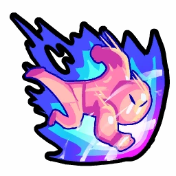
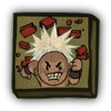

# Juggernaut

- **Facción:** Neutral  · *fase posterior (referencia)*
- **Página de la wiki:** Juggernaut

## Ficha

**Clase (alineamiento):**

> Neutral Killing

**Tipo:**

> Killing
> Unique

**Prioridad de acción:**

> 5

**Resumen:**

> You are an unstoppable force that only gets stronger with each kill.

**Objetivo:**

> Kill everyone who would oppose you.

**Habilidades:**

> You may choose to attack a player on full moon nights. (0 kills)
> You may choose to attack a player each night. (1st kill)

**Atributos:**

> Detection Immunity
> Attack: Powerful (Unstoppable after third kill)
> Defense: Basic

**Atributos (texto):**

> With each kill your powers grow. (0 - 2 kills)
> You have reached your ultimate power. (3 kills)
> You may (now) attack every night. (1st kill)
> You (now) Rampage when you attack. (2nd kill)
> You now ignore all effects that would protect a player. (3rd kill)

**Especial:**

> Grows stronger with each kill
> Unique Role

**Si hay Godfather/otro objetivo:**

> Deal a Powerful attack to target (first kill).
> Rampage at target's house (second kill).
> Deal an Unstoppable attack to target and visitors (third kill).

**Gana con:**

> Juggernaut
> Survivor

**Debe matar para ganar:**

> Town
> Mafia
> Coven
> Vampires
> Arsonist
> Serial Killer
> Werewolf
> Plaguebearer
> Pestilence

**Resultado Investigator:**

> Your target could be a .

**Resultado Consigliere:**

> Your target gets more powerful with each kill. They must be a Juggernaut.

## Texto completo de la wiki

(sin texto en el alcance)

## Implementación

- [ ] Definido en `packages/engine` con su prioridad y facción
- [ ] Acción nocturna (si aplica) validada con objetivos legales
- [ ] Resultado de investigación correcto (Sheriff / Investigator / Consigliere)
- [ ] Condición de victoria y de derrota comprobada en tests
- [ ] Tests unitarios del rol en verde
- [ ] Tarjeta y texto de ayuda en la app
- [ ] Icono e ilustración propia (no el arte de la wiki)
- [ ] Plantillas de narración para sus eventos
