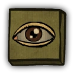

# Lookout

- **Facción:** Town  · *en alcance MVP*
- **Página de la wiki:** Lookout (ToS)

## Ficha

**Clase (alineamiento):**

> Town Investigative

**Tipo:**

> Investigation
> Non-unique

**Prioridad de acción:**

> 4

**Resumen:**

> You are an eagle-eyed observer, stealthily camping outside houses to gain information.

**Habilidades:**

> Watch one person at Night to see who visits them.

**Atributos:**

> Ignores Detection Immunity
> Attack: None
> Defense: None

**Gana con:**

> Town
> Survivor

**Debe matar para ganar:**

> Mafia
> Vampires
> Arsonist
> Serial Killer
> Werewolf
> Witches/Coven
> Plaguebearer
> Pestilence
> Juggernaut

**Resultado Sheriff:**

> You cannot find evidence of wrongdoing. Your target is innocent or great at hiding secrets!

**Resultado Investigator:**

> Classic Results
> Your target could be a .
> Coven Expansion Results
> Your target could be a .

**Resultado Consigliere:**

> Your target watches who visits people at Night. They must be a Lookout.

## Texto completo de la wiki

| 

Lookout 

Alignment

 Town Investigative

Avatar

Immunities

Ignores Detection Immunity

Attack: None

Defense: None

 Ability Stats

 | Type

 | Priority

 | Investigation

Non-unique

 | 4

Investigation Results

 Sheriff

You cannot find evidence of wrongdoing. Your target is innocent or great at hiding secrets!

 Investigator

Classic Results

Your target could be a Lookout, Forger, or Witch.

 Coven Expansion Results

Your target could be a Lookout, Forger, Juggernaut, or Coven Leader.

 Consigliere

Your target watches who visits people at Night. They must be a Lookout.

Game Information

Summary

You are an eagle-eyed observer, stealthily camping outside houses to gain information.

Abilities

Watch one person at Night to see who visits them.

Attributes

None.

Goal

Hang every criminal and evildoer.

 Victory Conditions

 | Wins with

 | Must kill

 | Town

 Survivor

 | Mafia

 Vampires

 Arsonist

 Serial Killer

 Werewolf

 Witches/ Coven

 Plaguebearer

 Pestilence

 Juggernaut

 | 

 | DISCLAIMER: These stories are fanmade, and are not created or endorsed in any way by BlankMediaGames or Digital Bandidos.

He knew that virtually all of the Mafia scum and some of the out-of-town maniacs preferred to work in night's mask of darkness, so sure that their deeds would be unseen by the sleeping citizens of Salem. Fortunately for the hapless townies, the Lookout works the graveyard shift night after night, repeatedly attempting to catch them red-handed. A former night watchman, he decided that the best way to keep an eye on the criminals of Salem was to beat them at their own game, so he slips seamlessly into the environment, keeping a watchful eye on his slumbering neighbors for any unexpected visitors, all while keeping attention to himself as low as possible. And tonight, his diligence paid off: the next day, his target is found dead in the town square, the town beauty cruelly stabbed to death by the Serial Killer at large. Just as the town erupts into chaos as suspicion falls onto the Escort's last client, the Lookout silences them all before putting out his findings. With his leads, town moves to hang the Escort's lone visitor despite denouncing the Lookout and vainly trying to defend himself. And as he draws his last breath, a bloodied dagger wrapped in a parchment fall out, defending his actions in a way only a psycho could. The Town breathes a collective sigh of relief, and the Lookout feels elated for just a moment before he slips back into his usual focused demeanor, and into the shadows.

Mechanics[]

You may watch a person each Night to see who visits them.

You will only be able to recognize up to three specific people who visit your target.

You will know if more than three people visited your target, but will be unable to identify them.

The three people you are able to recognize are selected at random.

You can see visits made (or forced by a Witch/ Coven Leader or Disguiser) by:

Any role that can choose a living target at Night. But not those that can only target themselves, even if they are witched ( Survivors and Veterans).

Despite not actually visiting, some roles will be detectable by the Lookout if a Witch controls them. They include: Mediums, Jesters, Jailors, Amnesiacs and the Werewolf on non Full Moon Nights. This is because these roles still technically "visit" in their own ways, like an Amnesiac visiting a dead target or a dead Medium visiting someone who's alive to séance them. You cannot detect roles such as Executioner or Mayor if they are witched, because they have no way of visiting (Unless a Disguiser interferes).

If a Pirate duels your target, you will see them visiting your target.

Any role that visits targets two players in one Night, like a Transporter/ Disguiser will show up visiting one of their targets.

If you watch the Jailor and they are attacked by the Serial Killer or Werewolf they jailed but did not execute, you will not see the name of the killer. (In the Werewolf case, you will die due to the rampaging attack).

You will be shot by a Veteran on alert if you choose to watch them at Night.

You will be stoned by a gazing Medusa if you choose to watch them at Night.

You will be obliterated by Pestilence if you choose to watch them or their target at Night.

You will die from a Werewolf if whoever you're watching is attacked by one. However, you will most likely know who the Werewolf is, which is useful to a Medium if there is one.

In addition, any role that only kills visitors like a Crusader or Ambusher can kill you, but you can still identify them (especially in the case of an Ambusher).

You will not see yourself visiting your target, but other Lookouts will, and you will see them.

You will not see the following roles visit your target (unless a Witch/ Coven Leader or Disguiser interferes):

Any role targeting themselves with the notable exception of a Transporter

Any role that attacked your target visiting another (e.g. Veteran, Werewolf)

 Jailor (additionally, your visit will fail)

 Godfather (with a Mafioso)

 Witch/ Coven Leader (second target)

 Hex Master (with the Necronomicon or final Hex)

 Retributionist/ Necromancer

 Guardian Angel

 Arsonist (igniting)

Due to an inconsistent bug (as of Version 3.3.12), you will sometimes not see reanimated corpses visit your target.

Strategy[]

As a Lookout, most people won't believe your claim right away because Lookout is a common Executioner (and other evil roles) claim. Therefore, it is CRUCIAL to keep an updated Last Will.

As a Lookout, it's important to keep track of what's going on during the day to spot out potential targets for the Town to hang, namely the Mafia, Vampires, or any possible Neutral Killings.

A good idea if you don't have anyone you think will be targeted is to look at player names, a lot of people will target names that stick out.

While they are generally more likely to get attacked, it is not a good idea to watch people who seem loud and annoying, as they could be a Veteran baiting evil roles. Additionally, if it is a Full Moon Night, you might die from the Werewolf because they generally attack loud targets.

Since experienced players know that Lookouts will most likely hang around names that stick out, it might not be a bad idea to watch someone whose name doesn't stick out very much like "Jonathan Corwin" or "Betty Parris".

If someone visited your target at Night but your target did not die, you should not be too quick when telling everyone who visited since the visitor could be a fellow Townie such as a Doctor, Sheriff, Bodyguard, or Investigator.

Then again, most Townies nowadays may not believe you if you wait too long to reveal yourself or your results as a Town Investigative. If the lobby seems to have competitive or experienced players, it may be worth posting your results right away and then asking a Town Protective role to be on you.

If your target mentions that they were attacked, but only one person visited them, they could be an immune role lying to seem innocent to the Town. Likewise, if your target is killed and they only had one visitor, either that visitor is a killing role or the target had visited a Serial Killer or Werewolf (if they were a Tavern Keeper, Bootlegger, or Pirate) that Night. If your target is alive but doesn't mention being roleblocked, transported, etc; the person who visited them might be a passive role, such as a Framer or Sheriff.

Keep track of who visited who and if that person says something during the day, such as, "I was witched last night." This way you may know what role the person who visited was.

If you are watching a target who has Defense get attacked, they might say nothing about it the next Day (since you cannot tell the difference between an attack and other visits). For example, Arsonists, Serial Killers and Godfathers rarely expose that they were attacked during the Night, so be careful and try to deduct who could be bad or good when reviewing someone's visitors.

It is important to watch a revealed Mayor, for several reasons:

First, this protects them. Any accusations you make against their killer will probably be believed since it's logical for a Lookout to watch a revealed Mayor; if you don't watch the Mayor and they die, your Lookout claim is unlikely to be believed. This will also allow you to identify the culprit if the Mayor is blackmailed by a Blackmailer or bitten by a Vampire. You can determine if the Mayor was bitten last Night by attempting to whisper to them.

Second, Mayors tend to attract a lot of visitors; this allows you to identify other Lookouts, Bodyguards, and Transporters If the Mayor is not blackmailed, killed, or turned into a Vampire (all of which tend to be obvious in one way or another), then it is fairly unlikely that any of their visitors that Night were evil since the other Mafia roles have little reason to visit them.

This information on who visited the Mayor may allow you to confirm your own role later on (but be cautious about revealing it unnecessarily, since it could potentially out a high-value role like the Bodyguard)

Be careful though, the Werewolf normally targets the Mayor because of how many people visits them. The Mafia may target the Mayor if they have a Disguiser or Ambusher and they know you're the only protection left for the Mayor.

If you are watching someone several Nights in a row and you see the same person visiting them, you might have found a Doctor or Bodyguard. Try to avoid saying this to the Town to avoid the Mafia from attacking you. If your target claimed that they were attacked and saved, try to deduct who the attacker could have been by viewing their other visitors. If they are silent, though, they could also be blackmailed, so you should ask them to talk to find out.

If you see your target visiting themselves, there are only a few options for what their role could be:

They could be a Transporter that transported themselves with someone else. Technically, you will have been redirected to the other target, but since the Transporter visits both targets, you'll still see them as a visit themselves.

They could be a member of the Mafia who was Disguised as your target. If you see anyone else visit your target when this happens, it may be worth outing and questioning that visitor because they could be the Disguiser.

Finally, while a Witch or Transporter could make someone not on the above list self-target, in that case you would see the Witch or Transporter as a second visitor.

Therefore, if you see someone self-target as their only visitor, you have watched a Transporter.

 Witches and Disguisers may be your worst enemy, so keep in mind if there are any of them in the game. For example, just because you saw someone visiting someone else on non- Full Moon Night doesn't mean that they are not the Werewolf, as the Werewolf will visit the target selected by the Witch, and the Disguiser can make it appear that the Werewolf visited the target.

Consider visiting someone who has been blackmailed twice (or more) in a row. The Blackmailer will likely return to the same player to blackmail them again the next Night, and if the same person is blackmailed again the next day, you can confirm whoever visited them as a Blackmailer. Note that this may not work if more than three people visit the blackmailed victim.

Sometimes, when an important role asks to be watched, you may do it if there's a high chance of them being attacked. But if they ask openly for it, then some killing roles will be scared off of attacking the said important role, leaving you free to watch others. However, this is a risky thing to do.

If you identify a Mafia Killing role and need to make the Town listen to you, one easy way to do so is to ask that a Jailor or Tavern Keeper target them. While this hinges on the Town having those roles, it costs them very little to check out one lead, so most of them will be happy to oblige. Most of the time, keeping a Mafia Killing Roleblocked or jailed is more effective than hanging them anyway, since it renders the entire Mafia unable to kill. Note that this is generally ineffective if there's more than 1 Mafia Killing or the Mafia Killing role was Disguised.

An Investigator may suspect you of being a Forger, Witch/ Coven Leader, or even a Juggernaut once he checks you out. Prepare your Last Will or any other piece of proof to try and prove yourself as a Lookout if they start asking or accusing you.

Your results can be very effective when paired with a Spy.

If a Spy sees a Mafia or Coven visit to a person on the same Night you're watching them, one of the people you saw visiting them must be a member of the Mafia or Coven.

Conversely, if a Spy doesn't see any Mafia or Coven visits to someone you watched, anyone who visited them that Night is definitely not a member of the Mafia or Coven respectively. Occasionally, this can be used to catch evils by process of elimination.

If your target is visited on the same Night that killing role kills someone else, then whoever visited them is definitely not that killer. However, remember that a member of the Mafia may become the killer after the fact if the current one dies.

For the most part, Mafia members cannot visit Mafia.

This has an important implication for you: Most of the time, when you see one person visiting another, at least one of the two must be non- Mafia; if either one is confirmed as Mafia, then you know the other isn't.

There is some risk that Mafia members can be forced to visit each other by a Witch, but the chance is low.

Note that a Transporter cannot cause problems here - your visit will also be transported, so you still know that any visitors you see tried to target your original target; absent a Witch, it's still impossible for both your intended target and any visitors you see to be Mafia.

A Disguiser can be an issue, since they can visit their own Mafia. If a Disguiser is killed, the people you saw them visit could be a member of the Mafia; however, they could still be the Disguiser's second target.

Your ability is less disrupted by Transporters than other Town Investigatives.

First, if your intended target is transported, you will probably see the Transporter as a visitor (since they visit both targets).

Second, since both you and all other visitors are transported, you'll still see everyone who intended to visit your original target - they'll end up at your new target along with you.

Of course, you still have to worry about Transporters when interpreting what happened the next morning - if the person you tried to target ends up dead, but they were transported, then you won't have seen who killed them.

Achievements[]

 | Name

 | Description

 | Merit Points

 | Sentry

 | Win your first game as a Lookout

 | 20

 | Eagle Eye

 | Win 5 games as a Lookout

 | 20

 | Hawk

 | Win 10 games as a Lookout

 | 40

 | Sentinel

 | Win 25 games as a Lookout

 | 100

 | I see you

 | Successfully watch someone at night

 | 20

 | It's a Party

 | Have 4 or more people visit your target

 | 40

Messages[]

 | 

 | (Player) visited your target last night!

 | Displays at the end of the night when a player visits your target.

 | More people visited your target but you couldn't identify them.

 | Displays at the end of the night when there are 4 or more visits on your target.

Trivia[]

If you see that your target was visited by the same player twice on the same night, it means that one visit is real and the other visit is from someone who was disguised as that player.

Prior to Version 3.2.5, Lookouts could identity all visitors to their chosen target, rather than only 3.

History[]

3.3.12

Fixed Lookout seeing reanimated corpses visit twice

3.3.0

The Disguiser can now fool a Lookout.

The Custom Lobby role summary for Lookout has been updated to include a reference about the limit of identifying 3 players.

3.2.5

 Lookout now only identifies 3 of the visits, which are chosen randomly. The Lookout will know if more than 3 visits occurred.

Added message "More people visited your target but you couldn't identify them.".

2.5.5.12200

The Lookout's role icon has been changed. Old one was .

Added Lookout's circled role icon ().

Town of Salem Release

Introduced.

 | 

 | 
Roles

 | 

 | 

 | 
 Town

 | 

 | Town Investigative | | Investigator • Lookout • Psychic • Sheriff • Spy • Tracker | | 

 | 

 | Town Killing | | Jailor • Vampire Hunter • Veteran • Vigilante

 | 

 | Town Protective | | Bodyguard • Crusader • Doctor • Trapper

 | 

 | Town Support | | Mayor • Medium • Retributionist • Tavern Keeper • Transporter

 | 
 Mafia

 | 

 | Mafia Deception | | Disguiser • Forger • Framer • Hypnotist • Janitor | | 

 | 

 | Mafia Killing | | Ambusher • Godfather • Mafioso

 | 

 | Mafia Support | | Blackmailer • Bootlegger • Consigliere

 | 
 Coven

 | 

 | Coven Evil | | Coven Leader • Hex Master • Medusa • Necromancer • Poisoner • Potion Master | | 

 | 
 Neutral

 | 

 | Neutral Benign | | Amnesiac • Guardian Angel • Survivor | | 

 | 

 | Neutral Evil | | Executioner • Jester • Witch

 | 

 | Neutral Killing | | Arsonist • Juggernaut • Serial Killer • Werewolf

 | 

 | Neutral Chaos | | Pirate • Plaguebearer/ Pestilence • Vampire

## Implementación

- [ ] Definido en `packages/engine` con su prioridad y facción
- [ ] Acción nocturna (si aplica) validada con objetivos legales
- [ ] Resultado de investigación correcto (Sheriff / Investigator / Consigliere)
- [ ] Condición de victoria y de derrota comprobada en tests
- [ ] Tests unitarios del rol en verde
- [ ] Tarjeta y texto de ayuda en la app
- [ ] Icono e ilustración propia (no el arte de la wiki)
- [ ] Plantillas de narración para sus eventos
