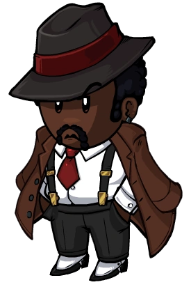

# Mafioso

- **Facción:** Mafia  · *en alcance MVP*
- **Página de la wiki:** Mafioso

## Ficha

**Clase (alineamiento):**

> Mafia Killing

**Tipo:**

> Killing
> Unique

**Prioridad de acción:**

> 5

**Resumen:**

> You are a member of organized crime, trying to work your way to the top.

**Objetivo:**

> Kill anyone that will not submit to the Mafia.

**Habilidades:**

> Carry out the Godfather's orders.

**Atributos:**

> Control Immunity (with the Godfather)
> Attack: Basic
> Defense: None

**Atributos (texto):**

> You can attack if the Godfather doesn't give you orders.
> If the Godfather dies you will become the next Godfather.
> You can talk with the other Mafia at night.

**Especial:**

> Unique Role
> Mafia chat
> Becomes Godfather when Godfather dies

**Si hay Godfather/otro objetivo:**

> If there is no Godfather, the Godfather does not give orders, or the Godfather is roleblocked, you may attack your own target.

**Si no hay orden:**

> Attack the Godfather's target

**Gana con:**

> Mafia
> Survivor
> Witch

**Debe matar para ganar:**

> Town
> Arsonist
> Serial Killer
> Werewolf
> Vampires
> Coven
> Plaguebearer
> Pestilence
> Juggernaut

**Resultado Sheriff:**

> Your target is suspicious or framed!

**Resultado Investigator:**

> Classic Results
> Your target could be a .
> Coven Expansion Results
> Your target could be a .

**Resultado Consigliere:**

> Your target does the Godfather's dirty work. They must be a Mafioso.

## Texto completo de la wiki

Mafioso 

Alignment

 Mafia Killing

Avatar

Immunities

 Control Immunity (with the Godfather)

Attack: Basic

Defense: None

Special

Unique Role

 Mafia chat

Becomes Godfather when Godfather dies

 Ability Stats

 | Type

 | Priority

 | Killing

Unique

 | 5

Actions

Target other

If there is no Godfather, the Godfather does not give orders, or the Godfather is roleblocked, you may attack your own target.

No action

Attack the Godfather's target

Investigation Results

 Sheriff

Your target is suspicious or framed!

 Investigator

Classic Results

Your target could be a Vigilante, Veteran, Mafioso, or Ambusher.

 Coven Expansion Results

Your target could be a Vigilante, Veteran, Mafioso, Pirate, or Ambusher.

 Consigliere

Your target does the Godfather's dirty work. They must be a Mafioso.

Game Information

Summary

You are a member of organized crime, trying to work your way to the top.

Abilities

Carry out the Godfather's orders.

Attributes

You can attack if the Godfather doesn't give you orders.

If the Godfather dies you will become the next Godfather.

You can talk with the other Mafia at night.

Goal

Kill anyone that will not submit to the Mafia.

 Victory Conditions

 | Wins with

 | Must kill

 | Mafia

 Survivor

 Witch

 | Town

 Arsonist

 Serial Killer

 Werewolf

 Vampires

 Coven

 Plaguebearer

 Pestilence

 Juggernaut

 | 

 | DISCLAIMER: These stories are fanmade, and are not created or endorsed in any way by BlankMediaGames or Digital Bandidos.

Obey. That was the only word he understood. Though he may seem like your average everyday townie, the story behind his grin is a grim, horrible and ghastly tale. That man is only known as The Mafioso. He dreams of only one thing; a brighter future for his whole family. Especially for his beloved Godfather. Just to achieve that dream, he will murder anyone his godfather wishes. Whether it be the mayor that once stood in the godfather's way, an investigator who tracked down the arsonist or even a werewolf who killed the survivor that promised to stand by his side... He just doesn't care. So long as anyone who opposes him is dead, or submitting or the mafia. But.... What if the Godfather was killed? Well... Lets just say there is a replacement there already waiting.

Mechanics[]

You can VOTE on a target to attack each night; however, if there is a Godfather and they VOTE on someone else, their decision will override yours, and you will attack their target instead.

If the Godfather picks a target, at the end of the night you will receive the notification: "The Godfather has ordered you to kill his target."

If you are roleblocked (or if you are dead/if there is no Mafioso), the Godfather will perform the kill personally and will be subject to the below instead.

Regardless of whether there is a Godfather or not, and regardless of their actions, you will do the actual killing, provided that you are alive and not role-blocked. This has the following implications; whoever does the actual killing will:

Be visible by to any Lookouts, Trackers, Spies, or Trappers visiting the target.

Be attacked by any Town Protectives, rampages, alerts, and/or Stone Gazes at that location.

Receive a message if the target has defense or was jailed. Note that if the Mafioso does the attacking, the Godfather will not receive said message for ordering an attack on the target in question.

Be able to leave a Death Note behind for the Town to see in the morning.

Both you and the Godfather's kill/death message appear as "a member of the Mafia", meaning Roleblockers (most notably the Jailor) cannot determine if they Roleblocked either of you.

If the Godfather dies during the game, you will be promoted to the Godfather rendering Basic Defense, Detection Immunity, and the final decision on who to kill. You cannot become the Godfather if there was none at the beginning of the game.

If you die and there is no living Godfather, a remaining member of the Mafia will be promoted to a Mafioso. If there are multiple Mafia members, whoever joined the lobby first will be promoted to a Mafioso.

If a Witch controls you, you will still attack the target of the Godfather. This is because the Mafioso only VOTEs for who to kill, allowing the Godfather's command to override the coven Leader's control, giving the Mafioso Control Immunity.

You can talk with the other members of the Mafia at night.

If the Mafioso is commanded by the Godfather and controlled by a Witch, the command will take precedence since the Witch only chooses what target the Mafioso votes for.

Strategy[]

As a member of the Mafia, your job is to kill anyone who would oppose the Mafia without being caught.

If the Godfather dies, you will become the new leader of the Mafia. So, if it appears that Godfather will die or be hanged soon, you should start to take control.

If there is no Godfather, you will lead the Mafia instead. Do not take coordination for granted.

Communication with the Godfather is of utmost importance. You should alert the Godfather the next night if your target has defense in order to avoid the Godfather repeatedly ordering you to attack the same target if you think the target has Basic Defense. If the target was likely a Townie who got healed, talk it out with the Godfather to see if it's worth attacking the same target again.

If you did not receive an immunity message, yet your target did not die, you have just attacked a Witch. Make absolutely certain to convey this to the Godfather the following night.

Both you and the Godfather should always choose a target. If one of you are Roleblocked, the other will attack instead.

You will know the Godfather was Roleblocked if you did not receive an order despite the Godfather choosing a target.

 Death Notes can be important to discuss with the Godfather, as it is the Mafioso that gets left at the feet of the target, and not the Godfather. Death Notes revealing who has Defense may help the Mafia, and possibly the Town, in hanging a Neutral Evil or Neutral Killing role. You can also call out someone for being immune when they aren't in hopes that the Town hanges them.

If the Godfather is jailed, make sure to attack that night to throw suspicion off of him. Nothing screams, " Mafia!" more than no deaths by Mafia when someone is jailed.

If no Mafia Killing roles are able to attack (jailed, away from the keyboard, etc.) claim that you were attacked and that you were healed or keep a pattern that follows the night that the Mafia did not attack.

Alternatively, once or twice in a game, you may want to not attack for one night, as this will bring suspicion onto whoever was jailed/role blocked, and can even have them hanged if they claim a role like Vigilante or Veteran. This will work even better farther into the game if a Jailor or Tavern Keeper is still alive, but this trick will usually only work once if the Town discovers that the player is innocent. Be careful; the downside to this trick is that you're slowing down your killing and giving the Town Investigative roles more time to catch you, so only do it if you're confident the confusion it will cause is worth it. You can also do this and claim that someone is immune in your Death Note when you didn't even attack them.

With a Death Note, try a different personality than how you usually type to throw off suspicion. If possible, mimic another person's personality and typing. (Spelling errors you wouldn't usually make, poor grammar if you use good grammar normally, etc.)

Another option is to not leave a Death Note at all, so if you are Roleblocked, nobody looks suspicious. It also has the advantage of not revealing anything in the Death Notes themselves.

Remember that if you are jailed or Roleblocked, the Godfather's Death Note will be shown when the target is killed, not yours. If your Death Notes are different in some distinct fashion, or if you don't normally change your Death Note, this can tip whoever Roleblocked you off to the fact that you're the Mafioso. You can avoid this by using the same Death Note as the Godfather, by both leaving it blank, or by constantly varying it.

You can also change your Death Note entirely after 2-3 Nights to trick a Tavern Keeper into repeatedly role blocking an important Town role or a Jailor into executing a Townie.

In general, if there is no Godfather, your main responsibility is leading the Mafia. If there is a Godfather, then work with them along with the rest of your Mafia team.

Always select a target, since as mentioned, your Godfather might be Roleblocked that night.

A risky strategy - on Night 1, write in your Death Note "<your name> is immune!" Smart Townies will recognize that the Mafioso could not have known that Night 1, and therefore be more inclined to believe you are Town.

Of course, this may have the opposite effect and draw unwanted attention to yourself. Consider using this to deflect suspicion onto other players.

Since games require at least one Mafioso or Godfather for the rest of the Mafia to function, you are somewhat of a disposable role. If there are three other Mafia, consider going aggressive if you need to try to take down a certain target.

 Executioner is actually a fantastic claim as Mafioso. If you attempt to push someone really hard on Day 2, claiming a Town Investigative role and they end up being Town, you can claim that you got your Executioner win, and usually, the rest of the Town will leave you alone. However, this does come with the included risk of hypothetically pushing a member of the Coven or a Neutral role, which although may "confirm" you as a Townie, it would make you target for members of the Coven or opposing Neutrals, so this strategy works even better with a Consigliere working alongside you. The Jailor may also execute you because Executioners usually side with evil factions after securing their Victory.

 | Godfather and Mafioso nightly kill interactions 

 | 

 | Godfather picks a target

 | Godfather does not pick target

 | Godfather is controlled

 | Godfather was roleblocked / No Godfather

 | Mafioso picks a target

 | Mafioso attacks Godfather's target

 | Mafioso attacks their own target

 | Mafioso attacks Godfather's controller's target

 | Mafioso attacks their own target

 | Mafioso does not pick target

 | Mafioso attacks Godfather's target

 | No attack

 | Mafioso attacks Godfather's controller's target

 | No attack

 | Mafioso is controlled

 | Mafioso attacks Godfather's target

 | Mafioso attacks controller's target

 | Mafioso attacks Godfather's controller's target

 | Mafioso attacks controller's target

 | Mafioso was roleblocked / No Mafioso

 | Godfather attacks their own target

 | No attack

 | Godfather attacks controller's target

 | No attack

Role Killing Priority[]

In the Town, you are the main enemy. You will most likely not be sided with over a Neutral Killing if a Townie or Survivor is forced to pick between you and them in a 1 v 1 v 1 situation. Therefore, you need to know which people to kill.

 Jailor[]

This role can kill all of the Mafia, including the Godfather unless there are four of you. This also role blocks you, making it potentially the most dangerous role to face. The Jailor will also be very hard to hang, and can sometimes attract the attention of Town Protective roles, Lookouts, Transporters, and roles that Rampage. Be careful of killing this role and other Town Investigative roles as this might out your claim, or make your claim look suspicious. 

 Tavern Keepers and Pirates[]

They can either call you out or paralyze the Mafia. A Pirate is far less dangerous as they can side with you, but if they want to side with another role they could potentially call you out as a sign of alliance.

 Mayor[]

If kept until late game, this role can potentially turn the tides on the whole Mafia by countering " Mafia Majority". Try to take them out before it's too late.

 Vigilantes[]

These roles have the power to take out the vast majority of the Mafia in one fatal swoop. They are rather dangerous, but you can manage to trick them into killing themselves by hitting a Townie.

 Transporters[]

They have the capability of making you attack one of your own Mafia members, and can easily protect themselves. They will also win against you in a 1v1 situation. To take them out, try targeting someone who you think the Transporter will be transporting themselves with (Like a Survivor claim). You can also have the Ambusher safely kill them for you as the Ambusher can turn the Transporter's self protection against them.

 Neutral Killing roles[]

These roles can also take out the Mafia. Keep them in until the Mafia gains the majority vote or they start to kill the Mafia members. Taking out one of these roles can false confirm the accuser as Town. They can be valuable to double the kills per night and Neutral Killing roles will most likely attack enemies to the Mafia. All Neutral Killing roles have defense that the Mafia can't 'break'.

 Vampires and the Coven[]

These are your main enemies in a battle for supremacy over the Town, and have a team to fall back on. They can also take out huge chunks of the Mafia, so take them out. Keep the balance though, as too many Townies can always spell trouble. These are easier to face in a Kingmaker situation, and so are less dangerous than Neutral Killing.

 Town Investigatives[]

These roles can catch you red handed. The Sheriff may be valuable enough for mishanges if you have a Framer, but they can catch the Mafia anyways without a Disguiser so it's best to kill them off. Investigators can trap you in a box if asked to claim, so target them early.

 Town Protectives[]

These roles can stop you from killing higher priority targets, or potentially kill you. Take them out if you think they're on an important role.

Other Town[]

These are either lethal or harmless depending on intelligence and information. You need them dead to win.

 Neutral Benign and Neutral Evil[]

These aren't so dangerous, but they can side against you. Always keep this in mind. For Coven Expansion users, the Guardian Angel may be the only exception, as their target can be an enemy. 

Claiming a Town Role[]

Your investigative results are: Vigilante, Veteran, Mafioso, Pirate, or Ambusher ( Pirate is Coven Expansion exclusive).

 Veteran[]

 Veteran is a unique role; if there's a Veteran in your game, they'll likely call you out as soon as you try to claim it, and if they die you'll be immediately exposed. On the other hand, the dangers of claiming make it much more convincing if you're willing to take the risk, and you're less likely to be visited out of fear of being shot.

If you claim to be the Veteran, be wary of recording in your fake Last Will that you used alerts unless you are relatively certain that no one visited you. Having no alerts in your Last Will looks very sketchy, but claiming to have alerted when someone claims to have visited you is almost certain death. Claiming you are going for the Not Paranoid (win without going alert all game) Achievement for the Veteran might work, but this leaves you possibly vulnerable to rival roles coming to kill you. Some players may say that keeping a Last Will as a Veteran is not important because you do not actually gather information, or to 'not reveal whether the Veteran used their alerts yet', but they may want to see if any players visited you on a night that you may have alerted.

Overall, you generally may be better off not claiming Veteran, unless you have a Janitor and a Consigliere on your team and you time your attack just right as long as they have yet to say who they are, or if you can convince the Town that the dead Veteran was forged.

Careful, Lookouts can catch you doing this without a Disguise.

This plan will automatically fail as long as at least one dead Townie (who was killed by a Veteran) outed who the real Veteran is in their will.

 Vigilante[]

 Vigilante is your easiest claim, though if there's someone acting like a Jester or otherwise obviously evil, the Town might expect you to shoot them. And since it is very well known for a Mafioso to claim Vigilante, you might be hanged or executed by a Jailor.

If you have no Godfather, claiming to be a Vigilante can be dangerous, since a Tavern Keeper and the Jailor will know that that claim indicates a possible Mafioso and will likely try roleblocking you. Claiming Veteran might discourage Tavern Keepers, but won't discourage the Jailor. In that situation, you should avoid claiming if at all possible, and may want to claim outside your Investigator results if necessary.

If you plan to or already have claimed to be a Vigilante, you should at least write a fake Last Will to support your claim. Keep writing each day that you have not shot anyone. Putting in some other info as to why you did not shoot that correlates to actions that happened in the course of the game will make this will much more believable. If a Vigilante has shot an evil role, but did not claim it, make sure to kill, clean/forge them and use their success to "Confirm" yourself as Town. This could backfire with a Medium however, and the real Vigilante would normally call out their shooting to confirm themselves.

A major problem for Vigilante claims is the fact that the Town may ask you to shoot someone, and failing to do so may result in being hanged. A way around this is to claim you did indeed shoot this person, claim they were immune, and hope they have Basic Defense to ensure your prolonged existence. You can also use this to buss the Godfather to confirm yourself. However, this is risky, since you may get discovered by Investigators who will see a different result after promotion or Tavern Keepers who will see no Mafia kill if they role-block you.

Other Roles[]

Claiming inside your investigative results is usually a somewhat bad way to play, and other strategies may need to be adopted. Although dangerous if it backfires, you can claim something such as a Sheriff and throw the Random Mafia under the bus (if none of Town Investigative roles are Investigator) and thus be considered a "confirmed Townie". And in this way, you will gain the Town's trust. Before when you write in your Last Will the names of your fellow Mafia members, so the Town will believe you more and let you live, tell your Mafia friends to prepare their Wills and a role to claim, and experienced players will claim a better role that may help the Mafia more. One such example would be Investigator ( Consigliere's cover), Tavern Keeper ( Bootlegger's cover) or Executioner (Remember to say who your target is, bonus points if it's another Mafia member). However, this may be seen as gamethrowing, and should be discussed with the other Mafia. This strategy is called bussing.

Achievements[]

 | Name

 | Description

 | Merit Points

 | Mobster

 | Win your first games as a Mafioso

 | 20

 | Gangster

 | Win 5 games as a Mafioso

 | 20

 | Hoodlum

 | Win 10 games as a Mafioso

 | 40

 | Thug

 | Win 25 games as a Mafioso

 | 100

 | Michael Corleone

 | Be promoted to the Godfather

 | 20

 | Loyal Servant

 | Win without dying or becoming the Godfather

 | 20

 Only achievable if the Godfather dies before you.

Messages[]

 | 

 | You were attacked by a member of the Mafia!

 | Displays at the end of the night when you are attacked by a Mafia Killing role. 

 | The Godfather has ordered you to kill his target.

 | Displays at the end of the night for Mafioso when the Godfather selects a target.

 | [They were] killed by a member of the Mafia or [They were] also killed by a member of the Mafia.

 | Cause of death for a player who was attacked by a Mafioso.

History[]

3.3.2

Fixed issue when Forger was promoted to Mafioso that could result in a disconnection.

3.2.4

Temporary Defense given by certain roles through game mechanics now give attackers the message "Your target's defense was too strong to kill.".

3.2.3

 Trapper will no longer die to Attack if another Trapper has placed a Trap on them.

Dual Trappers can now save each other if they have placed Traps on each other and both are attacked.

 Mafioso will now die to Trap placed on another Trapper.

Fixed issue where non- Mafia roles could be unexpectedly promoted to Mafioso.

3.1.14

Fixed Tracker detecting Godfather visiting victim when Godfather orders Mafioso to kill the victim.

Fixed incorrect Tracker results when Mafioso picks one victim but Godfather chooses another.

2.5.5.12200

The Mafioso's role icon has been changed. Old one was .

Added Mafioso's circled role icon ().

2.5.1.10655

Fixed Guardian Angel "target was attacked" feedback.

2.4.0.10404

Fixed bug where Mafioso would see target's defense being too high while the target was Jailed.

1.1.1

No more double Mafioso in Ranked.

Beta 0.8.1

Attackers will now get "Your target is immune" message when attacking Werewolf on Full Moon nights.

Town of Salem Release

Introduced.

 | 

 | 
Roles

 | 

 | 

 | 
 Town

 | 

 | Town Investigative | | Investigator • Lookout • Psychic • Sheriff • Spy • Tracker | | 

 | 

 | Town Killing | | Jailor • Vampire Hunter • Veteran • Vigilante

 | 

 | Town Protective | | Bodyguard • Crusader • Doctor • Trapper

 | 

 | Town Support | | Mayor • Medium • Retributionist • Tavern Keeper • Transporter

 | 
 Mafia

 | 

 | Mafia Deception | | Disguiser • Forger • Framer • Hypnotist • Janitor | | 

 | 

 | Mafia Killing | | Ambusher • Godfather • Mafioso

 | 

 | Mafia Support | | Blackmailer • Bootlegger • Consigliere

 | 
 Coven

 | 

 | Coven Evil | | Coven Leader • Hex Master • Medusa • Necromancer • Poisoner • Potion Master | | 

 | 
 Neutral

 | 

 | Neutral Benign | | Amnesiac • Guardian Angel • Survivor | | 

 | 

 | Neutral Evil | | Executioner • Jester • Witch

 | 

 | Neutral Killing | | Arsonist • Juggernaut • Serial Killer • Werewolf

 | 

 | Neutral Chaos | | Pirate • Plaguebearer/ Pestilence • Vampire

## Implementación

- [ ] Definido en `packages/engine` con su prioridad y facción
- [ ] Acción nocturna (si aplica) validada con objetivos legales
- [ ] Resultado de investigación correcto (Sheriff / Investigator / Consigliere)
- [ ] Condición de victoria y de derrota comprobada en tests
- [ ] Tests unitarios del rol en verde
- [ ] Tarjeta y texto de ayuda en la app
- [ ] Icono e ilustración propia (no el arte de la wiki)
- [ ] Plantillas de narración para sus eventos
