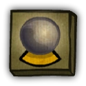

# Medium

- **Facción:** Town  · *en alcance MVP*
- **Página de la wiki:** Medium (ToS)

## Ficha

**Clase (alineamiento):**

> Town Support

**Tipo:**

> Special
> Non-unique

**Prioridad de acción:**

> 1

**Resumen:**

> You are a secret psychic who talks with the dead.

**Habilidades:**

> When dead speak to a living person at Night.

**Atributos:**

> Attack: None
> Defense: None

**Atributos (texto):**

> You will speak to the dead anonymously each Night you are alive.
> You may only speak to a living person once.

**Especial:**

> Graveyard Chat
> Day Ability

**Gana con:**

> Town
> Survivor

**Debe matar para ganar:**

> Mafia
> Vampires
> Arsonist
> Serial Killer
> Werewolf
> Witches/Coven
> Plaguebearer
> Pestilence
> Juggernaut

**Usos:**

> 1

**Resultado Sheriff:**

> You cannot find evidence of wrongdoing. Your target is innocent or great at hiding secrets!

**Resultado Investigator:**

> Classic Results
> Your target could be a .
> Coven Expansion Results
> Your target could be a .

**Resultado Consigliere:**

> Your target speaks with the dead. They must be a Medium.

## Texto completo de la wiki

Medium 

Alignment

 Town Support

Avatar

Immunities

Attack: None

Defense: None

Special

Graveyard Chat

Day Ability

 Ability Stats

 | Type

 | Priority

 | Special

Non-unique

 | 1

Investigation Results

 Sheriff

You cannot find evidence of wrongdoing. Your target is innocent or great at hiding secrets!

 Investigator

Classic Results

Your target could be a Medium, Janitor, or Retributionist.

 Coven Expansion Results

Your target could be a Medium, Janitor, Retributionist, Necromancer, or Trapper.

 Consigliere

Your target speaks with the dead. They must be a Medium.

Game Information

Summary

You are a secret psychic who talks with the dead.

Abilities

When dead speak to a living person at Night.

Attributes

You will speak to the dead anonymously each Night you are alive.

You may only speak to a living person once.

Goal

Hang every criminal and evildoer.

 Victory Conditions

 | Wins with

 | Must kill

 | Town

 Survivor

 | Mafia

 Vampires

 Arsonist

 Serial Killer

 Werewolf

 Witches/ Coven

 Plaguebearer

 Pestilence

 Juggernaut

 | 

 | DISCLAIMER: These stories are fanmade, and are not created or endorsed in any way by BlankMediaGames or Digital Bandidos.

She waits until night, then grabs out her crystal ball. The magic words are spoken, foreign to others but oh so familiar to her. The opaque ball clears, now translucent in nature. The town has called her foolish many times for messing with “fake magic”, but they know not of its true properties. Words from the souls of the dearly departed appear. She shifts through their own personal conversations to find the one talking to her. A sheriff had found on his last night a member of the mafia, but had been too late to write it in a will. They say dead men tell no tales, but that is not true for the Medium. She tells her fellow townspeople next day of the sheriff’s final confession. The mafia member is hanged, the townspeople cheer, but this victory did not come without a price. She is shot the next night, no doubt by the revenge-seeking mafia. Her life is over, but her job is not. In one final act, she seances a trusted member of the living, and shares what final information the dead hold.

Mechanics[]

During the Night, you are able to talk with all dead players.

The dead will see any alive Mediums talking as "Medium".

You, as well as the dead, cannot copy your own messages into the clipboard.

You do not see other Mediums talking.

If you are Jailed, you will hear both the dead and the Jailor; however, only the Jailor will hear you, and the dead will not be able to hear you nor the Jailor.

Once you are dead, you may target a living player by clicking the " Seance" button during the Day to talk to them for that Night only.

You only have 1 seance.

If multiple dead Mediums Seance the same player, the Mediums will hear each other.

Your target will start the Night with the message "A medium is talking to you!".

Multiple Mediums seancing the same player will generate the message as many times as there are Mediums seancing the player. This means that the target will also know how many Mediums have Seanced them.

The target will see any seancing Mediums talking as "Medium".

You, as well as the target and other seancing Mediums, cannot copy your own or other Medium's messages into the clipboard.

If your target is Jailed, a member of the Mafia/ Coven, a Vampire, or the Jailor, they will be able to talk with you and the Jailor, the other members of their faction, or the Jailed target respectively.

In these circumstances, any message the Seanced player sends will be shown to all players that can hear them. For instance, a Seanced Mafia member cannot talk separately with their team and the Medium/ Mediums seancing them, which means that any message the Mafia member sends can be seen by both the Mafia and the Medium/ Mediums seancing them.

If your target is a Vampire Hunter, they will still hear the Vampire chat.

While seancing, you are still able to hear the dead, but the dead won't hear you.

Strategy[]

As a Medium, you are capable of many useful things:

You can relay what the dead are saying back to the living.

You can confirm other Mediums.

You are one of two roles ( Medium and Janitor) that are able to figure out Cleaned roles directly.

However, remember that evil roles can be Cleaned because of the Transporter or the Witch/ Coven Leader, and they can lie about their role to throw off the Town. Therefore, if there is a Transporter or Witch/ Coven Leader, there is a chance that the Cleaned player is evil.

You are the only role that is able to figure out the true roles of Forged players, as well as Stoned players.

However, just like Cleaned roles, it is possible that they are an evil role lying.

You can get the last result of a Town Investigative role just before they died.

You can find if anyone had incriminating evidence against another the Night they died. such as a Vigilante who shot someone with defense.

You can find out what happened to players before they died, such as if they were Blackmailed, Roleblocked, controlled by a Witch/ Coven Leader, etc.

You can discover who a Tavern Keeper, Bootlegger, Pirate or Jailor visited if killed by a non-Cautious Serial Killer that they targeted with their abilities. While Werewolf and Pestilence have similar mechanics to the Serial Killer, the dead cannot confirm who they are (although they may have suspicions based on what the player said, and may be able to tell you who they targeted that Night). The only exception to this is Jailor jailing Pestilence, as they will know if they targeted Pestilence. Additionally, a Bootlegger or Pirate may lie about who the Serial Killer is.

If there's an Ambusher in the game, you can find out who they are by talking to the player who was killed by the Ambusher.

If there's Medusa in the game, you can find out who they are by talking to the player who was Stoned by Medusa.

You get the thoughts from the deceased on who they think is Town, Mafia, Coven, or Neutral.

You can talk to other Mafia/ Coven members or Neutral roles to possibly get some more information using your seance.

Be careful of any dead Mafia/ Coven members who explicitly reveal their fellow teammates, as they may be lying to throw off the Town. However, if you find out that they are telling the truth, then they are eligible to be reported for gamethrowing.

By giving your name to dead Townies and asking them to check the names of other players that claim Medium, you can figure out who is actually a Medium or not. And remember, always state your name/position to the dead at the start of every Night to ensure that all new dead players will know your identity, while also removing any doubt of you having been converted to a Vampire.

However, this can let players communicating externally know who you are. If you can prove that they are talking outside of the game or admit to it, feel free to report them for cheating.

You can also prove yourself by getting secret information from the dead. Ask them for the contents of any whispers they sent or received so you can use it to prove yourself to whoever was at the other end, although this still leaves the possibility of you being a Blackmailer. A strategy that removes this flaw is to ask anyone who was Jailed to tell you what they discussed with the Jailor (or, alternatively, ask the Jailor what they discussed with everyone they Jailed), then use this to prove you're a Medium if necessary.

You could even suggest that the remaining players whisper passcodes to each other; later, if a Town member dies, you can get their passcode from them and use it to confirm yourself.

Important: Your job in the Town is to carry on the discussion after players die. It's beneficial having dead players discuss freely without any doubts once you're dead, as Townies can give you useful information. This role can potentially change who wins and who loses, so discuss wisely.

Don't always trust what a cleaned victim tells you since they could be a Neutral role, Coven member or possibly even a Mafia member trying to throw you off with false information. Ask the deceased for proof before you tell everyone that someone is guilty. The dead can still be wrong or lie.

Also, watch if a member of the Mafia was killed by Mafia as they could actually be a forged Townie. Like a Cleaned victim, they can also lie about the forgery to get a Transporter killed, so ask for proof before accusing someone.

You can speak to a just-hanged Jester and try to convince them to haunt your preferred target. While Jesters have no particular reason to listen to you, they often do; many of them want to have a big impact on the game and would rather haunt a Neutral Killing role rather than a random Townie.

Reverse psychology also works: if a Jester just got hanged, beg them not to haunt your preferred target. They may pick that target just to annoy you, but in reality, it is what you wanted. Note that this is less effective in general as a strategy.

Having two Mediums can be the key to success in a round. If one of them dies, they can take info from the newly dead and tell this to the other Medium. They can also confirm each other by the dead almost instantly, provided they say their name.

It is recommended to ask the dead every Night if you are both Mediums in order to clear any suspicion of either of you being Vampires. Since the dead can lie, a safer method is to whisper each other a message from the dead every Day.

Keep in mind that none of the above matters if nobody knows you exist, so make your presence known as soon as possible at Night.

However, there might be some benefits to NOT revealing at Night. Particularly, by not revealing yourself at Night once a member of the Mafia/ Coven is dead, there is a chance they might inadvertently reveal their own teammates, thinking there is no danger.

Proving yourself[]

Even if you lack incriminating evidence from the dead, there are still ways to make the Town less doubtful of you.

The easiest way for a Medium to gain the trust of the Town is by copying and pasting messages from the dead, since it is difficult and time-consuming for an evildoer to create a fake conversation.

For the Web and Steam versions of the game, hovering your cursor over a message will allow you to copy it by clicking on the button on the right side of the message. You can then use the Control + V (or Command + V if using a Macbook) shortcut on your keyboard to paste the message in the Chat or in your Last Will.

For the Mobile version of the game, simply tapping and holding on a message will show a green progress bar. Once it disappears, you have successfully copied the message. Tapping and holding in the Chat box or your Last Will should prompt a "Paste" button.

You should repeat the dead's thoughts to the Town every Day.

Keeping an organized Last Will is important and makes your claim seem more legitimate. Ideally, what happens to you during the Night and what the dead are saying should both appear in your Last Will.

Below is an example of a format you can use:

N1: Nothing

N2: Controlled

N3: Role blocked

N4:

Dead chat as of N4:

Giles Corey: I trust Martha's claim.

Jonathan Corwin: There might be an Arsonist.

In order to prevent reaching the character limit, simply delete the dead chat from your Last Will once you've posted it and update the Night number on line 5.

In the case of multiple Mediums, proving yourself should be an easy task, as you will both have the same messages.

Spotting a fake Medium[]

There are certain clues, some more subtle than others, that can help you identify if a Medium claim is lying.

Refuses to cooperate - While not always the case, a Medium that refuses to tell the Town information is usually evil.

Wrong format - The format of a pasted message is "(Name): (message)". The first fake example shows the usage of "-" instead of ":", the second fake example shows the usage of ";" instead of ":", and the last fake example shows two spaces between the ":" and the message.

Real message - Abigail Hobbs: I was controlled.

Faked message - Abigail Hobbs - I was controlled.

Faked message - Abigail Hobbs; I was controlled.

Faked message - Abigail Hobbs: I was controlled.

Dead's messages do not match with their personality/writing - For example, before Samuel Parris died, they always started their sentences in lowercase and often used emoticons, but, according to the Medium, are now talking in uppercase and without emoticons. A sudden change in writing style could be a sign of a faked message.

Real message - Samuel Parris: thx for the help :)

Faked message - Samuel Parris: They have to be evil!

Wrong capitalization - If the name's capitalization is wrong, the message is fake.

Real message - John Willard: I doubt they were Framed.

Faked message - John willard: I doubt they were Framed.

Spaces between messages - When pasting multiple messages at once, the game does not put a space between them.

Real messages - Abigail Hobbs: I was controlled.John Willard: I doubt they were Framed.

Faked messages - Abigail Hobbs: I was controlled. John Willard: I doubt they were Framed.

Their own messages - A Medium cannot copy their own messages.

Real messages - William Phips: How was your Day?William Phips: That's good to hear

Faked messages - William Phips: How was your Day?Medium: It was fine.William Phips: That's good to hear

Using your Seance[]

If you die, do not leave, even if you die Night 1. You are still able to speak to a living player once through your Seance.

Don't use your Seance immediately after you die. Save it until you have enough useful information and have identified a living player you trust to use it.

Do not save your Seance too long. Many Mediums end up saving it until it's too late. Remember, you have to push the Seance button the Day before the Night you talk with someone, and the Town usually needs to still have a majority the next Day or they won't be able to do anything with the information you provide.

Practically speaking, this means the Town usually needs to have at least two more Townies than the Mafia on the end of the Day you initiate the Seance (the Mafia will most likely kill one of the townies, leaving the Town with only one more member than the Mafia, allowing them to hang one), which leaves you a very narrow window to Seance effectively.

Using your Seance on any role that has the ability to speak at Night (e.g. a Jailor, or any member of the Mafia) can lead to a very confusing and often irritating conversation, since other players will be speaking at the same time as you, yet neither of you can see the other's messages. In most cases, it's a detriment to the player you're speaking to from beyond the grave.

You could also use your Seance on someone who is suspected of being Mafia; once the Seance begins, you could take note if it seems what they say is to be directed towards other players. If what they say sounds like they are conversing with other members, then you just possibly found a member yourself. The problem with this is you have no way of directly telling the town about this, unless another Medium seances.

You could try to lie to a dead Mafia/ Coven member or Vampire. You can claim that you have wasted your seance, and then after about 30 seconds, ask that player who their last team members are, or try to guess and ask if you are correct. You may have to convince that player that you've used your seance. Do note that they could still lie about it or might not even tell you anything at all. If you do manage to get information, then use your Seance on a trusted Town member and pass it to them.

In order to make it even more believable, do not talk for the entirety of a Night. The moment you talk, you are revealing to the dead Mafia/ Coven that you did not use your seance, as normally you would be talking with your target, not the dead chat.

If there are only Townies in the graveyard, you could use this strategy as a collective once an evil role dies. Evildoers are less likely to suspect they're being fooled if multiple players are pretending that you've used your seance.

If it turns out there are two Mediums, you can use your Seance on a third trusted player once you're dead to ensure the Town doesn't believe the second Medium claim is fake.

If there are two Mediums, keep in mind that you get an achievement for the first time you Seance a Serial Killer, Godfather, or Arsonist. If you happen to get any of these achievements, make sure to alert the other Medium the next Night.

Occasionally, if there is more than one way for the Town to access the living via a second Medium it can be useful to Seance someone who you think is evil and to try and get them to confess.

If you use your Seance on someone with useful information, always tell them to put it in their Last Will immediately. If you've identified them as reliable Town, the Mafia probably has too, and might kill them that Night; if they don't write your information in their will, it might be lost. Remember: the Last Will only saves if you close it.

You can instruct the player you're using your Seance on how to use their ability in a particular way that very Night, such as telling a Vigilante who to shoot. If the dead have identified a definite member of the Mafia, it can be valuable to anyone you think may need a little push to do the right thing.

This can be crucial for the Veteran: Suppose there are 2 players left alive, the Veteran and the Mafioso. In these 1 v 1 scenarios, there is usually a lot of discussion in the graveyard. It is likely that the Mafia members will celebrate too early and tell the others that the Mafioso is attacking the Veteran, so you Seance the Veteran without announcing it. Your assumption was correct, so you quickly tell the Veteran to alert, as you can still read the dead chat while seancing. The Mafioso will now die to the Veteran and your play won the game.

If you do not have any useful information, you could Seance the Mafia Killing and tell them who to kill to try and confuse them. By saying things such as "Kill Addfire", "The Veteran is out of alerts, kill them", "Don't kill Carbon", or even "Octoling is in Jail, don’t target them", you may cause the Mafia to lose.

This is especially helpful in situations in the [[File:RoleIcon Town Traitor].png|x20px|link=]] [[Town Traitor]|Town Traitor]]] game mode if the Traitor Medium is dead, as the Mafia might believe that you are the Traitor giving them advice

However, keep in mind that spamming is discouraged significantly as you can be banned, so when using this strategy, try to use this strategy effectively while also respecting the game's rules.

Choosing to Seance any member of the Mafia after you are certain you do not have any useful information, then annoying them with useless information or repeating over and over again that a confirmed evil is actually a Townie, could cause the Mafia to get distracted and make a mistake, tipping the game in favor of the Town.

This strategy is frowned upon in general, so use sparingly.

How to Help the Medium[]

It should be simple enough to realize this, but if you die, DON'T LEAVE. The Medium relies on dead players being in the game to be useful. A graveyard with no in-game players is as good as empty to a Medium.

Any talk is good talk when a Medium is present. Keep the Chat at Night lively, and post any leads or suspicions you can. It may just tip the balance of the game.

Anything that has been whispered to you that you believe is somewhat suspicious should be relayed to the Medium as this is the only way to tell this information to anyone.

Are you a Jester that just got hanged? Let the Medium know who you plan to target. If you happen to be targeting them, they’ll likely let you know.

Did you attack an immune role, but never got the word out? Let the Medium know so they can relay it to the living.

If you have managed to visit a Veteran and didn't get to write who you've last visited in your Last Will, you could relay who the Veteran is to a Medium, so that they can easily confirm the Veteran in case another player counter claims being the Veteran in order to avoid suspicion or trying to get hanged as the Jester. However if you're playing a Town Traitor gamemode, you'll need to confirm if the Medium can be trusted first before giving your valuable information to them

If you have managed to visit a Medusa or you have been the victim of an Ambusher, you could relay the information on who the Medusa and/or Ambusher is to the Medium in for sweet Jester-style revenge from the grave.

If you're playing a Town Traitor gamemode and you're sure that the Jailor is a Town Traitor, you could relay that information to the Medium, so that the Town can rest at ease knowing that they have found the Town Traitor and will take away a valuable evil member for the opposing faction.

Achievements[]

 | Name

 | Description

 | Merit Points

 | Oracle

 | Win your first game as a Medium

 | 20

 | Prophet

 | Win 5 games as a Medium

 | 20

 | Diviner

 | Win 10 games as a Medium

 | 40

 | Harbinger

 | Win 25 games as a Medium

 | 100

 | Talk to a Pyro

 | Communicate with an Arsonist

 | 20

 | Talk to the Mob

 | Communicate with the Godfather

 | 20

 | Talk to a Psychopath

 | Communicate with a Serial Killer

 | 20

 Only achievable through a seance.

Messages[]

 | 

 | Medium: Sample message.

 | Displays when a Medium is talking to the dead.

 | A medium is talking to you!

 | Displays to a player that a dead Medium seanced.

 | You have opened a communication with the living!

 | Displays at the beginning of the night to a dead Medium that seanced a player.

Trivia[]

The " Medium's Curse" is a popular joke that Mediums always get killed on the first Night when their role is "basically useless", despite the player not having revealed their role. Players will usually refer to it whenever it occurs, but not mention it if a Medium stays alive for more than ~2 Days. If a Medium is one of the last alive, they might say that the " Medium’s Curse" has failed or finally been lifted. The Medium's Curse is similar to the less popular " Retributionist's Curse" or " Amnesiac's Curse".

The "Hogan Scenario" is when two Mediums are in the game and their miscommunication causes a snafu during the Day. The name comes from a character who was a second Medium, and the quote comes from his defense portion - "You're stupid brothers!".

The Medium received a buff in Version 0.3.0 which was released on June 10th of 2014. Prior to then, the Medium would use its ability in the Daytime to select one player from the graveyard to talk to anonymously during the Night. In addition, once the Medium was dead, they did not have a Seance available to communicate with the living.

According to a poll made by LevinSnakesRise the Medium is the most hated role in Town of Salem which had 304 votes, saying "you were just a sitting duck", waiting to be killed.

History[]

3.3.1

Fixed issue where roles that were forged and died as Medium saw Seance buttons during the Day.

3.3.0

The "Cancel Seance" button for Medium will no longer improperly change back to "Seance" when Night transition starts.

2.5.5.12200

 Medium is now shown with blue text instead of grey text in the graveyard when talking.

The Medium's role icon has been changed. Old one was .

Added Medium's circled role icon ().

Beta 0.3.0

The Medium no longer has the ability to select a dead player from the graveyard during the Day to talk to for the Night.

The Medium can now Seance a living player during the Day to talk to for the Night while dead.

The Medium can now chat with the entire graveyard during the Night.

Town of Salem Release

Introduced.

 | 

 | 
Roles

 | 

 | 

 | 
 Town

 | 

 | Town Investigative | | Investigator • Lookout • Psychic • Sheriff • Spy • Tracker | | 

 | 

 | Town Killing | | Jailor • Vampire Hunter • Veteran • Vigilante

 | 

 | Town Protective | | Bodyguard • Crusader • Doctor • Trapper

 | 

 | Town Support | | Mayor • Medium • Retributionist • Tavern Keeper • Transporter

 | 
 Mafia

 | 

 | Mafia Deception | | Disguiser • Forger • Framer • Hypnotist • Janitor | | 

 | 

 | Mafia Killing | | Ambusher • Godfather • Mafioso

 | 

 | Mafia Support | | Blackmailer • Bootlegger • Consigliere

 | 
 Coven

 | 

 | Coven Evil | | Coven Leader • Hex Master • Medusa • Necromancer • Poisoner • Potion Master | | 

 | 
 Neutral

 | 

 | Neutral Benign | | Amnesiac • Guardian Angel • Survivor | | 

 | 

 | Neutral Evil | | Executioner • Jester • Witch

 | 

 | Neutral Killing | | Arsonist • Juggernaut • Serial Killer • Werewolf

 | 

 | Neutral Chaos | | Pirate • Plaguebearer/ Pestilence • Vampire

## Implementación

- [ ] Definido en `packages/engine` con su prioridad y facción
- [ ] Acción nocturna (si aplica) validada con objetivos legales
- [ ] Resultado de investigación correcto (Sheriff / Investigator / Consigliere)
- [ ] Condición de victoria y de derrota comprobada en tests
- [ ] Tests unitarios del rol en verde
- [ ] Tarjeta y texto de ayuda en la app
- [ ] Icono e ilustración propia (no el arte de la wiki)
- [ ] Plantillas de narración para sus eventos
