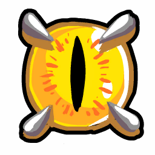
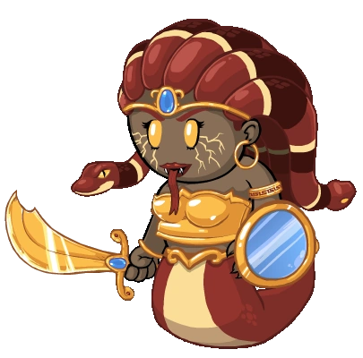

# Medusa

- **Facción:** Coven  · *fase posterior (referencia)*
- **Página de la wiki:** Medusa (ToS)

## Ficha

**Clase (alineamiento):**

> Coven Evil

**Tipo:**

> Manipulate
> Killing
> Unique

**Prioridad de acción:**

> 3, 5 (directly visiting)

**Resumen:**

> You are a snake haired monster with a gaze of stone.

**Objetivo:**

> Kill all who would oppose the Coven.

**Habilidades:**

> You may choose to Stone Gaze all visitors at night.

**Atributos:**

> Detection Immunity (with the Necronomicon)
> Attack: Powerful
> Defense: None

**Atributos (texto):**

> You may choose to stone gaze thrice.
> With the Necronomicon, you may visit players and turn them to stone.

**Especial:**

> Coven chat
> Unique Role
> Can inherit the Necronomicon on Night 3

**Si hay Godfather/otro objetivo:**

> With the Necronomicon:
> Deal a Powerful attack to target

**Usos:**

> 3

**Resultado Investigator:**

> Coven Expansion Results
> Your target could be a .

**Resultado Consigliere:**

> Your target has a gaze of stone. They must be Medusa.

## Texto completo de la wiki

| 

 | Looking for the Town of Salem 2 role?

This role appears in Town of Salem 1 and 2. For the ToS 2 counterpart, see Medusa.

 | 

 | This page describes content that can only be accessed in the Coven Expansion.

Medusa 

Alignment

 Coven Evil

Avatar

Immunities

Detection Immunity (with the Necronomicon)

Attack: Powerful

Defense: None

Special

 Coven chat

Unique Role

Can inherit the Necronomicon on Night 3

 Ability Stats

 | Type

 | Priority

 | Uses

 | Manipulate

Killing

Unique

 | 3, 5 (directly visiting)

 | 3

Actions

Target self

Deal a Powerful attack to visitors

Target other

With the Necronomicon:

Deal a Powerful attack to target

Investigation Results

 Sheriff

Without the Necronomicon:

Your target is suspicious or framed!

With the Necronomicon:

You cannot find evidence of wrongdoing. Your target is innocent or great at hiding secrets!

 Investigator

 Coven Expansion Results

Your target could be a Survivor, Vampire Hunter, Amnesiac, Medusa, or Psychic.

 Consigliere

Your target has a gaze of stone. They must be Medusa.

Game Information

Summary

You are a snake haired monster with a gaze of stone.

Abilities

You may choose to Stone Gaze all visitors at night.

Attributes

You may choose to stone gaze thrice.

With the Necronomicon, you may visit players and turn them to stone.

Goal

Kill all who would oppose the Coven.

 Victory Conditions

 | Wins with

 | Must kill

 | Coven

 Survivor

 | Town

 Mafia

 Vampires

 Arsonist

 Serial Killer

 Werewolf

 Plaguebearer

 Pestilence

 Juggernaut

 | 

 | DISCLAIMER: These stories are fanmade, and are not created or endorsed in any way by BlankMediaGames or Digital Bandidos.

A blind old woman sits deadly still on an armchair, brushing a finger over the raised dots printed on the pages of her book.

An esteemed Medium, forced to quit the job due to vision problems. A normal introduction, yet from then on, the Town began labeling her with a moniker she would covertly despise: the “crazy lady”. Neighbors would complain about eerie hissing noises coming from inside her house late at night. Whisperings would link the woman to a number of disappearances which only began to surface after her arrival. Rumors would pop up claiming that the missing looked exactly like the terrifying marble statues on her garden, unwillingly protecting her abode. She knew someone would go out of their way again to approach her and uncloak the arising suspicion surrounding the circumstances.

The blunt Sheriff was standing on her porch, impatient and eager to ask a few questions. He was smart, he was concise, and his interrogations quickly led him to an undisputable conclusion: she was a member of that cult of witches, the Coven. A threat to tell the Town was all the Medusa could take. Unveiling a head of snakes and a monstrous visage, she forcefully gripped the Sheriff’s face in her cold, bony hands and glared into the helpless man’s soul. The enraged Medusa unleashed upon him all the pain she had ever went through, from a wretched birth, to the curse of Athena, up to now, a laughingstock shunned by society. Faltering not her immobilizing gaze until the once-famed deputy was now nothing more than a new addition to the Gorgon’s assortment of figurines.

A blind old woman sits deadly still on an armchair. Dare you look her in the eyes, and suffer a same fate?

Mechanics[]

The Medusa can select themselves to Stone Gaze all visitors to their home thrice each night. All visitors are dealt a Powerful Attack, and their role and Last Will is cleared from everyone, including the Medusa themselves.

They will be shown as stoned in the graveyard.

 Amnesiacs cannot attempt to remember a Stoned person's role.

 Retributionists and Necromancers cannot reanimate Stoned targets.

If a Janitor cleans a stoned target, the target will show as cleaned instead. The Janitor will receive the role and Last Will in this case.

Roles that visit you will still use their action on you. (e.g a Blackmailer will still Blackmail you, a Transporter will still Transport you, and a killing role will still kill you.)

If an Arsonist Douses you, you will remain Doused the rest of the game, being susceptible to Ignitions.

If a Transporter Transports you, it will still follow through. This means whoever was intending to visit you will be saved, while anyone who was visiting the other person transported will die from you.

With the Necronomicon, you may directly visit players instead, dealing a Powerful Attack to them.

You will still clear a player's role and Last Will when you visit a player.

You will not receive the Necronomicon if there's at least one other Coven member alive.

Strategy[]

Like the Veteran, the Medusa relies on visits to get kills before they get the Necronomicon. Refer to the Veteran page on how to make the most of this ability (remember that most Veteran strategies that have a high chance of attacking Townies will work better as the Medusa).

Unlike the Veteran, however, you should note that you still need to avoid being recognized as the killer afterwards. This can be a problem if you bait people since players may look back and try to figure out who the stoned players might have visited and why.

Using your Stone Gaze does not give you any type of Defense, so you will be killed if a killing role visits you. However, they will be stoned as well.

You can be role-blocked. This prevents your gaze from taking effect on the role-blocker, and anyone can safely kill you.

The Necronomicon allows you to visit people and turn them to stone. Use this to kill enemies with Defense such as the Godfather and Neutral Killings.

An added benefit to directly stoning is that the Town may think a threat is dead when you are killed by a killer, and someone gets turned to stone.

You can still gaze at home to kill potential visitors or a Transporter baiting you into attacking yourself provided you still have gazes left, as they do not increase even if you have the Necronomicon.

The Coven Leader can force people to visit you, allowing you to kill reliably prior to obtaining the Necronomicon.

An added advantage to this is that the Coven Leader learns the role of the person they're sending to their doom, allowing a member of the Coven to use it as claim-space.

Remember, however, that you do not gain Defense when using your Stone Gaze, so they need to be careful to avoid directing potential killers to you.

You can also save your Stone Gazes for a later time if needed, especially if the Coven Leader has the Necronomicon.

Considering the fact you can Stone Gaze specific people with the Necronomicon, consider Stone Gazing the first two nights, especially if you are the only Coven member on your team.

Using certain voting patterns or leading the hang on someone can lead some guaranteed Townies into visiting you.

If you know who is a Transporter, whispering them saying "role or I shoot" can bait the Transporter into visiting you.

Your ability to visit once you have the Necronomicon can sometimes be used to frame other Townies as the Medusa; if everyone knows who someone is visiting on a particular night, stoning the visitor might make people think the person they visited was the Medusa.

Once you have the Necronomicon, it may be recommended to start hunting for roles with defense (especially the Neutral Killings or Plaguebearer), since those roles can pose a danger in the late game.

You can ask for Town Protectives or Lookouts to protect you (this usually doesn't attract killing roles). If you were jailed, claim you were Veteran baiting or that you're Mayor. Alternatively, you can just claim you didn't want to die Night 1.

Using this strategy, it might also be good idea to claim Psychic give a fake result. Not only does it fit into your investigative result, it's also easy to fake and usually believed by the town. After this, you can ask for Town Protective roles to protect you the next night, at which point you will be able to kill them easily. Be cautious when using this strategy though, as smart townies might call you out for medusa baiting, especially if multiple people end up stoned the next night.

You can claim to be " Crusader on Jailor" or " Crusader on lead Crusader" to bait some Town Protectives into you as a suicide tactic.

An added bonus is that Tavern Keepers have a lower chance of role-blocking you since you are "protecting" the Jailor/ Crusader. Doing this for a confirmed Townie (like a Mayor) can have a similar effect.

Claiming to be Poisoned might lead some potential Doctors into you.

Claiming Survivor might lead some potential Town Investigatives or Consiglieres into you.

Do not ask the Potion Master to heal you if you are stone Gazing at home as the Potion Master will die to your Stone Gaze.

You can, however, ask the Necromancer to use a corpse to heal/protect you as they do not visit you with their ability.

Dealing with Medusas[]

Dealing with the Medusa is very similar to dealing with a Veteran, but unlike the Veteran, the Medusa is a target to the Town as well. When someone is stoned, look back to see who they might have visited; that person could be the Medusa.

Keep in mind who you visit on a night that someone else dies to the Medusa. There's a very high chance that your target is not the Medusa (unless a Transporter transported your target and another player).

Additionally, a Medium or a Janitor (who Cleaned a Stoned target) can determine who stoned people visited.

However, it is important to remember that once the Medusa has the Necronomicon, they can visit offensively; after the Coven has the Necronomicon, you can't automatically conclude that the person a stoning victim visited was the Medusa unless you're certain the Necronomicon is held by someone else.

A way to tell that the Necronomicon is held by another Coven member is by their unique kill message, a Poisoner's incurable message, or two Potion Master kills in a row.

Remember that the Medusa only has 3 Stone Gazes, so if you have to investigate or kill them, you have a good chance of catching them unprotected after 2-3 nights.

You can also Roleblock them as a Bootlegger, allowing the Mafioso/ Godfather to kill her safely; unlike the Veteran, the Medusa is not immune to being role-blocked.

You can safely search for the Medusa with the help of a confirmed Doctor or Crusader.

If you get stoned before the Necronomicon is held by a player, don't leave the game. As long as you weren't controlled, there is a good chance the person you visited was the Medusa who Stone Gazed that night. It's recommended you tell this to a Medium.

Achievements[]

 | Name

 | Description

 | Merit Points

 | Gaze of Stone

 | Win 1 game as Medusa

 | 20

 | House of Rock

 | Win 5 games as Medusa

 | 20

 | Dust to Dust

 | Win 10 games as Medusa

 | 40

 | Rubble, Rubble, Soil, and Trouble

 | Win 25 games as Medusa

 | 100

 | A Rockin Party

 | Turn 3 players into stone in a single night

 | 40

 | Stone Wall

 | Turn a revealed Mayor to stone

 | 30

 Only achievable with the Necronomicon as Mayor cannot visit.

Messages[]

 | 

 | You have (#) stone gaze(s) left.

 | Amount of Stone Gazes left.

 | You turned someone to stone.

 | Displays at the end of the Night to Medusa when they choose to Stone Gaze at home and Stoned a player. Will appear multiple times if Medusa Stoned multiple people.

 | You were turned to stone.

 | Displays at the end of the Night when a player visits Medusa while gazing. Will also appear if Medusa visits the player.

 | [They were] turned to stone by Medusa. or [They were] also turned to stone by Medusa.

 | Cause of death for a player stoned by Medusa, with or without the Necronomicon.

Trivia[]

The Medusa is the only Coven role that can directly kill a Neutral Killing role other than the Hex Master.

Unlike an Ambusher, Medusa CAN attack their visiting teammates (most notably, the Potion Master).

The Medusa is one of two guaranteed Coven roles in Coven Ranked and Coven Ranked Practice, the other being the Coven Leader.

The Medusa is the only Coven role possible in all Coven Expansion game modes, except for Mafia Returns, which lacks the Coven entirely.

History[]

3.2.4

Temporary Defense given by certain roles through game mechanics now give attackers the message "Your target's defense was too strong to kill.".

3.2.3

Dead Coven members will now see the Medusa with Necronomicon's targets.

 Trapper will no longer die to Attack if another Trapper has placed a Trap on them.

Dual Trappers can now save each other if they have placed Traps on each other and both are attacked.

3.1.14

Added Medusa vs. Transporter stalemate detector.

2.5.5.12200

The Medusa's role icon has been changed. Old one was .

Added Medusa's circled role icon ().

2.5.1.10655

Fixed Guardian Angel "target was attacked" feedback.

2.3.2.9706

 Medusa vs. Tavern Keeper is now a Coven victory.

Fixed an issue where if you were attacked by Medusa, healed, but killed by a role with a higher attack, you would still show up as stoned.

2.0.0.6582

Introduced.

 | 

 | 
Roles

 | 

 | 

 | 
 Town

 | 

 | Town Investigative | | Investigator • Lookout • Psychic • Sheriff • Spy • Tracker | | 

 | 

 | Town Killing | | Jailor • Vampire Hunter • Veteran • Vigilante

 | 

 | Town Protective | | Bodyguard • Crusader • Doctor • Trapper

 | 

 | Town Support | | Mayor • Medium • Retributionist • Tavern Keeper • Transporter

 | 
 Mafia

 | 

 | Mafia Deception | | Disguiser • Forger • Framer • Hypnotist • Janitor | | 

 | 

 | Mafia Killing | | Ambusher • Godfather • Mafioso

 | 

 | Mafia Support | | Blackmailer • Bootlegger • Consigliere

 | 
 Coven

 | 

 | Coven Evil | | Coven Leader • Hex Master • Medusa • Necromancer • Poisoner • Potion Master | | 

 | 
 Neutral

 | 

 | Neutral Benign | | Amnesiac • Guardian Angel • Survivor | | 

 | 

 | Neutral Evil | | Executioner • Jester • Witch

 | 

 | Neutral Killing | | Arsonist • Juggernaut • Serial Killer • Werewolf

 | 

 | Neutral Chaos | | Pirate • Plaguebearer/ Pestilence • Vampire

## Implementación

- [ ] Definido en `packages/engine` con su prioridad y facción
- [ ] Acción nocturna (si aplica) validada con objetivos legales
- [ ] Resultado de investigación correcto (Sheriff / Investigator / Consigliere)
- [ ] Condición de victoria y de derrota comprobada en tests
- [ ] Tests unitarios del rol en verde
- [ ] Tarjeta y texto de ayuda en la app
- [ ] Icono e ilustración propia (no el arte de la wiki)
- [ ] Plantillas de narración para sus eventos
