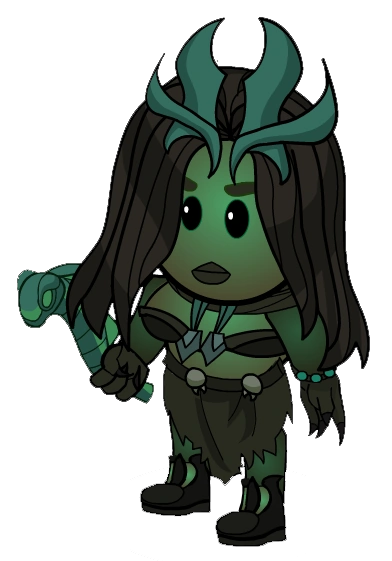

# Necromancer

- **Facción:** Coven  · *fase posterior (referencia)*
- **Página de la wiki:** Necromancer (ToS)

## Ficha

**Clase (alineamiento):**

> Coven Evil

**Tipo:**

> Special
> Killing
> Unique

**Prioridad de acción:**

> 1

**Resumen:**

> You are an evil sorceress who has a grudge against the town.

**Objetivo:**

> Kill all who would oppose the Coven.

**Habilidades:**

> You may reanimate a dead player and use their ability on a player.

**Atributos:**

> Roleblock Immunity
> Control Immunity
> Detection Immunity (with the Necronomicon)
> Attack: None
> Defense: None

**Atributos (texto):**

> Create zombies from dead players who use their abilities on your second target.
> Each zombie can be used once before it rots.
> With the Necronomicon, select yourself to summon a ghoul to Basic attack your target.

**Especial:**

> Coven Chat
> Unique Role
> Can inherit the Necronomicon on Night 3

**Si hay Godfather/otro objetivo:**

> Use ability of reanimated target on second target

**Resultado Investigator:**

> Coven Expansion Results
> Your target could be a .

**Resultado Consigliere:**

> Your target uses the deceased to do their dirty work. They must be the Necromancer.

## Texto completo de la wiki

| 

 | Looking for the Town of Salem 2 or Traitors in Salem role?

This role appears in Town of Salem 2 and Traitors in Salem. For the ToS 2 counterpart, see Necromancer and for the TiS counterpart, see Necromancer.

 | 

 | This page describes content that can only be accessed in the Coven Expansion.

Necromancer 

(Necro)

Alignment

 Coven Evil

Avatar

Immunities

 Roleblock Immunity

 Control Immunity

 Detection Immunity (with the Necronomicon)

Attack: None

Defense: None

Special

 Coven Chat

Unique Role

Can inherit the Necronomicon on Night 3

 Ability Stats

 | Type

 | Priority

 | Special

Killing

Unique

 | 1

Actions

Target self

With the Necronomicon:

 Raise a ghoul to attack your target

Target other

Use ability of reanimated target on second target

Investigation Results

 Sheriff

Without the Necronomicon:

Your target is suspicious or framed!

With the Necronomicon:

You cannot find evidence of wrongdoing. Your target is innocent or great at hiding secrets!

 Investigator

 Coven Expansion Results

Your target could be a Medium, Janitor, Retributionist, Necromancer, or Trapper.

 Consigliere

Your target uses the deceased to do their dirty work. They must be the Necromancer.

Game Information

Summary

You are an evil sorceress who has a grudge against the town.

Abilities

You may reanimate a dead player and use their ability on a player.

Attributes

Create zombies from dead players who use their abilities on your second target.

Each zombie can be used once before it rots.

With the Necronomicon, select yourself to summon a ghoul to Basic attack your target.

Goal

Kill all who would oppose the Coven.

 Victory Conditions

 | Wins with

 | Must kill

 | Coven

 Survivor

 | Town

 Mafia

 Vampires

 Arsonist

 Serial Killer

 Werewolf

 Plaguebearer

 Pestilence

 Juggernaut

 | 

 | DISCLAIMER: These stories are fanmade, and are not created or endorsed in any way by BlankMediaGames or Digital Bandidos.

Death is a natural part of life, is it not? If so, then why is it feared? Why are we sad when a loved one dies? Shouldn't we be happy that they're in a better place?

A little girl sobbed as she looked at the grave of her long-deceased father. Her mother had resorted to drinking, and was very rarely sober enough to interact with her own daughter. The girl had no friends of any sort, and she wasn't really interested in anyone at school. She was alone.

The next day, however, everything changed – for better or worse. Whilst absentmindedly flicking through channels on the television, she caught a glimpse of a news article sitting on the table in front of her. Turning the TV off, she picked up the paper and began to read. It spoke of many trivial events, but there was one particular entry that caught her eye.

"WOMAN COMES BACK TO LIFE! MOTHER AND SON REUNITED!"

Her heart stopped. Come back to life? Surely that was impossible! But the more she thought about it, the more she hated the thought of someone else returning from death. What made that woman so special? Why didn't her father come back? It was so unfair! She stewed in her anger and envy, the first of many bad thoughts to come...

Over the next few months, she researched the art of necromancy. She pored over the books in her local library, often staying up all night. All she wanted was to bring back her father. Eventually, she found a lead. A simple, black-covered book that exuded evil. She almost recoiled from its presence… but it was just so tempting. She knew, instinctively, that it would get her dad back. However, there was one thing she didn't account for. Death is final for a reason…

The ritual went without a hitch, and she saw her beloved papa’s corpse dig its way through the soil he was buried in. But it wasn’t the same man she had known her whole life. He was a pawn. A minion. And the girl knew it. The Necronomicon had corrupted her, twisted her mind. She grinned ferally at the shadow of her father. It was time to repay the world for all the suffering she went through.

Mechanics[]

The Necromancer has the ability to Reanimate a dead player and use their ability on another living player. The corpse then rots, allowing only one time of usage per corpse.

You will visit your first target in the graveyard. A Spy will see a member of the Coven visiting the deceased target and a Tracker can also see you visiting the target you choose to Reanimate. Be very careful as both of these roles will know that a Necromancer or Retributionist (only for Tracker, as Spy can see that you are a Coven member) is in play and may as well also reveal you.

If a Retributionist selects the same first target as you do on the same Night, the game will randomly choose who gets to use the corpse. The other player will be notified the corpse was missing from the graveyard but they can still use that corpse on a future Night.

The corpse performs the second visit, not you. The corpse itself is then subjective to anything a normal player would be. A Lookout can see the dead player visiting their target, and a Bodyguard or Trap from a Trapper will respond against your reanimated player. Likewise, a Werewolf or Pestilence rampage at your second target's location will not harm you.

You cannot reanimate a player who has been cleaned by the Janitor or stoned by the Medusa, much like a Retributionist. Reanimating a player Forged by a Forger will have the player use the abilities of their true role on the second target.

You have Roleblock Immunity, meaning that you will be able to control a corpse even if a Pirate, Tavern Keeper, or Bootlegger role-blocks you.

Unlike the Retributionist, you cannot use corpses on yourself (this may be a bug).

When you have the Necronomicon, you have the added ability of selecting yourself as your first target to summon a Ghoul and deal a Basic Attack onto your second target.

When somebody dies to your Ghoul, the message that appears will be "He/She was killed by the Necromancer's Ghoul".

A Bodyguard or Trapper protecting the target you choose to attack with your Ghoul will produce the messages, "Your ghoul was attacked by a Bodyguard!", and "Your ghoul was stopped in its tracks by a trap!".

If you attack a jailed player with your Ghoul, you will not get a message about the target being in Jail.

If your target was a Guardian Angel, they will protect their normal target, regardless of your choice of target.

If you use a killing role from the graveyard who has a Death Note active, it will show theirs instead. Any changes to it postmortem will not register.

If you reanimate Pestilence, they will rampage at the place you target, but will also attack you for visiting them in the graveyard (due to Pestilence automatically attacking all visitors, even when dead). Anyone who visits you will not be affected. It is therefore possible to use Pestilence safely by having a Potion Master heal you.

There is an ongoing bug that sometimes causes reanimated corpses (including Necromancer's Ghoul) to ignore transportation.

There is an inconsistent bug that sometimes causes reanimated corpses to be invisible to Lookouts, Trappers and even Spies. This has been happening ever since the QoL patch on October 20th, 2024. 
The icon that displays next to a player in the graveyard after you have used their body

Below is a table of what corpses you can use. Do keep in mind that if you were previously an Amnesiac, any corpses already used by the late Necromancer will be unusable to you.

Reanimating a target - Effects on different roles[]

 | Role

 | Usable?

 | Effects

 | Strategy 

 | Town Investigative

 | (except Psychic)

 | Causes the corpse to perform their ability on the target, which will be noticed by Lookouts, Trappers, or a Veteran on alert. You will get their results.

 | Use these individuals to get investigative results to figure out a player's role or to prove yourself as an investigative role.

 | Jailor

 | 

 | 

 | 

 | Vampire Hunter

 | 

 | Will stake the target if they are a Vampire.

 | If there are Vampires remaining, use it to stake known ones. Otherwise, use it to sweep for traps.

 | Veteran

 | 

 | 

 | 

 | Vigilante (with bullets)

 | 

 | Will shoot the target. The Necromancer is not affected by guilt.

 | Using the Vigilante is recommended as it gives the Coven an extra kill; it can also be used to "confirm" yourself or one of your fellow Coven as a Vigilante. If using it to confirm, be certain that your target is not Town; otherwise, you will be revealed when you fail to suicide.

 | Vigilante (without bullets)

 | 

 | No effect.

 | You can use it to pretend to be a Retributionist to a Lookout or Tracker.

 | Bodyguard

 | 

 | Will protect the target and counterattack one attacker. The Necromancer will not die from guarding.

 | Use it to protect a fellow Coven member. Note, however, that someone dying to a Bodyguard without the Bodyguard also dying will cast suspicion on the protected, and should only be used as a last-ditch effort. Another strategy is for the protected Coven not to claim protected, although this can sometimes be difficult to hide and comes with some risks.

 | Crusader

 | 

 | Will protect the target, and attack one visitor.

 | While you can use it to protect a fellow Coven member, you can also use it to kill anyone watching a priority target, such as a Bodyguard, Doctor, Lookout, or Trapper on the night they trap. Be sure to warn your fellow Coven members not to visit your ghoul's target in case the Crusader attacks your teammate.

 | Doctor

 | 

 | Will heal the target.

If the second target is a revealed Mayor, they will visit but not heal the second target.

 | You can use it to heal a fellow Coven member.

 | Trapper

 | 

 | 

 | 

 | Town Support (excluding Tavern Keeper)

 | 

 | 

 | 

 | Tavern Keeper

 | 

 | Will role block the target.

 | You can use either to keep roles such as a known Mafia Killing, Vigilante or Werewolf at bay. Bear in mind that the Werewolf still kills any visitors, so warn your fellow Coven in advance, or to confirm yourself as an Tavern Keeper.

 | Ambusher

 | 

 | Ambushes a random visitor to the target. Visitors will see that your ghoul is lying in ambush. If they have a saved Death Note, it will be shown.

 | Use it to kill anyone watching a priority target, such as a Bodyguard, Doctor, Crusader, Lookout, or Trapper on the night they trap. Note that it can kill fellow Coven members, will alert the Town to your presence, and cannot kill other Mafia members.

 | Godfather

 | 

 | Will attack the target as a separate Mafia kill. If they have a saved Death Note, it will be shown.

 | While the Godfather is a straightforward killer, bear in mind that two Mafia kills in one night will reveal the presence of a Necromancer.

 | Mafioso

 | 

 | Will attack the target as a separate Mafia kill. If they have a saved Death Note, it will be shown.

 | While the Mafioso is a straightforward killer, bear in mind that two Mafia kills in one night will reveal the presence of a Necromancer.

 | Disguiser

 | 

 | Visits the target.

 | Use to sweep for traps.

 | Forger

 | 

 | Forges the will to the last forged outcome prior to death, if the target is killed.

 | Use can confuse town. Forging the right Town Investigative can discredit other Town Investigative claims and/or frame or make someone look suspicious. However, it may detriment the Coven, as the forgery cannot be modified.

 | Framer

 | 

 | Frames the target.

 | Makes the target appear suspicious until investigated. Used to discredit Sheriff or Investigator claims or to sweep for traps.

 | Hypnotist

 | 

 | Will hypnotize the target with the last selected message. If no message was selected, it will default to "You were transported to another location."

 | Has very limited use unless the prior message chosen is known. Use it to sweep for traps.

 | Janitor

 | 

 | Will clean the target if they are killed. Only the dead Janitor will receive the information.

 | Coven kills that are Cleaned will generally alert the town to your presence. Can be used to destroy information.

 | Blackmailer

 | 

 | Blackmails the target.

 | Use this to one-off silence a target, while also sweeping them for traps.

 | Consigliere

 | 

 | Investigates the target. You will get the ghoul's results.

 | Use to reveal a player's true role, while also sweeping them for traps.

 | Bootlegger

 | 

 | Will role block the target.

 | You can use either to keep roles such as a known Mafia Killing, Vigilante or Werewolf at bay. Bear in mind that the Werewolf still kills any visitors, so warn your fellow Coven in advance, or to confirm yourself as an Tavern Keeper.

 | Coven Leader

 | 

 | 

 | 

 | Hex Master

 | 

 | Hexes the target.

 | Can permanently frame a target, and if all other non- Coven members have been hexed, will deal an Unstoppable Attack to all hexed players.

 | Medusa

 | 

 | 

 | 

 | Necromancer

 | 

 | 

 | 

 | Poisoner

 | 

 | Poisons the target. The poison is curable by a Doctor. Their Death Note remains intact.

 | It is generally preferable to outright kill a target with your ghoul, if available. Otherwise, it adds firepower, but is liable to alert the Town to your presence.

 | Potion Master

 | 

 | 

 | 

 | Guardian Angel

 | 

 | Forces the Guardian Angel to use a protection on their target. No effect if no protections remain. No effect if the Guardian Angel with remaining protections has left the game (this may be a bug).

 | If their target is an enemy, use them to waste any available protections, allowing Coven to know when it's safe to kill them.

 | Other Neutral Benigns

 | 

 | 

 | 

 | Neutral Evils

 | 

 | 

 | 

 | Arsonist

 | 

 | Douses the target. It is impossible to force the deceased Arsonist to ignite.

 | This is only uniquely useful if there is a second Arsonist. Otherwise, it only serves as a means to trip traps and permanently change someone's Investigator results to Bodyguard, Godfather, Arsonist, or Crusader.

 | Juggernaut

 | 

 | Attack varies based on the level of the deceased Juggernaut. Their Death Note remains intact.

 | Using a Juggernaut makes it obvious that a Necromancer exists. The Juggernaut is always useful for taking out the Veteran or anyone with Basic Defense. If the Juggernaut has killed at least two people, it may be more useful for its rampage ability. If the Juggernaut has killed at least three people, it may be more useful for breaking Town Protective chains.

 | Serial Killer

 | 

 | Sends the Serial Killer to kill the target. Their Death Note remains intact.

 | Bear in mind that using a Serial Killer is almost guaranteed to alert everyone to the presence of a Necromancer depending on the role list. Barring this, reanimating the Serial Killer is almost always a good idea as it gives an extra kill for the Coven.

 | Werewolf

 | 

 | On Nights 1 & 3, the Werewolf corpse will not do anything, and waste the corpse. On Full Moon Nights, the Werewolf rampages at the target's house. Their Death Note remains intact.

 | Using a Werewolf makes it obvious that a Necromancer exists. However, its powerful rampage ability is likely to catch people off guard, and kill several Town members in the process. Also useful for taking out the Veteran or anyone with Basic Defense.

 | Pirate

 | 

 | 

 | 

 | Plaguebearer

 | 

 | Infects the target.

 | Use it to sweep for traps, but otherwise it is ineffective unless an Amnesiac remembers Plaguebearer.

 | Pestilence

 | 

 | Rampages at the target's house.

 | The Pestilence will attack the Necromancer for visiting them. Useful to take down any roles with Basic Defense as long as you have a Potion Master available to heal you, or can be used as a last-ditch effort if no other pathways to victory exist.

 | Vampire

 | 

 | (Note that this corpse is currently bugged and using it seems to have no effect)

Is supposed to send a Vampire to convert second target. If target cannot be converted, Vampire is supposed to perform a basic attack instead.

 | If the target is converted, Vampires will gain an added member, and must wait a day to convert again if all previous Vampires were dead. Former Vampire Hunters turned Vigilantes will not revert back to Vampire Hunters. This may be useful If there is a known Mafia member, but otherwise it is largely ineffective as it simply gives more numbers to the Vampires, and has no effect on other Vampires.

Strategy[]

Only use killing roles if you really need someone dead. If you have no killers, a Tavern Keeper or a Bootlegger is a slightly less-effective alternative to keep them occupied for the Night. Hopefully, it will buy you time to get a more permanent solution.

If you think that someone in the Coven or an ally is going to be attacked, Reanimate a Town Protective role and protect them.

You can use this to protect a Stone Gazing Medusa with no risk to yourself unlike the Potion Master.

Alternatively, if you know who the attacker is, consider reanimating a Tavern Keeper or Bootlegger to roleblock them. This will buy your friend an extra Night to prepare.

Keep other powerful roles with the abilities to kill, protect, or heal in the late game. This will serve to sustain your faction, especially when you are the only member left.

Later in the game, you may select yourself to summon Ghouls, or you may continue to use dead corpses. Planning with the other Coven members on when to use a corpse and when to attack will help in providing the most efficient use of your role.

 Crusaders can also be your toys to kill enemies. Using their ability to visit important members such as the Mayor or Psychic can help you kill members trying to protect or watch over them.

Several roles can be used to confuse the Town about the role list or to fake a claim yourself:

Controlling the Vigilante can be used for deception. Accidentally killing an evil role makes you able to claim Vigilante, since the message will say that the Vigilante killed them.

This should be done with caution, however, since smart Townies will often suspect a Necromancer, especially if you've done anything else that makes your presence obvious.

Other killing roles, like Crusaders, can be also used for tricking the Town to make them look like you did the job.

However, make sure your claim fits on the role list. Otherwise, you'll be spotted as a Necromancer and hanged almost instantly.

Additionally, Lookouts that watch your target will see your zombie, and Trackers that watch you will see you visit a dead person; either of these will make your deception obvious.

Note that you can fake roles like this for other members of the Coven, not just yourself.

Controlling a Guardian Angel will produce an immediate message to the entire Town, which can be useful for claiming those roles yourself, though Town members may grow suspicious at the coincidence of a second Guardian Angel claiming to protect the same target as the first.

All actions against someone jailed by the Jailor will fail, including those you control as a corpse. If a Coven member is imprisoned, it is not advised to use a corpse against them. Instead, focus on finding or potentially killing the Jailor.

Your role is not very useful early-game, when not many roles are dead, let alone killing or protecting roles. However, later in the game, the diversity the Necromancer is capable of swinging the tide in the Coven's favor.

Since you don't visit the target yourself, you can attack a Veteran or someone who is guarded by a Town Protective role at little risk to yourself. In fact, sending a zombie to attack someone who is guarded by a Bodyguard is an excellent way to kill said Bodyguard, removing a significant threat to the Coven.

You can use a dead Bodyguard (or any other Town Protective) to protect a fellow Coven member. Note, however, that if a Lookout is watching that member, it will cast suspicion on the Coven member if you die and are revealed to be a Necromancer. Why would the Necromancer use a dead Bodyguard to protect someone if they aren't a part of the Coven? Therefore, only use this as a last-ditch effort to save their life if you know or suspect that a Lookout exists.

You can use the zombie of a Tavern Keeper or Bootlegger to roleblock a Serial Killer or Werewolf safely. Be careful when blocking a Werewolf. Make sure no other Coven members are visiting them, since you're forcing the Werewolf to stay home and kill all visitors.

If you have the Necronomicon and there are dead killing roles whose corpses you haven't used yet, you may want to use them to attack instead of your ghoul. This will delay revealing to the Town that you have the Necronomicon, leaving more ambiguity as to the composition of the Coven. However, if you have roles that have a Powerful Attack (like the Werewolf), it is generally recommended to save them for more immune roles like the Godfather.

You can use a deceased Arsonist to douse someone, permanently changing their investigative results. This is occasionally useful on Town to make them look like the Godfather, or on fellow Coven when their results would otherwise be even more suspicious; when dousing Coven, however, be wary of the possibility of a second Arsonist!

If you suspect a second Arsonist, save the Arsonist corpse for when you can find them. When you do, you can either Douse them to force them to waste a Night cleaning themselves. or time your douse to kill the Arsonist when they ignite.

You can alternatively use a Framer corpse to frame fellow Coven when their results would otherwise be even more suspicious without the risk of a second Arsonist.

 Trackers are quite dangerous to you; if they visit you on a Night when you reanimate someone, they will see you visit the graveyard. Keep in mind that the Retributionist is the only other role that visits the graveyard; your only options are therefore to either claim Retributionist (provided you reanimated a Townie) or to claim you were transported when a Tracker calls you out. Alternatively, you could try to cast doubt on the Tracker directly.

If you suspect a Tracker will visit you on a given Night, you should either stay home or go with a Retributionist claim and reanimate a Townie. Alternatively, you could use a dead Crusader or Ambusher to kill them if one is available.

The Forger can be a dangerous threat; they can deny you corpses to use if they forge someone as a non-visiting role, make your Retributionist claim look suspicious if you claim it, or even trick you into accidentally killing fellow members of the Coven by forging a killing role as a Town Protective role like Doctor or Bodyguard.

If you suspect a Forger has forged someone in the graveyard, don't use the corpse to protect your Coven members as they could be a killing role. Forgers should be dealt with as soon as possible before they forge a role that could have saved you the game.

You can use your ability to manufacture Mafia visits for the Spy. If there's a revealed spy announcing results, it can sometimes be useful to send harmless Mafia like a Framer to visit a fellow Coven member in order to make it clear they're not Mafia.

If you send a Vampire to someone who can be converted, you risk creating an additional enemy; for the most part, Vampires are more dangerous to you than Town is since they kill you when they try to convert you. Deliberately turning someone into a Vampire is therefore rarely a good strategy.

If you are certain someone is Mafia, you can use a Vampire to kill them; doing so has the added advantage of making both the Town and the Mafia believe that there are still Vampires left, which may draw their attention from you and get otherwise-confirmed people hanged.

If you are certain that someone is protected by a Bodyguard, sending a Vampire at them can kill the Bodyguard without wasting a killer's corpse.

Since using a Vampire to deliberately convert someone is such an unusual strategy, you can occasionally use it for complicated tricks. For instance, you can claim Lookout or Tracker, send a dead vampire convert someone, and say you saw the visit, then either convince the Town to hang the new Vampire or kill them yourself at Night in order to get the person you accused of visiting them hanged.

If you absolutely must remove someone's ability without killing them, sending a Vampire to visit them is an option.

Sending a vampire to bite the Mayor is usually a good strategy. If they're guarded by a Bodyguard, the Bodyguard will die; if not, you can instantly expose them as a Vampire the next morning at any time by whispering to them before they have a chance to do anything.

Just make sure you're not accidentally giving Vampires a majority by doing this.

Also be aware that if the other Vampires are dead and the Mayor-turned- Vampire may see they're the last Vampire, they can reasonably deduce that their accuser is likely to be a Necromancer and may be able to convince the Town of this even if they get hanged; meanwhile, if other Vampires are alive, they may realize that the extra, unexpected conversion must have come from a Necromancer and therefore guess that that Necromancer is probably the former Mayor's main accuser.

You can reanimate a dead Pestilence, but you will be attacked by them for visiting them even in the graveyard. Therefore, this should only be used as a last resort or if you have a Potion Master heal you.

You are one of the very few roles that can deal with Pestilence safely, provided the right corpses are available:

If a Bodyguard, Crusader, or Doctor is available, you can use it to protect someone from Pestilence for one Night. When using a Bodyguard or Crusader, Pestilence themselves will, of course, not die, but the zombie will still save whoever you assigned them to.

When Pestilence is present, you may want to avoid killing in order to keep the votes you'll need to hang them. If you're confident you'll still have the votes, though, you're also one of the few roles that can keep killing safely while Pestilence is around, since your indirect attack means you're immune to both their rampage and death from visiting them.

Note. However, unlike the Retributionist, you can not use corpses on yourself. Meaning you can not directly save yourself from Pestilence.

Dealing With Necromancers[]

The Necromancer is a large threat to the Town, as whenever you think you've gotten rid of a threat the Necromancer can resurrect them for one Night.

 Trackers are a great help, as they can catch a Necromancer red-handed with ease. As a Tracker, if you see someone visit the graveyard (ie: Ann Sears is dead, you track John Willard to Ann Sears) call them out immediately. If they visit an evil role in the graveyard, it's even better to call them out as there is no threat of them being a Retributionist.

 Lookouts can be useful in detecting the Necromancer if they see a dead person visit their target. If a dead player visits somebody, then a Necromancer or Retributionist is confirmed to be in-game. If said dead player is a Town Protective and visits someone who did not ask to be protected, then the person you are watching may be a member of the Coven.

If, for instance, multiple Mafia roles kill in one Night, as in two kills by members of the Mafia, or multiple Neutral Killing deaths when only one can be available appear, a Necromancer is confirmed. Retributionist and Medium claims should be watched.

If a Vigilante is asked to shoot someone suspected of being a member of the Coven and they are protected, with a dead Doctor or Crusader, anybody who claims to have protected them could be the Necromancer.

If an Ambusher attacks a player, but one is in the graveyard already or all Mafia are dead, a Necromancer is still in the game.

If you are a Medium, and a dead Guardian Angel tells you they haven't used their ability, there is a Necromancer still in the game.

Achievements[]

 | Name

 | Description

 | Merit Points

 | Reanimate!

 | Win 1 game as a Necromancer

 | 20

 | Army of the Dead

 | Win 5 games as a Necromancer

 | 20

 | Day of the Dead

 | Win 10 games as a Necromancer

 | 40

 | Zombie Apocalpyse

 | Win 25 games as a Necromancer

 | 100

 | Renewed Bloodlust

 | Reanimate a Serial Killer

 | 20

 | Blood Moon

 | Reanimate a Werewolf on a Full Moon

 | 40

 | An Extinct Disease

 | Reanimate Pestilence

 | 100

 | Revived and Rejuvenated

 | Reanimate a Doctor to heal a Coven member

 | 20

 You will die from this unless healed.

Messages[]

 | 

 | You were attacked by a Necromancer!

 | Displays to a player who was killed by the Necromancer's Ghoul.

 | The corpse you targeted is missing!

 | Displays to the Necromancer when the corpse they targeted has already been used previously.

 | Your minion's target's defense was too strong to kill.

 | Displays to the Necromancer when their target has a higher Defense than their zombie's Attack value.

 | [They were] killed by the Necromancer's Ghoul. or [They were] also killed by the Necromancer's Ghoul.

 | Cause of death for a player attacked and killed by the Necromancer's Ghoul.

 | Your ghoul was attacked by a Bodyguard!

 | Displays to the Necromancer when their ghoul gets attacked by a Bodyguard.

 | Your ghoul was stopped in its tracks by a trap!

 | Displays to the Necromancer when their ghoul gets attacked by a Trap.

Trivia[]

According to the game's lore, the Necromancer's name is Bakt. The Necromancer, before joining the Coven, used to live in a pyramid approximately 3.000 years in the past.

Despite some rumors, a Jester’s haunt cannot be controlled by the Necromancer.

History[]

3.2.4

The Necromancer can no longer use their protective role first target on themselves.

 Necromancer can now receive messages from their first target (e.g. reanimating a Sheriff and finding someone as "suspicious").

 Necromancer uses in-place secondary targeting rather than a slide-out secondary menu.

Temporary Defense given by certain roles through game mechanics now give attackers the message "Your target's defense was too strong to kill.".

Reanimated Ambusher will no longer attack roles that attempted to visit but were role blocked.

 Necromancer reanimate actions are now displayed correctly to teammates.

Fixed a variety of bugs whereby a role would improperly earn an achievement when reanimated by a Necromancer.

3.2.3

 Necromancer no longer receives two messages when selecting self to summon a ghoul.

 Necromancer reanimate actions are now displayed correctly to teammates.

 Trapper will no longer die to Attack if another Trapper has placed a Trap on them.

Dual Trappers can now save each other if they have placed Traps on each other and both are attacked.

Fixed Coven teammates seeing zombie targeting message when Necromancer summons a ghoul.

2.5.5.12200

The Necromancer's role icon has been changed. Old one was .

Added Necromancer's circled role icon ().

2.5.1.10655

Fixed Guardian Angel "target was attacked" feedback.

2.0.0.6582

Introduced.

 | 

 | 
Roles

 | 

 | 

 | 
 Town

 | 

 | Town Investigative | | Investigator • Lookout • Psychic • Sheriff • Spy • Tracker | | 

 | 

 | Town Killing | | Jailor • Vampire Hunter • Veteran • Vigilante

 | 

 | Town Protective | | Bodyguard • Crusader • Doctor • Trapper

 | 

 | Town Support | | Mayor • Medium • Retributionist • Tavern Keeper • Transporter

 | 
 Mafia

 | 

 | Mafia Deception | | Disguiser • Forger • Framer • Hypnotist • Janitor | | 

 | 

 | Mafia Killing | | Ambusher • Godfather • Mafioso

 | 

 | Mafia Support | | Blackmailer • Bootlegger • Consigliere

 | 
 Coven

 | 

 | Coven Evil | | Coven Leader • Hex Master • Medusa • Necromancer • Poisoner • Potion Master | | 

 | 
 Neutral

 | 

 | Neutral Benign | | Amnesiac • Guardian Angel • Survivor | | 

 | 

 | Neutral Evil | | Executioner • Jester • Witch

 | 

 | Neutral Killing | | Arsonist • Juggernaut • Serial Killer • Werewolf

 | 

 | Neutral Chaos | | Pirate • Plaguebearer/ Pestilence • Vampire

## Implementación

- [ ] Definido en `packages/engine` con su prioridad y facción
- [ ] Acción nocturna (si aplica) validada con objetivos legales
- [ ] Resultado de investigación correcto (Sheriff / Investigator / Consigliere)
- [ ] Condición de victoria y de derrota comprobada en tests
- [ ] Tests unitarios del rol en verde
- [ ] Tarjeta y texto de ayuda en la app
- [ ] Icono e ilustración propia (no el arte de la wiki)
- [ ] Plantillas de narración para sus eventos
