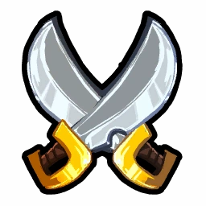
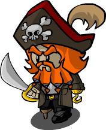

# Pirate

- **Facción:** Neutral  · *fase posterior (referencia)*
- **Página de la wiki:** Pirate (ToS)

## Ficha

**Clase (alineamiento):**

> Neutral Chaos

**Resumen:**

> You are a swashbuckler with an obsession for gold.

**Objetivo:**

> Successfully plunder two players.

**Habilidades:**

> Choose a player to plunder each night.

**Atributos (texto):**

> When you plunder a player, you will duel the player for their valuables.
> If the player defends against your attack, you get no loot.

**Gana con:**

> Town
> Mafia
> Coven
> Survivor
> Arsonist
> Serial Killer
> Vampire
> Werewolf
> Plaguebearer
> Pestilence
> Juggernaut

**Debe matar para ganar:**

> N/A (two successful plunders)

**Resultado Investigator:**

> Classic Results
> Your target could be a .
> Coven Expansion Results
> Your target could be a .

**Resultado Consigliere:**

> Your target wants to plunder the town. They must be a Pirate.

## Texto completo de la wiki

| 

 | Looking for the Town of Salem 2 role?

This role appears in Town of Salem 1 and 2. For the ToS 2 counterpart, see Pirate.

 | 

 | This page describes content that can only be accessed in the Coven Expansion.

Pirate 

Alignment

 Neutral Chaos

Avatar

Immunities

None

Actions

Day Ability

Select a target to duel.

Investigation Results

 Sheriff

You cannot find evidence of wrongdoing. Your target is innocent or great at hiding secrets!

 Investigator

Classic Results

Your target could be a Survivor, Vampire Hunter, or Amnesiac.

 Coven Expansion Results

Your target could be a Survivor, Vampire Hunter, Amnesiac, Medusa, or Psychic.

 Consigliere

Your target wants to plunder the town. They must be a Pirate.

Game Information

Summary

You are a swashbuckler with an obsession for gold.

Abilities

Choose a player to plunder each night.

Attributes

When you plunder a player, you will duel the player for their valuables.

If the player defends against your attack, you get no loot.

Goal

Successfully plunder two players.

 Victory Conditions

 | Wins with

 | Must kill

 | Town

 Survivor

 | N/A (two successful plunders)

 | 

 | DISCLAIMER: These stories are fanmade, and are not created or endorsed in any way by BlankMediaGames or Digital Bandidos.

After his ship, World's Wench, marooned at the cliffs, young Skullbeard had little to his name than a few choice of weapons. He needed to find wealth - fast.

No landlubber would suspect that the wanted sign, denouncing Skullbeard's name and face, with a lord-sized bounty on his head, would in fact be the newcomer to town.

When the Investigator retired to his house after council, he saw the sign - on his front door. Immediately he recognized the culprit, and turned around just in time to meet the blackened teeth, and grog breath of his adversary.

Skullbeard lurched forward slowly. The Investigator fled into his home and went looking for something.. anything to defend himself with.

The pirate already knew which weapon he would use to slay this useless land-farer. He opened the door to his bedroom, meeting his prey not even 10 feet from where he stood.

The investigator was fearful, but determined to stand his ground.

"Heh," thought Skullbeard. "Had no idea they used chainmail here." He pulled out his rapier. "En garde!"

The following day, the pirate was halfway to his goal of fleeing this town, new ship in tow. He was ill-prepared for a firefight from the Mafia in this town, but he still knew how to send his foes with a one-way ticket to Davy Jones' Locker.

 Pirate's GUI when dueling a player.

Mechanics[]

During the Day, you may select a player to Duel later that night by selecting the " Duel" button next to a player's name.

If you or your target is Jailed, you will be unable to Duel (attempt to kill) your target. You will receive a message for both scenarios: "You were hauled off to Jail so you couldn't Duel your target." and "Your target was hauled off to jail so you couldn't Duel them.".

You cannot Duel the same player twice in a row.

At the start of the following night, both you and your target will get a special menu interface to select your actions for the Duel.

Your options are Scimitar, Rapier, and Pistol.

The victim's options are Sidestep, Chainmail, and Backpedal.

 Scimitar beats Sidestep, Rapier beats Chainmail, and Pistol beats Backpedal.

If you win the Duel, you will deal a Powerful Attack to your target.

If you do not choose an option, your target will not be role-blocked and the Duel will not register.

Winning the Duel will also kill your target, earning you 1 of the 2 plunders you need to win the game. If your target is protected by a Town Protective, Potion Master, or Guardian Angel and you win, your target won't die, but it counts as 1 of the 2 plunders needed, and the same is true if you died.

Your plunder is unaffected by the Transporter's swap, and will always (attempt to) kill the target you Dueled.

 Dueling a player with a Trap on them will trigger the trap. If you lose the Duel, you will not die. If you win, however, the Trap will kill you and the defender will live. It is the same for a Bodyguard's protection.

Your target will be role-blocked the Night they are plundered. However, unlike a Jailor, you do not bypass any Roleblock Immunity they may have. Roles may still use their ability when you Duel them (with the exception of Retributionist, which is a bug).

A Serial Killer will be forced to attack you unless they are using their Cautious ability, but will only attack you if you lose the Duel. If you win the Duel, you will kill them and be unharmed.

Since Dueling is counted as a role-block, losing a Duel to a Serial Killer, a Werewolf on a Full Moon, or Pestilence will result in your death. If you win against a Serial Killer, they will die and you will live, but if you Duel a Werewolf or Pestilence, you will die even if you win, and as for Pestilence, they have Invincible Defense ( Pirates only deal Powerful Attacks), so they will not even die.

When a Pirate dies by losing a Duel to a Serial Killer, they receive the message: "You were murdered by the Serial Killer you visited."

Additionally, Dueling a Veteran can, if they choose, be deadly since they can easily go on Alert which will kill you.

You don't need to be alive in order to win. If you successfully Plunder (kill) 2 players before you die, you will still win at the end of the game, even if you died the same night you got your 2nd successful Plunder. Unless you leave the game afterwards, you will win the game.

You do not have any kind of defense, so any means of an attack towards you is dangerous, as you are vulnerable.

If a Plaguebearer has infected you, you will infect the target you chose to Duel at the end of the day, rather than the night. However, if you Duel the Plaguebearer themselves, you will be infected at the end of the Night.

If the Pirate chose to duel someone but the Pirate got jailed or hanged, roles like Lookout and Trapper can still see the jailed/dead Pirate visit their intended target. This is a bug.

Due to a bug, if the Pirate chose to duel someone who just got hanged and they didn't switch to a different target, the Pirate will still visit that player. If the hanged player is Pestilence, the Pirate will die for visiting them.

You will die to a Vampire bite.

 | Pirate Duel Messages 

 | If your Plundering fails, you will receive one of the following messages in the shown colors:

 | Avast! Yer Scimitar's slash be stopped by Chainmail. Ye lost th' Duel!

 | Arr! Yer Scimitar's slash be belayed by th' bilge rat's Backpedal. Ye lost!

 | Shiver me timbers! Th' scallywag Sidestepped yer Rapier. Ye lost th' Duel!

 | Blimey! Th' rapscallion Backpedaled away from yer Rapier. Ye lost th' Duel!

 | Sink Me! Th' bilge swiller dodged yer shot. Ye lost th' Duel!

 | Blow me down! The sorry sea dogs Chainmail stopped yer shot. Ye lost th' Duel!

 | If your Plundering succeeds, you will receive one of the following messages instead:

 | Yer Scimitar's slash could nah be Sidestepped by th' landlubber. Ye won th' Duel!

 | Ahoy! Yer Rapier skewered th' scurvy dog's Chainmail. Ye won th' Duel!

 | Yo ho ho! Th' sluggard's Backpedal be nah enough to stop yer shot. Ye won!

 | If your Dueled target wins, they will receive one of these messages:

 | You Sidestepped out of the Pirate's Pistol shot. You won the Duel!

 | You Sidestepped the Pirate's Rapier. You won the Duel!

 | Your Chainmail stopped the Pirate's Scimitar slash. You won the Duel!

 | Your Chainmail stopped the Pirate's bullet. You won the Duel!

 | You Backpedaled away from the Pirate's Rapier thrust. You won the Duel!

 | You Backpedaled away from the Pirate's Scimitar slash. You won the Duel!

 | If your plundering succeeds, your target will receive one of these messages instead:

 | You were unable to Sidestep the Pirate's Scimitar slash. You lost the Duel!

 | The Pirate's Rapier pierced your chainmail. You lost the Duel! 

 | You were unable to back away from the Pirate's Pistol shot. You lost the Duel!

See Messages for all Pirate messages.

Depending on the selected attack or defense method, the outcome will be as follows:

 | 

 | Sidestep

 | Chainmail

 | Backpedal

 | Scimitar

 | Pirate wins

 | Defender wins

 | Defender wins

 | Rapier

 | Defender wins

 | Pirate wins

 | Defender wins

 | Pistol

 | Defender wins

 | Defender wins

 | Pirate wins

Probabilities[]

The probability to win depending on the number of plundering (n) is defined as follow (for n>1) :

 1
 −

 (

 2
 3

 )

 n
 −
 1

 (

 2
 3

 +

 n
 3

 )

 {\displaystyle 
1-\left(\frac{2}{3}\right)^{n-1}\left(\frac23+\frac{n}{3}\right)
}

Demonstration

 P
 (
 X
 >=
 2
 )
 =
 1
 −

 (

 (

 n
 0

 )

 ×

 (

 2
 3

 )

 n

 +

 (

 n
 1

 )

 ×

 (

 2
 3

 )

 n
 −
 1

 ×

 1
 3

 )

 {\displaystyle 
P(X>=2)=1-\left(\binom{n}{0}\times\left(\frac23\right)^{n}+\binom{n}{1}\times\left(\frac23\right)^{n-1}\times\frac13\right)
}

 =
 1
 −

 (

 (

 2
 3

 )

 n

 +
 n
 ×

 1
 3

 ×

 2
 3

 n
 −
 1

 )

 {\displaystyle 
=1-\left(\left(\frac23\right)^{n}+n\times\frac13\times\frac23^{n-1}\right)
}

 =
 1
 −

 (

 2
 3

 n
 −
 1

 (

 2
 3

 +

 n
 3

 )

 )

 {\displaystyle 
=1-\left(\frac23^{n-1}\left(\frac23+\frac{n}{3}\right)\right)
}

 | Number of Plunderings

 | % of winning 

 | 2

 | 11%

 | 3

 | 26%

 | 4

 | 40%

 | 5

 | 54%

 | 6

 | 65%

 | 7

 | 74%

 | 8

 | 80%

It is, of course, recommended to Plunder every single night in order to have the highest chance of success.

Strategy[]

Because a Pirate Duel is considered a role-block, Tavern Keepers, Bootleggers, Transporters, the Veteran, the Coven Leader, the Necromancer, and the Pestilence can still perform their night ability due to their role-block immunity.

Just like a Jailor who failed to Execute a player, a Pirate dies if they visit a non-Cautious Serial Killer and lost the Duel. On the other hand, if the Pirate wins the Duel, the Serial Killer won't kill them and they will kill the Serial Killer with their Powerful Attack instead.

If a Pirate duels a Veteran, they will know they're being visited by the Pirate due to the GUI and will be able to go on alert, killing the Pirate. Avoid Dueling a confirmed Veteran unless you are certain they are out of Alerts.

If you duel a Werewolf on a Full Moon, you will die regardless whether you win or not, as the Werewolf ends up being forced to rampage at home (as Werewolves are not role-block immune).

A Pirate's target cannot be changed by a Transporter, but they can bring protective roles or even an Ambusher to the Pirate's target. This can cause odd effects like a Crusader/ Ambusher killing the Pirate despite clicking someone else, a Doctor shadow-healing the Pirate's target, or the Bodyguard killing the Pirate with their will being wrong. A Transporter who does this is "stealing a heal".

Do not attempt to Duel anyone who has left the game. The Duel will not be registered to occur and you will miss out on a possible kill.

If you chose someone to Duel prior to the Night, but then instead switch to try and Duel against a person who then left the game, you will Duel the original target instead.

If the Pirate doesn't choose an attack, the Pirate will automatically lose and both Pirate and their victim will see no message. Therefore, you should try to avoid going AFK at night.

If the target doesn't choose a defense, their automatic choice depends on whether or not they have been Dueled since launching the game: Players Dueled for the first time will automatically choose Sidestep if no option is chosen. Players who haven't talked all game or with default names (i. e. John Hathorne) may be AFK (as if a player joins a lobby and doesn't enter a name, a random default name is given to the player), but this usually only applies to the early game. If a player has been Dueled before, the choice they made the last time will automatically be the choice they will make if they select no option.

A strategy you may want to try if you know the Town will not try to hang you (such as when there's still a Pestilence, Coven Leader, or Juggernaut still at play), is to whisper your target and tell them an option that you won't pick. Doing so, they'll likely not pick the "losing" option for them, therefore increasing your chances of winning from 1/3 to 1/2, but they may think you're lying, and pick that option that would "lose".

Your target does not have to die for it to count as a successful Plunder. If you want to avoid killing people (which can be helpful in that it prolongs the game and makes you less likely to be targeted), you can focus on targets you think are likely to be healed by a Doctor or Guardian Angel.

You can, in theory, side with anyone and win with them as long as you got your 2 successful Plunders. In practice, this rarely works out, as Town members won't trust you, as they know you have to kill constantly even in the absence of identified evils, while other evil teams are unlikely to reveal their entire side to you and therefore will see you as a threat. You can more easily side with Neutral Killing roles (especially Werewolf or Pestilence/ Plaguebearer, as identifying them would prevent you from attacking them and dying, and you can co-operate targets), who will generally be eager for an ally.

Try to not reveal your role, as you have no defense, so you are very vulnerable, and as you deal a Powerful Attack and role-block many roles, you pose a great threat to many.

After getting 2 successful Plunders, you are like a Survivor, and can generally side with anyone and win with them. Claiming you have been a secret Survivor the whole time might be a good play, and you can also stop Plundering people as soon as you won 2 Duels.

Remember that Pestilence, Serial Killers (with Cautious disabled) and Werewolves (on nights with a Full Moon) will automatically attack you if you lose the Duel ( Pestilence and Werewolf will attack you regardless of the result).

When Dueling players, you may want to try and target possible killing roles in order to prolong the game and give you more time to win.

In particular, if you target someone, they survive, and there's no kill by an existing Mafia or Coven killing role the next morning, you may want to target the same person again as soon as you can, as they may be the killing role you are looking for. Conversely, if there is a kill, you may want to move on to someone else in hopes of finding and neutralizing rival killers. You should also generally skip over anyone else you know for certain is not a rival killer, such as confirmed Town members, anyone who has been role-blocked during previous Nights when many kills happened (which makes it unlikely for them to be a killer), or anyone whose revealed investigative results that are confirmed to be true. However, remember that you can't target the same person twice in a row, so you're not able to prevent actions from a player completely. Furthermore, you can use the player you attacked, and/or the fact they are role-blocked, to claim some Town roles (such as a Town Investigative who discovered them). However, be warned that they will likely attempt to out you as a Pirate. Luckily, they have to confess themselves to do so. With some trickery, you might be able to get them, instead of you, hanged, and Town would believe you word if so. If you claim a Town Investigative role, such as a Sheriff, Tracker, Lookout, or Investigator, and use that to accuse them of being the killer, they may not realize you were the Pirate who roleblocked them. However, you risk being outed as evil if they aren't the role you thought they were and the kill was skipped for other reasons. If they are hanged and turn out to be a Town member, you can try to turn this mistake to your advantage by claiming to be an already-won Executioner. You can also expose them to distract a Town from hanging you. A Mafioso, Godfather or Coven killing role is generally higher priority for the Town than a Pirate, so this can buy you another night.

In a pinch, if you've been unsuccessfully Dueling a killing role repeatedly every other night, you can claim Pirate when pressed and tell the Town you'll keep locking them down until you successfully kill them. Avoid revealing as a Pirate in this fashion unless it seems absolutely necessary, since it's unpredictable how Town members will react, and you lack even the Basic Defense needed to keep a Vigilante with an itchy trigger finger or some other random killer from killing you regardless of how the rest of the Town feels.

As a Pirate, you want the game to last as long as possible (since that gives you more chances to Plunder people successfully) unless you have already won. Therefore, you should usually try to slow down voting, and vote innocent whenever it's justifiable.

You do usually want to find and hang Neutral Killing roles, since they're both a threat to you and will end the game faster if unchecked, but they can also be an ally later in the game (after you won). This is another reason why it's a good idea for you to try and role-block rival killers when you can, as saving the life of the Town prevents the game from ending and gives you more time to Plunder.

It may be a good idea to attack someone who claims to be an Executioner who has successfully hanged their target, as they have already won. Some Executioners may even call for a Pirate to attack them (or sometimes Vigilante to shoot them) and announce which defense they'll use to proof they are not fake claiming a victory. However, this may be a Werewolf (or Serial Killer, risking the fact that they will win, or Pestilence, if it already has already been summoned) claiming as an already-won as Executioner, so be careful about attacking them on a Full Moon Night if you know there's a Werewolf.

Players with default names (i.e. John Hathorne) may have not picked a name because they are AFK. Dueling them and picking Scimitar could net you a successful Plunder early on in the game, due to AFK players being forced to sidestep.

Achievements[]

 | Name

 | Description

 | Merit Points

 | ARG!

 | Win 1 game as a Pirate

 | 20

 | Plunder

 | Win 5 games as a Pirate

 | 20

 | X Marks the Spot

 | Win 10 games as a Pirate

 | 40

 | Edward Teach

 | Win 25 games as a Pirate

 | 100

 | Duelist

 | Win 5 duels in a game

 | 40

 | On a Roll

 | Win 2 duels in a row

 | 20

 | But You Have Heard of Me

 | Lose 10 duels in a game

 | 100

 This is a reference to a famous quote from Jack Sparrow in Pirates of the Caribbean: The Curse of the Black Pearl

Messages[]

 | 

 | You were hauled off to jail so you couldn't duel your target.

 | Displays at the start of the night for a Pirate who selected a target during the day but got Jailed.

 | Your target was hauled off to jail so you couldn't duel them.

 | Displays at the start of the night for a Pirate who selected a target during the day but their target got Jailed.

 | You were attacked by a Pirate!

 | Displays at the end of the night for the Pirate's opponent when the Pirate wins the duel.

 | [They were] plundered by a Pirate. or [They were] also plundered by a Pirate.

 | Cause of death for a player who lost the duel to the Pirate.

Trivia[]

Prior to Version 3.2.3, Spies would still be able to know who the Mafia and Coven visit, and Trappers would still build their Traps despite being Dueled by a Pirate, which is considered a role-block.

The 3 options on the Pirate GUI are based on rock-paper-scissors.

A bug exists where if the Pirate has a Trap placed on them, Duels the Pestilence and wins, while also being visited by the Pestilence, they will not die and receive the message "You were attacked but a Trap saved you!". If the Pirate Duels the Pestilence while having a Trapplaced on them and loses, the same night the Pestilence visits them, they will die.

The Pirate is the only Neutral Chaos role that is considered non-factional, allowing them to win with any faction provided they have successfully plundered 2 players (and for the other non-factional roles, if their win condition is satisfied, as all non-factional roles are Neutral and solo, and as long as their win condition is satisfied, they win unless they leave).

The Pirate can have a solo win screen if they are the last player alive, or everyone dies and the Pirate win condition is the only one satisfied (if no win conditions are satisfied and everyone dies, it is a draw). This is the same for other non-factional roles. You can find a game where the Pirate win screen pops up here.

The Pirate is the only role in the game that can consistently kill a role with Basic Defense on the first Night, as all other roles that have attack values higher than Basic Attack cannot attack on the first night no matter what (A Jailor cannot execute their target even if controlled, the Juggernaut and the Werewolf cannot attack since the first night is not a Full Moon and other roles such as the Veteran rely on things that are out of your control).

There is an Achievement for losing 10 Duels called "But You Have Heard of Me". This is a reference to the film The Pirates of the Caribbean. Jack Sparrow says this line to James Norrington after being called "the worst pirate he's ever heard of".

 Pirate is 1 of only 4 roles that have a day ability, the others being the Mayor, a dead Medium and the Jailor.

According to the formula in the Probability section, it would take approximately 68 Plunders to have an approximately 100% (1) chance of winning.

History[]

3.3.11

Fixed Coven Leader, Tavern Keeper, Bootlegger and Transporter being roleblocked by Pirate.

3.2.4

Temporary defense given by certain roles through game mechanics now give attackers the message "Your target's defense was too strong to kill.".

3.2.3

 Trappers are now role blocked from building their trap by Pirates.

 Trapper will no longer die to Attack if another Trapper has placed a Trap on them.

Dual Trappers can now save each other if they have placed Traps on each other and both are attacked.

3.1.14

Added victory check for Pirate during all dead scenario.

Fixed Tracker incorrectly seeing someone visiting when Dueled.

2.5.5.12200

The Pirate's role icon has been changed. Old one was .

Added Pirate's circled role icon ().

2.5.1.10655

Fixed Guardian Angel "target was attacked" feedback.

2.0.0.6582

Introduced.

 | 

 | 
Roles

 | 

 | 

 | 
 Town

 | 

 | Town Investigative | | Investigator • Lookout • Psychic • Sheriff • Spy • Tracker | | 

 | 

 | Town Killing | | Jailor • Vampire Hunter • Veteran • Vigilante

 | 

 | Town Protective | | Bodyguard • Crusader • Doctor • Trapper

 | 

 | Town Support | | Mayor • Medium • Retributionist • Tavern Keeper • Transporter

 | 
 Mafia

 | 

 | Mafia Deception | | Disguiser • Forger • Framer • Hypnotist • Janitor | | 

 | 

 | Mafia Killing | | Ambusher • Godfather • Mafioso

 | 

 | Mafia Support | | Blackmailer • Bootlegger • Consigliere

 | 
 Coven

 | 

 | Coven Evil | | Coven Leader • Hex Master • Medusa • Necromancer • Poisoner • Potion Master | | 

 | 
 Neutral

 | 

 | Neutral Benign | | Amnesiac • Guardian Angel • Survivor | | 

 | 

 | Neutral Evil | | Executioner • Jester • Witch

 | 

 | Neutral Killing | | Arsonist • Juggernaut • Serial Killer • Werewolf

 | 

 | Neutral Chaos | | Pirate • Plaguebearer/ Pestilence • Vampire

## Implementación

- [ ] Definido en `packages/engine` con su prioridad y facción
- [ ] Acción nocturna (si aplica) validada con objetivos legales
- [ ] Resultado de investigación correcto (Sheriff / Investigator / Consigliere)
- [ ] Condición de victoria y de derrota comprobada en tests
- [ ] Tests unitarios del rol en verde
- [ ] Tarjeta y texto de ayuda en la app
- [ ] Icono e ilustración propia (no el arte de la wiki)
- [ ] Plantillas de narración para sus eventos
