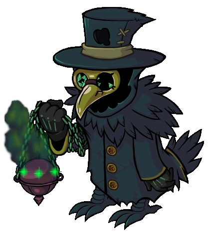

# Plaguebearer

- **Facción:** Neutral  · *fase posterior (referencia)*
- **Página de la wiki:** Plaguebearer (ToS)

## Ficha

**Clase (alineamiento):**

> Neutral Chaos

**Tipo:**

> Special
> Unique

**Resumen:**

> You are an acolyte of Pestilence who spreads disease among the town.

**Objetivo:**

> Infect all living players and become Pestilence.

**Habilidades:**

> You may choose to infect a player with the Plague each night.

**Atributos:**

> Attack: None
> Defense: Basic

**Atributos (texto):**

> Players will not know they have been infected.
> When all living players are infected you become Pestilence.

**Especial:**

> Unique Role

**Gana con:**

> Plaguebearer
> Survivor

**Debe matar para ganar:**

> Town
> Mafia
> Vampires
> Arsonist
> Serial Killer
> Werewolf
> Coven
> Juggernaut

**Resultado Investigator:**

> Coven Expansion Results
> Your target could be an .

**Resultado Consigliere:**

> Your target is a carrier of disease. They must be the Plaguebearer.

## Texto completo de la wiki

| 

 | Looking for the Town of Salem 2 role?

This role appears in Town of Salem 1 and 2. For the ToS 2 counterpart, see Plaguebearer.

 | 

 | This page describes content that can only be accessed in the Coven Expansion.

Plaguebearer 

Alignment

 Neutral Chaos

Avatar

Immunities

 Attack: None

 Defense: Basic

Special

Unique Role

 Ability Stats

 | Type

 | Special

Unique

Investigation Results

 Sheriff

You cannot find evidence of wrongdoing. Your target is innocent or great at hiding secrets!

 Investigator

 Coven Expansion Results

Your target could be an Investigator, Consigliere, Mayor, Tracker, or Plaguebearer.

 Consigliere

Your target is a carrier of disease. They must be the Plaguebearer.

Game Information

Summary

You are an acolyte of Pestilence who spreads disease among the town.

Abilities

You may choose to infect a player with the Plague each night.

Attributes

Players will not know they have been infected.

When all living players are infected you become Pestilence.

Goal

Infect all living players and become Pestilence.

 Victory Conditions

 | Wins with

 | Must kill

 | Plaguebearer

 Survivor

 | Town

 Mafia

 Vampires

 Arsonist

 Serial Killer

 Werewolf

 Coven

 Juggernaut

 | 

 | DISCLAIMER: These stories are fanmade, and are not created or endorsed in any way by BlankMediaGames or Digital Bandidos.

Screams rang through the cold night and the Doctor burst out of his house, barely just grabbing his medical kit as he raced along the streets. Arriving at the source of unrest, he discovered a young boy, lying down, coughing and sobbing. Instinct made the Doctor cover his face with his trusty surgical mask, and he was right in doing so. A closer inspection revealed the alarming truth. The red rash, the hacking coughs, and the huge black boils that had risen on the pale skin… this boy had the plague.

The Doctor should have been scared, worried, horrified, he knew this, but instead, he felt... fascination. How quickly could this disease spread, how many people could it kill? Hastily he took a sample, and commanded the boy’s family to be quarantined. Then, he hurried home to test this intriguing sample further. A week, and the Doctor finally held the result he was looking for. All he had to do was drop the solution on the path outside everyone’s houses, and the fumes would infect everyone who ventured there. He started to question himself, but then he remembered the other Doctor who always took the credit for himself, the Investigator who always snooped inside his house, the Jailor who roughly threw him in a cramped jail cell, and he felt better.

Inhaling the sweet scents of the herbs he put in his mask, the Plaguebearer infected person after person, using his dark robes to blend into the night. On the fateful night that the plague spread to everyone in the Town, the evil Doctor realized his power. As the moon was concealed under rolling grey clouds and the panicked screams rose from the town, Pestilence, Fourth Horseman of the Apocalypse, laughed so hard that tears rolled off his mask.

The icon that displays next to Infected players in the player list

Mechanics[]

You may choose to visit someone each night, infecting them with the plague.

You cannot choose people who are already Infected.

Anyone that visits you will become Infected.

Anyone who visits or is visited by an Infected player becomes Infected.

If the Jailor jails someone who is Infected and does not execute them, the Jailor will become Infected. (This also applies if the Jailor jails you.)

Players will not know when they have been Infected.

If all living players but you are Infected, you will become the Pestilence and the Town will be alerted the following day with a message saying "A plague has consumed the Town, summoning Pestilence, Horseman of the Apocalypse."

If you are killed on the same night everyone is Infected, you will not become Pestilence. No message alerting the Town will appear, and you will die.

If the last uninfected person is hanged, you will become Pestilence immediately after their role has been announced during the Day.

Notes[]

The Plaguebearer is a Unique Role, only one may exist at a time.

If one healthy person visits an Infected person who visits another healthy person, the plague will spread, so it is possible to become Pestilence in five days or less without kills (meaning all 15 players alive).

If an Amnesiac remembers themselves as a Plaguebearer, they will not have to Infect already Infected targets, and rather Infect the rest of the non- Infected people.

If an Amnesiac Plaguebearer/ Pestilence goes on to win the game, both the Amnesiac and the original Plaguebearer/ Pestilence will win.

If an Infected Necromancer or Retributionist uses someone in the graveyard, their target will be Infected. This will not count towards becoming Pestilence, since they are dead (only all living players need to be infected).

If a Necromancer or Retributionist uses someone in the Graveyard on a Plaguebearer, then the Necromancer or Retributionist will become Infected along with the reanimated role, even if neither was previously Infected.

If someone visits you but is intercepted by a Crusader or Bodyguard, they will not be Infected.

A few specific roles, most notably the Investigator, will not become Infected after visiting you or an Infected player. Additionally, the Godfather will not become Infected killing an Infected player (this is a bug).

The Plaguebearer will not get a message about their target being in Jail (this is a bug).

If the last uninfected person dies during the Night without getting Infected (e.g. haunted by a Jester), you will not immediately become Pestilence at the end of that Night. But you will become Pestilence either at the end of the next Day if someone gets hanged or at the end of the next Night if no one gets hanged.

Strategy[]

Try to visit people that you know are going to have a lot of traffic, but less likely to die. For example, if someone says, "Investigate ____ tonight", you should probably Infect the person they are going to visit, as the Investigator, if visits the person, will bring the plague to other people when investigating them.

Try infecting names that stand out at the beginning of the game. Since you don't attack your victim, you are safe from Bodyguards. The Crusader can attack you, but due to your Basic Defense, you will be fine, but they know one of their unknown visitors is immune. However, if a Tracker follows you or a Lookout watches the same target you Infect and isn't targeted by the Crusader, you are in trouble.

Try to Infect a revealed Mayor or the Jailor because most Town Protective roles will be on them. Or, Infect a Town Protective that is on a confirmed Town member. However, since a revealed Mayor and the Jailor is a high priority to evils, they will be targeting the Town Protective roles (which the Plague also spread to), then kill the Mayor and Jailor, wasting you a night.

You will know exactly who an Infected Jailor jails, since the jailed player becomes Infected at the end of the Day. Use this to strengthen your claims.

Infecting a Transporter can quickly increase who becomes Infected due to them being able to visit two people per night. However, they might transport the same person/people, but this is still a better infection than a role like Medium, who only speaks with the dead.

 Werewolf strategies work well with this role - but make sure you don't visit the same target as a Werewolf as you will die.

Often times, going after Town Investigative or Town Support roles (i. e. Investigator, Doctor and Sheriff) can spread the plague quickly. However, Mafia and Coven would often target them, as they can be a great threat to them.

You can always go to Infect suspicious people, as they tend to have a lot of visiting role attraction.

If you are role blocked by a Tavern Keeper/ Bootlegger early in the game, you can always claim Tracker for an early cover-up.

As Plaguebearer, you usually want to participate in Town debates, talk and bring your help to the Town. If you stay silent, you will be spotted out of suspicion immediately after the Town receives the message stating that you turned into Pestilence and you will be hanged. Being active will help you claim a role easily afterward and survive until there are only a few players left, which you can finish off with your newly gained Powerful Attack. This does not stop another strategy of being to lay low and wait until there are 5 or fewer players alive, then start infecting. Becoming Pestilence should be easy because there will be only 4 or fewer people to Infect. Be wary that you do not wait too long, or you may be found by the Town and hanged, or killed by roles with a Powerful Attack.

 Lookout is a good claim for this role, especially early on. You know who is Infected, and players spread Infection by visiting each other. By the same logic, Tracker is also a good claim. Be cautious about claiming these roles unnecessarily, as smart players will grow suspicious of you once you turn into Pestilence.

Early on, you want to Infect visiting roles so they spread the disease. Later on, you might want to target non-visiting roles yourself, especially ones that have been confirmed (and are therefore unlikely to be visited by anyone else) as they are most likely uninfected, and have low traffic and you are less likely to be seen or found.

A Veteran being in the game makes it unlikely that everyone will be Infected as long as they live, as the Veteran may often go on alert. The only way to pass this is to Infect someone who may visit the Veteran, or hang the Veteran later in the game when evils have majority.

Try to Infect visiting roles early, and only go for non-visiting roles if you have no one else to go for.

You can win the game without infecting everyone, as long as only you, or with the addition of Survivors, are alive.

Once you become Pestilence, the Neutral Killing roles (i.e. Werewolf, Serial Killer) are completely harmless to you, as they are most likely loners that cannot harm you at Night as they will be killed trying to do so. Therefore, once you do become Pestilence, you should focus on killing off the Town, Mafia, Coven and Vampires, as they can easily hang you during the Day (that is the only way Pestilence can die, except for leaving the game). Before that happens, however, the Neutral Killing roles pose a massive threat to you. The Werewolf and Juggernaut can just kill you outright, and the Serial Killer can still call you out for being immune. Therefore, it might be worth it to get rid these roles early on, to make sure you aren't killed at night or exposed through a Death Note.

You shouldn't worry as much about the Arsonist compared to the other Neutral Killings, as they most likely won't ignite before you become Pestilence, and Pestilence is immune to ignition.

Dealing with the Plaguebearer[]

If you are a Town Investigative role that is told to check upon another person's role, you might want to refrain from doing so if you know that the Town is vulnerable in the case of a Pestilence (for example, the Town only has the same amount of Town members as there are all evil roles combine). However, if you think you are already Infected, or if you think it is inevitable that a Pestilence will be coming soon, then you should continue visiting that person, as you would be helping catch Pestilence by narrowing down the pool of suspects.

The best way to stop Plaguebearer is to kill them early before they become Pestilence. If you are a Town Investigative role and you happen to find someone suspicious of being a Plaguebearer, it is not a bad idea to announce your suspicions of a certain person. Even then if the Plaguebearer becomes Pestilence, the whole Town will probably hang Pestilence immediately. Announcing that you found a Plaguebearer earlier and then having them turn into a Pestilence makes your claim a lot more believable than if you just revealed it to the Town right when the Plaguebearer becomes Pestilence.

Becoming Pestilence, Horseman of the Apocalypse[]

If you do manage to become Pestilence, you are armed with Powerful Attacks, Invincible Defense, infinite "alerts" that are always active, and a devastating Rampage ability (similar to the Werewolf). However, you also become everyone's top priority as you can decimate every role there is with no worry about dying at Night. Refer to the Pestilence page on strategies once you transcend.

Unfortunately, your possibly suspicious claim that you might have had before will be thrown out the window and you will become a suspect. So it is crucial to have been a positive influence on the Town and have a solid claim as Plaguebearer before the Town turns to you as the first suspect.

Achievements[]

 | Name

 | Description

 | Merit Points

 | Diseased

 | Win your first game as a Plaguebearer

 | 20

 | Infectious

 | Win 5 games as a Plaguebearer

 | 20

 | Virulent

 | Win 10 games as a Plaguebearer

 | 40

 | Pestilent

 | Win 25 games as a Plaguebearer

 | 100

 | A Virulent Plague

 | Have all the living players infected on day 5

 | 40

 | A God Among us

 | Become Pestilence, Horseman of the Apocalypse

 | 20

 | Unholy Strike

 | Attack 5 players in a single night

 | 40

 | Invincible

 | Have a Jailor try to execute you

 | 100

 | An Unstoppable Force Meets an Invincible Object

 | Be in a game where Pestilence is attacked by a fully powered up Juggernaut

 | 100

 If the Pestilence is Jailed, the Juggernaut will be able to attack without dying.

Messages[]

 | 

 | Every member of the town has been infected. You feel your body transforming!

 | Displays for only the Plaguebearer when they become Pestilence.

 | A plague has consumed the Town summoning Pestilence, Horseman of the Apocalypse!

 | Displays for all players when all alive players have been infected by the Plaguebearer.

Trivia[]

Before the switch to Unity, the Plaguebearer would receive a list of everyone who becomes Infected at the end of each Night.

The message from the list was "(Player) has been infected with the plague."

The Plaguebearer is the only "dousing" role to not change their target's investigation results.

It is possible to become Pestilence without visiting anyone, however this can only happen if you are visited.

The Plaguebearer is the only role in the game which doesn't tell you all the ways to win, as it says you must infect everyone and become Pestilence, however, in the rare event that the Plaguebearer is the last player alive, they will win despite not infecting everybody.

History[]

2.5.5.12200

Added a label to visually indicate Infected players for the Plaguebearer ().

Removed message "(Player) has been infected with the plague.".

The Plaguebearer's role icon has been changed. Old one was .

Added Plaguebearer's circled role icon ().

2.0.0.6582

Introduced.

 | 

 | 
Roles

 | 

 | 

 | 
 Town

 | 

 | Town Investigative | | Investigator • Lookout • Psychic • Sheriff • Spy • Tracker | | 

 | 

 | Town Killing | | Jailor • Vampire Hunter • Veteran • Vigilante

 | 

 | Town Protective | | Bodyguard • Crusader • Doctor • Trapper

 | 

 | Town Support | | Mayor • Medium • Retributionist • Tavern Keeper • Transporter

 | 
 Mafia

 | 

 | Mafia Deception | | Disguiser • Forger • Framer • Hypnotist • Janitor | | 

 | 

 | Mafia Killing | | Ambusher • Godfather • Mafioso

 | 

 | Mafia Support | | Blackmailer • Bootlegger • Consigliere

 | 
 Coven

 | 

 | Coven Evil | | Coven Leader • Hex Master • Medusa • Necromancer • Poisoner • Potion Master | | 

 | 
 Neutral

 | 

 | Neutral Benign | | Amnesiac • Guardian Angel • Survivor | | 

 | 

 | Neutral Evil | | Executioner • Jester • Witch

 | 

 | Neutral Killing | | Arsonist • Juggernaut • Serial Killer • Werewolf

 | 

 | Neutral Chaos | | Pirate • Plaguebearer/ Pestilence • Vampire

## Implementación

- [ ] Definido en `packages/engine` con su prioridad y facción
- [ ] Acción nocturna (si aplica) validada con objetivos legales
- [ ] Resultado de investigación correcto (Sheriff / Investigator / Consigliere)
- [ ] Condición de victoria y de derrota comprobada en tests
- [ ] Tests unitarios del rol en verde
- [ ] Tarjeta y texto de ayuda en la app
- [ ] Icono e ilustración propia (no el arte de la wiki)
- [ ] Plantillas de narración para sus eventos
