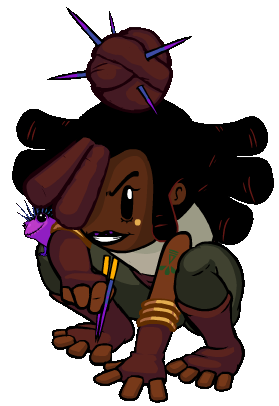

# Poisoner

- **Facción:** Coven  · *fase posterior (referencia)*
- **Página de la wiki:** Poisoner (ToS)

## Ficha

**Clase (alineamiento):**

> Coven Evil

**Tipo:**

> Killing
> Unique

**Prioridad de acción:**

> 5

**Resumen:**

> You are a patient killer with a knowledge of poisons.

**Objetivo:**

> Kill all who would oppose the Coven.

**Habilidades:**

> You may choose to poison a player each night.

**Atributos:**

> Detection Immunity (with the Necronomicon)
> Attack: Basic
> Defense: None

**Atributos (texto):**

> Your poisons take one day to take effect.
> Poison can be removed by Heals.
> With the Necronomicon, your poison can no longer be Healed.

**Especial:**

> Coven Chat
> Unique Role
> Can inherit the Necronomicon on Night 3

**Resultado Investigator:**

> Coven Expansion Results
> Your target could be a .

**Resultado Consigliere:**

> Your target uses herbs and plants to kill their victims. They must be the Poisoner.

## Texto completo de la wiki

| 

 | Looking for the Town of Salem 2 or Traitors in Salem role?

This role appears in Town of Salem 2 and Traitors in Salem. For the ToS 2 counterpart, see Poisoner and for the TiS counterpart, see Poisoner.

 | 

 | This page describes content that can only be accessed in the Coven Expansion.

Poisoner 

Alignment

 Coven Evil

Avatar

Immunities

Detection Immunity (with the Necronomicon)

Attack: Basic

Defense: None

Special

 Coven Chat

Unique Role

Can inherit the Necronomicon on Night 3

 Ability Stats

 | Type

 | Priority

 | Killing

Unique

 | 5

Investigation Results

 Sheriff

Without the Necronomicon:

Your target is suspicious or framed!

With the Necronomicon:

You cannot find evidence of wrongdoing. Your target is innocent or great at hiding secrets!

 Investigator

 Coven Expansion Results

Your target could be a Sheriff, Executioner, Werewolf, or Poisoner.

 Consigliere

Your target uses herbs and plants to kill their victims. They must be the Poisoner.

Game Information

Summary

You are a patient killer with a knowledge of poisons.

Abilities

You may choose to poison a player each night.

Attributes

Your poisons take one day to take effect.

Poison can be removed by Heals.

With the Necronomicon, your poison can no longer be Healed.

Goal

Kill all who would oppose the Coven.

 Victory Conditions

 | Wins with

 | Must kill

 | Coven

 Survivor

 | Town

 Mafia

 Vampires

 Arsonist

 Serial Killer

 Werewolf

 Plaguebearer

 Pestilence

 Juggernaut

 | 

 | DISCLAIMER: These stories are fanmade, and are not created or endorsed in any way by BlankMediaGames or Digital Bandidos.

A little girl and her grandmother were wandering in the forest just outside of Salem, where the raspberry bushes grew wild, their baskets were overflowing, ready to make a delicious feast. As she ran over a hill she saw a marvelous bush with dark blue berries and bright pink flowers; She simply had to try them. Her grandmother managed to limp over the hill. Old as she may have been, she recognized those berries from a mile away. She ran to the girl and slapped the berries out of her hand, frantically grabbing at her clothes, screaming "did you eat any? Did you? Please tell me you didn't eat any!" the girl nodded earnestly. "that's a good girl!" a moment passed, and she started screaming again, "Don't you ever touch those plants! You hear me!? Those could kill you!" The girl nodded again, having learned her lesson.

A decade had passed, and she had learned about every berry and herb in a hundred-mile radius. They called her a freak at school, an orphan, a meaningless nobody. How she hated them. She was young and impulsive, but unfortunately was not stupid. She ground those berries from the very same bush that nearly her killed as a child and poured the pulp into a pie. She went over to the worst bully of them all, the Mayor's son and offered him the pie. He ate it, and within a moment was dizzy, and nauseas. The day after he was dead. The lookout screamed, "She's the one who visited him two nights ago and gave him a laced pie! She's the murderer!"

Fueled by adrenaline, she ran and ran, as fast and far as her legs could take her into the forest, where the town lost track of her. She kept on running until she ran into an older woman collecting mushrooms. The Coven Leader took the young girl under her wing and decided that inexperienced as she may be, she had potential. She hid the girl from the town, on the agreement that the girl would work for the coven as the poisoner.

Mechanics[]

The Poisoner has the ability to poison someone each Night. Your poison deals the equivalent of a Basic Attack on the Night you poison someone, meaning anyone who has been poisoned without defense then gains defense the next night (like a Survivor self vesting or being jailed), will still die to poison. 
The icon that appears next to poisoned players on the player list

Your poison will only take effect the day after you poison your target. Anyone with Basic or higher defense on the night they're poisoned will not be poisoned.

Your Poison will only kill those with temporary defense. Anyone who gains permanent defense before the night they die to Poison (like a Mafioso being promoted to Godfather), will survive your Poison.

 Poisoned players will know they were poisoned.

If your poisoned target dies from the poison, your target will receive a message stating "You died to poison!"

A Doctor, Guardian Angel, or Potion Master can remove your poison if they protect your target.

With the Necronomicon, your poison can no longer be cured by a Doctor or Potion Master and will ignore their protections. However, your poison can still be cured by a Guardian Angel's purge. Your attack will not become more powerful.

If you poison someone with the Necronomicon, it will show the message "You were poisoned. You will die tomorrow!" instead of "You were poisoned. You will die tomorrow unless you are cured!".

You cannot poison a player who has left the game. 

 Town Protective roles can save someone from getting poisoned. However they will not get a "target was attacked" message when stopping a Poisoner, despite the fact that poisoning someone is always a harmful visit.

Funnily enough, a Hypnotist hypnotizing you with a fake poison message will cause you to see an extra poison icon next to your number on the player list (this is a bug).

Strategy[]

Your delayed kill means that Lookouts will sometimes have a harder time finding you. However, smarter Lookouts will notice you visiting your target, so when the target claims to have been poisoned or when they die to Poison a day later, they will be suspicious of you and even call you out.

Since your kills are delayed, you can utilize this to out roles with defense in your Death Note on the same Night you Poison them provided your previous Poison killed someone that Night.

 Doctors are a high-priority target; with them in play, you are virtually useless until you have the Necronomicon (even then, a Guardian Angel can still remove your Poison), the reason being that anyone poisoned can simply claim so and the Doctor will heal them, confirming themselves and the Doctor in the process.

However, you will open the door to all other players being attacked by your fellow Coven members, and even members of the Mafia or other hostile Neutrals, provided there are no other Town Protectives.

The Coven Leader can prevent the Doctor from curing Poison by controlling them away.

The revealed Mayor is very vulnerable to Poison as they can't be saved by a Doctor. Note that you might be caught by a Lookout or Crusader poisoning the Mayor, so it's wise to find them first and kill them before poisoning the Mayor.

Claiming to be poisoned has its benefits - it means the Doctor will heal you that night, protecting you from harm. Even if the Town notices you haven't died, you can simply claim to have been healed. Of course, this will not work once you get the Necronomicon, as healing will no longer prevent death by poison.

This strategy can backfire if a there is a Spy, as they won't see the Coven visit you unless a Potion Master interferes.

Coordinate with your fellow Coven members on who you should poison. Before Night 3, you are the only Coven member able to kill reliably and consistently (without requiring a Coven Leader + Medusa combination).

Under the rare circumstance with a Necromancer teammate and a dead Blackmailer, the Necromancer can blackmail the target of your poison, making them incapable of asking a Doctor to cure them. Claiming to be poisoned yourself the next day, while taking suspicion off you in the short term, makes you vulnerable to being called out in your victim's Last Will after their death unless the Necromancer has an available Janitor/ Forger corpse.

Once another Coven member obtains the Necronomicon, communicate with them to ensure that they don't attack the same target that's Poisoned or is about to be Poisoned. This will effectively allow the Coven to have a consistent two kills per night. The only to this exception is if the target is someone the Coven absolutely must kill immediately.

If you play with a Medusa, you can ask them to claim poisoned while you don't poison anyone and ask the Medusa to stone visitors the following night. This will allow them to kill the Doctor and make your poison an actual threat; however, a Guardian Angel can still remove your poison through purging. Be warned that smarter players will notice if someone says they will visit the Medusa and dies from stoning the day after.

 Poison can be used to draw away Doctors from their original intended target, exposing that target in the process. Utilize this with the other available Coven members in order to determine who is and who isn’t protected.

The Poisoner is very much like a Mafioso, except with a higher chance that your target will not die. The Necronomicon is like a Mafioso being Disguised, and thus the role should be treated as a Mafioso.

Since a Poisoner is a delayed Mafioso, you are the least powerful Coven member, but you are also the most kill-consistent Coven member (without requiring the Necronomicon). Use this to your advantage.

Dealing with Poisoners[]

If you are Poisoned as a factional role, you still have a day to strategize with others before you die to Poison. Unlike any other killing role, their delayed attack allows you to coordinate with allies and even get cured if there's a Doctor or Guardian Angel.

As a Lookout, if you see someone visit your target and your target claims they were poisoned, you may have found the Poisoner. If your target dies of poison the next day, the player you saw is most likely the Poisoner.

As a Doctor, make sure to heal anyone claiming to be poisoned. Not only will it remove poison from them, it will protect them from any killers and confirm your claim later on. On the other hand, if the Poisoner has the Necronomicon, then healing poisoned people is a waste of a Night.

However, if the person who's poisoned doesn't have a claim, then you shouldn't heal them, as they are likely a member of the Mafia.

As a killing role, targeting people who are poisoned is a bad idea. Not only will they likely be protected by Doctors or Guardian Angels, even if they are defenseless, they will die from poison anyway, wasting a kill. However, if you have a Rampage attack, targeting a player that claims to be poisoned may help you eliminate a Doctor.

As a Tracker, you can call out a Poisoner if you see them visiting someone who claims to be poisoned the next day. Beware that the player you tracked is not necessarily the Poisoner, they simply may have happened to visit the same target as the Poisoner.

As a Mayor, you have the largest risk of revealing yourself if a Poisoner is known as a Doctor can't heal you. Always request protection and safety of any kind, such as a Bodyguard, Jailor, Trapper, or even a Crusader if you feel there are no more protective roles around. Lookouts can cover you and identify the Poisoner, and Transporters can be a good bet too.

If a known Doctor visits a role that has claimed to be poisoned and dies to a Medusa, there is a good chance the person who claimed they were poisoned is the Medusa (unless a Transporter interferes).

As a Pirate, you should whisper the person claiming Poisoned, asking them to choose the option of your choice. If there is a Doctor/ Guardian Angel, they will heal your Attack as well as the Poison, and if there isn't, then your victim will die anyway. Either way, this nets you a free Plunder at no cost to them.

Achievements[]

 | Name

 | Description

 | Merit Points

 | Silent but Deadly

 | Win 1 game as a Poisoner

 | 20

 | Poison Barbs

 | Win 5 games as a Poisoner

 | 20

 | Toxic

 | Win 10 games as a Poisoner

 | 40

 | Miasma

 | Win 25 games as a Poisoner

 | 100

 | Blight

 | Poison 5 people in a game

 | 20

 | Last Meal

 | Have a Jailed person die to your Poison

 | 40

 | Delayed Paranoia

 | Have a Veteran on alert die to your Poison

 | 40

Messages[]

 | 

 | You were poisoned. You will die tomorrow unless you are cured!

 | Displays at the end of the Night when a player is poisoned.

 | You were poisoned. You will die tomorrow!

 | Displays at the end of the Night when a player is poisoned by a Poisoner with the Necronomicon. Since it cannot be healed by a Doctor, the player will die unless purged by a Guardian Angel.

 | You died to poison!

 | Displays at the end of the Night when a player is poisoned by a Poisoner and not healed the next night.

 | You were cured of poison!

 | Displays to a Poisoned player that got cured by a Doctor or Guardian Angel.

 | You were poisoned but someone nursed you back to health! 

 | Displays at the end of the Night when a player is poisoned and healed the same Night.

 | Someone tried to poison you but someone fought off your attacker!

 | Displays at the end of the Night when a player is visited by a Poisoner but a Bodyguard successfully protects them.

 | Someone tried to poison you but you were in jail last night.

 | Displays at the end of the Night when a player is visited by a Poisoner while jailed.

 | [They were] poisoned by the Poisoner. or [They were] also poisoned by the Poisoner.

 | Cause of death for a player who died from Poison.

Trivia[]

The Poisoner is one of the few roles able to kill another player even after they have already died. 

Note, however, that if you change your Death Note after you die, those changes will not be reflected.

According to the game's lore, the Poisoner's name is Kande. The Poisoner, before joining the Coven, used to live in a small village in Africa.

During playtesting on the Public Test Realm, the Poisoner would come up as Trapper, Ambusher, Poisoner, or Medusa to the Investigator.

If you poison someone with defense the icon of being poisoned will appear by their name during the next day and night despite them not actually going to die from it.

History[]

3.2.4

Temporary Defense given by certain roles through game mechanics now give attackers the message "Your target's defense was too strong to kill.".

3.1.14

 Juggernaut now removes Poison when gaining Basic Defense.

3.2.3

 Trapper will no longer die to Attack if another Trapper has placed a Trap on them.

Dual Trappers can now save each other if they have placed Traps on each other and both are attacked.

2.5.5.12200

The Poisoner's role icon has been changed. Old one was .

Added Poisoner's circled role icon ().

2.5.1.10655

Fixed Guardian Angel "target was attacked" feedback.

2.3.2.9706

Fixed an issue where if you were poisoned, healed, then poisoned again the next night, you wouldn't receive a message letting you know you were poisoned.

2.0.0.6582

Introduced.

 | 

 | 
Roles

 | 

 | 

 | 
 Town

 | 

 | Town Investigative | | Investigator • Lookout • Psychic • Sheriff • Spy • Tracker | | 

 | 

 | Town Killing | | Jailor • Vampire Hunter • Veteran • Vigilante

 | 

 | Town Protective | | Bodyguard • Crusader • Doctor • Trapper

 | 

 | Town Support | | Mayor • Medium • Retributionist • Tavern Keeper • Transporter

 | 
 Mafia

 | 

 | Mafia Deception | | Disguiser • Forger • Framer • Hypnotist • Janitor | | 

 | 

 | Mafia Killing | | Ambusher • Godfather • Mafioso

 | 

 | Mafia Support | | Blackmailer • Bootlegger • Consigliere

 | 
 Coven

 | 

 | Coven Evil | | Coven Leader • Hex Master • Medusa • Necromancer • Poisoner • Potion Master | | 

 | 
 Neutral

 | 

 | Neutral Benign | | Amnesiac • Guardian Angel • Survivor | | 

 | 

 | Neutral Evil | | Executioner • Jester • Witch

 | 

 | Neutral Killing | | Arsonist • Juggernaut • Serial Killer • Werewolf

 | 

 | Neutral Chaos | | Pirate • Plaguebearer/ Pestilence • Vampire

## Implementación

- [ ] Definido en `packages/engine` con su prioridad y facción
- [ ] Acción nocturna (si aplica) validada con objetivos legales
- [ ] Resultado de investigación correcto (Sheriff / Investigator / Consigliere)
- [ ] Condición de victoria y de derrota comprobada en tests
- [ ] Tests unitarios del rol en verde
- [ ] Tarjeta y texto de ayuda en la app
- [ ] Icono e ilustración propia (no el arte de la wiki)
- [ ] Plantillas de narración para sus eventos
