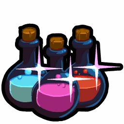
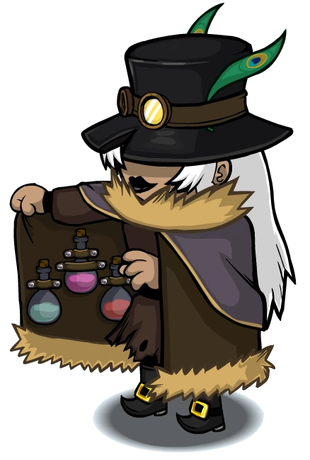

# Potion Master

- **Facción:** Coven  · *fase posterior (referencia)*
- **Página de la wiki:** Potion Master (ToS)

## Ficha

**Clase (alineamiento):**

> Coven Evil

**Tipo:**

> Killing
> Protection
> Investigate
> Unique

**Prioridad de acción:**

> 3 (Healing)
> 4 (Revealing)
> 5 (Attacking)

**Resumen:**

> You are an experienced alchemist with potent recipes for potions.

**Objetivo:**

> Kill all who would oppose the Coven.

**Habilidades:**

> You may choose to use a potion on a player each Night.

**Atributos:**

> Detection Immunity (with the Necronomicon)
> Attack: Basic
> Defense: None

**Atributos (texto):**

> You may choose to use a Heal, reveal, or attack potion on a player.
> Each potion has a three Day cooldown.
> With the Necronomicon, your potions no longer have a cooldown.

**Especial:**

> Coven chat
> Unique Role
> Can inherit the Necronomicon on Night 3

**Usos:**

> Unlimited, but has a 3-Day cooldown.

**Resultado Investigator:**

> Coven Expansion Results
> Your target could be a .

**Resultado Consigliere:**

> Your target works with alchemy. They must be a Potion Master.

## Texto completo de la wiki

| 

 | Looking for the Town of Salem 2 role?

This role appears in Town of Salem 1 and 2. For the ToS 2 counterpart, see Potion Master.

 | 

 | This page describes content that can only be accessed in the Coven Expansion.

Potion Master 

(PM/PMer)

Alignment

 Coven Evil

Avatar

Immunities

Detection Immunity (with the Necronomicon)

Attack: Basic

Defense: None

Special

 Coven chat

Unique Role

Can inherit the Necronomicon on Night 3

 Ability Stats

 | Type

 | Priority

 | Uses

 | Killing

Protection

Investigate

Unique

 | 3 (Healing)

4 (Revealing)

5 (Attacking)

 | Unlimited, but has a 3- Day cooldown.

Investigation Results

 Sheriff

Without the Necronomicon:

Your target is suspicious or framed!

With the Necronomicon:

You cannot find evidence of wrongdoing. Your target is innocent or great at hiding secrets!

 Investigator

 Coven Expansion Results

Your target could be a Doctor, Disguiser, Serial Killer, or Potion Master.

 Consigliere

Your target works with alchemy. They must be a Potion Master.

Game Information

Summary

You are an experienced alchemist with potent recipes for potions.

Abilities

You may choose to use a potion on a player each Night.

Attributes

You may choose to use a Heal, reveal, or attack potion on a player.

Each potion has a three Day cooldown.

With the Necronomicon, your potions no longer have a cooldown.

Goal

Kill all who would oppose the Coven.

 Victory Conditions

 | Wins with

 | Must kill

 | Coven

 Survivor

 | Town

 Mafia

 Vampires

 Arsonist

 Serial Killer

 Werewolf

 Plaguebearer

 Pestilence

 Juggernaut

 | 

 | DISCLAIMER: These stories are fanmade, and are not created or endorsed in any way by BlankMediaGames or Digital Bandidos.

Eye of newt? Pah! Newts weren’t even that common around here. People always saw witches as women with pointy hats riding broomsticks, stirring the most outlandish of ingredients into their fabled cauldrons. But those were all fairytales. A true witch could make miracles out of anything.

From a young age, the bartender of the local pub had a penchant for mixing things. Whether it be milk and berries to make a smoothie, or cyanide and bait to make rat poison, she could make just about anything. As she progressed in age, more and more people came to try her concoctions. Even in her small town riddled with crime, she found solace in mixing the best beverages he could for her clients. But it wasn’t enough.

She was bored. People knew her, yes, and she was well-paid, but… it didn’t satisfy her. She knew she could do better than this. Eventually, she decided to mix more… interesting things. One such mixture was a salve, a special lotion that could heal almost any wound. It proved its merit when a maniac had stabbed the local doctor. Lathering it on the wounds, she watched as his frail body restored its cells and gave him breath.

Another was a truth serum of sorts – it flooded the consumer with the urge to spill their secrets. Whether it be an embarrassing moment or a heinous crime, they simply couldn’t resist telling the bartender exactly who they were. Although… “bartender” wasn’t enough to describe this girl anymore. She was much, much more now.

The last of her “special” drinks was even more special than the others. Instead of making her targets talk, she could silence them forever. That boy who’d bullied her as a child? They found him dead in his bed, an empty vial in his hand. The teacher she hated all her life? Slumped over his desk, a strange green fluid staining his shirt.

She wasn’t bored anymore.

 Potion Master's currently available potions and their appearance ingame.

Mechanics[]

The Potion Master can select between three potions to use at Night: a healing potion, a revealing potion, and an attacking potion. Each of the potions has a three Day cooldown.

The healing potion will heal your target. The healing will be identical to a Doctor's; it provides Powerful Defense and cures Poison. If your target is attacked on the Night you heal them, they will receive the same notification as they would if they were attacked when a Doctor is healing them. You, however, won't receive a notification if they are attacked. Attackers will also not receive a defense message.

The revealing potion will reveal your target's exact role to you. You will receive the same investigative results as a Consigliere would. You will see their exact role despite any Frames, Disguises, Douses, or Hexes on your target.

The attacking potion will attack your target. You will deal a basic attack to your target on the same Night similar to a Mafioso and unlike the Poisoner.

With the Necronomicon, the cool-downs for the potions are removed.

You can heal fellow Coven members, but you cannot choose to use an investigate or attack potion on your fellow Coven members. You can't use potions on yourself.

A Potion Master can cure Poison, but when they do it will have the message "You were attacked but someone nursed you back to health!" to the target INSTEAD of "You were cured of poison!". This may be a bug. So be careful if you are trying to act confirmed as a smart townie could call you out.

Due to a bug, it is possible for a Potion Master to cure the Poison of a Jailed player (still giving their target the wrong cure message).

 | Potion Master Results: 

 | Your target is a trained protector. They must be a Bodyguard.

 | Your target is a divine protector. They must be a Crusader.

 | Your target is a professional surgeon. They must be a Doctor.

 | Your target is a beautiful person working for the town. They must be a Tavern Keeper.

 | Your target gathers information about people. They must be an Investigator.

 | Your target detains people at night. They must be a Jailor.

 | Your target watches who visits people at night. They must be a Lookout.

 | Your target is the leader of the town. They must be the Mayor.

 | Your target speaks with the dead. They must be a Medium.

 | Your target has the sight. They must be a Psychic.

 | Your target wields mystical powers. They must be a Retributionist.

 | Your target is a protector of the town. They must be a Sheriff.

 | Your target secretly watches who someone visits. They must be a Spy.

 | Your target is a skilled in the art of tracking. They must be a Tracker.

 | Your target specializes in transportation. They must be a Transporter.

 | Your target is waiting for a big catch. They must be a Trapper.

 | Your target tracks Vampires. They must be a Vampire Hunter!

 | Your target is a paranoid war hero. They must be a Veteran.

 | Your target will bend the law to enact justice. They must be a Vigilante.

 | Your target lies in wait. They must be an Ambusher.

 | Your target uses information to silence people. They must be a Blackmailer.

 | Your target gathers information for the Mafia. They must be a Consigliere.

 | Your target is a beautiful person working for the Mafia. They must be a Bootlegger.

 | Your target makes other people appear to be someone they're not. They must be a Disguiser.

 | Your target is good at forging documents. They must be a Forger.

 | Your target has a desire to deceive. They must be a Framer!

 | Your target is the leader of the Mafia. They must be the Godfather.

 | Your target is skilled at disrupting others. They must be a Hypnotist.

 | Your target cleans up dead bodies. They must be a Janitor.

 | Your target does the Godfather's dirty work. They must be a Mafioso.

 | Your target does not remember their role. They must be an Amnesiac.

 | Your target likes to watch things burn. They must be an Arsonist.

 | Your target wants someone to be hanged at any cost. They must be an Executioner.

 | Your target is watching over someone. They must be a Guardian Angel.

 | Your target wants to be hanged. They must be a Jester.

 | Your target gets more powerful with each kill. They must be a Juggernaut.

 | Your target reeks of disease. They must be Pestilence, Horseman of the Apocalypse.

 | Your target wants to plunder the town. They must be a Pirate.

 | Your target is a carrier of disease. They must be the Plaguebearer.

 | Your target wants to kill everyone. They must be a Serial Killer.

 | Your target simply wants to live. They must be a Survivor.

 | Your target drinks blood. They must be a Vampire!

 | Your target howls at the moon. They must be a Werewolf.

 | Your target leads the mystical. They must be the Coven Leader.

 | Your target is versed in the ways of hexes. They must be the Hex Master.

 | Your target has a gaze of stone. They must be Medusa.

 | Your target uses the deceased to do their dirty work. They must be the Necromancer.

 | Your target uses herbs and plants to kill their victims. They must be the Poisoner.

 | Your target works with alchemy. They must be a Potion Master.

Strategy[]

Normally, it is better to use a revealing potion instead of a healing or killing potion at the beginning of the game. Doing so can give you vital information about your enemies and keeps the fact that there is a Potion Master in the game a secret, like all other Coven roles, the rest of the Town will know exactly what role someone died to. It also makes you and your team slightly better informed when you use your killing potion the next Night, along with giving you time to locate any Town Protectives that may take you down if you attack someone. Essentially, it makes less room for mistakes in your decisions.

When you have the Necronomicon, it might be a good idea to use a revealing potion two Nights in a row, and then use a killing potion on the third Night. This way, the rest of the Town will not know that you have the Necronomicon, which could make the Town panic that another Coven role has it instead, and start focusing on finding another Coven role.

Use your killing potions in compliment with your revealing potions. This allows you to take out high priority targets like a Sheriff or the Mafioso.

Your healing potion is a powerful weapon to negate the attacks of Town Protectives. Cooperating with other Coven roles is essential before you heal them. The other Coven members may decide to attack a specific target, knowing you would back them up with a Powerful Defense. This is more useful when the attacking Coven member targets someone with Town Protectives on their side. If possible, you can work with another Coven member to "confirm" yourself as the Doctor if needed.

When choosing who to heal, focus on whatever Coven member you think is most likely to be attacked. If you're unsure who will be attacked, you should protect whoever is most valuable - a Poisoner is important in the early game, the Necromancer is valuable if they have corpses worth using, while a Hex Master who has almost everyone hexed can be vital to protecting to ensure they live until their hex goes off. The Medusa and Coven Leader can protect themselves, and thus are generally a lower priority.

On that note, unless you feel like you think your team can carry the rest of the game, do not heal a Medusa while they are Stoning. Their Stone Gaze will still Stone you.

This is only useful if you want to deliberately sell yourself out as not a Coven member, and is generally not worth it, considering your role is not revealed to the Town, and your team loses a member.

Before Night 3, you may need to heal the Coven Leader since they do not have their Basic Defense before then to protect them from a Crusader/ Ambusher. This is especially the case for Night 2.

If a member of the Coven is being dueled by a Pirate, it's recommended to heal them in case the Pirate wins the duel, as your healing potion will negate their Powerful Attack on that Coven member.

If you so choose, you can offer to let the Pirate Plunder one of your Coven since you can heal them, and whisper to them what your teammate will pick. The Pirate will likely pick the corresponding Attack, netting them a free Plunder and encouraging them to side with the Coven. When doing this, unless they have role block immunity, never allow the Necronomicon wielder to be a sacrifice to a Pirate.

If a Transporter forces a Poisoner to target a Coven member or a Neutral ally, you'll be able to save them as long as the Poisoner does not possess the Necronomicon.

If a Necromancer is reanimating Pestilence, you should definitely heal them as Pestilence will attack the Necromancer for visiting them even in the graveyard. The same applies for any Coven member visiting a suspected Veteran on alert or the target of a Werewolf.

If you find a Town Protective role like a Bodyguard, you may claim Doctor and pair up with them. This can help in situations when roles like Pestilence, Juggernaut, or a Werewolf are around and the Coven has no other way of dealing with them.

As an added bonus, if the Bodyguard is ever attacked, they will trust you, and vote with you against the Pestilence or Werewolf.

If you inherit the Necronomicon, use the revealing potion on others to find their exact role, and paste their investigative results into chat (after claiming to be the Investigator) to attempt to lynch them. Be careful, because lynching a Townie could result in you losing your credibility. Gain the help of others by assisting roles such as Survivor or Guardian Angel, as this will be a major help towards the end of the game. Once everybody believes you are the Investigator, start killing off the non- Coven (preferably the Mafia first) until you win.

However, a smart Spy may notice the correlation between your "findings" and the Coven's visits, outing you and confirming themselves in the process, so a strategy is to change the order of your results. For example, if you found someone as a member of the Mafia on Night 1, you can put this as your results for a later Night; however, a Tracker tracking you will see that your Last Will does not correlate to your visits.

You are essentially a mix of the Doctor, the Consigliere, and the Mafioso. Refer to these roles' specific pages for strategies you could adopt into your own strategy.

Do not claim Doctor if there is a Poisoner. You would be expected to heal their victim each Night, and you would be discovered when you can't heal every target.

Claiming Doctor when you have the Necronomicon is plausible, but will be a waste of both the Potion Master and the Poisoner as the Potion Master would only be able to heal the Poisoner's attacks.

Additionally, when a Potion Master cures Poison, the cured target will receive "You were attacked but someone nursed you back to health!" INSTEAD of the real Doctor message "You were cured of poison!". Experienced players can call you out for this.

A way around this is to have one of your team claim Poisoned and pretend to heal them while instead attacking a Townie. However, you could be outed by a Spy or Lookout who will see no visitors.

Achievements[]

 | Name

 | Description

 | Merit Points

 | Alchemist

 | Win 1 game as a Potion Master

 | 20

 | Eye of Newt

 | Win 5 games as a Potion Master

 | 20

 | Vial Juggler

 | Win 10 games as a Potion Master

 | 40

 | Elixir of Victory

 | Win 25 games as a Potion Master

 | 100

 | The Horseman

 | Find Pestilence

 | 40

 | Natural Remedies

 | Successfully heal a Coven member 5 times

 | 100

 | The Trifecta

 | Use all three potions in a single game

 | 20

 You will die from this unless you have protection.

 The Coven member does not have to get attacked.

Messages[]

 | 

 | You were attacked but someone nursed you back to health!

 | Displays at the end of the night when you are attacked but you were healed by a Potion Master. Also appears if a Potion Master cured someone of poison. 

 | You were attacked by a Potion Master!

 | Displays at the end of the night when a Potion Master uses an attack potion on a player.

 | [They were] killed by the Potion Master. or [They were] also killed by the Potion Master.

 | Cause of death for a player who was attacked by a Potion Master.

Trivia[]

 Potion Master is the only role to have three different priorities since the role itself has three Night abilities.

According to the game's lore, the Potion Master's name is Nikki Flamel.

In the Public Test Realm, there used to be a now-scrapped Coven Support Alignment. Most notably, the only known role to fit in this Alignment was the Potion Master.

There used to be a bug that could generate two Potion Masters when selecting roles from the Any Alignment, happening most often in Coven All Any.

Unfortunately, this has been fixed.

History[]

3.2.4

Temporary Defense given by certain roles through game mechanics now give attackers the message "Your target's defense was too strong to kill.".

3.2.3

 Trapper will no longer die to Attack if another Trapper has placed a Trap on them.

Dual Trappers can now save each other if they have placed Traps on each other and both are attacked.

2.5.5.12200

The Potion Master's role icon has been changed. Old one was .

Added Potion Master's circled role icon ().

2.5.1.10655

Fixed Guardian Angel "target was attacked" feedback.

2.3.2.9706

Multiple Potion Masters can no longer spawn together in Coven All Any.

Fixed an issue where if you were poisoned, healed, then poisoned again the next Night, you wouldn't receive a message letting you know you were poisoned.

Fixed an issue where if you were attacked by Medusa, healed, but killed by a role with a higher attack, you would still show up as stoned.

2.0.0.6582

Introduced.

 | 

 | 
Roles

 | 

 | 

 | 
 Town

 | 

 | Town Investigative | | Investigator • Lookout • Psychic • Sheriff • Spy • Tracker | | 

 | 

 | Town Killing | | Jailor • Vampire Hunter • Veteran • Vigilante

 | 

 | Town Protective | | Bodyguard • Crusader • Doctor • Trapper

 | 

 | Town Support | | Mayor • Medium • Retributionist • Tavern Keeper • Transporter

 | 
 Mafia

 | 

 | Mafia Deception | | Disguiser • Forger • Framer • Hypnotist • Janitor | | 

 | 

 | Mafia Killing | | Ambusher • Godfather • Mafioso

 | 

 | Mafia Support | | Blackmailer • Bootlegger • Consigliere

 | 
 Coven

 | 

 | Coven Evil | | Coven Leader • Hex Master • Medusa • Necromancer • Poisoner • Potion Master | | 

 | 
 Neutral

 | 

 | Neutral Benign | | Amnesiac • Guardian Angel • Survivor | | 

 | 

 | Neutral Evil | | Executioner • Jester • Witch

 | 

 | Neutral Killing | | Arsonist • Juggernaut • Serial Killer • Werewolf

 | 

 | Neutral Chaos | | Pirate • Plaguebearer/ Pestilence • Vampire

## Implementación

- [ ] Definido en `packages/engine` con su prioridad y facción
- [ ] Acción nocturna (si aplica) validada con objetivos legales
- [ ] Resultado de investigación correcto (Sheriff / Investigator / Consigliere)
- [ ] Condición de victoria y de derrota comprobada en tests
- [ ] Tests unitarios del rol en verde
- [ ] Tarjeta y texto de ayuda en la app
- [ ] Icono e ilustración propia (no el arte de la wiki)
- [ ] Plantillas de narración para sus eventos
