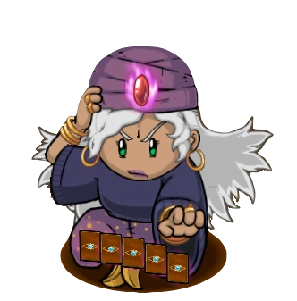

# Psychic

- **Facción:** Town  · *en alcance MVP*
- **Página de la wiki:** Psychic (ToS)

## Ficha

**Clase (alineamiento):**

> Town Investigative

**Tipo:**

> Information
> Non-unique

**Prioridad de acción:**

> 4

**Resumen:**

> You are a powerful seer with a gift for finding one's secrets.

**Objetivo:**

> Hang every criminal and evildoer.

**Habilidades:**

> Receive a vision every night.

**Atributos:**

> Attack: None
> Defense: None

**Atributos (texto):**

> On odd nights you will have a vision of three players, at least one will be Evil.
> On even nights you will have a vision of two players, at least one will be Good

**Gana con:**

> Town
> Survivor

**Debe matar para ganar:**

> Mafia
> Vampires
> Arsonist
> Serial Killer
> Werewolf
> Coven
> Plaguebearer
> Pestilence
> Juggernaut

**Resultado Sheriff:**

> You cannot find evidence of wrongdoing. Your target is innocent or great at hiding secrets!

**Resultado Investigator:**

> Coven Expansion Results
> Your target could be a .

**Resultado Consigliere:**

> Your target has the sight. They must be a Psychic.

## Texto completo de la wiki

| 

 | Looking for the Town of Salem 2 or Traitors in Salem role?

This role appears in Town of Salem 2 and Traitors in Salem. For the ToS 2 counterpart, see Psychic and for the TiS counterpart, see Psychic

 | 

 | This page describes content that can only be accessed in the Coven Expansion.

Psychic 

Alignment

 Town Investigative

Avatar

Immunities

Attack: None

Defense: None

 Ability Stats

 | Type

 | Priority

 | Information

Non-unique

 | 4

Investigation Results

 Sheriff

You cannot find evidence of wrongdoing. Your target is innocent or great at hiding secrets!

 Investigator

 Coven Expansion Results

Your target could be a Survivor, Vampire Hunter, Amnesiac, Medusa, or Psychic.

 Consigliere

Your target has the sight. They must be a Psychic.

Game Information

Summary

You are a powerful seer with a gift for finding one's secrets.

Abilities

Receive a vision every night.

Attributes

On odd nights you will have a vision of three players, at least one will be Evil.

On even nights you will have a vision of two players, at least one will be Good

Goal

Hang every criminal and evildoer.

 Victory Conditions

 | Wins with

 | Must kill

 | Town

 Survivor

 | Mafia

 Vampires

 Arsonist

 Serial Killer

 Werewolf

 Coven

 Plaguebearer

 Pestilence

 Juggernaut

 | 

 | DISCLAIMER: These stories are fanmade, and are not created or endorsed in any way by BlankMediaGames or Digital Bandidos.

She opens her eyes, gleaming with a faint orange glow of the candle, and uncovers a deck of cards securely hidden within the folds of her robe. A deep breath, and she shuffles them with a vague sense of expertise, or rather, a sense of total familiarity. Memories of her dying mother passing on both the set and the authority to undertake the mystical career alone, would forever echo in her head as she prepares to do the job she was solely trained for.

The Psychic murmurs a short prayer, and brushes the cards face-down in a line. Facing down, her gaze lies upon them, all embellished with a crimson arabesque design, each representing a specific villager residing in Salem. The Red Tarots were the manifestations of the negative traits living within each of the townsfolk. With her fingers carefully resting above the cards, she picks three, the energy of which burned strongest at the present hour. Flipping the trio over, she studies carefully their contents, and proceeds to infer the possible individual, or individuals, blackened with a heart of darkness.

Ares, the God of War. It represented the trigger-happy Veteran, post-traumatic from his distant battles. The Judge of Power. It was a card representing their highest-ranking official, the Mayor. A swift aura of complete realization empowered her, yet she was now forced to comprehend the risks she needed to take. Gripping the last tarot of Hellfire in her hand, to accuse someone in their Town was to put herself to the possibility of being called a fraud, or even death. But to die, she concluded, has to happen to someone, if they ever wished for justice to prevail in their village.

Mechanics[]

On odd-numbered Nights, you will get three names, at least one of which is evil. On even-numbered Nights, you will get two names, at least one of which is good.

If you are Jailed or roleblocked, you will not receive a Vision.

If you are controlled by a Coven Leader, they will receive a vision you would have otherwise received.

 | Psychic Result

 | Possible Roles

 | Appears as 'good' in visions

 | All Townies (including the Town Traitor)

 | Neutral Benign

 | Appears as 'evil' in visions

 | All members of the Mafia

 | All members of the Coven

 | Neutral Killing

 | Neutral Chaos

 | Neutral Evil

Strategy[]

Reveal early on and ask for a Crusader on you. Often a Crusader will do as asked if they are smart, and you can easily start helping the Town rat out suspicious people.

However, if Medusa killed some Townies, you may get hanged under suspicion of being Medusa.

Generally, the Psychic relies on the whole Town to be useful. Having fellow Town Investigative roles can help the Psychic even further by gaining information about the roles that are potentially evil.

Writing confirmed Townies in your Last Will may seem like a good idea, but remember that when your Last Will is revealed, it potentially makes them a target for killers.

Calling someone out as evil early on is generally not a good idea. One, you could end up guessing wrong and getting an innocent Townie hanged. Two, people could think you are an Executioner and ignore you. Three, a Psychic is a high-priority target for the Mafia so you will likely be dead within a few Nights.

However, if it is Night 3, a person has appeared twice, and one or two other people on those two visions have died, it is likely they are evil. Call them out, or whisper it to a confirmed Townie.

If there is a Medusa, the Town will often not believe a late Psychic claim, so you may want to claim Day 1 or 2, especially if there are other Psychic claims.

Narrow down your pool of suspects. Two of the given potential evil roles may be good, and their death may confirm their innocence.

If you receive an evil vision and find one of the players to be evil, the remaining two players are still more likely than average to be evil. This is because the player that was found to be evil could have been evil by coincidence, and was not the player referred to as the evil one out of the three. The same thing applies with good visions.

When receiving a vision on the first Night, there is a 27% chance of only one of the players being evil, a 54% chance of two of the players being evil, and a 19% chance of all of them being evil.

If the Town has no information that confirms a player as an evil role, consider voting those that appear on the odd Night vision. You are not compelled to hang them, but forcing them to claim is a very effective strategy.

A Jester will appear as evil in your vision. This means that you should be warier when deciding which people in your odd Night vision should be hanged.

Playing against Psychics[]

Since a Psychic claim is easy to fake, claiming Lookout or Tracker and saying that the Psychic visited them is a potential way to get rid of a trustworthy Townie.

If a Psychic claim has themselves in a vision, they are likely a Jester faking it or another evil role.

As a Disguiser, you can ask a Lookout to watch you while you disguise yourself as the Psychic. Any Lookouts watching you will see the " Psychic" visiting you and will proceed to call out the Psychic without needing to accuse them yourself.

Simply pointing out that the Psychic could be Medusa can have them hanged. This works better if an actual Medusa Stoned someone previously.

As a Bootlegger, you can take away most of the Psychic's effectiveness by role-blocking them on odd-numbered Nights.

Achievements[]

 | Name

 | Description

 | Merit Points

 | Seer

 | Win 1 game as a Psychic

 | 20

 | Prophet

 | Win 5 games as a Psychic

 | 20

 | Soothsayer

 | Win 10 games as a Psychic

 | 40

 | Oracle

 | Win 25 games as a Psychic

 | 100

 | The Sight

 | Have 6 visions in a single game

 | 20

 | Blinded by Love

 | Be role blocked 3 times in a single game

 | 40

Messages[]

 | 

 | A vision revealed that (Player 1), (Player 2) or (Player 3) is evil!

 | Displays at the end of an odd-numbered Night for a Psychic when they receive their evil vision.

 | A vision revealed that (Player 1) or (Player 2) is good!

 | Displays at the end of an even-numbered Night for a Psychic when they receive their good vision.

 | The town is too small to accurately find an evildoer!

 | Displays at the end of an odd-numbered Night for a Psychic when they are among the last 3 alive players.

 | The town is too evil to find anyone good!

 | Displays at the end of an even-numbered Night for a Psychic when there are no other Townies or Neutral Benigns.

Trivia[]

If you are the among the last 3 players in a game alive on an odd Night, you will receive a message saying "The town is too small to accurately find an evildoer!"

You'll also get this message when the last evil remaining is the Town Traitor.

If no other Townies or Neutral Benigns are alive, you will receive a message, "The town is too evil to find anyone good!" on an even Night.

A Coven Leader controlling you will not steal this message (this may be a bug).

History[]

3.3.11

Fixed Psychic getting the controlled message twice

Fixed Psychic still getting information when witched/controlled by Coven Leader

3.2.5

 Psychic now receives evil visions on odd-numbered Nights and good visions on even-numbered Nights.

3.2.3

Fixed Psychic description in game and lobby.

3.2.0

Fixed Psychic description in lobby.

2.5.5.12200

The Psychic's role icon has been changed. Old one was .

Added Psychic's circled role icon ().

2.3.2.9706

 Witch is no longer in visions.

2.0.0.6582

Introduced.

 | 

 | 
Roles

 | 

 | 

 | 
 Town

 | 

 | Town Investigative | | Investigator • Lookout • Psychic • Sheriff • Spy • Tracker | | 

 | 

 | Town Killing | | Jailor • Vampire Hunter • Veteran • Vigilante

 | 

 | Town Protective | | Bodyguard • Crusader • Doctor • Trapper

 | 

 | Town Support | | Mayor • Medium • Retributionist • Tavern Keeper • Transporter

 | 
 Mafia

 | 

 | Mafia Deception | | Disguiser • Forger • Framer • Hypnotist • Janitor | | 

 | 

 | Mafia Killing | | Ambusher • Godfather • Mafioso

 | 

 | Mafia Support | | Blackmailer • Bootlegger • Consigliere

 | 
 Coven

 | 

 | Coven Evil | | Coven Leader • Hex Master • Medusa • Necromancer • Poisoner • Potion Master | | 

 | 
 Neutral

 | 

 | Neutral Benign | | Amnesiac • Guardian Angel • Survivor | | 

 | 

 | Neutral Evil | | Executioner • Jester • Witch

 | 

 | Neutral Killing | | Arsonist • Juggernaut • Serial Killer • Werewolf

 | 

 | Neutral Chaos | | Pirate • Plaguebearer/ Pestilence • Vampire

## Implementación

- [ ] Definido en `packages/engine` con su prioridad y facción
- [ ] Acción nocturna (si aplica) validada con objetivos legales
- [ ] Resultado de investigación correcto (Sheriff / Investigator / Consigliere)
- [ ] Condición de victoria y de derrota comprobada en tests
- [ ] Tests unitarios del rol en verde
- [ ] Tarjeta y texto de ayuda en la app
- [ ] Icono e ilustración propia (no el arte de la wiki)
- [ ] Plantillas de narración para sus eventos
