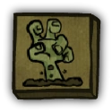

# Retributionist

- **Facción:** Town  · *en alcance MVP*
- **Página de la wiki:** Retributionist (ToS)

## Ficha

**Clase (alineamiento):**

> Town Support

**Tipo:**

> Special
> Unique

**Prioridad de acción:**

> 1

**Resumen:**

> You are a powerful mystic that can raise the true-hearted dead.

**Habilidades:**

> You may raise a dead Town member and use their ability on a player.

**Atributos:**

> Roleblock Immunity
> Control Immunity
> Attack: None
> Defense: None

**Atributos (texto):**

> Create zombies from dead true-hearted Town players.
> Use their abilities on your second target.
> Each zombie can be used once before it rots.

**Especial:**

> Unique Role

**Gana con:**

> Town
> Survivor

**Debe matar para ganar:**

> Mafia
> Vampires
> Arsonist
> Serial Killer
> Werewolf
> Witches/Coven
> Plaguebearer
> Pestilence
> Juggernaut

**Resultado Sheriff:**

> You cannot find evidence of wrongdoing. Your target is innocent or great at hiding secrets!

**Resultado Investigator:**

> Classic Results
> Your target could be a .
> Coven Expansion Results
> Your target could be a .

**Resultado Consigliere:**

> Your target wields mystical powers. They must be a Retributionist.

## Texto completo de la wiki

| 

 | Looking for the Town of Salem 2 role?

This role appears in Town of Salem 1 and 2. For the ToS 2 counterpart, see Retributionist.

 Retributionist 

Alignment

 Town Support

Avatar

Immunities

 Roleblock Immunity

 Control Immunity

Attack: None

Defense: None

Special

Unique Role

 Ability Stats

 | Type

 | Priority

 | Special

Unique

 | 1

Investigation Results

 Sheriff

You cannot find evidence of wrongdoing. Your target is innocent or great at hiding secrets!

 Investigator

Classic Results

Your target could be a Medium, Janitor, or Retributionist.

 Coven Expansion Results

Your target could be a Medium, Janitor, Retributionist, Necromancer, or Trapper.

 Consigliere

Your target wields mystical powers. They must be a Retributionist.

Game Information

Summary

You are a powerful mystic that can raise the true-hearted dead.

Abilities

You may raise a dead Town member and use their ability on a player.

Attributes

Create zombies from dead true-hearted Town players.

Use their abilities on your second target.

Each zombie can be used once before it rots.

Goal

Hang every criminal and evildoer.

 Victory Conditions

 | Wins with

 | Must kill

 | Town

 Survivor

 | Mafia

 Vampires

 Arsonist

 Serial Killer

 Werewolf

 Witches/ Coven

 Plaguebearer

 Pestilence

 Juggernaut

 | 

 | DISCLAIMER: These stories are fanmade, and are not created or endorsed in any way by BlankMediaGames or Digital Bandidos.

As darkness falls, a young boy walks home hand-in-hand with his mother. The medium gently tucks her son in to bed. The boy drifts off to sleep. The only noises heard that night were a knock at the door and a faint scream. 

Awakening the next day, the innocent child stares in anguish at the body of the woman who raised and loved him. As tears fall from his face, he calls out, hoping to wake up from this nightmare. Receiving no relief to this pain, the weeping boy staggers into the town square to share the horrific news. Returning home that night, the broken boy collapses onto his bed. Falling asleep, the boy looks up at the stars and wishes and prays to be with his mother again.

As the sun rises on Salem the next day, a young boy walks into town hand-in-hand with his mother.

Mechanics[]

The Retributionist is a Unique Role; there can never be more than one alive at a time.

You may resurrect one dead Town role per Night and use their ability on another player. You will receive the results your resurrected corpse otherwise would have (e.g. using a Sheriff to determine if someone is suspicious or not). 
The icon that displays next to a player in the graveyard after you have used their body

You will visit your first target in the graveyard. A Tracker can see you visiting the target you choose to resurrect. This is able to confirm you as a Retributionist if there is no Necromancer.

Resurrecting a target[]

You can resurrect a dead Townie during the Night. There are some restrictions:

Your target must be a Townie.

Your target died before the current Night (either via hanging or during a previous Night).

Your target was not Cleaned by a Janitor.

Your target was not Stoned by Medusa.

The corpse performs the second visit, not you. The corpse itself is then subjective to anything a normal player would be. A Lookout can see the dead player visiting their target, and a Bodyguard or Trap from a Trapper will respond against your resurrected player. Likewise, a Werewolf or Pestilence rampage at your second target's location will not harm you.

If both you and a Necromancer target the same player on the same Night, only one of you will be able to use the corpse, while the other player will fail and receive a message that the corpse is missing from the graveyard. Whoever gets to use the corpse that Night is decided at random. The other will still be able to use the same corpse on a future Night.

Players who have left the game can still be used.

You have Roleblock Immunity and Control Immunity, meaning that you will be able to control a corpse even if a Tavern Keeper, Bootlegger, or Witch/ Coven Leader targets you.

You do, however, get roleblocked by the Pirate (this is a bug).

Unlike the Necromancer, you can use corpses on yourself.

There is an ongoing bug that sometimes causes reanimated corpses to ignore transportation.

There is an inconsistent bug that sometimes causes reanimated corpses to be invisible to Lookouts, Trappers and even Spies. This has been happening ever since the QoL patch on October 20th, 2024.

A Psychic, Trapper, Jailor, Veteran, Mayor, Medium, Transporter, or another Retributionist (if you were an Amnesiac) cannot be resurrected.

 | Role

 | Usable?

 | Effects

 | Strategy 

 | Town Investigative

 | (except Psychic)

 | Causes the corpse to perform their ability on the target, which will be noticed by Lookouts, Trappers, or a Veteran on alert. You will get their results.

 | Use these individuals to get investigative results to figure out a player's role or to prove yourself as the Retributionist.

 | Town Support (excluding Tavern Keeper)

 | 

 | 

 | 

 | Tavern Keeper

 | 

 | Will role block the target.

 | You can use to keep evil roles at bay or to prove yourself as the Retributionist.

 | Jailor

 | 

 | 

 | 

 | Vampire Hunter

 | 

 | Will stake the target if they are a Vampire.

 | If there are Vampires remaining, use it to stake known ones.

 | Veteran

 | 

 | 

 | 

 | Vigilante (with bullets)

 | 

 | Will shoot the target. The Retributionist is not affected by guilt.

 | Using the Vigilante is recommended as it gives the Town an extra kill; it can also be used to confirm yourself as the Retributionist.

 | Vigilante (without bullets)

 | 

 | No effect.

 | You can use it to prove yourself as the Retributionist to a Lookout or Tracker.

 | Bodyguard

 | 

 | Will protect the target and counterattack one attacker. The Retributionist will not die from guarding.

 | You can use it to guard yourself or a confirmed Town member.

 | Crusader

 | 

 | Will protect the target and attack one visitor.

 | You can use it to protect yourself or a confirmed Town member.

 | Doctor

 | 

 | Will heal the target.

If the second target is a revealed Mayor, they will visit but not heal the second target.

 | You can use it to heal yourself or a confirmed Town member.

 | Trapper

 | 

 | 

 | 

 | Non- Townies

 | 

 | 

 | 

Strategy[]

A Retributionist somewhat serves as a mirror to the Necromancer, as you work for the Town using your abilities. You are limited with your uses, as you can only control Town roles. This can either be very useful or very useless depending on the Town roles who die.

 Town Investigative roles such as the Sheriff or Investigator can be used at any time to learn the results of other players. Lookouts can be used to watch important Town roles and keep you safe from any possible Ambushers or Werewolves who may target that Townie. Trackers can give you a quick way to determine someone's claim.

Using a Spy can be used to confirm a player as a Tavern Keeper or Transporter, or to catch evils claiming to be roleblocked, or that are seen with incriminating bug information such as having defense, being immune to role blocks, and in the case of a possible Arsonist, getting doused or cleaning gasoline from themselves.

If a Bodyguard dies whilst protecting a revealed Mayor, you might want to protect them again. The chances of a second Bodyguard is unlikely and the Mayor might be attacked again so this can slip up members of the Mafia or Coven by doing this.

Using a Bodyguard is usually preferable to a Doctor since the Bodyguard can take down an attacker, but the Doctor can save a player from multiple attacks. If you think a player will be attacked by multiple parties you should use a Doctor over a Bodyguard. A Crusader however can attack a possible attacker and keeps the target safe from all attacks against them (especially if they're a revealed Mayor), so they may be more useful.

Always try and save Town Protective corpses until you are confident a player will be attacked. You only have one use on every corpse and shouldn't waste it.

 Vigilantes are your only reliable killing role and can be used to prove whether someone is evil or not depending on who you shoot. You can also determine if your target has a form of defense, but be careful to not confuse it with another Town Protective role protecting them instead.

A Vampire Hunter can be used if you believe that Vampires are still at large. If a player is accused, you can stake them to check, preferably on a Night Vampires can't convert them.

 Tavern Keepers can prevent possible Mafia Killing and especially Neutral Killing roles from killing during the Night. However, a Serial Killer cannot be stopped from killing.

Coordinate with a Trapper about who they trapped so you don't accidentally set off any of their traps with your corpses as you will not only screw over the Trapper, players will think you are actually a Necromancer.

 Medusas and Janitors are trouble, as they prevent you from using certain corpses as they clean out their victim’s roles. Janitors especially can make your Retributionist claim more suspicious due to their presence in your investigative result. Vampires are also a nuisance as you are unable to use the Townies they convert.

You will always use the true ability of the dead Townie if they are indeed a Townie. Forgers can be a dangerous threat; they can deny you corpses to use if they forge someone as a non- Town or non-visiting role, make your claim look suspicious by forging someone as a Retributionist since the role is unique, or even trick you into accidentally killing important Town roles (like a Mayor or Jailor) by forging a Vigilante as a Town Protective role.

If you try to use a non-town role forged as a Town Investigative, they won't produce any results. Use this to help discover the existence of a Forger.

If you are torn about whether or not to vote guilty on a player or are considering abstaining, you might want to vote guilty instead. If the hanged turns out to be a Townie and not evil, you can use their corpse the same Night, but you may be seen as suspicious for guilting a Town member so this is not justification to vote guilty on players who you aren't suspicious of.

You are one of the few Town roles that still win or draw in a 1v1 or 2v1 against a solo Mafia or even the Neutral Killing depending on what roles have died.

If there is a dead Vigilante, you can still draw against a solo Mafioso or any Coven member minus the Coven Leader (and sometimes Necromancer). You can also pull the victory this way if the Town holds a 2-1 majority.

 Doctors can stall out the game for a couple of Nights which can cause draws, which are usually preferable to losses, especially since in Ranked games, as players will not lose any Elo incase of a draw. Be mindful that you will not be awarded a Draw if a non-factional role complete their win condition.

If there is a dead Bodyguard corpse you can win against all Mafia Killing roles, Serial Killer Werewolf, Juggernaut (with less than three kills), Vampire and all Coven roles with the Necronomicon except a Hex Master and Necromancer. If there are multiple Bodyguards, you can win against multiple separate attacks, but not more than one attack in the same Night.

If there is a dead Crusader, you can win against a solo Mafioso or all members of the Coven except the Coven Leader, Necromancer, and Hex Master.

If there is a dead Vampire Hunter and only one alive Vampire, you can win with the Town only if the Vampire cannot bite a target the same Night, otherwise you will be converted and instead win the game as a Vampire.

You are one of the few roles who can deal with roles that use the Rampage ability, such as Werewolf or Pestilence. Your corpse performs their ability on your target, which also results in your corpse visiting them and taking any damage you otherwise would've received. Against Pestilence specifically, if enough Town Protective roles are in the graveyard you could potentially force a draw for the Town over a loss.

 Retributionist vs. Evil Role[]

Below is a list of possible draws or victories for the Retributionist when alone against a single evil role.

Do note that some of these outcomes are only possible with multiple corpses.

 | Role
 | Corpse(s)
 | Result 

 | Mafioso

 | Doctors, Tavern Keepers, or Vigilante
 | Draw

 | Bodyguard or Crusader
 | Town wins

 | Godfather

 | Doctors, Tavern Keepers, or Crusaders
 | Draw

 | Bodyguard
 | Town wins

 | Arsonist

 | Tavern Keepers
 | Draw

 | Juggernaut

 | Tavern Keepers
 | Draw

 | Tavern Keepers, Doctors or Crusaders

(before 3rd kill)
 | Draw

 | Bodyguard

(before 3rd kill)
 | Town wins

 | Serial Killer

 | Doctors or Crusaders
 | Draw

 | Bodyguard
 | Town wins

 | Werewolf

 | Doctors, Tavern Keepers, or Crusaders
 | Draw

 | Bodyguard
 | Town wins

 | Pestilence

 | Bodyguards, Doctors, or Crusaders
 | Draw

 | Vampire

 | Tavern Keepers, Doctors, or Crusaders
 | Draw

 | Bodyguard
 | Town wins

 | Vampire Hunter or Vigilante

(after a conversion)
 | Town wins

 | Coven Leader

 | Doctors or Crusaders
 | Draw

 | Bodyguard
 | Town wins

 | Hex Master

 | Tavern Keepers or Vigilante
 | Draw

 | Medusa

 | Doctors, Tavern Keepers, or Vigilante
 | Draw

 | Bodyguard or Crusader
 | Town wins

 | Necromancer

 | Bodyguards, Doctors, or Crusaders (if rival has Powerful Attack or Basic Attack)
 | Draw

 | Vigilante (if rival has Unstoppable Attack)
 | Draw

 | Poisoner

 | Tavern Keepers
 | Draw

 | Vigilante (if Retributionist is Poisoned)
 | Draw

 | Bodyguard, Crusader or Vigilante
 | Town wins

 | Potion Master

 | Doctors, Tavern Keepers, or Vigilante
 | Draw

 | Bodyguard or Crusader
 | Town wins

Proving your role[]

Due to the changes in the Retributionist role, it is now much harder to confirm yourself, and it is a much easier claim for evils. There are, however, a few strategies you can use.

Using a Vigilante is one way to do this since you will create an obvious result, however, this is risky and can cost a valuable Townie, so only do this if you know that your target is evil.

If a player tries to claim your role, use a dead Vigilante to shoot them. Your role is unique, so there cannot be a second one.

Announce that you counterclaim Retributionist and that you will use a dead Vigilante to shoot them if they do not show proof of another role, as you risk accidentally shooting an unrevealed Mayor that is trying to lay low.

Additionally, in the Coven Expansion, your counterclaim might be a Necromancer. If they reanimate the same Vigilante to shoot you, there is a very high chance that not only you will be killed, but you also will not be able to shoot them. Once your role is revealed the Town should piece together that the player you said you were going to shoot is a Necromancer, but it will still cost your life.

Using a Tavern Keeper to roleblock a player can confirm you as a Retributionist, since this leaves a clear message behind. You should whisper in advance to make sure your target knows you will roleblock them, so they can confirm you later.

You should only do this to a confirmed Townie who will not act that Night (such as a Medium) or a role that is no longer useful (such as a Sheriff in a Vampire game) or a role that is Roleblock Immune.

Do note that if you roleblock an evil role, they can accuse you and you could get hanged.

You could still be accused of being Bootlegger or Hypnotist, so this isn't foolproof.

One strategy is to roleblock a confirmed Veteran who will alert that Night, as this will trigger their alert message and confirm you aren't lying.

Resurrecting an Investigator or Lookout to see find information that is confirmed by other players can help you become confirmed, or if you use a Sheriff and find someone as suspicious.

Successfully using a Bodyguard and protecting someone can confirm you, but a Necromancer could easily put your claim under suspicion.

If a Lookout sees a dead player visit another player, this will confirm your existence unless you are playing in a gamemode with a possible Necromancer.

A Lookout can fully confirm you as Retributionist if they watch you while you make a dead player visit you, as Necromancers cannot target themselves with corpses.

If a Tracker sees you visit, they can confirm you as a Retributionist or Necromancer.

A Spy can help clear any suspicions of being a Necromancer by noting that no Coven members visited the corpses you used.

Achievements[]

 | Name

 | Description

 | Merit Points

 | The Avenger

 | Win your first game as a Retributionist

 | 20

 | Vengeance

 | Win 5 games as a Retributionist

 | 20

 | Revitalize

 | Win 10 games as a Retributionist

 | 40

 | Reanimate

 | Win 25 games as a Retributionist

 | 100

 | Welcome Back Doc

 | Resurrect a Doctor to heal yourself

 | 20

 | Encore

 | Resurrect a Sheriff and find someone suspicious

 | 20

 | Second Chance

 | Resurrect a Bodyguard and defend from an attack

 | 20

Messages[]

 | 

 | The corpse you targeted is missing!

 | Displays to the Retributionist when the corpse they targeted has already been used previously.

Displays to the Retributionist when the corpse they targeted was used by a Necromancer that Night.

Trivia[]

Prior to Version 3.2.4, the Retributionist was able to revive a dead Townie, bringing them back to life permanently. This was most likely changed since some players felt the role was too powerful (especially in the Town Traitor gamemode and Ranked) and wasn't fun to play as or against.

Also prior to Version 3.2.4, the Retributionist was previously unable to be a Town Traitor in Town Traitor Game Modes.

History[]

3.3.11

Fixed Retributionist not being Control Immune when controlled by a Coven Leader or Witch.

3.2.4

The Retributionist can no longer revive players.

The Retributionist can now resurrect certain Town roles once per game to use their ability on a living player.

 Retributionist uses in-place secondary targeting rather than a slide-out secondary menu.

 Retributionist can now be a Retributionist in Town Traitor and a Retributionist in Town Traitor.

Removed sound effect for when a player is revived.

Removed message "You have 1 resurrection left.".

Removed message "You have 0 resurrections left.".

Removed message "You have been resurrected by a Retributionist!".

Removed message "(Player) has been resurrected!".

Removed message "(Player) was brought back to life!" (seen in the middle of the screen).

2.5.5.12200

The Retributionist's role icon has been changed. Old one was .

Added Retributionist's circled role icon ().

1.5.10.4972

Added a sound effect for when a player is revived.

Town of Salem Release

Introduced.

 | 

 | 
Roles

 | 

 | 

 | 
 Town

 | 

 | Town Investigative | | Investigator • Lookout • Psychic • Sheriff • Spy • Tracker | | 

 | 

 | Town Killing | | Jailor • Vampire Hunter • Veteran • Vigilante

 | 

 | Town Protective | | Bodyguard • Crusader • Doctor • Trapper

 | 

 | Town Support | | Mayor • Medium • Retributionist • Tavern Keeper • Transporter

 | 
 Mafia

 | 

 | Mafia Deception | | Disguiser • Forger • Framer • Hypnotist • Janitor | | 

 | 

 | Mafia Killing | | Ambusher • Godfather • Mafioso

 | 

 | Mafia Support | | Blackmailer • Bootlegger • Consigliere

 | 
 Coven

 | 

 | Coven Evil | | Coven Leader • Hex Master • Medusa • Necromancer • Poisoner • Potion Master | | 

 | 
 Neutral

 | 

 | Neutral Benign | | Amnesiac • Guardian Angel • Survivor | | 

 | 

 | Neutral Evil | | Executioner • Jester • Witch

 | 

 | Neutral Killing | | Arsonist • Juggernaut • Serial Killer • Werewolf

 | 

 | Neutral Chaos | | Pirate • Plaguebearer/ Pestilence • Vampire

## Implementación

- [ ] Definido en `packages/engine` con su prioridad y facción
- [ ] Acción nocturna (si aplica) validada con objetivos legales
- [ ] Resultado de investigación correcto (Sheriff / Investigator / Consigliere)
- [ ] Condición de victoria y de derrota comprobada en tests
- [ ] Tests unitarios del rol en verde
- [ ] Tarjeta y texto de ayuda en la app
- [ ] Icono e ilustración propia (no el arte de la wiki)
- [ ] Plantillas de narración para sus eventos
