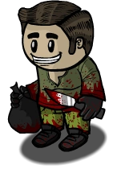

# Serial Killer

- **Facción:** Neutral  · *fase posterior (referencia)*
- **Página de la wiki:** Serial Killer (ToS)

## Ficha

**Clase (alineamiento):**

> Neutral Killing

**Tipo:**

> Killing
> Manipulation
> Non-Unique

**Prioridad de acción:**

> 5

**Resumen:**

> You are a psychotic criminal who wants everyone to die.

**Objetivo:**

> Kill everyone who would oppose you.

**Habilidades:**

> You may choose to attack a player each night.

**Atributos:**

> Role block Immunity (Tavern Keepers and Bootleggers only)
> Attack: Basic
> Defense: Basic

**Atributos (texto):**

> If you are role blocked you will attack the role blocker in addition to your target.
> Role blockers that target you will have their last will covered in blood making it unreadable.
> You can choose to be cautious and not kill role blockers.

**Especial:**

> Attacks role blockers along with intended target

**Si hay Godfather/otro objetivo:**

> Attack your target

**Gana con:**

> Serial Killer
> Survivor
> Witch

**Debe matar para ganar:**

> Town
> Mafia
> Coven
> Vampires
> Arsonist
> Werewolf
> Plaguebearer
> Pestilence
> Juggernaut

**Resultado Sheriff:**

> Your target is suspicious or framed!

**Resultado Investigator:**

> Classic Results
> Your target could be a .
> Coven Expansion Results
> Your target could be a .

**Resultado Consigliere:**

> Your target wants to kill everyone. They must be a Serial Killer.

## Texto completo de la wiki

| 

Serial Killer 

(SK)

Alignment

 Neutral Killing

Avatar

Immunities

Role block Immunity ( Tavern Keepers and Bootleggers only)

Attack: Basic

Defense: Basic

Special

Attacks role blockers along with intended target

 Ability Stats

 | Type

 | Priority

 | Killing

Manipulation

Non-Unique

 | 5

Actions

Target other

Attack your target

Investigation Results

 Sheriff

Your target is suspicious or framed!

 Investigator

Classic Results

Your target could be a Doctor, Disguiser, or Serial Killer.

 Coven Expansion Results

Your target could be a Doctor, Disguiser, Serial Killer, or Potion Master.

 Consigliere

Your target wants to kill everyone. They must be a Serial Killer.

Game Information

Summary

You are a psychotic criminal who wants everyone to die.

Abilities

You may choose to attack a player each night.

Attributes

If you are role blocked you will attack the role blocker in addition to your target.

Role blockers that target you will have their last will covered in blood making it unreadable.

You can choose to be cautious and not kill role blockers.

Goal

Kill everyone who would oppose you.

 Victory Conditions

 | Wins with

 | Must kill

 | Serial Killer

 Survivor

 Witch

 | Town

 Mafia

 Coven

 Vampires

 Arsonist

 Werewolf

 Plaguebearer

 Pestilence

 Juggernaut

 | 

 | DISCLAIMER: These stories are fanmade, and are not created or endorsed in any way by BlankMediaGames or Digital Bandidos.

During the day he shakes hands, and makes friends, claiming to be the town’s best doctor. But in the night he slowly wanders home through the streets of Salem to his humble abode. When he arrives, he pulls out a large knife and cleans it with the greatest of care, a piece of equipment for his patients, or for his victims? Little does this innocent (not really) town know that this person has been striking fear into their hearts for several nights, for in the day he acts as if he wishes to help, but in the night, he preys upon the weak and using his worn weapon; slowly makes one unlucky soul of the town suffer each night. He is their nightmare, he is a Serial Killer. “Who is next” this fiend thinks to himself, for only he truly knows who is next, each night, every citizen is left wondering what will happen. He finally decides to attack an elderly man known for his wise words throughout Salem. As he exits his home, he quickly, but quietly walks to the poor soul’s house, hoping not to be seen. Finally, he arrives, and knocks on the elderly man’s door. The man opens the door with a great warmness, inviting this killer inside. The instant he walks in and the door becomes shut, he pulls the overused weapon from inside his coat and pounces upon the man, taking him to the ground as a twisted smile forms across his face. He then slowly raises the large knife and drives it into the man’s chest, laughing as he does so. After what little of a struggle the wise man put up is over, the fiend washes himself off, and returns to his home in the night for what little rest he can get before going back to his charade the next morning.

Mechanics[]

Choose to attack a player each Night, dealing them a Basic Attack.

You will automatically attack any player who attempts to roleblock you during the Night along with your original intended target. Their Last Wills will be "bloodied" and no one will be able to read them. 
A Last Will covered in blood by a Serial Killer

You may use your Cautious ability during the Night to instead only attack your intended target, and not attack any roleblockers who visit you.

A Janitor may clean blood from a bloody Last Will. They will receive the Last Will and role in this case.

You have Roleblock Immunity against Bootleggers and Tavern Keepers only. You will attack them and your intended target if you do not choose to be Cautious. If you are roleblocked while Cautious, you will receive the message: Someone tried to role block you, but you are immune!

 Jailors and Pirates will indirectly roleblock you, meaning you will be forced to attack them, and you cannot select a target when roleblocked by them. However, you can spare both the Jailor and Pirate if you use your Cautious ability.

You will automatically win in a 1v1 stalemate against a Transporter, the Godfather and the Coven Leader.

Strategy[]

As a fast-killing Neutral Killing role, you are a major target for all other factions due to your ability to kill. If played correctly, you can strategically eliminate any rivals in your path while staying undetected at the same time. However, any claims relating to a Serial Killer are usually hanged if they weren't previously revealed, and you will always be hanged quicker if other rival factions don't have a majority (e.g Town vs Mafia early or middle game)

Dealing with accusations[]

Always try to deflect the blame off yourself onto another person so the fact that someone accused you of being Serial Killer is forgotten. Keep in mind that this does not always work and may even add fuel to the fire, having you hanged.

Also, be smart when trying to claim a role if you are Serial Killer. Look at the role list and the graveyard frequently in case someone with the role you're claiming dies, or an Investigator has a Last Will with you in it.

Whispering a confirmed Townie about your role and suspicions of someone can be in your favor for deception since no one else can see the whisper, other than the Blackmailer. The Townie you whispered will likely suspect you to be an Investigator trying to hide from threats. If they believe there is nothing suspicious about the whisper, eventually they can be your potential ally when it comes to another Town accusation, which depends on your fake role claim and suspicions. However, this does not always work with more experienced players. If you think or know there is an alive Blackmailer be cautious about what you say, as you could be heard by one of your biggest rivals.

If somebody other than you is accused of being a Serial Killer, use it as an advantage. Keep them alive, and kill whoever is accusing them of being the Serial Killer. By doing this, the Town will think they are the Serial Killer, and go for them instead of you. However, this could backfire and people may think the Serial Killer is framing them. Be aware of a Bodyguard or Doctor, as they could potentially predict the Serial Killer's victim.

If you are suspected, write in your Death Note that you are the Serial Killer, but in the third person (e.g, "Jack is the Serial Killer" if your name is Jack). Point out in the chat that you are being framed. It might work, especially with less experienced players, but tends to put lots of suspicions on your back.

Another way to deflect suspicion is to say in your Death Note that you will kill yourself but in the third person, e.g, "Jack will die toNight" if your name is Jack. Point it out; you will probably be Healed. If you are Jailed, you are best off being Cautious (to avoid killing the Jailor) and claiming you were attacked in jail unless you are certain that there is no Medium.

A good way to deflect suspicion is to pretend to be a Jester. Keep in mind this won't work in Classic Mode if both the Jester and Executioner have been killed, or if in Custom Mode or Rapid Mode, there are certain role settings. Along with these, a Vigilante or Jailor may just shoot/execute you instead to lower the majority vote.

A very risky strategy to play as a fake Doctor claim: Being Cautious every Night, not killing, Could fool the Town into thinking there is an Arsonist and making Bodyguard claims more suspicious. Late-game, start killing to sway votes in your favor. Doing this is very risky because Sheriffs interrogating you, or Mafia/ Coven attacking you will easily end your game.

Another way to deflect suspicion is to act like an Executioner and aggressively accuse one person (ideally, someone you think is actually Town.) This does have drawbacks: the Town could decide to hang you or the Jailor could execute you. Accidentally accusing an actual member of the Mafia has some benefits (the Town might believe you and protect you), but carries the risk that the Mafia will try to kill you and discover your Basic Defense. Also note that while implying you're an Executioner can help, you should avoid actively claiming to be an Executioner in response to an accusation. At that point, it's unlikely to help, since the Town has no reason not to hang an Executioner. You can also claim you are an Executioner after at least one person has died, but it works better when multiple people have died. Simply say your target was already hanged, and so you win either way, and offer to side with them by giving the Town an extra vote. The Mafia won't want to waste a kill on you, either. This might not work on experienced players, though.

Being called out for having strong defense is one of the most frequent ways for a Serial Killer to lose, so it helps to have a strategy for it. One advantage you have is that if you were hit by the Mafia, you'll have at least one turn to prepare before they can out you in a Death Note. Some important notes: 
The promotional image for the Serial Killer

You can pretend to be an Executioner, but as noted above, this works best if you imply it before you're accused, and it carries a risk of being hanged. Be careful who you make your target, though, as you carry the risk of accusing the Jailor (who will immediately jail and kill you) or the Sheriff (who will interrogate you and find out you are suspicious). Successfully hanging a member of the Mafia or a Neutral will also immediately solidify the fact that you are not an Executioner.

You can claim to be a Survivor and say you used your bulletproof vest. However, Survivors are non- Town, so you may simply be hanged anyway. Also, note that claiming to be a Survivor is commonly used, so the Town may not believe you. Beware of Investigators, Consiglieres, and Sheriffs, as they will immediately know and there is a high probability of them telling the Town. This also helps the Mafia in the case of a Consigliere, as the Mafia now has one person that the Town trusts.

You can claim to be a Bodyguard and say you used your bulletproof vest. However, you can only say this once. Also, since Bodyguard is a common claim for the Godfather and the Arsonist, an aggressive Town could hang you.

You can claim you were healed by a Doctor or you can claim to be a Doctor who self-healed.

You can claim you were Transported by a Transporter. However, since active Transporters are very obvious, this works only if other people have been transported, too. If you're going to do it, announce you were Transported as soon as the Day begins.

You can simply deny having been attacked in the first place. If possible, you can argue that the Mafia is lying in the Death Note and that the Mafia Killing might have actually been roleblocked or jailed that Night.

Remember, you may not be accused. If you don't, you can just play normally, but don't rush too ahead of yourself. Doing something like claiming Doctor and saying you healed yourself before anyone accuses you is a dead giveaway to most experienced players and can have you hanged unnecessarily. Players might ask you to heal them the following Night, so make sure to have some excuse.

A strategy used often in many games is to write two Last Wills on your own. Write one for your fake role, and one below for your real one. Claim the fake role and show the fake one for proof.

Always try to keep the accusation as quiet as possible. If it doesn't come to many Townies, you may be able to last longer. So if someone accuses you, try to do something like you didn't see them ask. This may cause them to start asking more and you may have to give them a claim.

Who to kill[]

Being a Serial Killer you have to be careful who you decide to kill each Night, since you don't know who a Bodyguard or Doctor might be protecting. You also want to avoid targeting the same person as the Jailor or other killers, which would waste your kill. Don't use any sort of order or predictable system to pick your targets, and avoid picking 'obvious' targets unless it's absolutely necessary. You could also not kill until near the end of the game to catch the Town off-guard. Using that strategy is risky, however, since the Town could figure you out.

Names that seem rather normal or have a very low chance of being picked on are the best targets.

Picking victims from the middle is a good choice, as Lookouts, Sheriffs, and Investigators, sometimes go from bottom to top or top to bottom. It might depend on whether the player is good or not, but you'll hardly know that early game.

 Investigators and Sheriffs tend to open the Day by saying things like "any leads?". Killing them first is a good strategy. However, they might be a Veteran trying to lure you in. If they're Mafia trying to blend in, however, it doesn't matter much.

As a Serial Killer, you sort of have a love-hate relationship with the Sheriff. They can easily call you out, so it might seem like a great idea to kill them off first, but remember: the Sheriff can also catch members of the Mafia, the Coven or even the Werewolf, all of which you need to dispose of in order to win the game. Therefore, you should always consider if it's worth killing the Sheriff off or not. If there are multiple undiscovered members of the Mafia or Coven, you may want to allow him to live for a little longer, as long as you're not in any danger of being caught yourself.

Going off of the above, assuming you don't know any more roles, killing the first person to talk every Day is surprisingly effective, but Investigators might stay quiet until they have found a member of the Mafia or a Neutral Killing. Be warned this is a common strategy, so Bodyguards, Doctors or even a Lookout may figure it out. You can do First Person Talking, Last Person Talking to try and throw them off. Experienced players can normally pick up on patterns though.

The next couple of Nights, you could use the same strategy to kill, and also be patient if you choose to. Being patient and unsuspecting can be extremely hard to do, as you can be suspected at any given moment when someone realizes you aren't talking, and so on. Being patient rewards you with some information about different roles, as listed below in the "How to find a role" guide. Sometimes, people would flat out say their roles or give hints which reveal who they are.

However, the most important strategy is to try to balance the Town and Mafia ratios. You should be making decisions under the assumption that the Mafia too wants to take care of core Town roles. If one faction becomes too powerful, the other will fall quickly, and so will you.

You should also try to figure out how good the players are, which is a skill that will come with experience. If someone shows signs of being an unskilled Townies (like pushing for a random hang), keep them around. They can confuse the Town. On the other hand, be on the lookout for skilled players. One way to do this is by reading votes. If someone is put on the stand and hanged with very little evidence and they turn out to be innocent, target people who vote innocent or abstain.

Try to figure as many of the people's roles out, so that you know who you should kill first and find out possible Town Protective roles. Don't constantly ask what the roles of people are out in public, just piece together information to find out (elimination, how they are acting etc.) 

Using your Cautious ability[]

Unlike the Werewolf, your Cautious ability allows you to spare roleblockers and only attack your intended target. Do note however, that unlike other roleblock immune roles, Pirates will prevent you from killing your intended target and regardless if you chose to be Cautious or not, a Pirate that wins the duel will kill you and live. Jailors are a much more direct threat to you, so target them if you can.

 Tavern Keepers generally pose very little threat to you even if you decide to not use your Cautious ability. This is because their Last Wills become covered in blood and are unreadable and you can use them for extra kills per Night. The only reason you should be using your Cautious ability for Tavern Keepers is if they announce who they're going to roleblock, are protected by a Bodyguard, or a Medium exists.

 Bootleggers are slightly more of a threat since their death from visiting you will reveal your role to the Mafia (since they know who the Bootlegger visited), in which they can draw the Town's attention to you (either by using Death Notes or public accusation) to get you hanged. Even if the Mafia wants to keep you alive at the moment, a Spy would see the Mafia visit on you, and you might be accused by the Town instead. You should keep your Cautious ability active if you suspect a Bootlegger exists, unless you're convinced that a Transporter or Witch/ Coven Leader changed the Bootlegger's target (and there is no Spy).

 Jailors still pose the largest threat to you. If you are jailed, consider if it's worth attacking them, as anyone who visits you will know you were the jailed Serial Killer, and a Bodyguard protecting the Jailor will kill you. If you are going for the "no kill" strategy, then the Jailor poses a little less of a threat, since they wouldn't know that the person they jailed was the Serial Killer.

 Pirates pose a considerable threat, as they can disregard your Basic Defense with their Powerful Attack. Similar to the Veteran, you can choose to "throw caution to the wind" and kill the Pirate. Unlike the Veteran however, you will not attack the Pirate if you lose the duel. You can still choose to spare the Pirate by going Cautious.

Priority Targets[]

Keep your priorities in mind. You have to think about the possibilities of which any of the threatening roles may find you. If the Town has been narrowed to a handful of people, it's good to keep track of which one has a bigger chance at discovering your motive. After killing the one with the bigger chance, you could continue on killing until you are met with another role that could discover you.

 Mafia and Coven: These are, by a large margin, the most serious threat you face, and eliminating them should take near-absolute priority over anything else. This is because they can cause you to lose in several ways (and these are the most common ways Serial Killers lose)

First, the Mafia can attack every Night, and if they hit your immunity you can be exposed at any time by the Mafia's Death Note and will probably be shortly hanged.

Second, if the Coven identifies you, the Coven Leader can use you to attack their targets for them and be a meat shield for any Bodyguards and Traps.

Third, near the end of the game, if too many members of the Mafia or Coven are left alive and will know your identity since they know their teammates, they will hang you with higher priority than the remaining Town.

Even if they don't know your identity, you will eventually be outed to the Mafia or Coven by process of elimination (since, unlike the Town, they automatically know their own numbers); even if other non- Mafia/ Coven exist, these factions have a substantial advantage in identifying you, since they can eliminate their own members from consideration. The Consigliere and the Potion Master can also identify you directly, and do it without a trace.

On top of this, both factions have roles with immunity; you generally must get these people hanged in order to win. If you reach the late game without having eliminated the Godfather (and their Mafioso) or Coven Leader (once they have the Necronomicon), you will probably lose, draw, or be forced to rely on a kingmaker. You cannot kill these roles directly, but it is worth intentionally seeking them out when attacking, since once you've found them by hitting their immunity you can out them to the town in a Death Note in order to get them hanged.

For the most part, you should not intentionally leave these factions alive in hopes that they will kill the Town for you - this is usually a terrible idea; the Mafia and Coven are vastly more dangerous to you.

The only caveat is that unless the Mafia is about to reach a majority, killing one of them may not slow them down much, so you might prioritize other roles early on; but as a group, eliminating the Mafia as soon as possible is crucial to your victory and needs to be an overriding priority.

However, be wary of not going Cautious when there's a Bootlegger afoot as their death from visiting you (signified by a bloody Last Will) will unambiguously reveal your role to the Mafia.

The Coven are more individually dangerous, with most of them having some way to kill or identify you, and should therefore be prioritized if you have to choose.

The Coven become even more dangerous with the Necronomicon, since the holder of the Necronomicon can attack you, and will reveal your Defense, unless they are a Medusa (in this case, you will die).

 Vampire: Vampires are a threat for the same reasons as the Mafia and Coven, but slightly less so because they only attack (and therefore can only detect your Basic Defense) once a Night. Nonetheless, their ability to multiply and spread undetected can make them a dangerous foe later on. If you know there are multiple Vampires, make sure to kill them off as soon as possible. It is often in your best interest to keep any known Vampire Hunters alive, since they are harmless and can kill Vampires for you.

 Jailor: A Jailor is a high priority target; they can execute you, which bypasses your Basic defense. If the Jailor told the Town the previous Day they would jail you, then die from you and get their Last Will bloodied, you will most likely die. If they are not protected by any Town Protectives, taking them out when not jailed should always be a priority.

 Town Investigative, Consigliere, Potion Master, Coven Leader, and Blackmailer: A Sheriff could quickly call you out as suspicious, and an Investigator will put your name into their Last Will as Doctor/ Disguiser/ Serial Killer/ Potion Master, which narrows your claims, and if a known Serial Killer is about, especially in an uncertain role list, you may be hanged without much preparation. A Lookout or Tracker may witness you killing another important Townie, outing you with no cover if there are no other visitors. Psychics, although they cannot find you directly, are oftentimes immediately trusted, meaning you run the risk of being hanged if you're in their Last Will in an evil result. However, the Psychic is somewhat less dangerous if you manage to be put into a good vision; it's easy evidence to pretend you're a Town member, and if you're lucky enough to have a 2 evil player result you can avoid being hanged if you're last. A Consigliere will gladly reveal you to the Town, directly posing as an Investigator or through a Death Note, as it will allow them to be protected by the Town, believing them to be an Investigator. The Blackmailer can deduce your identity from your whispers. A Spy could find out that the Mafia visited you and you didn't die, which could hint to you having a form of Defense. The Potion Master, if you are either revealed or attacked, will be eager to call you out as you share their investigative results, meaning if there's an Investigator in the game they could potentially be hung under suspicion of being you. The Coven Leader, after controlling you, will also be very happy to call you out to the Town to gain confirmed Townie status if they found a better killing role, like a Werewolf.

Other Neutral Killings: They have a higher Defense value than your Attack value, so just try to be subtle when accusing them of being that role. That means not just flat out saying "This person is a Werewolf!". Instead, try asking for their role. If you are planning on flat out calling them out for their role, make sure to pose as a Town Investigative role to gain the trust of the Town. For an Arsonist's case, if you know who the Arsonist is, wait a Day after attacking to ask their role. They might be able to kill some people for you unless they want to go solo, then they might flat out reveal you. Another viable strategy is to call them out via Death Note, by writing that your target has defense and to hang them.

 Town Protective roles: If any Town Investigative roles are revealed, they will often protect them, making you either waste an attack or possibly be killed. As long as a Town Protective is alive, any Town Investigative or posing Consigliere/ Potion Master can safely call you out during the Day without fear of being immediately killed the next Night. The Trapper and the Bodyguard can take care of you directly with their protection, so go for them first.

 Tavern Keepers, Bootleggers, and Pirates: While Tavern Keepers and Bootleggers, when not using your Cautious ability, cannot directly out you with their Last Will, Pirates still can and may be a threat. If you cannot side with a Pirate, killing them may prove to be a good choice. The Mafia would also know who the Bootlegger visited however, and can out you in a Death Note or Last Will if they can.

 Vigilante: If they attack you, they will often tell the Town immediately to hang you, knowing you have a higher Defense value than their Attack value. If this happens, see above on how to deal with accusations of having a higher Defense value than an attacker's Attack value; however, the fact that they can accuse you to your face complicates things. Claiming to have been healed by a Doctor is even less likely to work against a Vigilante, since the Town would expect a real Doctor to immediately step forward and confirm your claim. If the Vigilante isn't confirmed, you can also couple your defense with a counter-accusation that they're Mafia (which may even be true). For instance, claim you're a Survivor or Bodyguard who vested, then ask why they attacked you, and suggest that they may actually be a member of the Mafia. People often don't trust unproven Vigilante claims, so saying they're a Mafioso could buy you some time.

Other Townies, while not nearly as dangerous as other roles, can be dangerous if they receive information (e.g. the Medium or Mayor) from more important targets. Also, their numbers contribute to hanging you once you are accused.

Finding Certain Roles[]

Finding Townies[]

 Investigator:

They will often ask something along the lines of, "Has anyone been Transported?" to see if their results will be compromised or not.

They tend to send a lot of whispers (either to people who came up in a mainly Town result, or demanding that people with suspicious results claim a role).

The most obvious sign is when they flat out accuse someone of being a combination of any or 3 possible roles. However, note that when someone is obviously an Investigator, they're very likely to be protected.

 Doctor:

Your main way of dealing with Doctors is to try and avoid choosing people they're likely to heal. If you need to kill one, though, look for quiet people. Doctors normally do their best not to reveal their role to anyone except proven or provable Townies, such as the Jailor, Mayor and Spy.

If you know a proven Townie, watch for them whispering to the Doctor requesting for a heal that Night. Do not attempt to kill them the following Night, as you will waste a Night going to kill someone when there's a Doctor planning to visit.

 Lookout:

 Lookouts will often ask questions about the less obvious visiting roles, such as whether anyone was witched or role blocked, since this helps judge who their visits are and what role they are.

At most times, they would outright say that you went to a victim's house. The Town would usually believe them, and you have no complete route of escape through this. However, you can kill them first once they reveal hints.

After the first Night or so, Lookouts would give away information to the Townies or to Investigators/ Sheriffs. The usual are "Person D visited Person A." or "Person B was visited by Person G." Lookouts can be eliminated first, as they have a bigger chance at discovering who you killed through watching. If they have not revealed themselves, then continue to figure out the rest of the Town Investigative roles or stick with the strategy.

Finding members of the Mafia[]

The Godfather has a higher Defense value than your Attack value, making them easily identifiable at Night, but the rest of the Mafia may not be so obvious.

Watch the conversations during Discussion Time, and see who is talking to who the most.

If a person is accused, and suddenly 2 or 3 people that hadn't been talking suddenly step up to his defense, that could indicate to you who the Mafia are, as they can be usually silent during discussion time.

If someone initiates a random hang, keep an eye on supporters. The Mafia usually shows up after 3 or 4 votes to make sure the person will be put on trial. However, if voting flows slowly, it's a good sign the voted person is a member of the Mafia.

Guilty and Innocent votes can tell a lot. Mafia sometimes tend to vote guilty on everyone except their own. If a known Mafia is about to be hung, watch to see who votes innocent or abstains. They could be Mafia. However, smart Mafia players will vote guilty to not seem suspicious.

Sometimes, you may not want to write in your Death Note that the Godfather had a higher Defense value than your Attack value until the Mafioso is dead. If the Godfather dies, the Mafioso will take their place, making them have a higher Defense value than your Attack value as well, which can further delay your kills.

The Ambusher is completely harmless to you and can be easily identified if they try to kill you. If you see them prepare an ambush while killing your target, you can place their name in your Death Note on the same Night you saw the Ambusher to draw the Town's attention to them to get them hanged.

People who talk a lot and seem to be trying too hard to act like a Townie could be a member of the Mafia or another rival evil, but they could be a Jester or a talkative person in general.

Anyone who did not vote against a confirmed Mafia might be a member of the Mafia.

Anybody who seems confident, too confident, may be the Mafia. They know who's doing most of the killing, so they may be overly cocky or talkative. 

Watch voting patterns. Mafia members may not vote at all, or will only vote Town and not their team.

Dealing with Other Roles (Classic)[]

 Jailor: When the Serial Killer is jailed, not executed, and not Cautious, they will kill the Jailor at the end of the Night. If there is an alive Medium, you are probably screwed, and just have to hope that they didn't have enough time to write in their Last Will if neither of them are AFK.

 Investigator: Once you've been Investigated, you have little choice but to claim Doctor (you could also claim to have been Transported, but this is unlikely to hold up for long.) It might also help, instead of telling Town directly that you are a Doctor, to whisper it to the Investigator so it seems that you are trying to conceal your identity, and of course, that you are really a Doctor. Producing a fake Last Will of people you've healed can sometimes help convince people, but ultimately, anyone who claims Doctor has to face constant suspicion of being a Serial Killer, so it's best to avoid publicly claiming the role for as long as possible.

 Sheriff: Many Executioners will claim their target to be a Serial Killer. You can therefore accuse the Sheriff of being an Executioner. An Investigator will not be able to differentiate between the two roles. If a Sheriff finds you, then your best bet would be to drag out the conversation so that the Day ends. At Night, your strategy may be to either take a big risk and attack them, if the Doctor and/or the Bodyguard are dead, or you can attack someone else that was supporting the Sheriff's argument against you, to try and weaken their defense, and hope that the Mafia attempts to kill the Sheriff. Do not claim Doctor when facing a Sheriff. It serves no purpose (a Sheriff, unlike an Investigator, can't confuse the two) and only makes you look like a panicking Serial Killer. Note, however, that killing the Sheriff or their supporters may incriminate you, since they will be known as a Townie when they die.

 Tavern Keeper and Bootlegger: If these roles role block you, you will attack them automatically along with your intended target. This can be a problem if there is a Medium; Tavern Keepers usually will tell them. However Bootleggers may not (but you may still be revealed in the Mafia's Death Note the next Night). The basic strategies beyond that are similar to the Jailor. You need to convince the Town that they were attacked coincidentally. Note that they, like the Jailor, will receive a special message saying that they were killed by the person they visited.

 Consigliere: If a Consigliere dies and they put your name down as the Serial Killer, you could be in trouble. You could claim the Consigliere would be lying to have Townies hanged, but if a Neutral Killing role is hanged due to the Consigliere's Last Will, you might be highly suspected. Do not claim Doctor after claiming the Consigliere lied, as you will be put under pressure by others as they attempt to coax you to reveal.

The easiest way to deal with Sheriffs, Investigators, Tavern Keepers and the Jailor, is to avoid coming to their attention in the first place. Try to act like Town: vote in reasonable ways, talk a bit but not too much, and so on. Most Sheriffs, Investigators, Tavern Keepers and the Jailor will be focusing more on finding the Mafia than on you, and will be guiding their actions based on who seems the most suspicious in that regard. You want to aggressively hunt the Mafia in a way that averts their suspicion, without being so aggressive that you are attacked by the Mafia yourself (and outed as having a higher Defense value than their Attack value.)

 Medium: If you killed a Tavern Keeper, Bootlegger, Jailor, or Pirate, while you will leave their will unreadable, they will also know who you are, while the Bootlegger and Pirate might not out you and you can maybe claim that they are framing you, the Jailor and Tavern Keeper will almost certainly out you as a Serial Killer to the Medium, while it's possible to claim the Medium is lying, this usually will only buy you one Night

 Witch: Normally this isn't a problem. Witches and Serial Killers can win together and can be an excellent team if they work together. Normally, a Witch will discover you are Serial Killer before you know who they are, so don't be alarmed if a stranger suddenly whispers to you asking you about your role. If there is a Veteran, however, a Witch sending you blindly after a target isn't the best way to stay alive. Do your best to convince the Witch to be on your side, before the Mafia convinces them.

 Spy: Another way you can be found out is by the Spy. The Spy, while seemingly not a threat to the Serial Killer, can be if you are attacked by the Mafia, as the Spy will see that you were visited, and when he notices there were no Mafia kills and that you are not dead, he will suspect you of having a higher Defense value than the Mafia Killing role's Attack value. A good way to maneuver around this is to pretend to be blackmailed. If you say nothing and the Spy thinks that you're blackmailed, you may buy yourself some time before the Spy reveals their findings to the Town and you are hanged. Pretending to be blackmailed when attacked by the Mafia may also help find who the Spy is, as often they will often ask you (via whispering) to you something along the lines of, "What happened to you?"

However, this can backfire if the Spy bugged you the same Night, as they'll know you're a liar (Since they can see you getting attacked and not dying).

Your claim may be less believable if the Spy saw you get visited twice and/or the Random Mafia are confirmed as not a Blackmailer.

 Veteran: A major threat to Serial Killers is the Veteran who ignores Basic Defense if they choose to go on alert. They should be left alone if possible.

If you and a Veteran are the only two players left alive, or you suspect the other is a Veteran, then it is often wise to wait until the last possible Night to kill them. They will likely waste any alerts they have left immediately after it is just you two. By waiting, you increase your chances of the Veteran having no alerts left. Some Veterans may be aware of this tactic and wait, but it is unlikely.

 Mafia: The Mafia will be your major contenders in the battle for supremacy over the Town. The best strategy for Serial Killers is to remove them as quickly as possible after identifying them using the strategies above.

Taking out the Mafia by themselves is easy, but a Godfather may be trouble.

Hanging is the most efficient means, but also killers that ignore Basic Defense such as the Jailor, Arsonists, Jesters, and the Werewolf can effectively kill them.

If only the Godfather and a Serial Killer remain alive, the Serial Killer will win, so keeping to the shadows and deception is your best bet when dealing with the Mafia.

 Arsonist: The Arsonist is able to kill targets with Basic Defense. This makes Serial Killer and Arsonists natural enemies, despite their similar neutral views on the Town and Mafia. Arsonists should be eliminated early on using whatever method works best since they will win if only a Serial Killer and an Arsonist are alive.

 Neutral: Although it can be risky, if you can ally yourself with a Survivor or a Witch (as above), they can give you the support of a regular team of Mafia. The Witch can throw the Town off, and the Survivor can do as they please, then near the end of the game vote for you only, giving you the win. However, some Survivor want to win with the Town or the Mafia, and when you whisper them to help you, they might flat out reveal you to gain trust and not be killed, as considering you most likely don't have a team they are safe in calling you out.

 Werewolf: Like the Arsonist, the Werewolf is able to ignore Basic Defense. On non- Full Moon Nights, you are safe from them, but on a Full Moon Night, you are in danger. Either the Werewolf could attack you directly, or you could visit someone who was attacked directly, so you are in trouble no matter what you do. If you find a target with a higher Defense value than your Attack value when there is an active Werewolf, mention it in your Death Note and accuse them. They can be another role with Basic Defense, however.

 Death Note[]

The Serial Killer is a role that has enormous power in shaping how the game is played. Your Death Note can be an important way to communicate with other players anonymously, because the Serial Killer's Death Note is never taken lightly. After finding an immune role, you can put their name in your Death Note.

A simple usage of your Death Note is to tell the Town that you're going to kill a certain player, so if any Town Protective roles are alive, they will target them instead of your target. However, experienced players might see the double bluff, leave them alone, and go for someone else instead. Saying things that can relate to your "target" in your Death Note, however, can bring the Town Protectives to actually go for that person.

Write the names of the people who you found to have a higher Defense value than your Attack value, so the Town suspects them. More advanced players can write down names of random Townies and claim that they have a higher Defense value than their Attack value, but this needs to be done carefully.

Also, if you suspect one of your targets to be healed, you could write in your Death Note that they had a higher Defense value than your Attack value. Then, claiming that they were healed by a Doctor could have them hanged by more experienced players. However, if the Doctor speaks up and says they healed said target that "had a higher Defense value than your Attack value", your target will most likely be acquitted and give the Town another person to trust.

This should not be done immediately if there are multiple Serial Killers, as you can end up killing someone you are allied with.

If you're in All Any, or another mode where there can be multiple Serial Killers, you can communicate with other Serial Killers in your Death Note. This is helpful if it is very late in the game with multiple people claiming Serial Killer when there are only two confirmed Serial Killers, or for coordinating kills. 

If you're attacked and another Serial Killer has seemingly missed a kill (or only killed a Tavern Keeper/ Bootlegger who Roleblocked] them), state that they attacked you in your Death Note to make it clear to the other Serial Killer that you're the Serial Killer they attacked.

Concerning Doctor Claims[]

As the game becomes more advanced along with the players, it is harder to run away with claiming Doctor as a Serial Killer. If you do plan on claiming Doctor and you are attacked at Night (especially Night 1), claiming to have been Transported might work well for you. Also, try to let the Mafia live for a little while, especially if there is too much Town for you to kill alone. In general, you may talk a lot and distract people's attention to finding Mafia or other Neutral Killing roles. Above all else, avoid claiming to be a Doctor unnecessarily. Real Doctors are reluctant to reveal, both because they're such high-priority targets, and because they know they have no way to confirm even if they wanted to. If you seem unduly eager to tell the Town that you're a Doctor, it will likely have you hanged. Also, do not claim Doctor in a game with a confirmed Poisoner, or people will start becoming suspicious when people are claiming to be poisoned and dying to poison.

Achievements[]

 | Name

 | Description

 | Merit Points

 | Lonely Killer

 | Win your first game as a Serial Killer

 | 20

 | Murderer

 | Win 5 games as a Serial Killer

 | 20

 | Psychopath

 | Win 10 games as a Serial Killer

 | 40

 | Sociopath

 | Win 25 games as a Serial Killer

 | 100

 | Psychopathic Pact

 | Win the game with another surviving Serial Killer

 | 20

 | Dexter Morgan

 | Kill the Jailor who Jailed you

 | 20

 | Bay Harbor Butcher

 | Kill 5 or more people in one game

 | 100

 Only achievable if the Jailor did not execute you and you do not choose to be Cautious.

Messages[]

 | 

 | Someone role blocked you, so you attacked them!

 | Displays when an Tavern Keeper or Bootlegger role blocks you while not Cautious.

 | You attacked the jailor!

 | Displays when a Jailor jails you and fails to execute you while not Cautious.

 | You attacked the pirate for roleblocking you. The scallywag!

 | Displays when a Pirate duels you and loses the duel while not Cautious.

 | You were attacked by a Serial Killer!

 | Displays to someone that was killed by a Serial Killer.

 | You were murdered by the Serial Killer you visited!

 | Displays to an Tavern Keeper, Bootlegger, or Pirate (who loses the duel) when they role-block a Serial Killer that has not gone Cautious. 

 | [They were] stabbed by a Serial Killer. or [They were] also stabbed by a Serial Killer.

 | Cause of death for someone who was attacked by a Serial Killer.

Trivia[]

When the Jailor killed the Serial Killer. (720p)

Prior to Version 2.5.3.1095, an executed Serial Killer would still receive a message regarding them attacking the Jailor. The Jailor would not receive a message stating that they were attacked from jailing a Serial Killer.

Prior to Version 3.2.5, Serial Killers did not have a Cautious ability, and were always forced to attack any players who roleblocked them.

Also prior to this version, Last Wills would not be bloodified when killing someone because of Roleblocking you.

In the now-removed Tutorial, you were guided by a Serial Killer, and your first role was the Serial Killer.

In the Achievements list, the Serial Killer's role color is incorrect. This is likely a bug.

If you win a duel against a Pirate, you will see a message that tells you you attacked the Pirate: "You attacked the Pirate for Roleblocking you. The scallywag!"

The Serial Killer is the only Neutral Killing role that deals Basic Attacks.

The Serial Killer is the only role in the game that is seen as suspicious at ALL points in the game.

This means that unlike the Mafia (who can be disguised as an innocent role or be the Godfather), the Coven (with the Necronomicon), or the Werewolf (on a non- Full Moon Night); the Serial Killer will always be seen as suspicious to a Sheriff.

As a Serial Killer, the only way to be seen as innocent to a Sheriff without being transported is if a Disguiser was controlled into you while trying to disguise a Mafia member as an innocent role, which is extremely rare.

History[]

3.3.6

Fixed incorrect color on killed by Serial Killer announcement.

3.3.3

The Custom Lobby role summary for Serial Killer has been updated to mention their Cautious ability.

3.3.0

 Janitors can now read Bloody Last Wills from their Cleaned victims.

 Cautious button will no longer activate for interaction at Night if the Serial Killer is dead.

3.2.6

 Cautious ability will no longer activate at Night if the Serial Killer is dead.

3.2.5

The Serial Killer now attacks their intended target along with any players who Roleblock them (excluding Jailors and Pirates).

Added " Cautious" ability.

3.2.4

Temporary Defense given by certain roles through game mechanics now give attackers the message "Your target's defense was too strong to kill.".

3.2.3

 Trapper will no longer die to Attack if another Trapper has placed a Trap on them.

Dual Trappers can now save each other if they have placed Traps on each other and both are attacked.

3.1.14

Lightened the hue of the Serial Killer blue role color.

2.5.5.12200

The Serial Killer's role icon has been changed. Old one was .

Added Serial Killer's circled role icon ().

2.5.3.10958

Fixed a bug where a Serial Killer who has been executed by a Jailor would still see a message regarding them attacking the Jailor.

2.5.1.10655

Fixed Guardian Angel "target was attacked" feedback.

Beta 0.8.1

Attackers will now get "Your target is immune" message when attacking Werewolf on Full Moon Nights.

Town of Salem Release

Introduced.

 | 

 | 
Roles

 | 

 | 

 | 
 Town

 | 

 | Town Investigative | | Investigator • Lookout • Psychic • Sheriff • Spy • Tracker | | 

 | 

 | Town Killing | | Jailor • Vampire Hunter • Veteran • Vigilante

 | 

 | Town Protective | | Bodyguard • Crusader • Doctor • Trapper

 | 

 | Town Support | | Mayor • Medium • Retributionist • Tavern Keeper • Transporter

 | 
 Mafia

 | 

 | Mafia Deception | | Disguiser • Forger • Framer • Hypnotist • Janitor | | 

 | 

 | Mafia Killing | | Ambusher • Godfather • Mafioso

 | 

 | Mafia Support | | Blackmailer • Bootlegger • Consigliere

 | 
 Coven

 | 

 | Coven Evil | | Coven Leader • Hex Master • Medusa • Necromancer • Poisoner • Potion Master | | 

 | 
 Neutral

 | 

 | Neutral Benign | | Amnesiac • Guardian Angel • Survivor | | 

 | 

 | Neutral Evil | | Executioner • Jester • Witch

 | 

 | Neutral Killing | | Arsonist • Juggernaut • Serial Killer • Werewolf

 | 

 | Neutral Chaos | | Pirate • Plaguebearer/ Pestilence • Vampire

## Implementación

- [ ] Definido en `packages/engine` con su prioridad y facción
- [ ] Acción nocturna (si aplica) validada con objetivos legales
- [ ] Resultado de investigación correcto (Sheriff / Investigator / Consigliere)
- [ ] Condición de victoria y de derrota comprobada en tests
- [ ] Tests unitarios del rol en verde
- [ ] Tarjeta y texto de ayuda en la app
- [ ] Icono e ilustración propia (no el arte de la wiki)
- [ ] Plantillas de narración para sus eventos
