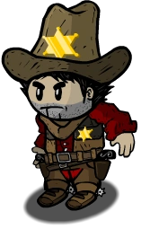

# Sheriff

- **Facción:** Town  · *en alcance MVP*
- **Página de la wiki:** Sheriff (ToS)

## Ficha

**Clase (alineamiento):**

> Town Investigative

**Tipo:**

> Investigation
> Non-unique

**Prioridad de acción:**

> 4

**Resumen:**

> You are the law enforcer of the town forced into hiding from threat of murder.

**Habilidades:**

> Interrogate one person each night for suspicious activity.

**Atributos:**

> Attack: None
> Defense: None

**Atributos (texto):**

> You will know if your target is suspicious.

**Gana con:**

> Town
> Survivor

**Debe matar para ganar:**

> Mafia
> Vampires
> Arsonist
> Serial Killer
> Werewolf
> Witches/Coven
> Plaguebearer
> Pestilence
> Juggernaut

**Resultado Investigator:**

> Classic Results
> Your target could be a .
> Coven Expansion Results
> Your target could be a .

**Resultado Consigliere:**

> Your target is a protector of the town. They must be a Sheriff.

## Texto completo de la wiki

| 

Sheriff 

Alignment

 Town Investigative

Avatar

Immunities

Attack: None

Defense: None

 Ability Stats

 | Type

 | Priority

 | Investigation

Non-unique

 | 4

Investigation Results

 Sheriff

You cannot find evidence of wrongdoing. Your target is innocent or great at hiding secrets!

 Investigator

Classic Results

Your target could be a Sheriff, Executioner, or Werewolf.

 Coven Expansion Results

Your target could be a Sheriff, Executioner, Werewolf, or Poisoner.

 Consigliere

Your target is a protector of the town. They must be a Sheriff.

Game Information

Summary

You are the law enforcer of the town forced into hiding from threat of murder.

Abilities

Interrogate one person each night for suspicious activity.

Attributes

You will know if your target is suspicious.

Goal

Hang every criminal and evildoer.

 Victory Conditions

 | Wins with

 | Must kill

 | Town

 Survivor

 | Mafia

 Vampires

 Arsonist

 Serial Killer

 Werewolf

 Witches/ Coven

 Plaguebearer

 Pestilence

 Juggernaut

 | 

 | DISCLAIMER: These stories are fanmade, and are not created or endorsed in any way by BlankMediaGames or Digital Bandidos.

The old west was wild, but it never prepared the sheriff for what he had to face. On the run from the mafia, the battle-hardened sheriff knew his only escape was to fly far away from his homeland, and start a new life in the quiet town of Salem. But as he took the long journey by road to this town, the mafia were constantly on his trail. He soon realised that his own business should’ve stayed his own, because the mafia began to kill an innocent town member each night in an effort to weed him out of hiding. But the sheriff stood his ground, and knew that surrendering was no option - he had to fight them, and find these evil-doers through the gruelling interrogations he performed each night.

Mechanics[]

You may choose to interrogate someone each Night, checking them for suspicious activity.

You will know if your target is "suspicious" or "innocent".

Roles with Detection Immunity, notably the Godfather, cannot be found. Members of the Mafia/ Coven with a Disguise/ Necronomicon also cannot be found.

Anyone who has been Framed/ Hexed will show up as suspicious.

Anyone who has been Doused will still appear as their normal result.

 | Investigation Message

 | Possible Roles

 | You cannot find evidence of wrongdoing. Your target is innocent or great at hiding secrets!

 | All Townies (including the Town Traitor and Town Traitor)

 | All Neutral Benign

 | All Neutral Evil

 | All Neutral Chaos

 | Godfather

 | Arsonist

 | Werewolf during a non- Full Moon Night

 | Juggernaut

 | A member of the Coven wielding the Necronomicon

 | A Mafia member disguised as any of the above roles

 | Your target is suspicious or framed!

 | All members of the Mafia except the Godfather, unless they are disguised as an "innocent" role

 | Anyone Framed by a Framer

 | All members of the Coven unless they wield the Necronomicon

 | Anyone Hexed by the Hex Master

 | Serial Killer

 | Werewolf during a Full Moon Night

 | Anyone disguised as any of the above roles

Strategy[]

Working with Investigators[]

Unlike the Investigator, you can only directly determine whether your target is suspicious or not, and not their possible roles. Sharing information and discussing with the Investigator will allow you to narrow the pool of suspects:

If the Investigator finds a possibly suspicious role (e.g. a Doctor, Disguiser, Serial Killer (or Potion Master), you should interrogate that person if there are signs of Coven or a Serial Killer

If the Investigator finds a certain Townie (by process of elimination), you will not need to interrogate that person, since they are confirmed and you would waste a Night.

If the Investigator finds a full detection immune investigative result (e.g. a Bodyguard, Godfather, Arsonist (or Crusader), you will not need to interrogate that person either because, just like above, they will all appear the same.

However, if there's a potential Arsonist in the game, you may need to interrogate the players the Investigator found as Bodyguard, Godfather, Arsonist (or Crusader) as they could be a Doused Mafia/ Coven member or a Serial Killer.

If the Investigator finds a Framer, Vampire, Jester (or Hex Master), you should have some doubt in your interrogation results. If they show up as "innocent", they are one of those roles, and a Jailor or Vigilante should kill them; otherwise your target was likely Framed or Hexed.

Suspicious players[]

If you're lucky enough to find a suspicious target early in the game, you should almost always reveal it immediately. Some people are afraid to reveal it because they might be called an Executioner, and some people will mistakenly advise you to wait because of this; however, there are numerous reasons why revealing vital information at the first possible opportunity is virtually always the right strategy:

If you don't post your information, you risk being Cleaned by a Janitor, Forged by a Forger, Stoned by Medusa, or Blackmailed forever by a Blackmailer, causing your information to be most likely lost forever, (unless there is a Medium in the case you are killed).

Generally speaking, the Town's majority decreases with every passing Day. Therefore, it is going to be easier for the Mafia to convince people to ignore you on Day 4 than it would have on Day 2.

Even if you fail to convince the Town to hang someone you found immediately, you can still gain information based on how people react - people who help you try to hang a member of the Mafia or Coven are probably not members of the Mafia or Coven, while people who try to aggressively cast doubt on you or push suspicion elsewhere are themselves suspicious. This can be used to guide your investigations on later Nights, gathering information that will help the Town trust you.

You are unlikely to be attacked by the Mafia or Coven immediately after accusing one of their members because it would confirm your accusation and because you're likely to be protected.

Even if you fail to convince enough Townies to hang someone, the information you revealed still helps them behave more intelligently; a Vigilante who takes a potshot, for instance, is more likely to shoot at someone you accused, while Tavern Keepers are more likely to roleblock them and Town Protectives are less likely to protect them.

Your accusations will not become more credible simply by waiting. Executioners often choose to accuse on either Day 3 or Day 4. Being called an Executioner reduces your chances of being believed, but in the long run, the Town benefits by having that information out there as soon as possible. On top of this, if you're asked to produce your complete Last Will and reveal you've been sitting on important information for several Nights, the Town is likely to treat you even more skeptically.

If you wait, there is a risk that the person you found could die to another cause. While that means they're gone, it's generally a wasted opportunity - it means you lost the chance to confirm yourself and to force their fellow members of the Mafia or Coven to risk going on the record failing to vote up their partner.

There may be people who can confirm aspects of your accusation; for instance, a Tracker or Lookout who saw you visit will know that you're not an Executioner. They won't know to back you up unless you speak up.

Detection Immunity roles[]

When you need to convince the Town that you're a Sheriff and not an Executioner, remember to report your visits every Night - after your role has been revealed, there's no reason not to share all information immediately, and even naming people as innocent will earn you a bit more trust.

If you suspect a player of being the Werewolf, remember to check them on a Full Moon Night. Otherwise, they will appear as "innocent".

A less-used strategy is to coordinate with the Spy, as they can usually provide confirmed non-members of the Mafia by who the Mafia visits and therefore, you might want to ignore interrogating these people since they could have Detection Immunity. One example is the Arsonist.

False Information[]

Be careful, as multiple evil roles have Detection Immunity, such as the Godfather, so they will appear as "innocent". Beware of whom you trust!

At any given time, there can only be one Godfather. Therefore, when a Godfather dies, anyone you investigated up until (and including) that Night who came up as innocent cannot be a member of the Mafia. Note that they could still be an Arsonist, Witch, or Vampire; and people you investigate after the Godfather's death could be a Mafioso who has been promoted to Godfather. They could also be a Coven member with the Necronomicon or even a disguised Mafia member.

Be careful, as Framed players will appear to be suspicious, so never be too quick to judge who is evil or not. If you aren't sure, check the same person the next Night (although this might not be worth it, it is usually better to gain new information that Night instead of doing a re-check, unless there is a confirmed Framer, such as in classic mode). If the Framer does not frame the same target again, your results will change. There are some Framers that will frame the same target for a few Nights in a row, so it's very hard to know if your information is true or not. However, in Ranked, if the Random Mafia slot is known to not be a Framer, it is safe to accuse anyone that shows up as suspicious. Keep in mind that it may be a good idea to ask a confirmed Spy who the Mafia visited, as they will usually be able to see who the Mafia might have Framed. Beware of Disguisers, as they can hide who the Framer visits from the Spy while also giving them credibility if they claim Framed.

A Hex Master is even more dangerous to you, as Hexed targets will permanently appear to be suspicious. You can ask a confirmed Spy who the Coven visited to help clear them and potentially find the Hex Master in this case (Keep in mind the Potion Master can visit the Hex Master to give them credibility if they claim Hexed). If someone claims to be Hexed, you may want to interrogate them just in case, if they appear as "innocent", then you'll know for certain the person you checked was the Hex Master. If a Guardian Angel purges their target, you can interrogate the person the following night to prove them; however, they can still be Framed.

If a Transporter Transports your target, you will interrogate someone else entirely without you knowing! If the Transporter reveals their Last Will, you will know who you interrogated that Night instead and can prove them as an evil role. However, if you see that your target says they were Transported the next Day, then don't trust the information that you have been given as it is most likely false.

If a Disguiser disguises your target, you will most likely find the person you interrogated to be "innocent". If the Disguiser dies or gets revealed, you may have to interrogate your previous targets again for more accurate results.

Be careful, as many evil roles tend to claim to be a Sheriff, so if you are pressed to claim a role, you could be hanged regardless of what you say by an aggressive Town. Be sure to have a well-written Last Will to improve your odds of survival, but there is no guarantee.

If you are certain the only roles left are Detection Immune roles, such as the Godfather and Arsonist, don't give up! If people trust you, you can direct the Town. It is safe to not visit anyone though (unless there's a Doctor protecting you) because you might run into a Veteran who's on alert (if there's any). Alternatively, you could try and bait them into attacking you so that they waste a Night going for someone useless. Even if all of the above do not happen, you still count as a vote and possibly save the Town from being the minority.

Identifying Fake Claims[]

 Sheriff is very easy to claim, and as such is a suspicious claim unless confirmed. They may seem like an Executioner when outing your results, and many evils, such as the Werewolf, claim this role. It has a very easy Last Will to set up, and you can usually tell when someone is most likely fake when they are asked for their role, they claim Sheriff, and then show a Last Will with only innocent results. Usually, if someone out loud says something along the lines of, "Bob is suspicious!" in a blunt fashion with no evidence, and then a bunch of people start agreeing for no reason, they're all most likely evil. A Last Will that hasn't found an evil role by Day 5 is more likely an evil role themselves, although they can be an unlucky Sheriff.

Another way to identify fake results by a Sheriff, or any Town Investigative by any means is to look at their Last Will, and see if any results are unknown. If that Town Investigative role provided new information, it's usually a good chance that they are not evil. However, if their results are all dependent on things that the Town already knew, such as a revealed Mayor or if someone is on the stand and their Last Will consists entirely (or mostly) of dead people (who have had their roles revealed), such useless information is usually a sign of an evil.

Achievements[]

 | Name

 | Description

 | Merit Points

 | Enforce the Law

 | Win your first game as a Sheriff

 | 20

 | Marshall

 | Win 5 games as a Sheriff

 | 20

 | Constable

 | Win 10 games as a Sheriff

 | 40

 | Deputy

 | Win 25 games as a Sheriff

 | 100

 | Got You

 | Find a Serial Killer

 | 20

 | Not Suspicious

 | Find someone to not be suspicious

 | 20

 | Busted

 | Find a member of the Mafia

 | 20

 These achievements can be considered broken since you will know for sure the target is evil and not framed.

Messages[]

 | 

 | You cannot find evidence of wrongdoing. Your target is innocent or great at hiding secrets!.

 | Displays at the end of the night if the interrogated player is a member of the Town (even the Town Traitor), the Godfather, a disgused Mafia member, a member of the Coven with the Necronomicon, an Arsonist, a Werewolf (on a non- Full Moon Night), or any Neutral Benign, Neutral Evil, or Neutral Chaos role.

 | Your target is suspicious or framed!

 | Displays at the end of the night if the interrogated player is any Mafia member (excluding the Godfather), any member of the Coven, a Serial Killer, a Werewolf (on a Full Moon Night), or any player who has been Framed or Hexed.

Trivia[]

Prior to Version 2.5.1.10655, the Sheriff could differentiate between a target being a member of the Mafia, a member of the Coven, a Serial Killer, and a Werewolf on a Full Moon Night. All of these roles now appear as "suspicious".

Prior to Version 2.5.2.10840, Sheriffs would receive the message "Your target is not suspicious." when interrogating an innocent target, which was replaced with more flavor text, appearing as "You cannot find evidence of wrongdoing. Your target seems innocent." as the two were easily mixed up.

 | Investigation Message

 | Possible Roles 

 | Your target is not suspicious.

 | 

All Townies

All Neutral Benign

All Neutral Evil

All Neutral Chaos

 Godfather

 Arsonist

 Werewolf during odd-numbered Nights

 Juggernaut

All members of the Coven wielding the Necronomicon

 | Your target is a member of the Mafia!

 | All members of the Mafia with the exception of the Godfather

Anyone who was visited by a Framer the same Night the Sheriff visited them

 | Your target is a Serial Killer!

 | Serial Killer

 | Your target is a Werewolf!

 | Werewolf during a Full Moon Night

 | Your target is a member of the Coven!

 | All members of the Coven unless they wield the Necronomicon

Anyone Hexed by the Hex Master

History[]

3.3.8

"You cannot find evidence of wrongdoing. Your target seems innocent." has been changed to "You cannot find evidence of wrongdoing. Your target is innocent or great at hiding secrets!".

All "Your target is suspicious!" messages have been changed to "Your target is suspicious or framed!".

3.3.0

The Disguiser can now fool a Sheriff.

2.5.5.12200

The Sheriff's role icon has been changed. Old one was .

Added Sheriff's circled role icon ().

2.5.2.10840

"Your target is not suspicious." has been changed to "You cannot find evidence of wrongdoing. Your target seems innocent.".

Applied Sheriff changes for 2.5.1.10655 on the Mobile version of the game.

2.5.1.10655

"Your target is a member of the Mafia!" has been changed to "Your target is suspicious!".

"Your target is a Serial Killer!" has been changed to "Your target is suspicious!".

"Your target is a Werewolf!" has been changed to "Your target is suspicious!".

"Your target is a member of the Coven!" has been changed to "Your target is suspicious!".

2.0.0.6582

Added message "Your target is a member of the Coven!".

Town of Salem Release

Introduced.

 | 

 | 
Roles

 | 

 | 

 | 
 Town

 | 

 | Town Investigative | | Investigator • Lookout • Psychic • Sheriff • Spy • Tracker | | 

 | 

 | Town Killing | | Jailor • Vampire Hunter • Veteran • Vigilante

 | 

 | Town Protective | | Bodyguard • Crusader • Doctor • Trapper

 | 

 | Town Support | | Mayor • Medium • Retributionist • Tavern Keeper • Transporter

 | 
 Mafia

 | 

 | Mafia Deception | | Disguiser • Forger • Framer • Hypnotist • Janitor | | 

 | 

 | Mafia Killing | | Ambusher • Godfather • Mafioso

 | 

 | Mafia Support | | Blackmailer • Bootlegger • Consigliere

 | 
 Coven

 | 

 | Coven Evil | | Coven Leader • Hex Master • Medusa • Necromancer • Poisoner • Potion Master | | 

 | 
 Neutral

 | 

 | Neutral Benign | | Amnesiac • Guardian Angel • Survivor | | 

 | 

 | Neutral Evil | | Executioner • Jester • Witch

 | 

 | Neutral Killing | | Arsonist • Juggernaut • Serial Killer • Werewolf

 | 

 | Neutral Chaos | | Pirate • Plaguebearer/ Pestilence • Vampire

## Implementación

- [ ] Definido en `packages/engine` con su prioridad y facción
- [ ] Acción nocturna (si aplica) validada con objetivos legales
- [ ] Resultado de investigación correcto (Sheriff / Investigator / Consigliere)
- [ ] Condición de victoria y de derrota comprobada en tests
- [ ] Tests unitarios del rol en verde
- [ ] Tarjeta y texto de ayuda en la app
- [ ] Icono e ilustración propia (no el arte de la wiki)
- [ ] Plantillas de narración para sus eventos
