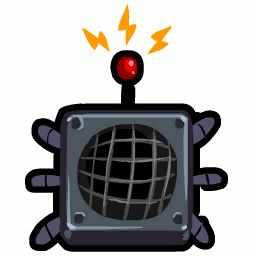
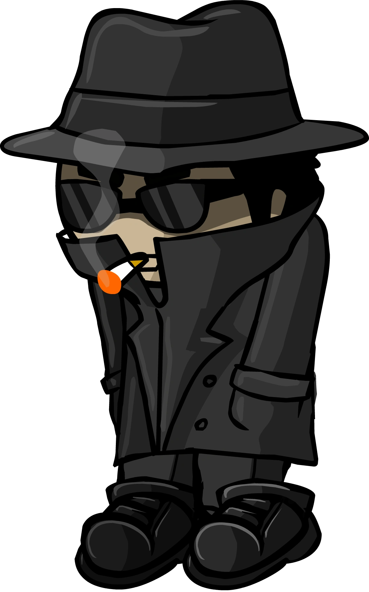

# Spy

- **Facción:** Town  · *en alcance MVP*
- **Página de la wiki:** Spy (ToS)

## Ficha

**Clase (alineamiento):**

> Town Investigative

**Tipo:**

> Investigation
> Non-unique

**Prioridad de acción:**

> 6

**Resumen:**

> You are a talented watcher who keeps track of evil in the Town.

**Habilidades:**

> You may Bug a player's house to see what happens to them that night.

**Atributos:**

> Attack: None
> Defense: None

**Atributos (texto):**

> You will know who the Mafia and Coven visit each night.

**Gana con:**

> Town
> Survivor

**Debe matar para ganar:**

> Mafia
> Vampires
> Arsonist
> Serial Killer
> Werewolf
> Witches/Coven
> Plaguebearer
> Pestilence
> Juggernaut

**Resultado Sheriff:**

> You cannot find evidence of wrongdoing. Your target is innocent or great at hiding secrets!

**Resultado Investigator:**

> Classic Results
> Your target could be a .
> Coven Expansion Results
> Your target could be a .

**Resultado Consigliere:**

> Your target secretly watches who someone visits. They must be a Spy.

## Texto completo de la wiki

| 

 | Looking for the Town of Salem 2 role?

This role appears in Town of Salem 1 and 2. For the ToS 2 counterpart, see Spy.

Spy 

Alignment

 Town Investigative

Avatar

Immunities

 Attack: None

 Defense: None

 Ability Stats

 | Type

 | Priority

 | Investigation

Non-unique

 | 6

Investigation Results

 Sheriff

You cannot find evidence of wrongdoing. Your target is innocent or great at hiding secrets!

 Investigator

Classic Results

Your target could be a Spy, Blackmailer, or Jailor.

 Coven Expansion Results

Your target could be a Spy, Blackmailer, Jailor, or Guardian Angel.

 Consigliere

Your target secretly watches who someone visits. They must be a Spy.

Game Information

Summary

You are a talented watcher who keeps track of evil in the Town.

Abilities

You may Bug a player's house to see what happens to them that night.

Attributes

You will know who the Mafia and Coven visit each night.

Goal

Hang every criminal and evildoer.

 Victory Conditions

 | Wins with

 | Must kill

 | Town

 Survivor

 | Mafia

 Vampires

 Arsonist

 Serial Killer

 Werewolf

 Witches/ Coven

 Plaguebearer

 Pestilence

 Juggernaut

 | 

 | DISCLAIMER: These stories are fanmade, and are not created or endorsed in any way by BlankMediaGames or Digital Bandidos.

Swift as the wind, the ex-ninja ran through the streets of Salem, entering a black forest. He dashed through the woods, graceful as a cheetah, until he saw a light ahead. He slowed down and expertly hid in a tree, silent as a thought. With the aid of his acute sense of hearing, he listened to the Mafia members discussing their future plans of terror and murder. The Spy clenched his hands, knowing that he could kill a man in thirty five different ways… but he couldn’t. This was a group of armed men, and he was merely a weaponless man with some knowledge on killing. No- it would be better to let the town know who the perpetrators are, so that they could dispose of them instead.

In the daytime, those who he expected to die were lying on the ground, dispatched, in front of their houses. The Spy walked around, listening to everybody talk, knowing what everyone was whispering about. Using this information, he was able to judge who sounded like who… and who was part of the Mafia.

Mechanics[]

You will receive the amount of Mafia and/or Coven who visit certain people each Night. The order is randomized.

You will also be able to see the Astral visit made by the Hex Master with the Necronomicon as a Coven visit. But you will not see the visit made by Necromancer's Ghoul.

If a Disguiser Disguises a Mafia member, you will not see who that Mafia member visits.

If a Mafia member is Disguised as a member of the Coven, their visit will not appear as a Coven visit.

In the Town Traitor game mode, you cannot see who the Town Traitor visits. The same applies for the Coven Town Traitor in the Coven Town Traitor game mode.

You are also able to "bug" a person each Night, which reveals any direct actions against them, such as attacks, Roleblocks, Transports, etc. Investigative actions are not shown, such as from a Sheriff or Consigliere.

 Spies who Bug a Hypnotist's target will see the false messages the Hypnotist sends to a player.

While tracking Mafia and/or Coven visits is not counted as a visit, Bugging a player counts as you visiting them.

By that logic, Spies will indeed trigger the Trapper's trap if they Bug the trapped person. Bear this in mind when weighing the pros and cons of Bugging.

 Spies can also be attacked by a Veteran or Medusa, should they Bug them.

If you are Controlled, you will Bug the controller's target. The controller will get the Mafia and/or Coven visits along with feedback from the Bug.

You will not be able to see who the Coven and/or Mafia visit if you are Jailed.

If you are Roleblocked]/ Jailed or Controlled, you will not receive the results of your Bug or the visits.

The Bug will fail if your target is Jailed. You will know that your target was Jailed. You will still see visits.

 Transporters will only change your Bug target. If you Bug A, and if a transporter swaps A and B, you will receive Bug information from player B.

Your ability to see Mafia/ Coven visits are unaffected by Transporters and will always display who the Mafia or Coven actually visit that Night: if mafia or coven visits A, you will see a visit on A, and if a Transporter swaps A and B, you will see Mafia or Coven visit B.

Due to an inconsistent bug (as of Version 3.3.12), you sometimes won't see the visits of Mafia/ Coven corpses reanimated by a Necromancer.

If you Bug a Witch/ Coven Leader who controlled a Doctor or a Crusader into saving someone, you will receive the message "Your target's target was attacked last night" that the controller stole from the player they Controlled.

If you die, you will still receive your results for that Night, including Bugs and visits, despite having the same priority as an Amnesiac.

Bugging Messages[]

When a Spy uses their Night ability to Bug someone, they'll see messages from the following list for appropriate events:

 | Spy Bug Messages 

 | 

Your target was Transported to another location.

Someone occupied your target's night. They were role blocked!

Someone threatened to reveal your target's secrets. They were blackmailed!

Your target was doused in gas!

Your target has cleaned the gasoline off of themself.

Your target was attacked but someone fought off their attacker!

Your target was attacked but someone nursed them back to health!

Your target was attacked by a member of the Mafia!

Your target was attacked by a Serial Killer!

Your target was shot by a Vigilante!

Your target was set on fire by an Arsonist!

Your target was shot by the Veteran they visited!

Your target was killed protecting someone!

Your target's target was attacked last night!

Your target was murdered by the Serial Killer they visited!

A Bodyguard attacked your target but someone nursed them back to health!

A Bodyguard attacked your target but someone fought them off!

Your target was killed by a Bodyguard!

Someone attacked your target but their Defense was too strong!

Someone tried to role block your target but they were immune!

Your target was controlled by a Witch!

A Witch tried to control your target but they were immune.

Your target was haunted by the Jester and committed suicide!

Your target was attacked but their bulletproof vest saved them!

Someone tried to attack your alert target and failed!

Your target shot themselves over the guilt of killing a town member!

Someone role blocked your target, so your target attacked them!

Your target was killed by the Serial Killer they Jailed.

Your target was attacked by a Werewolf!

Someone role blocked your target so they stayed at home.

Your target was staked by a Vampire Hunter!

Your target was staked by the Vampire Hunter they visited!

Your target staked the Vampire that attacked them!

Your target was attacked by a Vampire!

 This confirms your target as an Arsonist.

 This confirms your target as a Doctor.

 This confirms your target as a Jailor.

 This confirms your target as a Serial Killer.

 This confirms your target as a Veteran.

 This comfirms your target as a Vampire Hunter.

 This confirms your target as a Vampire.

 This confirms your target as a Vigilante.

 This confirms your target as a Werewolf.

 | Coven Expansion Spy Bug Messages 

 | 

Your target was attacked by a Crusader!

Your target was attacked but someone protected them!

Your target was attacked by Pestilence!

Your target was attacked by the Juggernaut!

Your target was attacked but their Guardian Angel saved them!

Your target was attacked by a Pirate!

Your target's life force was drained by the Coven Leader!

Your target was attacked by a Hex Master!

Your target was attacked by a Necromancer!

Someone tried to poison your target but someone fought them off!

Your target was poisoned but someone nursed them back to health!

Your target was poisoned. They will die tomorrow unless they are cured!

Your target died to poison!

Your target was cured of poison!

Your target was poisoned. They will die tomorrow!

Your target was turned to stone.

Your target was attacked but a trap saved them!

Your target was attacked by a Potion Master!

Your target Jailed Pestilence and was obliterated.

A trap attacked your target but someone nursed them back to health!

 This confirms your target as a Jailor.

Strategy[]

When the Mafia has a Blackmailer, you should try to figure out why the Mafia is trying to keep the Blackmailed person quiet. Maybe they blamed the Mafia, and you don't have to reveal yourself as a Spy to point out that someone is Blackmailed since they will most likely vote spam if they are blackmailed. Then tell everyone what they said before they were Blackmailed.

Doing this does carry some risk though, as some experienced Townies may call you out on suspicion of being a Blackmailer, as Blackmailers will often accuse their own target, pointing out how quiet they've been. On top of that, Spy is a common Blackmailer claim, so be wary.

As a Spy, your Bugs can confirm the existence of many roles, including Arsonists and Serial Killers. Any messages that correspond to one of these roles should be pointed out to the Town immediately.

If a Jester is hanged, you should keep track of who whispered to the Jester before they were hanged. If the Jester killed a Townie, then there's a high chance the person is evil.

Posting daily can help, as Spy usually has a long Last Will and gives useful information for claims. This can benefit by confirming yourself and narrowing down who is evil (such as a Bootlegger claiming they are a Tavern Keeper). Your detailed Last Will probably won't fit if you try to post it all at once.

Always keep a detailed Last Will, noting down every Night's Mafia and Coven visits. While this is true for any role, the significance of a Night's visits often isn't obvious until later in the game. It might be tempting to summarize it into a list of who has/hasn't been visited or a possible number of Mafia, but knowing the precise visits and what Night they occurred on can be valuable for catching a Bootlegger or Consigliere, or for interpreting the Last Wills of other players.

If you find someone who was controlled by a Witch and who didn't claim that they were controlled, the player is most likely an evil role who doesn't want to out the Witch.

A rare strategy you could do is claim to be a Witch by whispering to them that you had controlled them. Most evil roles trust a Witch claim, so if the evil role is a member of the Mafia, the player may tell you who the rest of the Mafia are.

If someone is visited by the Mafia or Coven, and the next Day another person claims to be an Investigator with information about them, it may indicate that they're actually an evil (possibly a Consigliere or Potion Master) using information from that visit to deduce their role. Keep in mind that if they're accusing their target of being evil or immune, that accusation may still be correct, since both the Coven and the Mafia have reasons to want to eliminate rival evils.

Revealing[]

If you are unable to gather a lot of information, but still have some information to contribute, a good time to reveal yourself as a Spy is when you know there are a lot of high priority roles, as lots of other roles at this point are a higher priority to kill than the Spy. Otherwise, you should reveal yourself when you have some good information to contribute with, for example, if you know who one of the members of the Mafia/ Coven is.

However, you could still become a high priority target anyway as you can catch a Consigliere/ Necromancer by their visits and discredit false info.

You should try to counter an unlikely Spy claim, as they could be a Blackmailer. Spy is a common claim for members of the Mafia and Coven as it is easy to fake for them.

This doesn't apply as much to certain Coven Custom role lists or Coven All Any, as members of the Mafia or Coven can only see who their own faction visits, although the actions of the Coven are generally more obvious. Anyone who is seen to be falsely claiming Spy is usually either a member of the Mafia or a Jester, and a Vigilante or Jailor should kill them.

In more competitive game modes such as Ranked, Ranked Practice and Town Traitor, Spies are generally expected to reveal themselves and post their results on Day 2. This meta makes it harder for evils to fake-claim Spy, and the information you receive can help Townies make more informed decisions. But it is still acceptable to wait a bit before you post, as you could expose a potential Consigliere who wants to claim Investigator on their target.

 Mafia/ Coven Visits[]

Make sure to keep track of who the Mafia and Coven visit at Night, in most cases the visited target will not be a member of the Mafia/ Coven. You can use this information to narrow down who could be a member of the Mafia/ Coven. However, a Witch/ Coven Leader or a Transporter can make a member of the Mafia visit another. A Disguiser/ Potion Master could also be disguising/healing a member of the Mafia/ Coven so watch out for this. If an Amnesiac remembers that they were a member of the Mafia/ Coven, they might be among the targets too. Late game, you can also completely confirm a townie if all neutrals are dead by recording their visits.

Late game, it may be a good idea to look back in your will and see the Mafia/ Coven visits. Compare them to the currently alive players, you can narrow down who is Mafia/ Coven by looking at visits. If you see some players that were never visited by Mafia or Coven, they are most likely one themselves.

If no targets are visited at all, it is very likely that the Godfather or Mafioso was in jail or role blocked. In modes where the number of Mafia can vary significantly, such as All Any, it can also indicate that the Mafia are all dead.

If a target is visited repeatedly but is not Blackmailed or role blocked, the Mafia might have a Disguiser.

If none of the targets die, it is possible that one of the targets was attacked and either had a higher Defense value than said attacker's Attack value or was healed by a Doctor. This is especially true if a target was visited by multiple members of the Mafia (the second being a Forger or Janitor).

Bear in mind, however, that a common mistake among novice Spies is to make broad assumptions based on visitations, such as assuming one or more of the targets visited has a naturally high defense or assuming that a Mafia member visited a Medusa based on the change in the number of visits.

Calling these out early on can be detrimental for two reasons: if they actually did visit a Neutral Killing, the Spy is less likely to be believed and may end up providing a valuable distraction for the Mafia or Coven. On the other hand, if the target was innocent and merely protected, it would expose both that innocent player and their protector.

Furthermore, now that Spy is easy for any Mafia or Coven member to fake, these call outs can cast suspicion upon the Spy themselves. This can be effective if the Spy doesn't have a proper Last Will, or just calls out someone without giving the full story. This can result in a Jailor or Vigilante killing the Spy, dealing a huge blow to Town in the process.

Keep track of who the Mafia visit at Night and use the process of elimination to find who the members of the Mafia are. Be aware, however, that Transporters, Witches, and Disguisers can mess with your results.

You can distinguish between Tavern Keeper and Bootlegger claims by checking to see if the people who were role-blocked were visited by the Mafia on those Nights. Bootleggers cannot easily lie about their visits since each one produces a message; but they can easily claim Tavern Keeper if you're not there to catch them or if they're Disguised.

Your list of visits can be extremely effective in combination with a Lookout or Tracker, allowing you to narrow down possible Mafia and Coven members even further:

If the Mafia or Coven didn't visit the Lookout's target or whoever the Tracker's target visited, then those visitors cannot be Mafia or Coven, respectively.

If the Mafia or Coven did visit that target, then it puts any visitors under suspicion. However, for the Tracker, remember that there may be other visitors you didn't see who could be the actual Mafia or Coven.

You can also use the pattern of visits to figure out the role(s) of the Random Mafia member(s).

For example, if one person is visited two times, there is likely a Forger or Janitor in play. If they don't die, they may be healed or have a higher Defense value than the attacker's Attack value. Framers can also visit the same target to try to trick you.

If one person is visited and not killed, then visited and killed, this may point to the presence of a Consigliere. They would have investigated the person, shared their role, and then the Godfather or Mafioso would have decided to kill them. Keep this in mind especially if they are an important Town role, such as Jailor or Mayor, or one that could have found out members of the Mafia, such as Investigator or Lookout.

If one person is being visited repeatedly, this could indicate a Disguiser, or possibly a Bootlegger who is intent on roleblocking one person. If the victim is claiming Roleblocked, it is most likely a Bootlegger.

Note however, that you cannot see a Disguiser who has Disguised themselves since it hides both their visits from you.

If someone is visited once by Coven and did not die or claim controlled/ Poisoned, there could be a Potion Master or Hex Master.

If the Coven visit a deceased target at night, you can be certain that Necromancer is in play.

Your abilities can be very useful for finding Pestilence.

Once Pestilence has appeared, any further visits without an associated Mafia or Coven death indicate that the person who was visited is not Pestilence.

Conversely, if there's a Mafia or Coven death the next morning, then any visits by Mafia or Coven may indicate they visited Pestilence, though you also have to consider the possibility that they were visited by Pestilence or visited Pestilence's target.

When Pestilence is active, you should stop Bugging, since the benefits of that half of your abilities are too minor to be worth the risk of exposing you to death to Pestilence's rampage or to visiting them directly.

Bugging[]

With the 'bug' ability, you can now know if someone is lying about what happened to them. You can also find out if someone is immune or whether they were protected by a vest.

Generally speaking, you should Bug people who you suspect will lie about or conceal what happened to them at Night - in other words, potentially evil roles. There's usually little point in Bugging a confirmed Town role, who will reveal what happened to them at Night anyway.

However, one benefit to Bugging Town is that you can use what you see to confirm yourself. For this reason, it's sometimes useful to choose targets the way a Lookout would, and visit whoever you think is most likely to be visited and have an 'exciting' Night in general; that will give you the information you can later use to confirm that you're a Spy.

Remember that some of the information you can gather with Bugging is redundant with the information you retrieve from your ability to see Mafia and Coven visits:

If someone is repeatedly acting blackmailed, you could theoretically use your Bugging to confirm this; however, most of the time you will already know they're telling the truth due to the Mafia visits (unless there's a Disguiser).

There are a few specific messages you can see that are much more important than others and worth actively looking for by targeting people who are likely to receive them. These are:

The unique messages a Tavern Keeper, Bootlegger, Jailor or Pirate gets when killed by the Serial Killer they roleblocked; this will tell you with certainty that the person they targeted was a Serial Killer. Of course, everyone will eventually know that because they'll leave a bloody Last Will, however you'll know it before anyone else and you can confirm yourself as Spy by quickly whispering some people the message you saw in your Bug before the roleblocker's cause of death is publicly revealed.

If you target a Serial Killer who gets roleblocked, you'll receive a special message telling you that they attacked their roleblocker (which instantly outs them as a Serial Killer.) For this reason, it can be useful to Bug possible Serial Killers.

If your target has Defense, you'll receive a message when they're attacked. For this reason, it's worth watching people you suspect of having Defense.

Note that while you can make some deductions about immunity with by watching your Mafia and Coven visit reports on a Night when they fail to kill, actually Bugging a target lets you distinguish between bulletproof vests, healing, and persistent immunity.

Also note that a Hypnotist could be sending a fake heal message to confirm themselves to you and their target if the Mafia fails to kill (the same applies to a lesser extent with the Potion Master).

If you watch an Arsonist who cleans themselves, you'll receive a message stating this. This is fairly rare and typically only happens in games with multiple Arsonists, but it's a reason to watch potential Arsonists in any game that seems to have more than one. Similarly, you will only receive the message that your target was doused if they are an Arsonist themselves.

The " Control Immunity" message is seen by the Transporter, Retributionist, Potion Master, Necromancer, Pirate and Pestilence. Remember that if you see it and the transportation message, an actual Transporter may have transported your target with themselves. Conversely, a message that your target was successfully controlled means they cannot be any role on that list.

Note that Retributionist and Transporter will only get a " Control Immunity" message when they get controlled by a Witch, not by a Coven Leader. This is most likely a bug.

The " Roleblock Immunity" message is only seen by a few roles: Tavern Keeper, Bootlegger, Transporter, Retributionist, Veteran, Pirate, Pestilence, Coven Leader/ Witch, and Necromancer. If you see it, your target is one of the roles on that list. Of course, if it was Pestilence, you will die unless healed.

This can be done to try to confirm certain claims or roles that are somewhat easy to claim such as Retributionist.

A message that your target was successfully role-blocked means that they cannot be any of the roles with immunity, nor can they be a Serial Killer or (on a Full Moon Night) a Werewolf since those have unique messages.

You can tell if the target was Transported. This can be vital to preventing mishanges. Remember that if you see that message, it means that your target was changed by the Transporter, too; for instance, if you see that message and an immunity message, it means the Transporter's other target is immune, not the person you intended to target. Keep in mind a Hypnotist can generate a transport message also, potentially leading you to false conclusions.

If you manage to catch the message of: "Someone role blocked your target so they stayed at home." then it means your target is a Werewolf, as this is a specific message. However, you will die due to visiting them, unless you are protected in some way.

When someone you're Bugging is attacked, you can see whether they were saved by a vest or by permanent immunity. For this reason, it can be valuable to Bug Survivor claims; if they are attacked, you'll immediately know whether they're actually a Survivor or not. While the behavior of Survivors can be unpredictable, speaking up to confirm them or save their lives can often convince them to side with the Town, and will at least prevent other Town members from wasting time pursuing them.

The "Your target's target was attacked last night!" message is unique to the Doctor and Crusader specifically. Receiving this result means your target is either one of these roles or a Witch/ Coven Leader who stole this feedback from the Doctor/ Crusader they controlled.

If your target is attacked by a Bodyguard and survives (because they were healed by a Doctor), you will learn this fact, which proves that your target is a killer. You should generally out them for this immediately - doing so will both spare the Doctor the need to step forward (if they even realize they should do so), and will confirm you to them, while catching a likely-evil role.

While your Bugging can be valuable, it is generally less powerful than your ability to see Mafia and Coven visits; additionally, it exposes you to getting killed by the Pestilence, Crusaders, the Veteran, the Ambusher, the Medusa, the Juggernaut, or (on Full Moon Nights) the Werewolf. For this reason, you might consider staying home when those roles are active, especially if you don't have any clear plan in terms of what you're checking for with your Bugging.

Achievements[]

 | Name

 | Description

 | Merit Points

 | Espionage

 | Win your first game as a Spy

 | 20

 | Sleuth

 | Win 5 games as a Spy

 | 20

 | Undercover Agent

 | Win 10 games as a Spy

 | 40

 | CIA

 | Win 25 games as a Spy

 | 100

 | Big Eyes

 | See someone get healed

 | 20

 | Saw it coming!

 | See a member of the mafia targeting you

 | 40

 | Too Many Mafia

 | See 4 or more mafia visit people at night

 | 100

Messages[]

 | 

 | A member of the mafia visited (Player) last night.

 | Displays at the end of the night when a Mafia member visits a player.

 | A member of the coven visited (Player) last night.

 | Displays at the end of the night when a Coven member visits a player.

Trivia[]

It is possible for the Spy to see five Mafia visits in one Night because of a Disguiser, however this won't happen under normal circumstances because, while the Disguiser does visit two players, they also hide the visit of the Mafia member they Disguise. So if you see five Mafia visits in one Night and there are no Amnesiacs who became a Mafia role, one of the following things must have happened:

A Witch/ Coven Leader forced the Disguiser to Disguise someone who isn't Mafia (only Disguiser's first target is changed)

A Transporter transported the Mafia member that the Disguiser meant to Disguise with someone who isn't Mafia.

 Disguiser's second target was Jailed so the Disguise ability failed and thus no Mafia visit was hidden from the Spy.

Contrary to popular belief, a Spy's Bug does not detect Vampire conversions in Town of Salem 1.

Prior to Version 2.0.0.6537, the Spy and the Blackmailer could read whispers. Now, only the Blackmailer can read whispers.

Also prior to the same version, the Spy could read the Mafia chat.

Prior to Version 3.2.3, Spies would still be able to know who the Mafia and Coven visit, despite being dueled by a Pirate, which is considered a roleblock.

History[]

3.3.0

The Disguiser can now fool a Spy.

3.2.4

 Spy now gets their ability feedback the Night they die.

3.2.3

 Spy no longer knows who the Mafia and Coven visit when being dueled by a Pirate.

2.5.5.12200

The Spy's role icon has been changed. Old one was .

Added Spy's circled role icon ().

2.3.8910

 Spy can now die to a Veteran on alert. (bug fix)

2.1.0.7320

 Spy can now see all actions against a player by "bugging" them at Night.

2.0.0.6582

The Spy can now see who the Coven visit at Night.

2.0.0.6537

The Spy can no longer read whispers or Night chat.

Removed message "You feel that someone can hear your conversations.".

Removed message "You feel like you can speak privately.".

1.5.11.5389

The Mafia now receive this message at the start of the Night if there is a Spy alive: "You feel that someone can hear your conversations.".

The Mafia now receive this message at the start of the Night if there is no Spy alive: "You feel like you can speak privately.".

1.5.8.4235

 Executioner can now have Spy as a target.

1.3.0

 Executioner can no longer have Spy as a target.

Town of Salem Release

Introduced.

 | 

 | 
Roles

 | 

 | 

 | 
 Town

 | 

 | Town Investigative | | Investigator • Lookout • Psychic • Sheriff • Spy • Tracker | | 

 | 

 | Town Killing | | Jailor • Vampire Hunter • Veteran • Vigilante

 | 

 | Town Protective | | Bodyguard • Crusader • Doctor • Trapper

 | 

 | Town Support | | Mayor • Medium • Retributionist • Tavern Keeper • Transporter

 | 
 Mafia

 | 

 | Mafia Deception | | Disguiser • Forger • Framer • Hypnotist • Janitor | | 

 | 

 | Mafia Killing | | Ambusher • Godfather • Mafioso

 | 

 | Mafia Support | | Blackmailer • Bootlegger • Consigliere

 | 
 Coven

 | 

 | Coven Evil | | Coven Leader • Hex Master • Medusa • Necromancer • Poisoner • Potion Master | | 

 | 
 Neutral

 | 

 | Neutral Benign | | Amnesiac • Guardian Angel • Survivor | | 

 | 

 | Neutral Evil | | Executioner • Jester • Witch

 | 

 | Neutral Killing | | Arsonist • Juggernaut • Serial Killer • Werewolf

 | 

 | Neutral Chaos | | Pirate • Plaguebearer/ Pestilence • Vampire

## Implementación

- [ ] Definido en `packages/engine` con su prioridad y facción
- [ ] Acción nocturna (si aplica) validada con objetivos legales
- [ ] Resultado de investigación correcto (Sheriff / Investigator / Consigliere)
- [ ] Condición de victoria y de derrota comprobada en tests
- [ ] Tests unitarios del rol en verde
- [ ] Tarjeta y texto de ayuda en la app
- [ ] Icono e ilustración propia (no el arte de la wiki)
- [ ] Plantillas de narración para sus eventos
