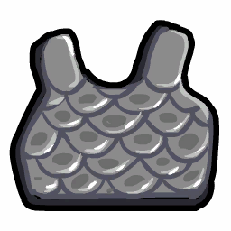

# Survivor

- **Facción:** Neutral  · *fase posterior (referencia)*
- **Página de la wiki:** Survivor

## Ficha

**Clase (alineamiento):**

> Neutral Benign
> |icon=RoleIcon Amnesiac.png

**Resumen:**

> You are a neutral character who just wants to live.

**Objetivo:**

> Live until the end of the game.

**Habilidades:**

> Put on a bulletproof vest at night.

**Atributos (texto):**

> Putting on a bulletproof vest gives you Basic defense.
> You can only use the bulletproof vest 4 times.

**Gana con:**

> Town
> Mafia
> Witches/Coven
> Arsonists
> Serial Killers
> Vampires
> Werewolf
> Plaguebearer
> Pestilence
> Juggernaut

**Debe matar para ganar:**

> N/A

**Resultado Investigator:**

> Classic Results
> Your target could be a .
> Coven Expansion Results
> Your target could be a .

**Resultado Consigliere:**

> Your target simply wants to live. They must be a Survivor.

## Texto completo de la wiki

Survivor 

(Surv)

Alignment

 Neutral Benign

Immunities

None

Actions

Target self

Uses a bulletproof vest

Investigation Results

 Sheriff

You cannot find evidence of wrongdoing. Your target is innocent or great at hiding secrets!

 Investigator

Classic Results

Your target could be a Survivor, Vampire Hunter, or Amnesiac.

 Coven Expansion Results

Your target could be a Survivor, Vampire Hunter, Amnesiac, Medusa, or Psychic.

 Consigliere

Your target simply wants to live. They must be a Survivor.

Game Information

Summary

You are a neutral character who just wants to live.

Abilities

Put on a bulletproof vest at night.

Attributes

Putting on a bulletproof vest gives you Basic defense.

You can only use the bulletproof vest 4 times.

Goal

Live until the end of the game.

 Victory Conditions

 | Wins with

 | Must kill

 | Town

 Survivor

 | N/A

 | 

 | DISCLAIMER: These stories are fanmade, and are not created or endorsed in any way by BlankMediaGames or Digital Bandidos.

Haunted from his past, the survivor locks himself into a room and just wishes to survive. The survivor was once a responsible bodyguard, who protected the mayor from everything. Until that one fateful day the bodyguard was foolish enough to get distracted by a beautiful consort who dazzled him with her seductive moves. Unfortunately, the next day, the mayor had died. Then, the mafia went on a rampage, destroying everyone in their path. Only one man from the Salem Massacre had survived: the bodyguard. Ever since that day, the bodyguard has confined himself to only his mind, where he beat himself up over the fact that he could of prevented all of this from happening, if it wasn’t for that consort. To this day, he keeps 4 bulletproof vests to use that represent each person or party that played a role in the massacre. 1 for the town, who died in the attack. 1 for the mafia, who lead the attack. 1 for the abandoned souls that didn’t ally themselves with anyone. And the final one for himself, to remind him of that day where he saved himself, and not the mayor. The survivor’s mind is clouded with all these thoughts, but one thing is clear for him. He must survive.

Mechanics[]

You have four bulletproof vests. Using one gives you Basic Defense for that night.

You will still use up your vest even if you are not attacked.

If you are transported or controlled, you will still use your bulletproof vest on yourself.

You will not use your bulletproof vest if you are role blocked.

If a Vampire bites you, you will be converted into a Vampire unless you used your vest or were protected.

In the event of a draw or a wipeout, you will still win the game if you are alive.

Strategy[]

 Survivor is one of the toughest roles to play as, despite how easy the conditions might seem. Despite your only goal being to survive to the end of the game, there are numerous things that could go wrong. Evil roles might think you're a Neutral Killing trying to get away with a Survivor claim, and the Town doesn't have to consider your existence for their secured victory. However, being a free-willed loner also gives you the advantage of not caring who you win with. Multiple factions might want to get you to side with them as an extra vote, and the possibility of you saying out loud who you're supporting could be your demise. 

When to use your bulletproof vest[]

If you feel your life may be at stake one night, be sure to wear the bulletproof vest and protect yourself. However, if you DO get attacked, you might be called out as having immunity and be drawn to suspicion. If you've claimed earlier in the game, you most likely will be passed off as a Survivor and be left alone. However, if you get doused by an Arsonist or mauled by a Werewolf, whether you use your bulletproof vest or not won't matter as your bulletproof vest does not protect you from those attacks.

The more people are left alive, the less the chance that you will get randomly targeted. If you do not plan on claiming Survivor, save your bulletproof vests until you feel it is too dangerous to go unprotected. If you do plan on claiming Survivor, feel free to use a bulletproof vest or two early to make sure you don't get killed before claiming.

A balance between looking suspicious and looking like a Townie should be found. Always say something day 1, as this will distract the Mafia from attacking you, thinking that you could be a Veteran. Say things during the chat, but try to not make accusations or say anything that makes you look intelligent or, conversely, makes you look like a childish spammer. Stay in the middle ground to avoid attention and save a few bulletproof vests.

If you don't feel safe claiming early in the game because you don't know how many Mafia or Neutral Killing roles there are, then use your bulletproof vests more often. Usually, when you get farther in the game you will know the identities or the presence of any killing roles, and you can claim during that time. Either way safe or not, claiming right on day 1 and using your bulletproof vest the next two nights usually can prove your innocence if you are attacked by the Mafia to prove your worth. If you aren't attacked and there is an Investigator that checked you during the game that dies, you can be proved that way.

If you do claim Survivor on day 1, you might want to consider using your bulletproof vest on night two if you suspect there might be an aggressive Vigilante. Vigilantes can shoot Survivors to prove themselves to Jailors, or just prove their innocence anytime.

Claiming Survivor[]

Choosing to claim Survivor has become easier after the Investigator results were changed, but if you choose to claim Survivor before being forced to by a possible Investigator, keep these things in mind:

Some Townies may consider hanging Survivors because they don't trust you or they want to make sure you will not side with their enemies (If they are in risk of losing majority).

You should ALWAYS consider if you think revealing as a Survivor is worth it. If you really think about it, you are just a Neutral to the Town. On one hand, there is no real reason for Townies to hang you unless they are about to lose majority to the Mafia or Coven. However, on the other hand, if the Town doesn't have any real leads, the Townies may hang you since you are clearly non- Town. And if they don't hang you during the day, you could be executed by the Jailor or shot by a Vigilante that night, again, since you are clearly non- Town. Due to this factor, think about if it's really worth revealing. But you must think fast, as claiming Survivor later on in the game is generally more suspicious than claiming earlier.

 Survivors who do not claim early game, more notably on day 1, are often targeted by Townies if no other leads are present, or are the first to be chosen out of a Psychic will. Claiming on day 1 can protect you from being suspected early but it also comes with its own risks.

If there is a Juggernaut, revealing on the first day is likely going to lead to death on the second night due to the fact that Survivors are a priority target to level up due to lack of Powerful Defense. With that said, if you plan on claiming early but don't feel comfortable, do it on the third day. If there was a Juggernaut kill that day, smart players will realize the concept behind this but can be troublesome if there weren't any.

If Medusa Stoned someone, you may be drawn under heavier suspicion of being Medusa since you share their investigative results.

A Transporter is a huge threat to you if you do claim Survivor; since they know you're not Town and are unlikely to be attacked, they're likely to transport you with anyone they think is Town, especially themselves, utilizing you as a "human shield". If there seems to be a Transporter, you may want to avoid revealing as a Survivor; or you may want to start using your bulletproof vest once you do.

The Jailor may execute you on suspicion of you being a Witch, a Neutral Killing role, or even a member of the Mafia. If you're jailed before publicly claiming a role, it's usually a bad idea to tell the Jailor you're a Survivor since, having already wasted their night jailing you, they have little incentive to not just execute you if you're clearly non- Town. In that situation, come up with a suitable Town role instead, ideally with a fake Last Will. A good claim is Sheriff or Doctor, since they are easy to make up Last Wills for. Note that this is just for when jailed -- it is generally a bad idea for Survivors to claim Town roles publicly if they can avoid it since you also need to avoid getting targeted by the Mafia.

However, saying that you will side with them because they did not execute you could possibly work if there is no more claim space to tell the Jailor. Be careful, however, as aggressive Jailors could more than likely kill you instead.

You may also beg to not be executed and vote wherever the Town votes, however, if you have been rude and annoying the entire game, this will probably not work.

Smart killers are likely to pass you by if they feel that they have more important targets (i.e. everyone they can't win with), and the Godfather may see you as a late-game voting asset. However, keep in mind that if you side with anyone other than them or if they suspect you being a Mayor pretending to be a Survivor, they may kill you.

An uncommon strategy is to pretend to be a Jester, because people might think you are actually a Jester and leave you alone for the early part of the game. This strategy is used very rarely by Survivors, but is common for some Neutral Killings or Mafia roles like the Godfather. This means it is very dangerous, as you can be executed or killed by the Town or other evils easily.

Occasionally, someone else may claim to be a Survivor. This person may be an actual second Survivor, a killer with Basic Defense or higher, a Jester, or even a Townie.

If you doubt the existence of a fellow Survivor, make sure to claim your role as well. If you do not, you may get hanged later, since the earlier, other claims may seem more trustworthy.

You can also choose not to challenge their claim and see what happens. If you feel adventurous, you can whisper them about being the real Survivor and ask them not to kill you (in case they are a killer).

If you suspect them of being a night killer, you can try to convince the Town to hang them; if you catch a Werewolf or Arsonist this way, you can usually safely reveal that you knew they were lying because you're the real Survivor. This only works, of course, in role-lists where only one or two Survivors are possible.

If you do not want to risk being targeted because you are a Survivor, you can choose not to reveal yourself early. Waiting until a Sheriff or Investigator checks you are usually your best bet. When they ask during the day, tell them your role as quickly as possible to avoid accidental hanging.

In All Any, the Town doesn't know how many people it has, so it's more dangerous for them to hang someone who could side with them. Additionally, in All Any, Jesters are more common, making it dangerous to hang you out of hand.

Routinely highlighting the tendency of evil roles to use Survivor as a scapegoat, aka the lampshade defense, may dissuade evil roles and even unproven town from doing so as well as earn sympathy. Do this before anyone has the chance to call you out or even attack you.

If you have chosen not to claim on day 1, and the Town has majority and there is one Mafia or Neutral Killing roles left, you may want to have a fake Last Will claiming a simple Town role so they don't hang you under the suspicion that you are evil.

After Surviving an Attack[]

If you are attacked at night, and protect yourself with your bulletproof vest, your troubles aren't necessarily over; whoever attacked you is likely to reveal that you have a higher Defense value than their Attack value in their Death Note, which will make the Town suspect you to be a Werewolf, Serial Killer, Arsonist, or (if not revealed by the Mafia) Godfather. Any of these suspicions can get you hanged.

One option is to immediately reveal that you're a Survivor after being attacked. Claiming after being attacked is generally riskier than claiming at the start of the game since the Town might assume you're an evil role trying to explain your Basic Defense, but it still gives you better chances than claiming after you're accused. It's always best to claim earlier on unless you're in a Juggernaut game.

You can also wait and see; not every attacker reveals their targets having a higher Defense value than their Attack value immediately (and they may hit someone else whose Defense value is higher than their Attack value, get role blocked, etc, preventing their next Death Note from getting out for a while.) Reacting too quickly might put you in more danger than just waiting quietly.

An alternative option after blocking an attack with your bulletproof vest is to act like an Executioner; claim to be a Sheriff and accuse someone you think is Town. Your attackers are likely to be evil, and if they think you're an Executioner, they might not reveal you, since Executioners are on their side. This is risky as you could get hung as an Executioner or exposed by an Investigator, among other things.

You can also claim Bodyguard, since they also have a bulletproof vest; however, since they only get one, this can be a harder thing to convince the Town. It also violates your investigation results, and Godfathers and Arsonists also claim it. Use this only as a last resort, as a revealed Mayor might die anytime and people will suspect why you didn't protect them. It can also be thought of an Arsonist attempting to explain their defense.

Claiming you were healed might cloud the issue a bit, but be warned an active Doctor will claim to have not healed you, and you could be in trouble. Fortunately, you can also try to convince the Town that there is a secret Doctor, or that you are a Doctor yourself that self-healed getting away with a Survivor claim so you can live to end-game. However, Doctor claims tend to be attacked by Evils, so this is a bad idea.

You can also claim to have been transported, but it's usually obvious when there's an active Transporter, and people will generally expect the Transporter to step forwards and substantiate your claim anyway.

If you survive an attack from the Mafia, then you should not use your bulletproof vest the next night unless you think there is a Transporter or an aggressive Vigilante or Jailor. Since Survivors are not a threat to the Mafia, they will most likely move onto another target to try and get closer to having the majority. They won't attack you twice, as you had Basic Defense last attack, so doing it again is rather stupid. You may be outed in their Death Note, however.

Who to side with[]

The faster the game ends, the better; you only have four bulletproof vests, and they can't protect you from everything. Therefore, you usually want to side with whoever can win the fastest.

Generally speaking, you should help vote up anyone who starts getting votes. This ends the game more quickly. Additionally, should you help vote up a member of the Mafia, it will usually clear you of suspicion of being part of the Mafia. Vote innocent if there's any risk of a Jester.

Helping to vote up an obvious Jester and then voting innocent, on the other hand, can be useful; if it works, two people will die, making the game end faster and helping you win. However, this could backfire, as voting innocent may be seen as very suspicious.

If you claim Survivor, the Town will expect you to vote with them. While the Mafia might kill you if you vote against them, your bulletproof vests can't protect yourself from a hang. Therefore, once you've claimed, you should usually vote with the Town (and use your bulletproof vest afterward) unless you're certain the Mafia has won.

If the Mafia finds you and tries to pressure you to vote with them, try to evaluate how close they are to winning. If they're likely to win immediately with your help, you should probably take it. On the other hand, if they're doing badly, you might be better off exposing whoever contacted you, then using your bulletproof vest against any retaliation (BUT beware of Consorts; they can prevent you from using your vests).

Note that Mafia efforts to pressure you will often be a bluff. After all, while they certainly want you to vote with them, they don't need to kill you to win; even if you're aggressively working against them, your only ability is to make them waste attacks if they go after you when you use a vest. Almost everyone else in the game is a higher priority for them to kill than you are, meaning their killers' time is best spent elsewhere. A rational Mafia will almost never attack a confirmed Survivor... with the obvious caveat that not all players are rational.

Siding with the Coven can be easier and resembles siding with the Mafia. However, the Hex Master needs you hexed to perform their Unstoppable Attack, and Medusa can easily kill you if they have the Necronomicon and you seem like a threat.

If you're running low on bulletproof vests or there's a Consort, it becomes more dangerous to defy the Mafia or to vote up a confirmed (or likely) member of the Mafia; in that case, it might be best to sit back and hope the Town either fails to notice you or loses the majority and their Jailor before it can go after you.

Be careful claiming Survivor if there are Vampires in the game, as they may attempt to bite you to force your hand into joining them. However, they might assume that you are a Vampire Hunter, who you share results with.

Although your bulletproof vest will save you from most attacks, it can't protect you from the Werewolf, Arsonist, Medusa, Juggernaut, or Pestilence and the increased number of attacks from the Mafia or a Serial Killer can make it hard to block everything. Worse, evil roles (most commonly Neutral Killings) sometimes claim Survivor to explain their Basic Defense, so having them in the game can lead the Town to hang you. Even though you can theoretically win with them, it's usually to your advantage to help track them down and hang them as soon as possible.

However, in the endgame, sometimes it can be a good idea to side with the Neutral Killing, so that they don't kill you. This is common for Survivors, as they feel a sense of solidarity for their fellow Neutrals.

As tempting as it may be, taking a side as a Survivor will only get you killed by the people on the other team. So, try not to vote a person to put on trial and if someone does get on trial, abstain as much as possible, unless the game is almost over and you can guarantee that one side will win. 

Achievements[]

 | Name

 | Description

 | Merit Points

 | I'm not gon' give up!

 | Win your first game as a Survivor

 | 20

 | Refuse to Die

 | Win 5 games as a Survivor

 | 20

 | Persevere

 | Win 10 games as a Survivor

 | 40

 | Still Standing

 | Win 25 games as a Survivor

 | 100

 | Trusting a Psycho

 | Win with a Serial Killer

 | 20

 | Not Afraid

 | Win without using a bulletproof Vest

 | 20

 | Kevlar

 | Have your bulletproof Vest save you from death

 | 20

 The bulletproof Vest will not save you from roles that deal a Powerful Attack or higher.

Messages[]

 | 

 | You have (#) bulletproof vest(s) left.

 | Displays at the beginning of the night to a Survivor.

 | You were attacked but your bulletproof vest saved you!

 | Displays when attacked, but the basic defense from equipping the Survivor’s vest saves your life from an attack.

Trivia[]

According to a poll made by LevinSnakesRise, the Survivor is the fifth most hated role in Town of Salem, with 99 votes (2 more than Mafioso who had 97 votes) saying they felt like they did nothing but sit there and wait to die, or on rare occasions, win.

Some evils, more often Neutral Killing, Neutral Chaos, and factional evils, will commonly claim Survivor early to divert suspicion early. This strategy has become common enough where Survivors are often directly targeted by Townies due to the little risk of hanging a known non- Townie.

In addition, Mayor and Jailor sometimes claim Survivor to escape the notice of the Mafia. However, this means that some killers will attack Survivor claims.

History[]

2.5.5.12200

The Survivor's role icon has been changed. Old one was .

Added Survivor's circled role icon ().

2.0.0.6501

 Vampires can no longer convert through a used vest.

Town of Salem Release

Introduced.

 | 

 | 
Roles

 | 

 | 

 | 
 Town

 | 

 | Town Investigative | | Investigator • Lookout • Psychic • Sheriff • Spy • Tracker | | 

 | 

 | Town Killing | | Jailor • Vampire Hunter • Veteran • Vigilante

 | 

 | Town Protective | | Bodyguard • Crusader • Doctor • Trapper

 | 

 | Town Support | | Mayor • Medium • Retributionist • Tavern Keeper • Transporter

 | 
 Mafia

 | 

 | Mafia Deception | | Disguiser • Forger • Framer • Hypnotist • Janitor | | 

 | 

 | Mafia Killing | | Ambusher • Godfather • Mafioso

 | 

 | Mafia Support | | Blackmailer • Bootlegger • Consigliere

 | 
 Coven

 | 

 | Coven Evil | | Coven Leader • Hex Master • Medusa • Necromancer • Poisoner • Potion Master | | 

 | 
 Neutral

 | 

 | Neutral Benign | | Amnesiac • Guardian Angel • Survivor | | 

 | 

 | Neutral Evil | | Executioner • Jester • Witch

 | 

 | Neutral Killing | | Arsonist • Juggernaut • Serial Killer • Werewolf

 | 

 | Neutral Chaos | | Pirate • Plaguebearer/ Pestilence • Vampire

## Implementación

- [ ] Definido en `packages/engine` con su prioridad y facción
- [ ] Acción nocturna (si aplica) validada con objetivos legales
- [ ] Resultado de investigación correcto (Sheriff / Investigator / Consigliere)
- [ ] Condición de victoria y de derrota comprobada en tests
- [ ] Tests unitarios del rol en verde
- [ ] Tarjeta y texto de ayuda en la app
- [ ] Icono e ilustración propia (no el arte de la wiki)
- [ ] Plantillas de narración para sus eventos
