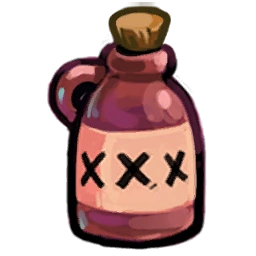

# Tavern Keeper

- **Facción:** Town  · *en alcance MVP*
- **Página de la wiki:** Tavern Keeper (ToS)

## Ficha

**Clase (alineamiento):**

> Town Support

**Tipo:**

> Roleblocking
> Non-unique

**Prioridad de acción:**

> 2 (Highest)

**Resumen:**

> You are a beautiful person skilled in distraction.

**Objetivo:**

> Hang every criminal and evildoer.

**Habilidades:**

> Distract someone each Night.

**Atributos:**

> Role block Immunity
> Attack: None
> Defense: None

**Atributos (texto):**

> Sharing a drink blocks your target from using their role's Night ability.
> You cannot be role blocked.

**Gana con:**

> Town
> Survivor

**Debe matar para ganar:**

> Mafia
> Vampires
> Arsonist
> Serial Killer
> Werewolf
> Witches/Coven
> Plaguebearer
> Pestilence
> Juggernaut

**Resultado Investigator:**

> Investigator Results
> Your target could be a .

**Resultado Consigliere:**

> Your target is a beautiful person working for the town. They must be an Tavern Keeper.

## Texto completo de la wiki

| 

Tavern Keeper 

Alignment

 Town Support

Avatar

Immunities

Role block Immunity

Attack: None

Defense: None

 Ability Stats

 | Type

 | Priority

 | Roleblocking

Non-unique

 | 2 (Highest)

Investigation Results

 Sheriff

You cannot find evidence of wrongdoing. Your target is innocent or great at hiding secrets!

 Investigator

 Investigator Results

Your target could be a Tavern Keeper, Transporter, Bootlegger, or Hypnotist.

 Consigliere

Your target is a beautiful person working for the town. They must be an Tavern Keeper.

Game Information

Summary

You are a beautiful person skilled in distraction.

Abilities

Distract someone each Night.

Attributes

Sharing a drink blocks your target from using their role's Night ability.

You cannot be role blocked.

Goal

Hang every criminal and evildoer.

 Victory Conditions

 | Wins with

 | Must kill

 | Town

 Survivor

 | Mafia

 Vampires

 Arsonist

 Serial Killer

 Werewolf

 Witches/ Coven

 Plaguebearer

 Pestilence

 Juggernaut

 | 

 | DISCLAIMER: These stories are fanmade, and are not created or endorsed in any way by BlankMediaGames or Digital Bandidos.

Red cloth slips off of the Escort’s shoulder as she tiptoes through the door. Her silk dress is but a blanket, wrapped around her body like a towel toga. Her bare feet sink in the cream carpet as she peers into his bedroom, windows with sills of glimmering gold, scarlet wallpaper encrusted with polished rubies, down mattresses bursting with feathers—a far cry from the crumbling brick orphanage she grew up in, where ivy crept up the foot of her bed as she slept on a tattered cot. A lone knife sits on his bedside table and a gun is mounted above his head; under it, a plaque proudly declaring 100-0-0. She scoffs and her plump lips upturn. All this wealth and pride, yet not a single penny for the poor who hunch over in their tents, the children wrapped in cold beached uniforms, those huddled around meager fires. Yet her scorn will be gone when he wakes, and he’ll find an angel blessed with high cheekbones and ginger hair that cascades down the center of her back. She stands there until he opens his top drawer with a single finger. A dollar slips over its wooden lip and, the remnants of her grudge melting away, she walks to his bed without a hint of apprehension. Tonight it’s a Godfather, tomorrow the uptight Mayor, the next the coarse Survivor—money speaks in this town of chaos and the Escort is all too willing to listen.

Mechanics[]

You may choose to Roleblock someone each Night, which prevents them from using their Night ability.

Role block Immune roles, such as a Bootlegger, will not be affected.

You cannot Roleblock roles with Day abilties, because you have a Night ability.

You may Roleblock someone who left the game the same Day/ Night. However, this is usually pointless, and is not recommended.

If you Roleblock a Serial Killer, a Werewolf during a Full Moon Night, or Pestilence, they will attack you.

This does not apply if they are jailed.

A Serial Killer will only attack you if they are not Cautious. If they are Cautious, the Roleblock will fail, and you will live.

When Roleblocking a non-Cautious Serial Killer, you will receive the message "You were murdered by the Serial Killer you visited!", and your Last Will will be covered in blood and unreadable. This does not apply to a Werewolf or Pestilence.

If you did not target them directly, this message will not appear, and the normal Serial Killer death message will appear.

 Town Protective roles (except Trapper), the Potion Master, and a Guardian Angel are capable of defending against this attack.

However, with a Serial Killer, if you then die from any other cause, your Last Will will still be bloodied, even though the Serial Killer death cause does not show up.

When Roleblocking a Werewolf or Pestilence, you and all other visitors to your target will be attacked.

In the case of a Werewolf, they will stay home to do so. Their original target will survive, provided they do not visit the Werewolf.

A Serial Killer and Pestilence will attack their original target, even if the Serial Killer was Cautious.

There are several roles that are immune to your Roleblock; Witches/ Coven Leaders, Pestilence, Veterans, other Tavern Keepers, Transporters, Retributionists, Necromancers, Pirates, Serial Killers, and Bootleggers.

In a situation where you are alone against a single evil role, the stalemate detector will make you lose, despite being able to prevent the other player from killing you.

 Tavern Keeper vs Juggernaut, is the only exception, the game will not automatically end in this 1v1 scenario. This is most likely not intended.

If a Pirate duels you, you will still be able to Roleblock someone due to your Roleblock Immunity. However, you will be killed if they win.

Strategy[]

One of the main purposes of the Tavern Keeper is to hunt for the Godfather (or Mafioso if there is none) who lacks a Mafioso + Godfather combination. If you Roleblock someone and there are no Mafia kills the following day, it is possible you've found the Godfather, at least if one out of the Mafioso and Godfather are dead or you are in a mode where the pairing is are not guaranteed to exist. Things to consider:

If there is both a Mafioso and a Godfather, this is basically useless against the Mafia, and any lack of Mafia kill on a particular Night is probably unrelated.

Even when there is only one Mafia Killing, it is not certain that you found the killer. The killer might have attacked a target with a form of defense, was Away From Keyboard (A.F.K), or have simply chosen not to attack.

Regardless, when there is no Mafia kill, it is generally a good idea to Roleblock the same person again to double check; if Roleblocking the same target multiple Nights results in no Mafia kills every time, it is usually safe to assume your target is the Godfather.

When you do feel you've identified the Godfather, you should keep Roleblocking him repeatedly and note this in your will (so people will know to act against them if you die somehow.) You may want to out him to the town, but doing so isn't always necessary - if you've actually found the Godfather, then Roleblocking him repeatedly will lock down the Mafia's main method of killing while the town searches for other Mafia members, and revealing yourself exposes you to a Witch.

These same strategies apply to Coven roles that produce obvious deaths. It does not apply to the Neutral Killing roles; the Serial Killer and Arsonist produces no visible effect, while the Werewolf will kill you, so you cannot identify them by this method. When hunting a Poisoner, pay attention to if anyone announces they were Poisoned (and remember that the Poisoner themselves might lie and say they were Poisoned after you Roleblocked them).

If a Janitor has been consistently Cleaning the Mafia kills, and the Mafia killed last Night without Cleaning, then the person you Roleblocked is almost certainly the Janitor, unless they already used all three of their Cleanings.

In most cases, there is no reason to Roleblock someone multiple times unless you have some reason to believe they're evil; when you don't know who's evil, you should Roleblock different people each Night to search for a killer. Remember, however, that if the current kill capable Mafia role dies, a new person will inherit the role, and that could be someone you blocked before that point. It might be helpful to put a divider in your Last Will after the point where the kill capable Mafia role died as a reminder that anyone after that point can't be the new Mafioso.

Even when you've identified someone as evil, most of the Mafia roles other than the killers are weak, so Roleblocking them produces only a marginal benefit. Provided there's no Mafioso + Godfather combo, your time is usually better-spent hunting for the Godfather rather than repeatedly Roleblocking someone just because you think they're evil.

However, if a Vigilante is revealed and there's a Witch in game, you may want to continually roleblock the Vigilante until the Witch is dead, to prevent the Vigilante from being controlled into shooting a townie. The same applies for a Jailor who has jailed a revealed Mayor or last Mafia Killing.

If you find the Serial Killer, Werewolf (on a Full Moon) or an Ambusher (on your target) during your hunt for killers, you will be attacked by them and probably die. Therefore, it is imperative to keep records in your Last Will.

Conversely, this means that anyone you've Roleblocked under those circumstances without dying cannot be the Werewolf. This is another reason why keeping a Last Will of all your Roleblocks is important; you may also want to indicate Full Moon Nights in your will to make it more clear that those people have been cleared of that suspicion.

You can use this to your advantage and do a process of elimination. As long as a Transporter or Witch doesn't interfere, you could make a list of suspects of being the Werewolf because you haven't Roleblocked them.

If you die by the Serial Killer when you did not visit him, you will get the standard death message. If you did visit the Serial Killer, you will get a special message ("You were murdered by the Serial Killer you visited!"). Make absolutely certain to convey this to any Mediums the following Night.

However, if you died to the Werewolf you Roleblocked, you will NOT get a special message; you will only know you were attacked by them.

Think hard about whether you want to Roleblock at random; there are several things to consider, which vary depending on game mode:

 Roleblocking Town could interfere with vital abilities.

 Roleblocking a Serial Killer or (on a Full Moon) a Werewolf will get you killed. However, if you have been keeping a good will, you can possibly nab the Werewolf in the process.

You can find the Godfather as described above, but only when there's no Mafioso / Godfather combo. Therefore, in modes like Ranked where that combination is guaranteed, you may want to start blocking at random only once one of them is dead.

The Coven is more vulnerable to Roleblocks in general, since their kill messages are unique unlike the Godfather & Mafioso; however, most of them don't produce obvious effects until they have the Necronomicon and some Coven roles are immune to your role blocks outright, so you may want to only Roleblock at random once the Necronomicon appears and there's no Coven Leader or Necromancer, or if hunting a Poisoner. Hunting a Poisoner like this also risks Roleblocking a Doctor who would otherwise save the poisoned victim, of course.

Random Roleblocks have the advantage of producing a useful will for you that other people can confirm; while you may fall under suspicion of being a Bootlegger, a Spy can generally clear you of this by noting that no Mafia members visited the people you Roleblocked, and even without that it's still useful to be able to avoid suspicion for all evil roles but one.

 Roleblocking the Mafioso will cause the Godfather to attack the target himself instead of the Mafioso. Therefore, if you're in a game with a guaranteed Mafioso and Godfather combination, and the Godfather dies to a Veteran or Bodyguard before the Mafioso dies, then you should try Roleblocking your target again. If this results in no Mafia kills the following day, then continue Roleblocking whoever you blocked that Night since they are possibly the new Godfather.

Normally, when there is both a Godfather and a Mafioso, the Mafioso will leave his Death Note at the target, not the Godfather; but if you Roleblock the Mafioso, the Godfather's Death Note will be left instead. Therefore, if the Mafia's Death Note suddenly changes, it may be a hint that you have Roleblocked the Mafioso, especially if you Roleblock someone else and the Death Note changes back the next Night.

Note that the Mafioso can frequently change his Death Note, so do not accuse them unless you have other proof.

This strategy is useless if the Godfather copies the Mafioso's death note or if neither of them use Death Notes.

If a Town Investigative finds a possible Mafia Killing role, you should Roleblock them to keep them from killing anyone and to confirm that they are indeed a member of the Mafia.

 Roleblocking early can be useful since it confirms there is a Tavern Keeper or Bootlegger, but has the risk of preventing Townies from protecting and investigating other players. Generally speaking, it's a good strategy to Roleblock on the first Night in game modes where the Mafia is likely to have only one killer (because the benefit of Roleblocking that killer is high enough to outweigh the risk of disrupting a Townie for a Night, and because you want to start narrowing down who the kill capable Mafia role is as fast as possible); it makes considerably less sense to do so in game modes like Classic Mode or Ranked where the Mafia is guaranteed to start with both the Godfather and Mafioso.

Once either a Mafioso or Godfather has died, the Mafia can only have one kill capable Mafia role (unless an Amnesiac or Forger interferes); from that point on you should always Roleblock every Night. If there are no Neutral Killing roles, finding the last Mafia Killing role can often singlehandedly win the game.

When you do find and Roleblock the Godfather, it isn't necessarily a good idea to try and get him hanged immediately; that would just cause a new member of the Mafia to become the Mafioso. As long as you have him blocked, the Mafia can't kill (and it's unlikely you'll get forged or Cleaned with the Mafia unable to kill, so even if you do die, they'll probably get hanged when your Last Will is revealed). If you find the Arsonist or Juggernaut, try the same strategy. This will prevent them from killing and allow your Town Investigatives to safely search for the remaining criminals.

Remember that, in this situation, if there is a Serial Killer, Werewolf or an Ambusher + Witch combo and you are confirmed, you will most likely die. In this case, you should try to hang them or at least put it very clearly in your Last Will.

Also, remember that the Transporter has a higher priority than you and that the Witch can control you; these things can potentially free a Mafia Killing role who you thought you had pinned down. In particular, the danger of being controlled means you should never announce that you're Roleblocking a Mafia Killing role unless you intend to try and get them hanged the same day.

If you're playing Ranked and the Mayor reveals day 1, it's usually best to block him on Night 1. You are almost twice as likely to get a "bad" visit (blocking a Town Investigative, Town Protective, dying to Serial Killer/ Ambusher) than to get a "good" visit (blocking a Janitor or Arsonist). Many of your visits will be "neutral" (blocking a Medium, Jester, Bootlegger, or Godfather while there is a Mafioso) that doesn't have much value either way.

One major value of role-blocking early is that you confirm that there is a Tavern Keeper or Bootlegger in the game. Most Bootleggers will be trying to help the Mafia, and anyways, they have a much higher chance of a "good" visit. Therefore, it is probably a Tavern Keeper that is blocking the Mayor, not a Bootlegger.

However, as soon as the Godfather or Mafioso is killed; the Tavern Keeper should immediately begin blocking to narrow down the suspects of who the Godfather is. If there was a kill when you blocked someone, you know they cannot be the Godfather (unless they were transported, of course).

The importance of Roleblocking the Mayor somewhat decreases as more Townies die, but it is still usually smart to wait until at least Night 3 before coming off the Mayor (unless the Mafioso dies). This is because "bad" visits also have a slight increase; (roles like Town Killing and Werewolf are more likely to end up being Roleblocked).

You can Roleblock the youngest Vampire in order to prevent them from biting or converting someone that Night. It sometimes may be best to force a draw between the Town and Vampires if no other options are available.

If you are converted to a Vampire, you will lose your Roleblock Immunity.

Be very careful if you visit someone who is confirmed to be a Town role (like a Vigilante), as the Mafia or Serial Killer may try to kill them too. A Lookout may see you visit and you may get hanged.

Achievements[]

 | Name

 | Description

 | Merit Points

 | Attendant

 | Win your first game as a Tavern Keeper

 | 20

 | Tailgater

 | Win 5 games as a Tavern Keeper

 | 20

 | Great Company

 | Win 10 games as a Tavern Keeper

 | 40

 | Master of Distraction

 | Win 25 games as a Tavern Keeper

 | 100

 | Hey There

 | Successfully Roleblock someone

 | 20

 | Dangerous Work

 | Die from visiting a Serial Killer

 | 40

 | I Look Good!

 | Roleblock yourself

 | 100

 Only achievable with a Transporter or Witch/ Coven Leader.

Messages[]

 | 

 | Someone occupied your night. You were role blocked!

 | Displays at the end of the Night when a Tavern Keeper role blocks someone. 

 | Someone tried to role block you but you are immune!

 | Displays at the end of the Night to a role block immune player when a Tavern Keeper attempts to role block them. 

 | Someone tried to role block you but you were in jail.

 | Displays when you are jailed and a Tavern Keeper tries to roleblock you. 

Trivia[]

The Tavern Keeper's skin (Candy) has a very striking resemblance to the Disney character Jessica Rabbit.

Prior to Version 2.0.0.6537, a Serial Killer would attack a Tavern Keeper for Roleblocking them even if they were jailed and/or executed.

 Tavern Keeper's achievement and statistic icon
 When looking at in-game statistics or achievements, the Tavern Keeper is one of two roles (the other being the Forger) that has their icon different from the actual role icon found during gameplay. It appears to be rotated to the right.

If you are killed by the Serial Killer on the first day, there is only a ~52% chance that you have Roleblocked them. Of course, everyone would know whether or not you did Roleblock them by seeing the bloodied Last Will.

Proof: Let R = event Roleblocked Serial Killer Night 1 (N1), K = event killed by Serial Killer N1. P(A) represents the percentage chance that an event, A, occurs. P(A|B) represents the chance that event A happens when we know that B also happens. To understand this, imagine two coins. You flip the first and it comes up as heads. Here's a sample space where possible outcomes from now on are bold -

 | 

 | Coin 1

 | Coin 2

 | 

 | H

 | T

 | H

 | HH

 | TH

 | T

 | HT

 | TT

Let Hx = event that coin 1 turns up heads, followed by flip x from Coin 2

HH = event heads comes up twice.

We want to find P(HH|Hx). Usually, the sample space is equal to 1 and all probabilities are a fraction of 1, the sum of all probabilities, making them equal to themselves and relative to the whole sample space, but there are results in the complete sample space that we want to ignore; these are ones where coin 1 shows tails. To find P(HH|Hx), we can create a smaller sample space within the whole one which only includes results where Coin 1 shows heads, represented in bold. Now we can find P(HH) relative to the smaller sample space, where P(HH) (which is 1/4 relative to the whole sample space) becomes a fraction of 1/2, the size of the smaller sample space (set Hx) when the results have been narrowed down to occurrences within the smaller sample space. This P(HH) relative to the set Hx is equal to P(HH|Hx).

P(HH|Hx) = (1/4)/(1/2) = 1/4 x 2 = 1/2

P(HH|Hx) = 1/2

We need to find P(R|K). Like in our example, we want to determine the size of the smaller sample space of the set K, which is equal to P(K). There are two ways that Event K can happen:

The Tavern Keeper Roleblocked the Serial Killer . There is a 1/14 chance of this happening in a Classic game assuming nobody leaves the lobby.

The Tavern Keeper did not distract the Serial Killer and the Serial Killer killed the Tavern Keeper naturally. This is 13/14 x 1/14 = 13/196

These two ways are mutually exclusive (there is no overlap between them) so that certain possibilities aren't counted twice.

P(K) = 1/14 + 13/196 = 0.138 (3 dp)

P(R) as a fraction of 0.138, making it relative to the smaller sample space of set K, is equal to P(R|K). We already know that P(R) = 1/14.

P(R|K) = (1/14)/0.138 = 51.85% (2 dp)

History[]

3.3.11

Role renamed to Tavern Keeper. Some assets (i.e. Scrolls) were not updated, leaving several references to the prior role identity.

Updated Tavern Keeper's icon to a placeholder (), previous icon was ().

3.2.4

Reanimated Ambusher will no longer attack roles that attempted to visit but were Roleblocked.

3.1.14

Added Escort vs. Vampire stalemate detector.

Fixed Tracker incorrectly seeing someone visiting when Roleblocked.

2.5.5.12200

The Escort's role icon has been changed. Old one was .

Added Escort's circled role icon ().

2.3.2.9706

 Medusa vs. Escort is now a Coven victory.

Town of Salem Release

Introduced as Escort.

 | 

 | 
Roles

 | 

 | 

 | 
 Town

 | 

 | Town Investigative | | Investigator • Lookout • Psychic • Sheriff • Spy • Tracker | | 

 | 

 | Town Killing | | Jailor • Vampire Hunter • Veteran • Vigilante

 | 

 | Town Protective | | Bodyguard • Crusader • Doctor • Trapper

 | 

 | Town Support | | Mayor • Medium • Retributionist • Tavern Keeper • Transporter

 | 
 Mafia

 | 

 | Mafia Deception | | Disguiser • Forger • Framer • Hypnotist • Janitor | | 

 | 

 | Mafia Killing | | Ambusher • Godfather • Mafioso

 | 

 | Mafia Support | | Blackmailer • Bootlegger • Consigliere

 | 
 Coven

 | 

 | Coven Evil | | Coven Leader • Hex Master • Medusa • Necromancer • Poisoner • Potion Master | | 

 | 
 Neutral

 | 

 | Neutral Benign | | Amnesiac • Guardian Angel • Survivor | | 

 | 

 | Neutral Evil | | Executioner • Jester • Witch

 | 

 | Neutral Killing | | Arsonist • Juggernaut • Serial Killer • Werewolf

 | 

 | Neutral Chaos | | Pirate • Plaguebearer/ Pestilence • Vampire

## Implementación

- [ ] Definido en `packages/engine` con su prioridad y facción
- [ ] Acción nocturna (si aplica) validada con objetivos legales
- [ ] Resultado de investigación correcto (Sheriff / Investigator / Consigliere)
- [ ] Condición de victoria y de derrota comprobada en tests
- [ ] Tests unitarios del rol en verde
- [ ] Tarjeta y texto de ayuda en la app
- [ ] Icono e ilustración propia (no el arte de la wiki)
- [ ] Plantillas de narración para sus eventos
