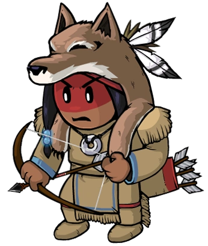

# Tracker

- **Facción:** Town  · *en alcance MVP*
- **Página de la wiki:** Tracker (ToS)

## Ficha

**Clase (alineamiento):**

> Town Investigative

**Tipo:**

> Investigation
> Non-unique

**Prioridad de acción:**

> 3

**Resumen:**

> You are a skilled tracker who will follow their prey to any destination.

**Objetivo:**

> Hang every criminal and evildoer.

**Habilidades:**

> Track one person at night to see who they visit.

**Atributos:**

> Ignores Detection Immunity
> Attack: None
> Defense: None

**Atributos (texto):**

> None.

**Gana con:**

> Town
> Survivor

**Debe matar para ganar:**

> Mafia
> Vampires
> Arsonist
> Serial Killer
> Werewolf
> Coven
> Plaguebearer
> Pestilence
> Juggernaut

**Resultado Sheriff:**

> You cannot find evidence of wrongdoing. Your target is innocent or great at hiding secrets!

**Resultado Investigator:**

> Coven Expansion Results
> Your target could be an .

**Resultado Consigliere:**

> Your target is a skilled[sic] in the art of tracking. They must be a Tracker.

## Texto completo de la wiki

| 

 | Looking for the Town of Salem 2 or Traitors in Salem role?

This role appears in Town of Salem 2 and Traitors in Salem. For the ToS 2 counterpart, see Tracker and for the TiS counterpart, see Tracker.

 | 

 | This page describes content that can only be accessed in the Coven Expansion.

Tracker 

Alignment

 Town Investigative

Avatar

Immunities

Ignores Detection Immunity

Attack: None

Defense: None

 Ability Stats

 | Type

 | Priority

 | Investigation

Non-unique

 | 3

Investigation Results

 Sheriff

You cannot find evidence of wrongdoing. Your target is innocent or great at hiding secrets!

 Investigator

 Coven Expansion Results

Your target could be an Investigator, Consigliere, Mayor, Tracker, or Plaguebearer.

 Consigliere

Your target is a skilled in the art of tracking. They must be a Tracker.

Game Information

Summary

You are a skilled tracker who will follow their prey to any destination.

Abilities

Track one person at night to see who they visit.

Attributes

None.

Goal

Hang every criminal and evildoer.

 Victory Conditions

 | Wins with

 | Must kill

 | Town

 Survivor

 | Mafia

 Vampires

 Arsonist

 Serial Killer

 Werewolf

 Coven

 Plaguebearer

 Pestilence

 Juggernaut

 | 

 | DISCLAIMER: These stories are fanmade, and are not created or endorsed in any way by BlankMediaGames or Digital Bandidos.

The Tracker had always been good at what he did. He grew up in a family of hunters, where he learned everything about how to stalk, how to pursue, and then how to act. Turns out that being cut off from people through his childhood ended up making him all the more dependent on people throughout his adulthood. There was always some noteworthy charisma that was imbued into him. Everyone gravitated around him. He also seemed to have his neck plastered with lipstick marks most days. Anyone’s guess as to why.

The Town needed somebody like this, a person who could gain trust and relentlessly pursue a target at the same time. The Tracker accepted this offer. He was willing to help out anybody who was in need of it.

His first night on the job was somewhat compromised. He opened his door to find a beautiful woman standing in front of him. A few drinks later and it was business as usual for The Tracker.

He soon grew suspicious of this woman, there had to be something more to the night than just that. He followed her for a few days and found that she was visiting someone new every single night. The Tracker slowly grew obsessed with this woman and stalked her every single night.

One day, he went back home, frustrated after intently watching this Escort and another man in bed. His rage remained until he found out his new obsession was dead by the cold blade of a deranged lunatic.

Anguish washed over him. He was desperate for revenge. He told everyone the next day about how he saw the Escort visit this man’s house the night before her untimely demise. Nobody questioned him; this was just the Tracker’s job. The accused was drenched in sweat as he felt all eyes on him. “I mean… th-this guy has it out for m-me” he murmured desperately. Then a rusty blade fell from his pocket. The Tracker was in prime position to finish its prey.

Mechanics[]

The Tracker can select one target at Night to see who the target visits.

If the target does not visit anyone or has an Astral visit, the Tracker will receive no notification.

If the target does visit another player, the Tracker will see "Your target visited [other player's name]!"

You will not know the action used on another player if the target visits another player, unless it is revealed the next day, such as they were killed, Poisoned, etc.

If you visit a Veteran on alert, you will die. However, if you track someone who visits a Veteran on alert, you will not die.

If the Tracker visits a Necromancer or a Retributionist controlling a dead corpse, they will see which dead player they are visiting.

An Amnesiac will not visit the person whose role they are attempting to remember.

If your target visits someone who is Transported, you will see your target visit whoever they were Transported into visiting and not their original selected target.

If your target visited two people, this means your target is either a Transporter or a Disguiser.

Strategy[]

Early in the game, try to track people who barely talk. Evils have a tendency to stay silent.

Track suspicious players; this could potentially reveal that they visited a player who was killed during the Night.

The Tracker is mostly a team player that works with other roles to find out the roles of people being tracked. Try to find other Town Investigative and Town Protectives to track down evil roles that do not kill immediately.

If you know who the Doctor is and you think that you have tracked a Poisoner, then it may be a good idea to whisper who the Poisoner targeted. This way, the Doctor could heal the poisoned player. Of course, most players fake that they are poisoned so this strategy may not be useful. However, if the player is blackmailed, this will work as an effective backup plan.

Avoid tracking Transporter claims. If they transport themselves, you will not see them visit their targets, and can put suspicion on the Transporter until they claimed to have transported themselves.

If you track the same person each Night and they keep visiting different targets, try to communicate with a Sheriff or Investigator to see the target's investigation results. If the people that are being visited show up as Bodyguard, Godfather, or Arsonist to the Investigator, then the person you are tracking is an Arsonist. Likewise, this strategy can be used with a Sheriff to find out a Framer or Hex Master. If the targets that are being visited show up as suspicious to the Sheriff, then the person you are tracking is likely a Framer/ Hex Master.

If you find a Tavern Keeper or Bootlegger and there's a confirmed Serial Killer kill, try tracking them. If they die the next Day from a Serial Killer and their Last Will was bloodied, you will know the identity of the Serial Killer.

Try tracking Town Protective claims. If they visit Medusa and are Stoned the next day, you will know the identity of Medusa.

Sometimes, knowing whether someone visited can be as useful as knowing who they visited.

Some hard-to-spot roles, like the Arsonist, Hex Master, and Plaguebearer, will usually visit every single Night; if you track someone and they don't visit, it's unlikely that they're one of those roles. If they suspect a Tracker will investigate them, they may stay home to avoid suspicion, but this is rare.

Similarly, if someone claims a non-visiting role, such as Medium, Survivor, Retributionist, Amnesiac, or Psychic or a role that produces obvious results after a visit, like Vigilante, then you can check by visiting them - although again, a smart evil might stay home right after claiming one of those roles.

Additionally, if they are the Godfather (with a Mafioso) or the Hex Master (with the Necronomicon), you will not see their visits.

Two roles can be caught visiting two people: the Transporter and the Disguiser. Therefore, in theory, if you see two visits for your target, they are definitely one of those roles; however, interpreting that they are a Transporter is complicated by the fact that Transporters often transport themselves.

If you see two visits, and they both claim to be transported, there is a Transporter in game, and one of them is the person you targeted, then you did not target the Transporter but got transported onto them. Therefore, one of the two you didn't select as your target that Night is the Transporter.

Trying to deliberately verify if someone is a Transporter only works if they don't self-transport (if they do, you'll get the results for their other target, and therefore probably won't see two visits).

To determine if you tracked a Transporter or Disguiser, ask the targeted players if they were transported. If not, the tracked player is most likely a Disguiser.

In the case of a Disguiser, one of the targets is a Mafia member, unless one of the targets is the Disguiser themselves.

Your results can be very effective when paired with a Spy:

If a Spy sees a Mafia or Coven visit to a person on the same Night that your target visited them, your target may be a member of the Mafia or Coven. Keep in mind, however, that it's possible that there was a second visitor who was the actual evil you're looking for.

On the other hand, if a Spy doesn't see any Mafia or Coven visits to the person your target visited, then your target is likely not a member of the Mafia or Coven respectively; keep track of people who are 'cleared' like this in your will.

Keep in mind the Disguiser can mess with the Spy's results.

If your target visits on the same Night that a killer kills someone else, then your target was definitely not that killer. (However, keep in mind that if they're a member of the Mafia, they could later become the killer if the current one dies.)

If you see your target visit a dead person who is not a Town role, they are a Necromancer.

If you track a Jailor, you will get no results. Jailors do not leave their house, even if they choose to jail someone.

Remember that only a Disguiser can normally visit other Mafia. Unless a Coven Leader or Transporter is involved, when you see a Mafia visit another, that means the person they visited cannot be Mafia.

If you have visited someone who has not visited another player, they may be an Amnesiac, especially if they hint at being neutral or outright claim a Neutral Benign role. If they turn against the Town, there is a good chance that this is the person in question.

Achievements[]

 | Name

 | Description

 | Merit Points

 | Low Jack

 | Win 1 game as a Tracker

 | 20

 | Pathfinder

 | Win 5 games as a Tracker

 | 20

 | Trail Chaser

 | Win 10 games as a Tracker

 | 40

 | Bloodhound

 | Win 25 games as a Tracker

 | 100

 | Double Vision

 | See your target visit two people on the same night

 | 40

 | Around the Block

 | See your target visit you

 | 100

 | Stalker

 | Track the same player 3 times

 | 40

 Only achievable by tracking a Transporter or Disguiser.

 Only achievable if your target visits someone every Night.

Messages[]

 | 

 | Your target visited (Player)!

 | Displays at the end of the night to a Tracker when their target visits someone.

Trivia[]

The Tracker was added into the game as a result of the Testing Grounds.

History[]

3.3.11

Fixed Tracker still getting information when witched/controlled by Coven Leader

3.1.14

Fixed Tracker incorrectly seeing someone visiting when role blocked, dueled, and controlled.

Fixed Tracker tracking Godfather bug.

Fixed Tracker detecting Godfather visiting victim when Godfather orders Mafioso to kill the victim.

Fixed incorrect Tracker results when Mafioso picks one victim but Godfather chooses another.

2.5.5.12200

The Tracker's role icon has been changed. Old one was .

Added Tracker's circled role icon ().

2.0.0.6582

Introduced.

 | 

 | 
Roles

 | 

 | 

 | 
 Town

 | 

 | Town Investigative | | Investigator • Lookout • Psychic • Sheriff • Spy • Tracker | | 

 | 

 | Town Killing | | Jailor • Vampire Hunter • Veteran • Vigilante

 | 

 | Town Protective | | Bodyguard • Crusader • Doctor • Trapper

 | 

 | Town Support | | Mayor • Medium • Retributionist • Tavern Keeper • Transporter

 | 
 Mafia

 | 

 | Mafia Deception | | Disguiser • Forger • Framer • Hypnotist • Janitor | | 

 | 

 | Mafia Killing | | Ambusher • Godfather • Mafioso

 | 

 | Mafia Support | | Blackmailer • Bootlegger • Consigliere

 | 
 Coven

 | 

 | Coven Evil | | Coven Leader • Hex Master • Medusa • Necromancer • Poisoner • Potion Master | | 

 | 
 Neutral

 | 

 | Neutral Benign | | Amnesiac • Guardian Angel • Survivor | | 

 | 

 | Neutral Evil | | Executioner • Jester • Witch

 | 

 | Neutral Killing | | Arsonist • Juggernaut • Serial Killer • Werewolf

 | 

 | Neutral Chaos | | Pirate • Plaguebearer/ Pestilence • Vampire

## Implementación

- [ ] Definido en `packages/engine` con su prioridad y facción
- [ ] Acción nocturna (si aplica) validada con objetivos legales
- [ ] Resultado de investigación correcto (Sheriff / Investigator / Consigliere)
- [ ] Condición de victoria y de derrota comprobada en tests
- [ ] Tests unitarios del rol en verde
- [ ] Tarjeta y texto de ayuda en la app
- [ ] Icono e ilustración propia (no el arte de la wiki)
- [ ] Plantillas de narración para sus eventos
