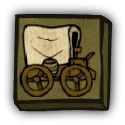

# Transporter

- **Facción:** Town  · *en alcance MVP*
- **Página de la wiki:** Transporter (ToS)

## Ficha

**Clase (alineamiento):**

> Town Support

**Tipo:**

> Disruption
> Non-unique

**Prioridad de acción:**

> 1 (highest)

**Resumen:**

> Your job is to Transport people without asking any questions.

**Habilidades:**

> Choose two people to Transport at Night.

**Atributos:**

> Role block Immunity
> Control Immunity
> Attack: None
> Defense: None

**Atributos (texto):**

> Transporting two people swaps all targets against them.
> You may Transport yourself.
> Your targets will know they were Transported.

**Gana con:**

> Town
> Survivor

**Debe matar para ganar:**

> Mafia
> Vampires
> Arsonist
> Serial Killer
> Werewolf
> Witches/Coven
> Plaguebearer
> Pestilence
> Juggernaut

**Resultado Investigator:**

> Investigator Results
> Your target could be an .

**Resultado Consigliere:**

> Your target specializes in Transportation. They must be a Transporter.

## Texto completo de la wiki

| 

 | Looking for the Traitors in Salem role?

This role appears in Town of Salem and Traitors in Salem. For the TiS counterpart, see Transporter

Transporter 

Alignment

 Town Support

Avatar

Immunities

Role block Immunity

Control Immunity
Attack: None 

Defense: None

 Ability Stats

 | Type

 | Priority

 | Disruption

Non-unique

 | 1 (highest)

Investigation Results

 Sheriff

You cannot find evidence of wrongdoing. Your target is innocent or great at hiding secrets!

 Investigator

 Investigator Results

Your target could be an Tavern Keeper, Transporter, Bootlegger, or Hypnotist.

 Consigliere

Your target specializes in Transportation. They must be a Transporter.

Game Information

Summary

Your job is to Transport people without asking any questions.

Abilities

Choose two people to Transport at Night.

Attributes

Transporting two people swaps all targets against them.

You may Transport yourself.

Your targets will know they were Transported.

Goal

Hang every criminal and evildoer.

 Victory Conditions

 | Wins with

 | Must kill

 | Town

 Survivor

 | Mafia

 Vampires

 Arsonist

 Serial Killer

 Werewolf

 Witches/ Coven

 Plaguebearer

 Pestilence

 Juggernaut

 | 

 | DISCLAIMER: These stories are fanmade, and are not created or endorsed in any way by BlankMediaGames or Digital Bandidos.

The Transporter is obsessed with inventions, gears, oil, and springs. Her nights are whittled away by fantastical ideas and what-ifs, has-bes and will-beens. Experiments involving carriages and hot air balloons produce steam powered chariots, which she forces upon prospect customers. Lamps hang from rotting wooden posts strew across the village, interlinked by a web of wires that wrap around every doorframe and gutter. She often mumbles to herself as she passes by the bakery, drawing attention from the local Investigators and Consiglieres. What could this Salem belle be planning for the innocent baker? When they discover her identity as a Transporter, they may think that she’s the pyromaniac who lit up City Hall, or perhaps their investigations will go awry and she will be revealed as a Witch—who better to burn at the Salem stake than a sorceress who thickens the air with a filmy black smog? But there’s always a chance that she will continue to evade capture by riding in her unique chariot, yet will leave behind a trail of bodies, mafia, jester, and town alike.

Mechanics[]

You can Transport two targets (including yourself) each Night.

 Transporting a target swaps all visitors to them; for example, all visitors that visit target A will instead visit target B, and vice versa.

However, you cannot Transport a Guardian Angel's protection onto another player.

If a Jester is hanged, you cannot Transport their haunting to another player.

Your Transporting does not affect an Arsonist's igniting, all Doused players will still die.

You cannot be Controlled by a Witch or a Coven Leader.

You cannot be Roleblocked by a Tavern Keeper, Bootlegger or Pirate.

You cannot Transport the same person with themselves.

If two or more Transporters choose to transport the same person, whoever joined the lobby first will have their Transport occur first.

You cannot Transport the results of a Pirate Duel away from a player, however, if you know someone is likely to be protected, swapping them will cause their protector to save the Dueled player if the Pirate wins the duel.

You cannot Transport the Jailor's target, and instead your Transport will fail. You will receive the message "One of your targets was in jail, so you could not Transport them."

Transport - Normal behavior[]

You may choose two people to Transport each Night. The order of selecting who to Transport does not matter.

Both the people you Transported will receive the message, "You were Transported to another location." at the end of the Night.

Visitors, on the other hand, will not be informed that they hit the wrong target (although some, like killers, may be able to figure it out because their selected target wasn't killed.)

If your Transport causes a target to visit themselves, the target will use their Night ability on themselves (e.g. attacking, investigating, role blocking). For certain roles like Investigator, you will get an Achievement when you do this for the first time.

The only exception to this system is the Werewolf. If they are Transported into targeting themselves, they will instead rampage at home and kill all visitors, including you.

When your Transport will fail[]

Transporting will be ineffective in the following situations:

You cannot switch a Survivor's target. If they use a bulletproof vest, it will always target themselves. Any other visits to the Survivor will still be switched to your other target.

You cannot switch a Veteran's target. If they are on alert, you will be shot. They will still be Transported (meaning that anyone who was trying to visit your other target will die, while anyone who was trying to visit the Veteran will be saved). This also applies for the Medusa as well.

If you Transport a Werewolf who was forced to stay at home because they were role blocked or didn't pick a target, then they will still rampage at "home". You will still die because you visited the Werewolf when they stayed home, but if you kept an accurate Last Will, you may nab the Werewolf in the process.

You cannot Transport targets who are in Jail. When you try, you will be notified that one of your targets was Jailed. A Lookout will still see you visit your other target, and a Werewolf rampaging at one of their houses will maul you. The Jailed person will know you tried to Transport them.

You cannot Transport targets who left the game before the Night ends (You will receive no Transport message).

You cannot Transport a dead Medium's Seance target since their ability takes place when the Night begins.

You cannot Transport the guilt from a Vigilante who shot a Townie. The Vigilante will still commit suicide. However, you may Transport the Vigilante's target the Night before.

When Transporting a Doctor or Bodyguard, if they chose to Self Heal or Vest, they will continue to do so. Transporting does not force them to protect the other Transported target when they have chosen a self targeting ability.

Reanimated corpses (including Necromancer's ghoul) sometimes ignore transportation. This is most likely a bug.

Your Transport cannot switch the following attacks:

If your target is attacked by a Jester or a Pirate, they will still die even if you Transport them.

If your target is a Vigilante who shot a Town member, they will still commit suicide the following Night.

If your target role blocked a Serial Killer or Werewolf (during Full Moon), the killer will attack the role blocker even if you Transport them.

If your target visited a Veteran or Medusa who is using their ability, they will still be shot or Stoned by them.

If your target was doused by an Arsonist, they will still be ignited if the Arsonist chooses to ignite their targets.

If your target was hexed by the Hex Master, your Transports will not prevent their massive Unstoppable attack from taking place.

However, a bug exists where the original target will appear to be Hexed to the Hex Master, instead of the new target.

If your target attacked someone who is Guarded by a Bodyguard, they will be killed even if you Transport them.

If your target visited a house in which a Werewolf rampaged at, they will be mauled even if you Transport them (same with Pestilence and Juggernaut's rampages.).

If your target visited someone that was visited by a Crusader or an Ambusher and they are attacked by said roles, they will die even if you Transport them.

If you Transport someone who was targeted by an Arsonist and/or Plaguebearer, these two roles will accurately see who actually ended up getting Doused/ Infected. Therefore, it is often easy for an Arsonist to tell who their target was Transported with.

This is not the case for Hex Master and Poisoner, these roles will still see their specific ability label ( Hex/ Poison) on the player they intended to target.

If you Transport a Poisoner with their target, the Poisoner will see two Poison icons on the player list: one on themself and one on the player they meant to target.

Interaction between two Transporters[]

If two Transporters select the same person, then the outcome will depend on the order in which the Transporters appeared in the lobby before the game started. Let T1 and T2 be Transporters, and let T1 join the lobby before T2. The game will process their targets' Transportation thus:

T1 marks their left target for Transportation;

If T1's right target is the same as T2's right target, then T2 marks their right target for Transportation;

T1 swaps whoever they marked with their right target;

If T2 didn't mark anyone in step 2, then they mark whoever is at their right target's house;

T2 swaps whoever is at their left target's house with the person they marked.

Strategy[]

The Transporter can be a very powerful role, as long as they have the right information at hand. However, they can also be a chaotic one, messing up delicate balances.

You can always act like a Town Protective role when all of them are dead. Transporting people can help save important Town roles late game and cause attackers to attack themselves, wasting their Night kill.

A Transporter can actually attempt to kill people who they suspect, by baiting people into visiting them during the Day and Transporting themselves with the person they want to kill.

However, a Jailor, Veteran, Medusa, Ambusher, Crusader, Werewolf, Pestilence, or another Transporter can mess up this plan.

A Transporter is among one of the easiest roles to confirm. It is a good idea to Transport two people the first Night to avoid any Hypnotist claims.

 Transporters do not have to Transport every Night, and if in a situation where Transporting won't yield any important result, not Transporting may be beneficial to avoid messing up roles like Vigilante and Investigator.

Who to Transport[]

During the second half of a game, you should be able to identify which players the Mafia or Serial Killer will target, such as the Mayor or Jailor. Transporting valuable roles could save lives. If you have a decent idea of who the opposition is and who they'll target, swap one with the other so that the player attempting to kill your fellow Townie will target themselves or their teammate. They will only kill themselves if they are either a Mafioso, a Vigilante, or a Juggernaut however.

In the later part of the game, you can play a risky route if there are obviously many killers and few Townies. In order to implement this strategy, you must have paid attention to who is likely to be a killing role and who they have targeted to kill. Often, the Mafia will target the most important Town roles first; in this case, act like a Vigilante (or other important role) who doesn't know how to play the game, and Transport yourself with possible members of the Mafia. The Mafia will try and fail to kill the ' Vigilante'. If the Mafia or Neutral Killing roles are killing randomly, make yourself a target (without violating the Town of Salem etiquette or rules) by inciting confusion. Claim that [insert person's name here] is evil, claim multiple roles, be vague - since there are few Townies, there is little reason to vote you up - in addition, you may be the Jester! The Mafia and Neutral Killing will often try to kill you simply to get you out of the way - Transport yourself out of harm's way, and attempt to kill evil roles in the process. NOTE: This will not work against the Werewolf, the Pestilence, and the Ambusher as these roles can still kill you even if you Transport yourself since these roles can attack visitors (you visit yourself when Transporting yourself).

 Transporting yourself with a killer except for the Werewolf/ Pestilence and Ambusher will make them unable to kill you, since they cannot target themselves. If they are a Vigilante, Mafioso or Juggernaut, they'll kill themselves, and if they're an Arsonist, they'll douse themselves and you unlike in prior versions of the game, as you can no longer prevent an Arsonist from igniting.

Arguing and fighting is pretty common in heated Town of Salem games. Consider Transporting both sides of an argument with each other. It is pretty common that one or the other actually is a killer, so your chances of getting a self-attack are pretty good.

Keep in mind that one of them could be Veteran or Vigilante, and that Transporting them could cause you/them to die unintentionally.

Investigative roles such as Sheriff tend to visit players that argue, so avoid doing this strategy if there's somebody in the game that claims to be a role that could gather information on one of the players by visiting them.

 Transporting an Arsonist with their target causes them to douse themselves and you, forcing them to waste a Night to clean themselves.

If someone claims to be a Survivor (regardless of credibility), you can Transport yourself with the claimed Survivor so they will act as your human shield. The risk is that they may become a target of Vigilante and you may get shot in his/her place. When said person complains about being Transported the next Day, stop repeating the action in the following Night because any evil killer may target him/her to get rid of you.

If you know someone of high suspicion, after said person complains of being Transported, swap him/her with that suspicious target. Hopefully, the latter will be targeted by any evil killer instead.

If you're unsure who to Transport, it's usually a good idea to Transport yourself with someone who you suspect is evil or who seems unlikely to be attacked; you'll know with absolutely certainty that one half of the Transportation is a Townie, and the other half may be evil, which means you might get the Mafia to attack themselves.

Don't Transport yourself with someone who is confirmed as evil unless you're sure there's no Vigilante, since this could easily get you shot.

One drawback to this is that it makes it somewhat harder for you to confirm, since you're only showing the Transported message to one Townie instead of two, and you're deliberately aiming for someone who might be evil.

Although it rarely comes up, the Transporter will win automatically via auto-resolve one-on-one versus a Mafioso, rather than losing like you might expect; this is because the Transporter can Transport themselves with the Mafioso indefinitely and only one member of the Mafia left and you've identified them, since the Mafioso can only kill themselves in this situation, the stalemate detector will give Town the win. This is not the case for the Godfather, as you cannot make them kill themselves thanks to their Night immunity and the Mafia will win instead.

A potential strategy is to claim Transporter Day 1 and Transport yourself with others. This way, you produce a confirmed Town easily and you may then demand roles. Keep in mind, however, this will make you a target later on as you have to Transport more important players instead of yourself. (However, players may not believe your claim immediately. In this case, be patient. At least you have a confirmed Town.) Bear in mind that you may be accused of being a Hypnotist if Mafia are present, and this strategy is not recommended, especially in the case of an Ambusher.

If there is a Hypnotist in the game, do not Transport just yourself and somebody else, as you may be accused of being a Hypnotist, due to having the same investigation results and the fact that only one person confirmed Transportation, which a Hypnotist can only do. Avoid this by Transporting players other than yourself, to confirm yourself as Transporter.

Bear in mind however, that you may be accused of being the second Hypnotist if there is one in the graveyard, so Transport players other than yourself to clear yourself of any further suspicion.

 Hypnotists will also claim that they Transported their Mafia allies, so avoid Transporting players that aren't confirmed and acting friendly to you, as this may be seen as two or more Mafia members collaborating.

If an Executioner wins and reveals themselves, Transport yourself or any important Townies with them. Killing roles usually won't target them, and they have permanent Basic defense, meaning only a handful of Neutral roles can kill them.

You can use Vigilantes that shot a Town member as a meat shield since they'll die anyway.

Who not to Transport[]

If a Townie asks for "TP/LO" to be on them, DO NOT TRANSPORT THEM! They are not asking for a Transporter; rather, they are asking for a Town Protective and a Lookout to guard and watch them in case an evil role tries to target them. If you Transport them, chances are you will accidentally Transport them with an evil role's target, which will kill them.

While it might appear that Transporting early is harmful, you should always Transport as early as possible to confirm your existence. If your actions appear to be causing chaos, for example, a Town Investigative is claiming to check one of your targets, you should almost always come out and clear the confusion.

Do not Transport the revealed Mayor or Jailor when Town Protective roles are around, as you might Transport them into a target being attacked (and not protected). This results in an important Townie dying needlessly.

Make certain to be wary of the Veteran. If you attempt to Transport him while he is on alert, you will be shot. Additionally, everyone who visited your other target will visit the Veteran instead and vice-versa.

The Vigilante is very dangerous to you; if you've identified a role as evil, there's a good chance the Vigilante has, too. This means that if you Transport a confirmed evil role with a Townie (or with yourself), you could accidentally cause the Vigilante to shoot an innocent person.

In particular, if you suspect the Town has a Vigilante, you may want to avoid Transporting yourself with someone who was almost hanged the Night after the hang failed; Vigilantes often take a risk and shoot people who seemed hard to hang in hopes of identifying the entire Mafia based on the people who failed to vote for them. Always try to check with the Vigilante to make sure who they are shooting.

The Plaguebearer might be your worst enemy, as an Infected Transporter can help the Plaguebearer spread the Plague and evolve into Pestilence much sooner. Attempting to Transport yourself in an attempt to protect yourself when Pestilence is around will very likely be a death sentence for you, as you may die to their rampage attacks or by visiting them.

If it seems like a Tavern Keeper has the Mafia Killing role pinned down, be cautious about Transporting people, since you could accidentally Transport the killer and free them to kill. This is not a danger if they're being jailed by the Jailor, since you are unable to Transport someone who was jailed.

If you suspect a Crusader is guarding you do not Transport yourself as you will die to the Crusader.

If you reveal yourself when Random Mafia are not confirmed, you run the risk of dying to an Ambusher if you Transport yourself. This is because Transporting yourself counts as a visit to yourself, allowing the Ambusher to ambush you visiting yourself, so make sure the Random Mafia is confirmed to not have an Ambusher before Transporting yourself.

If you know someone is likely to be healed by a Doctor, swapping them will cause the Doctor to save you if the Ambusher attacks you.

Gathering information[]

Take notes in your Last Will when you witness certain things at Night:

If one of your targets was jailed, you will receive a message and the Transport will fail. If the Jailor's Last Will is lacking, your information can help.

If one of your targets is killed, you can be fairly sure your other target is not the culprit, since no killer can attack themselves. (Except the Werewolf, but if you Transported the Werewolf's target, you would die.)

If one of your targets is killed by the Mafia, your other target probably isn't a member of the Mafia, since the Mafia can't attack their own members.

In all these cases, a Witch/ Coven Leader or another Transporter could potentially have forced your target to attack themselves (or a member of the Mafia to hit a fellow member of the Mafia); however, it is fairly rare for these things to happen at the same time. Make sure to be wary of controlling roles that could mess up your conclusions.

However, make sure not to blindly trust this person either, as they could still be another evil role. Just because you have identified someone as "not Mafia" doesn't mean they couldn't still be a Serial Killer or an Arsonist.

If someone claims to be role blocked or controlled every Night, try Transporting yourself with them. You will become the target instead of them. Since you are immune to both role blocks and controls, you will know what would have happened to your target without being affected yourself.

You may especially need to do this if a Bootlegger or Witch has the Jailor pinned down, as Transporting the Jailor away from the Bootlegger or Witch will free them up to execute someone.

Obviously, don't Transport them if there were no kills by the Mafia last Night, since they might be the Mafia Killing role and Transporting them away from the Tavern Keeper might be freeing them up to kill someone.

Pay attention to who responds to a Transport by complaining, and who remains silent. Evil roles are more likely to remain silent, both to avoid calling attention to themselves and because they would want Sheriffs who investigated them to believe any altered reading they got; conversely, innocent roles are more likely to announce having been Transported to avoid being mistaken for an evil role they were swapped with.

Always, always, always note down all your Transports in your Last Will. If you've been publicly revealed as a Transporter, consider revealing them every morning, too. Generally speaking, the information is far more useful to the Town (who have many Investigators and who can correct their information once they know who was Transported with whom) than they are to evil roles (who have many killers, which can't be corrected after the fact).

Similarly, it is extremely important for the Transporter to reveal as soon as it looks like one of your Transports has put an innocent person under suspicion; this will not only absolve the innocent suspect, but direct the Town to who they should target instead... and you can protect yourself, so you lose little by revealing. Failing to reveal in that situation can have catastrophic consequences, since not only will the innocent Townie get hung, but the Town Investigative role who accused them will likely fall under suspicion.

When to reveal[]

A less than obvious advantage to the Transporter is that they can prove themselves as a Townie relatively easily, since Transporting people produces so many messages, and no other role can produce the same messages (with the notable exception of a Hypnotist); posting your Last Will with a record of your Transportation is generally enough to get you confirmed. The ability to confirm yourself as a Townie whenever you want is very powerful; but don't just wait until the last moment to use it.

In addition to being easy to confirm, you have the ability (unique among other Town roles) to protect yourself indefinitely by Transporting yourself. This further increases the advantage of revealing your role, since the Mafia will be unable to target you (unless they have an Ambusher). Transporters can take advantage of this to play whisper games, asking people for their roles and other information. It does have the drawback that if you're defending yourself constantly, you won't be able to protect others; but you still can, it's just a matter of guessing what the Mafia will do.

Always reveal immediately when you suspect one of your prior targets that have been Transported are causing innocent Townies to be accused, or possible guilty ones to be overlooked.

You should also consider revealing late in the game if there are already several confirmed Townies; this will place more pressure on the Mafia and make it easier for Town Investigative roles and Tavern Keepers to find them.

Dealing with Transporters[]

 Transporters are particularly a nuisance to evils, as they are easily confirmed other than being accused of being a Hypnotist or Forger, and can easily make the Mafia or Neutral Killing attack themselves. 

Be careful of who you might think the Transporter is going to Transport, for example, the Jailor, and do not attack them, as you will most likely be Transported away, never mind the Town Protectives on the Jailor. Try to outsmart the Transporter and target those the Transporter will avoid, or target the transporter's second target so your attack is Transported onto the Town role you want to eliminate.

If the Transporter is Transporting themselves all the time, carry on attack as normal, as you still have a chance of accidentally killing the Transporter rather than zero chance by targeting the Transporter themselves. Generally, try to think ahead of them.

If you're an Ambusher, you can even target them directly to kill them with no risk to yourself. The same applies for the Werewolf and Pestilence.

As Medusa, you can use some common Veteran strategies to bait the Transporter into Transporting you while Stone Gazing. You will also automatically win in an auto-resolve one-on-one against them.

In the first few Days of each game, Transporters are generally a low priority, as the chance of Transporting you onto your teammate's is low. Focus on killing them later in the Game, as they can turn the game around within killing your teammate. Bear in mind that the Transporter wins in a stalemate against the Mafioso, as they cannot be hit if they continue Transporting both players.

As an Executioner, if the Transporter made the Mafia kill one of their own members, then you can claim Medium and accuse your target of being a Hypnotist who collaborated with a Forger, in an attempt to get them hanged. You can also do this while claiming Spy as well.

It might be worth considering leaving a Transporter alive, as they can mess up the Town Investigative results, especially if there is more than one Transporter. Try to stay out of their way and let them interfere with others. You can always try to trick them on who you are going to attack, and work the Transporter’s ability to your advantage.

Achievements[]

 | Name

 | Description

 | Merit Points

 | Courier

 | Win your first game as a Transporter

 | 20

 | Envoy

 | Win 5 games as a Transporter

 | 20

 | Public Transportation

 | Win 10 games as a Transporter

 | 40

 | Precious Cargo

 | Win 25 games as a Transporter

 | 100

 | Can't Touch Me!

 | Transport yourself with someone else

 | 20

 | Stop hittin' yourself

 | Make someone attack themself

 | 40

 Obtainable by Transporting the attacker with their target.

Messages[]

 | 

 | You were transported to another location.

 | Displays at the end of the night if a Transporter transported you. A Transporter transporting themselves will get this too. 

 | One of your targets was jailed so you could not transport them!

 | Displays to a Transporter at the end of the Night if one of the transported players was jailed.

 | Someone tried to transport you but you were in jail.

 | Displays to a jailed player when a Transporter tries transporting them with any other player.

Trivia[]

Prior to Version 1.5.10, a Transporter could Transport someone with themselves, giving them 2 Transport messages and for sure confirming the existence of a Transporter without messing up vital investigative roles.

If attempted after the fix, the action will not go through. The Transporter will see the following message: "You cannot Transport someone with themselves. Please make another selection."

Since the switch to Unity, the Transporter's targeting UI was changed so this message no longer appears.

Prior to Version 2.0.0.6501, a Transporter could stop an Arsonist from incinerating their targets and could Transport the haunt of a Jester onto another player, even if they voted innocent.

Prior to Version 3.3.0, the Transporter was the only role that could be seen by a Tracker visiting 2 targets.

Several other roles, such as Witch and Necromancer, can select two targets, but only visit one of their targets, usually their first target.

 Transporter Scroll

Lesser Transporter Scroll

1/2

When looking at Scrolls and lesser scrolls, the Transporter is the only role that has their icon different from the actual role icon found during gameplay. It appears to have a "hand-drawn" style.

The Transporter is derived from SC2 Mafia's Bus Driver role.

The Transporter was once mistaken as a Town Protective due to the typo on the Transporter's role card.

History[]

3.3.11

Fixed Transporter not being notified when they're controlled by a Coven Leader or Witch

3.3.0

When Transporting a revealed Mayor, the second target buttons are no longer improperly labeled "Reveal”.

3.2.5

Fixed the " Transport" button labels which were being populated with improper text.

3.2.4

 Transporter now uses in-place secondary targeting rather than a slide-out secondary menu.

3.1.14

Added Medusa vs. Transporter stalemate detector.

2.5.5.12200

The Transporter's role icon has been changed. Old one was .

Added Transporter's circled role icon ().

2.3.2.9706

Revealed Mayors can no longer be healed by a Doctor if Transported.

2.0.0.6501

 Jester haunt can no longer be Transported by a Transporter.

1.5.10.4747

 Transporter can no longer select a player to be both targets for their Transport.

Town of Salem Release

Introduced.

 | 

 | 
Roles

 | 

 | 

 | 
 Town

 | 

 | Town Investigative | | Investigator • Lookout • Psychic • Sheriff • Spy • Tracker | | 

 | 

 | Town Killing | | Jailor • Vampire Hunter • Veteran • Vigilante

 | 

 | Town Protective | | Bodyguard • Crusader • Doctor • Trapper

 | 

 | Town Support | | Mayor • Medium • Retributionist • Tavern Keeper • Transporter

 | 
 Mafia

 | 

 | Mafia Deception | | Disguiser • Forger • Framer • Hypnotist • Janitor | | 

 | 

 | Mafia Killing | | Ambusher • Godfather • Mafioso

 | 

 | Mafia Support | | Blackmailer • Bootlegger • Consigliere

 | 
 Coven

 | 

 | Coven Evil | | Coven Leader • Hex Master • Medusa • Necromancer • Poisoner • Potion Master | | 

 | 
 Neutral

 | 

 | Neutral Benign | | Amnesiac • Guardian Angel • Survivor | | 

 | 

 | Neutral Evil | | Executioner • Jester • Witch

 | 

 | Neutral Killing | | Arsonist • Juggernaut • Serial Killer • Werewolf

 | 

 | Neutral Chaos | | Pirate • Plaguebearer/ Pestilence • Vampire

## Implementación

- [ ] Definido en `packages/engine` con su prioridad y facción
- [ ] Acción nocturna (si aplica) validada con objetivos legales
- [ ] Resultado de investigación correcto (Sheriff / Investigator / Consigliere)
- [ ] Condición de victoria y de derrota comprobada en tests
- [ ] Tests unitarios del rol en verde
- [ ] Tarjeta y texto de ayuda en la app
- [ ] Icono e ilustración propia (no el arte de la wiki)
- [ ] Plantillas de narración para sus eventos
