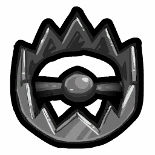
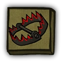

# Trapper

- **Facción:** Town  · *en alcance MVP*
- **Página de la wiki:** Trapper (ToS)

## Ficha

**Clase (alineamiento):**

> Town Protective

**Tipo:**

> Protection
> Investigate
> Non-unique

**Prioridad de acción:**

> 1

**Resumen:**

> You are an intelligent woodsman with a knack for Traps.

**Objetivo:**

> Hang every criminal and evildoer.

**Habilidades:**

> You may set up a Trap at another player's house.

**Atributos:**

> Ignores Detection Immunity
> Attack: Powerful
> Defense: None

**Atributos (texto):**

> Traps take one day to build.
> Traps can be torn down by selecting yourself at night.
> You may only have one Trap out at a time.

**Si hay Godfather/otro objetivo:**

> Set Trap

**Gana con:**

> Town
> Survivor

**Debe matar para ganar:**

> Mafia
> Vampires
> Arsonist
> Serial Killer
> Werewolf
> Coven
> Plaguebearer
> Pestilence
> Juggernaut

**Usos:**

> Unlimited

**Resultado Investigator:**

> Coven Expansion Results
> Your target could be a .

**Resultado Consigliere:**

> Your target is waiting for a big catch. They must be a Trapper.

## Texto completo de la wiki

| 

 | Looking for the Town of Salem 2 role?

This role appears in Town of Salem 1 and 2. For the ToS 2 counterpart, see Trapper.

 | 

 | This page describes content that can only be accessed in the Coven Expansion.

Trapper 

Alignment

 Town Protective

Avatar

Immunities

Ignores Detection Immunity

Attack: Powerful

Defense: None

 Ability Stats

 | Type

 | Priority

 | Protection

Investigate

Non-unique

 | 1

Actions

Target self

Remove Trap

Target other

Set Trap

Investigation Results

 Sheriff

You cannot find evidence of wrongdoing. Your target is innocent or great at hiding secrets!

 Investigator

 Coven Expansion Results

Your target could be a Medium, Janitor, Retributionist, Necromancer, or Trapper.

 Consigliere

Your target is waiting for a big catch. They must be a Trapper.

Game Information

Summary

You are an intelligent woodsman with a knack for Traps.

Abilities

You may set up a Trap at another player's house.

Attributes

 Traps take one day to build.

 Traps can be torn down by selecting yourself at night.

You may only have one Trap out at a time.

Goal

Hang every criminal and evildoer.

 Victory Conditions

 | Wins with

 | Must kill

 | Town

 Survivor

 | Mafia

 Vampires

 Arsonist

 Serial Killer

 Werewolf

 Coven

 Plaguebearer

 Pestilence

 Juggernaut

 | 

 | DISCLAIMER: These stories are fanmade, and are not created or endorsed in any way by BlankMediaGames or Digital Bandidos.

A master engineer. It was his dream for years, he always wanted to be known for building great machinery. He had decided to start small, as building simple hunting traps. However, just after seven days of selling hunting traps, he was employed by the Towns very own Mayor to defend against recent claims of a Coven about. He was recognized for his skill in building traps and was asked to build protective machines, and he has come up with the perfect trap for the job. A good friend of his is familiar with brewing revealing potions, which gave him an idea.

He grabbed a bunch of reveal potions, spare metal, and wood, and starts to bend the materials into the masterpiece he was going to build. The trap being stepped on will use a simple lever mechanism underneath the boards of the home, which will press another mechanism which will force the potion out. The rest was simple, put a bear trap on it. Once they step on it, a gun given to the trapped will be able to shoot them dead. He looked at his creation and smiled. The Mayor has asked for it be set up for him at his home, that's easy enough for the Master Trapper.

After setting up the masterpiece he had created, he left the home of the Mayor and- he got shot as he went through the door. Ambushed, he was shot in his arm, he must have been taller than the Ambusher expected. The Trapper collapsed onto the floor. The Ambusher walked up to him slowly, and strangely enough, the Trapper smiled, and got back up quickly and ran back inside.

The Ambusher, confused from his sudden ecstasy, chased inside after him, and got trapped! The bear trap dug deep into his legs, and the pressure applied to the mechanism below only made it worse. The reveal potion hit his head, breaking into many shards, causing him to scream in pain.

The Ambusher dropped his gun from the pain, and then it was the Trapper's turn to take aim.

Mechanics[]

At Night, you will build a Trap if you do not have one ready to be placed.

If you are roleblocked on the Night you build your Trap, you will not build your Trap that Night. You will have to wait one extra Night to place it, you will still build it if you are controlled though.

On a Night, when you have a Trap ready to be placed, you can choose someone to place your Trap on.

If anyone visits the person you have placed your Trap on, the Trap is triggered and reveals all roles (not names) of people that visited your target.

 Traps will show the true role of a player meaning they are not be deceived by Disguisers, Framers, Hex Masters and Arsonists.

If your target is attacked, your Trap will additionally deal a Powerful Attack to one attacker visiting them (including Vigilantes and Vampire Hunters), and will defend against one direct attack.

 Traps only defend against one direct attacker. This means that Hex Master with Necronomicon can kill through a Trap without triggering it, since they are astral and do not count as a direct attacker. This also means someone with a Trap may still die if they are attacked by multiple roles.

You may only have one Trap on a player at a time; you cannot build more Traps before the current one is triggered or Dismantled.

When you have a Trap placed on someone, you can select yourself to take it and Dismantle it. Dismantling the Trap will prevent it from being triggered that Night but allow you to rebuild it immediately, so you can continue to place a new Trap on the next Night.

If you are converted into a Vampire with a Trap on a target, that Trap will not be removed.

If you are Controlled by the Coven Leader on a Night you may place your Trap, the Trap will be placed on the Coven Leader's secondary target. You will not know upon whom the Trap has been placed and you may not Dismantle it.

You will only visit the night you place your Trap. If your Trap is not triggered the night you place it, you will not visit if it is triggered on any following night.

If Necromancer's Ghoul attacks someone with a Trap on them and no other role visits that player, you will be told that your Trap attacked someone without seeing any roles. This will cause the counter-attack mechanic of the Trap to be removed, however the Trap will remain on the target - this means that future attackers can safely trigger your Trap and kill through it. You also won't be able to Dismantle the trap until it is triggered. This may be a bug.

Due to an inconsistent bug (as of Version 3.3.12), you will sometimes not see reanimated corpses trigger your Traps.

You won't get the feedback that says "Your trap attacked someone!" when saving someone from a Vampire (this is a bug).

When you save someone from a Potion Master or Poisoner, your target will see the Bodyguard-specific message "You were attacked but someone fought off your attacker!" (this is a bug as well).

Strategy[]

The icon that appears next to you on the player list when you are building your Trap

The icon that appears next to you on the player list when your Trap is ready to be placed

The icon that appears next to your Trapped player on the player list when your Trap is placed
 You must wait a Night to build a Trap to use. Therefore, strategize to be able to place Traps that will be effective once they are built.

Two Trappers setting Traps at each other's houses gives both of them Powerful Defense, enabling them to protect each other if they are attacked. The only downside is that they might be destroyed from a normal visitor. As well as this, other important Town roles such as a Jailor or Mayor will not be protected.

Be careful of Ambushers, as they can trigger your Trap without dying (thereby wasting it), and if you visit the same target as them when you set your Trap, they will attack you if you are the only other visitor to their target.

However this confirms that the player you attempted to Trap is most likely not a Mafia role.

Unlike most other Townies, you don't always want to keep an accurate Last Will. Your Traps can still kill people after you die, so misleading evil roles about where your most recent Trap has been placed can sometimes benefit the Town. However, you should still write down the roles of the people who triggered your Traps somewhere, in case a Medium asks you for information

If a non-killing role hits your Trap, it will be expended and reveal the roles that set it off in the process. This has a number of applications:

You can distinguish between Tavern Keeper and Bootlegger claims, along with Investigator and Consigliere claims; all it takes is one entry in their Last Will that hit one of your Traps, and you'll know who they are.

You can precisely identify people's roles in conjunction with a Lookout or Tracker. (Do be aware, however, that if a Lookout watches your target, they will trigger your Trap.)

You can determine what roles are present, narrowing down the list of possible claims. This is of great benefit to the Town, especially in game modes with lots of claim space (such as All Any).

You can also easily identify silent killers such as an Arsonist, a Hex Master, and the Plaguebearer, which would normally take the town quite a while to find without the help of an Investigator.

If an important Townie is confirmed, you should not Trap them if there are other Town Protective roles alive, as it may be triggered by a Bodyguard or Crusader and will be wasted. If you are relatively certain that you are the only Town Protective, you should Trap them.

Ideally, you should try to Trap important Townies (like a confirmed Sheriff) who you think won't be protected by another Town Protective, as the Mafia or any other killing role might try to attack them, having come to the same conclusion as you. This will work best if the Jailor and/or Mayor has revealed themselves, as most, if not all Town Protectives will be on them (Note: keep in mind that the Doctor cannot heal a revealed Mayor, so they will most likely move on to other targets as well).

In many cases, your Trap could be the deciding factor for a Town victory in a 1v1 against several roles, like the Godfather, a Serial Killer a Werewolf, and so on.

Be careful of Crusaders though, as they will usually refrain from protecting either of these as well since they might kill another Town Protective by accident if they do so.

You can determine if a Necromancer exists. If a unique role (that is non- Town) hits your Trap, and no Amnesiacs have remembered that role, a Necromancer is in the game.

Additionally, if you get the message "Your Trap attacked someone.", yet no role was mentioned along with it, then your Trap attacked a Necromancer's Ghoul. This also confirms that the Necromancer has the Necronomicon.

Achievements[]

 | Name

 | Description

 | Merit Points

 | It's a Trap!

 | Win 1 game as a Trapper

 | 20

 | Bear Trap

 | Win 5 games as a Trapper

 | 20

 | What's in the Trap?

 | Win 10 games as a Trapper

 | 40

 | Master Trapper

 | Win 25 games as a Trapper

 | 100

 | Disinfect This Trap

 | See Pestilence visit your target

 | 100

 | Multi-Trap

 | Place 3 traps in a single game

 | 20

 | Anti-Magic Trap

 | Have the Coven Leader trigger your trap

 | 40

 The role will still do their action.

Messages[]

 | 

 | You are building your trap.

 | Your trap is ready to be placed.

 | Your trap is set.

 | Displays at the beginning of the Night, indicating the current state of your Trap.

 | You triggered a trap!

 | Displays at the end of the Night when an attacking role attacks the Trapper's target. 

 | You were attacked but a trap saved you!

 | Displays at the end of the Night when you are attacked but a Trap successfully protects you. 

 | Your trap attacked someone!

 | Displays at the end of the Night for Trappers when their trap attacks someone.

 | Your trap has been triggered by the (Role).

 | Displays at the end of the Night for a Trapper whose target's trap was triggered. The Trapper will receive the role of all the visitors that triggered the trap, even while dead.

 | [They were] killed by a Trapper. or [They were] also killed by a Trapper.

 | Cause of death for attacking roles that trigger a Trap.

Trivia[]

Prior to Version 3.2.3, Trappers could still build their Trap while dueled by a Pirate, which is considered a roleblock.

There is currently a bug where a Trapped target will sometimes receive the Bodyguard protect message INSTEAD of the Trapper protect message. You can see the bug in a video linked here.

History[]

3.3.12

Fixed Lookout seeing reanimated corpses visit twice

3.3.0

The Trapper's "Trap Set" icon will now display on the player where the Trap has been set, instead of on the Trapper themselves.

3.2.3

 Coven Leader with Necronomicon will now die to Trap placed by controlled Trapper on themself.

 Trapper will no longer die to attack if another Trapper has placed a Trap on them.

Dual Trappers can now save each other if they have placed Traps on each other and both are attacked.

 Traps will now be removed when a player that left enters the graveyard.

 Trappers are now role blocked from building their Trap by Pirates.

 Traps placed by a dead Trapper are now removed after triggering.

 Mafioso will now die to Trap placed on another Trapper.

Fixed a very complicated Trapper- Hex Master interaction that could result in a player dying to a Trap that should have previously triggered.

2.5.5.12200

Added a label to visually indicate that a Trap is being built for the Trapper ().

Added a label to visually indicate that a Trap is ready to be placed for the Trapper ().

Added a label to visually indicate that a Trap is set on a player for the Trapper ().

The Trapper's role icon has been changed. Old one was .

Added Trapper's circled role icon ().

2.5.1.10655

Fixed Guardian Angel "target was attacked" feedback.

2.3.2.9706

 Arsonists can no longer die to a Trapper.

2.0.0.6582

Introduced.

 | 

 | 
Roles

 | 

 | 

 | 
 Town

 | 

 | Town Investigative | | Investigator • Lookout • Psychic • Sheriff • Spy • Tracker | | 

 | 

 | Town Killing | | Jailor • Vampire Hunter • Veteran • Vigilante

 | 

 | Town Protective | | Bodyguard • Crusader • Doctor • Trapper

 | 

 | Town Support | | Mayor • Medium • Retributionist • Tavern Keeper • Transporter

 | 
 Mafia

 | 

 | Mafia Deception | | Disguiser • Forger • Framer • Hypnotist • Janitor | | 

 | 

 | Mafia Killing | | Ambusher • Godfather • Mafioso

 | 

 | Mafia Support | | Blackmailer • Bootlegger • Consigliere

 | 
 Coven

 | 

 | Coven Evil | | Coven Leader • Hex Master • Medusa • Necromancer • Poisoner • Potion Master | | 

 | 
 Neutral

 | 

 | Neutral Benign | | Amnesiac • Guardian Angel • Survivor | | 

 | 

 | Neutral Evil | | Executioner • Jester • Witch

 | 

 | Neutral Killing | | Arsonist • Juggernaut • Serial Killer • Werewolf

 | 

 | Neutral Chaos | | Pirate • Plaguebearer/ Pestilence • Vampire

## Implementación

- [ ] Definido en `packages/engine` con su prioridad y facción
- [ ] Acción nocturna (si aplica) validada con objetivos legales
- [ ] Resultado de investigación correcto (Sheriff / Investigator / Consigliere)
- [ ] Condición de victoria y de derrota comprobada en tests
- [ ] Tests unitarios del rol en verde
- [ ] Tarjeta y texto de ayuda en la app
- [ ] Icono e ilustración propia (no el arte de la wiki)
- [ ] Plantillas de narración para sus eventos
