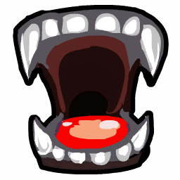
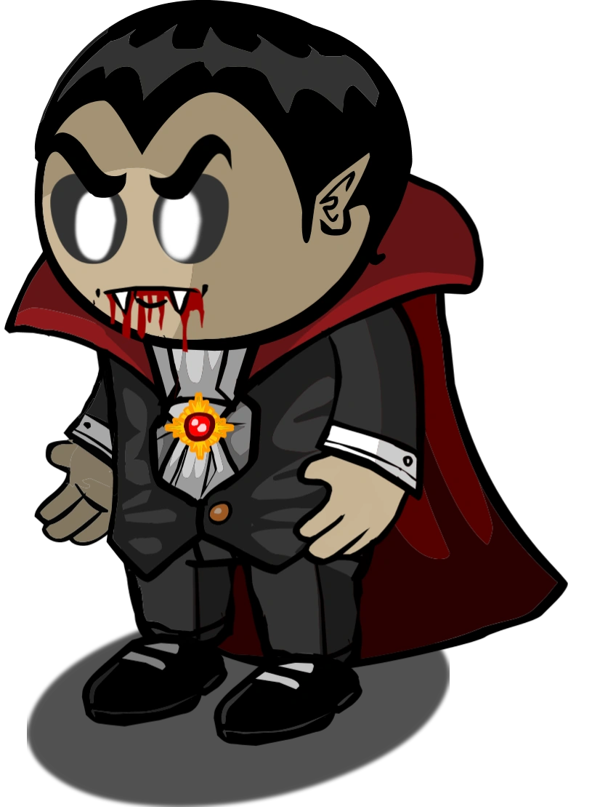

# Vampire

- **Facción:** Neutral  · *fase posterior (referencia)*
- **Página de la wiki:** Vampire (ToS)

## Ficha

**Clase (alineamiento):**

> Neutral Chaos

**Tipo:**

> Special
> Killing
> Non-unique

**Prioridad de acción:**

> 5

**Resumen:**

> You are among the undead who want to turn others at night.

**Objetivo:**

> Convert everyone who would oppose you.

**Habilidades:**

> Convert others to Vampires at night.

**Atributos (texto):**

> Vampires vote at night to bite a target.
> The youngest Vampire will visit the target at night.

**Si hay Godfather/otro objetivo:**

> Attempt to convert the target. If the target cannot be converted or the faction is full, you will attack the target

**Gana con:**

> Vampires
> Survivor
> Witch

**Debe matar para ganar:**

> Town
> Mafia
> Serial Killer
> Arsonist
> Werewolf
> Coven
> Plaguebearer
> Pestilence
> Juggernaut

**Restricciones:**

> 1 night delay between conversions

**Resultado Investigator:**

> Classic Results
> Your target could be a Framer, Vampire, or Jester.
> Coven Expansion Results
> Your target could be a Framer, Vampire, Jester, or Hex Master.

**Resultado Consigliere:**

> Your target drinks blood. They must be a Vampire!

## Texto completo de la wiki

| 

Vampire 

(Vamp)

Alignment

 Neutral Chaos

Avatar

Immunities

None

 Ability Stats

 | Type

 | Priority

 | Restrictions

 | Special

Killing

Non-unique

 | 5

 | 1 night delay between conversions

Actions

Target other

Attempt to convert the target. If the target cannot be converted or the faction is full, you will attack the target

Investigation Results

 Sheriff

You cannot find evidence of wrongdoing. Your target is innocent or great at hiding secrets!

 Investigator

Classic Results

Your target could be a Framer, Vampire, or Jester.

 Coven Expansion Results

Your target could be a Framer, Vampire, Jester, or Hex Master.

 Consigliere

Your target drinks blood. They must be a Vampire!

Game Information

Summary

You are among the undead who want to turn others at night.

Abilities

Convert others to Vampires at night.

Attributes

 Vampires vote at night to bite a target.

The youngest Vampire will visit the target at night.

Goal

Convert everyone who would oppose you.

 Victory Conditions

 | Wins with

 | Must kill

 | Vampires

 Survivor

 Witch

 | Town

 Mafia

 Serial Killer

 Arsonist

 Werewolf

 Coven

 Plaguebearer

 Pestilence

 Juggernaut

 | 

 | DISCLAIMER: These stories are fanmade, and are not created or endorsed in any way by BlankMediaGames or Digital Bandidos.

She had never envisioned her life like this, and she never asked for it. One night, many moons ago she was bit. Merely a lookout at the time, she became much more ever since. To some it would be a blessing, to some a curse, she hadn’t decided yet. But she knew it was a full moon, and she knew that meant she needed to feast. Skulking through the Salem alleyways, the Vampire stumbled across the Escort, paying a visit to a nearby home. The Vampire felt bad for her, but she must feed. She lunged out at the Escort, reaching her prey before it even knew what was going on. Sucking the life out of her, she left the mangled, lifeless corpse in the alley. The Werewolf’s howl could be heard in a nearby home, but that didn’t concern her. She was really on the lookout for the Vampire Hunter, who reeked of garlic. He would be carrying his stakes and holy water, as the Vampires would be active this full moon, but it was for naught. The Hunter was too late to save the Escort, so soon enough he’d have another problem to worry about. She morphed into a bat and took off into the air, looking down on the town below. As the faint beams of the sun began to peek out, she looked down upon all the residents of Salem, her soon to be meals.

Mechanics[]

Basics[]

You may VOTE to bite someone each Night. If you successfully convert someone, you must wait another Night before biting again.

Only Townies (aside from Vampire Hunter), Survivors, Amnesiacs and Jesters can be converted.

If the target is not any of these roles, or you have four (or more in the case of an Amnesiac) Vampires, they will be delivered a Basic Attack instead.

You do not have to wait a Night after converting a 4th member. As soon as there are 4 Vampires alive, the youngest Vampire can deal a Basic Attack immediately the following night.

The youngest Vampire will always visit the selected target for conversion. The selected target is decided at random from all targets voted on by a Vampire; it is not a democratic vote. For example, if two Vampires vote for Samuel Sewall and one Vampire votes for Jonathan Corwin, then Samuel Sewall has a 2/3 chance and Jonathan Corwin has a 1/3 chance to be bitten that evening.

You can only convert players that have no Defense. Biting members of the Mafia, Coven, a Witch (without defense), a Guardian Angel, a Pirate, or any roles with no defense after you have four or more Vampires alive will result in you killing them instead. In turn, you will be able to bite again in this case the next Night.

If you bite the Godfather, a Witch (with defense), or a Neutral Killing, they will be unharmed, but you can bite again the next Night.

If you attempt to convert a Vampire Hunter, they will attack you and be unharmed.

 Vampire Hunters will appear as targets with defense if you try to convert them.

ALL Vampires will see who was visited (and thereby bitten) by the youngest Vampire even if one of them was controlled by a Witch/ Coven Leader.

For Example, if the Vampires all voted to bite Deodat Lawson, the message "The Vampires visited Deodat Lawson last Night." will be shown to all Vampires.

 Crusaders are unable to kill you, but will prevent your target from being converted into a Vampire.

 Ambushers CAN kill you, but they cannot prevent your target from being converted into a Vampire.

If Vampires try to bite a player with defense that was jailed, the Vampires will still be notified about the player’s defense despite their ability failing because of the jail. This is a bug.

 | Bite Effect

 | Affected Role

 | Conversion

 | All Townies (when not using a form of Defense) except Vampire Hunter

 | Survivor when not using a vest

 | Amnesiac

 | Jester

 | Basic Attack

 | All members of the Mafia except the Godfather

 | All members of the Coven

 | Guardian Angel

 | Pirate

 | Witch after they lose their Basic Defense

 | Any role with no Defense after Vampires have four members

 | Immune/No Effect

 | Veteran when on alert

 | Vampire Hunter

 | Anyone being protected by a Town Protective, Jailor, Guardian Angel, or Potion Master

 | Bodyguard using their bullet-proof vest

 | Doctor using their self heal

 | Survivor using a vest

 | Witch while still having Basic Defense

 | Other Vampires

 | Coven Leader wielding the Necronomicon

 | Any Role with Defense

 In addition, this role will kill the youngest Vampire.

The promotion picture for a Vampire in Bat form

 If the Town Protective is a Bodyguard or trapper, they will kill the youngest Vampire. Crusaders and Doctors will only prevent conversion along with other attacks. Other visitors can be attacked however by a Crusader.

 If the immune target is Pestilence or a Werewolf staying home, they will kill the youngest Vampire. Other roles with Defense will only be notified that someone attacked them. Arsonists and the Plaguebearer will know who attacked them due to their passive ability.

 A Medusa who is using a Stone Gaze on the Night they were bitten will die along with the youngest Vampire being stoned.

How Vampires Affect Other Roles[]

A Vampire bite acts as a conversion. If the target cannot be converted, they will deal a Basic Attack to the target. The bite and conversion will fail if:

The target has Basic Defense/was healed by a Doctor. The Vampires will receive a notification of the target having defense.

The target was killed by another role (if conversion was possible), There is no notification for the Vampires in this case, except the number of Vampires not increasing.

The target was protected by a Bodyguard. Additionally, the Bodyguard and youngest Vampire will attack each other.

The target was an alerted Veteran. Additionally, the Veteran will kill the youngest Vampire.

The target is already a Vampire (a Witch/ Coven Leader, or Transporter interfered). Nothing happens.

The target was jailed by the Jailor. As usual, the Vampires will receive a message that their target was jailed.

The youngest Vampire was role blocked. The Vampires will not see who was visited in this case.

Additionally, the following roles have special protections:

The Witch cannot be converted, but their mystical barrier will not function as if they had a form of Defense (you will not get a Defense message). You can use this to identify the Witch in Dracula's Palace or certain Custom role-lists.

The Vampire Hunter cannot be converted, will not die, and will attack the Vampire instead.

If the target was a member of the Mafia or the Coven and lacked Basic Defense, they will die instead of being converted. Additionally, if it was a Medusa using a Stone Gaze, the youngest Vampire will die.

Visiting or being visited by a Vampire Hunter will cause you to die from being staked.

Visiting a Vampire Hunter when they are role blocked will not prevent the Vampire Hunter from killing the youngest Vampire.

Visiting the same target the Vampire Hunter visits on the same Night will not have the youngest Vampire nor the target killed by the Vampire Hunter.

If a Bodyguard protects a Vampire and that Vampire is visited by a Vampire Hunter, the Bodyguard will kill the Vampire Hunter (and die in the process). Note that, provided either of them kept up-to-date Last Wills, this will usually make the Vampire's identity obvious as the Bodyguard's and Vampire Hunter's target HAS to be a Vampire.

If a revealed Mayor is converted into a Vampire, they may be easily exposed as their vote will only count as 1 instead of 3. A converted Mayor can also receive whispers, and everyone else can see this.

If a Vampire Hunter eliminates all Vampires, they will turn into a Vigilante with 1 bullet. Should an Amnesiac remember that they are a Vampire, the Vigilante will not turn back into a Vampire Hunter. They will also be able to be converted into a Vampire.

An Amnesiac can exceed the maximum amount of 4 Vampires by remembering as one when 4 exist.

If there used to be 5 Vampires alive due to an Amnesiac and one of the other Vampires died, the living Vampires will still be able to convert someone and have 5 members again, despite there being 4 Vampires alive.

If a Vigilante is converted the same Night they shoot a Townie, they will not die of guilt.

However, if the Vigilante is bitten the Night after they shoot a Townie, they will die of guilt and will not be converted or shown as a Vampire.

If an Amnesiac is bitten by a Vampire the same Night they try to remember a role, they will become a Vampire. The bite has a higher priority.

If an Executioner's target is converted into a Vampire, the Executioner will remain as his current role with the same target, and will still win if that Vampire is hanged. They can technically be a help to the Town, ironically, since their target was originally a Townie.

If a member of the Mafia other than the Godfather, or a member of the Coven other than the Coven Leader (with the Necronomicon) is bitten, they will die. This does not count as a conversion, so the Vampires can attack again the next Night.

If a Retributionist is converted, they will still see what corpses they used.

Strangely, if a Transporter forces a Vampire to bite another Vampire, there is no message for either party. The Vampire will not receive a message, and the bitten Vampire does not receive a message informing them that they were attacked. The next Night, the Vampires may bite again.

If a Vampire is controlled by a Witch/ Coven Leader, then different things will happen depending on what Night it is.

If the youngest Vampire is controlled on a Night that they cannot convert others, the youngest Vampire can be detected by a Lookout and die to the Werewolf. If any of the other alive Vampires are controlled, none of the Vampires will be detected by the Lookout or die to a Veteran or Werewolf.

If any of the Vampires are controlled on a Night when conversion is possible, they are forced to bite their target. The youngest Vampire will still be the one visiting the second target.

If a Jailor is converted, the Jailor will have access to a Death Note as a Vampire.

If a Vampire bites a Vampire, whether due to Transporter or Witch/ Coven Leader, the attacked Vampire will be unharmed.

Strategy[]

Which Roles to Convert & Not to Convert[]

The most important thing is to find targets you can convert, and to avoid ones you can't. Never try to bite anyone you suspect of having permanent Defense, such as a Serial Killer.

Your highest priority are semi-confirmed Townies that cannot visibly confirm themselves, such as the Retributionist, Spy, Medium, Lookout, Doctor, and Bodyguard. They can lead remaining Townies to false direction. However, if your target is fully confirmed, it is not in your best interest to bite them, as they probably have Town Protective roles or Lookouts on them. Additionally, if the Lookout discovers that a Vampire visited their target (if they hanged the visiting Vampire), then they can instruct a Tavern Keeper or the Jailor to role block the potential youngest. A similar effect can happen with an Ambusher and a Bootlegger.

Around the transition to the late game, it may be helpful to convert semi-confirmed roles such as a Transporter. If someone starts to ask why nobody is role blocked or transported, Vampires may pretend one of them has been blocked or transported. 

Consider converting an outed Jester who has no chance of winning, as it is unlikely that anyone will ever bother them. It would also prevent them from siding with Mafia, or otherwise being an absent vote as Mafia approaches majority.

Converting a known Amnesiac is a bit more risky, as people will start to question why the Amnesiac hasn't chosen a role, making them more likely to be hanged. The main reason to do so is if Mafia is approaching majority, it would prevent them from choosing a Mafia role, outright giving them said majority.

 Town Killing roles, such as the Jailor and Vigilante, are double-edged swords. They can kill Mafia and/or Neutral Killing roles (which are enemies), but they also can kill Vampires. It is advisable to keep them intact until they start to suspect Vampires.

A Sheriff or Investigator can help at finding enemies, and the Sheriff in particular is unable to find Vampires, so it might be best to not bite them until after most of your enemies are dead.

DO NOT convert a revealed Mayor unless you are sure that your team will have the majority afterwards. Their identity can be immediately re-confirmed during the day (by attempting to whisper to the Mayor). The Mayor's vote would be counted as 1 instead of 3, and the Mayor will be able to send and receive whispers again. Their identity can also be tested during the Night phase (the Doctor would be able to heal the previously revealed Mayor who is now a Vampire). The Vampire- Mayor will become easy pickings for any killing or role blocking role, or simply hanged.

It's advisable not to convert a known Veteran, as they may be on alert and the Vampires may lose their youngest. If you do manage it, however, the Veteran can become a valuable Vampire, as no evil wishes to visit a Veteran.

Try to spot and avoid the Vampire Hunter, as the youngest Vampire will be staked after visiting him.

Also try to spot and avoid roles that can't be converted. Some roles can even kill the youngest Vampire, such as a Werewolf who stayed at home, or Pestilence. Do not waste time converting Survivors, Amnesiacs or Jesters either, unless you want to make absolutely sure they will be on your side. Remember that these roles, while likely to side with you, are still wildcards. They can win with anyone, and that "anyone" doesn't have to be you.

Do not attack people who attract too much attention, such as " Jesters" who are acting all too obvious. They may be a Veteran baiting, watched by a Lookout, jailed by a Jailor, or killed. Try to predict who will not be attacked. Visiting completely silent people is not a very good idea either, as they are often enemies who have Basic or higher Defense.

If an Executioner makes their move early and it plays out badly, consider converting their target. Not only does this confirm the new Vampire as a Townie, and they can claim what ever is needed to have someone else hanged. However, if it looks like Town may believe the Executioner, or the " Executioner" might actually be whatever role they are claiming, your new Vampire might be hanged, which both outs the fact that Vampires exist and wastes your Night biting them.

Remember that whoever you convert ends up on your side. Therefore, you should try to convert people who seem alert, intelligent, and serious about the game– both to side with them and to prevent the threat of you becoming enemies. Unlike other roles, Vampires are permitted to choose who their teammates are.

You can bite members of the Mafia to kill them. Doing so doesn't count as a successful conversion, meaning you can bite again immediately the next Night. If you have a confirmed member of the Mafia, you should seriously consider biting them. Things to keep in mind:

If you have four Vampires, you can still bite someone, though this will only deal a Basic Attack Therefore, in a situation where you are dealing with 3 or 4 members of the Mafia, the best way to win is to convert someone else if you can, then bite the next Night. This way, you can kill the Mafia one by one as you hang them and bite them.

Sometimes, revealing one member of the Mafia can allow you to hang others: for instance, if someone is almost hanged, and you suspect that they're a member of the Mafia, you can bite them to kill them, then call for hanges on the people who wouldn't help vote them up. However some smart Townies may call you out as the Vampire who accused them. Keep this in mind, especially if there are Vampire Hunters around and/or the Town is hunting for Vampires in particular.

It's also important to bite the Mafia when there's a danger of them hitting a majority or plurality. As long as your Vampires haven't been exposed, you can always bite Town later, but if the Mafia gets a plurality or, worse, a majority, then it'll be too late for you to win, regardless of who you convert.

The Godfather can be sometimes as dangerous to the Vampires as a Vampire Hunter not only for their basic defense and kill consistency, but also having a reliable team to fall back on (unlike the Serial Killer). However, since they are a threat to the Town as well, you don't need to convince many Townies to hang them even if the Town knows about the existence of your role. There could also be a second Godfather after you hang the first, so keep this in mind.

If both Vampire Hunters and Blackmailers are in the game, it can be very difficult to coordinate or even communicate well with the other Vampires, as the Vampire Hunter can hear your discussions at Night, and the Blackmailer will hear your whispers during the Day. Since you can only kill one of these roles, consider taking out all the Blackmailers so you don't accidentally expose all the Vampires to the Mafia. However a dead Blackmailer may still give whisper info to a Medium and tell them about the Vampires, but it will give you an extra day.

 Bootleggers and Consiglieres can be dangerous threats, as the Consigliere can investigate and discover the Vampires directly, and the Bootlegger can lock down the Vampires by identifying the youngest. Do not bite Townies who claim they've been continually role blocked as biting them will prevent the Vampires from biting again since the youngest will be the Townie that was continually role blocked. Try to find and take out these roles quickly.

If there is an Ambusher in the game, choosing a target to convert can be risky, since the Ambusher can kill the youngest and and ask the Mafia to attack or role-block their original target if they didn't die. Luckily, the Ambusher is very easy to spot as they reveal their name to all visitors. If the youngest doesn't get targeted by the Ambusher, you can write in your Last Will or say who the Ambusher is at Night if there are Vampire Hunters around.

It's generally better to leave Tavern Keepers, Sheriffs, and Spies unturned until the very end. Spies and Sheriffs can only find Mafia, while Tavern Keepers are more likely to find and lock down a solo Mafioso/ Godfather than they are to find your youngest (since they can easily see when a role block results in no Mafia kill, while there's no indication to the Town when they block your youngest). If the Town consists mainly of these, it might be best to shift your focus to the Mafia.

On the other hand, be cautious about deliberately biting members of the Mafia if the Town doesn't yet know Vampires are present, since that will alert them and may lead Investigators to reveal anyone who came up with a Framer / Vampire / Jester (/ Hex Master) result. Also, if there is only one Vampire, you should usually bite to convert, since you're in danger of losing to a random death.

Biting a Survivor can be useful to deny them the option of voting against you, but it's risky - if they use a vest, your Night will be wasted. Biting confirmed Survivors may give you an outlet to find out Mafia members and Neutral Killing roles, as they often whisper to Survivors to side with them. Before biting a Survivor claim, see the Town's attitude towards Survivors, because if you're in an aggressive Town your new Vampire will be hanged, shot or executed, wasting your Night and outing the fact your role is in the game.

A risky, but rewarding bite is biting a Psychic (confirmed or not), since they can still pretend to be Psychic while siding with the Vampires. Psychic claims can use fake good and evil results to trick the Town, but one downside to this is that it forces the converted to guess who is good and who is evil. A wrong guess will likely have the Psychic hanged. This can also be a decent method of bussing, if you are unsure of who to put in your results.

If a Guardian Angel is in the game, consider biting their target. If they're Town, you now have 2 new allies in one Night, and if they're in another evil faction like Mafia and Coven, you'll gain a Survivor. Beware if you've killed their target though, as they may harbor judgement for the death of their target.

The Coven can easily take out your enemies, but they can also take out your team. Some of their roles can also heal, getting in the way of your conversions, and some roles have basic defense, meaning you can't directly kill them.

The Coven Leader can investigate your team, and prevent your bites or kill you by controlling you into a(n) immune/protected target. Once they receive the Necronomicon they are both invulnerable through your bites and can kill your team. They also retrieve the Necronomicon first; take them out quickly, as the risk outweighs the reward.

The Hex Master can help cover your tracks, as anyone they hex shares your investigative results. Once they receive the Necronomicon, however, they become much more of a threat for you, as they can attack your fellow Vampires and can do it without a trace. Make sure to take them out, because if they've hexed too many people they can auto-win for the Coven.

The Necromancer isn’t as dangerous as other Coven members, but keep an eye on the graveyard. They make it harder to take out threats such as the Vampire Hunter and other killing roles, as they can bring them back for a Night and slaughter your team. They can also control dead Town Protectives into preventing your bites, and possibly killing you. With the Necronomicon, they can get rid of your team directly. You have to judge whether they're a high priority target based on what roles are dead.

The Potion Master is a swiss army knife. They can reveal you, kill your teammates and heal your targets. Take them out quickly, as with the Necronomicon they have no limits on what they can do to your team.

The Medusa is only a worry if they don't have the Necronomicon, as they can trade their life for one of your Vampires. Usually, once they obtain the Necronomicon, they may focus on killing other targets, leaving themselves open to be killed, although they can easily target you back.

The Poisoner isn’t very much of a threat, as their ability is easy to negate with a Doctor around, and if targeted without someone to heal you, you still have a Night to strategize. With the Necronomicon, a Doctor can no-longer help you, so make sure that you can keep your team alive when a Poisoner is around. Other than that, they're not dangerous.

The Pirate cannot be converted, so truce with them, as they are basically an attacking Survivor. It's easy to make a deal with a Pirate, as you can regain teammates if they attack them. They can roleblock or call out your team though, so make sure you can trust them. Never allow your youngest to be a sacrifice to a Pirate.

If you're investigated, you might be called out or put under suspicion since there are no Town roles in your result. Claiming to be Framed, Hexed or pretending to be a Jester could work, but if it becomes clear there are many active Vampires, it may be too late.

Identifying the Vampire Hunters[]

The Vampire Hunter is immune to bites and will kill a Vampire if either they visit one, or is visited by one. As a result, it is a high priority to find the Vampire Hunter before they cause any damage.

A good way of getting the Vampire Hunter to reveal early is to make them think there are already 2-3 Vampires in the game. The Vampire Hunter can read anonymous messages sent by the Vampires. On Night 1, create a conversation and play both ends. Talk about how crazy it is that there are already this many Vampires in Night 1. This will put pressure on the Vampire Hunter and they will more often than not share any suspicions they have with the Town, revealing their role to you.

A second method of tricking the Vampire Hunter into revealing his role is to mention a false name in the Night chat. Say something like 'Get Player X' and instead, target someone different. Not only does this portray Player X as suspicious, but also reveals the Vampire Hunter when they report to the town. If the Vampire Hunter does not report his findings and instead finds the target to be human, they might assume that this person is immune and therefore still suspicious.

However, the Vampire Hunter might also assume that the Vampires were tricking him, and not reveal himself, and also be less likely to believe the Vampires in the future.

If you do choose to frame a player, do not bite them, as that player may be hanged or killed by the Jailor or Vigilante.

 Vampire Hunters will use Veteran strategies to bait Vampires. 

If you are converted, it's a good idea to say that your role was something that it wasn't. This can confuse Vampire Hunters.

General Tips[]

If you are alone, it is always a good idea to start up a "conversation" with yourself, especially on Night One. If there are any Vampire Hunters, the conversation may confuse them and cause their playstyle to change drastically, as they may think there are more Vampires than there actually are. This method is amazing for confusion and generally recommended.

It is important to focus on removing anything you can't convert as quickly as you can; if the Mafia has four people, for instance, you could attempt cooperating with the town to eliminate them or try to kill them by yourself. You will need the numbers of the Town or Vampires to hang the Godfather if he does not get killed. Likewise, the Vampire Hunter should be eliminated at all costs as soon as possible.

If you spot a Vampire Hunter, all Vampires should try to lure Town into eliminating him without revealing his true identity. For methods to do so, see tips for Executioner.

Extra caution must be taken, however, since he can simultaneously test and kill you if he suspects you're going after him. Reporting to a Mayor in chat or discussion with the Jailor is the best way to throw him into suspicion.

If you do manage to get a Vampire Hunter killed, immediately claim Executioner by thanking the Town for giving you a win. This will make them less likely to conclude that you're a Vampire. Remember, Vampire Hunters are not unique, so if there's a second one, they're likely to go after anyone who seemed too aggressive about killing the first.

Remember, in tight role lists, only one of you can claim Executioner. If the Vampire Hunter gets hanged, smart Townies could realize that all of you are Vampires, causing your team to get hanged.

Since Vampire Hunters can hear Vampires talking to each other at Night, it's recommended to keep Night discussions to a minimum and, if you absolutely have to, alter your writing style (that includes spelling, usage of emoticons, word capitalization, etc).

You could attempt to trick the Vampire Hunter to visit someone and waste a Night when you’ve converted someone and say “welcome [name]” when it’s really someone else. This may not work on experienced players.

Advanced players may attempt to trick the Vampire Hunter into wasting their visits on non- Vampires. Though Vampire Hunters don't have to reveal to follow up on leads because you can't kill them at Night even if they do, and a successful trick usually isn't going to make them kill an enemy for you.

One very advanced way of tricking the Vampire Hunter is typing in Vampire chat using another player's daily/unique chat pattern. For Example, if they Capitalize Every Beginning Letter, you can trick the VH into wasting a Night, if they pay attention to the chat patterns, that is.

 Vampires could convert someone, and if the conversion was successful, a Vampire will accuse the youngest Vampire of being a Vampire. The youngest Vampire will be hanged, "confirming" a Vampire as a good role and throwing off the Town.

If your target was immune to biting, it's a good idea to write it down in your Last Will. As soon as you die, the suspicion may raise about the person you mentioned as immune-to-biting. This will allow you to help the town hang criminals without revealing yourself, which in turn helps the Vampires. 

The target may be an Executioner. However, unlike the Mafia, it's sometimes dangerous for Vampires to side with an Executioner since his target may be someone who was converted to a Vampire.

If you need to accuse your target immediately during the day, you can pretend to be a Vigilante who couldn't shoot a person at Night and found they were immune. However, this can be dangerous if an existing Mafia or Serial Killer have missed a kill, since the Town might assume you're an evil killer. Regardless of the outcome, this is likely to attract hostile attention from the Mafia. If your target was a Godfather, it is recommended to ask for protection since you are a "confirmed Town role".

If Vampires are not explicitly guaranteed in the role list and you end up as one as a result of an Any or Neutral Chaos entry, try to hide as long as possible. The only true way Town can learn about presence of Vampires is through a Vampire or Vampire Hunter dying or by you biting a member of the Mafia, a member of the Coven, or any Neutral without defense (besides Survivor not vesting, Amnesiac, Jester). If none of these things happen, the Town will generally be unsuspecting until it's too late to resist. An added advantage to this is that Vampire Hunter claims are more likely to be hanged if the Town doesn't believe Vampires are present.

This is even more effective in the Coven Expansion, as the Town may become wary of a Plaguebearer and begin slowing down visits to slow down the speed at which the Plaguebearer will become Pestilence.

If there is actually a Plaguebearer, the Town will be even less likely to believe that there are Vampires. If they become Pestilence, you should continue biting unless you only have 1-2 Vampires left. You may die to Pestilence's rampage, exposing the fact that Vampires exist, but if your youngest dies to Pestilence, your target doesn't die to Pestilence, and they aren't converted, then you should call them out. You'll expose yourself, but at that point, there should be few players left to the point where you can win by converting everyone else. However, remember that your youngest may have been targeted by Pestilence directly and your target could've been a different immune role.

If a player has Basic or higher Defense, say it in the Night chat. The Vampire Hunter will hear this, and you can cooperate with the Town, getting rid of the Mafia/ Coven or Neutral Killing who threaten both of you. Additionally, the Vampire Hunter will probably say this out loud, revealing him so you can avoid him.

If there is no Vampire Hunter alive, it may be in your best interests to form a truce with the remaining Townies to vote off Mafia and Neutral Killing. Being honest with proven Townies and whispering them your role and the name of other Vampires can earn their trust, and most players will gladly take the secondary win as a Vampire over losing as Town. Do NOT let this turn into gamethrowing, though. Townies hanging other Townies to get converted is against the rules.

Keeping a fake Last Will of your converting visits may help if there are inexperienced players in the game. This can lead to hanges against players who could be a nuisance to your team. However, if someone you bite was immune to your attack, then you should generally write their name in your Last Will to hopefully put suspicion on them after you die.

 Vampires have much more leeway to lie in their Last Will than most other roles. Remember, your goal should be to help the Vampires win even after you die. Spreading confusion or getting the Town to focus on hanging non- Vampires helps with this.

You can claim to have been any role you like prior to being turned into a Vampire. Use this to try and get a non- Vampire hanged by putting together a false Last Will with a list of visits. Claim to be a Sheriff and list random non- Vampires as Mafia. Claim to be a Lookout and say you saw a non- Vampire visit someone the Night they were murdered. Claim to be an Investigator and accuse someone of a suspicious role list, like Framer/ Vampire/ Jester (/ Hex Master). You can even claim to have been a Spy.

In fact, simply claiming to be whatever role you were before you were converted (Such as Sheriff or Investigator) is almost always the best way to claim. Continue writing your Last Will you wrote before you were converted and then adding in fake information might work, especially if they hang an evil written in the top of your Last Will.

You can accuse anyone you like of being immune. This has two benefits, since it both throws them under suspicion and makes everyone think that there are fewer Vampires than there really are.

Even very transparent ruses are often surprisingly effective, since if your Last Will implies that a non- Mafia is guilty of something, both the Mafia and the Vampires will use it as an excuse to hang them, and will probably only have to convince one or two Town.

Achievements[]

 | Name

 | Description

 | Merit Points

 | Count Dracula

 | Win 1 game as a Vampire

 | 20

 | Bill Compton

 | Win 5 games as a Vampire

 | 20

 | Night Walker

 | Win 10 games as a Vampire

 | 40

 | Nocturnal

 | Win 25 games as a Vampire

 | 100

 | Blood Lust

 | Convert someone to be a Vampire

 | 20

 | True Blood

 | Convert 3 people to vampires in one game

 | 40

 | Grave Endeavors

 | Win without having any Vampires die

 | 100

Messages[]

 | 

 | You must wait a day to bite a new victim.

 | Displays to Vampires the Night after they successfully convert someone.

 | You may bite a new victim tonight.

 | Displays to Vampires on a Night they can bite.

 | You were attacked by a Vampire!

 | Displays when a non-convertable role is bitten by a Vampire, or when any role with no defense is bitten when the Vampires have at least four members.

 | You were bitten by a Vampire!

 | Displays to a convertable role bitten when Vampires do not have four members. The target will then immediately become a Vampire.

 | The Vampires visited (Player) last night.

 | Displays to all Vampires at the end of the night, indicating who the Vampires visited that night.

 | [They were] bitten by a Vampire. or [They were] also bitten by a Vampire.

 | Cause of death for a player who was attacked by a Vampire. This can only happen if you are a non- Townie (that isn't Jester/ Amnesiac/ Survivor not using vest) or if the Vampires have 4 or more members alive currently.

Trivia[]

The Vampire role is based on the Cultist role from StarCraft 2 Mafia.

Prior to Version 1.5.11.5389, all members of the Mafia were immune to Vampires.

Prior to Version 2.0, Vampires were able to convert Survivors and Bodyguards through their vests.

Prior to Version 2.4, Vampires were unable to bite targets when four or more Vampires existed.

An Amnesiac that becomes a Vampire can exceed the 4-player limit.

 Vampire is the only Neutral Chaos role that is not exclusive to the Coven Expansion.

 Vampire is the only Neutral role that can communicate with each other during the Night.

 Vampire is the only role that can directly change the goal of another player. 
A game showing that there can be more than four Vampires with certain role lists

In Coven Custom, if you create a role list with 4 Vampires, a Plaguebearer, and a Pirate, plus any number of Neutral Chaos, all of those Neutral Chaos slots will be Vampires. This can exceed the 4 Vampire limit.

This happens because the Neutral Chaos alignment only has 3 roles in it: Pirate, Plaguebearer, and Vampire. Since Pirate and Plaguebearer are both unique, the game is forced to add Vampires in all Neutral Chaos slots, exceeding the normal limit of 4 Vampires.

History[]

3.2.4

Temporary Defense given by certain roles through game mechanics now give attackers the message "Your target's defense was too strong to kill.".

3.2.3

 Trapper will no longer die to Attack if another Trapper has placed a Trap on them.

Dual Trappers can now save each other if they have placed Traps on each other and both are attacked.

3.1.14

Added Tavern Keeper vs. Vampire stalemate detector.

2.5.5.12200

Added a label to visually indicate youngest Vampire for the Vampires ().

For Vampires, the youngest Vampire is now shown as "(Vampire)" instead of "(Youngest)".

The Vampire's role icon has been changed. Old one was .

Added Vampire's circled role icon ().

2.5.1.10655

Fixed Guardian Angel "target was attacked" feedback.

2.4.0.10404

 Vampires are now able to vote to bite a target while there are four or more Vampires alive, dealing an Attack.

2.0.0.6501

 Vampires can no longer convert through a used vest.

1.5.0.3431

 Vampire can now successfully kill Mafia members with no Defense when attempting to bite them instead of the Mafia member being immune and the Vampire receiving the message "Your target was immune to your attack!".

1.3.0

Introduced.

 | 

 | 
Roles

 | 

 | 

 | 
 Town

 | 

 | Town Investigative | | Investigator • Lookout • Psychic • Sheriff • Spy • Tracker | | 

 | 

 | Town Killing | | Jailor • Vampire Hunter • Veteran • Vigilante

 | 

 | Town Protective | | Bodyguard • Crusader • Doctor • Trapper

 | 

 | Town Support | | Mayor • Medium • Retributionist • Tavern Keeper • Transporter

 | 
 Mafia

 | 

 | Mafia Deception | | Disguiser • Forger • Framer • Hypnotist • Janitor | | 

 | 

 | Mafia Killing | | Ambusher • Godfather • Mafioso

 | 

 | Mafia Support | | Blackmailer • Bootlegger • Consigliere

 | 
 Coven

 | 

 | Coven Evil | | Coven Leader • Hex Master • Medusa • Necromancer • Poisoner • Potion Master | | 

 | 
 Neutral

 | 

 | Neutral Benign | | Amnesiac • Guardian Angel • Survivor | | 

 | 

 | Neutral Evil | | Executioner • Jester • Witch

 | 

 | Neutral Killing | | Arsonist • Juggernaut • Serial Killer • Werewolf

 | 

 | Neutral Chaos | | Pirate • Plaguebearer/ Pestilence • Vampire

## Implementación

- [ ] Definido en `packages/engine` con su prioridad y facción
- [ ] Acción nocturna (si aplica) validada con objetivos legales
- [ ] Resultado de investigación correcto (Sheriff / Investigator / Consigliere)
- [ ] Condición de victoria y de derrota comprobada en tests
- [ ] Tests unitarios del rol en verde
- [ ] Tarjeta y texto de ayuda en la app
- [ ] Icono e ilustración propia (no el arte de la wiki)
- [ ] Plantillas de narración para sus eventos
