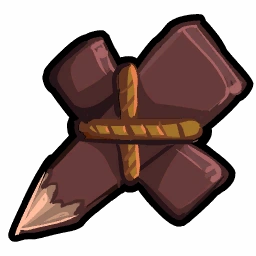
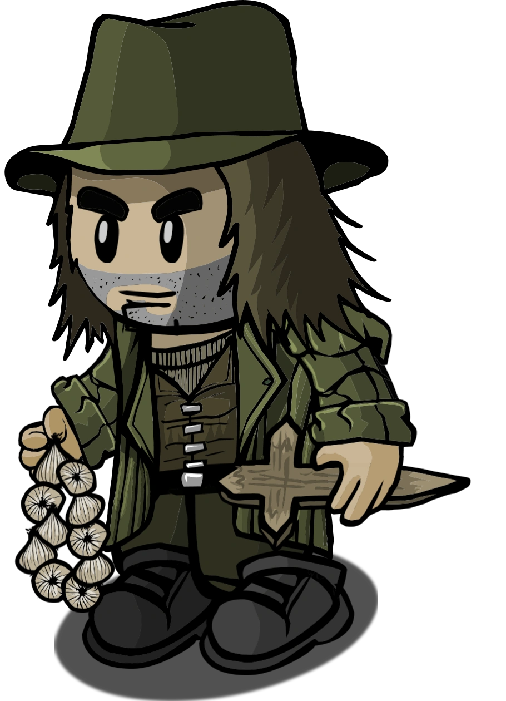

# Vampire Hunter

- **Facción:** Town  · *en alcance MVP*
- **Página de la wiki:** Vampire Hunter

## Ficha

**Clase (alineamiento):**

> Town Killing

**Tipo:**

> Killing
> Non-unique

**Prioridad de acción:**

> 5

**Resumen:**

> You will do whatever it takes to eliminate the Vampires.

**Objetivo:**

> Hang every criminal and evildoer.

**Habilidades:**

> Check for Vampires each night.

**Atributos:**

> Attack: Basic
> Defense: None (Basic against Vampires)

**Atributos (texto):**

> If you visit a Vampire you will attack them.
> If a Vampire visits you, you will attack them.
> You can hear Vampires at night.
> If all the Vampires die you will become a Vigilante with one bullet.

**Especial:**

> Can read Vampire chat.
> becomes Vigilante when all Vampires are dead.

**Gana con:**

> Town
> Survivor

**Debe matar para ganar:**

> Vampires
> Mafia
> Arsonist
> Serial Killer
> Werewolf
> Witches/Coven
> Plaguebearer
> Pestilence
> Juggernaut

**Usos:**

> Unlimited, but can only attack Vampires

**Resultado Sheriff:**

> You cannot find evidence of wrongdoing. Your target is innocent or great at hiding secrets!

**Resultado Investigator:**

> Classic Results
> Your target could be a .
> Coven Expansion Results
> Your target could be a .

**Resultado Consigliere:**

> Your target tracks Vampires. They must be a Vampire Hunter!

## Texto completo de la wiki

Vampire Hunter 

Alignment

 Town Killing

Avatar

Immunities

Attack: Basic

Defense: None (Basic against Vampires)

Special

Can read Vampire chat.

becomes Vigilante when all Vampires are dead.

 Ability Stats

 | Type

 | Priority

 | Killing

Non-unique

 | 5

Investigation Results

 Sheriff

You cannot find evidence of wrongdoing. Your target is innocent or great at hiding secrets!

 Investigator

Classic Results

Your target could be a Survivor, Vampire Hunter, or Amnesiac.

 Coven Expansion Results

Your target could be a Survivor, Vampire Hunter, Amnesiac, Medusa, or Psychic.

 Consigliere

Your target tracks Vampires. They must be a Vampire Hunter!

Game Information

Summary

You will do whatever it takes to eliminate the Vampires.

Abilities

Check for Vampires each night.

Attributes

If you visit a Vampire you will attack them.

If a Vampire visits you, you will attack them.

You can hear Vampires at night.

If all the Vampires die you will become a Vigilante with one bullet.

Goal

Hang every criminal and evildoer.

 Victory Conditions

 | Wins with

 | Must kill

 | Town

 Survivor

 | Vampires

 Mafia

 Arsonist

 Serial Killer

 Werewolf

 Witches/ Coven

 Plaguebearer

 Pestilence

 Juggernaut

 | 

 | DISCLAIMER: These stories are fanmade, and are not created or endorsed in any way by BlankMediaGames or Digital Bandidos.

The Vampire Hunter was a normal person like everybody else, there were always rumors of Vampires, he did not believe in them, later in in the year he heard of people acting strange, being incredibly sensitive to light, he then started hearing about disappearances and then actually about vampires taking over towns, obviously no he knew they were real, there were so many towns people, good people, taken their lives by force and making their lives into a race for who get’s blood and who doesn’t. “if this continues there will be more vampires than they can feed on, all the people on earth will be vampires and starve to death” he said to himself. Others have tried to kill vampires with normal guns, they failed. he studied the history of vampires, their weaknesses and strengths, he packed up and moved from his home, and traveled to towns that were overtaken by vampires, armed with bag of garlic, holy water, a wooden stake, a silver knife, he was going to end the vampire bloodline, before it was too late.

Mechanics[]

Basics[]

Check a target each Night. If they are a Vampire, you will deal a Basic Attack against them.

You have Basic Defense against Vampires.

If a Vampire attempts to convert you, you will stake them and will not be harmed. This will happen even if you are role blocked.

If you attempt to stake a Vampire who is being protected by a Bodyguard, both you and the Bodyguard will die.

If you check a person who is visited by a Vampire, you cannot stop a possible conversion, nor will you kill the visiting Vampire.

You can read the Vampire chat during the night.

There will always be at least one Vampire in the game if there is a Vampire Hunter at the beginning of the game.

Turning into a Vigilante[]

Once all Vampires are dead, you will become a Vigilante. However, multiple things are changed:

You only have one bullet instead of three.

You are permanently stuck as a Vigilante. This means if an Amnesiac becomes a Vampire or a Necromancer uses a dead Vampire to convert someone, you will not turn back into a Vampire Hunter.

Similar to a Plaguebearer or Mafioso, you will become a Vigilante during the Day if the last Vampire is hanged.

Strategy[]

If you become a Vigilante, follow the strategies on the Vigilante page, but remember that you only have one bullet.

Check down the list, and then if you end up checking everyone, check them all again. They might have been turned since you checked them, perhaps even as you were checking them.

If the Vampires are talking, pay attention to what they are saying. Vampires may lie to fool you since the worst they can generally accomplish is making you waste your visits.

If they mention that someone is immune to their bite, it's most likely true. Write it down in your Last Will, but remember that calling them out reveals you as well.

If the Vampires argue over who to convert or discuss their victims, this can often reveal who they've turned into a Vampire. This is a much more common mistake than you would think, since Vampires need to vote on who to convert. Pay attention to what they say; even if they don't name exact names, you can often figure out what they're arguing over based on context. Be wary of possible baits that the Vampires may say to waste your visit on checking someone.

Try to figure out talking Vampires by comparing their writing style to that of players during the Day. Pay attention to the usage of emoticons, word capitalization, spelling, ETC.

If the Vampires stop talking after several nights of discussions, it may mean that there is only one Vampire left or they want to trick you.

Scum reading is one of the most important things to do as this role. You have plenty of opportunities to do so, remember to take advantage of it. If words only one or two players in the match use, such as 'Lit', show up in the Vampire chat, try staking them. It'll often turn out they were a Vampire.

Try to figure out who the Vampires are most likely to turn, such as revealed Mayors without Bodyguards on them.

You can whisper a revealed Mayor during the day to see if they have been converted.

Look over the list of people to convert on the Vampire page, and follow that yourself when deciding who to investigate.

 Vampires can only convert roles without Defense. If you suspect someone falls into any of these categories, skip them. Even if it's not true, they're less likely to be Vampires, since the Vampires will probably have reached the same conclusion as you and avoided visiting them.

Anyone who was confirmed as a Townie could be possibly converted by a Vampire, especially if they are an important role, so leave no stone unturned.

 Jesters, Survivors, and Amnesiacs are the only Neutral roles that can be converted into Vampires. It is generally unwise to attempt to convert these roles as they can already be the Vampire's ally. Targeting players who are confirmed Townies is almost always the best decision.

If a revealed Mayor has only one vote and can whisper or is receiving whispers, this means they've been turned into a Vampire. (However, in this case, the Town will often notice and hang them for you, so you will not have to stake them) Conversely, as long as the Mayor has three votes, and can't send or receive whispers, they are not a Vampire. A good way to always be sure is attempting to whisper to the Mayor during each start of the day. If you successfully whisper to them, then they were converted into a Vampire.

Pay particular attention to the Last Wills of Lookouts. Anyone who was visited by a confirmed Vampire may have been converted into a Vampire. (And if you are certain the visit was when the visitor was already a Vampire and they weren't turned into a Vampire themselves, then they are likely evil and should be called out.)

Try and bait Vampires in:

"I hate my role, can a Vampire convert/bite me?" sometimes works, although experienced players may suspect you to be a Vampire Hunter, in which case they are less likely to attempt to bite you.

Claiming Survivor or acting like a Jester can occasionally lure a Vampire into trying to bite you. However, it carries a high risk of getting you hanged by the Town, executed by the Jailor, or shot by a Vigilante. Therefore, this is best saved until near the end of the game when it's possible evil roles are near a majority.

Claiming Survivor near the very last night (ideally at the very end of the Day when there's not enough time for you to be hanged) can sometimes swing a Town victory by luring the Vampires to convert you while making the Mafia ignore you and target the Vampires instead, hopefully turning you into a Vigilante in time to swing the game with your final bullet.

Claiming Medium Day 1 and asking for dead players to not leave can lure a Vampire into trying to bite you. You appear town-aligned without sounding overly forced, unlike more suspicious Day 1 town claim such as Investigator which has little reason to claim Day 1.

Remember that this may have the opposite effect, as an Investigator may visit you and 'confirm' you as a Survivor, which may make the Vampires not attempt to bite you, as you are already their ally, and they may waste a night biting you when you use a vest.

A Consigliere may pose as an Executioner claiming Investigator to get you killed, as even if you can get rid of a huge threat to the Mafia, you are still a Townie.

A Bodyguard will kill you (and you will kill them) if you visit a Vampire they're protecting. However, in this case, whoever you were trying to stake is confirmed as a Vampire (since Vampire Hunters cannot attack non- Vampires). Always list your visits in your Last Will, especially your most recent one, so people will know who the Vampire is in that situation.

Unless, of course, the person that you targeted was transported, in which case the vampire is the person who they were transported with.

A Doctor can heal Vampires you tried to stake. If you get a message saying you staked a Vampire who visited you, but no Vampire shows up dead the next Day, it means a Doctor accidentally healed a Vampire. You may want to reveal to alert the Town to this, though most Doctors will be reluctant to reveal themselves just to expose a Vampire. You could also try targeting the Vampire again (assuming you targeted them rather than them visiting you). However, the Doctor may heal them a second time.

On the other hand, if you reveal that a Vampire has been healed, the Doctor is much less likely to heal them for another night.

Note that the Doctor does not get a "target was attacked" message when saving a Vampire from your attack, this is a bug.

When you become a Vigilante, consider not revealing this fact until you use your bullet. While Vampire Hunters are harmless to everyone but Vampires, Vigilantes present a direct threat to the Mafia and Witches/ Coven, all of which will hunt for you as soon as they know your new role. You may not want to shoot right away, so it's better to lull evil roles into thinking you are still a Vampire Hunter. However, if a Consigliere, Potion Master, or Investigator checked you and it became public, shoot the next night.

Remember that your ultimate goal is for the Town to win, not simply to kill the Vampires. This means that under some circumstances (when you need the Vampires' votes in order to keep the Mafia from getting a majority), you might be better off waiting to kill confirmed Vampires.

 Vampires will occasionally try to be "merciful" by biting surviving Townies so everyone can win together. You can exploit this kindness to eliminate them even when outnumbered four-to-one. Since there is a maximum of four Vampires, they'll have to hang one of their own and reduce their numbers to three to free up a spot to convert you. If you then stake anyone other than the youngest on the night they attempt to convert you, you can eliminate two Vampires in one night, leaving the last one remaining without the majority needed to hang you and letting you stake them on the following night. Note that this requires both knowing what night they'll attempt to convert you and either luck or knowledge of who the youngest Vampire is; if you're planning to use this strategy, you might want to discreetly probe for that information.

If the existence of a Vampire Hunter is confirmed, whether by you killing a Vampire or it being guaranteed in the role list, this becomes impossible unless a Janitor or Medusa successfully used their ability, as they will realize that based on the graveyard, you must be the Vampire Hunter.

If a player was Cleaned or Stoned, the Vampires are still likely to be hesitant to give mercy if your existence was previously confirmed. Having a fake claim can help, but still remains extremely difficult.

If someone claims a Town Investigative role and makes an accusation against someone that turns out to be incorrect, but the target is actually someone with Basic Defense, it is very likely that the accuser was a Vampire who incorrectly guessed at their target's role because they were unable to turn them with a bite. You should generally try and stake the accuser the next night.

If you are in the Mafia, it may be worth letting Vampire Hunters survive. After all, Vampires are a large threat to Mafia. However, you must careful not to let the Vampire Hunter turn into a Vigilante and shoot you.

If you are a Consigliere and find a Vampire, it may be beneficial in the long run to whisper the Vampire Hunter the name of the Vampire, but don’t be upfront about your role, unless you already have a solid claim as Investigator.

Note that Vampire Hunter is not a unique role; while it is somewhat rarer than other roles due to the fact that it requires Vampires, it's as common as any other once you know Vampires are present. In particular, this means that you shouldn't necessarily be suspicious of other Vampire Hunter claims, provided they fit the role list.

On the other hand, you can sometimes catch fake Vampire Hunters based on when you turn into a Vigilante since they should change at the same time - if there's another Vampire Hunter claim, try asking them if the Vampires are all dead yet or not. If you do change roles, and there's a Vampire Hunter claim you're uncertain about, try waiting to see if they say something first.

You should always try to pair up with any Lookouts. This can make an easy and powerful combo in finding Vampires. The Lookout should watch people who the Vampires are likely to convert and you can stake suspicious people. This way, if someone you suspect being a Vampire visit the Lookout’s target, it’s likely you have got two confirmed Vampires.

Claiming to be a Survivor may work to prevent the Mafia or a Neutral Killing from killing you, especially if an Investigator investigates you and publicly reveals your results. However, you may end up being killed by a Jailor or Vigilante, as evil roles tend to claim Survivor, or you may be hanged by the Town.

If you are voted up or are Jailed, reveal your role. The Vampires will know who you are and avoid you, and also refrain from using the Vampire chat, but it's better than losing a Townie, especially one that can effectively deal with Vampires. In the case of a Jailor, it's even safer to reveal, as only the Jailor will know who you are. Even if they get bitten, if they choose to share it with the other Vampires through the Vampire chat, you'll be able to stake them.

Achievements[]

 | Name

 | Description

 | Merit Points

 | Blade

 | Win 1 game as a Vampire Hunter

 | 20

 | Abraham Lincoln

 | Win 5 games as a Vampire Hunter

 | 20

 | Van Helsing

 | Win 10 games as a Vampire Hunter

 | 40

 | Alucard

 | Win 25 games as a Vampire Hunter

 | 100

 | Stake the Damned

 | Stake a Vampire

 | 20

 | Buffy the Vampire Slayer

 | Kill 3 Vampires in one game

 | 100

 | Constantine

 | Kill 2 Vampires in one night

 | 40

 The youngest Vampire visits you while you visit a Vampire (can be the same Vampire).

Messages[]

 | 

 | Vampire: Sample message.

 | Displays for the Vampire Hunter when a Vampire talks in the Vampire Chat.

 | You were staked by a Vampire Hunter!

 | Displays at the end of the night when a Vampire Hunter stakes a Vampire.

 | You staked the Vampire that attacked you!

 | Displays at the end of the night to a Vampire Hunter when a Vampire attempts to convert them.

 | You were staked by the Vampire Hunter you visited!

 | Displays at the end of the night to a Vampire when they try to convert a Vampire Hunter.

 | All of the Vampires are gone. You are now a Vigilante!

 | You only have 1 bullet left.

 | Displays to a Vampire Hunter at the end of the night when the last Vampire dies.

 | [They were] staked by a Vampire Hunter. or [They were] also staked by a Vampire Hunter.

 | Cause of death for a Vampire who was attacked by a Vampire Hunter.

Trivia[]

Prior to Version 2.0, Vampire Hunters had Death Notes. This allowed them to be easily confirmed by revealing who they are in their Death Note.

If an Amnesiac becomes a Vampire Hunter, they will remain a Vampire Hunter for the rest of the game, unless another Amnesiac becomes a Vampire and dies. This may be a bug.

There was a bug where the Vampire Hunter was referred to as a unique role and was unable to be remembered by an Amnesiac.

While Jailed, a Vampire Hunter could stake any Vampires who attempted to convert them.

 Vampire Hunter is commonly mistaken as a Unique Role because it requires Vampires, and usually only one Vampire Hunter appears in a Vampire game.

 Vampires who have left the game are considered dead when the game decides whether or not to make you become a Vigilante even if the Vampire who left didn't actually die yet.

History[]

3.2.4

Temporary Defense given by certain roles through game mechanics now give attackers the message "Your target's defense was too strong to kill.".

3.1.13

Fixed the Chat filter potentially showing misleading information to Vampire Hunters.

For the Vampire Hunter, Vampire chat now has a unique style.

2.5.5.12200

The Vampire Hunter's role icon has been changed. Old one was .

Added Vampire Hunter's circled role icon ().

2.5.1.10655

Fixed Guardian Angel "target was attacked" feedback.

2.0

 Vampire Hunters no longer have a Death Note.

1.3.0

Introduced.

 | 

 | 
Roles

 | 

 | 

 | 
 Town

 | 

 | Town Investigative | | Investigator • Lookout • Psychic • Sheriff • Spy • Tracker | | 

 | 

 | Town Killing | | Jailor • Vampire Hunter • Veteran • Vigilante

 | 

 | Town Protective | | Bodyguard • Crusader • Doctor • Trapper

 | 

 | Town Support | | Mayor • Medium • Retributionist • Tavern Keeper • Transporter

 | 
 Mafia

 | 

 | Mafia Deception | | Disguiser • Forger • Framer • Hypnotist • Janitor | | 

 | 

 | Mafia Killing | | Ambusher • Godfather • Mafioso

 | 

 | Mafia Support | | Blackmailer • Bootlegger • Consigliere

 | 
 Coven

 | 

 | Coven Evil | | Coven Leader • Hex Master • Medusa • Necromancer • Poisoner • Potion Master | | 

 | 
 Neutral

 | 

 | Neutral Benign | | Amnesiac • Guardian Angel • Survivor | | 

 | 

 | Neutral Evil | | Executioner • Jester • Witch

 | 

 | Neutral Killing | | Arsonist • Juggernaut • Serial Killer • Werewolf

 | 

 | Neutral Chaos | | Pirate • Plaguebearer/ Pestilence • Vampire

## Implementación

- [ ] Definido en `packages/engine` con su prioridad y facción
- [ ] Acción nocturna (si aplica) validada con objetivos legales
- [ ] Resultado de investigación correcto (Sheriff / Investigator / Consigliere)
- [ ] Condición de victoria y de derrota comprobada en tests
- [ ] Tests unitarios del rol en verde
- [ ] Tarjeta y texto de ayuda en la app
- [ ] Icono e ilustración propia (no el arte de la wiki)
- [ ] Plantillas de narración para sus eventos
