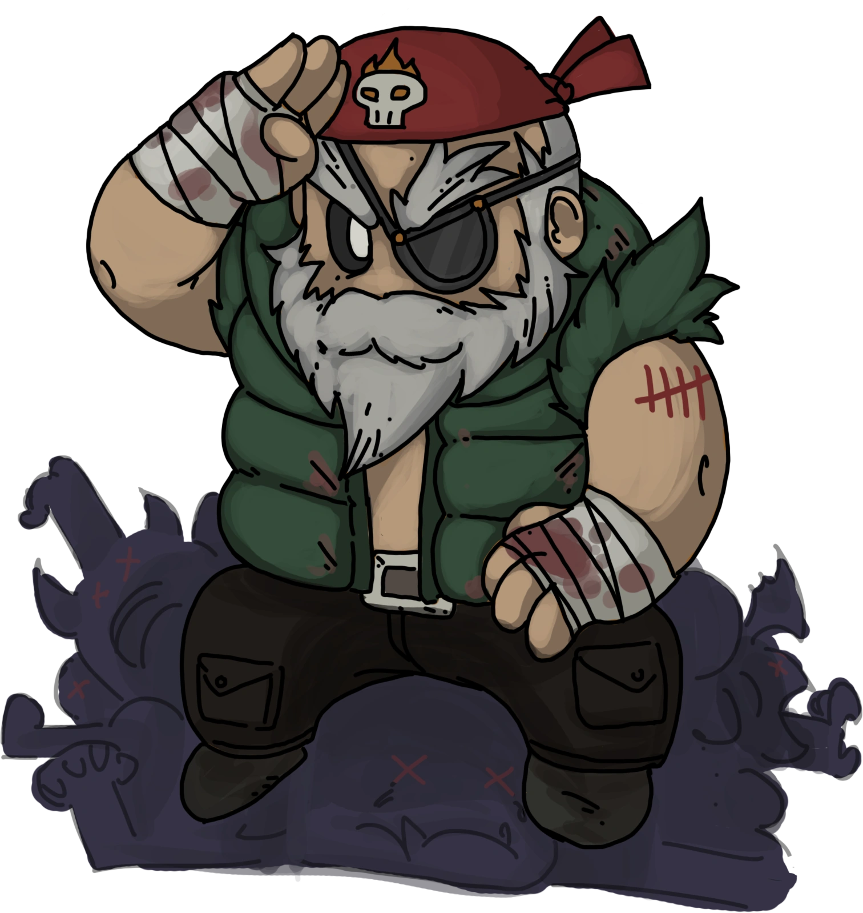

# Veteran

- **Facción:** Town  · *en alcance MVP*
- **Página de la wiki:** Veteran (ToS)

## Ficha

**Clase (alineamiento):**

> Town Killing

**Tipo:**

> Killing
> Unique

**Prioridad de acción:**

> 1 (highest)

**Resumen:**

> You are a paranoid war hero who will shoot anyone who visits you.

**Habilidades:**

> Decide if you will go on alert.

**Atributos:**

> Roleblock Immunity
> Control Immunity
> Attack: Powerful
> Defense: None (Basic while on alert)

**Atributos (texto):**

> While on alert you gain Basic Defense.
> While on alert, you will deliver a Powerful attack to anyone who visits you.
> You can only go on alert 3 times.
> You cannot be role blocked.

**Especial:**

> Unique Role

**Gana con:**

> Town
> Survivor

**Debe matar para ganar:**

> Mafia
> Vampires
> Arsonist
> Serial Killer
> Werewolf
> Witches/Coven
> Plaguebearer
> Pestilence
> Juggernaut

**Usos:**

> 3

**Resultado Sheriff:**

> You cannot find evidence of wrongdoing. Your target is innocent or great at hiding secrets!

**Resultado Investigator:**

> Classic Results
> Your target could be a .
> Coven Expansion Results
> Your target could be a .

**Resultado Consigliere:**

> Your target is a paranoid war hero. They must be a Veteran.

## Texto completo de la wiki

| 

 Veteran 

Alignment

 Town Killing

Avatar

Immunities

 Roleblock Immunity

 Control Immunity

Attack: Powerful

Defense: None (Basic while on alert)

Special

 Unique Role

 Ability Stats

 | Type

 | Priority

 | Killing

Unique

 | 1 (highest)

Actions

Target self

Deal a Powerful attack to visitors and gain Basic Defense

Investigation Results

 Sheriff

You cannot find evidence of wrongdoing. Your target is innocent or great at hiding secrets!

 Investigator

Classic Results

Your target could be a Vigilante, Veteran, Mafioso, or Ambusher.

 Coven Expansion Results

Your target could be a Vigilante, Veteran, Mafioso, Pirate, or Ambusher.

 Consigliere

Your target is a paranoid war hero. They must be a Veteran.

Game Information

Summary

You are a paranoid war hero who will shoot anyone who visits you.

Abilities

Decide if you will go on alert.

Attributes

While on alert you gain Basic Defense.

While on alert, you will deliver a Powerful attack to anyone who visits you.

You can only go on alert 3 times.

You cannot be role blocked.

Goal

Hang every criminal and evildoer.

 Victory Conditions

 | Wins with

 | Must kill

 | Town

 Survivor

 | Mafia

 Vampires

 Arsonist

 Serial Killer

 Werewolf

 Witches/ Coven

 Plaguebearer

 Pestilence

 Juggernaut

 | 

 | DISCLAIMER: These stories are fanmade, and are not created or endorsed in any way by BlankMediaGames or Digital Bandidos.

The Veteran laughed in the darkness. Afraid of the dark, no way. Afraid of the monsters in the bed? The man with his hand on trigger of a gun laughed nervously. He wasn't scared of anything he had told himself. Sure he was a past war time hero, but he was so used to ambushes and life threatening situations that it made the man simply neurotic. His heart pulsed with ever sound that was made and just a simply shadow would make him pull the trigger. Yes, he was this scared of death. How could he not, seeing so many die in horrible ways. All he knew from being kidnapped and miraculously escaping his enemies was that there was no mercy. His thoughts suddenly stopped at the sound of a door creaking open. Sweat began to show on his face as the steps started to become louder as it headed his way. Heart pounding like crazy, he lifted the gun up to the door. Suddenly the door opened and he pulled the trigger. The stranger had dropped and so had his sense of worry. It was done. It was over.

Mechanics[]

The Veteran is a Unique Role: meaning there can only be one in a match.

You may choose to go on Alert each Night, three times in total. You will deal a Powerful Attack to all your visitors and will gain Basic Defense for the Night.

In the Town Traitor game mode, the Veteran loses their Alerts if the Traitor is the only evil left, unless the Veteran is the Traitor.

Roles that visit you will still (attempt to) use their action on you. (e.g a Blackmailer will still blackmail you, a Transporter will still transport you, and a Werewolf will still kill you.)

However, a Vampire can't convert you while on Alert.

You are unable to be Roleblocked.

A Witch or Coven Leader cannot force you to Alert or prevent you from doing so.

If an Arsonist Douses you, you will remain Doused the rest of the game, being susceptible to ignition.

If a Transporter Transports you, it will still follow through. This means whoever was intending to visit you will be saved, while anyone who was visiting the other person transported will die from you.

If a Werewolf or Juggernaut attacks you while Alerting both you and the killer will die.

Strategy[]

The Veteran can be a tricky role to master since you only have 3 Alerts and, during those Alerts, you can do more harm than good.

The Veteran is arguably one of the most powerful Town roles, with the ability to defend themselves at Night with a well-placed Alert that ignores Basic Defense.

As a Veteran, it's generally harmful to ask for Town Protectives or Lookouts to protect you, since, while this may attract evil attention, it can be harmful to the Town, and it will most likely get a few of the aforementioned roles killed, perhaps without making any progress at all.

What's more, the fear of a Veteran doing this might cause roles like the Bodyguard to avoid 'TP/LO' claims unless they actually claim something like Jailor or Mayor, which is harmful to the town.

The trickiest part of being a Veteran is anticipating if and when you will be attacked and not wasting your Alerts for nothing.

If you have a name that stands out or is controversial, people may try to Attack you early in the game.

However, keep in mind that you won't know what role you will get. You can increase your chances of getting Veteran by using a Veteran Scroll, but it would still not be guaranteed to roll Veteran.

While choosing your name, do not break the rules.

If you have chosen a terrible or controversial name that sticks out, you can take advantage of this fact and choose to reveal that you are the Veteran after the first Night. Use the usual tactics to get yourself targeted on Night 1. You can engage in role collection similar to a Mayor by whispering to other players stating that you're the Veteran at the start of the day before deaths are announced. You can then actively whisper to each player in the game demanding their roles. You are completely protected by attacks for the first three nights, should you choose to use up all your Alerts at once. You will also grab a lot of attention allowing other Townies such as Town Investigative roles to become hidden among the attention you gain. This tactic heavily relies on how much trust you gain in the Town (for example, people will have very little faith in you if you kill a lot of Townies on the first Night). People will become more distrustful of your legitimacy as you cannot be confirmed as easily as a Veteran. Members of the Mafia will become more tempted to attack you to silence you the more initiative you take during the day.

If you are dueled by the Pirate, you can still Alert. This is guaranteed to take out the Pirate, even if you lose the duel, since you're immune to the role blocking effect of their ability. However, since they deal a Powerful Attack and the defense of your Alert only grants Basic Defense, it won't save you. Most of the time, killing the Pirate is worthwhile, but remember that they can win with the Town; if the town's situation is particularly desperate, or if you're likely to need the Alert later on, you may be better off leaving them alive, however, if you are a confirmed Veteran, then there is a possible chance that the Pirate is siding with evils. Additionally, if you are dueled in the late game where the Pirate may be a tiebreaker on the final day, consider writing in your Last Will that you spared the Pirate (even if you were actually out of Alerts) and asking them to side with the town.

If you Alert and get a message saying you were attacked, but do not get a message saying you attacked a visitor, it means you were hit by an Astral attack; realistically, this means a Hex Master with the Necronomicon. Note that you are still hexed and will still die if the final hex goes off!

Prove You Are a Veteran[]

If you manage to kill someone, such as an Investigator, who wrote in their Last Will who they visited, you can prove that you are the Veteran and make your voice count for a lot during the day, since you are a confirmed Townie. In theory, this can also work as a Forger strategy, since you can forge a Last Will to make it look like this. Unfortunately, Veteran isn't in the Forger's investigative results. Even if this works, it's likely that the actual Veteran will get killed rather soon, and upon being confirmed as the Veteran, you will die shortly after. Alternatively, you can just forge a Townie as a Veteran to cast doubt on the real Veteran.

If your presence is unknown and you Alert and kill someone, you can whisper to players at the start of the next day before deaths get announced. You can state that you are a Veteran and state how many players visited you.

If there is a confirmed Townie, whisper to them the Night before you Alert to ensure that they DO NOT visit you.

If there is a Blackmailer, doing this will make the Mafia not visit you, unless the Blackmailer is Jailed before they can share their information with the Mafia.

Often, the fact that you are a Unique role is enough to prove your identity; simply claiming Veteran will usually be enough, provided nobody counter-claims you or a Forger forges someone as a Veteran.

Saving Alerts[]

Think logically! Everyone has their own play style but unless you bring attention to yourself early on or have a name that stands out, you have a smaller chance of being attacked at the beginning of the game because of all the potential targets. Aside from some unlucky deaths, you'll find that saving Alerts in the beginning boosts your survivability later in the game when the evil roles have fewer targets to choose from and they will more likely choose you.

If your role is known, try to have 1 Alert left if you are locked in a 3 or 2 player stalemate. Also, never abstain, as you are more likely to hang the last evildoer than to shoot them later that Night, as they can coax you into wasting all of your Alerts.

You should always try to save one Alert for as long as possible, for when you think you will be targeted. As a Veteran, you will usually be confirmed before the end of the game, especially if you reveal yourself to the Town. Save 1 or 2 Alerts until the very end of the game in case of a stalemate, so you can at least guarantee a draw.

Once you run out of Alerts, DO NOT tell the Town that you have ran out of Alerts unless you are asking to be Jailed to be protected or if there is a Town Protective that is willing to protect you. This way, you do not become a target and you can last longer into the game, helping Town get majority at the end of the game. A Veteran without Alerts is useless as a role, and if the Mafia knows that you have no Alerts, you are an easy target for them.

However, you can always say you're out of Alerts to bait evils into attacking you.

Make Yourself a Target[]

The hardest part of baiting players is the fact that the Town needs opportune targets more than evils do. This is another instance of WIFOM loop which can turn out either way, however, this one is statistically shifted.

Evils do want high priority targets dead, but for them, the newest high-priority target of the day is also a high-risk target as they can be countered by a Doctor's heal, spotted by a Lookout, killed by a Bodyguard, or even baited by a Veteran. Hitting them on a different Night is a statistically safer option.

The key to being a good Veteran is attracting maximum worry from the evil while minimizing the interest from the Town.

Perhaps the only general way to achieve that is being active, as well as useful during the day without actually making role claims and without visibly trying to look important. You are looking to appear as a Town member that wants to help with the investigation, but doesn't actually have anything that could help with that (which is ironic, because that's exactly who you are). Be the first to attract attention to commonly available relevant evidence. In lower skill games, highlight important information from Last Wills and remind Town of possible Neutral Evils. Basically, be the kind of person the Mafia would not want to continue to have an effect on the Town, but not the kind of person whose continued survival is at the top of Town Protectives' and Lookouts' priority lists.

When an opportunity arises, tell the Town to protect some other confirmed Townie, and go on Alert. You might take down a Mafioso attempting to remove a possible threat, or another Mafia member trying to disrupt you.

It is against the rules to spam, and being a Veteran doesn't change that. On top of that, spam acts as a distraction that prevents Town from having a productive discussion about figuring and hanging evil roles. This makes you much less likely to be targeted by evil, and MORE likely to be targeted by Town. A spamming Veteran is the worst possible Veteran you could be.

Sometimes it's a good idea to say you are an important Town role, such as a Town Protective or a Town Investigative. This might result in evil roles targeting you. This mostly works in the early rounds because the evil roles don't really know any information during that period and they want to get rid of important Townies.

Be careful, though! A Consigliere might investigate you, reveal your role to the Mafia, and write in their Last Will that you're lying if you decide to save your Alert for the Night. A Witch can also reveal your role to their allies, and then control confirmed Townies into visiting you.

One way of not wasting your Alerts for nothing is to make yourself a target for evils by saying something like "Stop role blocking me you illiterate idiots!" or "I think I know a member of the Mafia, but I'm gonna double-check in case of a Transporter."

You should use the second one just a few seconds before the day ends so no one has time to question you about it. Using something like the first one might make a Doctor or Bodyguard come and visit you, so be careful.

If someone says "Thanks Doctor for healing me last Night!" or something similar, say "No problem!" and go on Alert. However, you have to have a very clear Vision of the evil roles' skill levels for that to work. You need to be in a game where a Doctor is likely to be inexperienced enough to reveal himself like that, and when one or more killers are gullible enough to fall for such a bait.

A good strategy is to speak on Day 1. Strangely, whoever speaks that day is usually visited. This may be because the killing roles believe that the louder people will soon be the ones accusing them, so they want to get rid of them first or because they have no other information to go with. Go on Alert, and you could get a killing role killed especially if you spoke first. However, some other Townies may notice it as well and visit you.

If you know of a confirmed Town Investigative, whisper to them that you're a Veteran. (Generally, it's a good idea for all Town roles to whisper their roles to confirmed Townies. Mind the Blackmailer, though, especially as a Veteran.)

If you are pressed to claim your role in public, it's often advantageous to claim Vigilante and then go on Alert the next Night. Your investigative results include both Vigilante and Veteran (so this claim is 'safe' in that it won't contradict any previous Town Investigatives), and since Vigilante is a high-profile target, claiming it will often attract the Mafia's attention. Additionally, the Vigilante's capability to kill most Mafia members directly makes it more dangerous than Town Protectives are.

This claim, unlike claiming a Town Investigative role, is somewhat less likely to attract any Town Protectives that you might hit in the crossfire.

However, claiming Vigilante can be particularly problematic in a game with a Witch/ Coven Leader. The Town is afraid of Vigilantes being controlled by a Witch/ Coven Leader and might hang you. Tavern Keepers and Transporters may try to prevent you from getting controlled by visiting you, which puts them in danger of dying.

On the plus side, this can bait a Witch/ Coven Leader into visiting you on Alert.

Claiming ambiguous Town Killing can also be a somewhat smarter move for Veteran in general. It is well known that each one of them wants the Mafia to believe that they are the other one. However, the Mafia aren't the only ones wanting to know who the Veteran is, and real Town Killing roles aren't the only ones claiming to be Town Killing. There's a very thin line between ambiguity and deception here and you should be acutely aware of the ones crossing it. If someone other than you is claiming Veteran, you know for sure that the line has been crossed. There is very little advantage to evils from making an ambiguous Town Killing claim (other than sounding a bit more plausible) and they often don't think twice before claiming specific Town Killings. Meanwhile, a real Townie falsely claiming Veteran puts himself in a claim deadlock with you. So long as there's no risk of a Jester being involved, it would be a logical move for you to counter Veteran claims, as it's not the real Town Killing who gets the most out of specific Town Killing claims.

You may think that saying something along the lines of "I HATE THIS ROLE" in all caps will make the Mafia visit you with either a Consigliere or a Mafioso, but it will typically instead make Town Investigative roles visit you. You could end up killing several of your Townies in one Night.

While it's extremely counter-intuitive, claiming Veteran Day 1 and then Alerting the next Night is actually a viable strategy. Other Townies will rarely risk visiting a Veteran claim early on. Killers who need to eliminate you might assume you won't Alert right after claiming (since you would assume they're unlikely to visit you) and try to take you out early. This makes it a "safer" bait, calling attention to yourself with a lower chance of attracting Town.

It is possible to claim that you have no Alerts left while you still have one or two. This will theoretically trick the Mafia into thinking you are an easy target since they believe that you have no Alerts. Do bear in mind that they may double bluff you and avoid you anyway, under the suspicion that you are lying.

When the Jailor jails you, tell them you are a Veteran, but ask the Jailor to put you down as Vigilante or some other role that threatens the Mafia. This will attract attention if the Jailor's Last Will is revealed.

What to do once you are found out[]

Once you are found out as a Veteran, it is highly recommended to save your Alerts until very late into the game, because if you are found out, it is extremely unlikely that a killing role will visit you. Saving them to the end of the game will help the Town greatly, especially if you end up one-on-one versus a Mafia Killing or Neutral Killing role.

Many players have caught onto the above strategy, however, and will attempt to kill you the Night after you have been found out. If you're playing Ranked with a high Elo lobby, it will often be advantageous to Alert the following Night or to get the Town Protective to defend you. If the Town Protective is known to be a Bodyguard, this is one more reason for killing roles to avoid you.

If you run out of Alerts, DO NOT LEAVE THE GAME! You can still help the Town with votes, especially if you are confirmed.

Don't worry if a Spy said you were visited by Mafia and weren't attacked and didn't Alert. If it is a Consigliere, they most likely won't ask the Mafia to attack you. There are a lot more important roles to attack, and they might be afraid of you Alerting. If it isn't a Consigliere, then it is most likely a Framer or Ambusher, in which case the Mafia won't know who you are, which is good.

 Veteran vs Killing Role[]

In most of these scenarios you'll have only one Alert left. Keep in mind that the game cannot end in a draw due to no kills before Day 9.

Sometimes they won't risk to attack you until the very last Night, where it's either a draw or a win of one of the two parts, trying to make you waste any Alerts left.

As a Veteran, you can try to make the killing role speak by talking to them or voting for them. If they don't answer, they're either Away From Keyboard (AFK) or wants you to believe that, so you will not go on Alert.

Stay silent to make the killing role believe you won't go on Alert. Most of the times staying silent will make the other player doubt what to do (going on Alert or not/attacking or not).

You can also claim Vigilante, for instance, to the killing role. Just remember to act natural. If they believe you, Alert the next Night. This can work due to the Vigilante being helpless in this situation, and the killing role thinks they could simply attack you to win. If the killer lacks Basic Defense, it's even better as you can pressure them into attacking you to go for a draw.

Usually, the killer will think you are going to save your Alerts until the last possible Night. If you have two Alerts left, use this to your advantage.

Try to manipulate them into thinking that you have no Alerts left, causing them to attack you on Alert.

However, in certain 1 v 1 scenarios, you will always lose no matter how many Alerts you have left. This applies for a Werewolf, the Hex Master, Necromancer and Pestilence.

List of Common Veteran Baits[]

 Veteran baits (or Vet baits for short) are strategies used by Veterans and sometimes Medusas to make themselves a target and encourage killers (or Townies for Medusa) to visit them during the Night.

The following is a list of often used Veteran baits:

Claiming a role:

Claiming to be a Serial Killer or a Vigilante, so a Coven Leader/ Witch attempts to control you. As Veterans cannot be prevented from Alerting, there is no need to worry about being controlled.

Claiming to be a role with a day ability, like Jailor or Mayor, and asking how it works. Note that this tactic is especially ineffective in Ranked, as players are expected to be experienced.

Claiming to be an important Town role, such as Jailor. Note that this has a high chance of attacking Townies.

Chat behavior:

Acting especially quiet. This can lure evils into thinking that you are a very important role in wanting to stay hidden, causing them to attack you. Try not to be too quiet, as they'll probably just list you as Away From Keyboard (AFK).

Acting notably loud and talkative. Evils generally want to eliminate more competent and active enemies, making you a target.

Saying strange or unusual things can help you lure evils, especially on Day one. However, try not to say anything offensive, as it may violate the rules.

Being annoying, enticing killers or Blackmailers who wish to silence you.

Naming yourself something controversial after equipping Veteran scrolls or lesser scrolls. Please avoid offensive names, because some people may get offended and/or triggered. This can also go against the rules.

Acting like a troll. This is especially risky, as it can go against the rules. However, trolling makes you look like an useless Jester, leading killing roles into your trap.

Declaring you hate a particular faction such as Mafia or Coven if they are believed to be in the game.

Go against something that a killer likes. For example, if they put they like ketchup in their Death Note, you would then say you hate ketchup and Alert that Night.

Luring evils into attacking you:

Asking for Town Protective and/or Lookout. Note that this has a high chance of attacking Townies while evil killing roles choosing to kill someone else instead since they might expect a Town Protective to protect you.

Accusing someone of being evil so killers target you, in an attempt to frame the person you accused.

Claiming to want to leave the game without receiving a 5 minute penalty and requesting to be killed.

Claiming Vigilante and threatening to shoot anyone who votes guilty/innocent while someone is on trial.

Saying you don’t want to die Night one. Note that this has a high chance of attacking Townies.

Saying something first or last on Day one.

Tricking evils to kill you while revealed as Veteran:

Truthfully claiming Veteran but also telling the Town you won't Alert during the Night. Additionally, you might choose to whisper this to a player you believe to be a killer.

Claiming to be out of Alerts and hence, that you cannot kill anyone.

Failing a whisper during the day, saying something suspicious like "Okay so who do we kill tonight?". Note that this has a high chance of killing Townies.

Role/Game Mode specific baits:

In games with Blackmailers, whisper to a confirmed Townie claiming a Town Protective role or Lookout, before Alerting. You can pretend as if you have important information to give.

In Rainbow Mode, try claiming an evil role on the list and ask to be killed.

In Ranked, try talking about your Elo or win-streak.

Act like a Jester

Acting like a Jester is a very risky strategy, as it may lure other Town Killing roles into killing you, especially the Vigilante. However, if the Mafia has majority, this could work.

Achievements[]

 | Name

 | Description

 | Merit Points

 | Battle-Hardened

 | Win your first game as a Veteran

 | 20

 | Soldier

 | Win 5 games as a Veteran

 | 20

 | Warrior

 | Win 10 games as a Veteran

 | 40

 | Sergeant

 | Win 25 games as a Veteran

 | 100

 | Not Paranoid

 | Win without going on alert all game

 | 20

 | Lucky Paranoia

 | Win a game without killing any town members

 | 40

 | Massacre

 | Kill three people in one night

 | 100

 This achievement will still be earned even if you die.

Messages[]

 | 

 | You have (#) alert(s) left.

 | Amount of alerts left.

 | You were shot by the Veteran you visited!

 | Displays at the end of the night when you visit a Veteran on alert.

 | You shot someone who visited you last night!

 | Displays at the end of the night to a Veteran when they shoot a visitor.

 | Someone tried to attack you but your defense while on alert was too strong!

 | Displays at the end of the night when an attacker tries to kill you while on alert. This will kill the attacker if unprotected, unless they are Pestilence

 | [They were] killed by a Veteran. or [They were] also killed by a Veteran.

 | Cause of death for a player who visited a Veteran on alert.

Trivia[]

Prior to Version 2.0, Veterans had Death Notes. This allowed them to be easily confirmed by revealing who they are in their Death Note.

Prior to Version 2.1.0, Veterans would not lose automatically against a Werewolf in a 1 v 1 situation.

 Veteran has become somewhat of a meme across social media.

The Veteran is the only Town role that is able to grant themselves Defense but cannot grant it to other players.

History[]

3.3.11

In Town Traitor, non- Town Traitor Veterans loses their Alerts when the Town Traitor hunt starts.

2.5.5.12200

The Veteran's role icon has been changed. Old one was .

Added Veteran's circled role icon ().

2.5.1.10655

Fixed Guardian Angel "target was attacked" feedback.

2.3.8910

 Spy can now die to a Veteran on Alert. ( Bug Fix)

2.1.0.7320

 Werewolf vs. Veteran now grants Werewolf the victory, even if the Veteran has Alerts.

2.0

 Veterans no longer have a Death Note.

Beta 0.3.0

 Veterans now have a Death Note.

Town of Salem Release

Introduced.

 | 

 | 
Roles

 | 

 | 

 | 
 Town

 | 

 | Town Investigative | | Investigator • Lookout • Psychic • Sheriff • Spy • Tracker | | 

 | 

 | Town Killing | | Jailor • Vampire Hunter • Veteran • Vigilante

 | 

 | Town Protective | | Bodyguard • Crusader • Doctor • Trapper

 | 

 | Town Support | | Mayor • Medium • Retributionist • Tavern Keeper • Transporter

 | 
 Mafia

 | 

 | Mafia Deception | | Disguiser • Forger • Framer • Hypnotist • Janitor | | 

 | 

 | Mafia Killing | | Ambusher • Godfather • Mafioso

 | 

 | Mafia Support | | Blackmailer • Bootlegger • Consigliere

 | 
 Coven

 | 

 | Coven Evil | | Coven Leader • Hex Master • Medusa • Necromancer • Poisoner • Potion Master | | 

 | 
 Neutral

 | 

 | Neutral Benign | | Amnesiac • Guardian Angel • Survivor | | 

 | 

 | Neutral Evil | | Executioner • Jester • Witch

 | 

 | Neutral Killing | | Arsonist • Juggernaut • Serial Killer • Werewolf

 | 

 | Neutral Chaos | | Pirate • Plaguebearer/ Pestilence • Vampire

## Implementación

- [ ] Definido en `packages/engine` con su prioridad y facción
- [ ] Acción nocturna (si aplica) validada con objetivos legales
- [ ] Resultado de investigación correcto (Sheriff / Investigator / Consigliere)
- [ ] Condición de victoria y de derrota comprobada en tests
- [ ] Tests unitarios del rol en verde
- [ ] Tarjeta y texto de ayuda en la app
- [ ] Icono e ilustración propia (no el arte de la wiki)
- [ ] Plantillas de narración para sus eventos
