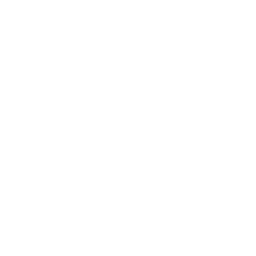
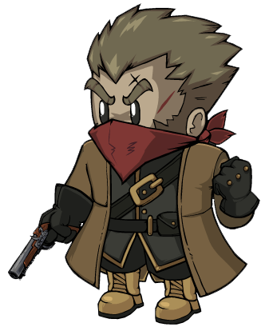

# Vigilante

- **Facción:** Town  · *en alcance MVP*
- **Página de la wiki:** Vigilante (ToS)

## Ficha

**Clase (alineamiento):**

> Town Killing

**Tipo:**

> Killing
> Non-unique

**Prioridad de acción:**

> 5

**Resumen:**

> You are a militant cop who takes the law into your own hands.

**Habilidades:**

> Choose to take justice into your own hands and Shoot someone.

**Atributos:**

> Attack: Basic
> Defense: None

**Atributos (texto):**

> If you Shoot another Town member you will commit suicide over the guilt.
> You can only Shoot your gun 3 times.

**Especial:**

> Suicide after killing a Town member

**Gana con:**

> Town
> Survivor

**Debe matar para ganar:**

> Mafia
> Vampires
> Arsonist
> Serial Killer
> Werewolf
> Witches/Coven
> Plaguebearer
> Pestilence
> Juggernaut

**Usos:**

> 3

**Resultado Investigator:**

> Classic Results
> Your target could be a .
> Coven Expansion Results
> Your target could be a .

**Resultado Consigliere:**

> Your target will bend the law to enact justice. They must be a Vigilante.

## Texto completo de la wiki

| 

 | Looking for the Town of Salem 2 or Traitors in Salem role?

This role appears in Town of Salem 2 and Traitors in Salem. For the ToS 2 counterpart, see Vigilante and for the TiS counterpart, see Vigilante.

Vigilante 

Alignment

 Town Killing

Avatar

Immunities

Attack: Basic

Defense: None

Special

Suicide after killing a Town member

 Ability Stats

 | Type

 | Priority

 | Killing

Non-unique

 | 5

Investigation Results

 Sheriff

You cannot find evidence of wrongdoing. Your target is innocent or great at hiding secrets!

 Investigator

Classic Results

Your target could be a Vigilante, Veteran, Mafioso, or Ambusher.

 Coven Expansion Results

Your target could be a Vigilante, Veteran, Mafioso, Pirate, or Ambusher.

 Consigliere

Your target will bend the law to enact justice. They must be a Vigilante.

Game Information

Summary

You are a militant cop who takes the law into your own hands.

Abilities

Choose to take justice into your own hands and Shoot someone.

Attributes

If you Shoot another Town member you will commit suicide over the guilt.

You can only Shoot your gun 3 times.

Goal

Hang every criminal and evildoer.

 Victory Conditions

 | Wins with

 | Must kill

 | Town

 Survivor

 | Mafia

 Vampires

 Arsonist

 Serial Killer

 Werewolf

 Witches/ Coven

 Plaguebearer

 Pestilence

 Juggernaut

 | 

 | DISCLAIMER: These stories are fanmade, and are not created or endorsed in any way by BlankMediaGames or Digital Bandidos.

An ex-police officer is enraged by the increase of crime on the streets of his town. While he was fired for his violent and rash methods, he has a strong sense of justice. As the death toll in the town rises, his anger only grows as he finds the criminal's identity is obvious. That night, he makes his final, heavy decision. If the law won't take down this fiend, he'll have to do it himself. He fishes his pistol out of the end table beside his bed, loading it with two bullets. One to kill, and one for backup. He usually didn't miss, but it paid to be cautious. Using the shadow of the night as his disguise, he sneaks into his suspect's house to find them cleaning a bloody knife. I knew it, he thought, his lips curling in disgust at the sight. Letting out a quiet, steady breath, he raised his gun and pulled the trigger. His suspect hit the floor, all signs of life disappearing from their body. Pleased with the results, the man slips back into his home and climbs into his bed. He sleeps soundly, feeling as if a heavy weight had been lifted from his shoulders. The following morning, a panicked frenzy meets him in the square. The doctor had been discovered dead in their home after doing surgery on a wounded patient. Nausea washes over him. The doctor. He had killed the doctor. Self-preservation pins his lips together during the day, and misery drags his feet back home that night. He finds his gun resting on the end table, just where he had left it after slaying an innocent soul. The weight returns, crashing down on him heavier than before. One bullet left.

Mechanics[]

You may choose a player to Shoot at Night, dealing a basic attack to them. You cannot Shoot on the first Night. You can only Shoot three times.

If you kill a Town member, you will commit suicide the next Night, dealing the equivalent of an Unstoppable Attack. You will still commit suicide if you are Roleblocked, Controlled, or Jailed, and you cannot be Controlled to Shoot someone. A Transporter will also be unable to Transport your suicide.

If a Witch or Coven Leader controls you, you are forced to Shoot their second target, even if it is the first Night. You can still be Roleblocked from Shooting. You will also still commit suicide if you were controlled into Shooting a Townie.

If your target was Jailed, you will not lose a bullet, but your target will be notified of your attempted attack.

If you are a Town Traitor Vigilante or a Coven Town Traitor Vigilante, you can shoot your teammates, however it is not recommended to do this unless you are going for a Town Traitor hunt.

You cannot be the VIP due to being a passively suicidal role.

Suicide[]

If your target was cleaned by a Janitor, turned to stone by Medusa, or forged by a Forger, you will still commit suicide if they were a Town member.

If you are converted into a Vampire on the same Night you Shoot a Town member, you will not commit suicide on the following Night. This informs the Town that you were either converted or your target was non- Town forged as a Town member (You cannot be converted to a Vampire on the Night after Shooting a Town member).

Note that you will still receive the message for shooting a Townie, however you will not die that Night. 

Suicide is considered an Unstoppable Attack at a priority similar to a Jester. This means a Town Protective, Jailor, Guardian Angel, Potion Master, Bootlegger, Tavern Keeper, Pirate, Witch/ Coven Leader, or Transporter cannot stop you from committing suicide.

If you are a Town Traitor Vigilante or a Coven Town Traitor Vigilante, you will never suicide from guilt, regardless of who you Shoot.

Strategy[]

Selecting Who to Shoot[]

Like all Townies, the Vigilante works best as a team player. Communicate in whispers to known Town Investigative roles and the Jailor so that you Shoot only evil-doers with your bullets.

Without communicating, you can end up Shooting someone that was known to be a Townie by a Town Investigative, or may lose your chance to Shoot anyone at all if any evildoers catch wind of your identity and kill/roleblock you.

Compile a list of non- Mafia/ Coven members in your Last Will or Notes so that you can be sure you do not accidentally Shoot a confirmed member of the Town.

Only Shoot if you are sure that your target is a non- Town role, it would be too risky otherwise. In many cases, you do not need to use your ability to win the game.

An exception to this would be if the Town is losing and needs to consider the possibility of luckily eliminating evil roles by a calculated random shot.

Even though you're on the same team, Transporters pose huge risks to a Vigilante. If you've identified someone as evil, there's a good chance a Transporter has, too, in which case they may be transporting your target with themselves or a confirmed Town. If there's a confirmed Transporter in your game, consider whispering them before you Shoot someone who looks evil so they know not to transport them that Night. Be wary of Blackmailers, though, as they could expose you to the Mafia.

If you are unsure of who to Shoot, try and think about who is acting like a Jester, as they might be a member of the Mafia or a Neutral role trying to not get hanged. Therefore you can Shoot them and they have a lower chance of being a Townie.

If you are fairly certain someone is an evil role, such as a minor bit of evidence against them or if they claimed a role that was an enemy to the Mafia, and they haven't been attacked, Shoot them, especially in cases where the Town will lose majority if you don't Shoot. It can clear up and expose false claims, along with confirming some Townies.

The downside is that some players may randomly Shoot someone, even if no evidence is against them. Even if they hit a Neutral or Mafia member, in most game-modes, there is a high chance of them killing a Townie. Although this is not gamethrowing, it is frowned upon by most people because of the chance a Townie can get killed.

One simple self-confirmation strategy is to claim Vigilante and ask roles from everyone, similar to a Mayor game. You can threaten to Shoot players who do not claim. The downside is you may get attacked by the Mafia, roleblocked by a Bootlegger, or worse, get controlled by a Witch to Shoot a confirmed Townie.

Don't be afraid to Shoot someone who claims a Neutral role if you think they could be a threat for the Town, because a Jester can kill an important Town member via haunt, and Witches can throw off the Town from collecting valuable information. Additionally, Mafia members sometimes try and fake Jester, giving you another reason to Shoot any Jester claims.

Late in the game, you may be forced to Shoot somewhat more blindly, based on circumstantial evidence or someone you suspect is probably Mafia. This should be avoided early on, but if you're certain the Town is about to lose its majority anyway, then it's preferable to take a risk rather than just let the Town lose. In this situation, you should rely on everything that has happened up until then to try and make the best possible guess:

Usually anyone who votes a member of the Mafia up to the stand when there is reasonable doubt is unlikely to be a Mafia member themselves. Guilty votes are less meaningful because Mafia members are likely to vote guilty if it's clear someone can't be saved but may try to drag their feet in the hopes that they won't get voted up to begin with.

If you can eliminate almost everyone from consideration as possible Mafia based on those voting patterns combined with the Last Wills from Sheriffs, confirmed Town, and so on, you should Shoot whoever is left.

Generally, use common sense to select who to Shoot. Don't Shoot people who are confirmed, and look at who has a weak claim or no claim. Anybody who doesn't have a decent Last Will is more likely to be evil. Use all the information, even if there isn't much around to use.

If someone is almost voted up, but the vote fails, it might be worth Shooting them, even if the evidence against them is weak. This is because if they are actually a member of the Mafia, Shooting them can turn the entire game around by casting suspicion on anyone who refused to vote for them (and giving you valuable information for your remaining shots). However, the accuser could be an Executioner.

This is especially applicable when the Mafia is near the majority. Consider the possibilities:

It's unlikely that the Mafia would have risked outing themselves by aggressively trying to vote someone up on their own when they're near (but not quite at) a majority, especially since they'll shortly win naturally by killing people. Additionally, if the Mafia is near a majority, smart Town members will know they must hang someone, even if the evidence is weak. Therefore, the people voting against that person are probably not Mafia.

Conversely, if the person being voted up was not Mafia, the Mafia (being near a majority) would have joined in as soon as the Town started to vote up the wrong person and easily hang them. You can point this out and usually get them off the stand with a smart Town.

This is known as a 'fast vote'.

Experienced Mafia members may know this and 'slow vote' the person being voted and call out the vote speed to trick the Town.

Therefore, if an effort to vote someone up fails in a near-miss in the late game when the Mafia is near the majority, it's usually a sign that both the person being voted up and some or all of the people who refused to vote for them are part of the Mafia, and you should usually risk Shooting the person who was voted up.

When there is a Bodyguard around, be careful of who you Shoot. If you Shoot someone that is guarded by one, both you and the Bodyguard will die, and the Town member guarded will be left open to attack.

It is generally a bad idea to Shoot someone under suspicion of being a role with Basic protection or above. While you can notionally confirm their protection (and therefore out them), this carries all the risks of hitting an innocent, either due to a false accusation or a Transporter, with fewer benefits if you get it right. Investigations are, when possible, better left to the Town Investigatives.

However, it is usually worth Shooting someone who has confessed to being such a role or otherwise implied that's what they are, since they may be a Jester, or they may be another evil pretending to be an Executioner or Survivor.

When you Shoot a Townie[]

If you make a mistake and Shoot a Town member, don't reveal who you are the next day! The Mafia or any Neutral Killing might waste a Night targeting you. You can also tell the Transporter to use you as a 'shield' for other players as you will die anyway.

If you Shoot a target that is cleaned or stoned (or forged as a non- Town role) on the same Night and you die of guilt, the Town will gain valuable info that the target was a Townie as you can only die of guilt from Shooting someone from the Town.

If a Pirate has chosen to side with Town, let them plunder you, since you will die regardless, and whisper to them what you will pick. The Pirate will likely pick the corresponding defense, netting them a free plunder.

When your target has Defense[]

If you Shoot a player with defense, make sure to inform the Town, so they can decide whether the person is an evil role with Defenseand hang them. No Town role has Defense except for a Bodyguard, Doctor or Veteran who uses their self-protection.

However, if your target was a Witch who had Basic Defense, it's recommended to Shoot them again, rather than informing the Town since you'll risk getting controlled into Shooting a Townie if the Town fails to vote up the Witch.

An easy way to tell if you shot a Witch is to check if you got a Defense message. Since only a Witch produces no Defense message to an attacker, it's easy to deduce that your target is a Witch.

When informing the Town that you shot an immune player, you should also present your logic for why you shot them. If you didn't have a good reason to Shoot them, you may come across as a Mafioso or Serial Killer trying to accuse another evil.

If somebody is accused of being a role with Defense like Serial Killer or Godfather, it's sometimes a good idea to attempt to Shoot them. If they are immune, you will be given a message that their defense was "too strong to kill". You can then write your findings in your Last Will and announce it to the Town the next day. Be somewhat cautious about this; Shooting them is a bit of a "destruction test" since if the accusation is false, you have a high risk of killing a Town member.

Surviving the Day Phases[]

Secrecy is the key. The Vigilante's Basic Attack makes them a threat to all evils without Defense, so don't reveal your identity until asked by an Investigator or if your target has Basic Defense.

If you are aware of a Witch in-game, be careful when stating you're a Vigilante as the Witch can control you into Shooting a fellow Townie. Under no circumstances should you reveal that you are the Vigilante unless you ask a Transporter to transport you or not to transport your target, or you know a Tavern Keeper or Jailor can prevent you from Shooting good Townies.

You may wish to claim Veteran as it is less likely that you will be targeted by evils and you have the same investigation results.

Be wary about claiming Veteran if there is another one in game. You may want to whisper to the Veteran about your fake claim and possibly tell them to claim Vigilante so the Witch visits the wrong person and dies.

If you're going to Shoot anyone, you can call "Vig Shoot (name)!". It's an indirect call for anyone not to touch the target (especially Transporter). Don't tell the Town "I am going to Shoot" -- using first-person phrasing to announce intent will out you, while third-person phrasing keeps you indistinguishable from Townies trying to direct you. Experienced Mafia members may still see through the bluff and attack/roleblock you.

Achievements[]

 | Name

 | Description

 | Merit Points

 | Mercenary

 | Win your first game as a Vigilante

 | 20

 | Justice

 | Win 5 games as a Vigilante

 | 20

 | Smoking Gun

 | Win 10 games as a Vigilante

 | 40

 | Judicatory

 | Win 25 games as a Vigilante

 | 100

 | Ouch

 | Shoot yourself at night

 | 40

 | Why Won't They Die?

 | Shoot 3 people who can't die at night

 | 40

 | Perfect Shot

 | Shoot 3 Non- Town in a single game

 | 100

 This achievement is known to be bugged.

Messages[]

 | 

 | You have (#) bullet(s) left

 | Amount of bullets left.

 | You decide to wait a day before using your gun.

 | Displays for the Vigilante on the first Night.

 | You have put away your gun for killing a town member.

 | Displays for the Vigilante if they shot a Townie.

 | You were shot by a Vigilante!

 | Displays at the end of the night when you are visited by a Vigilante with bullets that hasn't shot a Townie yet, and you do not have defense.

 | You could not get over the guilt of killing a town member. You shot yourself! 

 | Displays at the end of the second night after shooting a Town member the night before.

 | [They were] shot by a Vigilante. or [They were] also shot by a Vigilante.

 | Cause of death for someone who was visited by a Vigilante.

 | [They] died from guilt. or [They] also died from guilt.

 | Cause of death for a Vigilante who had shot a Townie the previous night.

Trivia[]

The only game mode that Vigilante cannot ever appear is the Lovers game mode in the Coven Expansion.

After Shooting a Townie, a Vigilante may appear to not commit suicide from guilt if they leave the game.

The Vigilante is one of two roles to have 2 skins, the other being the Arsonist.

If a Vigilante Shoots a Townie using their last bullet, the Vigilante will still "put away their gun" and commit suicide even though they have no more bullets.

The cause of death message "dying of guilt" (comitting suicide after killing a townie) was changed to being "doomed for killing a townie" in Version 3.3.11.

History[]

3.3.6

Fixed a bug where Vigilante could not be added in Coven Custom.

3.2.4

Temporary Defense given by certain roles through game mechanics now give attackers the message "Your target's defense was too strong to kill.".

3.2.3

 Trapper will no longer die to Attack if another Trapper has placed a Trap on them.

Dual Trappers can now save each other if they have placed Traps on each other and both are attacked.

2.5.5.12200

The Vigilante's role icon has been changed. Old one was .

Added Vigilante's circled role icon ().

2.5.1.10655

Fixed Guardian Angel "target was attacked" feedback.

2.3.2.9706

A Witch controlling a Vigilante to kill another Townie with only those three alive now results in a Witch victory over a Town victory.

2.0

 Vigilantes no longer have a Death Note.

Beta 0.8.1

Attackers will now get "Your target is immune" message when attacking Werewolf on Full Moon nights.

Town of Salem Release

Introduced.

 | 

 | 
Roles

 | 

 | 

 | 
 Town

 | 

 | Town Investigative | | Investigator • Lookout • Psychic • Sheriff • Spy • Tracker | | 

 | 

 | Town Killing | | Jailor • Vampire Hunter • Veteran • Vigilante

 | 

 | Town Protective | | Bodyguard • Crusader • Doctor • Trapper

 | 

 | Town Support | | Mayor • Medium • Retributionist • Tavern Keeper • Transporter

 | 
 Mafia

 | 

 | Mafia Deception | | Disguiser • Forger • Framer • Hypnotist • Janitor | | 

 | 

 | Mafia Killing | | Ambusher • Godfather • Mafioso

 | 

 | Mafia Support | | Blackmailer • Bootlegger • Consigliere

 | 
 Coven

 | 

 | Coven Evil | | Coven Leader • Hex Master • Medusa • Necromancer • Poisoner • Potion Master | | 

 | 
 Neutral

 | 

 | Neutral Benign | | Amnesiac • Guardian Angel • Survivor | | 

 | 

 | Neutral Evil | | Executioner • Jester • Witch

 | 

 | Neutral Killing | | Arsonist • Juggernaut • Serial Killer • Werewolf

 | 

 | Neutral Chaos | | Pirate • Plaguebearer/ Pestilence • Vampire

## Implementación

- [ ] Definido en `packages/engine` con su prioridad y facción
- [ ] Acción nocturna (si aplica) validada con objetivos legales
- [ ] Resultado de investigación correcto (Sheriff / Investigator / Consigliere)
- [ ] Condición de victoria y de derrota comprobada en tests
- [ ] Tests unitarios del rol en verde
- [ ] Tarjeta y texto de ayuda en la app
- [ ] Icono e ilustración propia (no el arte de la wiki)
- [ ] Plantillas de narración para sus eventos
