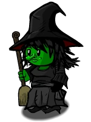

# Witch

- **Facción:** Neutral  · *fase posterior (referencia)*
- **Página de la wiki:** Witch (ToS)

## Ficha

**Clase (alineamiento):**

> Neutral Evil

**Tipo:**

> Disruption
> Non-Unique

**Prioridad de acción:**

> 2

**Resumen:**

> You are a voodoo master who can control other peoples[sic] actions.

**Objetivo:**

> Survive to see the Town lose the game.

**Habilidades:**

> You may choose to Control someone each night.

**Atributos:**

> Role block Immunity
> Detection Immunity
> Attack: None
> Defense: None (Basic until first attack)

**Atributos (texto):**

> You have a mystical barrier that grants you Basic defense until you are attacked.
> You will know the role of the player you Control.

**Gana con:**

> Mafia
> Vampires
> Witch
> Survivor
> Arsonist
> Serial Killer
> Werewolf

**Debe matar para ganar:**

> Town

**Resultado Sheriff:**

> You cannot find evidence of wrongdoing. Your target is innocent or great at hiding secrets!

**Resultado Investigator:**

> Classic Results
> Your target could be a Lookout, Forger, or Witch.

**Resultado Consigliere:**

> Your target casts spells on people. They must be a Witch.

## Texto completo de la wiki

| 

 | Looking for the Town of Salem 2 role?

This role appears in Town of Salem 1 and 2. For the ToS 2 counterpart, see Witch.

 | 

 | Please note: The Witch is not playable in the Coven Expansion game modes, as it is replaced by the Coven Leader.

Witch 

Alignment

 Neutral Evil

Avatar

Immunities

Role block Immunity

Detection Immunity

Attack: None

Defense: None (Basic until first attack)

Special

 Coven Chat

Unique Role

 Ability Stats

 | Type

 | Priority

 | Disruption

Non-Unique

 | 2

Investigation Results

 Sheriff

You cannot find evidence of wrongdoing. Your target is innocent or great at hiding secrets!

 Investigator

Classic Results

Your target could be a Lookout, Forger, or Witch.

 Consigliere

Your target casts spells on people. They must be a Witch.

Game Information

Summary

You are a voodoo master who can control other peoples actions.

Abilities

You may choose to Control someone each night.

Attributes

You have a mystical barrier that grants you Basic defense until you are attacked.

You will know the role of the player you Control.

Goal

Survive to see the Town lose the game.

 Victory Conditions

 | Wins with

 | Must kill

 | Coven

 Survivor

 | Town

 | 

 | DISCLAIMER: These stories are fanmade, and are not created or endorsed in any way by BlankMediaGames or Digital Bandidos.

As a young child, the Witch was used to being bullied. Everywhere she went, she was made fun of. Whether it was her abnormally large nose, her off-shade green skin, or just the fact that she carried a broom around wherever she went. The town had completely shunned her. She was banished to the far forests, left to her own devices..and her own magic. Throughout years of being completely alone, she had studied magic day and night, and, with the help of her black cat as a lab rat of sorts, she had learned to make people do whatever she pleased! With her newfound talent, she moved back into the town, taking up home under the guise of a regular townsperson. The Witch vowed to take revenge on everyone that had ever bullied her. That meant working with those who some may consider evil. To her, they were just allies…allies in the war on taking down the Town of Salem.

Mechanics[]

You can control someone each night to visit or use their ability on your second target. Your initial target will know they are being controlled.

You will be told the role of the target you control.

You have Basic Defense until you are attacked. This Basic Defense can only protect you from one attack.

You will only lose this Basic Defense if the attack would have killed you. Getting saved by other players, such as Town Protectives, will not consume your Defense.

If you are attacked, you will receive the message that you were attacked. However, your attacker will not receive any message.

You will receive all feedback your target would have otherwise received. Your target will not receive their feedback.

You cannot be roleblocked by Bootleggers or Tavern Keepers.

If a Vigilante is alive with the ability to shoot, the game will continue if no other factions beside the Town are alive. This also happens if more than one Witch is alive.

 | Witch Results: 

 | Your target is a trained protector. They must be a Bodyguard.

 | Your target is a professional surgeon. They must be a Doctor.

 | Your target is a beautiful person working for the town. They must be a Tavern Keeper.

 | Your target gathers information about people. They must be an Investigator.

 | Your target detains people at night. They must be a Jailor.

 | Your target watches who visits people at night. They must be a Lookout.

 | Your target is the leader of the town. They must be the Mayor.

 | Your target speaks with the dead. They must be a Medium.

 | Your target wields mystical powers. They must be a Retributionist.

 | Your target is a protector of the town. They must be a Sheriff.

 | Your target secretly watches who someone visits. They must be a Spy.

 | Your target specializes in transportation. They must be a Transporter.

 | Your target tracks Vampires. They must be a Vampire Hunter!

 | Your target is a paranoid war hero. They must be a Veteran.

 | Your target will bend the law to enact justice. They must be a Vigilante.

 | Your target lies in wait. They must be an Ambusher.

 | Your target uses information to silence people. They must be a Blackmailer.

 | Your target gathers information for the Mafia. They must be a Consigliere.

 | Your target is a beautiful person working for the Mafia. They must be a Bootlegger.

 | Your target makes other people appear to be someone they're not. They must be a Disguiser.

 | Your target is good at forging documents. They must be a Forger.

 | Your target has a desire to deceive. They must be a Framer!

 | Your target is the leader of the Mafia. They must be the Godfather.

 | Your target is skilled at disrupting others. They must be a Hypnotist.

 | Your target cleans up dead bodies. They must be a Janitor.

 | Your target does the Godfather's dirty work. They must be a Mafioso.

 | Your target does not remember their role. They must be an Amnesiac.

 | Your target likes to watch things burn. They must be an Arsonist.

 | Your target wants someone to be lynched at any cost. They must be an Executioner.

 | Your target wants to be lynched. They must be a Jester.

 | Your target wants to kill everyone. They must be a Serial Killer.

 | Your target simply wants to live. They must be a Survivor.

 | Your target drinks blood. They must be a Vampire!

 | Your target howls at the moon. They must be a Werewolf.

 | Your target casts spells on people. They must be a Witch.

Controlling a target[]

First target: The player who is controlled. The Witch will visit them.

If the Witch's first target is roleblocked, then the control will have no effect, unless they are a Tavern Keeper or Bootlegger. If they are Jailed, you are unable to control them, and unlike popular belief your target will not receive a message that someone has attempted to control them in Jail.

If your target is a Transporter, Veteran or Retributionist, you are unable to control them.

If the Witch's first target has no remaining uses for their ability, the control will have no effect. (e.g. A Vigilante who has no bullets left.)

The Witch will know the role of their first target.

The message the Witch will receive upon controlling someone is the same message that the Consigliere would receive upon investigating someone.

While doused players will appear as an Arsonist to the Consigliere, you will receive your target's exact role despite them being doused or not.

If more than one Witch wants to control a target, the Witch who entered the lobby last will be able to take control.

The controlled target will be notified with the same message if multiple Witches attempt to control them.

The Witch that failed to take control will be notified that their target they tried to control was controlled by another.

If a player has left the game, they cannot be controlled by a Witch. The Witch will still see the player's role, however.

Second target: The controlled player will use their night ability on the second target if the control is successful.

If the controlled player has a visiting Night ability, they will visit the second target. They will be seen by a Lookout and may die to an alerting Veteran or a rampaging Werewolf.

 Witches will not visit the second target. They will not be affected by the Werewolf, Veteran, or Lookouts visiting that target.

Controlling a target - Effects on different roles[]

If Visit is , then a Lookout can see the Witch's first target visit the second target, even if the visit does nothing.

If Veteran is , then the first target can be controlled and can be attacked by visiting a Veteran who is on alert as the second target.

If Werewolf is , then the first target can be controlled and can be attacked by a Werewolf who is the second target during a Full Moon night (i.e. killed by a rampage attack).

 | Role

 | Special effects on first target

 | Visit

 | Veteran

 | Werewolf

 | Vampire Hunter

 | The Vampire Hunter will check the second target. If the second target is a Vampire then they will be staked.

 | 

 | 

 | 

 | Bodyguard

 | The Bodyguard will protect the second target.

 | 

 | 

 | 

 | Doctor

 | The Doctor will heal the second target.

If the second target is a revealed Mayor, they will visit but not heal the second target.

 | 

 | 

 | 

 | Tavern Keeper

 | The Tavern Keeper will roleblock the second target.

 | 

 | 

 | 

 | Lookout

 | The Lookout will watch the second target. You will get their results.

 | 

 | 

 | 

 | Investigator

 | The Investigator will investigate the second target. You will get their results.

 | 

 | 

 | 

 | Spy

 | The Spy will bug the second target. You will get their results and Mafia visits.

 | 

 | 

 | 

 | Sheriff

 | The Sheriff will interrogate the second target. You will get their results.

 | 

 | 

 | 

 | Jailor

(with executions)

 | If the second target is the prisoner, the Jailor will execute them (but not during night 1).

If the second target is not the prisoner, the Jailor is prevented from executing their Jailed target.

 | 

 | 

 | 

 | Jailor

(without executions)

 | No effect.

 | 

 | 

 | 

 | Mayor

(with or without being revealed)

 | No effect.

 | 

 | 

 | 

 | Medium

 | No effect.

 | 

 | 

 | 

 | Retributionist

 | No effect because the Retributionist is immune to the Witch.

 | 

 | 

 | 

 | Transporter

 | No effect because the Transporter is immune to the Witch.

 | 

 | 

 | 

 | Veteran

 | No effect because the Veteran is immune to the Witch. The Veteran cannot be controlled into using an alert. If the Veteran chooses to be on alert, the Witch will be killed.

 | 

 | 

 | 

 | Vigilante

(with bullets)

 | Will immediately shoot the second target, even if it's night 1.

 | 

 | 

 | 

 | Vigilante

(without bullets)

 | No effect.

 | 

 | 

 | 

 | Vigilante (after shooting a Town member)

 | No effect.

 | 

 | 

 | 

 | Godfather

(with Mafioso who is not role blocked)

 | Will command the Mafioso to attack the second target.

 | 

 | 

 | 

 | Mafioso

(with a Godfather)

 | No effect because the Godfather overrides the control. The Mafioso will still attack the Godfather's target and ignore the Witch.

 | 

 | 

 | 

 | Godfather/ Mafioso

(solo)

 | Will attack the second target.

 | 

 | 

 | 

 | Forger

(with ability uses)

 | Will forge the second target if the second target is killed. Costs one use of ability, even if the target did not die.

If the Forger had planned to forge someone else, their Last Will and role replaces the new forged target, otherwise, the Last Will is removed. 

If the Forger did not forge anyone, the target's Last Will is removed, and their role will appear to be Forger.

 | 

 | 

 | 

 | Janitor

 (with ability uses)

 | Will clean the second target if they are killed. Costs one use of ability, even if the target did not die.

 | 

 | 

 | 

 | Forger/ Janitor

(0 ability uses)

 | No effect.

 | 

 | 

 | 

 | Disguiser

 | Your second target becomes their first target. Their second target stays the same.

 | 

 | 

 | 

 | Framer

 | The Framer will Frame the second target.

 | 

 | 

 | 

 | Consigliere

 | The Consigliere will check the second target. You will get their results.

 | 

 | 

 | 

 | Blackmailer

 | The Blackmailer will blackmail the second target.

 | 

 | 

 | 

 | Bootlegger

 | The Bootlegger will roleblock the second target.

 | 

 | 

 | 

 | Ambusher

 | Will set up an ambush at the second target.

 | 

 | 

 | 

 | Hypnotist

 | Will hypnotize the second target with whatever message was chosen. If no message was chosen, no effect.

 | 

 | 

 | 

 | Arsonist

 | Will douse the second target and the Witch.

If second target is themselves, they will douse themselves instead of igniting.

 | 

 | 

 | 

 | Serial Killer

 | Will attack the second target.

 | 

 | 

 | 

 | Amnesiac

 | Will visit the second target. If the second target dies that same night, the Amnesiac will remember that target's role.

If the Amnesiac is controlled onto themselves, they will instead remember being an Amnesiac.

 | 

 | 

 | 

 | Jester

 | No effect.

 | 

 | 

 | 

 | Executioner

 | No effect.

 | 

 | 

 | 

 | Survivor

 | No effect.

 | 

 | 

 | 

 | Vampire

(on a night they can bite)

 | Will ignore the Vampire votes and bite the second target. The youngest Vampire will automatically be controlled if the Witch targets any living Vampires.

 | 

 | 

 | 

 | Vampire

(on a night they cannot bite)

 | Cannot convert another player.

 | 

 | 

 | 

 | Werewolf

( Full Moon)

 | Witch controls who the Werewolf visits. If the Werewolf is role blocked or controlled to visit themselves, they will stay at home and attack the Witch and/or the roleblocker.

 | 

 | 

 | 

 | Werewolf

(non- Full Moon)

 | Will visit the second target.

 | 

 | 

 | 

 | Witch

 | Your second target becomes their first target. Their second target stays the same.

 | 

 | 

 | 

 Note: The Godfather will not be detected by a Lookout or forced to visit a Veteran or Werewolf, but their Mafioso can be, assuming the Mafioso is not role blocked. If the Mafioso is role blocked, the Godfather can be detected by a Lookout and die to a Veteran or Werewolf.

 Note: If the Godfather is not role blocked, the Mafioso will not visit the Witch's target. If the Godfather is role blocked, the Witch will be able to control the Mafioso. The Mafioso can be detected by a Lookout and die to a Veteran or Werewolf.

 Note: If the youngest Vampire is controlled, the youngest Vampire can be detected by a Lookout and die to the Werewolf. If any of the other alive Vampires are controlled, none of the Vampires will be detected by the Lookout or die to a Veteran or Werewolf.

 Note: The Werewolf will stay home and attack themselves, but they won't die. They will see that they have attacked at least two players which would be the Witch and the Werewolf themselves.

 Example:

 Witch 1 wants to control the Vigilante to visit the Jailor.

 Witch 2 controls Witch 1 to visit the Doctor.

 Witch 1 will instead control the Doctor to visit the Jailor.

 Note: If the Witch/ Disguiser doesn't select to target anyone that night, then the Witch/ Disguiser cannot be detected by a Lookout or die to a Veteran or Werewolf.

 Note: Similar to a Witch, the Disguiser can be controlled into disguising the second target. However, they cannot be controlled into disguising someone as the second target.

Strategy[]

The Witch is a potentially devastating role that has the ability to control someone's action. This can cause events such as a making a Serial Killer and Godfather kill someone that will make them more obvious, or causing a Doctor to heal you.

Messing with Town roles[]

If someone reveals they are a Veteran, it's a good opportunity for you to control someone you want dead and make them target the Veteran; if the Veteran goes on Alert, whoever you controlled will die. If your first target is a killing role, however, they may end up killing the Veteran instead if they did not Alert.

You can avoid a Sheriff, Investigator, or a Lookout from investigating you by having them investigating another role or themselves. Since you get the results they would have normally received, you may even use them to find an evil role.

If an Investigator calls you out you are forced into two positions, claim you were being transported, or that you are a Lookout. The Investigator is one of your biggest foes, so making sure that Investigators aren't targeting you is one of your highest priorities.

Take advantage of Vigilantes. If one is revealed, forcing him to kill another Townie, such as a revealed Mayor, will be sure to anger the Town and may help you win. Make sure that they are not a Veteran though, as claiming Vigilante is a common strategy. However, the fact that there's a Witch in game might make it harder to control them. (i.e Jailor on, Tavern Keeper role blocking them or Transporter Transporting them)

If you know who the Jailor is Jailing, you can force them to execute their target by controlling the Jailor to target the player in Jail. This can be devastating if the Jailed target is an important Town role, particularly the Mayor.

Remember though, that it could be very hard to actually manage this.

This also works the other way around; if you do not want a Jailor to execute someone, such as a member of the Mafia, you can force them to target someone else, and they will not be executed.

Control a known Tavern Keeper to role block dangerous Town roles, particularly Town Investigative or Town Killing roles.

Even better, if you send a Tavern Keeper to a Werewolf (On Full Moon Nights), they will die and whoever they wrote in their Last Will as their target will come under suspicion (rather than the actual Werewolf); this can be particularly advantageous if you want to keep a Werewolf from targeting you or another evil buddy. You will also get rid of a Town that could dangerously role block Mafia Killing. Be cautious and to not do this to a Bootlegger (unless you're certain you want to side with other evils.), since you will kill an ally. Note that you will survive throwing a Tavern Keeper to a Werewolf in this manner.

Furthermore, if a Mafia Killing role is being repeatedly role blocked by a Tavern Keeper and is unable to kill, you can liberate them by forcing the Tavern Keeper to target someone else, especially into a known Serial Killer or Werewolf on a Full Moon.

Using your powers to kill Townies is not the only strategy a Witch can use! If you discover someone is a Doctor or Bodyguard, have them target you. You guarantee yourself protection every night until your unwilling victim is put out of commission. An added advantage of controlling a Bodyguard to protect yourself is that if the Mafia tries to kill you and hits your Bodyguard instead, and the Bodyguard indicated (in their Last Will or in chat) that they were being controlled, then the Mafia will learn that you're a Witch and will avoid attacking you in the future.

If they are protecting someone important, like the Mayor or Jailor, this makes this strategy even better as this gives an opening for your Mafia friends to attack them!

If the Mafia has an Ambusher, you can even ask the Ambusher to target you while you control Town Protectives into yourself, allowing the Mafia to reliably kill 2 Townies per Night! Alternatively you can control the Ambusher into other Mafia members to kill pesky Town Investigatives or a Tavern Keeper.

Controlling evil roles[]

Controlling Mafia (especially the Godfather) may be dangerous as you can make them kill Mafia. To avoid this, next time you control a player whom you are unsure if they are Mafia Killing or not, make them target themselves. If they are the Godfather, the Mafioso will attack the Godfather, but not kill due to the Godfather's Basic Defense. However, this will make Mafia waste a kill, and a Spy may accuse the Godfather of having defense and push on them. If they are a Mafioso, they will most likely ignore your controlling and kill the Godfather's intended target. However, this is risky because the Godfather might be roleblocked/ Jailed, not pick a target or simply not exist in-game. If they are an Ambusher, they will attack you. You will either die, or lose your Basic Defense from their attack, which can be detrimental later on.

If you find a Neutral Killing role, you should decide between controlling them continuously or focusing your attention elsewhere. Controlling them continuously has the advantage of ensuring your safety, but it has the disadvantage of mostly wasting your capabilities otherwise (since - unless you use knowledge from previous controls to choose key targets for them - you're not actually helping them win).

It's worth noting that continuously controlling a Neutral Killing role will usually annoy the target and can sometimes lead them to turning against you.

Controlling a Werewolf is dangerous since if they're role blocked, they'll stay home and kill all their visitors, including you. However, you can use them to deal powerful Rampage attacks to whoever you choose.

Controlling an Arsonist into themselves will cause them to douse themselves. If you plan to team with a different evil role, this could be a plausible idea to hold them off. Note that if you don't control them for a night they may clean the gasoline off themselves.

However, if you do douse an Arsonist, be VERY CAREFUL, as you are now doused.

Revealing yourself to evil roles and teaming up with them[]

If you find a Neutral Killing role or who the Mafia are, or it would be best to team up with them because you can win with any non- Town roles. Sometimes it would be best to make friends with both to avoid being killed at night, but betraying one faction may cause them to try to kill you. Your first target's role will be told to you. When you find a non- Town, you can find a quiet way of talking to them, such as a whisper to target A, "I know what you are; we can work together." But be careful, whispers in a Witch game are often viewed as Witch communicating to team up. If you team up with a non- Mafia evil (unless you're deliberately whispering your real role to a Neutral Evil role for a Blackmailer to see), it may be risky to whisper them as a Blackmailer may be in game, hence giving you and the evil you side with away to the Mafia.

It's generally not to your advantage to kill off the Mafia, since you can win with them; however, remember that unlike actual members of the Mafia, you always lose if you die and are capable of winning with the other evils. Therefore, you can kill a member of the Mafia if you intend to side with a Neutral Killing role and if the Mafia somehow becomes a threat to you. This isn't gamethrowing, provided that you legitimately believe killing them increases your chances of surviving. Similarly, since you have no victory condition after you die, it isn't gamethrowing to name them in your Last Will (doing so can even be a useful threat to keep them from killing you). Part of playing the Witch is about building trust and cooperation with other evil roles, and having that trust fall apart is a legitimate part of the game. That said, siding with the Mafia is usually your best path to victory, so killing them should be avoided whenever possible.

Another strategy is to whisper to the player you controlled that you visited them last night instead of outright claiming Witch. As your visits leave a notification in chat, they should realize you are the Witch, and the Blackmailer may not suspect anything if you are communicating to a non- Mafia

One way to identify yourself to an evil role the night after controlling them is to announce you were controlled the next morning. Assuming there's only been signs of one Witch up until now, they will ideally realize you're lying, which will hint to them that you're the actual Witch.

Be careful, though. Some evil roles might not get the hint, and will still call you out. Or even miss the fact that they were controlled or just not relay that to the rest of the team and as a result make their team think you are Town.

It is also not a good idea to identify yourself to a Neutral Killing like this unless they are in a better position than Mafia. Doing this twice in a single game will give both sides a clear message that you're two-timing and make both of them wary of you. Not that it's a secret that you are, but nonetheless it may irritate them.

You could try and remain silent the whole game and not control anyone. This makes it so Lookouts can't see you and players may think the Witch is away from keyboard, prompting them to target silent players..

Keep in mind that many evil roles tend to kill quiet players because they are often important Town members. Alternatively, the Town often targets quiet players because many evil roles tend to stay quiet as well.

The downside is that an Investigator can easily bust you, especially in Ranked Practice or Ranked, and if you claim to be a different role you may be executed or hanged otherwise.

It is generally a better idea overall to team up with the Mafia or Vampires rather than the Serial Killer if you have the choice. If it comes down to you, the Serial Killer, and the Godfather, the Serial Killer will likely kill you in order to secure their victory, whereas the Godfather needs you alive in order to hang the Serial Killer.

While you can win with the Werewolf as well, you're often better off siding with someone else and trying to have them hanged. This is because the Werewolf is both unique and a visiting role. You're at risk of being killed by the Werewolf even if they know you're on their side.

You can coordinate kills with the Werewolf such that you can you can control someone to whoever the Werewolf is killing which results in the witched target dying to rampage along with the Werewolf's target. However, beware of Bodyguards since you might cause a Werewolf to die.

 Vampires are another possible ally. But be warned that when Vampires try to bite you, you will either die or lose your Basic Defense instead of being converted, despite the fact that you can still win with them. If you find a Vampire, whisper to them as soon as possible so they can know not to bite you. Their numbers will often help prevent you from being hanged, but at night you still need to be careful of the Mafia and Neutral Killings. If they suspect you of siding with the Vampires, they could view you as a threat and kill you.

The Witch is unique among other evil roles in that unlike the Serial Killer, you generally need to cooperate with someone else to win, as you lack a reliable way to communicate unlike the Mafia.

If you've decided on one evil role you want to side with, it can often be advantageous to throw other evils at a confirmed Veteran. Either they'll kill the Veteran for you, or they'll die and won't be a problem anymore. This can be a particularly useful way to rid yourself of a Werewolf or Arsonist, who can be dangerous to side with (and beneficial for you to kill) for the reasons outlined above.

Publicly claiming Witch is dangerous since it exposes you to Vigilantes, the Jailor, the un-revealed Mayor, and any evil role who fears you'll side with someone else, not to mention the mundane danger of being hanged. However, it's also often necessary when you have failed to identify your allies; waiting too long to claim is equally dangerous, since evil roles will very likely kill you as they wrap up the game.

Claiming a role[]

If you are going to claim a Town Investigative role, an easy one to choose is Lookout. Not only is a Lookout’s Last Will easy to make up (much better than an Investigator’s), and you can also use who you controlled to write down visits. If you control player A to visit player B, write in your fake Lookout Last Will that you watched player B and that they were visited by A. Any accurate info besides writing "no visits" in a fake Lookout Last Will will often be the difference between you being hanged and being pardoned by the Town. As the Lookout fits within your investigative results, in the case one investigates you, this is a good possible claim.

Keep in mind though that in games with more experienced players, you might be doubted due to never "watching" the Jailor or only seeing visiting players that were controlled. If you believe the Jailor was Cleaned without revealing, however, you may try to claim Lookout.

Acting like a Jester or Executioner is another way to reduce the risk that the Mafia will target you, since they don't need to kill those roles; however, you face the risk of being killed by a Vigilante or Jailor, or hung by a Town that misreads your signal. Additionally, this clashes with your Investigator's results; since a neither a Lookout nor Forger would generally pretend to be either, Investigators are likely to assume you are evil.

A good claim is Investigator, since you know the role of the target you claimed, but remember to write an Investigator's type of Last Will. Your ability gives you a degree of information, which (in an emergency) you can use to try and confirm yourself as an investigative by outing a night killer you previously controlled. This can be particularly useful for discarding one evil role when you've decided to side with another (e.g. to rid of the Werewolf or Arsonist when you intend to side with the Mafia, Vampires or a Serial Killer). This should be done with caution, however, for a variety of reasons. You ultimately need to side with one evil role or another to win; and what's worse, is that convincing the evil roles that you're a Town Investigative role might have you killed by the players who are supposed to be on your side. Additionally, the target you controlled will know they were controlled and might figure out that that's how you identified them, outing you with their last words or in their Last Will. If you are making an Investigator's Last Will, make sure that you put the right results and the roles in the right order. Otherwise, you could be seen as a struggling Consigliere. Refer to the Investigator page for complete results.

A way to go around this is to scramble your night visits of whom you controlled. In other words, move your target from one night to a different night, and so on. Of course, a smart player could crack the code, and you could be busted by a Lookout.

You should almost always declare that you are actually a Witch in the moment you think the Town no longer has a majority. This can help protect you from being hanged or killed, especially if there's an Arsonist. Even when the Town still has killing roles or still has a majority, it can often be safer than you might think to declare your true role; first, many players will take you for a Jester, and second, you're low-priority from the Town's perspective - you can't kill directly, and they don't actually have to kill you to win (even if there is a Vigilante: if the Vigilante dies the Town wins without harming you). This doesn't mean it's safe; Vigilantes and the Jailor in particular are a huge danger to an exposed Witch. But you have to weigh this against the protection you receive from the Mafia and from Neutral Killing roles.

Before the 2.2.0.8155 update, the Survivor was the most used Witch claim because the invest results were the same. However, you can still claim it if you don't have a better claim because it also can explain why you have Basic Defense.

Like Investigator, a viable claim is Sheriff. Using what you find from other players's investigations, you can help side with the team you want to win with as well as making the Town trust you. However, Sheriff Last Wills are easily made, so even if you claim you found a Neutral Killing role and are siding with the Mafia, the Town may suspect you as an Executioner and hang you. This is because Sheriff is a common Executioner claim. Another advantage to the Sheriff claim is that, if you should discover a non- Godfather member of the Mafia, you can signal to them that you are on their side by publicly stating that they are not suspicious. Be cautious, of course, since this will put you under suspicion if they are caught later!

Another good fake claim is Tavern Keeper. After finding another evil role that you want to team up with, you can tell the player that you role blocked them, and in general, this information will give them enough info to know your role while still making the Town trust you. Similarly, you can claim Transporter and tell your ally that you transported them.

General notes[]

When using your power to try and find out what players are, remember that your primary goal is to impede the Town and to support evil roles; above all else, you want to avoid harming the evil roles you need to win with. Therefore, try to make sure your second target is Town, or at least non-evil, and try to avoid deliberately controlling evil roles unless you're certain you can benefit from it or if you're worried they'll attack you if you don't. If you've identified someone as evil, don't control players into them unless you know what you're doing, since you probably don't want to kill them by accident.

When you're experimenting, never make your victim self-target (unless for achievement purpose or if you're absolutely certain you know what you're doing). There are several ways it can go wrong:

If they're a Mafioso, you'll kill an ally if there's no Godfather.

If they're an Ambusher, they'll kill you if you do not have your Basic Defense.

If they're a Werewolf on a Full Moon night, you will force them to stay home, killing you in the process.

Most Townies won't have any special effect when self-targeting; you'll waste their turn, but you generally do that by targeting them anywhere else too, and you'll receive info depending on the role.

The only Townie who will really benefit from you forcing to self-target is the Vigilante. You can often force the Vigilante to shoot another Townie, in which case the Vigilante will commit suicide the following night.

Roles like the Investigator, Lookout, Doctor, Bodyguard, and Sheriff will not know who they are visiting if you control them into a certain player. For example, if a Sheriff chooses to interrogate the Mafioso, but is controlled by a Witch to look at the Doctor, the result would be the same as if they had originally chosen to interrogate the Doctor. For Town Investigatives, however, because the user knows they are controlled, they will usually end up scrapping the data for that night, regardless of the outcome, since there is typically no way of finding out who they ended up actually investigating.

In the case of you controlling a Consigliere into another player, the first message you will receive is based on your control results (which should be the Consigliere you controlled). The second message you will receive is the Consigliere's results on your second target. Keep this in mind to avoid confusion on which target is which.

Advanced Notes[]

Friendships[]

If you found the Godfather or Serial Killer and want to make sure they do not attack you if you stop controlling them, you should whisper to them not to attack you.

Whispering to a killing role that you have found is incredibly beneficial and most of the time they will accept your help. After all, you both have basically the same goals in mind and killing roles are usually alone, with the exception of Godfather unless all of the Mafia have died, thus partnering with you ensures them your support and another vote, which can be devastating.

However, in the unlikely event that the killing role that you have found decides to turn against you, you may want to "inform" them that their names will be in your Last Will, along with their roles and also the reason why you believed they were bad. This will most probably either enrage them and make them kill you out of spite, in which case you may as well screw them over, or make them cooperate. This is a bit of a dodgy, unwanted friendship, but sometimes still needed for you to win.

While you can't directly use them to win, you can impede the Town by assisting Executioners and Jesters you discovered through your ability. In All Any, you can even side with an Executioner by backing them up when they make an accusation (claiming another Town Investigative role if necessary), then claiming to be a second Executioner yourself to protect yourself from being killed at night. It's not unusual to have multiple Executioners with the same target in that mode.

Who to control and when[]

You want to ensure as many Town members die as possible and that your killing friend is not suspected. As a Witch, more attention to the roles is needed as you need to ensure that your allies survive. Townies are always the first killing priority because if worse comes to worst, they are the only group you cannot win with.

For example: You have found the Mafioso early in the game and you know who the rest of the Mafia are. If one of the Mafia (e.g. the Blackmailer or Consigliere) are found out by an Investigator, then you may want to attempt to destroy their plan or ensure that the Town forgets about it. You can do this by telling the Mafia to attack someone who was supporting the accusation and you yourself can control a Doctor to heal the accused. This weakens the accusation and lessens the chance the accused player will be shot by a Vigilante or executed by a Jailor.

The reason why you should not be attacking an Investigator or Sheriff themselves is that this generally enrages the Town more and most players will make the connection that whom they have accused has killed them to try and rid of any suspicion. The Investigator or Sheriff may become a matter and in most likelihood, the accused will be hanged.

Dangers[]

The Witch can be incredibly powerful and incredibly damaging; however, it is up to you to use your mind and figure out what to do. But be aware of potential dangers.

 Lookout: If you have been consistently controlling a Town Protective role to heal yourself then a smart Lookout might visit the Town Protective to see who has been visiting them. Ignore this danger if the Town Protective role has not been saying they are repeatedly controlled or if you desperately need protection that night. Also, if you control a Lookout into themselves, another Lookout could notice this and call you out.

 Veteran: Pay attention to who this role has killed and guess/estimate how many Alerts they have left. If they have used all 3 then do not bother killing them, as they cannot do anything anymore, and are not worth your time. However, if they have confirmed their role as Veteran, and they do not have any alerts left, then, it will be best to kill them off to lower the town’s majority voting power.

 Investigators: An Investigator will see you as Lookout, Forger or Witch; since this has one Town option, many of them will likely call you out. Witches are low-priority from the Town's perspective (since you don't kill directly), but you could still be killed, especially if no other leads have been found. Lookout is not the worst claim, but since it's only one Town role as opposed to two evil roles, you'll likely be pressed harder. Sometimes, the appropriate thing to do is admit to being a Witch; this may allow evils to side with you, and late in the game (when they're at risk of losing the majority if they don't hang a killer), the Town might not be able to spare the time to hang you. It is best not to admit your identity in Ranked. If it's early in the game, you can accuse the Investigator of being an Executioner, but this is dangerous, since they can often prove themselves by posting their will. 

Others: Sheriffs are not a huge danger to you, since you show up as not suspicious; if you are accused by one, either you were framed, or it's a Jester or other evil roles trying to stir up suspicion. React the way an innocent Townie would; ask for their Last Will or other details to prove their role, suggest you may have been framed (which a Spy may be able to confirm), call them out as an Executioner when they fail to provide corroborating information and so on.

Early game: You are most vulnerable early game because you do not know any roles and you will be discovered immediately if someone simply points out that there is a Witch. In the early part of the game, pay attention to how players act and what that may mean their role is. Discovering an important role early is your precious key to winning the game, so use whatever you can to protect it (without having yourself hanged, obviously). However, if there seems to be solid evidence that your potential ally has been discovered, it would be smarter to add to the prosecution and completely ignore them. Early game is when most Witches will fall short. If someone suspects you of being a Witch, it’s best you don't control them, because then they may call you out to strengthen their claim, and you will immediately be hanged or killed by a Vigilante or Jailor.

 Last Will: In your Last Will, you can keep a record of who you control and what. This is useful for your own records, and the knowledge that your Last Will likely incriminates them will keep smarter night killers from killing you if they've identified you. If you wish, you can delete or edit your Last Will if you expect to be hung in order to avoid incriminating evil roles; however, note that you're not required to do so. Witches have to be alive to win and always lose the game when killed, so (unlike actual members of the Mafia and Vampires) it's not gamethrowing for you to incriminate your fellow evil roles when you die. Just remember that evil roles that are involved in two or more consecutive games may kill the Witch out of spite before the Witch can find them.

Another danger you have to be aware of is your Basic Defense can be used against you by attacking roles as you do not provide feedback to the attacker that removes your protection. A smart Vigilante will immediately reveal to Town that you are a Witch while evils can discreetly out you in order to waste the Town's hang for the day. This can also be an advantage as evils will know you are a potential ally to them when it is revealed you survived their attack.

Achievements[]

 | Name

 | Description

 | Merit Points

 | Occultist

 | Win your first game as a Witch

 | 20

 | Enchantress

 | Win 5 games as a Witch

 | 20

 | Voodoo

 | Win 10 games as a Witch

 | 40

 | Warlock

 | Win 25 games as a Witch

 | 100

 | Double-Edged Sword

 | Force 2 Town members to die to a Veteran in a game

 | 40

 | Directing the Blade

 | Control a Serial Killer 5 times in a game

 | 100

 | Two Birds, One Stone

 | Make a Vigilante shoot another town member

 | 100

 This achievement is known to be bugged.

Messages[]

 | 

 | You feel a mystical power dominating you. You were controlled by a Witch!

 | Displays at the end of the night when you are visited by a Witch. 

 | A Witch tried to control you but you are immune.

 | Displays at the end of the night to a control immune player. 

 | Your target was jailed so you could not control them.

 | Displays to a Witch at the end of the Night when their first target is Jailed. 

 | The target you tried to control was controlled by another!

 | Displays to a Witch at the end of the night when their first target is the first target of another Witch on the same night.

Trivia[]

Prior to Version 1.5.9, the Witch would not know the role of their target.

Prior to Version 1.6, Vampires would be unable to bite and kill a Witch, and would receive an immune message.

According to a poll made by LevinSnakesRise, the Witch is the second most loved role in Town of Salem with 215 votes. The reasons why players love this role is because they loved screwing around with all of the Town roles, and it gave them a sense of power.

 Witch does not win with other Witch players if they are dead.

The Witch is the only role that does not exist in the Coven Expansion.

A Forger can, however, choose to forge someone as a Witch in the Coven Expansion, which confirms the Forger's existence.

History[]

3.3.11

Fixed Retributionist not being Control Immune when controlled by a Witch.

Fixed Transporter not being notified when they're controlled by a Witch.

3.2.5

Fixed an accidental nerf to the Witch that resulted from the secondary targeting changes, whereby they could not make their target target themselves.

3.2.4

 Witch now uses in-place secondary targeting rather than a slide-out secondary menu.

 Witch can now receive messages from their target (e.g. controlling a Sheriff and finding someone as "suspicious").

2.5.5.12200

The Witch's role icon has been changed. Old one was .

Added Witch's circled role icon ().

2.3.2.9706

A Witch controlling a Vigilante to kill another Townie with only those three alive now results in a Witch victory over a Town victory.

 Witch is no longer in visions.

2.0.0.6501

 Witch now lives from the first harmful Basic Attack.

1.5.9.4557

 Witch now sees the role of the player they control.

Beta 0.8.1

 Town vs. Witch and Werewolf stalemate fixed.

Fixed issue with Witch night menu.

Town of Salem Release

Introduced.

 | 

 | 
Roles

 | 

 | 

 | 
 Town

 | 

 | Town Investigative | | Investigator • Lookout • Psychic • Sheriff • Spy • Tracker | | 

 | 

 | Town Killing | | Jailor • Vampire Hunter • Veteran • Vigilante

 | 

 | Town Protective | | Bodyguard • Crusader • Doctor • Trapper

 | 

 | Town Support | | Mayor • Medium • Retributionist • Tavern Keeper • Transporter

 | 
 Mafia

 | 

 | Mafia Deception | | Disguiser • Forger • Framer • Hypnotist • Janitor | | 

 | 

 | Mafia Killing | | Ambusher • Godfather • Mafioso

 | 

 | Mafia Support | | Blackmailer • Bootlegger • Consigliere

 | 
 Coven

 | 

 | Coven Evil | | Coven Leader • Hex Master • Medusa • Necromancer • Poisoner • Potion Master | | 

 | 
 Neutral

 | 

 | Neutral Benign | | Amnesiac • Guardian Angel • Survivor | | 

 | 

 | Neutral Evil | | Executioner • Jester • Witch

 | 

 | Neutral Killing | | Arsonist • Juggernaut • Serial Killer • Werewolf

 | 

 | Neutral Chaos | | Pirate • Plaguebearer/ Pestilence • Vampire

## Implementación

- [ ] Definido en `packages/engine` con su prioridad y facción
- [ ] Acción nocturna (si aplica) validada con objetivos legales
- [ ] Resultado de investigación correcto (Sheriff / Investigator / Consigliere)
- [ ] Condición de victoria y de derrota comprobada en tests
- [ ] Tests unitarios del rol en verde
- [ ] Tarjeta y texto de ayuda en la app
- [ ] Icono e ilustración propia (no el arte de la wiki)
- [ ] Plantillas de narración para sus eventos
